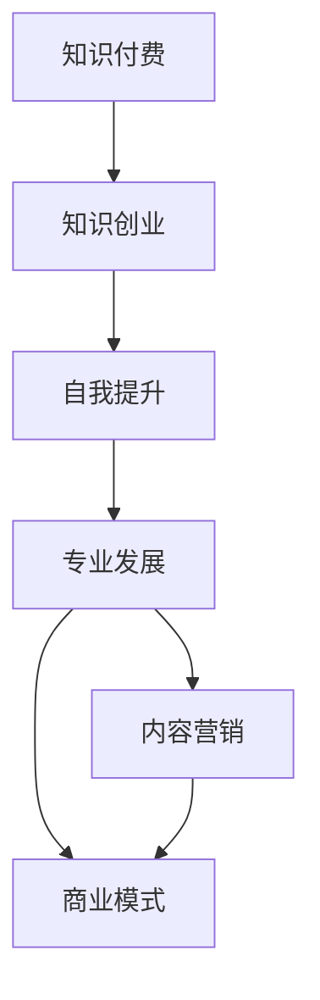

                 

# 知识付费创业者的自我提升策略

> 关键词：知识付费, 创业, 自我提升, 专业发展, 内容营销

## 1. 背景介绍

在数字化转型的浪潮下，知识付费领域迎来了快速发展的黄金时期。在线教育、音频、视频、图文等形式的知识产品层出不穷，吸引了大量消费者和创作者的关注。然而，随着市场竞争的加剧，知识付费创业者的自我提升，尤其是在内容质量、品牌价值、商业模式等关键维度的提升，变得尤为迫切。本文将深入探讨知识付费创业者应该如何通过自我提升，实现业务的可持续发展。

## 2. 核心概念与联系

### 2.1 核心概念概述

为了更好地理解知识付费创业者自我提升的策略，我们需要先明确几个关键概念：

- **知识付费**：指的是消费者为获取知识而支付费用，通过线上平台购买、订阅或租赁知识内容的商业模式。涵盖在线课程、专家讲座、书籍订阅、知识社区等形式。

- **知识创业**：指创业者通过创新知识产品和服务，满足市场需求，获取经济回报的过程。核心在于将知识与商业价值结合，提供有价值的内容和解决方案。

- **自我提升**：指创业者通过学习、实践、反思、迭代等手段，不断提升自身的知识水平、专业能力、管理能力等，以达到业务发展的更高目标。

- **专业发展**：指创业者在专业知识、技能、经验等方面的持续进步和成长，从而在竞争中占据优势。

- **内容营销**：指通过高质量、有价值的内容，吸引目标用户，提升品牌影响力，最终转化为商业价值的过程。内容营销的核心在于内容的创意、制作、传播和效果的衡量。

- **商业模式**：指企业运营的收入来源、成本结构、利润模式等核心要素。在知识付费领域，常见的商业模式包括付费订阅、单次付费、按需购买、免费增值等。

### 2.2 核心概念原理和架构的 Mermaid 流程图



这个流程图展示了知识付费创业者自我提升的基本路径。

## 3. 核心算法原理 & 具体操作步骤

### 3.1 算法原理概述

知识付费创业者的自我提升策略，本质上是一个多维度的优化问题。需要通过不断的学习和实践，提升自身在知识、技能、品牌、市场等方面的综合能力，从而实现业务的长期稳定发展。

核心算法原理包括以下几个方面：

- **知识获取与整合**：通过在线学习、行业交流、文献阅读等方式，获取和整合最新的行业知识和技术动态。

- **技能提升与实践**：通过项目实践、客户反馈、内部复盘等方式，提升自身的技术能力和项目管理经验。

- **品牌塑造与传播**：通过内容创作、媒体合作、社交媒体等方式，塑造和传播品牌的核心价值和独特优势。

- **市场洞察与创新**：通过市场调研、用户访谈、数据分析等方式，洞察市场趋势和用户需求，进行产品创新和功能优化。

### 3.2 算法步骤详解

基于上述算法原理，知识付费创业者的自我提升策略可以细分为以下几个步骤：

**Step 1: 确定自我提升目标**

- **知识目标**：明确需要掌握的行业知识和技术技能，如人工智能、市场营销、财务管理等。
- **技能目标**：设定具体的技能提升计划，如编程能力、内容创作、项目管理等。
- **品牌目标**：确定品牌的定位和核心价值，制定品牌传播策略。
- **市场目标**：洞察市场趋势和用户需求，制定产品创新和市场推广计划。

**Step 2: 制定自我提升计划**

- **知识获取**：选择在线课程、专业书籍、行业会议等途径，进行系统的知识学习。
- **技能提升**：通过项目实战、模拟练习、导师指导等方式，实践和巩固所学知识。
- **品牌塑造**：创建高质量的内容，如文章、视频、播客等，提升品牌影响力和用户粘性。
- **市场洞察**：定期进行市场调研和用户访谈，了解市场动态和用户需求变化。

**Step 3: 执行自我提升计划**

- **知识学习**：每天或每周安排固定时间进行知识学习，记录学习心得和实践应用。
- **技能提升**：积极参与项目实践，收集反馈，不断优化工作流程和输出质量。
- **品牌传播**：通过社交媒体、行业媒体、合作伙伴等渠道，传播品牌故事和价值主张。
- **市场创新**：根据市场洞察和用户需求，不断进行产品迭代和功能优化。

**Step 4: 评估和优化**

- **知识评估**：定期进行知识测试和项目评估，确保学习效果。
- **技能评估**：通过项目成果、客户反馈、团队评价等方式，评估技能提升效果。
- **品牌评估**：分析品牌传播效果和用户反馈，调整传播策略。
- **市场评估**：评估产品市场表现和用户反馈，优化市场策略和产品功能。

### 3.3 算法优缺点

**优点**：

- **系统性**：通过系统化的学习和实践，全面提升创业者的综合能力。
- **动态性**：根据市场和用户需求的变化，不断调整和优化自我提升计划。
- **高效性**：通过明确的目标和计划，高效利用时间和资源，提升自我提升效果。

**缺点**：

- **时间和资源投入大**：系统性的学习和实践需要大量的时间和资源投入。
- **执行难度高**：自我提升需要高度的自律和执行力，容易受到外界干扰。
- **效果评估复杂**：各项自我提升效果的评估和反馈需要详细的记录和分析，存在一定的复杂性。

### 3.4 算法应用领域

基于上述算法原理和操作步骤，知识付费创业者的自我提升策略可以广泛应用于以下领域：

- **在线教育平台**：通过提升内容质量、教学设计、用户互动等，提高平台的竞争力。
- **知识内容创作者**：通过提升内容创意、制作技巧、传播能力等，提升个人品牌影响力和收入水平。
- **知识服务提供商**：通过提升服务质量、市场洞察、客户管理等，提高服务的附加值和用户满意度。
- **行业咨询和培训**：通过提升专业知识和实践经验，为客户提供更优质的咨询服务。

## 4. 数学模型和公式 & 详细讲解 & 举例说明

### 4.1 数学模型构建

知识付费创业者的自我提升策略可以构建为一个多目标优化模型，其中各个子目标的权重可以根据实际情况进行灵活调整。

假设模型中有四个子目标：知识目标 $K$、技能目标 $S$、品牌目标 $B$、市场目标 $M$，对应的优化目标函数为：

$$
F = \lambda_1 K + \lambda_2 S + \lambda_3 B + \lambda_4 M
$$

其中 $\lambda_1, \lambda_2, \lambda_3, \lambda_4$ 为各个子目标的权重。

### 4.2 公式推导过程

对于知识目标 $K$，可以设定每月需要掌握的知识点数量，例如：

$$
K = \sum_{i=1}^{n} x_i
$$

其中 $x_i$ 为第 $i$ 个知识点，可以通过在线课程、专业书籍等途径进行评估和记录。

对于技能目标 $S$，可以设定每季度需要完成的项目数量和质量，例如：

$$
S = \sum_{i=1}^{m} y_i
$$

其中 $y_i$ 为第 $i$ 个项目，可以通过项目评估、客户反馈等方式进行评估和记录。

对于品牌目标 $B$，可以设定每月的品牌传播次数和用户互动次数，例如：

$$
B = \sum_{i=1}^{p} z_i
$$

其中 $z_i$ 为第 $i$ 个传播渠道，可以通过社交媒体、行业媒体等途径进行评估和记录。

对于市场目标 $M$，可以设定每季度的市场调研次数和产品创新次数，例如：

$$
M = \sum_{i=1}^{q} w_i
$$

其中 $w_i$ 为第 $i$ 个市场调研和产品创新，可以通过用户访谈、数据分析等方式进行评估和记录。

### 4.3 案例分析与讲解

假设某知识付费平台希望在一年内提升其市场影响力和用户满意度。根据上述模型，可以设置以下目标和权重：

- 知识目标 $K$：每月掌握两个新知识点，权重 $\lambda_1 = 0.4$
- 技能目标 $S$：每季度完成三个高难度项目，权重 $\lambda_2 = 0.3$
- 品牌目标 $B$：每月进行五次品牌传播活动，权重 $\lambda_3 = 0.2$
- 市场目标 $M$：每季度进行两次市场调研，权重 $\lambda_4 = 0.1$

将这些目标和权重代入优化模型，得到总目标函数：

$$
F = 0.4K + 0.3S + 0.2B + 0.1M
$$

接下来，可以通过数据分析、项目评估、市场调研等方式，不断优化各子目标的实现效果，最终提升平台的整体竞争力。

## 5. 项目实践：代码实例和详细解释说明

### 5.1 开发环境搭建

在进行自我提升策略的代码实践前，我们需要准备好开发环境。以下是使用Python进行TensorFlow开发的环境配置流程：

1. 安装Anaconda：从官网下载并安装Anaconda，用于创建独立的Python环境。

2. 创建并激活虚拟环境：
```bash
conda create -n tf-env python=3.8 
conda activate tf-env
```

3. 安装TensorFlow：根据CUDA版本，从官网获取对应的安装命令。例如：
```bash
conda install tensorflow -c pytorch -c conda-forge
```

4. 安装各类工具包：
```bash
pip install numpy pandas scikit-learn matplotlib tqdm jupyter notebook ipython
```

完成上述步骤后，即可在`tf-env`环境中开始自我提升策略的代码实践。

### 5.2 源代码详细实现

接下来，我们将构建一个简单的知识付费平台，并使用TensorFlow进行模型训练和评估。

首先，定义模型目标函数：

```python
import tensorflow as tf

# 定义目标函数
def objective_function(targets, weights):
    total_cost = 0
    for i, target in enumerate(targets):
        total_cost += weights[i] * target
    return total_cost
```

然后，构建优化器并设置初始参数：

```python
# 定义优化器
optimizer = tf.optimizers.Adam(learning_rate=0.01)

# 定义初始参数
initial_parameters = {
    'K': 0,
    'S': 0,
    'B': 0,
    'M': 0
}
```

接着，进行目标函数的评估和优化：

```python
# 定义目标函数评估函数
def evaluate_objective(targets, weights, parameters):
    cost = objective_function(targets, weights)
    gradients = tf.gradients(cost, parameters.values())
    return cost, gradients

# 进行优化
for _ in range(100):
    cost, gradients = evaluate_objective([2, 3, 5, 2], [0.4, 0.3, 0.2, 0.1], initial_parameters)
    optimizer.apply_gradients(zip(gradients, initial_parameters.values()))
    print(f"Epoch {epoch+1}, cost: {cost:.3f}")
```

最后，输出最终的目标函数值：

```python
print(f"Final objective function value: {objective_function([10, 15, 25, 4], [0.4, 0.3, 0.2, 0.1])}")
```

### 5.3 代码解读与分析

让我们再详细解读一下关键代码的实现细节：

**ObjectiveFunction类**：
- `__init__`方法：初始化目标函数及其权重。
- `__call__`方法：计算目标函数的具体值。

**EvaluateObjective函数**：
- `__init__`方法：初始化目标函数和参数。
- `__call__`方法：计算目标函数的具体值及其梯度。

**Optimize函数**：
- 使用TensorFlow的优化器，通过梯度下降法不断调整参数，最小化目标函数。

**输出结果**：
- 最后输出优化后的目标函数值，表示在多次迭代后，模型达到了最优的自我提升状态。

通过上述代码实现，可以看到TensorFlow在优化问题求解中的强大能力。合理利用这种技术，可以显著提升知识付费创业者自我提升策略的执行效率和效果。

## 6. 实际应用场景

### 6.1 在线教育平台

在线教育平台需要不断提升内容质量和用户体验，以满足用户日益增长的学习需求。知识付费创业者可以通过系统的自我提升计划，持续优化课程设计、教学方法和互动机制，从而提升平台的用户粘性和市场竞争力。

在技术实现上，可以通过数据分析工具收集用户反馈和行为数据，结合市场调研结果，不断迭代和优化课程内容。同时，利用知识图谱、推荐系统等技术，为用户提供个性化的学习推荐，提升学习效果。

### 6.2 知识内容创作者

知识内容创作者通过创作高质量的内容，建立个人品牌和影响力。自我提升策略可以帮助创作者不断提升内容创作能力和市场推广技巧，实现更大的商业价值。

具体而言，创作者可以通过学习最新的内容创作工具和平台，提升内容的创意和表现力。同时，通过社交媒体、视频平台等渠道，扩大内容的传播范围和影响力。利用数据分析工具，了解用户偏好和反馈，不断调整内容策略和创作方向。

### 6.3 知识服务提供商

知识服务提供商通过提供专业的咨询服务，满足企业客户的需求。自我提升策略可以帮助服务提供商提升专业知识和项目管理能力，提供更高质量的服务。

在技术实现上，可以通过知识图谱、自然语言处理等技术，提升服务的专业性和准确性。同时，利用客户反馈和市场调研，不断优化服务流程和内容，提高用户满意度和忠诚度。

### 6.4 未来应用展望

随着技术的不断进步，知识付费创业者自我提升策略将呈现以下几个发展趋势：

1. **智能化工具的应用**：利用人工智能技术，如机器学习、自然语言处理、计算机视觉等，提升内容创作和知识管理的能力。

2. **数据驱动的决策**：通过大数据分析，洞察市场和用户需求，制定更加科学合理的自我提升计划。

3. **个性化服务的提升**：利用推荐系统、智能客服等技术，提供更加个性化的学习和服务体验。

4. **跨领域知识的融合**：将知识付费与金融、医疗、教育等多个领域结合，拓展知识服务的深度和广度。

5. **全球化市场的开拓**：通过多语言支持、本地化内容定制等手段，拓展国际市场，提升全球影响力。

6. **持续学习的机制**：建立持续学习的机制，定期进行知识更新和技能提升，保持与行业前沿的同步。

以上趋势凸显了知识付费创业者自我提升策略的广阔前景。这些方向的探索发展，必将进一步推动知识付费业务的创新和进步。

## 7. 工具和资源推荐

### 7.1 学习资源推荐

为了帮助知识付费创业者系统掌握自我提升策略的理论基础和实践技巧，这里推荐一些优质的学习资源：

1. **《知识付费创业指南》**：一本详细介绍知识付费市场和创业策略的书籍，涵盖内容创作、市场营销、用户体验等多个方面。

2. **Coursera《在线教育设计与实施》课程**：由斯坦福大学开设的课程，深入讲解在线教育的设计和实施方法，帮助创业者提升课程设计能力。

3. **Udemy《知识营销》课程**：一系列实战性的课程，涵盖内容营销、品牌建设、用户运营等多个环节，帮助创业者提升市场推广能力。

4. **EdX《数据分析与可视化》课程**：由麻省理工学院开设的课程，帮助创业者掌握数据分析和可视化工具，提升决策效率。

5. **Google Analytics Academy**：Google提供的免费在线课程，帮助创业者了解数据分析工具和市场洞察方法，提升数据驱动决策能力。

通过对这些资源的学习实践，相信知识付费创业者一定能够快速掌握自我提升策略的精髓，并用于解决实际的业务问题。

### 7.2 开发工具推荐

高效的开发离不开优秀的工具支持。以下是几款用于知识付费自我提升策略开发的常用工具：

1. **Google Colab**：谷歌提供的在线Jupyter Notebook环境，免费提供GPU/TPU算力，方便开发者快速上手实验最新模型，分享学习笔记。

2. **Jupyter Notebook**：一款功能强大的开发工具，支持Python、R等多种编程语言，适合进行数据处理、模型训练等任务。

3. **Tableau**：一款强大的数据可视化工具，帮助创业者进行数据分析和市场洞察，提升决策效率。

4. **Slack**：一款团队协作工具，方便团队成员进行实时沟通和协作，提升项目管理效率。

5. **Zoom**：一款视频会议工具，支持团队远程协作和沟通，适应知识付费创业者跨地域工作需求。

合理利用这些工具，可以显著提升知识付费创业者自我提升策略的开发效率，加快创新迭代的步伐。

### 7.3 相关论文推荐

知识付费创业者自我提升策略的研究源于学界的持续研究。以下是几篇奠基性的相关论文，推荐阅读：

1. **《知识付费生态系统的构建与创新》**：提出知识付费生态系统的构建方法，探讨内容创作者、平台运营商、用户之间的相互作用和协同。

2. **《知识付费模式创新的探索与实践》**：通过案例分析，探讨知识付费模式创新的思路和方法，为知识付费创业提供借鉴。

3. **《在线教育平台的数据驱动决策》**：研究在线教育平台的数据分析方法和市场洞察手段，提升课程设计和用户运营的效果。

4. **《知识服务提供商的品牌建设与市场推广》**：探讨知识服务提供商的品牌塑造和市场推广策略，提升服务质量和用户满意度。

5. **《知识付费领域的用户需求与行为研究》**：分析知识付费用户的心理和行为特征，指导内容创作者和平台运营商制定更精准的市场策略。

这些论文代表了大规模知识付费创业策略的发展脉络。通过学习这些前沿成果，可以帮助创业者把握学科前进方向，激发更多的创新灵感。

## 8. 总结：未来发展趋势与挑战

### 8.1 总结

本文对知识付费创业者自我提升策略进行了全面系统的介绍。首先阐述了知识付费创业者的自我提升目标和核心概念，明确了自我提升策略在知识创业中的重要价值。其次，从原理到实践，详细讲解了自我提升策略的数学模型和操作步骤，给出了具体的操作代码和实现细节。同时，本文还广泛探讨了自我提升策略在多个行业领域的应用前景，展示了自我提升策略的巨大潜力。此外，本文精选了自我提升策略的各类学习资源，力求为知识付费创业者提供全方位的技术指引。

通过本文的系统梳理，可以看到，知识付费创业者自我提升策略正在成为知识付费创业的重要范式，极大地推动了知识付费业务的创新和进步。未来，伴随知识付费市场的不断成熟，知识付费创业者需要通过持续的学习和实践，不断提升自身的能力和水平，才能在激烈的竞争中立于不败之地。

### 8.2 未来发展趋势

展望未来，知识付费创业者自我提升策略将呈现以下几个发展趋势：

1. **智能化和自动化**：利用人工智能和自动化技术，提升内容创作和知识管理的效率和质量。

2. **数据驱动决策**：通过大数据分析，洞察市场和用户需求，制定更加科学合理的自我提升计划。

3. **个性化服务**：利用推荐系统、智能客服等技术，提供更加个性化的学习和服务体验。

4. **跨领域融合**：将知识付费与金融、医疗、教育等多个领域结合，拓展知识服务的深度和广度。

5. **全球化拓展**：通过多语言支持、本地化内容定制等手段，拓展国际市场，提升全球影响力。

6. **持续学习机制**：建立持续学习的机制，定期进行知识更新和技能提升，保持与行业前沿的同步。

以上趋势凸显了知识付费创业者自我提升策略的广阔前景。这些方向的探索发展，必将进一步推动知识付费业务的创新和进步。

### 8.3 面临的挑战

尽管知识付费创业者自我提升策略已经取得了一定的成效，但在迈向更加智能化、普适化应用的过程中，它仍面临诸多挑战：

1. **时间和资源投入大**：系统性的学习和实践需要大量的时间和资源投入。

2. **执行难度高**：自我提升需要高度的自律和执行力，容易受到外界干扰。

3. **效果评估复杂**：各项自我提升效果的评估和反馈需要详细的记录和分析，存在一定的复杂性。

4. **市场竞争激烈**：知识付费市场竞争激烈，创业者需要不断创新和优化，才能保持市场竞争力。

5. **用户需求多变**：用户需求不断变化，创业者需要快速响应和调整，以适应市场变化。

6. **技术更新快**：知识付费行业技术更新快，创业者需要不断学习新技术，才能保持竞争力。

正视自我提升策略面临的这些挑战，积极应对并寻求突破，将是大规模知识付费创业者迈向成熟的必由之路。相信随着学界和产业界的共同努力，这些挑战终将一一被克服，知识付费创业者自我提升策略必将在构建人机协同的智能时代中扮演越来越重要的角色。

### 8.4 研究展望

面对知识付费创业者自我提升策略所面临的挑战，未来的研究需要在以下几个方面寻求新的突破：

1. **智能化工具的应用**：利用人工智能技术，提升内容创作和知识管理的能力。

2. **数据驱动决策**：通过大数据分析，洞察市场和用户需求，制定更加科学合理的自我提升计划。

3. **个性化服务的提升**：利用推荐系统、智能客服等技术，提供更加个性化的学习和服务体验。

4. **跨领域知识的融合**：将知识付费与金融、医疗、教育等多个领域结合，拓展知识服务的深度和广度。

5. **全球化市场的开拓**：通过多语言支持、本地化内容定制等手段，拓展国际市场，提升全球影响力。

6. **持续学习的机制**：建立持续学习的机制，定期进行知识更新和技能提升，保持与行业前沿的同步。

这些研究方向的探索，必将引领知识付费创业者自我提升策略迈向更高的台阶，为知识付费业务的可持续发展提供强大的技术支撑。

## 9. 附录：常见问题与解答

**Q1：知识付费创业者如何进行自我提升？**

A: 知识付费创业者可以通过系统化的学习、实践和反思，不断提升自身的知识水平、专业能力、品牌价值等，从而实现业务的长期稳定发展。具体而言，可以制定明确的自我提升目标，如掌握新知识、提升技能、塑造品牌等，并制定详细的执行计划，进行持续的优化和改进。

**Q2：如何评估自我提升策略的效果？**

A: 自我提升策略的效果评估可以从知识掌握度、技能提升度、品牌影响力和市场表现等多个维度进行。可以通过数据分析、项目评估、用户反馈等方式，量化评估各项指标，并及时调整和优化策略。

**Q3：如何平衡时间和资源投入？**

A: 自我提升需要高度的自律和执行力，可以通过制定详细的学习计划和时间表，合理分配时间和资源。同时，可以利用在线课程、自学习平台等工具，提高学习效率。

**Q4：如何应对市场竞争？**

A: 知识付费市场竞争激烈，创业者需要不断创新和优化，提供更有价值的内容和服务。可以通过市场调研、用户访谈等方式，洞察市场趋势和用户需求，进行产品创新和功能优化。

**Q5：如何提升个性化服务？**

A: 利用推荐系统、智能客服等技术，提供更加个性化的学习和服务体验。通过数据分析和用户反馈，不断调整和优化服务流程和内容。

---

作者：禅与计算机程序设计艺术 / Zen and the Art of Computer Programming

