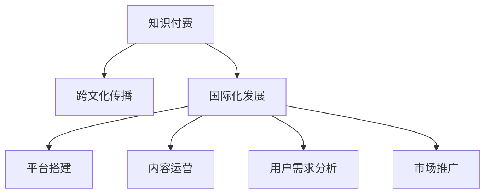

                 

# 知识付费如何实现跨文化传播与国际化发展？

在数字化时代，知识的传播和共享方式正在发生深刻变革。知识付费作为新兴的互联网商业模式，正迅速崛起，成为推动知识文化跨越国界传播和国际化发展的重要力量。本文将深入探讨知识付费如何实现跨文化传播与国际化发展，涵盖其背景、核心概念、算法原理、操作步骤、实际应用场景、未来展望和挑战等方面，为相关领域的从业者提供全面的指导。

## 1. 背景介绍

### 1.1 知识付费的兴起

随着互联网技术的发展和普及，知识付费平台如雨后春笋般涌现，知识变现成为可能。知识付费的兴起，本质上源于人们对知识和信息获取需求的增长，以及对碎片化、即时化信息的高效需求。相较于传统的图书、期刊等知识传播方式，知识付费以其互动性强、成本低廉、内容丰富等特点，吸引了大量用户。

### 1.2 跨文化传播的必要性

在全球化背景下，不同文化之间的交流与融合日益频繁。知识付费作为国际化的知识传播方式，能够跨越地域和语言的界限，让更多人享受到世界各地的优质知识资源。这不仅有助于文化的全球化传播，还能促进不同文化的深度交流与融合。

## 2. 核心概念与联系

### 2.1 核心概念概述

为了更好地理解知识付费在跨文化传播和国际化发展中的作用，本节将介绍几个关键概念及其联系。

- **知识付费**：用户为获取特定知识和信息而支付费用的模式，包括订阅、单次购买、打赏等多种形式。
- **跨文化传播**：跨越不同文化背景和地域界限的知识传播过程。
- **国际化发展**：知识付费平台在全球范围内的扩张和本地化运营，实现国际化市场布局和国际化服务。
- **平台搭建**：构建知识付费平台的技术基础，包括前端、后端、数据库、支付系统等。
- **内容运营**：知识付费平台的核心，包括内容策划、编辑、分发、营销等环节。
- **用户需求分析**：通过数据分析手段，挖掘用户需求，优化内容和服务。
- **市场推广**：通过各种渠道和方法，提升知识付费平台的知名度和用户覆盖率。

这些核心概念之间的逻辑关系可以通过以下Mermaid流程图来展示：



这个流程图展示出知识付费通过平台搭建、内容运营、用户需求分析和市场推广等环节，实现了跨文化传播和国际化发展的路径。

## 3. 核心算法原理 & 具体操作步骤

### 3.1 算法原理概述

知识付费的跨文化传播与国际化发展，本质上是一个复杂的系统工程。其核心算法原理可以概括为：

- **个性化推荐算法**：根据用户行为数据，推荐适合其兴趣和需求的课程和内容。
- **内容质量评估算法**：通过用户反馈和机器学习，评估课程和内容的质量和受欢迎程度。
- **市场分析与预测算法**：分析市场需求和趋势，预测课程和内容的商业价值。
- **全球化运营管理算法**：针对不同市场和文化，制定本地化运营策略和管理方案。

### 3.2 算法步骤详解

**Step 1: 平台搭建**
- 选择合适的技术栈，如前端框架React、Vue，后端框架Spring Boot、Django等。
- 构建高性能的数据库系统，支持用户数据和内容数据的存储和查询。
- 集成支付系统，支持用户支付和退款功能。
- 部署CDN和云服务，确保平台的高可用性和扩展性。

**Step 2: 内容运营**
- 策划课程和内容，涵盖热门领域和新兴领域，满足用户多样化的需求。
- 编辑和审核内容，确保内容的准确性和权威性。
- 分发内容，通过平台推荐、社交媒体、邮件营销等多种渠道，扩大内容的覆盖范围。
- 营销推广，利用SEO、社交媒体、KOL等手段，提升平台的知名度和用户增长。

**Step 3: 用户需求分析**
- 收集用户行为数据，包括浏览记录、学习进度、评价反馈等。
- 使用数据分析工具，如Google Analytics、Apache Spark等，挖掘用户需求和行为模式。
- 根据分析结果，优化课程和内容，提升用户体验。

**Step 4: 市场推广**
- 分析目标市场的用户特征和需求，制定市场推广策略。
- 选择合适的渠道，如Google Ads、Facebook Ads等，投放广告。
- 利用SEO优化网站，提升搜索引擎排名，吸引更多自然流量。
- 参与行业活动和展会，提升平台的品牌影响力。

### 3.3 算法优缺点

知识付费的跨文化传播与国际化发展算法具有以下优点：
1. **高效性**：通过算法驱动，可以快速推荐高质量内容，满足用户需求。
2. **灵活性**：算法可以根据市场变化和用户反馈，动态调整策略和内容。
3. **可扩展性**：算法架构易于扩展，可以支持多语言、多文化、多市场运营。

同时，该算法也存在一定的局限性：
1. **复杂性**：算法模型和数据处理复杂，需要高水平的技术团队支持。
2. **冷启动问题**：新平台或新市场，初期用户和内容积累不足，算法推荐效果有限。
3. **数据隐私**：用户行为数据隐私保护，需要严格的法律法规和技术措施。

### 3.4 算法应用领域

知识付费的跨文化传播与国际化发展算法广泛应用于以下几个领域：

- **在线教育**：通过推荐个性化课程，提升学习效果和用户体验。
- **职业培训**：针对不同行业需求，提供定制化培训课程。
- **知识分享**：汇聚全球知识创作者，分享各自领域的知识和经验。
- **文化交流**：通过跨文化内容推荐，促进不同文化之间的理解和交流。
- **信息服务**：提供实时动态新闻、报告和研究，满足用户深度学习需求。

这些应用领域展示了知识付费在跨文化传播和国际化发展中的广泛潜力。

## 4. 数学模型和公式 & 详细讲解 & 举例说明

### 4.1 数学模型构建

知识付费的跨文化传播与国际化发展算法涉及多种数学模型，包括推荐系统、文本分类、情感分析等。以推荐系统为例，其数学模型可以表示为：

$$
y = \phi(x; \theta)
$$

其中 $y$ 为用户对内容的评分，$x$ 为用户的行为数据，$\phi$ 为推荐模型，$\theta$ 为模型参数。

### 4.2 公式推导过程

以协同过滤推荐算法为例，其公式推导过程如下：

设用户 $i$ 对 $j$ 内容的评分向量为 $r_{i,j}$，用户行为矩阵为 $R$。协同过滤算法基于用户历史评分数据，计算用户和内容的相似度，推荐用户可能感兴趣的内容。其基本公式为：

$$
\hat{r}_{i,j} = \alpha \sum_k r_{i,k}r_{k,j} + \beta f_j
$$

其中 $\alpha$ 为用户-物品相似度加权系数，$\beta$ 为物品特征加权系数，$f_j$ 为物品特征向量。

### 4.3 案例分析与讲解

以Coursera为例，其知识付费平台通过协同过滤和内容质量评估算法，实现了高效的内容推荐和国际化发展。Coursera不仅支持全球范围内的课程购买和订阅，还通过数据分析和用户反馈，不断优化课程内容和推荐算法，提升用户满意度和平台收益。

## 5. 项目实践：代码实例和详细解释说明

### 5.1 开发环境搭建

在开发知识付费平台时，需要搭建前端、后端、数据库和支付系统。以下是一个简化的开发环境搭建流程：

1. **前端搭建**：选择React或Vue框架，搭建前端UI和用户交互界面。
2. **后端搭建**：选择Spring Boot或Django框架，搭建后端服务逻辑和API接口。
3. **数据库搭建**：选择MySQL或PostgreSQL数据库，搭建用户数据和内容数据存储。
4. **支付系统搭建**：选择Stripe或Alipay支付系统，实现用户支付和退款功能。

### 5.2 源代码详细实现

以下是一个使用Python Flask框架搭建知识付费平台的示例代码：

```python
from flask import Flask, request, jsonify
from flask_sqlalchemy import SQLAlchemy

app = Flask(__name__)
app.config['SQLALCHEMY_DATABASE_URI'] = 'sqlite:///user_data.db'
db = SQLAlchemy(app)

class User(db.Model):
    id = db.Column(db.Integer, primary_key=True)
    name = db.Column(db.String(50))
    email = db.Column(db.String(50))
    password = db.Column(db.String(50))
    purchase_history = db.relationship('PurchaseHistory', backref='user', lazy=True)

class PurchaseHistory(db.Model):
    id = db.Column(db.Integer, primary_key=True)
    user_id = db.Column(db.Integer, db.ForeignKey('user.id'))
    course_id = db.Column(db.Integer, db.ForeignKey('course.id'))
    purchase_time = db.Column(db.DateTime, default=datetime.now)

@app.route('/login', methods=['POST'])
def login():
    data = request.get_json()
    email = data.get('email')
    password = data.get('password')
    user = User.query.filter_by(email=email, password=password).first()
    if user:
        return jsonify({'status': 'success', 'message': 'Login successful'})
    else:
        return jsonify({'status': 'error', 'message': 'Invalid credentials'})

@app.route('/courses', methods=['GET'])
def get_courses():
    courses = Course.query.all()
    courses_list = [{'id': course.id, 'name': course.name, 'description': course.description} for course in courses]
    return jsonify({'courses': courses_list})
```

### 5.3 代码解读与分析

上述代码展示了使用Python Flask框架搭建知识付费平台的基本流程：

1. **数据库模型定义**：定义User和PurchaseHistory两个模型，分别表示用户和购买历史数据。
2. **路由定义**：定义登录接口和获取课程接口的路由，接收用户请求并返回JSON格式的数据。
3. **数据查询**：通过SQLAlchemy查询数据库中的用户和课程数据，并将其转换为JSON格式返回。

### 5.4 运行结果展示

运行上述代码，可以搭建一个简单的知识付费平台，并支持用户登录和获取课程信息。通过进一步的开发，可以实现更多的功能，如课程购买、支付、评价等。

## 6. 实际应用场景

### 6.1 在线教育平台

在线教育平台如Coursera、Udemy等，通过知识付费模式，提供全球范围内的优质课程和培训。这些平台通过个性化推荐算法，推荐用户感兴趣的内容，通过全球化运营策略，覆盖不同国家和市场。

### 6.2 职业培训平台

职业培训平台如LinkedIn Learning、Skillshare等，通过知识付费模式，提供针对不同行业的职业培训课程。这些平台通过数据分析和用户反馈，不断优化课程内容和推荐算法，满足用户的职业发展需求。

### 6.3 知识分享平台

知识分享平台如Medium、ResearchGate等，通过知识付费模式，汇聚全球知识创作者，分享各自领域的知识和经验。这些平台通过国际化运营策略，提升全球用户覆盖率和知识传播范围。

## 7. 工具和资源推荐

### 7.1 学习资源推荐

为了帮助开发者系统掌握知识付费的跨文化传播与国际化发展技术，这里推荐一些优质的学习资源：

1. **Coursera官方文档**：Coursera的知识付费平台运营指南，涵盖平台搭建、内容运营、市场推广等环节。
2. **Udemy开发者手册**：Udemy的知识付费平台开发教程，涵盖Python、Flask、SQLAlchemy等技术栈的使用。
3. **Medium开发者博客**：Medium的知识分享平台运营经验，涵盖用户需求分析、内容分发、市场推广等环节。
4. **LinkedIn Learning开发者手册**：LinkedIn Learning的知识付费平台运营指南，涵盖职业培训课程的开发和推广。
5. **Google Cloud Platform文档**：Google Cloud平台的全球化运营解决方案，涵盖云服务、数据分析、市场推广等技术支持。

### 7.2 开发工具推荐

高效的开发离不开优秀的工具支持。以下是几款用于知识付费平台开发的常用工具：

1. **Flask**：Python轻量级Web框架，适合搭建小规模知识付费平台。
2. **Django**：Python全栈Web框架，适合搭建中大规模知识付费平台。
3. **React**：前端JavaScript库，适合构建用户交互界面。
4. **Vue**：前端JavaScript库，适合构建单页面应用。
5. **SQLAlchemy**：Python ORM框架，适合搭建数据库。
6. **Stripe**：全球支付系统，适合集成支付功能。
7. **Google Analytics**：数据分析工具，适合用户行为数据分析。
8. **Apache Spark**：大数据处理框架，适合大规模数据处理。

### 7.3 相关论文推荐

知识付费的跨文化传播与国际化发展研究源于学界的持续研究。以下是几篇奠基性的相关论文，推荐阅读：

1. **Recommender Systems: A Survey**：对推荐系统算法进行全面综述，涵盖协同过滤、内容推荐等方法。
2. **A Survey on Cross-Cultural Recommendation Systems**：对跨文化推荐系统进行全面综述，涵盖文化差异、用户偏好等影响因素。
3. **Internationalization of Learning Management Systems**：对在线教育平台国际化运营进行综述，涵盖平台搭建、内容运营等环节。
4. **User-Generated Content Analysis in Online Learning Platforms**：对在线教育平台的用户生成内容进行分析，涵盖数据挖掘、情感分析等方法。
5. **Globalized E-Learning**：对在线教育平台的全球化运营进行探讨，涵盖市场推广、用户需求分析等环节。

## 8. 总结：未来发展趋势与挑战

### 8.1 总结

本文对知识付费的跨文化传播与国际化发展算法进行了全面系统的介绍。首先阐述了知识付费兴起背景和跨文化传播的必要性，明确了平台搭建、内容运营、用户需求分析和市场推广等核心环节。其次，从原理到实践，详细讲解了算法驱动下的个性化推荐、内容质量评估、市场分析和全球化运营等关键步骤，给出了知识付费平台开发的完整代码实例。同时，本文还广泛探讨了知识付费平台在在线教育、职业培训、知识分享等诸多领域的应用前景，展示了其在跨文化传播和国际化发展中的巨大潜力。

通过本文的系统梳理，可以看到，知识付费通过算法驱动，实现了高效的内容推荐和灵活的市场策略，有效推动了跨文化传播和国际化发展。未来，伴随技术的不断进步和市场需求的拓展，知识付费必将在更多领域实现突破，推动全球知识文化的繁荣发展。

### 8.2 未来发展趋势

展望未来，知识付费的跨文化传播与国际化发展将呈现以下几个趋势：

1. **数据驱动决策**：通过大数据分析和机器学习，实时调整推荐算法和市场策略，实现精细化运营。
2. **本地化内容生产**：针对不同市场和文化，生产本地化的优质内容，提升用户满意度和平台黏性。
3. **多渠道分发**：通过社交媒体、视频平台、播客等多种渠道，扩大内容传播范围，提升平台覆盖率。
4. **国际化运营平台**：构建全球化的学习管理系统，支持多语言、多文化、多货币支付，实现全球用户覆盖。
5. **个性化学习路径**：通过分析用户学习行为，制定个性化学习路径，提升学习效果和用户体验。
6. **跨平台合作**：与其他在线教育平台、职业培训平台等进行合作，整合资源，提升平台竞争力。

这些趋势凸显了知识付费在跨文化传播和国际化发展中的广阔前景。这些方向的探索发展，必将进一步提升知识付费平台的性能和用户覆盖率，为全球知识文化的繁荣发展贡献力量。

### 8.3 面临的挑战

尽管知识付费的跨文化传播与国际化发展算法取得了显著成就，但在迈向更加智能化、普适化应用的过程中，它仍面临着诸多挑战：

1. **数据隐私保护**：用户行为数据隐私保护，需要严格的法律法规和技术措施。
2. **平台本地化运营**：针对不同市场和文化，进行本地化运营和市场推广，面临巨大挑战。
3. **技术架构复杂**：跨文化传播与国际化发展算法涉及多种技术栈和数据处理，需要高水平的技术团队支持。
4. **内容质量控制**：如何保证高质量的内容生产，满足全球用户需求，是知识付费平台需要解决的重要问题。
5. **市场竞争激烈**：面对众多在线教育平台、职业培训平台等竞争者，知识付费平台需要不断创新和优化，提升竞争力。

### 8.4 研究展望

面对知识付费平台跨文化传播与国际化发展所面临的挑战，未来的研究需要在以下几个方面寻求新的突破：

1. **数据隐私保护技术**：研究数据隐私保护技术，如差分隐私、联邦学习等，确保用户数据安全。
2. **本地化内容生产策略**：研究本地化内容生产策略，如跨文化内容推荐、本地化课程设计等，提升用户满意度和平台黏性。
3. **技术架构优化**：研究技术架构优化方法，如微服务架构、无服务器架构等，提高平台性能和扩展性。
4. **内容质量评估算法**：研究内容质量评估算法，如情感分析、用户评价等，提升内容质量和用户体验。
5. **市场推广策略**：研究市场推广策略，如社交媒体营销、内容营销等，提升平台覆盖率和用户增长。

这些研究方向的探索，必将引领知识付费平台迈向更高的台阶，为全球知识文化的繁荣发展提供技术支持。

## 9. 附录：常见问题与解答

**Q1: 知识付费平台的推荐算法有哪些？**

A: 知识付费平台的推荐算法主要包括协同过滤、基于内容的推荐、混合推荐等。协同过滤算法通过用户历史评分数据，推荐用户可能感兴趣的内容。基于内容的推荐算法通过分析课程内容和用户偏好，推荐相似课程。混合推荐算法综合多种推荐算法，提升推荐效果。

**Q2: 如何保证知识付费平台的内容质量？**

A: 知识付费平台可以通过内容审核、用户反馈、课程评价等多种手段，保证课程和内容的质量。平台可以通过专家审核，筛选高质量的课程和内容。用户可以通过课程评价和反馈，提供课程质量建议。课程可以通过用户评分和课程评价，客观评估课程质量。

**Q3: 如何实现知识付费平台的国际化运营？**

A: 知识付费平台可以通过多语言支持、本地化课程内容、本地化市场推广等手段，实现国际化运营。平台可以使用多语言支持技术，如翻译API、本地化标签等，提升平台的国际化覆盖率。平台可以针对不同市场，生产本地化的高质量课程内容。平台可以通过本地化的市场推广策略，提升平台的国际化用户覆盖率。

---

作者：禅与计算机程序设计艺术 / Zen and the Art of Computer Programming

