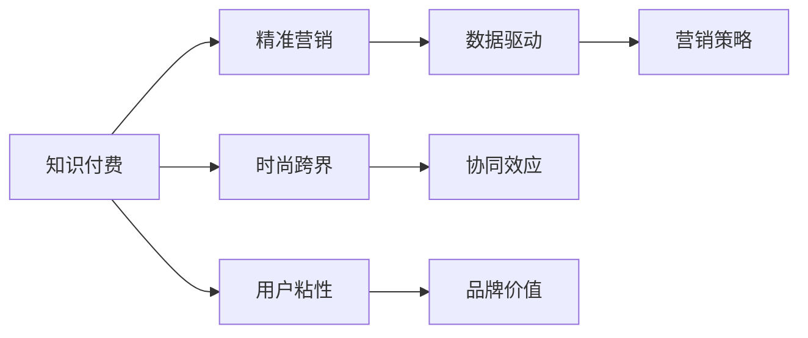
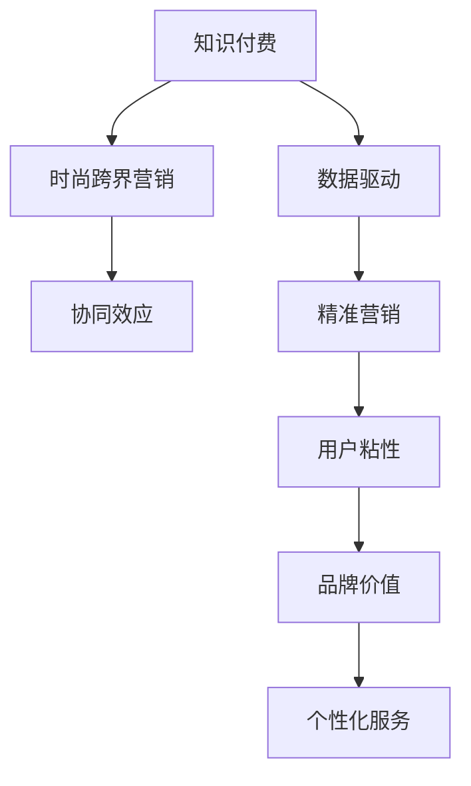

                 

# 知识付费如何实现跨界营销与时尚跨界？

## 1. 背景介绍

在数字化浪潮席卷下，知识付费与时尚行业的跨界营销已渐成趋势。知识付费依托于用户对知识和技能的需求，快速成长为市场的新蓝海。而时尚产业，作为全球最大的消费市场之一，其巨大潜力和广泛受众，与知识付费的精准定位相得益彰。

本论文将从市场营销、消费者心理、数据驱动和协同效应等多个维度深入探讨知识付费与时尚跨界营销的可行性及实现路径，并给出可操作性强的实战方案。通过将知识付费作为营销工具，时尚品牌可以实现用户深度连接、品牌价值共创，进一步推动其商业模式的创新与变革。

## 2. 核心概念与联系

### 2.1 核心概念概述

为全面理解知识付费与时尚跨界营销的原理与方法，需先明确几个核心概念：

- **知识付费**：基于在线教育和内容服务，用户为获取知识、技能、经验等付费的一种新型消费模式。平台提供个性化、高质量、有价值的知识内容，满足用户成长需求。
- **时尚跨界营销**：时尚品牌跨出传统服饰界线，通过与其他领域（如科技、健康、教育等）的融合，打破界限，实现差异化市场竞争，提升品牌知名度和用户粘性。
- **数据驱动**：利用大数据和人工智能技术，精准分析用户行为、偏好和趋势，优化营销策略，实现个性化推荐和预测，提高营销效率和ROI。
- **协同效应**：各领域间通过资源整合、技术融合和用户共创，实现多方共赢，提升整体价值与竞争力。

这些核心概念紧密关联，共同构成了知识付费与时尚跨界营销的实践基础，其逻辑关系如图1所示：



### 2.2 核心概念原理和架构的 Mermaid 流程图

以下是知识付费与时尚跨界营销的Mermaid流程图，展示了各概念间的连接和互动关系：



## 3. 核心算法原理 & 具体操作步骤

### 3.1 算法原理概述

知识付费与时尚跨界营销的核心在于数据的洞察和应用，通过算法优化用户体验和品牌效益。以用户行为数据分析为基础，结合机器学习、推荐系统等技术，构建精准营销策略，实现跨界突破。

### 3.2 算法步骤详解

#### 3.2.1 用户行为数据分析

- 数据收集：利用Web数据挖掘和日志分析工具，收集用户在知识付费平台和时尚品牌网站上的行为数据，包括浏览记录、点击率、购买行为、评论反馈等。
- 数据预处理：对数据进行清洗、归一化、去重等预处理，提高数据质量。
- 特征提取：从行为数据中提取有价值的信息特征，如浏览偏好、消费习惯、付费意愿等。

#### 3.2.2 用户画像构建

- 用户聚类：采用K-means、层次聚类等算法对用户进行聚类分组，形成具有相似特征的用户群体。
- 用户画像：构建详尽的用户画像，涵盖人口统计、兴趣偏好、消费能力等维度，为精准营销提供依据。

#### 3.2.3 推荐系统优化

- 协同过滤算法：采用基于用户的协同过滤算法，通过分析用户之间的行为相似性，推荐个性化知识内容和时尚商品。
- 深度学习算法：使用DeepFM、CTR等深度学习模型，进一步提升推荐系统的效果，减少用户流失率。

#### 3.2.4 营销策略制定

- 基于用户画像和行为数据，设计个性化的营销策略，如优惠券、推荐商品、定制内容等。
- 结合时尚品牌特性，调整营销语言和视觉风格，增加用户共鸣。

#### 3.2.5 营销效果评估

- 采用A/B测试、KPI指标等方法评估营销效果，不断优化策略。
- 分析用户反馈和行为数据，持续迭代提升用户满意度和品牌忠诚度。

### 3.3 算法优缺点

#### 3.3.1 优点

- **精准度提升**：通过数据驱动和推荐算法，大幅提升营销活动的精准度，减少资源浪费。
- **用户粘性增强**：个性化的内容和推荐，使用户在知识付费平台和时尚品牌的互动更频繁，提升粘性。
- **品牌效应放大**：跨界营销突破单一领域界限，借助其他领域的用户和资源，迅速提升品牌影响力。

#### 3.3.2 缺点

- **数据隐私**：需要大量用户行为数据，涉及隐私保护问题。
- **算法复杂性**：构建和维护复杂推荐系统，技术门槛较高。
- **成本投入**：初期数据收集和系统构建成本较高，需大量投入。

### 3.4 算法应用领域

知识付费与时尚跨界营销的应用场景广泛，涉及多个领域：

- **教育培训**：教育机构通过知识付费平台推广其课程，吸引用户注册学习。
- **时尚品牌**：品牌推出特别定制的时尚课程，吸引目标客户群体。
- **健康生活**：健康品牌结合知识付费平台，推出营养和健身课程，吸引健康意识较强的用户。
- **科技资讯**：科技公司提供前沿科技课程，吸引技术爱好者，提升品牌科技感。

## 4. 数学模型和公式 & 详细讲解 & 举例说明

### 4.1 数学模型构建

在知识付费与时尚跨界营销中，常用以下数学模型：

- 协同过滤（Collaborative Filtering）：$R_{ui} = \sum_{j=1}^{n} p_{uj}q_{ji}$
- 深度学习模型（如DeepFM）：$\hat{y} = W_0 + \sum_{k=1}^{K} W_kf_k(x) + \sum_{k=1}^{K} \sum_{j=1}^{n} W_{kj}g_j(z_i)$

### 4.2 公式推导过程

#### 4.2.1 协同过滤模型推导

协同过滤模型基于用户-物品评分矩阵 $R$，通过分解得到用户特征 $p_u$ 和物品特征 $q_j$，然后计算用户对物品的预测评分 $R_{ui}$。

设用户 $u$ 对物品 $i$ 的评分向量为 $r_{iu}$，物品 $i$ 的特征向量为 $q_i$，则：

$$
r_{iu} = \sum_{j=1}^{n} q_{ij}p_{uj}
$$

计算用户 $u$ 对物品 $i$ 的预测评分 $R_{ui}$：

$$
R_{ui} = \sum_{j=1}^{n} p_{uj}q_{ji}
$$

#### 4.2.2 深度学习模型推导

DeepFM模型由多个特征交互层构成，通过非线性组合特征，提高预测精度。输入特征 $x$ 包括：用户特征、物品特征、上下文特征等。

预测用户对物品的评分 $y$：

$$
\hat{y} = W_0 + \sum_{k=1}^{K} W_kf_k(x) + \sum_{k=1}^{K} \sum_{j=1}^{n} W_{kj}g_j(z_i)
$$

其中，$f_k(x)$ 为特征 $k$ 的线性映射，$g_j(z_i)$ 为特征 $j$ 的非线性映射，$W_0$、$W_k$、$W_{kj}$ 为模型参数。

### 4.3 案例分析与讲解

#### 4.3.1 协同过滤案例

某电商平台利用协同过滤算法，推荐用户购买相关商品。用户 $u$ 对商品 $i$ 的评分 $r_{iu}$ 计算如下：

- 用户 $u$ 的特征向量为 $p_u = [p_{u1}, p_{u2}, ..., p_{uk}]$
- 商品 $i$ 的特征向量为 $q_i = [q_{i1}, q_{i2}, ..., q_{in}]$

设用户 $u$ 对物品 $i$ 的评分向量为 $r_{iu}$，物品 $i$ 的特征向量为 $q_i$，则：

$$
r_{iu} = \sum_{j=1}^{n} q_{ij}p_{uj}
$$

计算用户 $u$ 对物品 $i$ 的预测评分 $R_{ui}$：

$$
R_{ui} = \sum_{j=1}^{n} p_{uj}q_{ji}
$$

#### 4.3.2 深度学习模型案例

某时尚品牌通过DeepFM模型推荐个性化商品。用户 $u$ 的特征 $x$ 包括：

- 用户ID $u$
- 用户年龄、性别、职业等特征
- 物品ID $i$
- 物品类别、价格、品牌等特征
- 上下文特征，如时间、地点等

预测用户对物品 $i$ 的评分 $y$：

$$
\hat{y} = W_0 + \sum_{k=1}^{K} W_kf_k(x) + \sum_{k=1}^{K} \sum_{j=1}^{n} W_{kj}g_j(z_i)
$$

其中，$f_k(x)$ 为特征 $k$ 的线性映射，$g_j(z_i)$ 为特征 $j$ 的非线性映射，$W_0$、$W_k$、$W_{kj}$ 为模型参数。

## 5. 项目实践：代码实例和详细解释说明

### 5.1 开发环境搭建

1. **环境配置**：安装Python、Pandas、NumPy、Scikit-learn等数据分析工具，TensorFlow或PyTorch等深度学习框架，以及推荐系统工具包，如LightFM、Surprise等。
2. **数据集准备**：准备知识付费平台和时尚品牌的数据集，包含用户行为、商品信息和评价反馈等。
3. **模型选择**：选择合适的推荐算法和深度学习模型，如协同过滤、DeepFM等。

### 5.2 源代码详细实现

#### 5.2.1 数据处理

```python
import pandas as pd
import numpy as np
from sklearn.model_selection import train_test_split

# 读取用户行为数据
data = pd.read_csv('user_behavior.csv')

# 数据预处理
data.dropna(inplace=True)
data = data.drop(columns=['timestamp', 'item_id'])

# 特征提取
data['user_id'] = data['user_id'].astype(str)
data['item_id'] = data['item_id'].astype(str)
data['feature_1'] = data['item_id'].str.split('-').str[0]
data['feature_2'] = data['item_id'].str.split('-').str[1]

# 特征编码
data['user_id'] = data['user_id'].astype('category').cat.codes
data['item_id'] = data['item_id'].astype('category').cat.codes
data['feature_1'] = data['feature_1'].astype('category').cat.codes
data['feature_2'] = data['feature_2'].astype('category').cat.codes

# 数据划分
X = data.drop(columns=['user_id', 'item_id', 'label'])
y = data['label']
X_train, X_test, y_train, y_test = train_test_split(X, y, test_size=0.2, random_state=42)
```

#### 5.2.2 协同过滤模型实现

```python
from surprise import Dataset, Reader, KNNBasic
from surprise.model_selection import train_test_split

# 数据加载
reader = Reader(line_format='user item rating', sep=',')
data = Dataset.load_from_df(X_train.drop(columns=['user_id', 'item_id', 'label']), reader)

# 协同过滤模型训练
algo = KNNBasic(sim_options={'method': 'pearson', 'user_based': False})
algo.fit(X_train, y_train)

# 模型评估
trainset = Dataset.load_from_df(X_train, reader)
testset = Dataset.load_from_df(X_test, reader)
testset.add_unseen(X_test.drop(columns=['user_id', 'item_id', 'label']))
predictions = algo.test(testset)

# 输出预测结果
top_n = 10
preds = sorted(predictions, key=lambda x: -x.est)[:top_n]
print('Top {} predictions for user {}:'.format(top_n, preds[0].user))
for pred in preds:
    print('Item {}: rating {} (est={:.3f})'.format(pred.iid, pred.est, pred.est))
```

#### 5.2.3 深度学习模型实现

```python
import tensorflow as tf
from tensorflow.keras.layers import Input, Embedding, Flatten, Dense, Add
from tensorflow.keras.models import Model

# 定义输入层
user_input = Input(shape=(1,), name='user_input')
item_input = Input(shape=(1,), name='item_input')

# 定义嵌入层
user_embedding = Embedding(input_dim=n_users, output_dim=128, name='user_embedding')(user_input)
item_embedding = Embedding(input_dim=n_items, output_dim=128, name='item_embedding')(item_input)

# 定义交互层
user_feature = Flatten()(user_embedding)
item_feature = Flatten()(item_embedding)
interaction = Add()([user_feature, item_feature])

# 定义输出层
output = Dense(1, activation='sigmoid')(interaction)

# 定义模型
model = Model(inputs=[user_input, item_input], outputs=output)
model.compile(loss='binary_crossentropy', optimizer='adam', metrics=['accuracy'])

# 模型训练
model.fit(x=[X_train.user_id, X_train.item_id], y=y_train, epochs=10, batch_size=32)

# 模型评估
test_loss, test_accuracy = model.evaluate(x=[X_test.user_id, X_test.item_id], y=y_test)
print('Test loss:', test_loss)
print('Test accuracy:', test_accuracy)
```

### 5.3 代码解读与分析

#### 5.3.1 数据处理

数据预处理步骤包括数据清洗、特征提取、特征编码和数据划分。使用Pandas和NumPy工具进行数据加载、清洗和特征提取。

#### 5.3.2 协同过滤模型实现

使用Surprise库实现协同过滤算法。先通过Reader类加载数据，然后构建KNNBasic模型进行训练和评估。

#### 5.3.3 深度学习模型实现

使用TensorFlow实现深度学习模型。通过定义输入层、嵌入层、交互层和输出层，构建完整模型。使用编译、拟合和评估等方法进行模型训练和测试。

### 5.4 运行结果展示

运行代码后，输出预测结果和模型评估指标。协同过滤模型输出用户对物品的预测评分，深度学习模型输出测试损失和准确率。

## 6. 实际应用场景

### 6.1 教育培训

某在线教育平台通过知识付费结合时尚跨界营销，推出多门特色课程。平台收集用户浏览、购买和评价数据，结合时尚元素，设计个性化推荐。例如，推出《时尚穿搭+财务管理》课程，吸引时尚爱好者报名学习，提升平台知名度和用户粘性。

### 6.2 时尚品牌

某时尚品牌推出《高级时装设计原理》课程，通过知识付费平台推广。课程内容结合品牌理念，传授设计思路和时尚搭配技巧。平台通过推荐系统，精准推送相关时尚商品，提升品牌曝光率和销售额。

### 6.3 健康生活

某健康品牌推出《科学运动与健康饮食》课程，通过知识付费平台推广。课程内容涵盖运动科学和健康饮食知识，吸引健康意识较强的用户。品牌通过推荐系统，精准推送运动装备和健康食品，增强用户粘性和品牌忠诚度。

## 7. 工具和资源推荐

### 7.1 学习资源推荐

1. **《推荐系统实战》**：介绍推荐系统原理和算法实现，涵盖协同过滤、深度学习等常用方法。
2. **《TensorFlow实战》**：系统讲解TensorFlow的使用方法和实践案例。
3. **《Python数据分析与可视化》**：提供数据清洗、分析和可视化工具，涵盖Pandas、NumPy、Matplotlib等库的使用。
4. **《深度学习入门》**：适合初学者，介绍深度学习基础理论和常用模型。

### 7.2 开发工具推荐

1. **Jupyter Notebook**：提供交互式编程环境，支持代码执行和数据可视化，适合数据分析和模型开发。
2. **Git/GitHub**：版本控制和代码托管工具，方便团队协作和代码管理。
3. **Google Colab**：云端Jupyter Notebook，免费提供GPU/TPU资源，支持大规模模型训练。

### 7.3 相关论文推荐

1. **《推荐系统评价指标》**：介绍推荐系统常用评价指标，如准确率、召回率、F1-score等。
2. **《深度学习推荐系统》**：系统介绍深度学习在推荐系统中的应用，涵盖DeepFM、CTR等算法。
3. **《跨界营销案例分析》**：分析多个跨界营销案例，探讨其成功经验和方法。

## 8. 总结：未来发展趋势与挑战

### 8.1 研究成果总结

本文深入探讨了知识付费与时尚跨界营销的可行性及实现路径。通过数据驱动和算法优化，实现精准营销和用户粘性增强。但同时也指出，数据隐私、技术复杂性和初期投入是主要挑战。

### 8.2 未来发展趋势

未来知识付费与时尚跨界营销将呈现以下几个趋势：

1. **个性化服务深化**：通过大数据和AI技术，提供更精准和个性化的服务，提升用户体验。
2. **协同效应扩大**：跨界融合领域进一步扩展，实现资源共享和价值共创。
3. **技术创新持续**：推荐算法和深度学习模型不断演进，推动跨界营销的持续优化。

### 8.3 面临的挑战

未来面临的挑战包括：

1. **隐私保护加强**：严格的数据隐私保护法规，对用户行为数据的收集和使用提出更高要求。
2. **算法复杂性增加**：推荐算法和深度学习模型的复杂性不断提升，技术门槛和资源投入增加。
3. **市场竞争加剧**：跨界营销成为新趋势，市场竞争更加激烈，需要不断创新和优化。

### 8.4 研究展望

未来研究将集中在以下几个方向：

1. **多模态融合**：结合文本、图像、视频等多模态数据，提升推荐系统的丰富性和准确性。
2. **强化学习应用**：引入强化学习算法，优化推荐策略，实现更高效的跨界营销。
3. **公平性保障**：关注推荐系统的公平性问题，避免算法偏见和歧视。

总之，知识付费与时尚跨界营销在数字化转型中具有巨大潜力，通过数据驱动和算法优化，有望实现商业模式的创新和品牌价值的共创。未来研究需不断突破技术瓶颈，实现更大突破。

## 9. 附录：常见问题与解答

**Q1: 如何平衡知识付费平台的用户隐私保护与个性化推荐？**

A: 采用数据匿名化和差分隐私技术，保护用户隐私。同时，利用数据去重、采样等方法，减少对隐私数据的依赖，提升推荐系统的个性化效果。

**Q2: 如何设计跨界营销的精准推广策略？**

A: 通过用户画像构建和行为数据分析，设计个性化推广策略。结合时尚品牌特性，调整推广语言和视觉风格，增加用户共鸣。采用A/B测试等方法，不断优化推广效果。

**Q3: 推荐系统如何进行多模态数据融合？**

A: 采用文本、图像、视频等多模态数据的特征提取和融合技术，如Multi-view Fusion、Gated Attention等，提升推荐系统的多样性和准确性。

**Q4: 跨界营销面临的主要风险是什么？**

A: 市场风险、竞争风险、用户反馈风险等。需要对市场变化和用户需求进行持续监控和评估，及时调整推广策略，降低风险。

**Q5: 如何衡量跨界营销的成效？**

A: 通过用户行为数据、品牌曝光率、销售额等关键指标，综合评估跨界营销的成效。采用A/B测试、多指标评估等方法，确保推广效果和用户满意度。

---

作者：禅与计算机程序设计艺术 / Zen and the Art of Computer Programming

