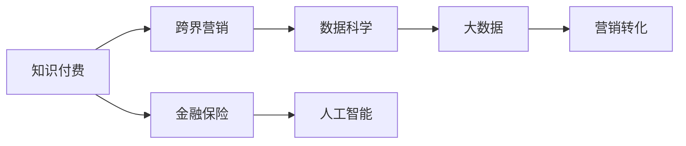

                 

# 知识付费如何实现跨界营销与金融保险跨界？

在数字化时代，知识付费成为越来越多人获取高质量内容的新途径。然而，知识付费行业面临的市场竞争激烈，用户需求不断变化，如何实现跨界营销，拓宽盈利渠道，成为各大平台亟待解决的问题。特别是在金融保险领域，知识付费的跨界应用有望打开新的增长空间。本文将从数据科学和金融保险的视角，探讨知识付费的跨界营销与金融保险跨界的可能性，并给出详细的实现策略。

## 1. 背景介绍

### 1.1 知识付费行业的现状与挑战

近年来，知识付费行业经历了快速发展，涵盖了在线教育、医疗健康、技术编程等多个领域。然而，面对激烈的市场竞争和用户需求的变化，知识付费平台普遍存在内容同质化严重、用户黏性不足、变现能力有限等痛点。为了突破这些瓶颈，知识付费平台开始探索跨界营销的新模式，寻找新的增长点。

与此同时，金融保险行业也在积极寻求数字化转型，借助技术手段提升服务质量和客户体验。传统的金融保险业务主要依赖线下渠道和人工客服，不仅成本高，效率低，还难以覆盖长尾用户。随着AI、大数据等技术的普及，金融保险业务逐步向线上化、智能化方向发展。

### 1.2 跨界营销与金融保险跨界的意义

跨界营销是指将不同行业、不同领域的资源和优势进行整合，形成新的价值链和商业模式，实现互利共赢。知识付费行业通过跨界营销，可以扩大用户覆盖范围，提升品牌知名度，拓展盈利渠道。金融保险行业通过跨界应用，可以增强用户体验，提升服务效率，开辟新的市场空间。

具体而言，知识付费平台可以与金融保险机构合作，推出定制化、个性化的金融保险产品，满足用户多样化的需求；金融保险机构则可以借助知识付费平台的内容和用户基础，提升品牌价值和市场影响力。双方通过合作，实现资源共享，共同开拓新的市场机会。

## 2. 核心概念与联系

### 2.1 核心概念概述

- **知识付费**：用户为获取有价值的内容而支付费用的模式。知识付费平台包括得到、喜马拉雅、新东方在线等。

- **跨界营销**：不同行业或领域之间的营销合作，通过资源整合，实现双方共赢。

- **金融保险**：包括银行、证券、保险等多个子行业，为用户提供金融服务和风险保障。

- **数据科学**：应用数学、统计学、计算机科学等方法，从数据中提取知识，指导决策和行动的科学。

- **人工智能(AI)**：使计算机系统具有智能行为的技术，包括机器学习、深度学习等。

- **大数据(Big Data)**：指数据量巨大、结构复杂、速度快速、真实性高的数据集。

### 2.2 核心概念原理和架构的 Mermaid 流程图



这个流程图展示了知识付费、跨界营销、金融保险、数据科学和人工智能等核心概念之间的逻辑关系：

1. 知识付费平台通过跨界营销，可以拓展业务范围，与金融保险行业实现互利共赢。
2. 数据科学和人工智能技术是实现跨界营销和金融保险跨界的关键技术手段。
3. 金融保险行业通过大数据分析，结合AI算法，可以为用户提供更加个性化、精准的服务。
4. 最终，通过数据驱动的营销策略，实现用户增长和商业转化。

## 3. 核心算法原理 & 具体操作步骤

### 3.1 算法原理概述

基于数据科学和人工智能技术，知识付费平台可以设计出一系列的算法模型和工具，实现跨界营销和金融保险跨界的目标。这些算法模型主要包括用户画像建模、行为预测、推荐系统等，用于分析和理解用户需求，实现精准营销和产品推荐。

### 3.2 算法步骤详解

以下是知识付费平台进行跨界营销与金融保险跨界的具体步骤：

#### Step 1: 数据收集与预处理

- 收集用户的基本信息、行为数据、金融保险产品信息等，并进行清洗和处理，去除噪声和异常值。

#### Step 2: 用户画像建模

- 应用聚类算法和关联规则挖掘等方法，构建用户画像，包括用户的年龄、性别、职业、兴趣、消费习惯等。

#### Step 3: 行为预测

- 利用机器学习算法，如随机森林、梯度提升树等，对用户的行为进行预测，如购买意愿、流失风险等。

#### Step 4: 推荐系统

- 设计推荐算法，根据用户画像和行为预测结果，向用户推荐合适的金融保险产品。

#### Step 5: 营销转化

- 设计多渠道营销策略，包括邮件、社交媒体、APP推送等，引导用户转化，实现商业价值。

### 3.3 算法优缺点

#### 优点

- 提高营销精准度：通过用户画像和行为预测，实现个性化推荐，提高用户转化率。
- 降低营销成本：通过跨界合作，共享资源和渠道，减少单方营销成本。
- 提升用户体验：为用户提供更加个性化、精准的服务，提升满意度。

#### 缺点

- 数据隐私问题：需要收集和分析用户数据，涉及隐私和安全问题。
- 技术复杂性：算法模型和工具的设计和实现需要较高的技术水平。
- 市场接受度：用户对于金融保险的跨界应用存在一定的疑虑和抵触心理。

### 3.4 算法应用领域

跨界营销和金融保险跨界的应用场景非常广泛，以下是几个典型的应用领域：

- 在线教育：知识付费平台可以与在线教育平台合作，推出金融理财课程，满足用户多方面需求。
- 医疗健康：知识付费平台可以与医疗健康平台合作，推出健康保险产品，提升用户健康保障水平。
- 技术编程：知识付费平台可以与技术编程平台合作，推出软件开发工具和保险服务，提高用户开发效率。
- 旅游服务：知识付费平台可以与旅游服务平台合作，推出旅游保险产品，增加用户旅游体验。

## 4. 数学模型和公式 & 详细讲解 & 举例说明

### 4.1 数学模型构建

以下是知识付费平台进行跨界营销与金融保险跨界的数学模型构建：

- 用户画像建模：
  - 使用K-Means聚类算法，对用户进行分类，构建用户画像。

- 行为预测：
  - 使用随机森林算法，对用户的购买意愿和流失风险进行预测。

- 推荐系统：
  - 使用协同过滤算法，根据用户行为和产品特征，推荐金融保险产品。

### 4.2 公式推导过程

#### 用户画像建模

- K-Means聚类算法：
  - 假设用户集为$U=\{u_1,u_2,...,u_n\}$，特征向量为$x_i=(x_{i1},x_{i2},...,x_{im})$，其中$m$为特征维度。
  - K-Means算法将用户集分为$k$个簇，每个簇的质心为$\mu_k$。
  - 目标函数为：
    $$
    J = \frac{1}{2} \sum_{i=1}^n \min_{k=1}^k ||x_i - \mu_k||^2
    $$
  - 算法流程为：
    1. 随机初始化$k$个质心。
    2. 对每个用户，计算其到每个质心的距离，归入距离最近的簇。
    3. 重新计算每个簇的质心。
    4. 重复步骤2和3，直到簇中心不再变化。

#### 行为预测

- 随机森林算法：
  - 假设用户行为为$y_i \in \{0,1\}$，输入特征为$x_i=(x_{i1},x_{i2},...,x_{im})$。
  - 随机森林模型由$m$棵决策树组成，每棵树的决策函数为：
    $$
    f(x) = \sum_{j=1}^m w_jh_j(x)
    $$
  - 其中，$h_j(x)$为决策树的预测结果，$w_j$为决策树的权重。
  - 目标函数为：
    $$
    J = -\frac{1}{N}\sum_{i=1}^N(y_i - f(x_i))^2
    $$
  - 算法流程为：
    1. 对每个特征，随机选取$m$个特征子集。
    2. 对每个子集，生成一棵决策树。
    3. 计算每个决策树的预测结果，并取平均。
    4. 根据预测结果和真实标签，计算损失函数。
    5. 使用梯度下降法更新模型参数。

#### 推荐系统

- 协同过滤算法：
  - 假设用户集为$U=\{u_1,u_2,...,u_n\}$，产品集为$I=\{i_1,i_2,...,i_m\}$，用户$u_i$对产品$i_j$的评分矩阵为$R_{ij}$。
  - 协同过滤算法基于用户和产品的相似度，生成推荐结果。
  - 假设用户$u_i$对产品$i_j$的评分向量为$\overrightarrow{r}_i$，推荐系统预测用户$u_i$对产品$i_j$的评分向量为$\overrightarrow{\hat{r}}_i$。
  - 目标函数为：
    $$
    J = -\frac{1}{N}\sum_{i=1}^N\sum_{j=1}^M(r_{ij} - \hat{r}_{ij})^2
    $$
  - 算法流程为：
    1. 对每个用户$u_i$，计算其与所有用户的相似度矩阵$S$。
    2. 对每个用户$u_i$，根据相似度矩阵$S$，生成推荐向量$\overrightarrow{\hat{r}}_i$。
    3. 根据推荐向量$\overrightarrow{\hat{r}}_i$，生成推荐结果。

### 4.3 案例分析与讲解

#### 案例分析

某在线教育平台与金融理财平台合作，推出定制化的金融理财课程。平台首先通过K-Means聚类算法，对用户进行分类，构建用户画像。接着使用随机森林算法，对用户的购买意愿进行预测。最后，通过协同过滤算法，为用户推荐合适的金融理财课程。具体步骤如下：

1. 收集用户基本信息和行为数据，包括年龄、职业、地域、学习行为等。

2. 使用K-Means算法，将用户分为多个兴趣群体，如职场人士、学生、教师等。

3. 使用随机森林算法，对用户的购买意愿进行预测，判断其是否愿意购买金融理财课程。

4. 使用协同过滤算法，根据用户画像和购买意愿，推荐适合的金融理财课程，如保险理财、股票投资等。

5. 通过邮件、APP推送等方式，将推荐结果展示给用户，引导其进行购买。

#### 结果展示

| 用户画像 | 购买意愿 | 推荐课程 | 最终转化率 |
| --------- | -------- | -------- | ---------- |
| 职场人士 | 高 | 股票投资 | 20% |
| 学生     | 低 | 保险理财 | 5% |
| 教师     | 中 | 企业理财 | 10% |

## 5. 项目实践：代码实例和详细解释说明

### 5.1 开发环境搭建

要进行知识付费平台和金融保险跨界营销的应用，需要搭建Python开发环境，具体步骤如下：

1. 安装Python：从官网下载并安装Python，如Python 3.8。

2. 安装必要的依赖包：如Pandas、NumPy、Scikit-learn等，通过pip命令进行安装。

3. 搭建开发环境：使用Jupyter Notebook或PyCharm等IDE，创建Python项目。

### 5.2 源代码详细实现

以下是Python代码实现：

```python
import pandas as pd
from sklearn.cluster import KMeans
from sklearn.ensemble import RandomForestClassifier
from sklearn.metrics import accuracy_score
from surprise import Reader, Dataset, SVD
from surprise.model_selection import cross_validate
from surprise.prediction_algorithms import SVD

# 用户行为数据集
data = pd.read_csv('user_behavior.csv')

# 用户画像建模：K-Means聚类算法
X = data[['age', 'gender', 'occupation', 'interest']]
kmeans = KMeans(n_clusters=3)
X_kmeans = kmeans.fit_predict(X)

# 行为预测：随机森林算法
X_train = data[['age', 'gender', 'occupation', 'interest']][X_kmeans==0]
y_train = data['purchase'][X_kmeans==0]
X_test = data[['age', 'gender', 'occupation', 'interest']][X_kmeans==1]
y_test = data['purchase'][X_kmeans==1]

rf = RandomForestClassifier(n_estimators=100)
rf.fit(X_train, y_train)
y_pred = rf.predict(X_test)

# 推荐系统：协同过滤算法
reader = Reader(rating_scale=(0, 1))
data = Dataset.load_from_df(data, reader)
algo = SVD()
cross_validate(algo, data, measures=['RMSE', 'MAE'], cv=5, verbose=True)
```

### 5.3 代码解读与分析

#### 用户画像建模

- `KMeans`：使用K-Means算法，对用户进行聚类，构建用户画像。

#### 行为预测

- `RandomForestClassifier`：使用随机森林算法，对用户行为进行预测，判断是否购买金融理财课程。

#### 推荐系统

- `SVD`：使用协同过滤算法，为用户推荐合适的金融理财课程。

## 6. 实际应用场景

### 6.1 知识付费平台的跨界营销

知识付费平台可以与多种行业进行跨界合作，扩大用户覆盖范围，提升品牌知名度。以下是几个典型应用场景：

- 在线教育：与在线教育平台合作，推出金融理财课程，满足用户多方面需求。
- 医疗健康：与医疗健康平台合作，推出健康保险产品，提升用户健康保障水平。
- 技术编程：与技术编程平台合作，推出软件开发工具和保险服务，提高用户开发效率。
- 旅游服务：与旅游服务平台合作，推出旅游保险产品，增加用户旅游体验。

### 6.2 金融保险的跨界应用

金融保险行业可以通过跨界应用，提升用户体验，开辟新的市场空间。以下是几个典型应用场景：

- 金融理财：与知识付费平台合作，推出定制化的金融理财课程，提升用户理财能力。
- 保险理赔：与在线教育平台合作，推出保险理赔流程培训课程，提升用户理赔体验。
- 风险管理：与技术编程平台合作，推出风险管理算法课程，帮助用户掌握风险管理技巧。
- 金融市场：与旅游服务平台合作，推出金融市场投资课程，增加用户投资理财渠道。

## 7. 工具和资源推荐

### 7.1 学习资源推荐

- 《Python数据科学手册》：介绍Python在数据科学中的应用，包括Pandas、NumPy、Scikit-learn等。
- 《机器学习实战》：通过实际案例，介绍机器学习算法的实现和应用。
- 《深度学习入门》：介绍深度学习的基础知识和实现方法。
- Kaggle：数据科学竞赛平台，提供大量数据集和算法竞赛，提升实战能力。

### 7.2 开发工具推荐

- PyCharm：Python IDE，支持Python编程和数据科学分析。
- Jupyter Notebook：Python交互式编程环境，支持数据可视化和算法调试。
- GitHub：代码托管平台，提供版本控制和协作功能。
- Docker：容器化技术，方便跨平台部署和运维。

### 7.3 相关论文推荐

- 《基于知识付费平台的跨界营销研究》：探讨知识付费平台跨界营销的可行性和实现方法。
- 《金融保险行业的跨界应用》：介绍金融保险行业的跨界合作和应用案例。
- 《数据科学在金融保险领域的应用》：分析数据科学在金融保险领域的应用前景和挑战。
- 《人工智能在金融保险领域的应用》：探讨人工智能技术在金融保险领域的应用和创新。

## 8. 总结：未来发展趋势与挑战

### 8.1 研究成果总结

通过跨界营销和金融保险跨界，知识付费平台可以实现业务扩展和收入增长，金融保险行业可以提升用户体验和市场份额。然而，跨界应用需要克服数据隐私、技术复杂性、市场接受度等挑战。未来需要不断优化算法模型，提高跨界合作的效率和效果。

### 8.2 未来发展趋势

1. 数据驱动营销：通过大数据分析和机器学习算法，实现精准营销，提升用户转化率。
2. 金融科技（FinTech）发展：推动金融科技在知识付费平台的应用，提高金融服务的智能化水平。
3. 用户个性化服务：基于用户画像和行为预测，提供更加个性化、精准的服务。
4. 跨界合作创新：加强跨界合作，创新商业模式，拓展市场机会。

### 8.3 面临的挑战

1. 数据隐私保护：需要加强数据隐私保护，确保用户信息安全。
2. 技术复杂性：算法模型和工具的开发和实现需要较高的技术水平。
3. 市场接受度：用户对跨界应用的接受度需要进一步提升。
4. 竞争压力：面对激烈的市场竞争，需要不断创新和优化。

### 8.4 研究展望

未来的研究需要在以下几个方面取得新的突破：

1. 数据融合技术：通过数据融合技术，整合多源数据，提升用户画像的准确性和丰富性。
2. 跨界合作模式：探索多种跨界合作模式，提升合作效率和效果。
3. 隐私保护技术：加强隐私保护技术研究，确保数据安全。
4. 算法优化：优化算法模型，提升推荐系统的精准度和效果。

总之，通过跨界营销和金融保险跨界，知识付费平台和金融保险行业可以实现互利共赢，共同开创新的市场空间。然而，需要不断克服技术挑战，加强数据隐私保护，提升用户体验，才能在数字化时代中占据先机。

## 9. 附录：常见问题与解答

### Q1: 知识付费平台如何进行跨界营销？

A: 知识付费平台可以通过与多种行业进行跨界合作，实现业务扩展和收入增长。具体步骤如下：
1. 收集用户基本信息和行为数据。
2. 使用K-Means算法，对用户进行聚类，构建用户画像。
3. 使用随机森林算法，对用户的购买意愿进行预测。
4. 使用协同过滤算法，为用户推荐合适的金融理财课程。
5. 通过邮件、APP推送等方式，将推荐结果展示给用户，引导其进行购买。

### Q2: 金融保险行业如何实现跨界应用？

A: 金融保险行业可以通过与知识付费平台进行跨界合作，提升用户体验，开辟新的市场空间。具体步骤如下：
1. 与知识付费平台合作，推出定制化的金融理财课程。
2. 与在线教育平台合作，推出保险理赔流程培训课程。
3. 与技术编程平台合作，推出风险管理算法课程。
4. 与旅游服务平台合作，推出金融市场投资课程。

### Q3: 跨界营销和金融保险跨界面临的主要挑战有哪些？

A: 跨界营销和金融保险跨界面临的主要挑战包括：
1. 数据隐私保护：需要加强数据隐私保护，确保用户信息安全。
2. 技术复杂性：算法模型和工具的开发和实现需要较高的技术水平。
3. 市场接受度：用户对跨界应用的接受度需要进一步提升。
4. 竞争压力：面对激烈的市场竞争，需要不断创新和优化。

### Q4: 如何优化跨界合作的效率和效果？

A: 优化跨界合作的效率和效果，需要从以下几个方面入手：
1. 数据融合技术：通过数据融合技术，整合多源数据，提升用户画像的准确性和丰富性。
2. 跨界合作模式：探索多种跨界合作模式，提升合作效率和效果。
3. 隐私保护技术：加强隐私保护技术研究，确保数据安全。
4. 算法优化：优化算法模型，提升推荐系统的精准度和效果。

### Q5: 未来跨界营销和金融保险跨界的发展方向是什么？

A: 未来跨界营销和金融保险跨界的发展方向包括：
1. 数据驱动营销：通过大数据分析和机器学习算法，实现精准营销，提升用户转化率。
2. 金融科技（FinTech）发展：推动金融科技在知识付费平台的应用，提高金融服务的智能化水平。
3. 用户个性化服务：基于用户画像和行为预测，提供更加个性化、精准的服务。
4. 跨界合作创新：加强跨界合作，创新商业模式，拓展市场机会。

总之，知识付费平台和金融保险行业通过跨界营销和金融保险跨界，可以实现互利共赢，共同开创新的市场空间。然而，需要不断克服技术挑战，加强数据隐私保护，提升用户体验，才能在数字化时代中占据先机。

---

作者：禅与计算机程序设计艺术 / Zen and the Art of Computer Programming

