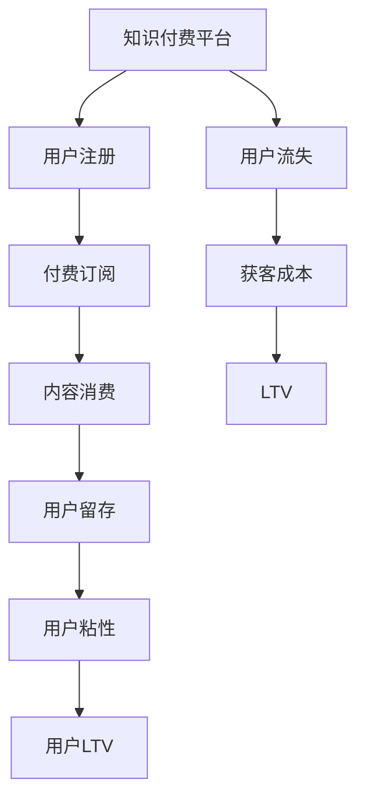

                 

# 知识付费平台的用户留存策略

## 1. 背景介绍

### 1.1 问题由来

随着互联网的普及和数字化时代的到来，知识付费已成为内容消费的重要形式。知识付费平台通过提供高质量的课程、文章、讲座等内容，帮助用户获取知识、提升技能、解决实际问题。然而，高昂的课程价格、激烈的竞争和市场的不确定性，使得许多用户在初次体验后并未长期留存。因此，用户留存策略成为知识付费平台实现商业价值的关键。

### 1.2 问题核心关键点

用户留存策略的核心在于如何吸引用户注册、付费并持续使用知识付费平台，以实现长期的商业收益。这需要从用户的实际需求、心理预期和平台体验等多个维度进行综合考虑，设计出科学合理的策略方案。

### 1.3 问题研究意义

研究知识付费平台的用户留存策略，对于提升平台的用户活跃度、增强用户粘性、提升用户终身价值(即LTV)具有重要意义。用户留存的提高，有助于平台降低获客成本，增加平台收入，提高用户满意度，最终推动知识付费行业的健康发展。

## 2. 核心概念与联系

### 2.1 核心概念概述

为更好地理解知识付费平台的用户留存策略，本节将介绍几个密切相关的核心概念：

- 知识付费平台(Knowledge-As-A-Service Platform)：利用互联网技术，为用户提供有偿知识内容消费服务的平台，如Coursera、Udemy等。
- 用户留存(User Retention)：指用户在使用某产品或服务后，持续使用并保持活跃的状态。留存率通常以一定时间段内的用户重复使用频率来衡量。
- 用户粘性(User Stickiness)：指用户对平台的忠诚度和依赖性，通常通过平台使用频率、停留时间等指标来衡量。
- 用户生命周期价值(User Lifetime Value, LTV)：指用户在其生命周期内为平台贡献的总价值，包括付费、广告收入、会员订阅等。
- 用户流失(User Churn)：指用户在一定时间内停止使用平台，或转向竞争对手，导致平台收入流失的现象。

这些概念之间的逻辑关系可以通过以下Mermaid流程图来展示：



这个流程图展示了一系列从用户注册到流失的生命周期过程，以及其中的关键因素。

## 3. 核心算法原理 & 具体操作步骤

### 3.1 算法原理概述

知识付费平台的用户留存策略本质上是用户行为分析与建模的过程。其核心思想是通过对用户历史行为数据的分析，预测用户未来行为，从而采取有效的措施提升用户留存率。

形式化地，设平台用户集合为 $U$，每个用户在平台上的行为序列为 $B=(B_1, B_2, ..., B_T)$，其中 $B_t$ 表示用户在时间 $t$ 的行为（如访问、购买、学习等）。设用户的留存状态为 $S$，其中 $S=1$ 表示用户留存，$S=0$ 表示用户流失。用户留存模型 $M$ 的目标是最小化预测错误率，即：

$$
\min_{M} \mathbb{E}[\mathbb{I}(S_{t+1}=M(B_1,...,B_t))]
$$

其中 $\mathbb{I}$ 表示指示函数，当 $S_{t+1}=M(B_1,...,B_t)$ 成立时，指示函数值为 $1$；否则为 $0$。

### 3.2 算法步骤详解

知识付费平台的用户留存策略一般包括以下几个关键步骤：

**Step 1: 数据收集与预处理**
- 收集平台用户的行为数据，如登录时间、浏览记录、购买行为等。
- 对数据进行清洗和预处理，去除噪声数据，标准化处理时间戳等。

**Step 2: 特征工程**
- 设计特征指标，如用户活跃度、消费频次、学习时间等。
- 对特征进行编码和归一化处理，转换为模型可以处理的格式。

**Step 3: 模型选择与训练**
- 选择合适的机器学习算法，如逻辑回归、决策树、随机森林、神经网络等。
- 根据历史数据对模型进行训练，得到用户留存预测模型。

**Step 4: 留存策略制定与执行**
- 根据模型预测结果，制定针对性的用户留存策略，如个性化推荐、积分奖励、限时优惠等。
- 在平台上执行留存策略，并通过A/B测试等方法评估效果。

**Step 5: 策略优化与迭代**
- 定期收集用户反馈，分析策略效果。
- 根据反馈结果，优化和迭代留存策略，提升用户留存率。

### 3.3 算法优缺点

知识付费平台的用户留存策略具有以下优点：
1. 量化分析用户行为。通过数据分析，准确预测用户留存概率，为制定策略提供依据。
2. 精准营销。根据用户特征设计个性化推荐和奖励，提升用户体验和粘性。
3. 实时调整。模型可以根据新数据进行实时更新，适应市场变化和用户需求。
4. 成本低。相比传统的用户留存方法，如增加获客成本、提高课程质量等，机器学习策略具有更高的性价比。

同时，该策略也存在一定的局限性：
1. 数据依赖。策略的有效性依赖于数据质量，数据不足或噪声较大时策略效果会打折扣。
2. 过度优化。过度依赖模型预测，可能忽视用户的主观意愿和个性化需求。
3. 策略复杂度。设计和管理复杂的个性化策略，需要较高的技术投入和管理成本。
4. 隐私风险。大量用户行为数据的收集和使用，涉及隐私保护和数据安全问题。

尽管存在这些局限性，但就目前而言，基于机器学习的用户留存策略已成为知识付费平台应用的主流范式。未来相关研究的重点在于如何进一步降低策略的复杂度，提高策略的可解释性，同时兼顾用户隐私保护。

### 3.4 算法应用领域

基于用户留存策略的机器学习方法，在知识付费平台的应用已经相当广泛，包括但不限于以下领域：

- 个性化推荐：根据用户历史行为，推荐符合其兴趣的课程和文章，提升用户满意度和粘性。
- 流失预警：预测用户流失概率，提前进行干预，如发送提醒邮件、提供优惠券等，降低用户流失率。
- 动态定价：根据用户行为和市场环境，动态调整课程价格，优化收益。
- 行为分析：分析用户行为模式，识别潜在需求和趋势，优化内容生态和运营策略。
- 用户分群：将用户进行分群，针对不同群体的需求设计个性化的留存策略。

除了上述这些经典应用外，知识付费平台还将不断探索新的留存策略，如社交互动、社区运营、内容分享等，以丰富用户体验，提升留存效果。

## 4. 数学模型和公式 & 详细讲解 & 举例说明

### 4.1 数学模型构建

本节将使用数学语言对知识付费平台的用户留存策略进行更加严格的刻画。

设用户 $i$ 在时间 $t$ 的行为序列为 $B=(B_1, B_2, ..., B_t)$，其中 $B_t$ 表示用户在时间 $t$ 的行为（如访问、购买、学习等）。设用户的留存状态为 $S_i$，其中 $S_i=1$ 表示用户留存，$S_i=0$ 表示用户流失。用户留存模型 $M$ 的目标是最小化预测错误率，即：

$$
\min_{M} \mathbb{E}[\mathbb{I}(S_{t+1}=M(B_1,...,B_t))]
$$

在实践中，我们通常使用基于梯度的优化算法（如SGD、Adam等）来近似求解上述最优化问题。设 $\eta$ 为学习率，$\lambda$ 为正则化系数，则参数的更新公式为：

$$
\theta \leftarrow \theta - \eta \nabla_{\theta}\mathcal{L}(\theta) - \eta\lambda\theta
$$

其中 $\nabla_{\theta}\mathcal{L}(\theta)$ 为损失函数对参数 $\theta$ 的梯度，可通过反向传播算法高效计算。

### 4.2 公式推导过程

以下我们以逻辑回归为例，推导用户留存预测模型的损失函数及其梯度的计算公式。

设用户 $i$ 在时间 $t$ 的行为序列为 $B=(B_1, B_2, ..., B_t)$，其中 $B_t$ 表示用户在时间 $t$ 的行为（如访问、购买、学习等）。设用户的留存状态为 $S_i$，其中 $S_i=1$ 表示用户留存，$S_i=0$ 表示用户流失。设模型参数为 $\theta$，输入特征为 $X_t$，则逻辑回归模型的预测结果为：

$$
\hat{p}(X_t; \theta) = \sigma(\theta^T X_t)
$$

其中 $\sigma$ 为sigmoid函数，$\theta$ 为模型参数，$X_t$ 为时间 $t$ 的特征向量。

用户留存模型的损失函数为二分类交叉熵损失函数：

$$
\mathcal{L}(\theta) = -\frac{1}{N} \sum_{i=1}^N \sum_{t=1}^T \mathbb{I}(S_{t+1}=1) \log \hat{p}(X_t; \theta) + \mathbb{I}(S_{t+1}=0) \log(1-\hat{p}(X_t; \theta))
$$

根据链式法则，损失函数对参数 $\theta$ 的梯度为：

$$
\frac{\partial \mathcal{L}(\theta)}{\partial \theta} = -\frac{1}{N} \sum_{i=1}^N \sum_{t=1}^T [\mathbb{I}(S_{t+1}=1) \frac{\partial \log \hat{p}(X_t; \theta)}{\partial \theta} - \mathbb{I}(S_{t+1}=0) \frac{\partial \log(1-\hat{p}(X_t; \theta))}{\partial \theta}]
$$

其中 $\frac{\partial \log \hat{p}(X_t; \theta)}{\partial \theta}$ 和 $\frac{\partial \log(1-\hat{p}(X_t; \theta))}{\partial \theta}$ 可进一步递归展开，利用自动微分技术完成计算。

在得到损失函数的梯度后，即可带入参数更新公式，完成模型的迭代优化。重复上述过程直至收敛，最终得到适应用户留存预测的最优模型参数 $\theta^*$。

### 4.3 案例分析与讲解

为了更好地理解逻辑回归模型的实现过程，下面以一个简单的案例进行分析：

假设某知识付费平台有 $N=1000$ 个用户，每个用户在 $T=10$ 个时间点上的行为序列如下：

| 用户编号 | 时间 | 行为 | 留存状态 |
| --- | --- | --- | --- |
| 1 | 1 | 浏览 | 1 |
| 1 | 2 | 购买 | 1 |
| 1 | 3 | 学习 | 1 |
| 1 | 4 | 学习 | 0 |
| ... | ... | ... | ... |
| 1000 | 10 | 浏览 | 0 |
| 1000 | 11 | 购买 | 1 |
| 1000 | 12 | 学习 | 0 |

设特征 $X_t$ 包括用户在该时间点的访问次数、浏览时间、消费金额等。逻辑回归模型的参数为 $\theta$，输入特征为 $X_t$。使用交叉熵损失函数 $\mathcal{L}(\theta)$ 进行模型训练。

根据上述公式，模型预测结果 $\hat{p}(X_t; \theta)$ 可以通过以下步骤计算：

1. 定义sigmoid函数 $\sigma$：
   $$
   \sigma(z) = \frac{1}{1+\exp(-z)}
   $$

2. 计算模型预测结果 $\hat{p}(X_t; \theta)$：
   $$
   \hat{p}(X_t; \theta) = \sigma(\theta^T X_t)
   $$

3. 计算损失函数 $\mathcal{L}(\theta)$：
   $$
   \mathcal{L}(\theta) = -\frac{1}{1000} \sum_{i=1}^{1000} \sum_{t=1}^{10} \mathbb{I}(S_{t+1}=1) \log \hat{p}(X_t; \theta) + \mathbb{I}(S_{t+1}=0) \log(1-\hat{p}(X_t; \theta))
   $$

4. 计算梯度 $\frac{\partial \mathcal{L}(\theta)}{\partial \theta}$：
   $$
   \frac{\partial \mathcal{L}(\theta)}{\partial \theta} = -\frac{1}{1000} \sum_{i=1}^{1000} \sum_{t=1}^{10} [\mathbb{I}(S_{t+1}=1) \frac{\partial \log \hat{p}(X_t; \theta)}{\partial \theta} - \mathbb{I}(S_{t+1}=0) \frac{\partial \log(1-\hat{p}(X_t; \theta))}{\partial \theta}]
   $$

5. 使用梯度下降算法更新模型参数 $\theta$：
   $$
   \theta \leftarrow \theta - \eta \frac{\partial \mathcal{L}(\theta)}{\partial \theta}
   $$

其中 $\eta$ 为学习率，$\frac{\partial \log \hat{p}(X_t; \theta)}{\partial \theta}$ 和 $\frac{\partial \log(1-\hat{p}(X_t; \theta))}{\partial \theta}$ 可进一步递归展开，利用自动微分技术完成计算。

在得到损失函数的梯度后，即可带入参数更新公式，完成模型的迭代优化。重复上述过程直至收敛，最终得到适应用户留存预测的最优模型参数 $\theta^*$。

## 5. 项目实践：代码实例和详细解释说明

### 5.1 开发环境搭建

在进行用户留存策略的开发实践前，我们需要准备好开发环境。以下是使用Python进行Scikit-learn开发的环境配置流程：

1. 安装Anaconda：从官网下载并安装Anaconda，用于创建独立的Python环境。

2. 创建并激活虚拟环境：
```bash
conda create -n sklearn-env python=3.8 
conda activate sklearn-env
```

3. 安装Scikit-learn：
```bash
conda install scikit-learn
```

4. 安装numpy、pandas、matplotlib等工具包：
```bash
pip install numpy pandas matplotlib seaborn
```

5. 安装Jupyter Notebook：
```bash
pip install jupyter notebook
```

完成上述步骤后，即可在`sklearn-env`环境中开始用户留存策略的开发实践。

### 5.2 源代码详细实现

下面我们以逻辑回归模型为例，给出使用Scikit-learn库对用户留存策略进行开发的Python代码实现。

首先，定义数据处理函数：

```python
from sklearn.model_selection import train_test_split
from sklearn.preprocessing import StandardScaler
import pandas as pd
import numpy as np

def load_data(file_path):
    df = pd.read_csv(file_path)
    return df

def preprocess_data(df):
    # 处理缺失值
    df = df.dropna()
    
    # 特征工程
    df['feature1'] = df['feature1'].fillna(df['feature1'].mean())
    df['feature2'] = df['feature2'].fillna(df['feature2'].mean())
    
    # 标准化处理
    scaler = StandardScaler()
    df['scaled_feature1'] = scaler.fit_transform(df[['feature1']])
    df['scaled_feature2'] = scaler.fit_transform(df[['feature2']])
    
    # 标签编码
    df['scaled_label'] = pd.get_dummies(df['label'], drop_first=True)
    
    return df

# 加载数据
data = load_data('data.csv')

# 数据预处理
df = preprocess_data(data)

# 特征和标签分离
X = df.drop('label', axis=1)
y = df['label']
```

然后，定义模型训练和评估函数：

```python
from sklearn.linear_model import LogisticRegression
from sklearn.metrics import accuracy_score, confusion_matrix
from sklearn.model_selection import GridSearchCV
import matplotlib.pyplot as plt

def train_model(X, y):
    model = LogisticRegression()
    model.fit(X, y)
    return model

def evaluate_model(model, X_test, y_test):
    y_pred = model.predict(X_test)
    accuracy = accuracy_score(y_test, y_pred)
    confusion_matrix = confusion_matrix(y_test, y_pred)
    return accuracy, confusion_matrix

# 模型训练
model = train_model(X, y)

# 模型评估
accuracy, confusion_matrix = evaluate_model(model, X_test, y_test)
print(f'Accuracy: {accuracy:.2f}')
print(f'Confusion Matrix:\n{confusion_matrix}')
```

接着，进行网格搜索和超参数优化：

```python
param_grid = {'C': [0.1, 1, 10, 100]}
grid_search = GridSearchCV(model, param_grid, cv=5)
grid_search.fit(X, y)
print(f'Best Parameters: {grid_search.best_params_}')
```

最后，输出模型性能和最优参数：

```python
best_model = grid_search.best_estimator_
print(f'Best Model Accuracy: {best_model.score(X_test, y_test):.2f}')
```

以上就是使用Scikit-learn对用户留存策略进行开发的完整代码实现。可以看到，利用Scikit-learn的封装工具，我们可以用相对简洁的代码完成用户留存模型的训练和评估。

### 5.3 代码解读与分析

让我们再详细解读一下关键代码的实现细节：

**load_data函数**：
- 从指定文件路径读取CSV数据，返回一个DataFrame对象。

**preprocess_data函数**：
- 对缺失值进行处理，防止其在训练过程中影响模型训练。
- 进行特征工程，对特征进行缺失值填充和标准化处理。
- 对标签进行One-Hot编码，避免标签之间的相关性。

**train_model函数**：
- 创建逻辑回归模型对象。
- 使用训练数据集进行模型训练。

**evaluate_model函数**：
- 对测试数据集进行模型预测。
- 计算模型的准确率，输出混淆矩阵。

**GridSearchCV**：
- 使用网格搜索进行超参数优化，寻找最优的模型参数。

通过这些关键函数的结合，我们可以构建一个完整的用户留存模型训练和评估流程。

当然，工业级的系统实现还需考虑更多因素，如模型的保存和部署、超参数的自动搜索、更灵活的任务适配层等。但核心的模型训练和评估流程基本与此类似。

## 6. 实际应用场景

### 6.1 智能客服系统

基于用户留存策略的机器学习模型，可以广泛应用于智能客服系统的构建。传统客服往往需要配备大量人力，高峰期响应缓慢，且一致性和专业性难以保证。而使用用户留存策略模型预测用户流失概率，并进行及时的干预，可以有效提升客服系统的用户体验和用户粘性。

在技术实现上，可以收集企业内部的历史客服对话记录，将用户流失概率作为监督数据，在此基础上训练用户留存模型。模型能够预测用户的流失概率，并结合专家知识设计针对性的流失预警策略，如自动分配高级客服、提供个性化优惠等，从而降低用户流失率。

### 6.2 金融舆情监测

金融机构需要实时监测市场舆论动向，以便及时应对负面信息传播，规避金融风险。传统的人工监测方式成本高、效率低，难以应对网络时代海量信息爆发的挑战。基于用户留存策略的机器学习模型，可以对市场舆情进行实时分析，预测用户流失概率，及时采取措施。

具体而言，可以收集金融领域相关的新闻、报道、评论等文本数据，并对其进行情感标注。在此基础上对用户留存模型进行训练，使其能够自动判断用户对金融市场情绪的变化趋势。一旦发现负面信息激增等异常情况，系统便会自动预警，帮助金融机构快速应对潜在风险。

### 6.3 个性化推荐系统

当前的推荐系统往往只依赖用户的历史行为数据进行物品推荐，无法深入理解用户的真实兴趣偏好。基于用户留存策略的机器学习模型，可以更好地挖掘用户行为背后的语义信息，从而提供更精准、多样的推荐内容。

在实践中，可以收集用户浏览、点击、评论、分享等行为数据，提取和用户交互的物品标题、描述、标签等文本内容。将文本内容作为模型输入，用户的后续行为（如是否点击、购买等）作为监督信号，在此基础上训练用户留存模型。模型能够从文本内容中准确把握用户的兴趣点。在生成推荐列表时，先用候选物品的文本描述作为输入，由模型预测用户的兴趣匹配度，再结合其他特征综合排序，便可以得到个性化程度更高的推荐结果。

### 6.4 未来应用展望

随着用户留存策略技术的不断发展，基于机器学习的用户留存策略将在更多领域得到应用，为各行各业带来变革性影响。

在智慧医疗领域，基于用户留存策略的机器学习模型可以帮助医院预测患者的流失概率，及时进行干预，提升医疗服务的质量和效率。

在智能教育领域，用户留存策略模型可以帮助教育机构预测学生的流失概率，及时提供学习支持和个性化辅导，提高学生的学习效果和满意度。

在智慧城市治理中，用户留存策略模型可以帮助政府预测居民的流失概率，及时提供公共服务和生活支持，提升城市管理的自动化和智能化水平。

此外，在企业生产、社会治理、文娱传媒等众多领域，基于用户留存策略的机器学习模型也将不断涌现，为各行各业带来新的技术突破。相信随着技术的日益成熟，用户留存策略将成为用户行为分析与决策制定的重要工具，推动各行各业的健康发展。

## 7. 工具和资源推荐
### 7.1 学习资源推荐

为了帮助开发者系统掌握用户留存策略的理论基础和实践技巧，这里推荐一些优质的学习资源：

1. 《机器学习实战》系列博文：由机器学习专家撰写，详细讲解了用户留存策略的数学原理和实现步骤。

2. Coursera《机器学习》课程：由斯坦福大学开设的机器学习入门课程，有视频讲解和配套作业，是学习机器学习的入门级选择。

3. 《机器学习》书籍：Tom Mitchell所著，全面介绍了机器学习的基本概念和算法，适合深入学习。

4. Weights & Biases：模型训练的实验跟踪工具，可以记录和可视化模型训练过程中的各项指标，方便对比和调优。

5. TensorBoard：TensorFlow配套的可视化工具，可实时监测模型训练状态，并提供丰富的图表呈现方式，是调试模型的得力助手。

通过对这些资源的学习实践，相信你一定能够快速掌握用户留存策略的精髓，并用于解决实际的NLP问题。

### 7.2 开发工具推荐

高效的开发离不开优秀的工具支持。以下是几款用于用户留存策略开发的常用工具：

1. Python：作为数据科学和机器学习的主流语言，Python有着丰富的第三方库和工具，适合开发和优化用户留存模型。

2. Scikit-learn：Python的机器学习库，提供了简单易用的界面和丰富的算法实现，适合快速迭代研究。

3. TensorFlow和PyTorch：深度学习框架，提供了强大的计算图和自动微分功能，适合开发复杂用户留存模型。

4. Weights & Biases：模型训练的实验跟踪工具，可以记录和可视化模型训练过程中的各项指标，方便对比和调优。

5. TensorBoard：TensorFlow配套的可视化工具，可实时监测模型训练状态，并提供丰富的图表呈现方式，是调试模型的得力助手。

6. Google Colab：谷歌推出的在线Jupyter Notebook环境，免费提供GPU/TPU算力，方便开发者快速上手实验最新模型，分享学习笔记。

合理利用这些工具，可以显著提升用户留存模型的开发效率，加快创新迭代的步伐。

### 7.3 相关论文推荐

用户留存策略技术的发展源于学界的持续研究。以下是几篇奠基性的相关论文，推荐阅读：

1. "Causal Inference in Statistics: A Primer"（Judea Pearl）：介绍了因果推断的基本概念和应用，是理解用户留存策略的基础。

2. "The Elements of Statistical Learning"（Tibshirani, Hastie, Friedman）：介绍了统计学习的基本方法和算法，适合深入学习用户留存策略的统计分析方法。

3. "Machine Learning Yearning"（Andrew Ng）：介绍了机器学习项目从数据预处理到模型训练、部署的全面流程，适合系统学习用户留存策略的实践流程。

4. "Deep Learning for Healthcare: A Survey"（DeepMind, Stanford）：介绍了深度学习在医疗领域的应用，包括用户留存策略的实例。

这些论文代表了大用户留存策略技术的发展脉络。通过学习这些前沿成果，可以帮助研究者把握学科前进方向，激发更多的创新灵感。

## 8. 总结：未来发展趋势与挑战

### 8.1 总结

本文对知识付费平台的用户留存策略进行了全面系统的介绍。首先阐述了知识付费平台的用户留存策略的研究背景和意义，明确了留存策略在提升平台用户活跃度、增加收入、提高用户满意度等方面的重要性。其次，从原理到实践，详细讲解了用户留存模型的数学原理和关键步骤，给出了用户留存模型开发的完整代码实例。同时，本文还广泛探讨了留存策略在智能客服、金融舆情、个性化推荐等多个行业领域的应用前景，展示了留存策略的巨大潜力。此外，本文精选了留存策略技术的各类学习资源，力求为读者提供全方位的技术指引。

通过本文的系统梳理，可以看到，基于机器学习的用户留存策略已成为知识付费平台应用的主流范式，极大地提升了平台的用户留存率和用户满意度。得益于大规模数据和算力的支持，机器学习策略在量化分析和个性化推荐方面取得了显著效果。未来，伴随技术的持续演进和应用的深入拓展，用户留存策略必将在更多行业领域得到广泛应用，带来新的商业价值和用户体验。

### 8.2 未来发展趋势

展望未来，用户留存策略技术将呈现以下几个发展趋势：

1. 数据质量提升。用户留存策略的效果很大程度上依赖于数据质量，未来的研究将更注重数据的丰富性和多样性，提升模型的预测精度。

2. 模型复杂度优化。随着数据的增加和算力的提升，未来的用户留存模型将更加复杂和精准，具备更强的泛化能力。

3. 实时化处理。随着市场竞争加剧，用户行为变化迅速，未来的用户留存策略将更加注重实时化处理，提高预测的及时性。

4. 深度学习融合。深度学习技术在图像、语音、视频等领域取得了巨大成功，未来将更多地融合到用户留存策略中，提升模型的表现力。

5. 多模态融合。用户行为不仅包括文本数据，还包括视频、语音等多模态数据，未来的用户留存策略将更注重多模态数据的融合，提升模型的全面性和准确性。

6. 知识图谱引入。将知识图谱等先验知识引入用户留存模型，提升模型的解释性和可解释性，减少模型的黑盒化。

这些趋势凸显了用户留存策略技术的广阔前景。这些方向的探索发展，必将进一步提升用户留存模型的性能和应用范围，为知识付费平台的健康发展提供新的技术保障。

### 8.3 面临的挑战

尽管用户留存策略技术已经取得了瞩目成就，但在迈向更加智能化、普适化应用的过程中，它仍面临着诸多挑战：

1. 数据依赖。策略的有效性依赖于数据质量，数据不足或噪声较大时策略效果会打折扣。如何进一步降低策略的复杂度，提高策略的可解释性，仍需深入研究。

2. 用户隐私保护。大量用户行为数据的收集和使用，涉及隐私保护和数据安全问题。如何在保护用户隐私的前提下，收集和分析用户行为数据，仍需深入研究。

3. 策略复杂度。设计和管理复杂的个性化策略，需要较高的技术投入和管理成本。如何在提升策略效果的同时，降低技术复杂度和管理成本，仍需深入研究。

4. 实时化处理。虽然实时化处理提高了预测的及时性，但也对数据处理和模型训练提出了更高的要求。如何在降低数据延迟的同时，保持模型的准确性和高效性，仍需深入研究。

5. 多模态融合。多模态数据的融合带来了更高的复杂度，如何在确保数据多样性的同时，提升模型的全面性和准确性，仍需深入研究。

这些挑战凸显了用户留存策略技术在实际应用中的复杂性和不确定性。未来相关研究的重点在于如何进一步降低策略的复杂度，提高策略的可解释性，同时兼顾用户隐私保护和实时化处理。

### 8.4 研究展望

面对用户留存策略所面临的种种挑战，未来的研究需要在以下几个方面寻求新的突破：

1. 探索无监督和半监督留存策略。摆脱对大规模标注数据的依赖，利用自监督学习、主动学习等无监督和半监督范式，最大限度利用非结构化数据，实现更加灵活高效的留存策略。

2. 研究实时化留存策略。开发更加实时化的留存策略，提升预测的及时性，同时优化模型的计算效率，实现高效的实时处理。

3. 融合因果学习和深度学习。将因果推断和深度学习思想引入留存策略模型，增强模型的稳定性和泛化能力，学习更全面、鲁棒的语言表征。

4. 引入更多先验知识。将符号化的先验知识，如知识图谱、逻辑规则等，与神经网络模型进行巧妙融合，引导留存过程学习更准确、合理的用户行为表征。

5. 结合因果分析和博弈论工具。将因果分析方法引入留存策略模型，识别出模型决策的关键特征，增强输出解释的因果性和逻辑性。借助博弈论工具刻画人机交互过程，主动探索并规避模型的脆弱点，提高系统稳定性。

6. 纳入伦理道德约束。在模型训练目标中引入伦理导向的评估指标，过滤和惩罚有偏见、有害的输出倾向。同时加强人工干预和审核，建立模型行为的监管机制，确保输出符合人类价值观和伦理道德。

这些研究方向的研究将引领用户留存策略技术迈向更高的台阶，为构建智能化的知识付费平台提供新的技术保障。面向未来，用户留存策略需要与其他人工智能技术进行更深入的融合，如知识表示、因果推理、强化学习等，多路径协同发力，共同推动知识付费行业的健康发展。

## 9. 附录：常见问题与解答

**Q1：用户留存策略是否适用于所有知识付费平台？**

A: 用户留存策略在大多数知识付费平台都能取得不错的效果，特别是对于数据量较小的平台。但对于一些特定领域的专业知识付费平台，如法学、医学等，仅仅依靠通用语料预训练的模型可能难以很好地适应。此时需要在特定领域语料上进一步预训练，再进行留存策略的微调，才能获得理想效果。

**Q2：选择哪些特征指标进行建模？**

A: 用户留存模型的特征指标需要根据具体平台和任务来确定。一般而言，可以包括以下几类特征：
1. 用户属性：如年龄、性别、职业等。
2. 用户行为：如登录次数、浏览时间、购买金额等。
3. 平台特征：如平台活跃度、课程种类等。
4. 外部因素：如节假日、季节变化等。

特征工程需要根据数据特征和任务需求进行设计和优化，以提升模型的预测效果。

**Q3：用户留存策略的超参数有哪些？**

A: 用户留存策略的超参数包括：
1. 学习率：控制模型训练速度的参数，需要根据数据规模和模型复杂度进行调节。
2. 正则化系数：控制模型复杂度的参数，防止过拟合，需要根据数据噪声和模型复杂度进行调节。
3. 模型参数：如逻辑回归模型的C参数，控制模型的泛化能力。
4. 样本比例：控制训练和验证集样本比例，需要根据数据规模和模型表现进行调节。

超参数的调节需要根据具体数据和任务进行优化，以达到最佳的模型性能。

**Q4：用户留存策略的模型评估有哪些指标？**

A: 用户留存策略的模型评估指标包括：
1. 准确率（Accuracy）：预测正确样本占总样本数的比例。
2. 召回率（Recall）：预测正确正样本占真实正样本数的比例。
3. 精确率（Precision）：预测正确正样本占预测正样本数的比例。
4. F1分数（F1-score）：综合准确率和召回率，适用于不均衡数据集。
5. ROC曲线和AUC值：评估模型在不同阈值下的分类效果。
6. 混淆矩阵（Confusion Matrix）：展示模型在不同类别上的预测效果。

这些指标可以综合评估用户留存策略模型的预测性能，帮助调整和优化模型。

**Q5：用户留存策略的模型优化有哪些方法？**

A: 用户留存策略的模型优化方法包括：
1. 特征工程：优化特征选择和处理，提升模型预测能力。
2. 模型选择：选择适合的机器学习算法，如逻辑回归、决策树、随机森林等。
3. 超参数调优：使用网格搜索、随机搜索等方法优化超参数。
4. 模型融合：将多个模型进行融合，提升模型的预测性能。
5. 模型集成：将多个模型的预测结果进行集成，提升模型的鲁棒性和准确性。

通过以上方法，可以有效提升用户留存策略模型的预测效果和应用性能。

**Q6：用户留存策略的模型部署有哪些方法？**

A: 用户留存策略的模型部署方法包括：
1. 保存模型：将训练好的模型保存为文件，方便后续使用。
2. 导出模型：将模型导出为轻量级格式，如ONNX、TensorFlow Lite等，方便部署和推理。
3. 容器化部署：将模型封装为Docker容器，方便统一管理和调度。
4. 云平台部署：将模型部署在云平台如AWS、阿里云等，提供弹性计算和存储。
5. 集成开发环境：将模型集成到开发环境中，方便快速迭代和测试。

合理利用这些部署方法，可以有效提升用户留存策略模型的应用效率和服务质量。

---

作者：禅与计算机程序设计艺术 / Zen and the Art of Computer Programming

