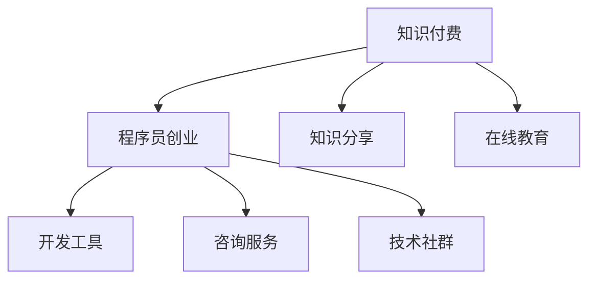

                 

# 知识付费时代程序员的创业机会

## 1. 背景介绍

### 1.1 问题由来

随着互联网的普及和知识的爆炸性增长，传统的教育模式已经难以适应人们对知识的需求。大量在线教育平台和知识社区应运而生，人们越来越习惯通过在线方式获取知识。与此同时，知识付费平台的兴起，使得内容创作者可以通过自己的专业知识、经验和见解，获得相应的报酬。在这种背景下，程序员利用自己的技术优势，通过编写代码、提供咨询服务、开发工具等方式，开展知识付费的创业，成为了一种新趋势。

### 1.2 问题核心关键点

面对知识付费的机遇，程序员应该如何把握？程序员创业的核心竞争力是什么？如何利用技术优势，开展有价值的知识付费项目？

### 1.3 问题研究意义

程序员利用自身技术优势开展知识付费，不仅能获取稳定的收入，还能通过分享知识，提升自己的知名度和影响力。同时，这也有助于推动技术传播和普及，促进技术创新和行业发展。

## 2. 核心概念与联系

### 2.1 核心概念概述

为更好地理解程序员如何创业并开展知识付费，本节将介绍几个密切相关的核心概念：

- **知识付费**：通过付费获取知识或技能，获取方式包括订阅、购买、咨询服务等。知识付费平台如得到、知乎live、CSDN博客等。
- **程序员创业**：利用编程技能，开发工具、应用、咨询、培训等，实现商业价值的过程。
- **知识分享**：通过博客、视频、课程、电子书等形式，分享自己的技术知识、经验、见解。
- **在线教育**：利用互联网技术，提供课程、培训、直播等教育服务。
- **技术社群**：程序员通过技术论坛、博客、社交媒体等，交流技术问题、分享技术成果。

这些核心概念之间的逻辑关系可以通过以下Mermaid流程图来展示：



这个流程图展示了几者之间的关系：

1. 知识付费、在线教育和知识分享是程序员创业的基础，为程序员提供了展示和传播知识的机会。
2. 程序员创业的产品如开发工具、咨询服务等，可以通过在线教育平台、知识付费平台等渠道进行推广和销售。
3. 技术社群为程序员提供交流平台，积累行业资源和人脉，提升自身的知名度和影响力。

## 3. 核心算法原理 & 具体操作步骤
### 3.1 算法原理概述

程序员创业开展知识付费，本质上是一种利用技术优势进行商业化的过程。其核心思想是：将个人的技术知识和经验转化为具有商业价值的产品或服务，通过在线平台进行销售或订阅，获取收入。

形式化地，假设一个程序员的技能为 $S$，其将技能转换为产品或服务的能力为 $T$，则知识付费的收入为 $R$，即：

$$
R = f(S, T)
$$

其中，$f$ 为将技能转化为产品或服务，再通过销售或订阅获取收入的函数。在实践中，这个函数可以具体化为多种形式，如开发收费软件、提供技术咨询服务、开设技术培训课程等。

### 3.2 算法步骤详解

程序员创业开展知识付费一般包括以下几个关键步骤：

**Step 1: 识别创业机会**
- 分析自身技术优势和兴趣领域，识别市场需求和空白点。
- 结合技术趋势和行业热点，确定创业方向。

**Step 2: 产品开发和打磨**
- 根据市场需求和技术实力，选择合适的产品形态（如App、网站、课程等）。
- 进行原型设计，并快速迭代，收集用户反馈。
- 持续优化产品功能，提升用户体验。

**Step 3: 获取流量和用户**
- 利用SEO、社交媒体、技术社群等手段，进行流量获取和用户推广。
- 通过内容营销、社区互动等方式，提高品牌知名度和用户黏性。

**Step 4: 实现盈利**
- 选择合适的商业模式（如订阅制、按需付费等），设置合理的定价策略。
- 通过在线支付平台、广告投放等手段，实现盈利。

**Step 5: 持续改进**
- 定期收集用户反馈，进行产品迭代和功能升级。
- 持续优化用户体验，提升用户满意度。

以上是程序员创业开展知识付费的一般流程。在实际应用中，还需要针对具体产品进行优化设计，如改进界面设计、提升算法效率、引入社区互动功能等，以进一步提升产品的竞争力和盈利能力。

### 3.3 算法优缺点

程序员创业开展知识付费具有以下优点：
1. 充分发挥技术优势。利用编程技能开发工具、应用、咨询服务等，具有技术含量高、创新性强等特点。
2. 灵活性强。可根据市场反馈快速调整产品功能和商业模式，灵活应对市场变化。
3. 收入稳定。选择适合的商业模式，可以获取持续的收入来源。
4. 影响大。通过知识付费，可以提高程序员的知名度和影响力，增强行业话语权。

同时，该方法也存在一定的局限性：
1. 初始投入大。开发和推广产品的初期，需要较大的资金和人力资源投入。
2. 市场竞争激烈。知识付费平台和在线教育平台众多，如何脱颖而出，需要独特的创新点。
3. 技术更新快。技术日新月异，需要持续学习和跟进，以保持竞争力。
4. 用户获取难。尤其是前期流量获取和用户积累阶段，需要时间和耐心。

尽管存在这些局限性，但就目前而言，程序员利用技术优势开展知识付费，仍是一种高效、可行的方法。未来相关研究的重点在于如何进一步降低初始投入，提高产品竞争力，同时兼顾用户体验和技术创新。

### 3.4 算法应用领域

程序员利用知识付费创业的应用领域非常广泛，涵盖了从技术工具到咨询服务，从教育培训到技术社区等多个方向。以下是几个典型的应用场景：

- **技术工具开发**：如开发开源库、框架、开发平台等，通过售卖代码、授权使用等方式获取收入。
- **咨询服务**：如提供技术方案咨询、项目评审、代码审计等服务，按项目或按小时收费。
- **教育培训**：如开设技术课程、编写技术书籍、录制技术视频等，通过知识付费平台或自有网站进行销售或订阅。
- **技术社区**：如创建技术论坛、博客、社交媒体账号等，提供技术交流、资源分享等服务，通过广告、赞助等方式盈利。
- **应用开发**：如开发商业应用、移动App、企业定制解决方案等，通过销售软件产品或提供服务获取收入。

除了上述这些经典应用外，程序员还可以根据自身技术背景和市场趋势，开发更多具有创新性的知识付费项目，如虚拟现实技术应用、人工智能产品开发等，为技术领域带来更多创新和突破。

## 4. 数学模型和公式 & 详细讲解  
### 4.1 数学模型构建

本节将使用数学语言对程序员如何利用技术优势开展知识付费的商业模式进行更加严格的刻画。

记程序员的技能为 $S$，将其转化为产品或服务的收益为 $R$，则知识付费的收入模型可以表示为：

$$
R = f(S) = S \times g(T) \times h(U)
$$

其中，$S$ 为程序员的技能水平，$T$ 为产品或服务的技术含量，$U$ 为用户需求和市场潜力。$g(T)$ 和 $h(U)$ 分别为技术含量和用户需求的函数。

### 4.2 公式推导过程

由于 $S$ 和 $U$ 相对难以量化，我们重点分析 $T$ 的影响。假设 $T$ 为产品或服务的复杂度，可以表示为：

$$
T = k \times p + q
$$

其中 $k$ 为技术实现的难度系数，$p$ 为用户需求的复杂度，$q$ 为其他影响因素（如市场竞争、用户获取成本等）。则知识付费的收入模型可以进一步简化为：

$$
R = S \times g(k \times p + q) \times h(U)
$$

在实际应用中，需要根据具体的商业模式和市场环境，选择合适的 $g$ 和 $h$ 函数，进行收入计算。

### 4.3 案例分析与讲解

以某技术咨询服务公司为例，其收入模型可以表示为：

$$
R = S \times g(p) \times h(u)
$$

其中 $S$ 为公司技术团队的技能水平，$p$ 为用户需求的复杂度，$u$ 为公司服务的用户数量。假设 $g(p)$ 为需求的复杂度与收入之间的函数关系，$h(u)$ 为用户数量与收入之间的函数关系。例如，可以假设 $g(p) = p^1.2$，$h(u) = u^{0.8}$，则收入模型为：

$$
R = S \times p^{1.2} \times u^{0.8}
$$

通过这个模型，公司可以定量地评估不同用户需求和技术水平下的收入潜力，并进行市场推广和资源配置。

## 5. 项目实践：代码实例和详细解释说明
### 5.1 开发环境搭建

在进行知识付费项目开发前，我们需要准备好开发环境。以下是使用Python进行Django开发的环境配置流程：

1. 安装Anaconda：从官网下载并安装Anaconda，用于创建独立的Python环境。

2. 创建并激活虚拟环境：
```bash
conda create -n django-env python=3.8 
conda activate django-env
```

3. 安装Django：
```bash
pip install django
```

4. 安装必要的扩展包：
```bash
pip install markdown django-crispy-forms
```

完成上述步骤后，即可在`django-env`环境中开始知识付费项目的开发。

### 5.2 源代码详细实现

这里我们以开设技术培训课程为例，给出使用Django进行知识付费项目的PyTorch代码实现。

首先，定义课程的基本信息：

```python
from django.db import models

class Course(models.Model):
    title = models.CharField(max_length=200)
    description = models.TextField()
    price = models.DecimalField(max_digits=10, decimal_places=2)
    duration = models.DurationField()

    def __str__(self):
        return self.title
```

然后，定义支付的逻辑：

```python
from django.core.exceptions import ValidationError
from django.utils.translation import gettext as _
from django.utils import timezone

class Payment(models.Model):
    course = models.ForeignKey(Course, on_delete=models.CASCADE)
    user = models.ForeignKey(User, on_delete=models.CASCADE)
    amount = models.DecimalField(max_digits=10, decimal_places=2)
    paid_at = models.DateTimeField(default=timezone.now)
    
    def clean(self):
        if not self.paid_at:
            raise ValidationError(_('The paid_at field must be set.'))
```

接着，定义课程和支付之间的关系：

```python
from django.db import models

class Payment(models.Model):
    course = models.ForeignKey(Course, on_delete=models.CASCADE)
    user = models.ForeignKey(User, on_delete=models.CASCADE)
    amount = models.DecimalField(max_digits=10, decimal_places=2)
    paid_at = models.DateTimeField(default=timezone.now)
```

最后，定义用户注册和登录：

```python
from django.contrib.auth.models import User

def register(request):
    if request.method == 'POST':
        username = request.POST['username']
        password = request.POST['password']
        user = User.objects.create_user(username, password)
        user.save()
    return render(request, 'register.html')
```

以上就是使用Django开发知识付费项目的基本框架。在实际应用中，还需要考虑更复杂的用户认证、支付集成、课程管理等功能，这里不再赘述。

### 5.3 代码解读与分析

让我们再详细解读一下关键代码的实现细节：

**Course类**：
- `__str__`方法：返回课程的字符串表示，方便调试。
- `title`、`description`、`price`、`duration`字段：分别为课程名称、描述、价格和时长。

**Payment类**：
- `clean`方法：用于数据验证，确保支付时间已经设定。
- `course`、`user`、`amount`、`paid_at`字段：分别为课程、用户、支付金额和支付时间。

**register函数**：
- `create_user`方法：创建用户对象，保存密码和用户名。
- `render`方法：渲染注册页面，等待用户输入用户名和密码。

通过这些代码，我们可以清晰地看到知识付费项目的开发流程。开发者可以将更多精力放在需求分析和功能实现上，而不必过多关注底层的实现细节。

当然，在实际开发中，还需要考虑更多因素，如网站架构、数据库设计、安全性等。但核心的商业模型和代码实现思路，可以应用于各种知识付费项目中。

## 6. 实际应用场景
### 6.1 教育培训平台

程序员可以依托自身的技术优势，开设各类在线技术培训课程，如Python编程、数据科学、机器学习、人工智能等。通过知识付费平台或自有网站，向用户提供课程订阅或单次购买服务，获取收入。

教育培训平台如Coursera、Udemy、慕课网等，已经积累了大量的用户和课程资源。程序员可以借助这些平台，拓展自己的知识付费业务。

### 6.2 技术咨询服务

利用自己的技术优势，提供专业的技术咨询服务，如代码审查、项目评审、技术方案设计等。通过与企业、创业公司合作，获取项目咨询费用。

技术咨询公司如Accenture、IBM等，已经具备丰富的行业经验和技术实力，程序员可以与其进行合作，拓展自己的服务领域。

### 6.3 应用开发

开发商业应用、企业定制解决方案等，通过销售软件产品或提供服务获取收入。应用开发平台如GitHub、AWS App Store等，已经提供了丰富的应用开发工具和市场机会，程序员可以借助这些平台，拓展自己的应用市场。

应用开发公司如Google、Microsoft、Oracle等，已经具备强大的技术实力和市场资源，程序员可以与其进行合作，拓展自己的应用业务。

### 6.4 技术社区

创建技术论坛、博客、社交媒体账号等，提供技术交流、资源分享等服务，通过广告、赞助等方式盈利。技术社区如Stack Overflow、GitHub、知乎等，已经积累了大量的用户和技术资源，程序员可以借助这些平台，拓展自己的技术社群。

技术社区公司如CSDN、博客园等，已经具备丰富的技术内容和用户资源，程序员可以与其进行合作，拓展自己的技术社群。

## 7. 工具和资源推荐
### 7.1 学习资源推荐

为了帮助程序员系统掌握知识付费的理论基础和实践技巧，这里推荐一些优质的学习资源：

1. 《知识付费商业模式》系列博文：由知识付费领域的专家撰写，深入浅出地介绍了知识付费的商业模型、用户需求、市场趋势等。

2. 《在线教育技术架构》课程：讲授在线教育平台的技术架构和实现细节，涵盖用户管理、课程管理、支付集成等功能。

3. 《知识付费平台开发实战》书籍：详细介绍了知识付费平台开发的技术细节和最佳实践，适合初学者和有经验的开发者。

4. 《技术社群运营》书籍：介绍如何建立和运营技术社群，积累用户和技术资源，提升社群活跃度和影响力。

5. 《知识付费平台运营》系列文章：分析知识付费平台的运营策略和市场机遇，为创业者提供实际可行的操作指导。

通过对这些资源的学习实践，相信你一定能够系统掌握知识付费的理论基础和实践技巧，并用于解决实际的商业问题。

### 7.2 开发工具推荐

高效的开发离不开优秀的工具支持。以下是几款用于知识付费开发常用的工具：

1. Django：基于Python的开源Web框架，功能强大、易于扩展，适合快速搭建知识付费平台。

2. Git：版本控制系统，适合进行代码管理、协作开发等。

3. GitHub：代码托管平台，提供代码仓库、版本控制、协作开发等功能。

4. Docker：容器化技术，适合构建稳定、可移植的开发环境。

5. Kubernetes：容器编排工具，适合管理大规模的分布式应用系统。

合理利用这些工具，可以显著提升知识付费项目的开发效率，加快创新迭代的步伐。

### 7.3 相关论文推荐

知识付费技术的发展源于学界的持续研究。以下是几篇奠基性的相关论文，推荐阅读：

1.《知识付费平台的商业模式研究》：分析了知识付费平台的商业模型和用户需求，探讨了平台盈利方式和技术实现。

2.《在线教育平台技术架构设计》：介绍了在线教育平台的技术架构和设计原则，涵盖课程管理、用户管理、支付集成等功能。

3.《知识付费平台运营策略》：分析了知识付费平台的运营策略和市场机遇，提供了实际可行的操作指导。

4.《技术社群的运营模式研究》：探讨了技术社群的运营模式和用户管理策略，提供了社群管理的最佳实践。

这些论文代表了大语言模型微调技术的发展脉络。通过学习这些前沿成果，可以帮助研究者把握学科前进方向，激发更多的创新灵感。

## 8. 总结：未来发展趋势与挑战
### 8.1 总结

本文对程序员如何利用技术优势开展知识付费创业进行了全面系统的介绍。首先阐述了知识付费时代程序员创业的背景和意义，明确了创业的核心竞争力和商业模型。其次，从原理到实践，详细讲解了知识付费的数学模型和关键步骤，给出了知识付费项目开发的完整代码实例。同时，本文还广泛探讨了知识付费在教育培训、技术咨询、应用开发和技术社区等方向的应用前景，展示了知识付费范式的巨大潜力。此外，本文精选了知识付费技术的各类学习资源，力求为程序员提供全方位的技术指引。

通过本文的系统梳理，可以看到，程序员利用技术优势开展知识付费创业，不仅能获取稳定的收入，还能通过分享知识，提升自己的知名度和影响力。程序员可以利用自身的技术优势，开展形式多样的知识付费项目，为技术领域带来更多创新和突破。

### 8.2 未来发展趋势

展望未来，知识付费创业将呈现以下几个发展趋势：

1. 技术集成更加多样化。随着知识付费平台的不断发展和完善，越来越多的技术集成将被整合到知识付费中，如人工智能、区块链、云计算等。

2. 商业模式更加灵活。知识付费的商业模式将不再局限于订阅制、按需付费等，而是会衍生出更多创新性的模式，如共享经济、内容打赏等。

3. 用户体验更加完善。知识付费平台将更加注重用户体验，通过优化界面设计、提升功能便捷性等方式，提高用户满意度和忠诚度。

4. 内容质量更加可靠。知识付费的内容将更加注重质量和深度，通过筛选和审核机制，确保内容的准确性和可靠性。

5. 市场竞争更加激烈。知识付费平台和在线教育平台的竞争将更加激烈，如何突围并脱颖而出，需要创新的技术和商业模式。

6. 用户需求更加个性化。知识付费平台将更加关注用户个性化需求，通过推荐系统、内容定制等方式，满足用户差异化的学习需求。

以上趋势凸显了知识付费领域的广阔前景。这些方向的探索发展，必将进一步推动知识付费技术的进步，提升程序员创业的成功率。

### 8.3 面临的挑战

尽管知识付费创业具有广阔的前景，但在迈向更加智能化、普适化应用的过程中，它仍面临着诸多挑战：

1. 初始投入大。开发和推广知识付费产品的初期，需要较大的资金和人力资源投入。

2. 市场竞争激烈。知识付费平台和在线教育平台众多，如何脱颖而出，需要独特的创新点。

3. 内容质量控制。知识付费的内容需要经过严格筛选和审核，确保内容的准确性和可靠性。

4. 用户体验提升。知识付费平台需要不断优化用户体验，提升用户满意度和忠诚度。

5. 技术更新快。技术日新月异，需要持续学习和跟进，以保持竞争力。

6. 用户获取难。尤其是前期流量获取和用户积累阶段，需要时间和耐心。

尽管存在这些挑战，但通过不断创新和优化，程序员可以利用自身技术优势，克服这些障碍，在知识付费领域获得成功。

### 8.4 研究展望

面对知识付费创业所面临的挑战，未来的研究需要在以下几个方面寻求新的突破：

1. 探索低成本的知识付费模式。探索利用开放数据、开源软件等资源，降低知识付费的初始投入。

2. 研究高效的内容审核机制。引入AI技术，构建自动化审核系统，提高内容审核的效率和准确性。

3. 提升用户体验和互动性。通过个性化推荐、实时互动等方式，提升用户体验和平台粘性。

4. 引入创新技术。如区块链、人工智能等，为知识付费平台提供更强大的安全保障和智能推荐功能。

5. 拓宽合作领域。与其他行业进行跨领域合作，提升知识付费平台的多样性和应用价值。

6. 进行用户研究。深入了解用户需求和痛点，持续优化知识付费产品和服务。

这些研究方向的探索，必将引领知识付费创业技术迈向更高的台阶，为程序员创业提供更多的思路和工具。面向未来，知识付费创业需要更多创新和优化，才能实现更好的商业价值和社会价值。

## 9. 附录：常见问题与解答

**Q1：知识付费是否适用于所有行业？**

A: 知识付费适用于几乎所有行业，尤其是对技术、教育、咨询等行业具有很强的适配性。其他行业如医疗、金融、法律等，也可以通过知识付费平台引入技术专家，提供专业咨询服务。

**Q2：如何选择适合自己的知识付费领域？**

A: 选择适合自己的知识付费领域，需要考虑以下几个因素：
1. 自身技术优势：选择自己擅长的技术领域，提供专业的技术咨询、培训等。
2. 市场需求：选择市场需求旺盛、用户兴趣高的技术领域，如人工智能、大数据、云计算等。
3. 资源和团队：选择具备技术实力和市场资源的领域，避免资源不足的局面。

**Q3：如何进行市场推广和流量获取？**

A: 知识付费市场的推广和流量获取，可以采用以下策略：
1. 内容营销：通过撰写技术文章、制作技术视频等方式，提升品牌知名度和用户关注度。
2. 社区互动：在技术论坛、社交媒体等平台上积极互动，吸引技术爱好者和潜在用户。
3. 广告投放：利用搜索引擎广告、社交媒体广告等手段，提升平台曝光率和流量。
4. 联合推广：与其他知识付费平台或在线教育平台进行联合推广，扩大市场影响力。

**Q4：如何进行用户管理和内容审核？**

A: 知识付费平台的用户管理和内容审核，需要采用以下措施：
1. 用户注册和认证：设置用户注册机制，通过用户名和密码验证用户身份。
2. 内容审核机制：建立内容审核团队，对用户上传的内容进行筛选和审核，确保内容的准确性和可靠性。
3. 用户反馈和投诉机制：建立用户反馈和投诉机制，及时处理用户问题，提升用户满意度。

通过这些措施，可以有效地管理和审核知识付费平台的用户和内容，确保平台的高质量和可信度。

---

作者：禅与计算机程序设计艺术 / Zen and the Art of Computer Programming

