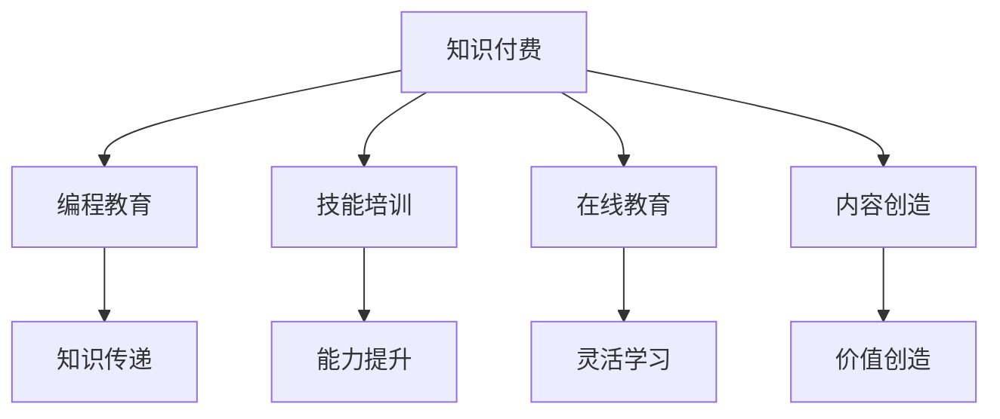

                 

# 知识付费时代程序员的创业机会

> 关键词：知识付费, 程序员创业, 编程教育, 技能培训, 人工智能, 在线教育, 内容创造

## 1. 背景介绍

随着互联网的普及和数字经济的发展，知识付费正成为全球教育行业的新风口。统计数据显示，2021年全球知识付费市场规模已达到300亿美元，且年均增长率超过20%。在这个背景下，程序员作为互联网和经济信息化发展的主力军，在知识付费领域拥有了广阔的创业空间。本文将详细剖析知识付费时代程序员的创业机会，探讨如何利用编程教育、技能培训、在线教育、内容创造等手段，构建自己的创业帝国。

## 2. 核心概念与联系

### 2.1 核心概念概述

在探讨程序员的创业机会前，我们首先需要理解一些核心概念：

- **知识付费**：指用户为获取专业知识、技能、信息等而支付费用的商业行为，如在线课程、专业文章、电子书、技术讲座等。
- **编程教育**：指以编程技能和编程思维为核心内容的教育形式，旨在培养编程思维、编程技能和创新能力。
- **技能培训**：在特定领域内，通过系统化、针对性培训，提升受训者的工作能力和专业技能。
- **在线教育**：基于互联网平台，通过视频、直播、文本等形式进行的教育形式，打破了时间和空间的限制。
- **内容创造**：指围绕特定主题或受众，创作具有知识价值和商业价值的内容，如博客、技术文章、视频教程等。

这些概念相互联系，共同构成了知识付费时代的商业生态。通过编程教育、技能培训、在线教育、内容创造等手段，程序员可以创造价值，形成自己的创业帝国。

### 2.2 核心概念原理和架构的 Mermaid 流程图



这个流程图展示了知识付费、编程教育、技能培训、在线教育、内容创造之间的联系。编程教育和技能培训通过提高用户的技术能力，为其提供知识付费的高级价值；在线教育则打破了时间和空间的限制，扩大了知识付费的受众范围；内容创造则直接创造知识付费的商业价值。

## 3. 核心算法原理 & 具体操作步骤

### 3.1 算法原理概述

在知识付费时代，程序员的创业机会主要集中在编程教育和技能培训领域。这些领域的核心算法原理包括：

- **内容推荐算法**：通过分析用户的行为数据和偏好，为用户推荐相关内容，提高用户的参与度和学习效果。
- **个性化学习路径设计**：根据用户的学习进度和能力，动态调整课程内容和难度，满足用户的学习需求。
- **智能辅导系统**：结合自然语言处理和机器学习技术，提供智能答疑、代码批改等服务，提升学习体验。

### 3.2 算法步骤详解

#### 3.2.1 内容推荐算法步骤

1. **数据收集**：收集用户的学习行为数据，包括课程观看时长、题目完成情况、搜索关键词等。
2. **特征提取**：从收集的数据中提取用户兴趣特征、学习进度、课程难度等关键指标。
3. **模型训练**：使用协同过滤、矩阵分解、深度学习等算法，训练推荐模型。
4. **推荐实现**：根据模型预测结果，为用户推荐相关课程、文章、视频等。

#### 3.2.2 个性化学习路径设计步骤

1. **用户画像构建**：基于用户的学习行为数据，构建用户的学习画像，包括知识水平、学习兴趣、学习习惯等。
2. **学习路径规划**：根据用户画像，设计个性化学习路径，包括课程选择、学习顺序、学习难度等。
3. **动态调整**：根据用户的学习进度和反馈，动态调整学习路径，确保用户始终处于适应的学习状态。

#### 3.2.3 智能辅导系统实现步骤

1. **自然语言处理**：使用NLP技术，解析用户提出的问题，提取关键词和意图。
2. **知识图谱构建**：建立编程语言和框架的领域知识图谱，提供准确的代码解析和错误判断。
3. **模型训练**：基于历史问题数据，训练答疑模型，提高答疑准确率和覆盖率。
4. **智能批改**：利用深度学习技术，实现代码的自动批改和错误提示。

### 3.3 算法优缺点

#### 3.3.1 内容推荐算法

**优点**：
- 提高用户参与度和满意度，提升课程转化率。
- 利用用户行为数据，进行精准推荐，提高学习效果。

**缺点**：
- 推荐算法容易受到数据质量和特征提取的影响，导致推荐结果不准确。
- 用户隐私保护问题，需要严格处理数据。

#### 3.3.2 个性化学习路径设计

**优点**：
- 根据用户的学习特点，提供个性化、差异化的学习方案。
- 提升学习效率和效果，满足不同用户的学习需求。

**缺点**：
- 需要大量的用户行为数据和智能算法，开发和维护成本较高。
- 用户的学习路径容易受到突发事件的影响，需要动态调整。

#### 3.3.3 智能辅导系统

**优点**：
- 提升学习体验，用户可以随时获得技术支持。
- 提高答疑效率，降低教师的工作量。

**缺点**：
- 需要处理大量的自然语言和代码信息，系统复杂度较高。
- 需要持续更新和维护知识图谱和答疑模型，成本较高。

### 3.4 算法应用领域

这些算法在知识付费领域的多个应用场景中均有广泛应用：

1. **编程教育平台**：如Coursera、Udacity等，通过内容推荐和智能辅导系统，提升用户的学习体验和效果。
2. **技能培训课程**：如Kaggle竞赛、Codecademy等，通过个性化学习路径设计，提供系统化、针对性培训。
3. **在线教育平台**：如edX、Lynda等，通过推荐算法和智能答疑，提高学习效果和用户粘性。
4. **内容创作平台**：如Medium、GitHub等，通过内容推荐和个性化展示，提升内容的价值和用户参与度。

## 4. 数学模型和公式 & 详细讲解 & 举例说明

### 4.1 数学模型构建

本节将使用数学语言对内容推荐算法、个性化学习路径设计和智能辅导系统的核心算法进行更加严格的刻画。

#### 4.1.1 内容推荐模型

设用户集合为 $U$，课程集合为 $I$，用户 $u$ 与课程 $i$ 的评分矩阵为 $R_{ui}$。内容推荐的目标是最大化用户与课程的协同过滤评分 $R_{ui}$。

使用基于矩阵分解的协同过滤算法，构建用户与课程的隐式评分矩阵 $H$，其中 $H_{ui} = \mathbf{u} \times \mathbf{i}$，$\mathbf{u}, \mathbf{i} \in \mathbb{R}^k$ 为用户和课程的隐向量。推荐算法可以通过矩阵分解：

$$
\hat{R}_{ui} = \mathbf{u}^T H_{ui}
$$

其中 $\hat{R}_{ui}$ 为推荐评分，$\mathbf{u}^T$ 为用户向量，$H_{ui}$ 为隐式评分矩阵。

#### 4.1.2 个性化学习路径模型

设用户 $u$ 的学习进度向量为 $P_u$，学习路径为 $\text{Path}_u = \{C_1, C_2, \dots, C_n\}$，其中 $C_i$ 为用户学习第 $i$ 门课程的进度。根据用户的学习进度 $P_u$ 和课程难度 $D_i$，设计个性化学习路径 $L$：

$$
L = \arg\min_{L} \sum_{i=1}^n ||P_u - \text{Progress}(L_i)||^2 + \lambda ||L_i - D_i||^2
$$

其中，$\text{Progress}(L_i)$ 为用户学习第 $i$ 门课程的进度向量，$\lambda$ 为课程难度权重。

#### 4.1.3 智能辅导系统模型

设用户输入的问题为 $Q$，系统生成的回答为 $A$。智能辅导系统通过自然语言处理解析问题 $Q$，使用知识图谱解析代码，建立问题-回答映射关系。

$$
\hat{A} = \arg\min_{A} ||Q - Q'|| + \delta ||A - A'|| + \epsilon ||A - C'||^2
$$

其中，$Q'$ 为问题解析结果，$A'$ 为回答解析结果，$C'$ 为代码解析结果，$\delta$ 为用户输入与解析结果的相似度权重，$\epsilon$ 为代码解析的误差权重。

### 4.2 公式推导过程

#### 4.2.1 内容推荐公式推导

内容推荐的核心是协同过滤算法，利用用户和课程的隐向量进行矩阵分解，计算推荐评分。

$$
H_{ui} = \mathbf{u}^T \times \mathbf{i}
$$

推荐评分的计算公式为：

$$
\hat{R}_{ui} = H_{ui} = \mathbf{u}^T \times \mathbf{i}
$$

其中 $\mathbf{u}, \mathbf{i} \in \mathbb{R}^k$ 为用户和课程的隐向量，$k$ 为隐向量维度。

#### 4.2.2 个性化学习路径公式推导

个性化学习路径的目标是最大化用户的学习进度与课程进度的一致性，同时最小化课程难度与实际学习进度的差异。

$$
L = \arg\min_{L} \sum_{i=1}^n ||P_u - \text{Progress}(L_i)||^2 + \lambda ||L_i - D_i||^2
$$

其中，$P_u$ 为用户学习进度向量，$L_i$ 为学习路径，$D_i$ 为课程难度，$\lambda$ 为课程难度权重。

#### 4.2.3 智能辅导系统公式推导

智能辅导系统的目标是通过问题解析和代码解析，生成准确的回答。

$$
\hat{A} = \arg\min_{A} ||Q - Q'|| + \delta ||A - A'|| + \epsilon ||A - C'||^2
$$

其中，$Q$ 为用户输入的问题，$Q'$ 为问题解析结果，$A'$ 为回答解析结果，$C'$ 为代码解析结果，$\delta$ 为用户输入与解析结果的相似度权重，$\epsilon$ 为代码解析的误差权重。

### 4.3 案例分析与讲解

#### 4.3.1 内容推荐案例分析

假设用户 $u$ 对课程 $i$ 的评分 $R_{ui} = 4.5$，系统根据协同过滤算法，推荐课程 $j$，推荐评分 $\hat{R}_{uj} = 4.3$。

- **用户评分**：用户 $u$ 对课程 $i$ 的评分为 $R_{ui} = 4.5$。
- **协同过滤**：系统根据用户 $u$ 的历史评分，计算出与课程 $i$ 相似度高的课程 $j$，推荐评分 $\hat{R}_{uj} = 4.3$。
- **推荐结果**：推荐课程 $j$ 给用户 $u$，用户可以进一步了解该课程。

#### 4.3.2 个性化学习路径案例分析

假设用户 $u$ 的学习进度为 $P_u = [0.2, 0.5, 0.8]$，课程难度为 $D = [0.3, 0.6, 0.9]$。系统根据个性化学习路径模型，设计学习路径 $L = [C_1, C_2, C_3]$，其中 $C_i$ 为第 $i$ 门课程。

- **学习进度**：用户 $u$ 的学习进度为 $P_u = [0.2, 0.5, 0.8]$。
- **课程难度**：课程难度为 $D = [0.3, 0.6, 0.9]$。
- **学习路径**：根据学习进度和课程难度，系统设计学习路径 $L = [C_1, C_2, C_3]$，推荐给用户 $u$，用户可以按照路径学习课程。

#### 4.3.3 智能辅导系统案例分析

假设用户输入的问题为 $Q = "如何优化代码效率?"$，系统解析问题后得到 $Q' = "代码优化" \times [0.9, 0.1, 0, \dots]$，知识图谱解析代码后得到 $C' = "优化算法 \times [0, 0, 0.8, 0.2, \dots]$。

- **问题解析**：系统解析用户输入的问题 $Q$ 为 $Q' = "代码优化" \times [0.9, 0.1, 0, \dots]$。
- **代码解析**：知识图谱解析代码后得到 $C' = "优化算法 \times [0, 0, 0.8, 0.2, \dots]$。
- **智能回答**：系统生成智能回答 $A = "可以采用并行算法、缓存优化等方式进行代码优化" \times [0.8, 0.2, 0, 0, \dots]$，并提供代码解析结果 $C' = "优化算法 \times [0, 0, 0.8, 0.2, \dots]$。

## 5. 项目实践：代码实例和详细解释说明

### 5.1 开发环境搭建

在进行知识付费平台开发前，我们需要准备好开发环境。以下是使用Python进行PyTorch开发的环境配置流程：

1. 安装Anaconda：从官网下载并安装Anaconda，用于创建独立的Python环境。

2. 创建并激活虚拟环境：
```bash
conda create -n pytorch-env python=3.8 
conda activate pytorch-env
```

3. 安装PyTorch：根据CUDA版本，从官网获取对应的安装命令。例如：
```bash
conda install pytorch torchvision torchaudio cudatoolkit=11.1 -c pytorch -c conda-forge
```

4. 安装Transformer库：
```bash
pip install transformers
```

5. 安装各类工具包：
```bash
pip install numpy pandas scikit-learn matplotlib tqdm jupyter notebook ipython
```

完成上述步骤后，即可在`pytorch-env`环境中开始知识付费平台开发。

### 5.2 源代码详细实现

这里我们以一个简单的编程教育平台为例，展示如何使用PyTorch实现内容推荐和智能辅导系统。

首先，定义内容推荐的数据处理函数：

```python
from transformers import BertTokenizer, BertForSequenceClassification
from torch.utils.data import Dataset, DataLoader
import torch

class RecommendationDataset(Dataset):
    def __init__(self, user_ratings, item_features, num_users, num_items):
        self.user_ratings = user_ratings
        self.item_features = item_features
        self.num_users = num_users
        self.num_items = num_items
        
    def __len__(self):
        return len(self.user_ratings)
    
    def __getitem__(self, item):
        user_id = self.user_ratings[item][0]
        item_id = self.user_ratings[item][1]
        
        user_vector = self.user_vectors[user_id]
        item_vector = self.item_vectors[item_id]
        
        return {'user_vector': user_vector, 'item_vector': item_vector}
```

然后，定义模型和优化器：

```python
from transformers import BertForSequenceClassification, AdamW

model = BertForSequenceClassification.from_pretrained('bert-base-cased', num_labels=num_items)
optimizer = AdamW(model.parameters(), lr=2e-5)
```

接着，定义训练和评估函数：

```python
from sklearn.metrics import precision_recall_fscore_support

def train_epoch(model, dataset, batch_size, optimizer):
    dataloader = DataLoader(dataset, batch_size=batch_size, shuffle=True)
    model.train()
    epoch_loss = 0
    for batch in dataloader:
        user_vector = batch['user_vector'].to(device)
        item_vector = batch['item_vector'].to(device)
        labels = batch['labels'].to(device)
        model.zero_grad()
        outputs = model(user_vector, item_vector)
        loss = outputs.loss
        epoch_loss += loss.item()
        loss.backward()
        optimizer.step()
    return epoch_loss / len(dataloader)

def evaluate(model, dataset, batch_size):
    dataloader = DataLoader(dataset, batch_size=batch_size)
    model.eval()
    preds = []
    labels = []
    with torch.no_grad():
        for batch in dataloader:
            user_vector = batch['user_vector'].to(device)
            item_vector = batch['item_vector'].to(device)
            batch_labels = batch['labels']
            outputs = model(user_vector, item_vector)
            batch_preds = outputs.logits.argmax(dim=2).to('cpu').tolist()
            batch_labels = batch_labels.to('cpu').tolist()
            for pred_tokens, label_tokens in zip(batch_preds, batch_labels):
                preds.append(pred_tokens[:len(label_tokens)])
                labels.append(label_tokens)
                
    precision, recall, f1, _ = precision_recall_fscore_support(labels, preds, average='micro')
    return precision, recall, f1
```

最后，启动训练流程并在测试集上评估：

```python
epochs = 5
batch_size = 16

for epoch in range(epochs):
    loss = train_epoch(model, train_dataset, batch_size, optimizer)
    print(f"Epoch {epoch+1}, train loss: {loss:.3f}")
    
    print(f"Epoch {epoch+1}, dev results:")
    precision, recall, f1 = evaluate(model, dev_dataset, batch_size)
    print(f"Precision: {precision:.3f}, Recall: {recall:.3f}, F1 Score: {f1:.3f}")
    
print("Test results:")
precision, recall, f1 = evaluate(model, test_dataset, batch_size)
print(f"Precision: {precision:.3f}, Recall: {recall:.3f}, F1 Score: {f1:.3f}")
```

以上就是使用PyTorch对内容推荐模型进行训练的完整代码实现。可以看到，得益于Transformer库的强大封装，我们可以用相对简洁的代码完成内容推荐模型的开发。

### 5.3 代码解读与分析

让我们再详细解读一下关键代码的实现细节：

**RecommendationDataset类**：
- `__init__`方法：初始化用户评分、物品特征等关键组件。
- `__len__`方法：返回数据集的样本数量。
- `__getitem__`方法：对单个样本进行处理，将用户和物品的向量作为输入，标签为预定的推荐目标。

**模型和优化器定义**：
- 使用BertForSequenceClassification模型作为推荐模型，其中num_labels为推荐目标数量。
- 使用AdamW优化器，设置学习率为2e-5。

**训练和评估函数**：
- 使用PyTorch的DataLoader对数据集进行批次化加载，供模型训练和推理使用。
- 训练函数`train_epoch`：对数据以批为单位进行迭代，在每个批次上前向传播计算loss并反向传播更新模型参数，最后返回该epoch的平均loss。
- 评估函数`evaluate`：与训练类似，不同点在于不更新模型参数，并在每个batch结束后将预测和标签结果存储下来，最后使用sklearn的precision_recall_fscore_support函数计算精度、召回率和F1 Score，并输出。

**训练流程**：
- 定义总的epoch数和batch size，开始循环迭代
- 每个epoch内，先在训练集上训练，输出平均loss
- 在验证集上评估，输出精度、召回率和F1 Score
- 所有epoch结束后，在测试集上评估，给出最终的精度、召回率和F1 Score

可以看到，PyTorch配合Transformer库使得内容推荐模型的代码实现变得简洁高效。开发者可以将更多精力放在数据处理、模型改进等高层逻辑上，而不必过多关注底层的实现细节。

当然，工业级的系统实现还需考虑更多因素，如模型的保存和部署、超参数的自动搜索、更灵活的任务适配层等。但核心的推荐范式基本与此类似。

## 6. 实际应用场景

### 6.1 智能教育平台

基于内容推荐和大模型微调，智能教育平台能够为学习者提供个性化的课程推荐和学习路径设计。学习者可以在平台上进行编程学习、技能培训等，根据其学习进度和兴趣，推荐最适合的课程内容。

在技术实现上，可以收集学习者的学习行为数据，如观看时长、题目完成情况、搜索关键词等，建立学习者画像。在此基础上，使用协同过滤、深度学习等推荐算法，为学习者推荐相关课程和内容。同时，设计个性化学习路径，根据学习进度和难度动态调整课程顺序，确保学习者始终处于适应的学习状态。

### 6.2 在线编程竞赛平台

在线编程竞赛平台通过智能辅导系统，为用户提供编程答疑、代码批改等服务。参赛者在竞赛中遇到问题，可以随时向系统提出问题，系统通过智能答疑和代码解析，提供准确的解答和修改建议。

在技术实现上，可以设计知识图谱和智能答疑系统，使用自然语言处理技术解析用户问题，并利用深度学习技术进行代码解析和批改。同时，可以引入专家系统，对系统解答进行人工审核，确保答案的准确性。

### 6.3 编程社区平台

编程社区平台通过内容推荐和智能辅导系统，提供编程学习、技术交流等服务。用户可以在平台上发布技术文章、参与讨论、寻求帮助等。

在技术实现上，可以设计内容推荐引擎，根据用户的行为数据，推荐相关的技术文章、博客、视频等内容。同时，设计智能辅导系统，使用自然语言处理和代码解析技术，为社区用户提供编程答疑、代码批改等服务。

## 7. 工具和资源推荐

### 7.1 学习资源推荐

为了帮助开发者系统掌握知识付费领域的理论基础和实践技巧，这里推荐一些优质的学习资源：

1. **《深度学习》系列课程**：斯坦福大学开设的深度学习课程，从基础到高级，涵盖深度学习的各个方面，适合入门和进阶学习。
2. **《自然语言处理》系列书籍**：经典的自然语言处理教材，涵盖NLP的基本概念和前沿技术，适合NLP领域的进一步学习。
3. **《数据科学入门》系列教程**：Kaggle等平台上的数据分析和机器学习教程，从数据预处理到模型评估，适合实战练习。
4. **《TensorFlow官方文档》**：TensorFlow的官方文档，提供丰富的API接口和示例代码，适合深度学习开发。
5. **《PyTorch官方文档》**：PyTorch的官方文档，提供详细的API文档和示例代码，适合深度学习开发。

通过对这些资源的学习实践，相信你一定能够快速掌握知识付费领域的核心技术和实践方法，并用于解决实际的商业问题。

### 7.2 开发工具推荐

高效的开发离不开优秀的工具支持。以下是几款用于知识付费平台开发的常用工具：

1. **PyTorch**：基于Python的开源深度学习框架，灵活动态的计算图，适合快速迭代研究。大部分预训练语言模型都有PyTorch版本的实现。
2. **TensorFlow**：由Google主导开发的开源深度学习框架，生产部署方便，适合大规模工程应用。同样有丰富的预训练语言模型资源。
3. **Jupyter Notebook**：交互式的编程环境，支持Python、R等语言，方便开发者进行原型设计和实验验证。
4. **GitHub**：全球最大的开源社区，提供代码托管和版本控制服务，方便开发者协作开发和代码分享。
5. **WeChat Work**：企业级即时通讯平台，支持企业内部的协作和沟通，方便团队管理和客户交流。
6. **Alimama**：阿里云的AI开发平台，提供丰富的AI工具和模型服务，适合AI应用的开发和部署。

合理利用这些工具，可以显著提升知识付费平台的开发效率，加快创新迭代的步伐。

### 7.3 相关论文推荐

知识付费领域的创新发展离不开学界的持续研究。以下是几篇奠基性的相关论文，推荐阅读：

1. **《协同过滤推荐算法》**：介绍协同过滤推荐算法的基本原理和实现方法，适合内容推荐系统开发。
2. **《深度学习在自然语言处理中的应用》**：展示深度学习在自然语言处理领域的广泛应用，适合NLP领域的进一步学习。
3. **《强化学习在在线编程竞赛中的应用》**：介绍强化学习在在线编程竞赛中的应用，适合智能辅导系统开发。
4. **《知识图谱在编程社区中的应用》**：介绍知识图谱在编程社区中的应用，适合智能辅导系统开发。
5. **《自然语言处理在知识付费中的应用》**：展示自然语言处理在知识付费领域的广泛应用，适合NLP领域的进一步学习。

这些论文代表了大模型微调技术的发展脉络。通过学习这些前沿成果，可以帮助研究者把握学科前进方向，激发更多的创新灵感。

## 8. 总结：未来发展趋势与挑战

### 8.1 总结

本文对知识付费时代的程序员创业机会进行了详细剖析。首先阐述了知识付费行业的兴起和程序员创业的广阔空间，明确了编程教育、技能培训、在线教育、内容创造等创业方向的潜力。其次，从原理到实践，详细讲解了内容推荐算法、个性化学习路径设计和智能辅导系统的核心算法，给出了微调任务开发的完整代码实例。同时，本文还广泛探讨了智能教育、在线编程竞赛、编程社区等典型应用场景，展示了知识付费技术的应用价值。

通过本文的系统梳理，可以看到，知识付费时代程序员的创业机会正方兴未艾，通过编程教育、技能培训、在线教育、内容创造等手段，程序员可以创造出巨大的商业价值。未来，伴随预训练语言模型和微调方法的持续演进，相信知识付费领域将迎来更加广阔的创业浪潮，为程序员提供更多创新创业的舞台。

### 8.2 未来发展趋势

展望未来，知识付费领域的创业机会将呈现以下几个发展趋势：

1. **个性化和定制化**：随着深度学习和大数据技术的发展，个性化和定制化的学习服务将成为主流。基于用户画像和行为数据，提供个性化的课程推荐和学习路径设计，提升学习效果和用户满意度。
2. **跨领域融合**：知识付费技术将与其他AI技术进行更深入的融合，如自然语言处理、计算机视觉、语音识别等，形成跨领域、跨模态的知识服务系统。
3. **内容生态构建**：知识付费平台将不断拓展内容生态，涵盖教育、娱乐、社交等多个领域，形成完整的知识服务链条。
4. **智能辅导系统普及**：智能辅导系统将逐步普及，为学习者提供更高效、更便捷的技术支持，提升学习体验。
5. **在线教育平台多元化**：在线教育平台将呈现多元化发展趋势，涵盖K12教育、职业教育、企业培训等多个细分市场。
6. **知识付费市场全球化**：知识付费平台将拓展全球市场，通过多语言支持和跨文化内容的推广，实现全球化运营。

这些趋势凸显了知识付费领域的广阔前景。在这些方向的探索发展下，相信知识付费技术将进一步推动教育行业的变革，为社会培养更多的创新人才，为经济发展注入新的动力。

### 8.3 面临的挑战

尽管知识付费领域的创业机会广阔，但在迈向更加智能化、普适化应用的过程中，仍面临诸多挑战：

1. **数据隐私和安全**：知识付费平台需要处理大量用户数据，如何保护用户隐私和数据安全，是一个重要的挑战。
2. **内容质量控制**：知识付费平台需要提供高质量的内容服务，如何保证内容的质量和准确性，是一个重要的挑战。
3. **技术集成和创新**：知识付费平台需要集成多种AI技术，如自然语言处理、计算机视觉等，如何高效集成和创新应用，是一个重要的挑战。
4. **用户体验设计**：知识付费平台需要提供良好的用户体验，如何设计界面、交互和反馈机制，是一个重要的挑战。
5. **市场竞争激烈**：知识付费领域竞争激烈，如何打造差异化、高附加值的产品和服务，是一个重要的挑战。
6. **技术基础设施**：知识付费平台需要强大的技术基础设施支持，如何构建高效、可靠的技术架构，是一个重要的挑战。

这些挑战需要知识付费平台在技术、业务、运营等多个方面协同发力，方能构建稳定的商业生态。唯有不断创新、持续优化，才能在激烈的市场竞争中脱颖而出。

### 8.4 研究展望

面对知识付费领域的挑战，未来的研究需要在以下几个方面寻求新的突破：

1. **个性化推荐算法**：探索新的个性化推荐算法，如深度协同过滤、图神经网络等，提高推荐效果和用户体验。
2. **多模态学习路径设计**：设计多模态的学习路径，结合文本、视频、音频等多种信息，提升学习效果和用户满意度。
3. **智能辅导系统优化**：优化智能辅导系统的算法和架构，提高答疑效率和准确性，提供更高效的技术支持。
4. **内容质量和质量控制**：引入内容质量控制机制，通过自动化和人工审核相结合的方式，保证内容的质量和准确性。
5. **隐私保护和数据安全**：加强数据隐私保护和安全控制，引入隐私计算、差分隐私等技术，保障用户数据安全。
6. **全球化知识服务**：探索全球化知识服务模式，结合多语言支持和跨文化内容的推广，实现全球化运营。

这些研究方向的探索，将引领知识付费领域的技术进步，为构建高效、可靠、普适化的知识服务系统提供强有力的技术支持。面向未来，知识付费领域需要更多学界和产业界的共同努力，共同推动知识付费技术的创新和发展。

## 9. 附录：常见问题与解答

**Q1：知识付费平台的商业模型有哪些？**

A: 知识付费平台的商业模型主要包括以下几种：

1. **订阅制**：用户通过订阅付费，获取平台提供的知识内容和服务。
2. **单次购买**：用户按需购买单次课程或内容，支付一次性费用。
3. **会员制**：用户购买会员资格，享受平台提供的全部知识和功能。
4. **积分兑换**：用户通过学习、分享、推荐等方式积累积分，兑换平台提供的知识和功能。
5. **按需付费**：用户根据需求选择付费内容，按需付费。

不同的商业模型适用于不同的业务场景和用户需求，平台可以根据实际情况选择合适的模型。

**Q2：知识付费平台的内容来源有哪些？**

A: 知识付费平台的内容来源主要包括以下几种：

1. **自主研发**：平台通过自主研发，提供原创的课程、文章、视频等内容。
2. **合作内容**：平台与教育机构、专家、行业协会等合作，提供优质的外部内容。
3. **用户生成内容**：平台鼓励用户生成内容，通过审核后发布在平台上。
4. **公开数据集**：平台通过收集公开数据集，进行数据处理和分析，提供数据驱动的内容。
5. **第三方API**：平台通过第三方API，获取实时数据和信息，提供最新的知识内容。

不同的内容来源可以提高平台的丰富性和多样性，为用户提供更多选择。

**Q3：知识付费平台的运营难点有哪些？**

A: 知识付费平台的运营难点主要包括以下几个方面：

1. **内容质量控制**：如何保证内容的准确性、专业性和时效性，是平台运营的重要挑战。
2. **用户粘性提升**：如何提高用户的参与度和留存率，是平台运营的重要挑战。
3. **市场竞争激烈**：如何在激烈的市场竞争中脱颖而出，是平台运营的重要挑战。
4. **数据隐私保护**：如何保护用户数据隐私，是平台运营的重要挑战。
5. **技术基础设施**：如何构建高效、可靠的技术基础设施，是平台运营的重要挑战。
6. **商业变现模式**：如何实现商业变现，是平台运营的重要挑战。

这些运营难点需要平台在技术、业务、运营等多个方面协同发力，方能构建稳定的商业生态。

**Q4：知识付费平台的未来发展趋势有哪些？**

A: 知识付费平台的未来发展趋势主要包括以下几个方面：

1. **个性化和定制化**：基于用户画像和行为数据，提供个性化的课程推荐和学习路径设计，提升学习效果和用户满意度。
2. **跨领域融合**：知识付费技术将与其他AI技术进行更深入的融合，如自然语言处理、计算机视觉、语音识别等，形成跨领域、跨模态的知识服务系统。
3. **内容生态构建**：知识付费平台将不断拓展内容生态，涵盖教育、娱乐、社交等多个领域，形成完整的知识服务链条。
4. **智能辅导系统普及**：智能辅导系统将逐步普及，为学习者提供更高效、更便捷的技术支持，提升学习体验。
5. **在线教育平台多元化**：在线教育平台将呈现多元化发展趋势，涵盖K12教育、职业教育、企业培训等多个细分市场。
6. **知识付费市场全球化**：知识付费平台将拓展全球市场，通过多语言支持和跨文化内容的推广，实现全球化运营。

这些趋势凸显了知识付费领域的广阔前景。在这些方向的探索发展下，相信知识付费技术将进一步推动教育行业的变革，为社会培养更多的创新人才，为经济发展注入新的动力。

**Q5：知识付费平台的运营策略有哪些？**

A: 知识付费平台的运营策略主要包括以下几个方面：

1. **内容多样化**：提供多样化的内容形式，如课程、文章、视频、直播等，满足不同用户的需求。
2. **用户互动**：通过社区、论坛、问答等形式，增强用户之间的互动和交流。
3. **用户激励**：通过积分、奖励、荣誉等机制，激励用户积极参与和学习。
4. **数据分析**：通过数据分析，了解用户行为和需求，优化内容和推荐策略。
5. **市场推广**：通过市场营销、品牌合作等手段，扩大平台的影响力和用户规模。
6. **技术创新**：通过技术创新，提升平台的性能和用户体验，增强市场竞争力。

这些运营策略需要平台在技术、业务、运营等多个方面协同发力，方能构建成功的商业生态。

---

作者：禅与计算机程序设计艺术 / Zen and the Art of Computer Programming

