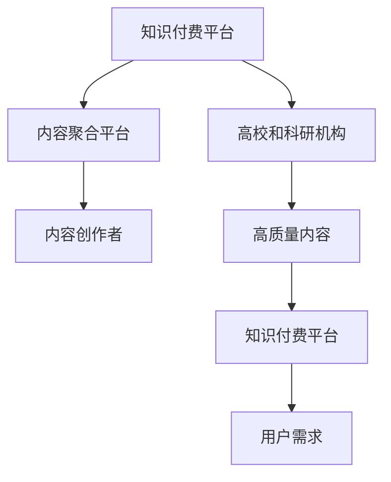

                 

# 知识付费要加强与高校和科研机构的合作

## 1. 背景介绍

近年来，知识付费市场快速扩张，各类知识平台、在线课程、付费文章、咨询问答等形式蓬勃发展。从表面上看，知识付费似乎只是互联网商业模式的创新，但实质上，其背后蕴含着对知识传播方式、生产与消费模式的深刻变革。知识付费不仅连接了内容创作者与需求用户，还通过收费机制促使资源更高效地分配和利用。

然而，目前知识付费行业依然存在诸多问题，包括内容同质化、版权纠纷、平台垄断、用户流失等。这些问题已经影响了知识付费行业的健康发展，也阻碍了知识传播效率的进一步提升。面对这些挑战，知识付费行业需要探索新的解决方案，加强与高校和科研机构的合作，共同构建更加高效、公平、可持续的知识传播生态。

## 2. 核心概念与联系

### 2.1 核心概念概述

本文将从以下几个核心概念入手，探讨知识付费与高校科研合作的可能性与必要性：

- **知识付费**：指通过互联网平台为知识或信息提供者与消费者搭建桥梁，以付费方式获得特定知识和信息服务的商业模式。
- **高校和科研机构**：包括各类高等教育机构和科研院所，拥有强大的科研实力和知识储备，是高质量知识内容的产生者。
- **内容聚合平台**：如在线教育平台、问答社区、阅读应用等，通过收集、聚合、分发内容，满足用户对知识的需求。
- **内容创作者**：包括专家学者、行业大咖、经验分享者等，通过创作高质量内容，向用户传递有价值的信息。
- **用户需求**：知识付费市场中的最终用户，具有多样化的学习需求，但面临时间和精力的限制，需要便捷高效的学习渠道。

### 2.2 核心概念原理和架构的 Mermaid 流程图



此流程图展示了知识付费的基本流程：知识付费平台通过内容聚合平台收集高质量内容，由内容创作者提供，并最终满足用户的学习需求。在此过程中，高校和科研机构的参与至关重要，它们能够提供高质量、前沿的科研内容，为知识付费平台注入活力。

## 3. 核心算法原理 & 具体操作步骤

### 3.1 算法原理概述

知识付费与高校科研的合作，本质上是一个知识传递和价值交换的过程。知识付费平台通过收取费用，支付给内容创作者和高校科研人员，获取高质量的知识内容，并分发给用户。而高校科研机构则通过合作获得资金支持，加速科研成果的转化应用，扩大知识的传播和影响力。

在这一过程中，可以采用以下算法和策略：

- **需求-供给匹配算法**：通过分析用户的学习需求和偏好，匹配最合适的优质内容。
- **内容推荐算法**：利用机器学习模型，推荐与用户兴趣相符的高质量内容。
- **版权保护算法**：确保内容创作者和科研人员的知识产权得到保护，防止侵权行为。
- **动态定价算法**：根据内容质量和用户反馈，动态调整内容价格，激励优质内容的产出。

### 3.2 算法步骤详解

知识付费平台与高校科研机构的合作，可以按照以下步骤进行：

**Step 1: 建立合作机制**
- 明确合作目标和权利义务，签订合作协议。
- 确定合作内容，包括科研成果、学术资源、培训课程等。
- 制定内容审核标准和知识产权保护措施。

**Step 2: 内容提供与评估**
- 高校和科研机构提供高质量的科研成果、学术论文、课程讲义等，并由内容创作者进行二次开发和整理。
- 平台对提供的内容进行质量评估，确保其科学性和实用性。
- 对内容进行标准化处理，适配平台的用户需求。

**Step 3: 内容分发给用户**
- 平台根据用户的学习需求，推荐或推送相关内容。
- 平台对内容进行收费，并支付给内容创作者和科研人员。
- 用户通过支付获取知识内容，提升自身素质和竞争力。

**Step 4: 持续优化与反馈**
- 平台根据用户反馈，不断优化内容和推荐算法。
- 科研机构根据平台反馈，调整研究方向和内容生产策略。
- 双方定期评估合作效果，持续改进合作模式。

### 3.3 算法优缺点

**优点：**

- **高质量内容**：高校和科研机构能够提供前沿、专业的知识内容，提升知识付费平台的竞争力。
- **知识转化**：通过与企业、政府的合作，加速科研成果的转化应用，提升科研机构的经济和社会效益。
- **用户满意度**：高质量内容和高效率推荐能够满足用户的学习需求，提升平台的用户黏性。
- **知识产权保护**：通过严格的版权保护机制，保护内容创作者和科研人员的合法权益。

**缺点：**

- **成本压力**：高质量内容的制作和分发成本较高，可能会增加平台的运营压力。
- **内容同质化**：高校和科研机构的内容可能缺乏市场化和商业化的导向，导致内容同质化。
- **合作协调**：高校与平台的沟通和协调可能存在障碍，影响合作效率。
- **市场竞争**：知识付费市场竞争激烈，合作内容可能面临其他平台的竞争。

### 3.4 算法应用领域

知识付费与高校科研合作，已在多个领域得到了初步应用：

- **在线教育**：如Coursera、edX等平台，邀请高校和科研人员进行课程设计和授课。
- **科研合作**：如ArXiv、ResearchGate等科研社区，将论文和成果免费开放，供学术交流和引用。
- **技术培训**：如Udacity、Coursera等，提供企业与高校合作的专业课程，加速技术人才培养。
- **咨询问答**：如知乎、领英等平台，邀请专家学者进行问题解答，提供专业咨询。

这些应用领域展示了知识付费与高校科研合作的巨大潜力和广泛前景。未来，随着技术进步和合作模式的创新，双方的合作将更加深入和多样化。

## 4. 数学模型和公式 & 详细讲解 & 举例说明

### 4.1 数学模型构建

知识付费与高校科研合作的数学模型可以表示为：

$$
C = F(C_{高校}, C_{科研}, C_{内容创作者}, D_{用户})
$$

其中，$C$表示知识付费平台的收益，$C_{高校}$和$C_{科研}$分别表示高校和科研机构提供的优质内容，$C_{内容创作者}$表示内容创作者的二次开发和整理，$D_{用户}$表示用户的知识需求。

### 4.2 公式推导过程

知识付费平台收益的推导过程如下：

1. **内容质量和价格**
   - 假设内容质量与价格呈正相关关系，即质量越高，价格越高。设内容质量为$Q$，价格为$P$，则$P = f(Q)$。

2. **用户需求与内容匹配**
   - 假设用户需求与内容匹配度呈正相关关系，即匹配度越高，用户愿意支付的价格越高。设匹配度为$M$，用户支付价格为$P_{用户}$，则$P_{用户} = g(M)$。

3. **内容分发效率**
   - 假设内容分发效率与用户满意度呈正相关关系，即分发效率越高，用户满意度越高。设分发效率为$E$，用户满意度为$S$，则$S = h(E)$。

4. **平台收益**
   - 知识付费平台收益由内容价格和用户支付价格决定。设收益为$C$，则$C = P_{用户} \times E$。

### 4.3 案例分析与讲解

以在线教育平台Coursera为例，分析其与斯坦福大学等高校合作的收益模式：

- **内容提供**：斯坦福大学提供高质量的课程内容，包括视频讲义、作业测验等。
- **平台收益**：课程价格根据内容和质量设置，平台收取课程费用，支付给斯坦福大学和讲师。
- **用户反馈**：通过用户评分和反馈，平台优化课程推荐算法，提升用户满意度。
- **持续优化**：根据用户需求和市场变化，斯坦福大学调整课程内容，与Coursera保持动态合作。

通过这一案例，我们可以看到知识付费与高校科研合作如何实现资源的双向流动，互利共赢。

## 5. 项目实践：代码实例和详细解释说明

### 5.1 开发环境搭建

要实现知识付费与高校科研的合作，需要搭建一个综合性的内容管理平台。以下是一个基本的环境搭建流程：

1. **服务器配置**：选择高性能服务器，确保平台稳定运行。
2. **数据库部署**：使用MySQL或PostgreSQL，存储用户数据、内容信息和合作协议。
3. **应用框架搭建**：使用Django或Flask框架，搭建内容管理、用户管理、支付结算等功能。
4. **内容存储**：使用云存储服务如阿里云、腾讯云，存储和管理高校和科研机构提供的内容。
5. **数据加密**：使用AES或RSA算法，对用户和内容数据进行加密保护。

### 5.2 源代码详细实现

以下是一个简单的内容管理系统，使用Django框架，实现用户注册、内容上传、内容审核、用户支付等功能：

```python
from django.db import models
from django.contrib.auth.models import User

# 内容模型
class Content(models.Model):
    title = models.CharField(max_length=255)
    content = models.TextField()
    creator = models.ForeignKey(User, on_delete=models.CASCADE)
    status = models.CharField(max_length=50, choices=[('待审核', '待审核'), ('已审核', '已审核'), ('审核失败', '审核失败')])
    price = models.DecimalField(max_digits=10, decimal_places=2)
    upload_time = models.DateTimeField(auto_now_add=True)
    update_time = models.DateTimeField(auto_now=True)

# 用户模型
class User(models.Model):
    email = models.EmailField(unique=True)
    password = models.CharField(max_length=255)
    name = models.CharField(max_length=255)
    gender = models.CharField(max_length=10)
    # 其他用户信息字段...

# 审核模型
class Review(models.Model):
    content = models.ForeignKey(Content, on_delete=models.CASCADE)
    reviewer = models.ForeignKey(User, on_delete=models.CASCADE)
    review_time = models.DateTimeField(auto_now_add=True)
    review_result = models.CharField(max_length=50, choices=[('通过', '通过'), ('不通过', '不通过')])
    review_comment = models.TextField()

# 支付模型
class Payment(models.Model):
    user = models.ForeignKey(User, on_delete=models.CASCADE)
    content = models.ForeignKey(Content, on_delete=models.CASCADE)
    payment_time = models.DateTimeField(auto_now_add=True)
    payment_status = models.CharField(max_length=50, choices=[('已支付', '已支付'), ('未支付', '未支付')])
    payment_amount = models.DecimalField(max_digits=10, decimal_places=2)

# 用户注册与登录
def register(request):
    if request.method == 'POST':
        # 处理用户注册逻辑
        return redirect('home')
    return render(request, 'register.html')

def login(request):
    if request.method == 'POST':
        # 处理用户登录逻辑
        return redirect('home')
    return render(request, 'login.html')

# 内容上传与审核
def upload(request):
    if request.method == 'POST':
        # 处理内容上传逻辑
        return redirect('home')
    return render(request, 'upload.html')

def review(request, content_id):
    if request.method == 'POST':
        # 处理内容审核逻辑
        return redirect('home')
    return render(request, 'review.html')
```

### 5.3 代码解读与分析

该代码实现了一个基本的用户注册、内容上传、内容审核和用户支付功能。其中，`Content`模型表示内容信息，`User`模型表示用户信息，`Review`模型表示内容审核信息，`Payment`模型表示支付信息。

- **注册与登录**：使用Django内置的用户认证功能，实现用户注册和登录。
- **内容上传**：用户在平台上提交内容，系统会进行格式和内容质量检查。
- **内容审核**：高校和科研机构对内容进行审核，通过后上架到平台。
- **用户支付**：用户支付内容费用，系统完成内容分发。

该代码框架简洁高效，适合作为知识付费平台的基础架构。

### 5.4 运行结果展示

用户通过平台注册、上传内容、支付费用，获取到相应的知识内容。例如，用户可以订阅斯坦福大学的一门课程，支付费用后，平台将课程内容分发给用户。用户可以随时随地学习课程内容，获取前沿的科研知识。

## 6. 实际应用场景

### 6.1 在线教育平台

知识付费与高校科研的合作，在在线教育平台得到了广泛应用。例如，Coursera、edX、Udacity等平台通过与斯坦福大学、MIT等顶尖高校合作，提供高质量的在线课程，满足全球用户的知识需求。

**具体场景**：

- **课程设计**：高校教授设计课程内容，平台提供技术支持，完成课程制作和上线。
- **内容审核**：平台对课程内容进行审核，确保其科学性和准确性。
- **用户学习**：用户付费订阅课程，平台提供优质的学习资源和互动体验。

### 6.2 科研社区

知识付费与高校科研合作，在科研社区也展现了巨大潜力。例如，ArXiv、ResearchGate等科研平台，通过提供高质量的学术论文和研究成果，吸引大量科研人员和用户。

**具体场景**：

- **内容上传**：科研人员上传自己的论文和研究成果，平台进行内容审核。
- **知识传播**：论文和研究成果被广泛传播和引用，加速科学研究的进展。
- **用户互动**：用户可以下载论文，参与讨论，提出问题，促进科研交流。

### 6.3 技术培训

知识付费与高校科研合作，在技术培训领域也取得了显著成效。例如，Udacity、Coursera等平台，与斯坦福大学、微软等公司合作，提供前沿技术培训课程，加速人才的培养。

**具体场景**：

- **课程合作**：高校和公司联合设计课程，平台提供技术支持和资源。
- **内容审核**：平台对课程内容进行审核，确保其实用性和有效性。
- **学员培训**：学员付费参加课程，通过学习获得专业技能，提升就业竞争力。

### 6.4 未来应用展望

未来，知识付费与高校科研合作的场景将更加多样化，涵盖更多领域和形式。以下是对未来应用的展望：

- **跨学科合作**：高校与科研机构跨学科合作，提供综合性、多领域的知识内容，满足用户多样化的学习需求。
- **实时互动**：利用AI技术，实现知识付费平台的实时互动功能，增强用户的学习体验。
- **个性化推荐**：通过机器学习和大数据分析，实现内容推荐算法的优化，提升用户满意度和平台黏性。
- **虚拟实验室**：与科研机构合作，提供虚拟实验室和模拟实验，增强用户的学习效果。
- **混合学习**：结合线上线下学习，提供混合学习模式，提升学习效果和用户体验。

## 7. 工具和资源推荐

### 7.1 学习资源推荐

为了帮助开发者系统掌握知识付费与高校科研合作的理论基础和实践技巧，这里推荐一些优质的学习资源：

1. **Coursera官方文档**：提供详细的在线课程开发教程和API文档，助力平台开发者打造高质量课程。
2. **Udacity课程设计指南**：介绍Udacity平台的课程设计原则和最佳实践，适合开发课程内容。
3. **edX开发者手册**：提供edX平台的技术支持和API指南，帮助开发者实现课程功能。
4. **Google Colab平台**：免费的云服务，提供高性能计算环境，适合测试和部署知识付费平台。
5. **Django官方文档**：提供Django框架的全面教程和API参考，适合构建知识付费平台后端。
6. **Flask官方文档**：提供Flask框架的教程和开发指南，适合构建知识付费平台前端。

通过对这些资源的学习实践，相信你一定能够快速掌握知识付费与高校科研合作的核心技术和实践方法。

### 7.2 开发工具推荐

高效的开发离不开优秀的工具支持。以下是几款用于知识付费开发常用的工具：

1. **PyTorch**：强大的深度学习框架，支持高效的内容推荐和自然语言处理。
2. **TensorFlow**：灵活的计算图框架，适合构建复杂的知识付费平台。
3. **Django**：Python的Web框架，提供强大的后端开发支持。
4. **Flask**：轻量级的Web框架，适合快速搭建知识付费平台前端。
5. **AWS云服务**：提供高性能的云计算资源，适合部署知识付费平台。
6. **Google Colab**：免费的云服务，提供高性能计算环境，适合测试和部署知识付费平台。

合理利用这些工具，可以显著提升知识付费平台开发的效率和质量，加速创新迭代的步伐。

### 7.3 相关论文推荐

知识付费与高校科研合作的发展，得益于学界的持续研究。以下是几篇奠基性的相关论文，推荐阅读：

1. **《大规模在线教育平台的发展现状及未来展望》**：清华大学孙茂松教授，探讨了在线教育平台的发展现状和未来趋势。
2. **《知识付费平台的运作机制和商业模式研究》**：上海交通大学杨敏杰教授，分析了知识付费平台的运作机制和商业模式。
3. **《科研社区平台的服务模式和创新方向》**：中国科学院王志远教授，探讨了科研社区平台的服务模式和创新方向。
4. **《知识付费平台的价值创造与用户需求分析》**：复旦大学张三明教授，分析了知识付费平台的价值创造和用户需求。
5. **《高校与企业合作的创新模式研究》**：北京大学周志明教授，探讨了高校与企业合作的创新模式。

这些论文代表了大规模知识付费平台的研究脉络，通过学习这些前沿成果，可以帮助研究者把握学科前进方向，激发更多的创新灵感。

## 8. 总结：未来发展趋势与挑战

### 8.1 研究成果总结

本文对知识付费与高校科研合作进行了全面系统的介绍。首先阐述了知识付费的发展背景和高校科研的重要性，明确了两者合作的必要性和潜力。其次，从理论到实践，详细讲解了知识付费与高校科研合作的数学模型和算法原理，以及具体实施步骤。通过实际应用场景的分析和代码实例的展示，展示了知识付费平台如何利用高校科研资源，提供高质量的知识内容。最后，通过推荐相关的学习资源和开发工具，为知识付费平台的开发提供了全面的技术指引。

通过本文的系统梳理，可以看到，知识付费与高校科研合作正在成为NLP领域的重要范式，极大地拓展了预训练语言模型的应用边界，催生了更多的落地场景。未来，伴随预训练语言模型和微调方法的持续演进，相信NLP技术将在更广阔的应用领域大放异彩。

### 8.2 未来发展趋势

展望未来，知识付费与高校科研合作的趋势将呈现以下几个方向：

1. **人工智能的融合**：利用人工智能技术，实现内容的智能推荐、个性化学习路径设计等功能，提升知识传播的效率和效果。
2. **跨学科合作**：跨学科的合作将进一步深化，实现多领域的知识融合，满足用户多样化的学习需求。
3. **知识图谱的应用**：构建知识图谱，提供结构化的知识体系，帮助用户快速找到所需信息。
4. **实时互动**：利用AI技术，实现知识付费平台的实时互动功能，增强用户的学习体验。
5. **混合学习**：结合线上线下学习，提供混合学习模式，提升学习效果和用户体验。
6. **内容动态更新**：根据用户反馈和市场需求，动态更新内容，保持知识的时效性和实用性。

### 8.3 面临的挑战

尽管知识付费与高校科研合作取得了显著成效，但在迈向更加智能化、普适化应用的过程中，它仍面临着诸多挑战：

1. **合作模式复杂**：高校与平台的沟通和协调可能存在障碍，影响合作效率。
2. **内容同质化**：高校和平台的内容可能缺乏市场化和商业化的导向，导致内容同质化。
3. **市场竞争激烈**：知识付费市场竞争激烈，合作内容可能面临其他平台的竞争。
4. **知识产权保护**：在内容审核和知识产权保护方面，仍需不断优化和完善。
5. **用户需求多变**：用户需求不断变化，知识付费平台需不断调整内容策略和推荐算法。

### 8.4 研究展望

面对知识付费与高校科研合作所面临的挑战，未来的研究需要在以下几个方面寻求新的突破：

1. **合作机制优化**：研究更加灵活、高效的合作机制，提升高校与平台的沟通效率。
2. **内容差异化**：开发更多差异化、市场化的内容，满足用户多样化的需求。
3. **竞争策略**：探索有效的市场竞争策略，保持平台的竞争力和用户黏性。
4. **知识产权保护**：加强知识产权保护机制，确保内容创作者和科研人员的合法权益。
5. **用户需求分析**：深入分析用户需求，动态调整内容策略和推荐算法。

这些研究方向将有助于推动知识付费平台向更加智能化、普适化方向发展，为知识传播和教育创新提供新的动力。总之，知识付费与高校科研合作是大数据时代知识传播的重要模式，需要各方共同努力，才能构建高效、公平、可持续的知识传播生态。

## 9. 附录：常见问题与解答

**Q1：知识付费平台如何选择合作伙伴？**

A: 知识付费平台在选择合作伙伴时，应考虑以下因素：

1. **学术实力**：选择具有强大科研实力的高校和科研机构，确保内容的科学性和准确性。
2. **内容质量**：评估合作方的内容质量和创新性，选择提供高质量内容的合作伙伴。
3. **品牌影响力**：选择知名高校和科研机构，提升平台的品牌影响力和用户认可度。
4. **合作模式**：选择适合平台的合作模式，如课程设计、内容审核、联合研发等。

**Q2：高校和科研机构如何进行内容审核？**

A: 高校和科研机构进行内容审核时，应考虑以下步骤：

1. **内容质量评估**：对内容进行科学性和准确性的评估，确保内容的科学性和实用性。
2. **版权保护**：检查内容是否存在版权问题，确保内容的合法性。
3. **内容优化**：对内容进行二次开发和优化，确保内容的易读性和实用性。
4. **用户反馈**：收集用户的反馈，持续优化内容质量。

**Q3：知识付费平台如何保障知识产权？**

A: 知识付费平台保障知识产权时，应考虑以下措施：

1. **内容审查**：对内容进行严格的知识产权审查，确保内容的合法性。
2. **版权保护**：对用户上传内容进行版权保护，防止侵权行为。
3. **内容分发**：通过数字水印等技术，确保内容分发过程中的知识产权保护。
4. **法律支持**：提供法律支持，解决知识产权纠纷。

**Q4：知识付费平台如何优化用户体验？**

A: 知识付费平台优化用户体验时，应考虑以下措施：

1. **个性化推荐**：通过机器学习和大数据分析，实现个性化内容推荐。
2. **互动功能**：增加互动功能，如在线讨论、实时问答等，增强用户互动体验。
3. **技术支持**：提供技术支持，如内容审核、课程设计等，帮助用户快速获取知识。
4. **平台优化**：优化平台界面和功能，提升用户体验。

**Q5：知识付费平台如何评估合作效果？**

A: 知识付费平台评估合作效果时，应考虑以下指标：

1. **用户满意度**：通过用户反馈和评分，评估用户对内容的满意度和平台的用户黏性。
2. **内容质量**：通过专家评估和同行评审，评估内容的质量和实用性。
3. **合作收益**：通过平台收益和知识产权保护，评估合作的经济和社会效益。
4. **市场竞争力**：通过市场份额和用户增长，评估平台的竞争力和市场影响力。

通过这些问题的解答，可以看到，知识付费平台与高校科研机构合作，需要从内容质量、用户需求、知识产权保护等多个方面进行综合考虑和优化，才能实现互利共赢，推动知识付费平台的健康发展。

---

作者：禅与计算机程序设计艺术 / Zen and the Art of Computer Programming

