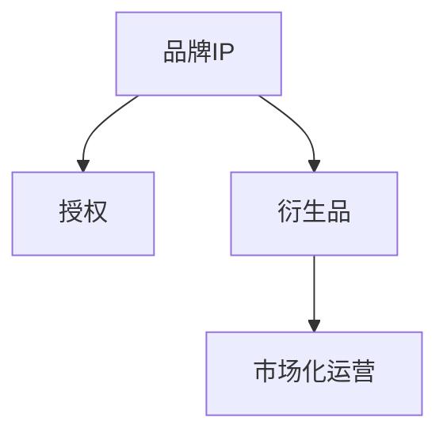

                 

# 知识付费赚钱的品牌IP授权与衍生品开发策略

在当今数字化经济的时代，知识付费正成为一种快速增长的市场。品牌通过其独特的IP（知识产权）授权与衍生品开发，不仅能获取可观的收入，还能有效提升品牌影响力和市场竞争力。本文将从核心概念、算法原理、实际操作、应用领域以及未来展望等多个方面，深入探讨知识付费品牌IP授权与衍生品开发的最佳策略。

## 1. 背景介绍

### 1.1 问题由来
随着互联网和移动设备的普及，人们获取知识的渠道日益多样化，知识付费市场应运而生。品牌和内容创作者通过提供专业知识、技能培训等，吸引用户支付费用，从而实现知识变现。品牌IP授权与衍生品开发，则是品牌在知识付费市场中的重要盈利方式。

### 1.2 问题核心关键点
品牌IP授权与衍生品开发的核心在于：
- 利用品牌的知名度和影响力，将品牌元素（如Logo、口号、形象代言人等）授权给第三方。
- 开发与品牌IP相关的衍生品，如书籍、视频、音频、周边产品等，以提升品牌价值。
- 通过多渠道营销，提高品牌曝光率，吸引更多用户支付订阅费用。

### 1.3 问题研究意义
品牌IP授权与衍生品开发不仅能为品牌带来直接的经济收益，还能增强品牌在用户心中的认知度和忠诚度，构建品牌生态。通过深入研究这一过程，可以为品牌在知识付费市场的成功运营提供有力指导。

## 2. 核心概念与联系

### 2.1 核心概念概述

品牌IP授权与衍生品开发涉及多个关键概念：

- **品牌IP**：包括品牌名称、Logo、形象代言人、独特口号等，是品牌形象的核心要素。
- **授权**：指将品牌IP的使用权授权给第三方，如版权、商标权等。
- **衍生品**：基于品牌IP开发的各种商品或服务，如书籍、视频、应用、周边产品等。
- **市场化运营**：通过合理的市场策略，将品牌IP授权与衍生品开发转化为实际收入。

这些概念之间的联系可以通过以下Mermaid流程图展示：



这个流程图展示了品牌IP授权与衍生品开发的流程：

1. 品牌IP是整个流程的起点，品牌需要通过设计、传播等方式建立并维护其独特形象。
2. 授权是将品牌IP的使用权转让给第三方，增加品牌的市场影响力。
3. 衍生品开发则是基于品牌IP的深度挖掘，创造出多样化的产品和服务。
4. 市场化运营则将品牌IP和衍生品推向市场，实现商业化变现。

## 3. 核心算法原理 & 具体操作步骤

### 3.1 算法原理概述

品牌IP授权与衍生品开发的核心算法原理是“市场驱动型”和“用户导向型”的混合应用。具体来说，品牌需通过市场调研、用户反馈等方式，了解目标用户的需求和偏好，再结合品牌自身的资源和特点，进行合理的IP授权和衍生品开发。

### 3.2 算法步骤详解

品牌IP授权与衍生品开发一般包括以下关键步骤：

**Step 1: 品牌定位与市场调研**
- 进行品牌定位，明确品牌的核心价值和目标受众。
- 进行市场调研，收集目标受众的偏好、需求等信息。

**Step 2: IP授权与商业化合作**
- 选择合适的授权对象，签订授权协议，明确使用范围和权限。
- 通过多样化的授权形式，如版权、商标权等，最大化品牌IP的价值。

**Step 3: 衍生品设计与开发**
- 基于品牌IP设计衍生品方案，考虑用户的实际需求和使用场景。
- 进行产品原型开发，并进行市场测试，收集用户反馈。
- 根据测试结果，不断优化和迭代产品。

**Step 4: 市场推广与用户运营**
- 制定详细的市场推广计划，利用社交媒体、电商平台等渠道进行推广。
- 建立用户运营体系，提供优质的用户体验，提升用户粘性。

**Step 5: 收入实现与持续改进**
- 实现品牌IP授权与衍生品的收入，进行数据分析，评估市场表现。
- 根据市场反馈和用户需求，持续改进产品和服务，保持竞争力。

### 3.3 算法优缺点

品牌IP授权与衍生品开发具有以下优点：
1. **品牌增值**：品牌通过IP授权和衍生品开发，可以扩大其市场影响力，提升品牌价值。
2. **多元化收入**：通过授权和衍生品开发，品牌可以获得多元化的收入来源，降低单一收入的风险。
3. **提升用户体验**：通过与用户互动，了解其需求和反馈，不断优化产品，提升用户体验。

同时，该方法也存在一些局限性：
1. **授权成本高**：品牌需要支付高昂的授权费用，成本较高。
2. **市场风险**：衍生品开发需要面临市场接受度的不确定性，存在风险。
3. **知识产权保护**：品牌需要在授权过程中注重知识产权保护，避免侵权风险。
4. **用户需求多样性**：不同用户的需求和偏好各异，需要灵活应对。

### 3.4 算法应用领域

品牌IP授权与衍生品开发的应用领域非常广泛，主要包括以下几个方面：

- **教育培训**：教育品牌可以授权其课程内容、教材等，开发教育应用、在线课程等衍生品。
- **健康保健**：健康品牌可以授权其营养建议、健身计划等，开发健康产品、应用等。
- **娱乐文化**：娱乐品牌可以授权其影视作品、音乐等，开发周边产品、音频服务等。
- **科技产品**：科技品牌可以授权其技术专利、设计方案等，开发智能设备、应用等。
- **时尚美妆**：时尚品牌可以授权其设计元素、品牌形象等，开发服饰、化妆品等。

## 4. 数学模型和公式 & 详细讲解 & 举例说明

### 4.1 数学模型构建

为了更好地理解品牌IP授权与衍生品开发的流程，我们可以构建一个简化的数学模型。假设品牌IP的价值为 $V$，市场调研的成本为 $C_1$，IP授权的费用为 $C_2$，衍生品开发的成本为 $C_3$，衍生品销售的收入为 $R$。

根据市场需求和品牌IP的吸引力，我们可以建立以下模型：

$$ R = k \cdot V - C_1 - C_2 - C_3 $$

其中 $k$ 是市场对品牌IP价值的认可度系数。

### 4.2 公式推导过程

为了最大化收入 $R$，品牌需最大化品牌IP价值 $V$，同时最小化成本 $C_1 + C_2 + C_3$。可以通过调整 $k$ 的值来优化这一模型。

**Step 1: 品牌价值评估**
- 评估品牌IP的市场价值，如通过市场调研、用户反馈等方式。
- 确定 $V$ 的初始值。

**Step 2: 成本优化**
- 对 $C_1$、$C_2$、$C_3$ 进行合理预算，确保在可接受的风险范围内。
- 通过优化授权协议、降低衍生品开发成本等措施，最小化总成本。

**Step 3: 收入最大化**
- 通过市场调研和用户反馈，调整 $k$ 的值，提升市场认可度。
- 优化市场推广策略，提升产品销售收入 $R$。

### 4.3 案例分析与讲解

假设某品牌通过市场调研发现其产品在健康领域有较高需求，决定授权其健康课程内容，并开发健康应用和营养计划等衍生品。

**品牌价值评估**：通过调研，该品牌在健康领域获得了较高的认可度，确定品牌价值 $V=100$。

**成本优化**：授权费用 $C_2=30$，衍生品开发成本 $C_3=50$。通过优化授权协议和开发流程，将总成本控制在合理范围内。

**收入最大化**：通过市场推广，品牌IP的认可度系数 $k=1.2$，预计衍生品销售收入 $R=80$。

最终，该品牌的市场总收益为 $R - C_1 - C_2 - C_3 = 80 - 10 - 30 - 50 = 30$。

## 5. 项目实践：代码实例和详细解释说明

### 5.1 开发环境搭建

在进行品牌IP授权与衍生品开发实践前，我们需要准备好开发环境。以下是使用Python进行Django开发的环境配置流程：

1. 安装Anaconda：从官网下载并安装Anaconda，用于创建独立的Python环境。

2. 创建并激活虚拟环境：
```bash
conda create -n django-env python=3.8 
conda activate django-env
```

3. 安装Django：
```bash
pip install django
```

4. 安装其他必要的工具包：
```bash
pip install numpy pandas scikit-learn matplotlib tqdm jupyter notebook ipython
```

完成上述步骤后，即可在`django-env`环境中开始开发实践。

### 5.2 源代码详细实现

下面我们以一个教育品牌为例，给出使用Django进行品牌IP授权与衍生品开发的全栈开发代码实现。

首先，定义品牌和衍生品的模型：

```python
from django.db import models
from django.contrib.auth.models import User

class Brand(models.Model):
    name = models.CharField(max_length=200)
    logo = models.ImageField(upload_to='brands/')
    description = models.TextField()

class Derivative(models.Model):
    brand = models.ForeignKey(Brand, on_delete=models.CASCADE)
    product_name = models.CharField(max_length=200)
    price = models.DecimalField(max_digits=10, decimal_places=2)
```

接着，定义视图和模板：

```python
from django.shortcuts import render
from django.http import HttpResponse

def brand_index(request):
    brands = Brand.objects.all()
    return render(request, 'brand/index.html', {'brands': brands})

def derivative_detail(request, id):
    derivative = Derivative.objects.get(id=id)
    return render(request, 'brand/derivative_detail.html', {'derivative': derivative})
```

最后，定义URL路由：

```python
from django.urls import path
from . import views

urlpatterns = [
    path('brands/', views.brand_index, name='brand_index'),
    path('brands/<int:id>/', views.derivative_detail, name='derivative_detail'),
]
```

以上就是使用Django进行品牌IP授权与衍生品开发的全栈代码实现。开发者可以利用 Django 的管理后台，方便地管理品牌和衍生品的各项数据。

### 5.3 代码解读与分析

让我们再详细解读一下关键代码的实现细节：

**Brand类**：
- `__init__`方法：初始化品牌信息，包括品牌名称、Logo、描述等。
- `name`、`logo`、`description`属性：用于存储品牌的基本信息。

**Derivative类**：
- `__init__`方法：初始化衍生品信息，包括品牌、产品名称、价格等。
- `brand`、`product_name`、`price`属性：用于存储衍生品的基本信息。

**品牌管理视图**：
- `brand_index`方法：展示所有品牌信息，用于品牌管理页面。
- `render`函数：将品牌信息渲染至HTML模板。

**衍生品详情视图**：
- `derivative_detail`方法：展示单个衍生品信息，用于衍生品详情页面。
- `render`函数：将衍生品信息渲染至HTML模板。

**URL路由**：
- 定义了品牌管理和衍生品详情的URL路径，便于前端调用。

可以看到，通过Django框架，品牌IP授权与衍生品开发的开发变得简洁高效。开发者可以将更多精力放在业务逻辑和用户体验上，而不必过多关注底层的实现细节。

当然，工业级的系统实现还需考虑更多因素，如安全性、扩展性、性能优化等。但核心的开发流程基本与此类似。

## 6. 实际应用场景

### 6.1 智能教育平台

基于品牌IP授权与衍生品开发的教育平台，可以为用户提供高质量的教育资源和服务。品牌可以通过授权其课程内容、教材等，开发在线课程、应用、辅助工具等衍生品，丰富教育形式。

在技术实现上，可以建立一个统一的学习平台，集成各类教育资源，并支持跨平台访问。同时，通过市场推广和用户运营，不断优化平台体验，提升用户粘性。

### 6.2 健康管理应用

健康品牌可以通过授权其健康计划、营养建议等内容，开发健康应用和营养计划等衍生品，帮助用户更好地管理健康。

在技术实现上，可以开发一个智能健康应用，提供个性化的健康建议、饮食计划、运动指导等。通过品牌IP授权，应用可以保持品牌一致性，提升用户信任度。

### 6.3 娱乐影视作品

娱乐品牌可以通过授权其影视作品、音乐等，开发影视应用、音乐播放服务等衍生品，拓展市场覆盖面。

在技术实现上，可以开发一个影视平台，提供视频点播、音乐播放、互动直播等功能。通过品牌IP授权，平台可以吸引更多用户，提升品牌影响力。

### 6.4 未来应用展望

随着品牌IP授权与衍生品开发技术的不断发展，其在更多领域的应用前景将愈加广阔。

在智慧医疗领域，品牌可以通过授权其健康计划和医疗知识，开发医疗应用、健康管理工具等，为患者提供便捷的诊疗服务。

在智能家居领域，品牌可以通过授权其智能设备设计和技术，开发智能家居应用和设备，提升家居生活的智能化水平。

在文化传媒领域，品牌可以通过授权其影视作品和文学作品，开发影视平台、文学应用等，丰富用户娱乐体验。

此外，在农业、旅游、金融等领域，品牌IP授权与衍生品开发也将不断涌现，为各行各业带来新的活力和机遇。

## 7. 工具和资源推荐

### 7.1 学习资源推荐

为了帮助开发者系统掌握品牌IP授权与衍生品开发的技术，这里推荐一些优质的学习资源：

1. Django官方文档：Django作为Python著名的Web框架，其官方文档详细介绍了Django的开发流程和最佳实践，是学习Django开发的重要参考。

2. Django教程系列：《Django Web开发实战教程》、《Django入门与实战》等书籍，通过实战案例讲解Django的各项功能和开发技巧，适合初学者学习。

3. Python Web开发实战指南：《Web应用开发实战》等书籍，详细介绍了Web应用的开发流程和工具，适合有经验的开发者提升技能。

4. DjangoCon会议录像：DjangoCon是Django社区的重要会议，其录像和会议资料可以帮助开发者了解最新的Django开发趋势和最佳实践。

5. Django第三方库文档：如Django REST framework、Django Admin等第三方库的文档，可以帮助开发者快速上手开发复杂的Web应用。

通过对这些资源的学习实践，相信你一定能够快速掌握品牌IP授权与衍生品开发的精髓，并用于解决实际的开发问题。

### 7.2 开发工具推荐

高效的开发离不开优秀的工具支持。以下是几款用于品牌IP授权与衍生品开发开发的常用工具：

1. Django：基于Python的开源Web框架，适合快速迭代研究，具备良好的可扩展性和灵活性。

2. Bootstrap：一个流行的前端框架，可以快速搭建响应式网站，提高用户体验。

3. jQuery：一个简洁实用的JavaScript库，方便进行前端交互和动画效果。

4. Vue.js：一个渐进式JavaScript框架，适用于构建复杂的Web应用。

5. Git和GitHub：版本控制工具和代码托管平台，方便团队协作和代码管理。

合理利用这些工具，可以显著提升品牌IP授权与衍生品开发的开发效率，加快创新迭代的步伐。

### 7.3 相关论文推荐

品牌IP授权与衍生品开发的发展源于学界的持续研究。以下是几篇奠基性的相关论文，推荐阅读：

1. "Brand Equity: Concepts and Management"（品牌资产：概念与管理）：介绍了品牌资产的定义、测量和提升方法，是品牌管理领域的重要经典。

2. "Brand Strategy: Planning for Brand Value"（品牌策略：价值规划）：探讨了品牌策略的制定与实施，提供了品牌管理的系统性方法。

3. "The Effects of Brand Personality on Consumer Responses: Brand Differentiation and Consumer Preference"（品牌个性对消费者反应的影响：品牌差异化和消费者偏好）：研究了品牌个性对消费者行为的影响，为品牌IP授权提供了理论基础。

4. "The Role of Corporate Social Responsibility in Building Brand Equity"（企业社会责任在品牌资产构建中的作用）：探讨了企业社会责任与品牌资产之间的关系，为品牌IP授权提供了新的视角。

这些论文代表了大品牌IP授权与衍生品开发的发展脉络。通过学习这些前沿成果，可以帮助研究者把握学科前进方向，激发更多的创新灵感。

## 8. 总结：未来发展趋势与挑战

### 8.1 总结

本文对品牌IP授权与衍生品开发的流程进行了全面系统的介绍。通过详细的算法原理和操作步骤，提供了品牌在知识付费市场中成功运营的指导。本文还广泛探讨了其在多个领域的应用前景，展示了品牌IP授权与衍生品开发的巨大潜力。

通过本文的系统梳理，可以看到，品牌IP授权与衍生品开发不仅能为品牌带来直接的经济收益，还能增强品牌在用户心中的认知度和忠诚度，构建品牌生态。品牌通过在知识付费市场中不断创新，必能在数字化经济时代中取得更大的成功。

### 8.2 未来发展趋势

展望未来，品牌IP授权与衍生品开发技术将呈现以下几个发展趋势：

1. **品牌资产的数字化**：随着数字技术的进步，品牌可以通过数字化手段，更精准地管理和评估其品牌资产。

2. **跨平台融合**：品牌IP授权将不再局限于单一平台，通过跨平台融合，形成统一的品牌体验。

3. **个性化推荐**：通过大数据和机器学习技术，品牌可以提供更个性化的产品和服务，提升用户体验。

4. **数据驱动决策**：品牌通过数据分析，优化市场策略，提升市场竞争力。

5. **全球化拓展**：品牌IP授权将走向全球化，通过本地化适应，拓展新的市场空间。

### 8.3 面临的挑战

尽管品牌IP授权与衍生品开发技术已经取得了显著成就，但在迈向更加智能化、普适化应用的过程中，它仍面临诸多挑战：

1. **市场变化快速**：品牌需持续关注市场变化，及时调整产品策略，以适应市场动态。

2. **数据隐私保护**：品牌需确保用户数据的隐私和安全，避免数据泄露风险。

3. **法规合规**：品牌需遵守不同地区的法律法规，避免侵权和不当行为。

4. **用户需求多样**：品牌需灵活应对不同用户的需求和偏好，提供多样化的产品和服务。

5. **技术门槛高**：品牌需具备较高的技术能力和团队实力，才能成功实施品牌IP授权与衍生品开发。

### 8.4 研究展望

面对品牌IP授权与衍生品开发所面临的挑战，未来的研究需要在以下几个方面寻求新的突破：

1. **大数据与人工智能**：利用大数据和人工智能技术，提高品牌决策的科学性和准确性。

2. **区块链技术**：通过区块链技术，增强品牌IP授权的透明性和可信度。

3. **社交媒体分析**：通过社交媒体分析，及时获取用户反馈，优化产品和服务。

4. **用户参与设计**：通过用户参与设计，提高产品开发的针对性和用户满意度。

5. **本地化适应**：根据不同地区的文化和市场特点，进行本地化设计和开发，提升市场适应性。

这些研究方向的探索，必将引领品牌IP授权与衍生品开发技术迈向更高的台阶，为品牌在知识付费市场的成功运营提供有力支持。面向未来，品牌需不断创新、勇于探索，才能在激烈的市场竞争中保持领先地位。

## 9. 附录：常见问题与解答

**Q1：如何进行品牌IP授权与衍生品开发的成本评估？**

A: 品牌IP授权与衍生品开发的成本评估主要包括以下几个方面：
1. **授权成本**：根据授权协议，计算授权费用的总和。
2. **衍生品开发成本**：包括开发人员的工资、工具和设备的购置费用等。
3. **市场推广成本**：包括广告费用、营销活动费用等。

通过详细评估这些成本，品牌可以制定合理的预算，控制风险。

**Q2：如何选择合适的授权对象？**

A: 选择合适的授权对象需要考虑以下几个方面：
1. **市场影响力**：选择具有高市场影响力的第三方，可以提升品牌IP的价值。
2. **品牌契合度**：选择与品牌形象和定位相符合的第三方，保持品牌一致性。
3. **盈利能力**：选择有较强盈利能力的第三方，保障授权协议的长期稳定。

品牌需通过市场调研和详细谈判，选择最适合的授权对象。

**Q3：如何确保用户数据的隐私和安全？**

A: 确保用户数据的隐私和安全，需要采取以下措施：
1. **数据加密**：对用户数据进行加密处理，防止数据泄露。
2. **访问控制**：严格控制数据访问权限，确保只有授权人员可以访问数据。
3. **合规检查**：遵守相关法律法规，确保数据处理符合要求。

品牌需制定详细的数据安全策略，并定期进行安全检查和更新。

**Q4：如何提升品牌IP授权与衍生品开发的市场竞争力？**

A: 提升品牌IP授权与衍生品开发的市场竞争力，需要采取以下措施：
1. **品牌建设**：通过持续的品牌建设，提升品牌知名度和美誉度。
2. **产品创新**：不断推出创新产品和服务，满足用户需求。
3. **市场推广**：通过多渠道市场推广，提升品牌曝光率和用户粘性。

品牌需关注市场动态，持续优化产品和服务，提升市场竞争力。

**Q5：如何处理品牌IP授权与衍生品开发中的法律风险？**

A: 处理品牌IP授权与衍生品开发中的法律风险，需要采取以下措施：
1. **合同审核**：在签订授权协议前，进行详细的合同审核，确保合同条款明确。
2. **知识产权保护**：通过商标、版权等方式，保护品牌IP的知识产权。
3. **法律咨询**：定期进行法律咨询，确保授权和衍生品开发符合相关法律法规。

品牌需通过合法合规的方式，避免法律风险。

---

作者：禅与计算机程序设计艺术 / Zen and the Art of Computer Programming

