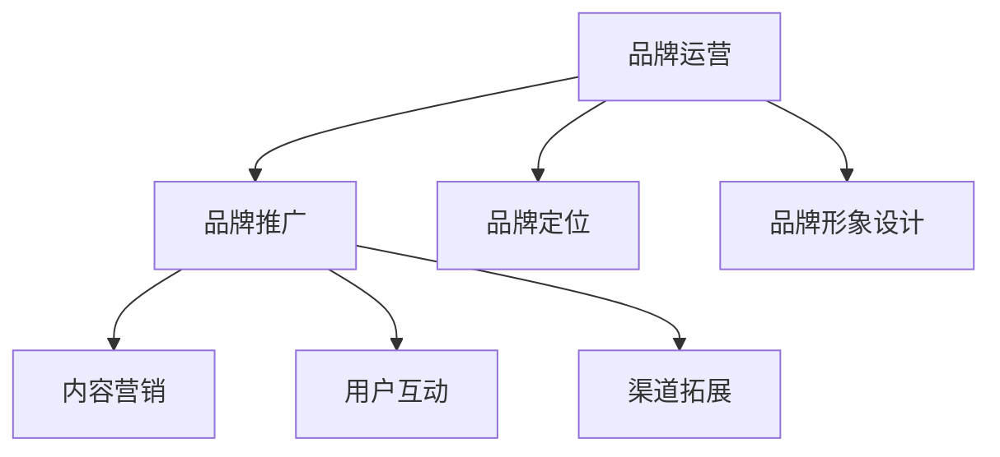

                 

# 知识付费赚钱的品牌品牌运营与品牌推广策略

> 关键词：知识付费, 品牌运营, 品牌推广, 营销策略, 用户增长

## 1. 背景介绍

随着互联网的快速发展，知识付费领域正迎来前所未有的发展机遇。各大平台纷纷布局知识付费市场，内容形式也从单一的文字文章扩展到音频、视频、直播等多样化的形式。知识付费不仅满足了用户的学习需求，也为企业提供了新的商业模式和利润增长点。然而，在这个激烈的市场竞争中，如何运营好品牌，有效推广知识付费产品，吸引用户并实现盈利，成为每一个平台和内容创作者亟待解决的问题。

本文将从品牌运营和品牌推广两个方面，深入分析知识付费领域的品牌打造与营销策略。通过系统梳理，希望能为知识付费的从业者提供有价值的参考和借鉴。

## 2. 核心概念与联系

### 2.1 核心概念概述

**知识付费**：指用户为获取知识、技能、信息等有价值的内容而支付费用的行为。随着知识经济的兴起，知识付费已经成为人们获取知识和信息的重要方式之一。

**品牌运营**：指通过一系列战略和措施，建立、维护和发展品牌，提升品牌知名度、美誉度和用户忠诚度的过程。

**品牌推广**：指通过各种营销手段，提高品牌在目标市场中的知名度和美誉度，吸引用户关注和参与。

这三者之间的关系可以概括为：品牌运营是品牌推广的基础，品牌推广则是品牌运营的具体实践。而知识付费则是一个应用场景，涉及到内容的生产、分发和变现等环节。以下是一个简化的品牌运营与品牌推广流程图：



## 3. 核心算法原理 & 具体操作步骤

### 3.1 算法原理概述

品牌运营和品牌推广的算法原理，可以大致分为三个步骤：

1. **品牌定位**：确定品牌的核心价值主张和目标用户群，制定品牌战略。
2. **品牌形象设计**：包括品牌标识、口号、色彩、字体等视觉元素的设计，以及品牌故事、品牌使命等非视觉元素的塑造。
3. **品牌推广策略**：通过多渠道营销手段，提升品牌知名度和美誉度。

### 3.2 算法步骤详解

#### 3.2.1 品牌定位

品牌定位是品牌运营的第一步，也是品牌推广的基础。有效的品牌定位不仅能区分于竞争对手，还能精准吸引目标用户。品牌定位的核心是找到品牌与用户需求的匹配点。

**步骤1**：市场调研
- 分析目标市场的用户需求、痛点和行为习惯。
- 了解竞争对手的品牌定位和市场表现。

**步骤2**：明确品牌价值主张
- 确定品牌所代表的核心价值，如专业性、权威性、易用性等。
- 制定品牌使命和愿景，形成品牌故事。

**步骤3**：设定目标用户群
- 根据市场调研结果，明确品牌的核心用户群体。
- 分析用户需求和行为，设计符合用户心理的产品和内容。

#### 3.2.2 品牌形象设计

品牌形象设计是品牌推广的重要环节，良好的品牌形象能够提升用户对品牌的认知度和信任度。品牌形象设计主要包括以下几个方面：

**视觉元素设计**：
- 品牌标识设计：包括品牌名、Logo、字体等。
- 色彩和字体设计：选择符合品牌调性的颜色和字体。
- 视觉统一性：保持品牌在所有渠道上的视觉一致性。

**非视觉元素设计**：
- 品牌故事和使命：通过品牌故事和使命，传递品牌的核心理念。
- 价值观和信仰：明确品牌的价值观和信仰，建立品牌的人文关怀形象。

#### 3.2.3 品牌推广策略

品牌推广是品牌运营的具体实践，通过多种营销手段，提升品牌知名度和美誉度。品牌推广的核心是制定有效的营销策略，并持续优化。

**步骤1**：确定推广渠道
- 选择合适的线上和线下推广渠道，如社交媒体、搜索引擎、KOL合作等。
- 评估各渠道的用户覆盖和效果，制定推广计划。

**步骤2**：内容营销
- 生产符合品牌调性的内容，如文章、视频、音频等。
- 利用SEO、KOL合作等方式提高内容的曝光度。

**步骤3**：用户互动
- 建立用户社群，鼓励用户参与讨论和分享。
- 定期开展线上线下活动，提升用户参与感。

**步骤4**：数据分析与优化
- 实时监测推广效果，收集用户反馈。
- 根据数据分析结果，持续优化推广策略和内容。

### 3.3 算法优缺点

品牌运营和品牌推广的优点在于：
1. **提升用户忠诚度**：通过精准的品牌定位和形象设计，提升用户对品牌的认知度和信任度。
2. **提高品牌价值**：有效的品牌推广能显著提升品牌知名度和美誉度，形成品牌溢价。
3. **降低营销成本**：通过持续优化推广策略和内容，降低营销成本。

缺点在于：
1. **投资回报周期长**：品牌建设和推广需要时间和耐心，短期内难以看到明显效果。
2. **市场竞争激烈**：知识付费市场竞争激烈，品牌运营需要持续创新和优化。
3. **品牌管理复杂**：品牌运营涉及多个环节，需要多部门协同配合，管理复杂。

### 3.4 算法应用领域

品牌运营和品牌推广不仅适用于知识付费领域，还广泛应用于电商、金融、旅游等多个行业。以下是一个简化的品牌运营与品牌推广的应用场景：

**电商领域**：
- 品牌定位：通过市场调研，确定电商品牌的核心价值，如性价比、个性化服务等。
- 品牌形象设计：设计符合品牌调性的视觉元素和非视觉元素。
- 品牌推广：通过社交媒体、搜索引擎、KOL合作等方式，提升电商品牌的知名度和美誉度。

**金融领域**：
- 品牌定位：明确金融品牌的核心价值，如安全性、专业性、可靠性等。
- 品牌形象设计：设计符合品牌调性的视觉元素和非视觉元素。
- 品牌推广：通过金融产品推广活动、用户教育等方式，提升金融品牌的知名度和美誉度。

**旅游领域**：
- 品牌定位：确定旅游品牌的核心价值，如地理位置、特色体验等。
- 品牌形象设计：设计符合品牌调性的视觉元素和非视觉元素。
- 品牌推广：通过旅游宣传片、线上线下活动等方式，提升旅游品牌的知名度和美誉度。

## 4. 数学模型和公式 & 详细讲解 & 举例说明

### 4.1 数学模型构建

品牌运营和品牌推广的数学模型可以简化为以下几个关键指标：

1. **品牌知名度**：衡量品牌在目标市场中的认知度，可通过问卷调查、网络搜索指数等方式获取。
2. **用户忠诚度**：衡量用户对品牌的忠诚程度，可通过用户留存率、回购率等指标评估。
3. **品牌美誉度**：衡量用户对品牌的正面评价，可通过用户评论、社交媒体反馈等获取。
4. **营销成本**：衡量品牌推广所花费的成本，包括内容制作、渠道推广等费用。
5. **投资回报率**：衡量品牌运营的收益，可通过收入增长、用户增长等指标评估。

### 4.2 公式推导过程

**品牌知名度公式**：
$$
D = \frac{1}{N}\sum_{i=1}^N A_i
$$
其中，$D$ 表示品牌知名度，$N$ 表示目标市场中的用户数，$A_i$ 表示用户对品牌的认知度评分。

**用户忠诚度公式**：
$$
L = \frac{R}{C}
$$
其中，$L$ 表示用户忠诚度，$R$ 表示回购率，$C$ 表示用户流失率。

**品牌美誉度公式**：
$$
B = \frac{P}{N}
$$
其中，$B$ 表示品牌美誉度，$P$ 表示用户正面评价数量，$N$ 表示用户总数。

**营销成本公式**：
$$
C = \sum_{i=1}^M C_i
$$
其中，$C$ 表示营销成本，$M$ 表示营销活动的数量，$C_i$ 表示第 $i$ 个活动的成本。

**投资回报率公式**：
$$
ROI = \frac{R}{C}
$$
其中，$ROI$ 表示投资回报率，$R$ 表示收入增长，$C$ 表示营销成本。

### 4.3 案例分析与讲解

**案例1：某在线教育平台品牌推广**
- **背景**：某在线教育平台希望提升品牌知名度，增加用户注册和购买率。
- **品牌定位**：强调专业性和个性化，以提升用户的学习效果和满意度。
- **品牌形象设计**：设计符合品牌调性的Logo、颜色和字体，制作品牌故事视频。
- **品牌推广策略**：
  - 通过社交媒体投放品牌广告，增加品牌曝光度。
  - 与知名KOL合作，发布品牌宣传内容。
  - 在搜索引擎优化上投入资源，提高品牌搜索排名。
- **数据分析与优化**：
  - 利用社交媒体分析工具，实时监测用户互动情况。
  - 根据用户反馈调整推广策略，优化广告投放效果。

**案例2：某旅游APP品牌运营**
- **背景**：某旅游APP希望提升用户留存率和回购率，增加用户粘性。
- **品牌定位**：强调地理位置的特色体验和用户自发分享的社交功能。
- **品牌形象设计**：设计符合品牌调性的Logo、颜色和字体，制作旅游攻略和美食推荐视频。
- **品牌推广策略**：
  - 通过线上旅游攻略和线下活动，提升用户对品牌的认知度。
  - 与旅游博主合作，发布旅游体验分享内容。
  - 在搜索引擎优化上投入资源，提高品牌搜索排名。
- **数据分析与优化**：
  - 利用用户行为数据，分析用户偏好和需求。
  - 根据用户反馈调整推广策略，优化广告投放效果。

## 5. 项目实践：代码实例和详细解释说明

### 5.1 开发环境搭建

在进行品牌运营与品牌推广的实践时，需要搭建开发环境，以便进行数据处理、模型训练和数据分析等任务。以下是一些常用的开发环境搭建步骤：

**步骤1**：安装Python和相关依赖包
```bash
pip install numpy pandas scikit-learn tensorflow matplotlib seaborn
```

**步骤2**：安装数据可视化工具
```bash
pip install matplotlib seaborn
```

**步骤3**：搭建数据分析平台
- 选择合适的数据分析平台，如Python、R、Tableau等。
- 搭建数据分析环境，包括数据存储、处理和分析工具。

**步骤4**：搭建模型训练平台
- 选择合适的机器学习框架，如TensorFlow、PyTorch等。
- 搭建模型训练环境，包括数据预处理、模型训练和评估工具。

### 5.2 源代码详细实现

以下是一个简化的品牌知名度计算代码示例：

```python
import numpy as np

# 设定品牌知名度计算函数
def brand_awareness_scores(brand_awareness):
    # 计算品牌知名度平均值
    D = np.mean(brand_awareness)
    return D

# 设定品牌知名度数据
brand_awareness = np.array([4.5, 5.0, 4.0, 5.5, 4.8])

# 计算品牌知名度
D = brand_awareness_scores(brand_awareness)
print(f"品牌知名度：{D}")
```

### 5.3 代码解读与分析

在上述代码中，首先定义了一个品牌知名度计算函数 `brand_awareness_scores`，该函数计算品牌知名度数据的平均值。然后，设定了品牌知名度数据 `brand_awareness`，包含了不同用户对品牌的认知度评分。最后，调用 `brand_awareness_scores` 函数计算品牌知名度 `D`，并输出结果。

## 6. 实际应用场景

### 6.1 智能客服系统

智能客服系统是知识付费领域的一个重要应用场景。通过智能客服，企业能够提供24小时不间断的服务，提升用户满意度。在智能客服系统中，品牌运营和品牌推广的目的是提高用户对品牌的认知度和信任度，从而提升用户满意度和服务质量。

**品牌运营**：
- **品牌定位**：强调服务的及时性、准确性和个性化。
- **品牌形象设计**：设计符合品牌调性的Logo、颜色和字体，制作品牌故事视频。
- **品牌推广策略**：
  - 通过社交媒体投放品牌广告，增加品牌曝光度。
  - 与知名KOL合作，发布品牌宣传内容。
  - 在搜索引擎优化上投入资源，提高品牌搜索排名。

**品牌推广**：
- **内容营销**：制作智能客服系统的使用指南和用户评价，发布在社交媒体和搜索引擎上。
- **用户互动**：建立用户社群，鼓励用户分享使用体验和建议。
- **数据分析与优化**：
  - 利用用户行为数据，分析用户需求和偏好。
  - 根据用户反馈调整推广策略，优化广告投放效果。

### 6.2 在线教育平台

在线教育平台是知识付费领域的另一个重要应用场景。通过在线教育平台，用户可以随时随地进行学习，提升自身的知识和技能。在在线教育平台中，品牌运营和品牌推广的目的是提升用户对平台的认知度和信任度，从而增加用户注册和购买率。

**品牌运营**：
- **品牌定位**：强调专业性和个性化，以提升用户的学习效果和满意度。
- **品牌形象设计**：设计符合品牌调性的Logo、颜色和字体，制作品牌故事视频。
- **品牌推广策略**：
  - 通过社交媒体投放品牌广告，增加品牌曝光度。
  - 与知名KOL合作，发布品牌宣传内容。
  - 在搜索引擎优化上投入资源，提高品牌搜索排名。

**品牌推广**：
- **内容营销**：制作课程介绍和使用指南，发布在社交媒体和搜索引擎上。
- **用户互动**：建立用户社群，鼓励用户分享学习经验和反馈。
- **数据分析与优化**：
  - 利用用户行为数据，分析用户偏好和需求。
  - 根据用户反馈调整推广策略，优化广告投放效果。

## 7. 工具和资源推荐

### 7.1 学习资源推荐

以下是一些推荐的品牌运营和品牌推广的学习资源：

1. **《品牌运营与推广》书籍**：详细介绍品牌运营和品牌推广的原理和实践，包括市场调研、品牌定位、品牌形象设计、品牌推广策略等。
2. **《社交媒体营销》课程**：介绍社交媒体营销的基本概念和实践技巧，包括内容创作、用户互动、数据分析等。
3. **《数据可视化》课程**：介绍数据可视化的基本概念和实践技巧，包括数据处理、数据展示、数据解读等。
4. **《品牌故事创作》课程**：介绍品牌故事创作的原理和实践技巧，包括品牌定位、品牌形象设计、品牌故事编写等。

### 7.2 开发工具推荐

以下是一些推荐的品牌运营和品牌推广的开发工具：

1. **Google Analytics**：用于分析网站和应用程序的流量和用户行为数据，帮助优化品牌推广策略。
2. **Hootsuite**：用于管理社交媒体账户，发布和跟踪社交媒体内容，提升品牌曝光度。
3. **SEMrush**：用于优化搜索引擎优化（SEO），提高品牌搜索排名。
4. **Canva**：用于设计品牌形象和宣传材料，包括Logo、海报、视频等。
5. **Tableau**：用于数据可视化，帮助分析品牌运营和推广的效果。

### 7.3 相关论文推荐

以下是几篇关于品牌运营和品牌推广的经典论文，推荐阅读：

1. **《Brand Equity, Brand Assets, and Brand Positioning》**：介绍了品牌权益、品牌资产和品牌定位的概念和模型。
2. **《Social Media Marketing in a Digital Age》**：介绍了社交媒体营销的基本概念和实践技巧。
3. **《Data Visualization in Brand Strategy》**：介绍了数据可视化在品牌策略中的应用和实践。
4. **《Brand Storytelling and Its Impact on Consumer Perception》**：介绍了品牌故事创作的概念和影响。

## 8. 总结：未来发展趋势与挑战

### 8.1 研究成果总结

品牌运营和品牌推广是知识付费领域的重要环节，通过精准的品牌定位和形象设计，结合有效的品牌推广策略，能够显著提升用户对品牌的认知度和信任度，从而实现盈利。本文从品牌运营和品牌推广两个方面，系统梳理了知识付费领域的应用策略和实践经验。

### 8.2 未来发展趋势

未来，品牌运营和品牌推广将呈现以下几个发展趋势：

1. **数字化转型**：随着数字化时代的到来，品牌运营和推广将更多依赖于线上渠道和数字化工具，提升品牌曝光度和用户互动。
2. **个性化定制**：通过数据分析，了解用户需求和行为，提供个性化的品牌推广策略和内容，提升用户忠诚度。
3. **内容创新**：通过内容创新和创意营销，提升品牌吸引力和用户参与感。
4. **社交媒体整合**：将品牌运营和推广与社交媒体深度整合，提升品牌影响力和用户互动效果。

### 8.3 面临的挑战

尽管品牌运营和品牌推广在知识付费领域具有重要作用，但也面临一些挑战：

1. **用户需求多样性**：不同用户对品牌的认知度和需求存在差异，如何满足多样化需求，提升用户体验，是品牌运营的关键。
2. **竞争激烈**：知识付费市场竞争激烈，品牌运营需要不断创新和优化，以保持竞争优势。
3. **数据分析复杂**：品牌运营和推广涉及大量数据，如何高效分析和利用数据，提升决策效率，是品牌运营的重要挑战。

### 8.4 研究展望

未来的品牌运营和品牌推广研究，可以从以下几个方面进行：

1. **多渠道整合**：将品牌运营和推广与多种渠道（如社交媒体、搜索引擎、KOL合作等）深度整合，提升品牌曝光度和用户互动。
2. **AI与大数据**：利用AI和大数据技术，提升品牌运营和推广的效率和精准度，如自动生成内容、自动化分析等。
3. **用户反馈机制**：建立用户反馈机制，及时获取用户对品牌的反馈，优化品牌运营和推广策略。
4. **跨领域应用**：将品牌运营和推广的方法和技术，应用于其他领域（如电商、金融、旅游等），拓展品牌运营和推广的边界。

## 9. 附录：常见问题与解答

**Q1: 如何提高品牌知名度？**

A: 提高品牌知名度需要多渠道和多策略结合，包括内容营销、社交媒体推广、搜索引擎优化等。具体措施包括：
1. **内容营销**：制作高质量的内容，如博客文章、视频、音频等，发布在各大平台。
2. **社交媒体推广**：通过社交媒体平台投放广告，增加品牌曝光度。
3. **搜索引擎优化**：优化网站和应用程序的搜索引擎排名，提高品牌搜索可见性。
4. **KOL合作**：与知名KOL合作，发布品牌宣传内容，增加品牌影响力。

**Q2: 如何提升用户忠诚度？**

A: 提升用户忠诚度需要从用户体验和品牌价值两方面入手，具体措施包括：
1. **提供优质内容**：提供符合用户需求和期望的高质量内容，满足用户的学习和娱乐需求。
2. **个性化服务**：根据用户行为数据，提供个性化的推荐和定制服务，提升用户满意度。
3. **用户互动**：建立用户社群，鼓励用户参与讨论和分享，增加用户粘性。
4. **品牌故事**：通过品牌故事和品牌使命，建立用户对品牌的情感连接，提升品牌忠诚度。

**Q3: 如何优化品牌推广策略？**

A: 优化品牌推广策略需要持续的数据分析和反馈机制，具体措施包括：
1. **数据分析**：实时监测品牌推广效果，收集用户反馈和行为数据，评估推广策略的效果。
2. **优化广告投放**：根据数据分析结果，优化广告投放策略，提升广告投放的精准度和效率。
3. **用户互动**：建立用户反馈机制，及时获取用户对品牌的反馈，优化推广策略。
4. **多渠道整合**：将品牌运营和推广与多种渠道（如社交媒体、搜索引擎、KOL合作等）深度整合，提升品牌曝光度和用户互动。

---

作者：禅与计算机程序设计艺术 / Zen and the Art of Computer Programming

