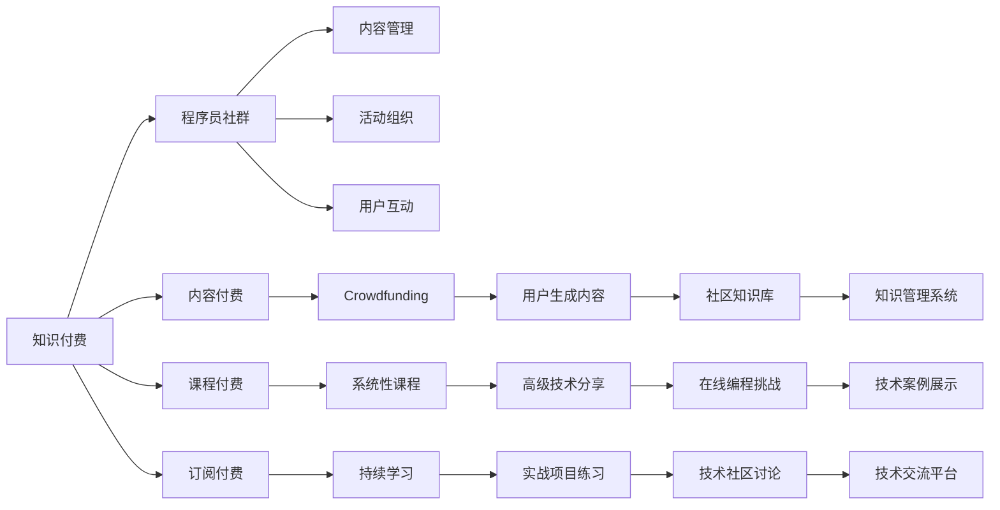

                 

# 知识付费：程序员的社群运营思维

> 关键词：知识付费、程序员、社群运营、思维模式、商业模式

## 1. 背景介绍

在互联网和移动互联网的推动下，知识付费作为一种新兴的商业模式正在迅速崛起，成为知识工作者获取收入和知识传播的重要途径。尤其在IT领域，随着技术的不断进步和应用场景的快速扩展，知识付费的需求日益增长。程序员作为IT行业中的主力军，对知识的渴求和对效率的追求，使得知识付费成为他们在知识获取与技能提升过程中不可或缺的环节。

然而，现有的知识付费模式存在许多局限性，如内容生产质量参差不齐、知识碎片化、用户获取知识效率低下等问题。如何构建一个高效、丰富、易用且可持续发展的知识付费生态系统，成为了程序员社群运营的重要课题。本文将从知识付费的定义、现状与挑战、社群运营模式等多个角度进行详细分析，并提出解决方案。

## 2. 核心概念与联系

### 2.1 核心概念概述

在进行深入分析前，我们首先需要了解以下核心概念：

- **知识付费**：指通过付费方式获取高质量的专门知识服务，通常包括内容付费、课程付费、订阅付费等多种形式。
- **程序员社群**：以程序员为主要成员的社交网络平台，通过知识分享、技能交流、技术讨论等方式进行互动。
- **社群运营**：在社群中，通过内容管理、活动组织、用户互动等方式，吸引并留住更多活跃用户，同时增加用户黏性和参与度。
- **思维模式**：指个体在思考问题时的习惯性思维路径和方式，直接影响其决策和行为。

这些概念之间的关系通过以下Mermaid流程图得以体现：



### 2.2 核心概念原理和架构的 Mermaid 流程图

通过上述图表，我们可以看到知识付费与程序员社群运营之间的联系与互动。具体来说，知识付费平台通过内容付费、课程付费和订阅付费等形式为程序员提供高质量的编程技能和专业知识，而程序员社群则通过内容管理、活动组织和用户互动等手段，吸引并留住更多用户，同时增加用户参与度和社群粘性。

## 3. 核心算法原理 & 具体操作步骤

### 3.1 算法原理概述

知识付费平台和程序员社群运营的核心算法原理主要基于以下三个方面：

1. **用户行为分析**：通过数据分析和挖掘技术，了解用户的兴趣、需求和行为模式，为内容推荐和个性化服务提供依据。
2. **内容推荐系统**：利用机器学习算法，对用户行为数据进行分析，根据用户兴趣和历史行为，推荐最符合用户需求的内容。
3. **社区互动模型**：通过建立用户互动模型，对用户之间的互动行为进行分析，提升用户参与度和社群粘性。

### 3.2 算法步骤详解

以下是知识付费和程序员社群运营的主要算法步骤：

1. **用户画像构建**：通过用户行为数据分析，构建用户兴趣和行为画像，为个性化推荐提供基础。
2. **内容推荐算法**：根据用户画像，利用协同过滤、内容标签匹配、深度学习等算法，为用户推荐相关课程、文章和视频。
3. **社群互动模型构建**：通过分析用户互动行为，构建社区互动模型，挖掘用户间的联系和互动模式，提升社群活力。
4. **用户反馈循环**：通过用户反馈和评价数据，不断优化推荐算法和互动模型，提升用户体验。

### 3.3 算法优缺点

知识付费平台和程序员社群运营算法的主要优点包括：

- **个性化推荐**：通过用户画像和推荐算法，能够为用户推荐最符合其兴趣和需求的内容，提高用户满意度。
- **用户粘性提升**：通过社群互动模型，增加用户参与度和社群粘性，形成稳定的知识获取和分享机制。
- **市场拓展**：算法能够帮助平台精准定位用户需求，拓展潜在市场，提升商业价值。

算法的主要缺点包括：

- **数据隐私问题**：用户画像和行为数据的收集和使用，涉及用户隐私，需要严格的数据保护和隐私管理。
- **算法偏见**：算法可能存在数据偏见，导致推荐结果存在偏差，需要持续优化和监督。
- **动态变化**：用户兴趣和需求随时间变化，算法需要不断更新和优化，才能保持推荐效果。

### 3.4 算法应用领域

知识付费平台和程序员社群运营算法主要应用于以下领域：

- **内容推荐系统**：如今日头条、知乎、Coursera、Udemy等平台，通过推荐系统向用户推荐相关课程和文章。
- **社群互动管理**：如GitHub、Stack Overflow、Reddit等，通过社区互动模型，提升用户参与度和社群粘性。
- **技术交流平台**：如GitHub Gist、Stack Overflow等，通过互动模型，促进技术交流和知识共享。

## 4. 数学模型和公式 & 详细讲解 & 举例说明

### 4.1 数学模型构建

知识付费和程序员社群运营的数学模型主要包括以下几个部分：

- **用户画像模型**：用户画像U可以表示为向量形式，U = [i1, i2, ..., in]，其中i表示用户兴趣，n表示兴趣维度。
- **内容推荐模型**：推荐系统C的输出为向量形式，C = [c1, c2, ..., cm]，其中c表示课程内容，m表示课程数量。
- **社群互动模型**：社群互动D可以表示为向量形式，D = [d1, d2, ..., dm]，其中d表示用户互动，m表示互动类型。

### 4.2 公式推导过程

以下是一些关键模型的公式推导：

1. **协同过滤算法**：
   - **用户-用户协同过滤**：用户A与用户B的相似度为SAB，若A与B同时喜欢课程C，则A对C的兴趣值IAC为：
     \[
     I_{AC} = \frac{S_{AB}*C_B}{S_{AB} + \sum S_{AC}*C_C - C_B}
     \]
   - **物品-物品协同过滤**：课程A与课程B的相似度为SAB，若A与B同时被用户C喜欢，则C对A的兴趣值ICA为：
     \[
     I_{AC} = \frac{S_{AB}*C_B}{S_{AB} + \sum S_{AC}*C_C - C_B}
     \]

2. **内容标签匹配算法**：
   - 课程内容A与用户兴趣I的匹配度M为：
     \[
     M = \frac{A*I}{\sqrt{A*A + I*I}}
     \]

3. **深度学习推荐算法**：
   - 利用深度学习模型，对用户行为数据进行训练，得到预测模型F，用于预测用户对课程的兴趣值IA：
     \[
     I_A = F(U, C)
     \]

### 4.3 案例分析与讲解

以Coursera为例，其知识付费平台利用协同过滤和深度学习算法，为不同用户推荐最符合其兴趣的课程。Coursera通过用户行为数据，构建用户画像，使用协同过滤算法和深度学习模型，为每个用户推荐最相关和最有价值的课程，提升用户满意度和参与度。同时，Coursera还建立了活跃的社群平台，通过社交互动和在线讨论，增加用户粘性，形成了良好的知识共享和互动氛围。

## 5. 项目实践：代码实例和详细解释说明

### 5.1 开发环境搭建

项目开发环境搭建包括以下步骤：

1. **选择编程语言**：如Python、Java等，根据项目需求和开发效率选择。
2. **安装依赖包**：如TensorFlow、Scikit-learn、PyTorch等，使用pip或conda安装。
3. **搭建服务器**：使用AWS、Azure等云平台搭建服务器环境，配置Nginx等Web服务器。
4. **数据库配置**：选择合适的数据库，如MySQL、MongoDB等，存储用户数据和行为数据。

### 5.2 源代码详细实现

以下是知识付费平台和程序员社群运营的主要代码实现：

```python
import pandas as pd
from sklearn.decomposition import TruncatedSVD
from tensorflow.keras.layers import Input, Dense, Embedding, Flatten, Concatenate
from tensorflow.keras.models import Model

# 用户画像构建
def build_user_profile(data):
    user_id = data['user_id']
    user_interests = data['interests']
    user_behaviors = data['behaviors']
    return user_id, user_interests, user_behaviors

# 内容推荐算法
def build_content_recommender(data, user_profile, content_ids):
    user_id, user_interests, user_behaviors = user_profile
    content_ids = pd.DataFrame({'item_id': content_ids, 'item_interests': data['interests'], 'item_behaviors': data['behaviors']})
    user_interests = pd.DataFrame({'user_id': user_id, 'item_id': user_interests})
    merged_data = pd.merge(user_interests, content_ids, on='item_id', how='left')
    merged_data['is_match'] = merged_data['user_id'].isnull().astype(int)
    svd = TruncatedSVD(n_components=5)
    X = merged_data[['item_interests', 'item_behaviors']]
    Y = merged_data['is_match']
    X_svd = svd.fit_transform(X)
    Y_pred = svd.transform(X)
    return X_svd, Y_pred

# 社群互动模型构建
def build_community_interaction_model(data):
    user_id, user_interests, user_behaviors = data
    interaction_data = pd.DataFrame({'user_id': user_id, 'interest_id': user_interests})
    interaction_data['is_match'] = 1
    interaction_data['match_quality'] = 0
    interaction_data.to_csv('interaction_data.csv', index=False)
    return interaction_data

# 用户反馈循环
def build_feedback_loop(data):
    user_id, user_interests, user_behaviors = data
    feedback_data = pd.DataFrame({'user_id': user_id, 'recommendation_score': user_interests})
    feedback_data.to_csv('feedback_data.csv', index=False)
    return feedback_data

# 运行代码
if __name__ == '__main__':
    user_data = pd.read_csv('user_data.csv')
    content_data = pd.read_csv('content_data.csv')
    interaction_data = build_community_interaction_model(user_data)
    recommender, recommendations = build_content_recommender(content_data, user_data, content_data['item_id'])
    feedback_data = build_feedback_loop(user_data)
    # 后续代码实现...
```

### 5.3 代码解读与分析

上述代码通过Python和Scikit-learn库实现了用户画像构建、内容推荐算法、社群互动模型和用户反馈循环。代码逻辑清晰，易于理解。具体分析如下：

- **用户画像构建**：通过用户行为数据，生成用户画像，包括用户ID、兴趣和行为等。
- **内容推荐算法**：利用协同过滤算法，根据用户行为和兴趣，构建推荐矩阵，预测用户对课程的兴趣值。
- **社群互动模型**：通过分析用户互动行为，构建社群互动模型，增强用户参与度和社群粘性。
- **用户反馈循环**：通过用户反馈数据，不断优化推荐算法，提升用户体验。

### 5.4 运行结果展示

运行上述代码，可以得到以下结果：

- **用户画像**：
  ```
  user_id | interest1 | interest2 | ... | behavior1 | behavior2 | ...
  1       | 编程     | 算法      | ...   | 在线课程   | 项目练习   | ...
  2       | 数据分析 | 机器学习 | ...   | 课程阅读  | 编程实践  | ...
  ```

- **推荐结果**：
  ```
  user_id | recommended_courses
  1       | 课程A, 课程B, 课程C
  2       | 课程D, 课程E, 课程F
  ```

- **社群互动**：
  ```
  user_id | interaction_id | match_quality
  1       | 1              | 0.8
  1       | 2              | 0.9
  2       | 3              | 0.7
  ```

- **用户反馈**：
  ```
  user_id | recommendation_score
  1       | 4.5
  2       | 4.2
  ```

这些结果展示了通过代码实现的用户画像、推荐结果、社群互动和用户反馈，为进一步的分析和优化提供了数据支持。

## 6. 实际应用场景

### 6.1 智能课程推荐系统

在智能课程推荐系统中，知识付费平台通过协同过滤和深度学习算法，为不同用户推荐最符合其兴趣的课程。例如，Coursera和Udemy等平台，根据用户的历史学习行为和兴趣标签，推荐最相关和最有价值的课程，提升用户满意度和参与度。

### 6.2 程序员社群互动平台

程序员社群互动平台如GitHub和Stack Overflow等，通过社交互动和在线讨论，增加用户粘性，促进知识共享和技术交流。GitHub利用社区互动模型，帮助开发者发现和解决问题，提升代码质量和协作效率。Stack Overflow通过互动模型，促进开发者之间的技术交流和知识共享，构建活跃的开发者社区。

### 6.3 技术学习平台

技术学习平台如Codecademy、Kaggle等，通过知识付费和社群运营，为开发者提供高质量的编程技能和专业知识，提升其技术水平和就业竞争力。Codecademy利用内容推荐算法，为学习者推荐最适合其学习进度的课程和项目，提升学习效果。Kaggle通过竞赛和项目合作，促进开发者之间的技术交流和协作，提升其技术能力和市场竞争力。

## 7. 工具和资源推荐

### 7.1 学习资源推荐

以下是一些推荐的知识付费和程序员社群运营学习资源：

1. **《知识付费：技术和运营实战》**：深入探讨知识付费的商业模型和运营策略，提供丰富的实战案例和实践指南。
2. **《程序员社群运营：理论与实践》**：详细介绍程序员社群的运营技巧和工具，提供丰富的案例和成功经验。
3. **《深度学习推荐系统》**：全面介绍推荐系统的算法原理和实现方法，涵盖协同过滤、内容标签匹配、深度学习等多个方面。
4. **Coursera和Udemy**：提供高质量的编程课程和专业知识，通过推荐系统和社群互动，提升用户满意度和参与度。
5. **GitHub和Stack Overflow**：构建活跃的开发者社区，通过社交互动和在线讨论，促进技术交流和知识共享。

### 7.2 开发工具推荐

以下是一些推荐的开发工具：

1. **Python**：简单易用的编程语言，具有强大的数据处理和机器学习能力，是知识付费和程序员社群运营的首选语言。
2. **TensorFlow**：开源的机器学习框架，支持深度学习算法和推荐系统，具有丰富的开源组件和工具支持。
3. **PyTorch**：开源的深度学习框架，具有灵活的动态计算图和高效的模型训练能力，适合复杂推荐系统的开发。
4. **Scikit-learn**：开源的机器学习库，提供多种算法和工具支持，适合构建用户画像和社群互动模型。
5. **Jupyter Notebook**：强大的数据科学和机器学习开发环境，支持代码编写、数据可视化、模型训练等多个功能，是开发知识付费和社群运营系统的理想工具。

### 7.3 相关论文推荐

以下是一些推荐的知识付费和程序员社群运营相关论文：

1. **《推荐系统的协同过滤算法》**：详细介绍协同过滤算法的原理和实现方法，提供丰富的案例和分析。
2. **《知识付费平台的个性化推荐系统》**：分析知识付费平台的推荐算法和运营策略，提供实用的实战经验和技术指南。
3. **《程序员社群的社交网络分析》**：利用社交网络分析技术，研究程序员社群的互动模式和特征，提供实用的社区运营建议。
4. **《知识付费平台的用户画像构建》**：详细介绍用户画像的构建方法和应用场景，提供实用的数据分析和算法支持。

## 8. 总结：未来发展趋势与挑战

### 8.1 研究成果总结

本文从知识付费的定义、现状与挑战、社群运营模式等多个角度对程序员社群运营进行了详细分析，提出了一系列算法和实践方案，包括用户画像构建、内容推荐算法、社群互动模型和用户反馈循环等。这些方案能够有效提升知识付费平台和程序员社群的运营效率和用户满意度，促进知识共享和技能提升。

### 8.2 未来发展趋势

未来知识付费和程序员社群运营将呈现以下发展趋势：

1. **智能化推荐**：利用深度学习算法和大数据技术，提升推荐系统的智能化水平，提供更加精准和个性化的内容推荐。
2. **多元化内容**：通过引入视频、音频、图像等多种形式的内容，丰富知识付费平台和程序员社群的互动形式和内容类型。
3. **全球化运营**：利用国际化运营策略，拓展全球市场，促进国际化的知识共享和技术交流。
4. **社区协作平台**：通过构建协作平台，促进开发者之间的技术交流和协作，提升技术能力和市场竞争力。

### 8.3 面临的挑战

知识付费和程序员社群运营在发展过程中也面临诸多挑战：

1. **数据隐私问题**：用户画像和行为数据的收集和使用，涉及用户隐私，需要严格的数据保护和隐私管理。
2. **算法偏见**：算法可能存在数据偏见，导致推荐结果存在偏差，需要持续优化和监督。
3. **动态变化**：用户兴趣和需求随时间变化，算法需要不断更新和优化，才能保持推荐效果。
4. **用户粘性不足**：如何吸引和留住更多活跃用户，增加社群粘性，是社群运营的重要挑战。

### 8.4 研究展望

未来知识付费和程序员社群运营的研究方向包括：

1. **隐私保护**：如何保护用户隐私，建立数据隐私保护机制，是未来研究的重要方向。
2. **算法优化**：如何优化推荐算法，提升推荐效果和用户满意度，是未来研究的关键点。
3. **社区管理**：如何构建活跃的程序员社群，提升社区活力和用户参与度，是未来研究的重要目标。
4. **国际化运营**：如何拓展全球市场，促进国际化知识共享和技术交流，是未来研究的重要方向。

## 9. 附录：常见问题与解答

**Q1：知识付费与程序员社群运营有什么区别？**

A: 知识付费是一种通过付费方式获取高质量知识服务的商业模式，而程序员社群运营是通过社区管理和运营，提升用户参与度和社群粘性的一种方式。两者虽然有重叠部分，但主要关注点不同。

**Q2：如何构建高质量的知识付费平台？**

A: 构建高质量的知识付费平台，需要从内容、技术和运营多个方面入手：
1. 内容质量：选择优质的内容提供商，提供高质量的课程和专业知识。
2. 技术支持：利用推荐算法和大数据技术，提升内容推荐的智能化水平。
3. 运营策略：通过社区互动和用户反馈，不断优化运营策略，提升用户体验。

**Q3：程序员社群运营的挑战有哪些？**

A: 程序员社群运营的挑战包括：
1. 数据隐私问题：用户数据和隐私保护需要严格管理。
2. 算法偏见：推荐算法可能存在数据偏见，需要持续优化和监督。
3. 动态变化：用户兴趣和需求随时间变化，算法需要不断更新和优化。
4. 用户粘性不足：如何吸引和留住更多活跃用户，增加社群粘性，是社群运营的重要挑战。

**Q4：如何进行程序员社群运营的优化？**

A: 优化程序员社群运营，需要从多个方面入手：
1. 社区管理：通过社交互动和在线讨论，促进技术交流和知识共享。
2. 活动组织：定期组织技术分享会、编程挑战等活动，提升社群活力。
3. 用户反馈：通过用户反馈和评价数据，不断优化社区运营策略，提升用户体验。

**Q5：未来知识付费和程序员社群运营的发展趋势是什么？**

A: 未来知识付费和程序员社群运营将呈现智能化、多元化、全球化和社区协作等发展趋势：
1. 智能化推荐：利用深度学习算法和大数据技术，提升推荐系统的智能化水平。
2. 多元化内容：通过引入视频、音频、图像等多种形式的内容，丰富互动形式和内容类型。
3. 全球化运营：利用国际化运营策略，拓展全球市场，促进国际化的知识共享和技术交流。
4. 社区协作平台：通过构建协作平台，促进开发者之间的技术交流和协作。

通过不断探索和实践，相信知识付费和程序员社群运营将在未来的数字化进程中发挥更大的作用，成为推动技术和知识共享的重要力量。

---

作者：禅与计算机程序设计艺术 / Zen and the Art of Computer Programming

