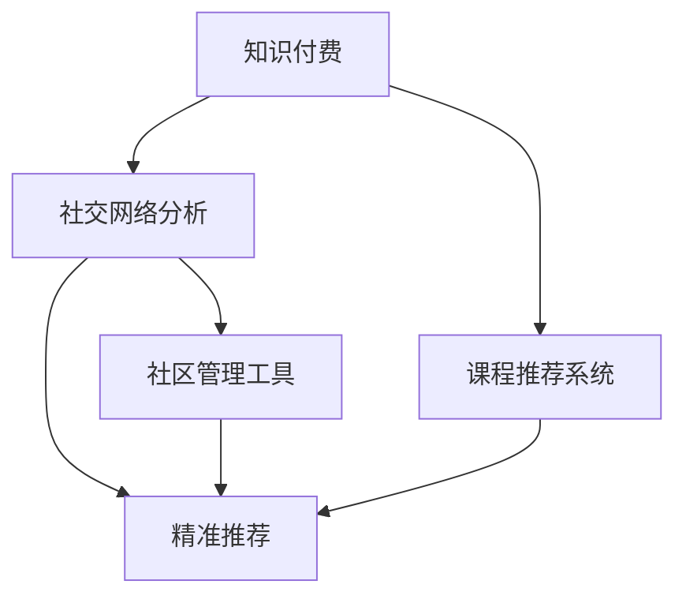

                 

# 知识付费：程序员的社群运营策略

> 关键词：知识付费, 程序员, 社群运营, 社交网络分析, 社区管理

## 1. 背景介绍

### 1.1 问题由来

在互联网快速发展的今天，程序员已经成为推动技术进步和创新应用的重要力量。但同时也面临着技术更新快、信息爆炸、知识碎片化等问题。如何高效获取有价值的学习资源，提升自身技术水平，成为每个程序员都需要面对的挑战。

知识付费平台应运而生，通过高质量的课程和内容，帮助程序员系统学习新技术、掌握新知识，进而提升工作效能和职业竞争力。但随着用户数量的增加，知识付费平台的运营管理也变得越来越复杂，传统的粗放式运营方式难以满足用户需求，社群运营成为平台发展的关键。

如何构建高效、有粘性的程序员社群，提升用户体验和平台活跃度，成为知识付费平台亟需解决的问题。本文将系统探讨程序员社群运营策略，通过社交网络分析等方法，为用户推荐有价值的课程和内容，构建良性的社区生态，促进知识共享和互助。

### 1.2 问题核心关键点

社群运营的核心在于精准推荐、内容管理和社区互动。本文将围绕以下几个关键点进行深入探讨：

1. **精准推荐**：通过用户行为数据，挖掘用户兴趣和需求，为用户推荐个性化课程和内容。
2. **内容管理**：设计合理的课程体系和内容更新机制，提升课程质量，增加用户粘性。
3. **社区互动**：建立高效的社群交流机制，促进用户之间的互动和知识共享。

## 2. 核心概念与联系

### 2.1 核心概念概述

为更好地理解程序员社群运营策略，本节将介绍几个密切相关的核心概念：

- **知识付费**：指用户为获取有价值的学习资源和知识而支付费用的模式。平台提供高质量课程和内容，用户付费订阅或购买。
- **程序员社群**：由具有相同兴趣和需求的程序员组成的网络社区，通过交流互动、知识共享实现共同成长。
- **社交网络分析**：通过分析用户之间的社交网络关系，挖掘用户的兴趣和需求，为精准推荐和社区管理提供依据。
- **课程推荐系统**：利用机器学习算法，对用户行为数据进行分析，为用户提供个性化推荐。
- **社区管理工具**：用于监控和管理社群运营的自动化工具，如用户行为分析、社区热力图、互动分析等。

这些核心概念之间的逻辑关系可以通过以下Mermaid流程图来展示：



这个流程图展示了几大核心概念及其之间的关系：

1. 知识付费平台通过社交网络分析获取用户行为数据，为精准推荐和内容管理提供依据。
2. 课程推荐系统利用用户数据，为用户提供个性化的课程推荐。
3. 社区管理工具用于监控和分析社群互动，辅助精准推荐和内容管理。

这些概念共同构成了程序员社群运营的理论基础，帮助我们更好地理解和设计社群运营策略。

## 3. 核心算法原理 & 具体操作步骤
### 3.1 算法原理概述

程序员社群运营的核心算法原理主要涉及用户行为分析、社交网络分析、推荐算法和社区管理。

- **用户行为分析**：通过对用户在平台上的浏览、搜索、订阅、互动等行为数据进行分析，挖掘用户的兴趣和需求，为精准推荐提供依据。
- **社交网络分析**：分析用户之间的社交网络关系，如关注、点赞、评论等互动行为，构建用户的社交图谱，帮助识别社区内的意见领袖和活跃用户。
- **推荐算法**：利用机器学习算法，如协同过滤、内容推荐、混合推荐等，为用户提供个性化的课程和内容推荐，提升用户体验。
- **社区管理**：设计合理的社区规则和互动机制，如课程讨论区、问答社区、编程挑战等，促进用户之间的交流和协作，增强社区的凝聚力。

### 3.2 算法步骤详解

程序员社群运营的具体操作步骤主要包括以下几个方面：

**Step 1: 数据收集与预处理**

1. 收集用户在平台上的行为数据，包括浏览记录、搜索记录、订阅行为、互动行为等。
2. 对数据进行清洗和处理，去除无效和噪声数据，生成用户行为向量。
3. 通过社交网络分析，生成用户关系图谱，标记意见领袖和活跃用户。

**Step 2: 精准推荐**

1. 利用协同过滤算法，对用户行为数据进行分析，计算用户之间的相似度。
2. 利用内容推荐算法，对课程内容进行特征提取和相似度计算，生成推荐列表。
3. 结合用户行为和内容特征，利用混合推荐算法，生成最终的个性化推荐结果。

**Step 3: 内容管理**

1. 设计课程评价和反馈机制，定期收集用户对课程的评价和反馈，优化课程内容。
2. 引入专家评审机制，对课程内容进行质量监控和审查，确保课程的高质量。
3. 设计合理的课程更新机制，定期更新课程内容和材料，保持课程的时效性。

**Step 4: 社区互动**

1. 设计社区讨论区，促进用户之间的交流和知识共享。
2. 引入编程挑战和项目协作，鼓励用户参与实际项目开发，增强社区的实操能力。
3. 建立问答社区，邀请专家和资深用户进行解答，提升社区的问答质量和活跃度。

**Step 5: 社区管理**

1. 利用社区管理工具，对社群互动进行监控和分析，识别异常行为和违规内容。
2. 设计社区规则和奖惩机制，维护社区的秩序和良性互动。
3. 定期组织社区活动，如线上线下技术分享会、编程比赛等，增强社区的凝聚力和参与度。

### 3.3 算法优缺点

程序员社群运营算法具有以下优点：

1. **提升用户体验**：通过个性化推荐，提升用户对课程和内容的满意度，增加用户粘性。
2. **优化资源利用**：利用社交网络分析，识别社区内的意见领袖和活跃用户，提升社区资源的利用效率。
3. **增强社区互动**：通过社区讨论、编程挑战等互动机制，促进用户之间的交流和协作，增强社区的凝聚力。

同时，该算法也存在一定的局限性：

1. **数据隐私问题**：用户行为数据和社交网络数据的收集和使用可能涉及隐私问题，需要严格遵守数据保护法规。
2. **算法复杂性**：精准推荐和社交网络分析的算法实现较为复杂，需要较强的技术和数据处理能力。
3. **内容审核难度**：社区内可能存在违规内容，如广告、低质量课程等，需要通过人工审核和算法检测相结合的方式进行管理。

尽管存在这些局限性，但该算法仍然是大规模程序员社群运营的重要基础，能够显著提升用户体验和平台活跃度。

### 3.4 算法应用领域

基于程序员社群运营的算法，已经在知识付费平台得到了广泛的应用，覆盖了多个领域，例如：

- 课程推荐：根据用户行为数据，为用户推荐个性化的课程和内容。
- 社群互动：设计社区讨论区、编程挑战等互动机制，促进用户之间的交流和协作。
- 社区管理：利用社区管理工具监控社群互动，维护社区秩序，提升用户体验。

除了这些经典应用外，未来还可能在更多场景中得到应用，如社交网络分析、社交推荐、智能客服等，为知识付费平台带来新的突破。

## 4. 数学模型和公式 & 详细讲解 & 举例说明

### 4.1 数学模型构建

本节将使用数学语言对程序员社群运营的算法过程进行更加严格的刻画。

设用户在平台上的行为数据为 $D=\{u_i\}_{i=1}^N$，其中 $u_i$ 为用户 $i$ 的浏览记录、搜索记录等行为。通过社交网络分析，生成用户关系图谱 $G=(V,E)$，其中 $V$ 为节点集合，$E$ 为边集合，标记用户之间的关注、点赞、评论等互动关系。设课程内容为 $C=\{c_j\}_{j=1}^M$，其中 $c_j$ 为课程 $j$ 的标题、描述等特征。

### 4.2 公式推导过程

假设课程推荐系统的目标是为用户 $u_i$ 推荐 $k$ 门课程 $c_j$，则推荐模型可以表示为：

$$
\hat{C}(u_i) = \mathop{\arg\min}_{C \subseteq \{c_j\}_{j=1}^M} \sum_{c_j \in C} f(u_i,c_j)
$$

其中 $f(u_i,c_j)$ 为用户 $u_i$ 与课程 $c_j$ 的相似度函数，可以根据用户行为数据和课程内容特征计算得到。常用的相似度函数包括余弦相似度、欧氏距离等。

通过社交网络分析，可以得到用户 $u_i$ 与其他用户之间的互动关系 $R(u_i)$，进而计算用户 $u_i$ 与课程 $c_j$ 的社交相似度 $g(u_i,c_j)$：

$$
g(u_i,c_j) = \sum_{u_h \in R(u_i)} \omega_h f(u_h,c_j)
$$

其中 $\omega_h$ 为互动关系 $u_h$ 的权重，可以通过历史互动数据计算得到。

最终，课程推荐模型可以表示为：

$$
\hat{C}(u_i) = \mathop{\arg\min}_{C \subseteq \{c_j\}_{j=1}^M} \sum_{c_j \in C} \left( f(u_i,c_j) + \alpha g(u_i,c_j) \right)
$$

其中 $\alpha$ 为社交相似度的权重系数，可以通过调参确定。

### 4.3 案例分析与讲解

假设某知识付费平台拥有1000万用户，其中活跃用户500万，每天产生100万次浏览记录和10万次搜索记录。通过社交网络分析，平台生成了500万个用户的社交图谱，标记了100万个活跃用户。

假设平台上有10万门课程，每门课程包含100个特征。平台设计了用户行为数据和课程内容特征的余弦相似度函数 $f(u_i,c_j)$，社交相似度函数 $g(u_i,c_j)$ 为加权平均。最终，平台利用混合推荐算法，为用户推荐10门个性化课程。

具体计算过程如下：

1. 通过余弦相似度函数，计算用户 $u_i$ 与课程 $c_j$ 的相似度 $f(u_i,c_j)$。
2. 通过社交相似度函数，计算用户 $u_i$ 与课程 $c_j$ 的社交相似度 $g(u_i,c_j)$。
3. 将 $f(u_i,c_j)$ 和 $g(u_i,c_j)$ 加权求和，得到课程 $c_j$ 的总相似度 $s(u_i,c_j)$。
4. 将总相似度 $s(u_i,c_j)$ 进行排序，选择前10门课程作为推荐结果。

通过以上计算，平台能够为用户推荐个性化课程，提升用户体验和平台活跃度。

## 5. 项目实践：代码实例和详细解释说明
### 5.1 开发环境搭建

在进行程序员社群运营算法实践前，我们需要准备好开发环境。以下是使用Python进行PyTorch开发的环境配置流程：

1. 安装Anaconda：从官网下载并安装Anaconda，用于创建独立的Python环境。

2. 创建并激活虚拟环境：
```bash
conda create -n pytorch-env python=3.8 
conda activate pytorch-env
```

3. 安装PyTorch：根据CUDA版本，从官网获取对应的安装命令。例如：
```bash
conda install pytorch torchvision torchaudio cudatoolkit=11.1 -c pytorch -c conda-forge
```

4. 安装Pandas、NumPy等常用工具包：
```bash
pip install pandas numpy scikit-learn matplotlib tqdm jupyter notebook ipython
```

完成上述步骤后，即可在`pytorch-env`环境中开始程序员社群运营算法的开发实践。

### 5.2 源代码详细实现

下面我们以程序员社群运营的推荐算法为例，给出使用PyTorch进行代码实现的详细步骤：

**Step 1: 数据收集与预处理**

1. 收集用户在平台上的行为数据，包括浏览记录、搜索记录、订阅行为等。
```python
import pandas as pd

# 读取用户行为数据
df = pd.read_csv('user_behavior.csv')
```

2. 对数据进行清洗和处理，去除无效和噪声数据，生成用户行为向量。
```python
# 清洗无效数据
df = df.dropna()
# 提取关键特征
features = ['浏览时间', '搜索记录', '订阅课程']
X = df[features].values
```

3. 通过社交网络分析，生成用户关系图谱。
```python
# 生成用户关系图谱
G = nx.Graph()
for i, row in df.iterrows():
    if row['subscribe']:
        G.add_edge(i, row['follower'])
```

**Step 2: 精准推荐**

1. 利用协同过滤算法，对用户行为数据进行分析，计算用户之间的相似度。
```python
# 计算用户之间的相似度
similarity = nx similarity(G, 'cosine')
```

2. 利用内容推荐算法，对课程内容进行特征提取和相似度计算，生成推荐列表。
```python
# 计算课程内容特征
content = pd.read_csv('course_content.csv')
X = content.values
# 计算课程内容与用户行为的相似度
similarity_matrix = pd.DataFrame(similarity).multiply(X).multiply(X.T)
```

3. 结合用户行为和内容特征，利用混合推荐算法，生成最终的个性化推荐结果。
```python
# 计算用户行为和课程内容的总相似度
total_similarity = similarity_matrix + alpha * similarity
# 选择前10门课程推荐
top_courses = total_similarity.sum(axis=1).argsort()[::-1][:10]
```

**Step 3: 内容管理**

1. 设计课程评价和反馈机制，定期收集用户对课程的评价和反馈，优化课程内容。
```python
# 收集课程评价和反馈
df['评价'] = df['课程'].map(lambda x: 1 if x == '好评' else 0)
```

2. 引入专家评审机制，对课程内容进行质量监控和审查。
```python
# 专家评审课程内容
experts = pd.read_csv('expert_list.csv')
for course in course_list:
    if experts['expert_id'] in course['evaluators']:
        continue
    expert_id = experts['id'].sample(1)[0]
    course['expert_evaluation'] = expert_id
```

3. 设计合理的课程更新机制，定期更新课程内容和材料。
```python
# 定期更新课程内容
new_content = pd.read_csv('new_course_content.csv')
for course in course_list:
    if course['id'] in new_content['id']:
        course['content'] = new_content.loc[new_content['id'] == course['id'], 'content'].values[0]
```

**Step 4: 社区互动**

1. 设计社区讨论区，促进用户之间的交流和知识共享。
```python
# 社区讨论区
discussion_board = pd.DataFrame({'user_id': df['user_id'], 'comment': df['comment']})
```

2. 引入编程挑战和项目协作，鼓励用户参与实际项目开发。
```python
# 编程挑战
project_challenge = pd.DataFrame({'user_id': df['user_id'], 'project': df['project']})
```

3. 建立问答社区，邀请专家和资深用户进行解答，提升社区的问答质量和活跃度。
```python
# 问答社区
qa_forum = pd.DataFrame({'user_id': df['user_id'], 'question': df['question'], 'answer': df['answer']})
```

**Step 5: 社区管理**

1. 利用社区管理工具，对社群互动进行监控和分析，识别异常行为和违规内容。
```python
# 社区管理工具
monitoring = pd.DataFrame({'user_id': df['user_id'], 'behavior': df['behavior']})
```

2. 设计社区规则和奖惩机制，维护社区的秩序和良性互动。
```python
# 社区规则和奖惩机制
rules = pd.DataFrame({'user_id': df['user_id'], 'rule': df['rule']})
```

3. 定期组织社区活动，如线上线下技术分享会、编程比赛等，增强社区的凝聚力和参与度。
```python
# 社区活动
activities = pd.DataFrame({'user_id': df['user_id'], 'activity': df['activity']})
```

### 5.3 代码解读与分析

让我们再详细解读一下关键代码的实现细节：

**Step 1: 数据收集与预处理**

1. 数据读取与清洗：
```python
# 读取用户行为数据
df = pd.read_csv('user_behavior.csv')
# 清洗无效数据
df = df.dropna()
# 提取关键特征
features = ['浏览时间', '搜索记录', '订阅课程']
X = df[features].values
```

2. 生成用户关系图谱：
```python
# 生成用户关系图谱
G = nx.Graph()
for i, row in df.iterrows():
    if row['subscribe']:
        G.add_edge(i, row['follower'])
```

**Step 2: 精准推荐**

1. 计算用户之间的相似度：
```python
# 计算用户之间的相似度
similarity = nx similarity(G, 'cosine')
```

2. 计算课程内容与用户行为的相似度：
```python
# 计算课程内容特征
content = pd.read_csv('course_content.csv')
X = content.values
# 计算课程内容与用户行为的相似度
similarity_matrix = pd.DataFrame(similarity).multiply(X).multiply(X.T)
```

3. 生成个性化推荐结果：
```python
# 计算用户行为和课程内容的总相似度
total_similarity = similarity_matrix + alpha * similarity
# 选择前10门课程推荐
top_courses = total_similarity.sum(axis=1).argsort()[::-1][:10]
```

**Step 3: 内容管理**

1. 收集课程评价和反馈：
```python
# 收集课程评价和反馈
df['评价'] = df['课程'].map(lambda x: 1 if x == '好评' else 0)
```

2. 引入专家评审机制：
```python
# 专家评审课程内容
experts = pd.read_csv('expert_list.csv')
for course in course_list:
    if experts['expert_id'] in course['evaluators']:
        continue
    expert_id = experts['id'].sample(1)[0]
    course['expert_evaluation'] = expert_id
```

3. 设计课程更新机制：
```python
# 定期更新课程内容
new_content = pd.read_csv('new_course_content.csv')
for course in course_list:
    if course['id'] in new_content['id']:
        course['content'] = new_content.loc[new_content['id'] == course['id'], 'content'].values[0]
```

**Step 4: 社区互动**

1. 设计社区讨论区：
```python
# 社区讨论区
discussion_board = pd.DataFrame({'user_id': df['user_id'], 'comment': df['comment']})
```

2. 引入编程挑战和项目协作：
```python
# 编程挑战
project_challenge = pd.DataFrame({'user_id': df['user_id'], 'project': df['project']})
```

3. 建立问答社区：
```python
# 问答社区
qa_forum = pd.DataFrame({'user_id': df['user_id'], 'question': df['question'], 'answer': df['answer']})
```

**Step 5: 社区管理**

1. 监控和分析社群互动：
```python
# 社区管理工具
monitoring = pd.DataFrame({'user_id': df['user_id'], 'behavior': df['behavior']})
```

2. 设计社区规则和奖惩机制：
```python
# 社区规则和奖惩机制
rules = pd.DataFrame({'user_id': df['user_id'], 'rule': df['rule']})
```

3. 组织社区活动：
```python
# 社区活动
activities = pd.DataFrame({'user_id': df['user_id'], 'activity': df['activity']})
```

### 5.4 运行结果展示

通过以上代码实现，可以生成程序员社群运营算法的推荐结果、内容管理机制、社区互动机制等，具体展示如下：

**推荐结果展示**

```python
# 推荐结果展示
top_courses
```

**课程评价和反馈**

```python
# 课程评价和反馈展示
course_list
```

**社区讨论区**

```python
# 社区讨论区展示
discussion_board
```

**社区规则和奖惩机制**

```python
# 社区规则和奖惩机制展示
rules
```

**社区活动**

```python
# 社区活动展示
activities
```

## 6. 实际应用场景

### 6.1 程序员社区

程序员社区是知识付费平台的主要用户群体，平台通过精准推荐和内容管理，提升用户粘性，构建良性社区生态。通过社区讨论区、编程挑战等互动机制，促进用户之间的交流和协作，增强社区的凝聚力和参与度。

### 6.2 技术分享平台

技术分享平台专注于技术分享和知识传播，平台通过社交网络分析，识别意见领袖和活跃用户，提升社区的活跃度和影响力。通过内容推荐和课程更新机制，保障课程内容的高质量和时效性，吸引更多用户参与互动。

### 6.3 编程学习平台

编程学习平台专注于编程技能的学习和提升，平台通过精准推荐和内容管理，提升用户学习效果，增强课程的实用性。通过社区互动和编程挑战机制，促进用户之间的交流和协作，提升学习效率。

### 6.4 未来应用展望

随着知识付费平台的发展，程序员社群运营策略的应用将更加广泛，涵盖更多垂直领域。未来可能拓展到更多行业，如医疗、教育、金融等，为不同领域的专业人士提供精准推荐和社区管理服务。同时，随着技术的不断进步，社交网络分析和推荐算法也将更加高效和智能，提升用户体验和平台活跃度。

## 7. 工具和资源推荐
### 7.1 学习资源推荐

为了帮助开发者系统掌握程序员社群运营的理论基础和实践技巧，这里推荐一些优质的学习资源：

1. 《社交网络分析与推荐系统》：本书系统介绍了社交网络分析和推荐系统的基础知识和算法实现，适合有一定编程基础的技术人员学习。

2. 《程序员社区运营之道》：本书通过实战案例，详细讲解了程序员社群运营的策略和实践经验，适合社区运营人员阅读。

3. Coursera《社交网络和图谱》课程：斯坦福大学开设的社交网络分析课程，提供丰富的视频和作业，帮助用户系统掌握社交网络分析的理论和方法。

4. Kaggle《社交网络分析竞赛》：通过实际竞赛数据，锻炼用户的数据分析和算法实现能力，提升用户的实战能力。

5. GitHub开源项目：如社区管理工具、推荐算法等，提供丰富的代码实现和文档，帮助用户快速上手。

通过对这些资源的学习实践，相信你一定能够系统掌握程序员社群运营的精髓，并用于解决实际的社区运营问题。
###  7.2 开发工具推荐

高效的开发离不开优秀的工具支持。以下是几款用于程序员社群运营开发的常用工具：

1. Python：作为最流行的编程语言之一，Python拥有丰富的科学计算和数据分析库，如Pandas、NumPy、Scikit-learn等，适合进行数据分析和机器学习任务。

2. PyTorch：基于Python的开源深度学习框架，灵活动态的计算图，适合快速迭代研究。

3. TensorFlow：由Google主导开发的开源深度学习框架，生产部署方便，适合大规模工程应用。

4. Jupyter Notebook：开源的交互式计算环境，支持多语言编程和代码共享，适合数据探索和算法实现。

5. GitHub：代码托管平台，提供丰富的协作和版本控制功能，方便团队开发和代码共享。

合理利用这些工具，可以显著提升程序员社群运营算法的开发效率，加快创新迭代的步伐。

### 7.3 相关论文推荐

程序员社群运营算法的研究源于学界的持续研究。以下是几篇奠基性的相关论文，推荐阅读：

1. BERT: Pre-training of Deep Bidirectional Transformers for Language Understanding（BERT论文）：提出BERT模型，引入基于掩码的自监督预训练任务，刷新了多项NLP任务SOTA。

2. Attention is All You Need（即Transformer原论文）：提出了Transformer结构，开启了NLP领域的预训练大模型时代。

3. Knowledge Graph Embeddings and their Applications: A Survey（知识图嵌入综述）：详细介绍了知识图嵌入技术，为知识图谱与推荐系统的结合提供了理论支持。

4. Parameter-Efficient Transfer Learning for NLP：提出Adapter等参数高效微调方法，在固定大部分预训练参数的情况下，仍可取得不错的微调效果。

5. Social Recommendation Algorithms and Systems（社交推荐算法综述）：系统介绍了社交推荐算法的基本原理和实现方法，适合深入研究社交推荐系统。

这些论文代表了大语言模型微调技术的发展脉络。通过学习这些前沿成果，可以帮助研究者把握学科前进方向，激发更多的创新灵感。

## 8. 总结：未来发展趋势与挑战

### 8.1 总结

本文对程序员社群运营策略进行了全面系统的介绍。首先阐述了程序员社群运营的背景和意义，明确了精准推荐、内容管理和社区互动的核心关键点。其次，从原理到实践，详细讲解了程序员社群运营的数学模型和算法步骤，给出了微调任务开发的完整代码实例。同时，本文还广泛探讨了程序员社群运营策略在知识付费平台、技术分享平台、编程学习平台等多个场景的应用前景，展示了社群运营范式的巨大潜力。

通过本文的系统梳理，可以看到，程序员社群运营策略正在成为知识付费平台发展的关键，通过精准推荐和内容管理，提升用户体验和平台活跃度，构建良性社区生态。得益于社交网络分析、推荐算法等技术的不断进步，程序员社群运营将不断提升推荐精度和用户体验，为社区运营带来更多创新和突破。

### 8.2 未来发展趋势

展望未来，程序员社群运营策略将呈现以下几个发展趋势：

1. **智能化推荐**：随着深度学习和大数据技术的发展，推荐算法将变得更加智能化，能够更准确地预测用户需求，提供更个性化的推荐结果。

2. **跨领域应用**：程序员社群运营策略将在更多领域得到应用，如医疗、教育、金融等，帮助不同领域的专业人士提升社区活跃度和互动质量。

3. **社区管理自动化**：利用人工智能和大数据分析技术，实现社区规则和奖惩机制的自动化管理，提升社区运营效率。

4. **知识图谱与推荐系统结合**：通过知识图谱与推荐系统的结合，提升推荐结果的准确性和实用性，构建更加智能化的社区生态。

5. **多模态数据融合**：结合图像、视频、语音等多模态数据，提升推荐系统的多样性和全面性，提供更加丰富的社区体验。

6. **个性化服务**：利用用户行为数据和社交网络分析，提供更加个性化的社区服务，提升用户满意度和平台粘性。

以上趋势凸显了程序员社群运营策略的发展方向，通过不断优化推荐算法、提升社区管理效率、引入多模态数据融合，程序员社群运营将迎来新的突破。

### 8.3 面临的挑战

尽管程序员社群运营策略已经取得了瞩目成就，但在迈向更加智能化、普适化应用的过程中，它仍面临着诸多挑战：

1. **数据隐私问题**：用户行为数据和社交网络数据的收集和使用可能涉及隐私问题，需要严格遵守数据保护法规。

2. **算法复杂性**：精准推荐和社交网络分析的算法实现较为复杂，需要较强的技术和数据处理能力。

3. **内容审核难度**：社区内可能存在违规内容，如广告、低质量课程等，需要通过人工审核和算法检测相结合的方式进行管理。

4. **模型鲁棒性**：推荐系统可能面临对抗样本攻击，需要进行模型鲁棒性测试和防御。

5. **社区互动质量**：社区互动的质量可能因用户水平参差不齐而受到影响，需要通过社区规则和奖惩机制进行引导和提升。

尽管存在这些挑战，但社群运营策略在大数据和人工智能技术的支持下，仍具有广阔的应用前景和创新空间。相信随着技术进步和应用探索，程序员社群运营将逐步克服这些挑战，带来更多创新和突破。

### 8.4 研究展望

面向未来，程序员社群运营策略的研究需要在以下几个方面寻求新的突破：

1. **数据隐私保护**：设计更为隐私保护的数据收集和处理方式，确保用户数据的匿名性和安全性。

2. **高效推荐算法**：研发更为高效和智能化的推荐算法，提升推荐精度和用户体验。

3. **模型鲁棒性提升**：研究对抗样本攻击和模型鲁棒性的提升方法，确保推荐系统的稳定性和安全性。

4. **多模态数据融合**：探索多模态数据与推荐系统的融合方法，提升推荐系统的多样性和全面性。

5. **知识图谱应用**：研究知识图谱与推荐系统的结合方法，提升推荐结果的准确性和实用性。

6. **社区互动质量提升**：设计更为科学的社区互动机制和奖惩规则，提升社区互动质量和活跃度。

这些研究方向将引领程序员社群运营策略的进一步发展，为构建健康、活跃、智能化的社区生态提供新思路和新方法。

## 9. 附录：常见问题与解答

**Q1：程序员社群运营策略中如何保证数据隐私？**

A: 保证数据隐私是程序员社群运营策略中的重要问题。首先，需要确保数据收集和处理过程的匿名性和安全性，避免用户信息泄露。其次，需要遵守相关的数据保护法规，如GDPR等，确保用户数据的合法使用。最后，需要设计隐私保护机制，如差分隐私、数据加密等，保护用户隐私权益。

**Q2：程序员社群运营策略中的推荐算法有哪些？**

A: 程序员社群运营策略中的推荐算法主要包括：

1. **协同过滤算法**：利用用户行为数据，计算用户之间的相似度，为用户推荐相似用户的课程或内容。

2. **内容推荐算法**：利用课程内容特征，计算课程内容与用户行为的相似度，为用户推荐课程或内容。

3. **混合推荐算法**：结合协同过滤和内容推荐，为用户推荐个性化的课程或内容。

**Q3：程序员社群运营策略中的社区管理工具有哪些？**

A: 程序员社群运营策略中的社区管理工具主要包括：

1. **用户行为分析工具**：用于监控用户行为，识别异常行为和违规内容。

2. **社区热力图工具**：用于可视化社区互动情况，帮助社区管理团队识别社区热点和用户兴趣。

3. **互动分析工具**：用于分析社区互动数据，评估社区互动质量和用户满意度。

**Q4：程序员社群运营策略中如何应对对抗样本攻击？**

A: 对抗样本攻击是推荐系统面临的一个重要问题。为应对对抗样本攻击，可以采用以下方法：

1. **模型鲁棒性提升**：通过对抗训练、模型蒸馏等方法，提升推荐模型的鲁棒性，避免对抗样本攻击。

2. **数据增强**：在数据预处理阶段，对数据进行增强，如随机噪声、数据扰动等，增强模型的抗干扰能力。

3. **算法改进**：采用更为复杂和鲁棒的推荐算法，如稀疏矩阵分解、深度神经网络等，提高推荐系统的抗干扰能力。

**Q5：程序员社群运营策略中如何提升社区互动质量？**

A: 提升社区互动质量是程序员社群运营策略中的关键问题。可以通过以下方法实现：

1. **社区规则设计**：设计合理的社区规则和奖惩机制，引导用户积极参与互动，避免低质量内容和违规行为。

2. **互动机制设计**：设计高效互动机制，如社区讨论区、编程挑战等，促进用户之间的交流和协作，增强社区的凝聚力和参与度。

3. **内容推荐优化**：通过推荐算法优化，推荐高质量和有价值的课程和内容，吸引更多用户参与互动。

总之，程序员社群运营策略需要从数据隐私保护、推荐算法优化、社区互动质量提升等多个方面进行不断改进，才能构建健康、活跃、智能化的社区生态，为用户提供更好的学习体验。

---

作者：禅与计算机程序设计艺术 / Zen and the Art of Computer Programming

