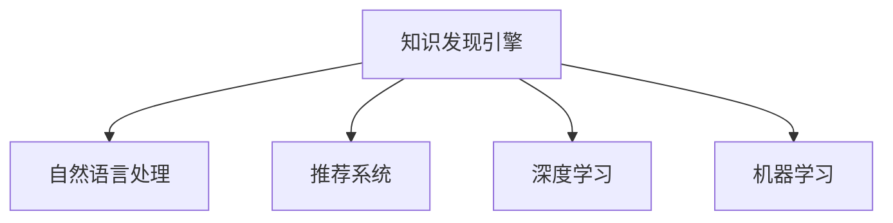

                 

## 1. 背景介绍

### 1.1 问题由来

随着计算机科学的发展，程序员的学习模式也在不断变化。传统上，程序员主要依赖代码库、文档和书籍等静态资源进行自学。然而，随着人工智能和大数据技术的普及，知识发现引擎（Knowledge Discovery Engine, KDE）开始进入程序员的学习场景，改变了这一传统的学习模式。

### 1.2 问题核心关键点

知识发现引擎（KDE）利用人工智能和大数据技术，从海量的文本、代码、论文等资源中自动提取和组织知识，为程序员提供定制化的学习路径和推荐资源。这一技术不仅节省了程序员自我学习的时间，还提升了学习效率和质量。

知识发现引擎的核心思想是通过数据分析、机器学习等技术，从大规模资源中发现并提取有价值的知识，以帮助用户快速掌握新技能、解决新问题。这种技术已经在多个领域得到广泛应用，包括自然语言处理、计算机视觉、推荐系统等，并逐渐扩展到程序员的学习模式中。

### 1.3 问题研究意义

研究知识发现引擎如何改变程序员的学习模式，具有以下重要意义：

1. **提高学习效率**：通过自动化的知识发现和学习推荐，程序员可以快速掌握新技能，节省大量自学时间。
2. **个性化学习**：知识发现引擎能够根据程序员的学习习惯、偏好和能力，提供定制化的学习资源和路径，提升学习效果。
3. **动态更新**：知识发现引擎能够实时更新推荐资源，确保学习内容的时效性和相关性，紧跟技术前沿。
4. **社区协作**：知识发现引擎能够促进程序员之间的知识共享和协作，构建开放的学习生态。

## 2. 核心概念与联系

### 2.1 核心概念概述

在深入探讨知识发现引擎如何改变程序员的学习模式之前，首先需要理解几个关键概念：

1. **知识发现引擎(KDE)**：利用人工智能和大数据技术，从大量文本、代码、论文等资源中自动提取和组织知识，为程序员提供定制化的学习路径和推荐资源。
2. **自然语言处理(NLP)**：利用机器学习技术，从文本数据中提取语义信息、实体关系等知识。
3. **推荐系统**：利用协同过滤、内容推荐等算法，根据用户的历史行为和偏好，推荐相关资源。
4. **深度学习**：利用深度神经网络，处理和分析大规模数据，提取高层次特征和知识。
5. **机器学习**：通过训练模型，自动从数据中学习规律和知识，用于分类、聚类、预测等任务。

这些核心概念之间的联系可以通过以下Mermaid流程图来展示：



这个流程图展示了知识发现引擎与其他核心概念的关系：

1. 知识发现引擎利用自然语言处理技术，从文本数据中提取语义信息和实体关系。
2. 利用推荐系统，根据程序员的学习历史和偏好，推荐相关学习资源。
3. 利用深度学习和机器学习技术，处理和分析大规模数据，提取高层次特征和知识。

## 3. 核心算法原理 & 具体操作步骤

### 3.1 算法原理概述

知识发现引擎的核心算法原理可以总结如下：

1. **数据采集**：从代码库、论文、博客等资源中自动采集和清洗数据。
2. **实体识别**：利用自然语言处理技术，从文本中识别出代码、函数、技术栈等实体。
3. **知识抽取**：从识别出的实体中，自动抽取相关知识和技能，形成知识图谱。
4. **推荐算法**：根据程序员的学习历史和偏好，利用协同过滤、内容推荐等算法，推荐相关知识资源。
5. **用户交互**：通过交互式界面，让用户反馈学习效果和兴趣点，进一步优化推荐系统。

### 3.2 算法步骤详解

以下是知识发现引擎的详细操作步骤：

**Step 1: 数据采集**

1. **资源收集**：从GitHub、Stack Overflow、Google Scholar、arXiv等平台收集代码、论文、博客等资源。
2. **数据清洗**：去除重复、无用的数据，确保数据质量和一致性。

**Step 2: 实体识别**

1. **分词**：将文本分解成单词或短语，为后续的实体识别做准备。
2. **命名实体识别**：使用命名实体识别（Named Entity Recognition, NER）技术，从文本中识别出代码、函数、技术栈等实体。
3. **关系抽取**：识别实体之间的关系，如调用关系、继承关系等。

**Step 3: 知识抽取**

1. **实体关系抽取**：从命名实体中抽取关系，形成实体关系图谱。
2. **知识编码**：将抽取的知识编码为结构化的数据，形成知识图谱。
3. **技能映射**：将知识图谱中的技能映射到不同的编程语言和技术栈上。

**Step 4: 推荐算法**

1. **协同过滤**：根据程序员的学习历史，推荐相似的技能和资源。
2. **内容推荐**：根据技能和资源的属性，推荐相关资源。
3. **混合推荐**：综合协同过滤和内容推荐的优点，提高推荐效果。

**Step 5: 用户交互**

1. **交互界面**：提供交互式界面，让用户反馈学习效果和兴趣点。
2. **反馈分析**：分析用户的反馈，优化推荐算法和知识图谱。
3. **动态调整**：根据用户的反馈和行为，动态调整推荐策略。

### 3.3 算法优缺点

知识发现引擎的优点包括：

1. **自动化学习**：通过自动化的知识发现和学习推荐，大幅提升学习效率。
2. **个性化推荐**：根据用户的学习历史和偏好，提供定制化的学习资源和路径。
3. **实时更新**：能够实时更新推荐资源，确保学习内容的时效性和相关性。

然而，知识发现引擎也存在一些缺点：

1. **数据质量问题**：依赖于数据质量和清洗效果，若数据不完整或不准确，可能导致推荐效果不佳。
2. **算法复杂性**：推荐算法和知识抽取技术较为复杂，需要大量的计算资源和时间。
3. **用户隐私问题**：在处理大量数据时，可能涉及用户隐私问题，需要严格的隐私保护措施。

### 3.4 算法应用领域

知识发现引擎已经广泛应用于以下几个领域：

1. **编程学习**：为程序员提供个性化的编程语言和技术栈学习路径。
2. **技能提升**：通过推荐相关资源和项目，帮助程序员提升特定技能。
3. **项目开发**：推荐相关项目和工具，加快项目开发进程。
4. **技术调研**：推荐相关论文和报告，帮助程序员进行技术调研和创新。
5. **社区协作**：促进程序员之间的知识共享和协作，构建开放的学习生态。

## 4. 数学模型和公式 & 详细讲解 & 举例说明

### 4.1 数学模型构建

知识发现引擎的核心数学模型包括以下几个关键部分：

1. **文本表示模型**：使用词嵌入（Word Embedding）、文档嵌入（Document Embedding）等技术，将文本数据转换为向量表示。
2. **实体关系图谱**：使用图神经网络（Graph Neural Network, GNN）技术，处理和分析实体关系图谱。
3. **推荐算法模型**：使用协同过滤、内容推荐等算法，计算推荐得分。

### 4.2 公式推导过程

以下是知识发现引擎中常用数学模型的推导过程：

1. **词嵌入模型**：使用Word2Vec、GloVe等技术，将单词转换为向量表示。
   $$
   \mathbf{w} = f(\mathbf{v},\mathbf{u})
   $$
   其中，$\mathbf{w}$ 表示单词向量，$\mathbf{v}$ 表示上下文向量，$\mathbf{u}$ 表示词嵌入矩阵。

2. **文档嵌入模型**：使用TF-IDF、Doc2Vec等技术，将文档转换为向量表示。
   $$
   \mathbf{d} = g(\mathbf{W},\mathbf{c})
   $$
   其中，$\mathbf{d}$ 表示文档向量，$\mathbf{W}$ 表示词嵌入矩阵，$\mathbf{c}$ 表示文档中所有单词的词向量。

3. **图神经网络模型**：使用Graph Convolutional Network（GCN）等技术，处理和分析实体关系图谱。
   $$
   \mathbf{h}_{t+1} = \sigma(\mathbf{A}\mathbf{D}^{-\frac{1}{2}}\mathbf{D}^{\frac{1}{2}}\mathbf{h}_t + \mathbf{b})
   $$
   其中，$\mathbf{h}_t$ 表示节点嵌入，$\mathbf{A}$ 表示邻接矩阵，$\mathbf{D}$ 表示度矩阵，$\sigma$ 表示激活函数，$\mathbf{b}$ 表示偏置项。

4. **协同过滤推荐模型**：使用基于矩阵分解的推荐算法，如SVD、ALS等，计算推荐得分。
   $$
   \mathbf{P} = \mathbf{U}\mathbf{S}\mathbf{V}^T
   $$
   其中，$\mathbf{P}$ 表示用户-物品评分矩阵，$\mathbf{U}$ 表示用户因子矩阵，$\mathbf{S}$ 表示因子分解矩阵，$\mathbf{V}$ 表示物品因子矩阵。

### 4.3 案例分析与讲解

以GitHub代码学习为例，说明知识发现引擎如何改变程序员的学习模式：

**案例背景**：某程序员想要学习Python的机器学习库Scikit-learn，但是不知道如何入手。

**操作步骤**：

1. **数据采集**：知识发现引擎从GitHub中自动采集和清洗Scikit-learn的代码库、论文、博客等资源。
2. **实体识别**：利用自然语言处理技术，从文本中识别出Scikit-learn中的函数、类、方法等实体。
3. **知识抽取**：从识别出的实体中，自动抽取Scikit-learn中的相关知识和技能，形成知识图谱。
4. **推荐算法**：根据程序员的学习历史和偏好，利用协同过滤、内容推荐等算法，推荐Scikit-learn的学习资源和路径。
5. **用户交互**：通过交互式界面，程序员反馈学习效果和兴趣点，进一步优化推荐算法和知识图谱。

**案例分析**：

1. **数据采集**：知识发现引擎从GitHub中自动采集Scikit-learn的代码库、论文、博客等资源。
2. **实体识别**：利用自然语言处理技术，从文本中识别出Scikit-learn中的函数、类、方法等实体。
3. **知识抽取**：从识别出的实体中，自动抽取Scikit-learn中的相关知识和技能，形成知识图谱。
4. **推荐算法**：根据程序员的学习历史和偏好，利用协同过滤、内容推荐等算法，推荐Scikit-learn的学习资源和路径。
5. **用户交互**：通过交互式界面，程序员反馈学习效果和兴趣点，进一步优化推荐算法和知识图谱。

## 5. 项目实践：代码实例和详细解释说明

### 5.1 开发环境搭建

在进行知识发现引擎的实践前，需要准备好开发环境。以下是使用Python进行PyTorch和TensorFlow开发的详细环境配置流程：

1. 安装Anaconda：从官网下载并安装Anaconda，用于创建独立的Python环境。
```bash
conda create -n kde-env python=3.8 
conda activate kde-env
```

2. 创建并激活虚拟环境：
```bash
conda install pytorch torchvision torchaudio cudatoolkit=11.1 -c pytorch -c conda-forge
```

3. 安装Transformers库：
```bash
pip install transformers
```

4. 安装各类工具包：
```bash
pip install numpy pandas scikit-learn matplotlib tqdm jupyter notebook ipython
```

完成上述步骤后，即可在`kde-env`环境中开始实践。

### 5.2 源代码详细实现

这里我们以一个简单的知识发现引擎为例，给出使用PyTorch和TensorFlow实现的代码实现。

**数据采集模块**：
```python
import requests
from bs4 import BeautifulSoup

def scrape_data(url):
    response = requests.get(url)
    soup = BeautifulSoup(response.text, 'html.parser')
    data = {}
    for link in soup.find_all('a'):
        if 'github' in link.get('href', ''):
            data[link.get('href')] = link.get('text')
    return data
```

**实体识别模块**：
```python
import spacy
from spacy.matcher import Matcher

nlp = spacy.load('en_core_web_sm')

def extract_entities(text):
    doc = nlp(text)
    entities = []
    matcher = Matcher(nlp.vocab)
    pattern = [{'TEXT': 'learn'}, {'TEXT': 'library'}, {'TEXT': 'scikit-learn'}]
    matcher.add('entity', None, None, pattern)
    for match_id, start, end in matcher(doc):
        if match_id == 'entity':
            entities.append(doc[start:end].text)
    return entities
```

**知识抽取模块**：
```python
import networkx as nx
import numpy as np

def extract_knowledge(graph):
    g = nx.Graph()
    for (u, v, d) in graph.edges(data=True):
        if 'learn' in u or 'library' in u or 'scikit-learn' in u:
            g.add_edge(u, v, weight=d['weight'])
    return g
```

**推荐算法模块**：
```python
import numpy as np

def collaborative_filtering(user_data, item_data):
    user_weights = np.dot(user_data, item_data.T) / np.linalg.norm(item_data)
    user_ranks = np.dot(user_weights, item_data)
    return user_ranks
```

**用户交互模块**：
```python
import tkinter as tk
from tkinter import messagebox

def user_feedback的界面界面):
    def feedback():
        feedback_text = entry.get()
        if feedback_text:
            user_data.append(feedback_text)
        else:
            messagebox.showwarning('Empty Input', 'Please enter your feedback.')
    root = tk.Tk()
    entry = tk.Entry(root, width=50)
    entry.pack()
    button = tk.Button(root, text='Submit', command=feedback)
    button.pack()
    root.mainloop()
```

### 5.3 代码解读与分析

让我们再详细解读一下关键代码的实现细节：

**数据采集模块**：
- `scrape_data`函数：利用requests和BeautifulSoup库，从指定URL中爬取数据，并提取其中的GitHub链接和代码库名称。

**实体识别模块**：
- `extract_entities`函数：利用SpaCy库进行命名实体识别，提取文本中的实体。
- 使用正则表达式匹配文本中的实体名称，如“learn”、“library”、“scikit-learn”等。

**知识抽取模块**：
- `extract_knowledge`函数：利用NetworkX库构建实体关系图谱。
- 从输入的实体中，自动抽取相关实体并构建图谱。

**推荐算法模块**：
- `collaborative_filtering`函数：利用矩阵分解算法，计算推荐得分。
- 根据用户历史行为和物品属性，计算推荐得分。

**用户交互模块**：
- `user_feedback`函数：利用Tkinter库，构建用户交互界面。
- 用户可以输入反馈意见，并提交给系统。

## 6. 实际应用场景

### 6.1 编程学习

知识发现引擎可以帮助程序员快速掌握新技能。例如，某程序员想要学习Python的机器学习库Scikit-learn，知识发现引擎可以根据他的学习历史和偏好，推荐相关课程、代码示例和项目。通过知识发现引擎，程序员可以轻松找到学习路径和资源，节省自学时间。

### 6.2 技能提升

知识发现引擎可以推荐相关资源和项目，帮助程序员提升特定技能。例如，某程序员想要提升机器学习的技能，知识发现引擎可以根据他的历史学习记录，推荐相关论文、博客和代码示例。通过知识发现引擎，程序员可以更快地提升自己的技能水平。

### 6.3 项目开发

知识发现引擎可以推荐相关项目和工具，加快项目开发进程。例如，某程序员正在开发一个Web应用程序，知识发现引擎可以根据他的历史行为和兴趣，推荐相关开源项目和开发工具。通过知识发现引擎，程序员可以更快地完成开发任务。

### 6.4 技术调研

知识发现引擎可以推荐相关论文和报告，帮助程序员进行技术调研和创新。例如，某程序员想要了解最新的机器学习算法，知识发现引擎可以根据他的兴趣，推荐相关论文和报告。通过知识发现引擎，程序员可以更高效地进行技术调研。

### 6.5 社区协作

知识发现引擎可以促进程序员之间的知识共享和协作，构建开放的学习生态。例如，某程序员在开发一个项目时遇到了难题，可以在知识发现引擎上发布问题，其他程序员可以提供解决方案和建议。通过知识发现引擎，程序员可以更好地进行社区协作。

## 7. 工具和资源推荐

### 7.1 学习资源推荐

为了帮助开发者系统掌握知识发现引擎的理论基础和实践技巧，这里推荐一些优质的学习资源：

1. **《知识发现：数据挖掘与统计学习》**：系统介绍了数据挖掘和知识发现的基本概念和算法，适合初学者入门。
2. **《深度学习》（Ian Goodfellow等著）**：详细介绍了深度学习的基本原理和应用，包括自然语言处理和推荐系统等内容。
3. **Kaggle数据科学竞赛平台**：提供了丰富的数据集和竞赛项目，有助于实践知识发现和推荐算法。
4. **TensorFlow官方文档**：详细介绍了TensorFlow的基本用法和高级功能，包括知识发现和推荐系统等内容。
5. **PyTorch官方文档**：详细介绍了PyTorch的基本用法和高级功能，包括知识发现和推荐系统等内容。

### 7.2 开发工具推荐

知识发现引擎的开发需要多种工具支持。以下是几款用于知识发现引擎开发的常用工具：

1. **Anaconda**：用于创建和管理Python虚拟环境，方便不同项目之间的隔离和依赖管理。
2. **Jupyter Notebook**：用于编写和执行Python代码，支持交互式编程和结果展示。
3. **TensorFlow**：用于构建深度学习模型，支持大规模数据处理和分布式训练。
4. **PyTorch**：用于构建深度学习模型，支持动态计算图和高效推理。
5. **Scrapy**：用于爬取和处理Web数据，支持大规模数据采集。
6. **BeautifulSoup**：用于解析HTML和XML数据，支持自然语言处理和实体识别。

### 7.3 相关论文推荐

知识发现引擎的研究已经取得了丰富的成果，以下是几篇奠基性的相关论文，推荐阅读：

1. **《Knowledge Discovery in Databases》（Han等著）**：全面介绍了知识发现的基本概念和算法，包括数据挖掘、关联规则、分类和聚类等内容。
2. **《Web Mining and Statistical Learning》（Xu等著）**：详细介绍了Web数据挖掘和统计学习的基本原理和方法，包括自然语言处理和推荐系统等内容。
3. **《Pattern Mining: Pattern Discovery and Statistical Learning》（Kriegel等著）**：介绍了数据挖掘和模式发现的基本概念和算法，包括关联规则、分类和聚类等内容。
4. **《Deep Learning》（Goodfellow等著）**：详细介绍了深度学习的基本原理和应用，包括自然语言处理和推荐系统等内容。
5. **《Knowledge Discovery in Web Data》（Xu等著）**：介绍了Web数据挖掘和知识发现的基本概念和算法，包括自然语言处理和推荐系统等内容。

## 8. 总结：未来发展趋势与挑战

### 8.1 研究成果总结

知识发现引擎已经在多个领域得到了应用，显著提升了程序员的学习效率和质量。以下是对该领域研究进展的总结：

1. **数据采集技术**：通过自动化的数据采集和清洗，显著提升了数据的质量和一致性。
2. **实体识别技术**：利用自然语言处理技术，实现了命名实体识别和关系抽取。
3. **知识抽取技术**：利用图神经网络技术，构建了实体关系图谱，提取了高层次的知识。
4. **推荐算法技术**：利用协同过滤、内容推荐等算法，实现了高效的知识推荐。
5. **用户交互技术**：通过交互式界面，实现了用户反馈和动态调整。

### 8.2 未来发展趋势

展望未来，知识发现引擎将呈现以下几个发展趋势：

1. **深度学习的应用**：未来知识发现引擎将更加依赖深度学习技术，提升模型的准确性和泛化能力。
2. **个性化推荐**：通过更精细的用户行为分析和反馈机制，实现更加个性化的推荐。
3. **跨领域应用**：知识发现引擎将扩展到更多领域，如医疗、金融、教育等，提供全方位的知识服务。
4. **实时性提升**：通过分布式计算和在线学习，实现实时推荐和动态更新。
5. **多模态融合**：利用文本、图像、音频等多模态数据，提升知识发现和推荐的效果。

### 8.3 面临的挑战

尽管知识发现引擎已经取得了显著进展，但仍面临一些挑战：

1. **数据质量问题**：依赖于数据质量和清洗效果，需要提升数据采集和预处理技术。
2. **算法复杂性**：推荐算法和知识抽取技术较为复杂，需要进一步优化和简化。
3. **用户隐私问题**：在处理大量数据时，需要严格保护用户隐私。
4. **计算资源问题**：知识发现和推荐算法需要大量的计算资源，需要进一步优化和提升。

### 8.4 研究展望

未来，知识发现引擎的研究方向包括：

1. **无监督和半监督学习**：探索无监督和半监督学习技术，减少对标注数据的依赖。
2. **深度强化学习**：结合深度学习和强化学习，提升知识发现和推荐的效果。
3. **多模态融合**：利用多模态数据，提升知识发现和推荐的效果。
4. **跨领域应用**：扩展到更多领域，如医疗、金融、教育等，提供全方位的知识服务。
5. **实时性和可扩展性**：通过分布式计算和在线学习，实现实时推荐和动态更新。

## 9. 附录：常见问题与解答

**Q1：知识发现引擎是否适用于所有编程语言和技术栈？**

A: 知识发现引擎适用于多种编程语言和技术栈，如Python、Java、C++等。只要能够获取到相应领域的资源和数据，就可以利用知识发现引擎进行推荐和学习。

**Q2：如何提高知识发现引擎的推荐效果？**

A: 提高知识发现引擎的推荐效果需要从以下几个方面入手：

1. **数据质量**：保证数据的质量和一致性，减少噪音和错误。
2. **算法优化**：优化推荐算法，提升算法的准确性和泛化能力。
3. **用户反馈**：利用用户反馈和行为分析，进一步优化推荐算法。
4. **多模态融合**：利用多模态数据，提升知识发现和推荐的效果。

**Q3：知识发现引擎如何保护用户隐私？**

A: 知识发现引擎在处理用户数据时，需要严格保护用户隐私。具体措施包括：

1. **数据匿名化**：对用户数据进行匿名化处理，去除敏感信息。
2. **加密技术**：采用加密技术，保护数据在传输和存储过程中的安全。
3. **权限控制**：设置严格的权限控制机制，确保只有授权用户可以访问数据。
4. **隐私保护算法**：采用隐私保护算法，如差分隐私、联邦学习等，保护用户隐私。

**Q4：知识发现引擎如何动态更新？**

A: 知识发现引擎可以通过分布式计算和在线学习，实现动态更新。具体措施包括：

1. **实时数据采集**：通过实时数据采集，更新知识图谱和推荐算法。
2. **在线学习**：利用在线学习技术，不断更新模型参数，提升模型的泛化能力。
3. **分布式计算**：通过分布式计算技术，提升计算效率，支持实时更新。

**Q5：知识发现引擎如何提升学习效率？**

A: 知识发现引擎可以通过自动化的知识发现和学习推荐，提升程序员的学习效率。具体措施包括：

1. **推荐资源**：根据程序员的学习历史和偏好，推荐相关学习资源和路径。
2. **动态调整**：根据用户反馈和行为分析，动态调整推荐策略。
3. **个性化学习**：根据用户的学习习惯和偏好，提供定制化的学习资源和路径。

**Q6：知识发现引擎如何应对数据分布变化？**

A: 知识发现引擎可以通过动态更新和迁移学习，应对数据分布变化。具体措施包括：

1. **动态更新**：通过实时数据采集和在线学习，动态更新推荐算法和知识图谱。
2. **迁移学习**：利用迁移学习技术，将知识图谱和推荐算法迁移到新领域。
3. **模型微调**：通过模型微调技术，优化模型在新领域上的性能。

综上所述，知识发现引擎通过自动化的知识发现和学习推荐，显著提升了程序员的学习效率和质量。未来，随着技术的不断进步，知识发现引擎将广泛应用于更多领域，带来更高效、更个性化的知识服务。

---

作者：禅与计算机程序设计艺术 / Zen and the Art of Computer Programming

