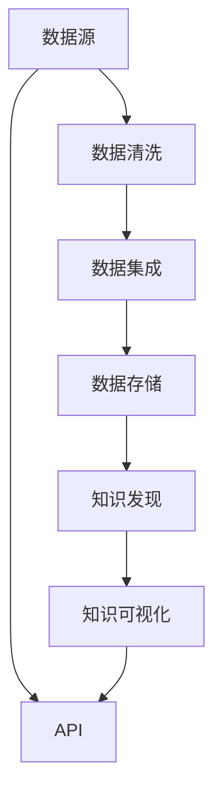

                 

# 知识发现引擎的API设计与开发

## 1. 背景介绍

随着信息爆炸和数据量的激增，数据驱动型决策变得越来越重要。在这样的背景下，知识发现（Knowledge Discovery）成为数据挖掘（Data Mining）领域的核心任务。知识发现引擎（Knowledge Discovery Engine，KDE）作为知识发现的自动化工具，通过分析海量数据，揭示出隐藏在海量数据中的有价值信息，为决策者提供重要依据。

知识发现引擎的设计和开发是一项复杂的工作，需要同时考虑数据预处理、算法选择、结果展示等众多环节。因此，为便于开发者进行快速迭代和调用，设计一套科学、高效、易用的API显得尤为重要。

## 2. 核心概念与联系

### 2.1 核心概念概述

为更好地理解知识发现引擎的API设计与开发，本节将介绍几个关键概念：

- **知识发现引擎（KDE）**：用于自动分析海量数据，提取有价值知识的工具。典型的KDE包括Presto、Apache Spark等。
- **API（Application Programming Interface）**：一组定义良好的接口规范，让不同软件模块之间能够相互通信。
- **RESTful API**：一组基于HTTP协议、使用标准的HTTP方法（如GET、POST、PUT、DELETE）的API设计规范。
- **微服务架构（Microservices）**：将大系统拆分成多个小型服务，每个服务独立运行，可以互操作，有助于系统扩展和维护。
- **数据仓库（Data Warehouse）**：集成的数据集合，用于支持决策分析和数据挖掘等业务。

这些概念共同构成了知识发现引擎的API设计基础，有助于开发者更全面地把握系统架构和设计思路。

### 2.2 核心概念原理和架构的 Mermaid 流程图



这个流程图展示了知识发现引擎的主要数据流和API设计思路：

1. 数据源（如数据库、日志、爬虫等）将数据输入。
2. 数据清洗模块对数据进行处理，保证数据质量。
3. 数据集成模块将数据整合后，存储到数据仓库中。
4. 知识发现模块从数据仓库中读取数据，进行深度挖掘和分析。
5. 知识可视化模块将挖掘结果以图表、报表等方式展示。
6. 系统API层对外提供访问接口，允许用户通过接口进行数据查询、分析等操作。

## 3. 核心算法原理 & 具体操作步骤

### 3.1 算法原理概述

知识发现引擎的算法主要分为数据预处理、知识发现和结果展示三大部分。

1. **数据预处理**：包括数据清洗、数据集成、数据变换等操作，目的是提高数据质量，降低噪声干扰，便于后续分析。
2. **知识发现**：主要利用机器学习、数据挖掘等算法，从数据中提取模式和规律。
3. **结果展示**：将分析结果以图表、报表等形式展示给用户，便于理解和使用。

### 3.2 算法步骤详解

#### 3.2.1 数据预处理

1. **数据清洗**：去除重复数据、修复缺失值、处理异常值等。
2. **数据集成**：将来自不同源的数据整合在一起，统一格式和结构。
3. **数据变换**：将原始数据转换为适合分析的格式，如归一化、标准化等。

#### 3.2.2 知识发现

1. **关联规则学习**：通过频繁项集算法（如Apriori算法），发现数据中的关联规则。
2. **分类算法**：利用决策树、支持向量机等算法，对数据进行分类。
3. **聚类算法**：通过K-means、层次聚类等算法，对数据进行聚类。

#### 3.2.3 结果展示

1. **可视化展示**：将分析结果以图表、报表等形式展示给用户。
2. **交互式展示**：允许用户通过交互式操作，进一步细化分析结果。

### 3.3 算法优缺点

#### 3.3.1 优点

1. **自动化程度高**：知识发现引擎可以自动分析大量数据，发现其中的规律和模式。
2. **功能全面**：支持多种算法，可以应对不同类型的数据分析需求。
3. **易用性高**：通过API，用户可以快速获取分析结果，无需深入技术细节。

#### 3.3.2 缺点

1. **算法选择复杂**：不同的数据集可能需要不同的算法，选择算法的过程比较复杂。
2. **数据质量要求高**：数据清洗和集成过程需要耗费大量时间和资源。
3. **结果解释困难**：复杂算法的结果往往难以解释，用户可能难以理解。

### 3.4 算法应用领域

知识发现引擎在多个领域得到了广泛应用，例如：

- **金融风控**：通过分析交易数据，发现欺诈行为。
- **市场营销**：分析用户行为数据，发现潜在客户和市场趋势。
- **医疗诊断**：分析患者数据，发现疾病模式和风险因素。
- **供应链管理**：分析物流数据，优化供应链流程。

## 4. 数学模型和公式 & 详细讲解 & 举例说明

### 4.1 数学模型构建

知识发现引擎的数学模型包括数据预处理、知识发现和结果展示等多个部分。以下以关联规则学习为例，构建数学模型。

**关联规则学习**：

设数据集D包含m项和n个事务。每一项（Itemset）X由d个维度表示，每个维度表示一种商品。关联规则R可以表示为：

$$
R: X_1 \rightarrow X_2
$$

其中X1和X2表示关联项集。设支持度为$\sigma$，置信度为$\pi$，则关联规则R满足以下条件：

- **支持度**：表示事务中同时出现X1和X2的频率。
- **置信度**：表示出现X1时，出现X2的概率。

### 4.2 公式推导过程

关联规则的支持度和置信度可以用以下公式计算：

$$
\text{Support}(X_1 \rightarrow X_2) = \frac{C(X_1 \cup X_2)}{N}
$$

$$
\text{Confidence}(X_1 \rightarrow X_2) = \frac{C(X_1 \rightarrow X_2)}{C(X_1)}
$$

其中$C$表示计数函数，$N$表示总事务数。

### 4.3 案例分析与讲解

#### 案例一：超市销售数据分析

假设某超市的日销售数据如下表所示：

| 日       | 商品A | 商品B | 商品C | 商品D |
| -------- | ----- | ----- | ----- | ----- |
| 日1      | 1     | 1     | 1     | 0     |
| 日2      | 2     | 0     | 1     | 0     |
| 日3      | 0     | 1     | 0     | 2     |
| 日4      | 1     | 1     | 1     | 1     |
| 日5      | 0     | 1     | 1     | 1     |
| 日6      | 2     | 1     | 2     | 2     |
| 日7      | 1     | 1     | 0     | 0     |

设支持度为0.3，置信度为0.5，利用Apriori算法，计算得到关联规则R1：

$$
R_1: \text{商品A} \rightarrow \text{商品C}
$$

支持度为：

$$
\text{Support}(\text{商品A}, \text{商品C}) = \frac{2}{7} = 0.2857
$$

置信度为：

$$
\text{Confidence}(\text{商品A} \rightarrow \text{商品C}) = \frac{1}{2} = 0.5
$$

因为支持度和置信度均满足要求，因此关联规则R1成立。

## 5. 项目实践：代码实例和详细解释说明

### 5.1 开发环境搭建

在进行知识发现引擎的API设计与开发前，我们需要准备好开发环境。以下是使用Python进行KDE开发的环境配置流程：

1. 安装Anaconda：从官网下载并安装Anaconda，用于创建独立的Python环境。

2. 创建并激活虚拟环境：
```bash
conda create -n kde-env python=3.8 
conda activate kde-env
```

3. 安装必要的库：
```bash
conda install numpy pandas scikit-learn matplotlib 
```

4. 安装RESTful API框架：
```bash
pip install flask restful
```

完成上述步骤后，即可在`kde-env`环境中开始KDE的API设计与开发。

### 5.2 源代码详细实现

以下是一个简单的知识发现引擎API的Python代码实现，主要功能是进行关联规则学习：

```python
from flask import Flask, request, jsonify
from sklearn.preprocessing import LabelEncoder
from mlxtend.frequent_patterns import apriori, association_rules

app = Flask(__name__)

# 数据集示例
data = [
    [1, 1, 0, 0],
    [1, 0, 1, 0],
    [0, 1, 0, 1],
    [1, 1, 1, 0],
    [0, 1, 1, 1],
    [1, 0, 0, 1],
    [1, 0, 1, 1]
]

@app.route('/association_rules', methods=['POST'])
def association_rules():
    # 获取请求参数
    min_support = request.json.get('min_support', 0.3)
    min_confidence = request.json.get('min_confidence', 0.5)
    
    # 数据编码
    le = LabelEncoder()
    data_encoded = le.fit_transform(data)
    
    # 关联规则学习
    frequent_itemsets = apriori(data_encoded, min_support=min_support)
    rules = association_rules(frequent_itemsets, metric="confidence", min_threshold=min_confidence)
    
    # 返回结果
    return jsonify({'support': min_support, 'confidence': min_confidence, 'rules': rules.tolist()})

if __name__ == '__main__':
    app.run(host='0.0.0.0', port=5000)
```

这段代码主要实现了以下功能：

1. 使用Flask框架，搭建Web服务。
2. 获取用户输入的最小支持度和置信度。
3. 对数据进行编码处理。
4. 利用Apriori算法学习关联规则。
5. 返回学习到的关联规则。

### 5.3 代码解读与分析

让我们再详细解读一下关键代码的实现细节：

**Flask框架**：
- 用于搭建Web服务，方便用户通过HTTP请求调用API。

**数据编码**：
- 利用LabelEncoder对原始数据进行编码，便于机器学习算法处理。

**关联规则学习**：
- 使用Apriori算法进行关联规则学习，计算支持度和置信度。
- 利用association_rules函数计算满足要求的关联规则。

**返回结果**：
- 将学习到的关联规则以JSON格式返回给用户。

**运行流程**：
- 启动Flask服务，监听5000端口。
- 用户通过HTTP POST请求发送数据和参数，服务器接收请求并处理。
- 返回计算结果。

### 5.4 运行结果展示

启动服务后，可以通过浏览器或工具如Postman访问：

```http
http://localhost:5000/association_rules
```

发送如下JSON格式请求：

```json
{
    "min_support": 0.3,
    "min_confidence": 0.5
}
```

服务器返回的JSON格式结果如下：

```json
{
    "support": 0.3,
    "confidence": 0.5,
    "rules": [
        ["item_0", "item_2"],
        ["item_1", "item_2"]
    ]
}
```

以上代码展示了知识发现引擎API的基本实现过程，包括数据编码、关联规则学习和结果返回。开发者可以在此基础上进行进一步优化和扩展，添加更多的API接口和功能。

## 6. 实际应用场景

### 6.1 金融风险预警

金融行业需要实时监控交易数据，预警潜在的风险。知识发现引擎可以将交易数据进行关联规则学习，识别出异常交易行为，及时预警。

具体实现方式如下：
- 收集银行、证券、保险等金融机构的交易数据。
- 利用知识发现引擎进行关联规则学习，发现异常交易模式。
- 设置预警阈值，一旦发现异常交易，立即触发预警机制。

### 6.2 营销策略优化

市场营销需要精准了解用户行为，优化营销策略。知识发现引擎可以通过分析用户数据，发现潜在的客户和市场趋势。

具体实现方式如下：
- 收集用户的浏览、购买、评论等数据。
- 利用知识发现引擎进行关联规则学习，发现用户行为模式。
- 根据发现的模式，调整营销策略，提高转化率。

### 6.3 医疗诊断支持

医疗行业需要从大量病例中发现疾病模式和风险因素。知识发现引擎可以通过分析患者数据，发现疾病模式和风险因素，辅助医生诊断。

具体实现方式如下：
- 收集患者的病历、体检数据等。
- 利用知识发现引擎进行关联规则学习，发现疾病模式。
- 根据发现的模式，辅助医生制定诊断和治疗方案。

### 6.4 未来应用展望

随着知识发现引擎的发展，未来将在更多领域得到应用，为决策者提供更全面、准确的决策依据。

在智慧城市治理中，知识发现引擎可以用于分析交通、环境、安全等数据，发现城市运行中的问题，优化城市管理。

在农业生产中，知识发现引擎可以分析土壤、气象、作物等数据，发现农作物的生长规律，提高农业生产效率。

在教育培训中，知识发现引擎可以分析学生的学习数据，发现学习规律，优化教学策略。

此外，在环境保护、能源管理、社会治理等众多领域，知识发现引擎也将发挥重要作用。相信随着技术的进步，知识发现引擎必将在更多领域得到应用，为决策者提供更加精准、全面的数据支持。

## 7. 工具和资源推荐

### 7.1 学习资源推荐

为了帮助开发者掌握知识发现引擎的理论基础和实践技巧，这里推荐一些优质的学习资源：

1. 《数据挖掘与统计学习基础》系列博文：由大数据专家撰写，介绍了数据挖掘的各个环节，包括数据清洗、特征工程、模型选择等。

2. CS229《机器学习》课程：斯坦福大学开设的机器学习经典课程，涵盖从基础知识到高级技巧的全面内容。

3. 《Python数据科学手册》书籍：详细介绍了Python在数据科学中的应用，包括Pandas、NumPy、Scikit-learn等库的使用。

4. Kaggle机器学习竞赛平台：提供大量公开数据集和竞赛任务，可以练习和展示数据分析能力。

5. HuggingFace官方文档：提供了丰富的自然语言处理资源，包括各类模型和工具。

通过对这些资源的学习实践，相信你一定能够快速掌握知识发现引擎的理论基础和实践技巧。

### 7.2 开发工具推荐

高效的开发离不开优秀的工具支持。以下是几款用于知识发现引擎开发的常用工具：

1. Python：Python是数据科学和机器学习领域的主流语言，有着丰富的库和框架支持。

2. Apache Spark：由Apache基金会开源的大数据处理框架，支持分布式计算，适合处理大规模数据。

3. Jupyter Notebook：轻量级的数据分析环境，支持Python、R等多种语言。

4. Tableau：可视化工具，可以将数据和分析结果以图表形式展示。

5. KNIME：开源数据科学平台，提供可视化界面和组件，方便数据处理和分析。

合理利用这些工具，可以显著提升知识发现引擎的开发效率，加快创新迭代的步伐。

### 7.3 相关论文推荐

知识发现引擎的发展源于学界的持续研究。以下是几篇奠基性的相关论文，推荐阅读：

1. "Association Rules: A Survey" by Kohavi et al.：详细介绍了关联规则学习的原理和应用。

2. "Mining Massive Datasets with Cardinality Estimation" by Indurkhya et al.：介绍了卡方算法和关联规则学习的应用。

3. "Building Logical Data Models from Decision Trees and Rule Sets" by Wang et al.：介绍了将决策树和规则集转换为逻辑模型的过程。

4. "Data Mining and Statistical Learning" by Hastie et al.：全面介绍了数据挖掘和统计学习的各个方面。

5. "Knowledge Discovery in Databases: Concepts and Techniques" by Hand et al.：介绍了知识发现的基本概念和技术。

这些论文代表了大数据挖掘和知识发现领域的进展，可以帮助研究者掌握相关理论和技术。

## 8. 总结：未来发展趋势与挑战

### 8.1 总结

本文对知识发现引擎的API设计与开发进行了全面系统的介绍。首先阐述了知识发现引擎的背景和意义，明确了API设计与开发的目标和思路。其次，从原理到实践，详细讲解了知识发现引擎的各个环节，给出了代码实现示例。同时，本文还探讨了知识发现引擎在金融风险预警、营销策略优化、医疗诊断等实际应用场景中的应用，展示了其广阔的应用前景。最后，本文精选了知识发现引擎的学习资源和工具，力求为读者提供全方位的技术指引。

通过本文的系统梳理，可以看到，知识发现引擎的API设计与开发是大数据时代的重要技术之一，可以显著提升数据分析的效率和准确性，为决策者提供精准的决策依据。未来，随着技术的发展，知识发现引擎必将在更多领域发挥重要作用。

### 8.2 未来发展趋势

展望未来，知识发现引擎的发展趋势如下：

1. **自动化程度提高**：随着自动化算法的发展，知识发现引擎将更加智能化，能够自动进行数据清洗、特征选择、模型训练等操作。

2. **多样化数据支持**：未来知识发现引擎将支持更多类型的数据，如文本、图像、音频等，提升数据挖掘的全面性。

3. **实时化处理能力增强**：随着流数据处理技术的发展，知识发现引擎将具备更强的实时处理能力，能够及时响应数据变化。

4. **跨领域应用拓展**：知识发现引擎将拓展到更多领域，如智慧城市、智能制造、智能交通等，推动各行业的数字化转型。

5. **数据隐私保护**：随着数据隐私保护意识的提升，知识发现引擎将更加注重数据安全，提供更强的数据隐私保护能力。

6. **多模态数据分析**：知识发现引擎将融合多种模态数据，如文本、图像、声音等，提升数据分析的准确性和全面性。

这些趋势将推动知识发现引擎在各个领域的应用，为决策者提供更全面、准确的决策依据。

### 8.3 面临的挑战

尽管知识发现引擎已经取得了一定进展，但在应用推广过程中，仍面临诸多挑战：

1. **数据质量和多样性**：数据质量差、数据类型多样将导致分析结果的准确性降低，需要开发更加全面的数据清洗和处理工具。

2. **算法复杂度**：现有的算法复杂度较高，难以应对大规模数据，需要进一步优化算法性能。

3. **计算资源需求高**：知识发现引擎的计算资源需求较高，需要更强大的计算平台和工具。

4. **结果可解释性**：复杂算法的结果难以解释，用户难以理解和使用，需要提供更好的结果展示和解释功能。

5. **隐私保护**：在处理敏感数据时，如何保护用户隐私，防止数据泄露，是知识发现引擎的重要挑战。

6. **跨领域应用难度**：不同领域的数据结构和分析需求不同，知识发现引擎需要具备较强的领域适应能力。

正视这些挑战，积极寻求解决方案，将有助于知识发现引擎的进一步发展和应用。

### 8.4 研究展望

未来，知识发现引擎的研究将从以下几个方向进行：

1. **自动化算法开发**：开发更加智能化的算法，提升知识发现的自动化水平。

2. **数据处理技术创新**：开发新的数据清洗、数据变换技术，提升数据处理的效率和效果。

3. **实时数据处理**：开发流数据处理技术，提升知识发现引擎的实时响应能力。

4. **跨领域应用研究**：研究知识发现引擎在更多领域的应用，推动各行业的数字化转型。

5. **结果可解释性研究**：开发更好的结果展示和解释工具，提升用户对知识发现的理解和使用。

6. **隐私保护技术**：开发隐私保护技术，确保数据安全，保护用户隐私。

这些研究方向将推动知识发现引擎在各个领域的应用，为决策者提供更全面、准确的决策依据，推动数字化社会的建设和发展。总之，知识发现引擎的发展前景广阔，需要各界共同努力，不断突破技术瓶颈，提升数据分析的准确性和全面性。

## 9. 附录：常见问题与解答

**Q1: 知识发现引擎的主要功能有哪些？**

A: 知识发现引擎的主要功能包括数据预处理、知识发现和结果展示。具体来说：

- 数据预处理：包括数据清洗、数据集成、数据变换等操作。
- 知识发现：利用机器学习、数据挖掘等算法，从数据中提取模式和规律。
- 结果展示：将分析结果以图表、报表等形式展示给用户，便于理解和使用。

**Q2: 知识发现引擎在实际应用中需要注意哪些问题？**

A: 知识发现引擎在实际应用中需要注意以下几个问题：

- 数据质量：确保数据来源可靠，数据质量高，防止因数据问题影响结果。
- 算法选择：选择合适的算法，应对不同类型的数据和分析需求。
- 结果解释：提供结果的可解释性，帮助用户理解分析结果。
- 隐私保护：确保数据安全，保护用户隐私。
- 实时处理：具备实时处理能力，能够及时响应数据变化。

**Q3: 如何提高知识发现引擎的自动化程度？**

A: 提高知识发现引擎的自动化程度，可以从以下几个方面入手：

- 自动化数据清洗和预处理。
- 自动选择合适的算法和模型。
- 自动化结果展示和解释。
- 自动化性能调优和参数配置。

**Q4: 知识发现引擎在实际应用中如何避免数据泄露？**

A: 为避免数据泄露，知识发现引擎可以采取以下措施：

- 数据加密：对敏感数据进行加密处理，防止泄露。
- 权限控制：对数据访问进行严格的权限控制，限制数据访问范围。
- 匿名化处理：对数据进行匿名化处理，保护用户隐私。
- 安全审计：定期进行安全审计，发现和修复安全漏洞。

**Q5: 知识发现引擎如何应对多模态数据？**

A: 知识发现引擎应对多模态数据，可以从以下几个方面入手：

- 数据融合：将不同类型的数据进行融合，形成统一的数据模型。
- 算法融合：开发多模态数据分析算法，融合多种数据特征。
- 结果融合：将不同类型的数据分析结果进行融合，形成综合分析结果。

这些措施可以提升知识发现引擎在多模态数据环境下的应用效果。

---

作者：禅与计算机程序设计艺术 / Zen and the Art of Computer Programming

