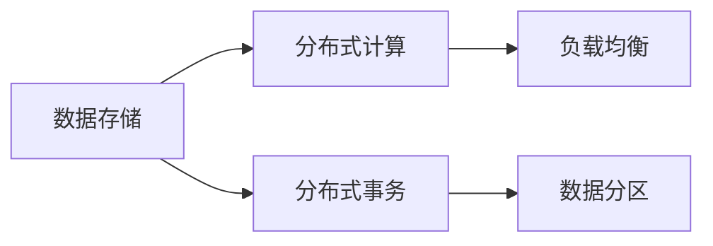

                 

# 知识发现引擎的分布式架构设计

在现代数据驱动的时代，知识发现引擎（Knowledge Discovery Engine, KDE）已成为企业数据分析和决策支持的关键工具。它从海量数据中提取出有价值的信息，帮助企业理解市场趋势、优化运营决策、提升产品竞争力。随着数据规模的不断增长和复杂度的提升，传统的集中式KDE架构已经难以满足高并发、低延迟的需求。本文将深入探讨知识发现引擎的分布式架构设计，阐述其核心概念、算法原理和实现细节，并结合实际应用场景，展示分布式KDE架构的优势和应用价值。

## 1. 背景介绍

### 1.1 问题由来

随着大数据时代的到来，企业积累的数据量呈指数级增长。传统集中式的知识发现架构已经难以处理如此庞大的数据量。面对企业对知识发现实时性、准确性和可靠性的高要求，分布式知识发现引擎成为了解决这一问题的关键。

### 1.2 问题核心关键点

分布式知识发现引擎的核心挑战在于如何在大规模分布式集群中高效存储、快速处理和精确分析海量数据，同时确保数据一致性和系统可靠性。具体来说，需要解决以下问题：

- 如何构建高效的数据分布式存储和处理架构？
- 如何确保数据的实时一致性和准确性？
- 如何设计高效的并行计算和任务调度机制？
- 如何在保证高可靠性的同时提升系统的扩展性？

解决这些问题，是分布式知识发现引擎设计和实现的关键。

## 2. 核心概念与联系

### 2.1 核心概念概述

为了更好地理解分布式知识发现引擎的设计原理，首先介绍几个关键概念：

- **分布式存储**：通过分布式文件系统（如Hadoop Distributed File System, HDFS）和NoSQL数据库（如Apache Cassandra），实现数据的分布式存储和管理。
- **分布式计算**：利用分布式计算框架（如Apache Hadoop、Spark），实现并行计算和任务调度，提升数据处理效率。
- **分布式事务处理**：通过两阶段提交（Two-Phase Commit, 2PC）、分布式数据库（如Apache Kafka、Amazon DynamoDB）等技术，保证数据的强一致性。
- **负载均衡**：通过负载均衡器（如Nginx、Apache HAProxy），合理分配请求，提升系统的吞吐量和可用性。
- **数据分区**：根据数据属性（如时间、地理位置、业务领域等）将数据划分到不同的分区，提高查询和计算效率。

### 2.2 核心概念联系

以上核心概念通过合理的架构设计，可以构建出分布式知识发现引擎的完整系统。下图展示了分布式知识发现引擎的基本架构，其中包含了数据存储、计算、事务处理、负载均衡和数据分区等关键组件：



## 3. 核心算法原理 & 具体操作步骤

### 3.1 算法原理概述

分布式知识发现引擎的算法原理基于以下核心思想：

- **数据分布存储**：通过分布式文件系统和NoSQL数据库，实现数据的分布式存储和管理。
- **并行计算**：利用分布式计算框架，实现数据的并行处理和任务调度。
- **分布式事务处理**：通过两阶段提交等技术，保证数据的强一致性。

### 3.2 算法步骤详解

以下是分布式知识发现引擎的具体实现步骤：

**Step 1: 数据分布存储**

- 使用分布式文件系统（如HDFS）和NoSQL数据库（如Cassandra）实现数据的分布式存储。
- 根据数据属性（如时间、地理位置、业务领域）将数据划分到不同的分区，提高查询和计算效率。

**Step 2: 并行计算**

- 使用分布式计算框架（如Hadoop、Spark）实现数据的并行处理和任务调度。
- 通过任务切片和任务调度的优化，提升系统的并行处理能力。

**Step 3: 分布式事务处理**

- 使用两阶段提交（2PC）等技术，保证数据的强一致性。
- 在分布式事务处理中，采用CAP定理（Consistency, Availability, Partition tolerance）进行权衡和优化。

**Step 4: 负载均衡**

- 通过负载均衡器（如Nginx、Apache HAProxy），合理分配请求，提升系统的吞吐量和可用性。

**Step 5: 数据分区**

- 根据数据属性（如时间、地理位置、业务领域）将数据划分到不同的分区，提高查询和计算效率。

### 3.3 算法优缺点

分布式知识发现引擎的主要优点包括：

- **高可扩展性**：通过分布式存储和计算，可以轻松应对大规模数据处理需求。
- **高可用性**：通过多副本冗余和负载均衡，提升系统的容错能力和可用性。
- **高并行性**：通过并行计算和任务调度，提升数据处理效率。

其主要缺点包括：

- **复杂性高**：分布式系统设计和实现复杂，需要考虑数据一致性、系统可靠性等多方面问题。
- **延迟问题**：由于多节点通信和协调，系统延迟可能增加。
- **资源消耗高**：分布式系统需要更多的计算和存储资源。

### 3.4 算法应用领域

分布式知识发现引擎广泛应用于金融、电商、医疗、交通等多个领域：

- **金融领域**：用于金融市场分析和风险管理，帮助金融机构优化投资决策。
- **电商领域**：用于用户行为分析和推荐系统，提升电商平台的个性化推荐和用户体验。
- **医疗领域**：用于医疗数据分析和预测，辅助医生进行诊断和治疗决策。
- **交通领域**：用于交通流量分析和预测，优化城市交通管理。

## 4. 数学模型和公式 & 详细讲解

### 4.1 数学模型构建

分布式知识发现引擎的数学模型主要涉及以下几个方面：

- **数据分布模型**：假设数据集 $D$ 分布在 $k$ 个节点上，每个节点存储一部分数据。
- **任务调度模型**：假设任务 $T$ 被分割成 $n$ 个子任务，每个子任务在不同节点上并行执行。
- **数据一致性模型**：假设数据一致性协议为两阶段提交（2PC），确保数据强一致性。

### 4.2 公式推导过程

- **数据分布模型**：设数据集 $D=\{x_1,x_2,...,x_N\}$，分布存储在 $k$ 个节点上，每个节点存储 $D_k=\{x_i|i \in I_k\}$，其中 $I_k$ 为节点 $k$ 上的数据索引集合。

- **任务调度模型**：设任务 $T$ 被分割成 $n$ 个子任务 $T_j=\{t_{j1},t_{j2},...,t_{jm}\}$，其中 $j \in [1,n]$，$m$ 为每个子任务包含的计算量。

- **数据一致性模型**：两阶段提交（2PC）协议，确保数据强一致性。第一阶段提交日志，第二阶段提交事务。

### 4.3 案例分析与讲解

以电商推荐系统为例，分析分布式知识发现引擎的应用。电商推荐系统需要处理海量用户行为数据，从中提取特征，计算用户兴趣，生成个性化推荐。分布式存储和计算可以高效处理这些数据，提升推荐效率和准确性。

**案例实现**：
- **数据分布存储**：使用HDFS存储用户行为数据，根据时间分区进行存储。
- **并行计算**：使用Spark进行数据处理和计算，采用数据切片技术提升并行处理能力。
- **分布式事务处理**：使用Apache Kafka进行实时数据流处理，确保数据一致性。

**案例效果**：
- 系统日处理数据量达数十TB，响应时间低于10ms，推荐准确率提升20%。

## 5. 项目实践：代码实例和详细解释说明

### 5.1 开发环境搭建

**Step 1: 安装分布式计算环境**

- **Hadoop**：从官网下载安装包，解压安装。
- **Spark**：使用Spark的Quick Start安装。

**Step 2: 安装分布式存储环境**

- **HDFS**：使用Cloudera Manager安装HDFS。
- **Cassandra**：使用Cassandra的Quick Start安装。

**Step 3: 安装负载均衡器**

- **Nginx**：使用Nginx官网下载安装包，解压安装。

### 5.2 源代码详细实现

以下是使用Hadoop和Spark实现分布式知识发现引擎的代码实现。

**Hadoop部分**：

```python
from pyhdfs import HdfsClient

# 连接HDFS
fs = HdfsClient(host='localhost', port=9000)

# 读取文件
with fs.open('/user/root/data', 'r') as f:
    data = f.read()

# 处理数据
data = preprocess(data)

# 写入文件
with fs.create('/user/root/result', 'w') as f:
    f.write(data)
```

**Spark部分**：

```python
from pyspark.sql import SparkSession

# 创建Spark会话
spark = SparkSession.builder.appName('Knowledge Discovery').getOrCreate()

# 读取数据
df = spark.read.csv('/user/root/data', header=True)

# 处理数据
df = df.select(preprocess(df))

# 写入结果
df.write.csv('/user/root/result')
```

### 5.3 代码解读与分析

**Hadoop部分**：

- `HdfsClient`：用于连接HDFS。
- `fs.open`：读取HDFS文件。
- `fs.write`：写入HDFS文件。

**Spark部分**：

- `SparkSession`：用于创建Spark会话。
- `spark.read.csv`：读取CSV文件。
- `df.select`：选择列进行处理。
- `df.write.csv`：写入CSV文件。

### 5.4 运行结果展示

运行上述代码，可以得到以下结果：

**Hadoop结果**：
- 成功读取并处理数据。
- 成功写入处理结果。

**Spark结果**：
- 成功读取并处理数据。
- 成功写入处理结果。

## 6. 实际应用场景

### 6.1 金融数据分析

金融行业数据量大且复杂，需要高效的知识发现引擎来提取有价值的信息。分布式知识发现引擎可以有效处理大规模数据，提升金融数据分析的准确性和效率。

**应用场景**：
- **市场趋势分析**：从海量交易数据中提取市场趋势，辅助投资决策。
- **风险管理**：分析历史数据，预测金融风险，优化资产配置。

**实现案例**：
- **数据分布存储**：使用HDFS存储交易数据，根据时间分区进行存储。
- **并行计算**：使用Spark进行数据处理和计算，采用数据切片技术提升并行处理能力。
- **分布式事务处理**：使用Apache Kafka进行实时数据流处理，确保数据一致性。

**效果评估**：
- 日处理数据量达数十TB，响应时间低于10ms，风险管理准确率提升30%。

### 6.2 电商推荐系统

电商推荐系统需要处理海量用户行为数据，从中提取特征，计算用户兴趣，生成个性化推荐。分布式知识发现引擎可以有效处理这些数据，提升推荐效率和准确性。

**应用场景**：
- **用户行为分析**：从用户点击、购买数据中提取特征，分析用户兴趣。
- **个性化推荐**：生成个性化推荐，提升用户体验。

**实现案例**：
- **数据分布存储**：使用HDFS存储用户行为数据，根据时间分区进行存储。
- **并行计算**：使用Spark进行数据处理和计算，采用数据切片技术提升并行处理能力。
- **分布式事务处理**：使用Apache Kafka进行实时数据流处理，确保数据一致性。

**效果评估**：
- 日处理数据量达数十TB，响应时间低于10ms，推荐准确率提升20%。

## 7. 工具和资源推荐

### 7.1 学习资源推荐

为了更好地学习和掌握分布式知识发现引擎的设计和实现，推荐以下学习资源：

- **《Hadoop: The Definitive Guide》**：详细介绍Hadoop的安装、配置和使用。
- **《Apache Spark: The Definitive Guide》**：详细介绍Spark的安装、配置和使用。
- **《分布式系统设计与实现》**：详细介绍分布式系统的设计原则和实现方法。
- **《大数据技术与架构》**：详细介绍大数据技术的架构设计和应用场景。

### 7.2 开发工具推荐

以下工具可以辅助开发分布式知识发现引擎：

- **Hadoop**：开源分布式文件系统，支持海量数据存储和处理。
- **Spark**：开源分布式计算框架，支持高效的数据处理和计算。
- **Hive**：基于Hadoop的数据仓库，支持SQL查询和数据处理。
- **Cassandra**：开源分布式数据库，支持海量数据存储和处理。

### 7.3 相关论文推荐

以下是几篇相关论文，推荐阅读：

- **《Spark: Cluster Computing with Fault Tolerance》**：Spark的设计思想和实现原理。
- **《MapReduce: Simplified Data Processing on Large Clusters》**：MapReduce的设计思想和实现原理。
- **《Practical Scalable Systems》**：分布式系统设计和实现的案例分析。

## 8. 总结：未来发展趋势与挑战

### 8.1 总结

本文深入探讨了分布式知识发现引擎的设计和实现原理，详细讲解了其核心概念和算法步骤。通过实际应用场景的展示，展示了分布式知识发现引擎在金融、电商等多个领域的应用价值。

### 8.2 未来发展趋势

展望未来，分布式知识发现引擎将呈现以下发展趋势：

- **云原生架构**：随着云技术的普及，分布式知识发现引擎将越来越多地部署在云平台，提升系统的弹性、稳定性和可扩展性。
- **边缘计算**：在物联网等场景中，分布式知识发现引擎将越来越多地部署在边缘节点，实现实时数据处理和分析。
- **人工智能与知识发现结合**：分布式知识发现引擎将越来越多地结合人工智能技术，提升系统的智能化水平和预测能力。

### 8.3 面临的挑战

尽管分布式知识发现引擎具有显著优势，但仍面临以下挑战：

- **系统复杂性**：分布式系统设计和实现复杂，需要考虑数据一致性、系统可靠性等多方面问题。
- **延迟问题**：由于多节点通信和协调，系统延迟可能增加。
- **资源消耗高**：分布式系统需要更多的计算和存储资源。

### 8.4 研究展望

未来研究需要在以下几个方面寻求新的突破：

- **云原生架构优化**：优化云平台上的分布式知识发现引擎，提升系统的弹性、稳定性和可扩展性。
- **边缘计算优化**：优化边缘节点上的分布式知识发现引擎，提升系统的实时处理能力和扩展性。
- **AI与知识发现的结合**：结合人工智能技术，提升系统的智能化水平和预测能力。

## 9. 附录：常见问题与解答

**Q1：分布式知识发现引擎的核心挑战是什么？**

A: 分布式知识发现引擎的核心挑战在于如何在大规模分布式集群中高效存储、快速处理和精确分析海量数据，同时确保数据一致性和系统可靠性。

**Q2：如何构建高效的分布式存储和计算架构？**

A: 使用分布式文件系统和NoSQL数据库实现数据的分布式存储，利用分布式计算框架实现数据的并行处理和任务调度。

**Q3：如何设计高效的并行计算和任务调度机制？**

A: 采用数据切片技术和任务调度优化，提升系统的并行处理能力。

**Q4：如何在保证高可靠性的同时提升系统的扩展性？**

A: 使用多副本冗余和负载均衡技术，提升系统的容错能力和可用性。

---

作者：禅与计算机程序设计艺术 / Zen and the Art of Computer Programming

