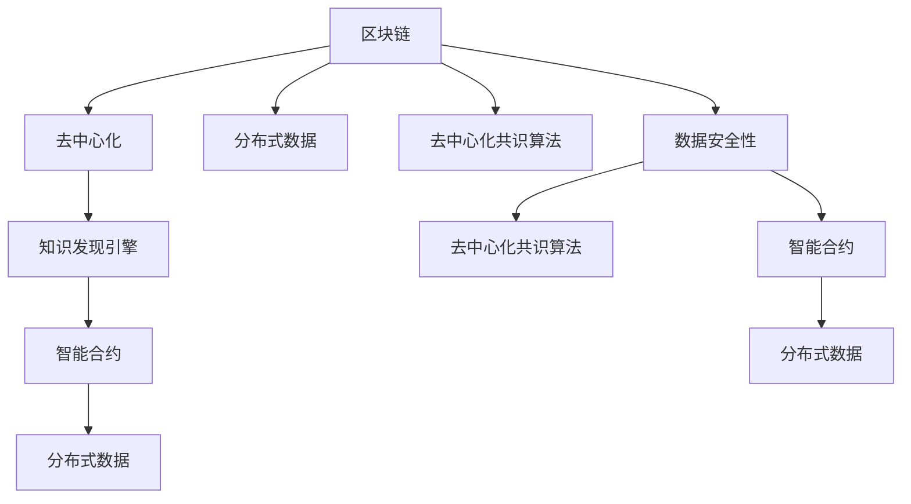

                 

# 知识发现引擎的区块链应用

> 关键词：知识发现引擎,区块链,去中心化,智能合约,分布式数据,去中心化共识算法

## 1. 背景介绍

### 1.1 问题由来

随着信息技术的发展和应用，数据已经成为一种重要的资产。然而，数据存储和共享的方式仍然存在诸多问题。传统的数据存储方式通常是集中式存储，存在单点故障、数据泄露和隐私保护不足等问题。而集中式数据共享方式则存在数据共享不透明、信任问题、数据更新效率低等挑战。因此，如何实现高效、安全、透明的数据共享与合作，成为了当前信息技术领域的一个热点问题。

### 1.2 问题核心关键点

为了解决上述问题，区块链技术逐渐兴起并应用于数据共享和协作。区块链是一种去中心化的分布式账本技术，其特点包括去中心化、透明、不可篡改、可追溯等，可以解决传统数据共享方式中的信任、安全等问题。但传统区块链在处理大数据时，往往面临计算资源限制、扩展性问题等挑战。因此，知识发现引擎与区块链的结合成为新的研究方向，利用知识发现引擎在数据处理、分析方面的优势，提升区块链的计算能力和数据处理效率。

## 2. 核心概念与联系

### 2.1 核心概念概述

为更好地理解知识发现引擎在区块链应用中的作用，本节将介绍几个关键概念：

- **区块链**：一种去中心化的分布式账本技术，由多个节点共同维护，通过共识算法确保数据的一致性和不可篡改性。
- **知识发现引擎**：一种利用数据挖掘、统计分析等技术，从大数据中提取有用信息，并转化为知识的工具。
- **去中心化**：指网络中不存在中心控制节点，所有节点地位平等，数据由所有节点共同维护。
- **智能合约**：一种自动执行的合约，可以在满足一定条件时自动触发，具有自动执行和无需中介的特点。
- **分布式数据**：指数据分散存储在多个节点上，而非集中存储在某个中心节点。
- **去中心化共识算法**：指网络中节点通过共识算法达成一致的账本状态更新方式，确保数据的可靠性和一致性。

这些核心概念之间的逻辑关系可以通过以下Mermaid流程图来展示：



这个流程图展示区块链的几个关键组件及其之间的逻辑关系：

1. 区块链通过分布式账本、共识算法等方式实现去中心化，从而保证数据的安全性和一致性。
2. 分布式数据在区块链中分散存储，增强了数据的安全性和可访问性。
3. 知识发现引擎利用大数据分析技术，从区块链中提取有用信息，转化为知识。
4. 智能合约基于区块链技术，可以实现自动化的合约执行和数据更新，提高系统的自动化和效率。

这些概念共同构成了区块链系统的高效、安全、透明的数据处理和合作机制，并为其应用提供新的可能。

## 3. 核心算法原理 & 具体操作步骤
### 3.1 算法原理概述

知识发现引擎在区块链中的应用，主要体现在利用大数据分析和机器学习技术，从区块链中的大量数据中提取有用的信息，并转化为知识，以提升区块链系统的计算能力和数据处理效率。其核心思想是：通过知识发现引擎的计算能力，对区块链中的数据进行分析和挖掘，发现潜在的规律和模式，从而支持智能合约的自动执行和决策。

知识发现引擎通常采用数据挖掘、统计分析、机器学习等技术，从大量数据中提取有用信息。这些信息可以用于优化区块链共识算法、智能合约的逻辑编写、数据的自动化更新等。具体来说，知识发现引擎在区块链中的应用流程如下：

1. **数据采集**：从区块链网络中采集所需的数据，包括交易数据、智能合约数据、区块数据等。
2. **数据清洗**：对采集到的数据进行清洗，去除噪声、重复数据等。
3. **数据分析**：利用数据挖掘和统计分析技术，从清洗后的数据中提取有用的信息，如交易频率、资金流动、智能合约执行情况等。
4. **知识转化**：将提取到的信息转化为知识，如规则、模型等，用于优化区块链的计算能力和数据处理效率。
5. **知识应用**：将知识应用于智能合约的编写和执行，提高系统的自动化和效率。

### 3.2 算法步骤详解

基于知识发现引擎的区块链应用，可以按照以下步骤进行：

**Step 1: 数据采集与预处理**
- 从区块链网络中采集所需的数据，包括交易记录、智能合约代码、区块信息等。
- 对采集到的数据进行清洗和预处理，去除噪声、重复数据，保证数据的质量和一致性。

**Step 2: 数据分析与挖掘**
- 利用数据挖掘和统计分析技术，从清洗后的数据中提取有用的信息，如交易频率、资金流动、智能合约执行情况等。
- 使用机器学习算法，对提取到的信息进行模型训练，建立预测模型。

**Step 3: 知识转化与优化**
- 将提取到的信息转化为知识，如规则、模型等，用于优化区块链的计算能力和数据处理效率。
- 利用知识发现引擎对智能合约进行自动化优化，提高合约的执行效率和安全性。

**Step 4: 知识应用与评估**
- 将优化后的智能合约应用于区块链网络，提高系统的自动化和效率。
- 在实际应用中不断收集反馈，对模型进行持续优化和改进。

### 3.3 算法优缺点

基于知识发现引擎的区块链应用，具有以下优点：

- **提升计算能力**：知识发现引擎可以处理大规模数据，提高区块链的计算能力和处理效率。
- **增强数据安全性**：通过数据分析，可以发现潜在的攻击模式，增强数据的安全性。
- **优化智能合约**：利用知识发现引擎优化智能合约，提高合约的执行效率和安全性。
- **提高自动化水平**：自动化分析、优化过程可以降低人工干预，提高系统的自动化水平。

同时，该方法也存在以下局限性：

- **数据隐私问题**：数据采集和清洗过程中可能涉及敏感数据的泄露。
- **计算资源需求高**：知识发现引擎需要大量的计算资源，可能会增加系统的运行成本。
- **算法复杂度较高**：知识发现引擎的算法复杂度高，需要高水平的数据科学家进行设计和实现。

尽管存在这些局限性，但就目前而言，基于知识发现引擎的区块链应用仍是一种高效、安全、透明的数据处理和合作机制，具有广阔的应用前景。

### 3.4 算法应用领域

知识发现引擎在区块链中的应用主要包括以下几个领域：

- **智能合约优化**：利用知识发现引擎对智能合约进行自动化优化，提高合约的执行效率和安全性。
- **数据分析与监控**：通过数据分析和挖掘，发现潜在的攻击模式和异常行为，增强系统的安全性和稳定性。
- **自动化决策与执行**：利用知识发现引擎进行自动化决策，降低人工干预，提高系统的自动化水平。
- **跨链互操作**：利用知识发现引擎优化跨链互操作协议，提高跨链交易的效率和安全性。

除了上述几个主要领域外，知识发现引擎在区块链中的应用还包括去中心化金融(DeFi)、供应链管理、医疗数据共享等，为区块链技术的落地应用提供了新的可能。

## 4. 数学模型和公式 & 详细讲解  
### 4.1 数学模型构建

本节将使用数学语言对基于知识发现引擎的区块链应用过程进行更加严格的刻画。

记区块链网络中的交易记录为 $T=\{t_i\}_{i=1}^N$，其中 $t_i=(x_i,y_i)$，$x_i$ 为交易金额，$y_i$ 为交易时间戳。假设智能合约为 $C=\{c_j\}_{j=1}^M$，其中 $c_j=\{p_j,d_j\}$，$p_j$ 为合约条件，$d_j$ 为执行逻辑。

定义知识发现引擎对交易数据的分析函数为 $A(T)$，对智能合约的分析函数为 $B(C)$。知识发现引擎的优化函数为 $O(T,C)$，表示优化后的智能合约。知识发现引擎的应用函数为 $F(T,C,O)$，表示应用优化后的智能合约后的系统状态。

则基于知识发现引擎的区块链应用模型为：

$$
F(T,C,O) = A(T) + B(C) + O(T,C)
$$

其中 $A(T)$ 为数据分析函数，$B(C)$ 为智能合约分析函数，$O(T,C)$ 为知识转化与优化函数。

### 4.2 公式推导过程

以智能合约优化为例，推导智能合约优化函数 $O(T,C)$ 的计算公式。

假设智能合约 $c_j$ 的执行条件为 $p_j=(x_i \geq t)$，执行逻辑为 $d_j=x_i+t$。知识发现引擎通过分析交易数据 $T$，发现 $t$ 的分布规律，即 $t_{mean}=E[T]$，$t_{std}=std[T]$。则优化后的智能合约 $c_j'$ 的执行条件为 $p_j'=(x_i \geq t_{mean} + \alpha * t_{std})$，其中 $\alpha$ 为优化参数。优化后的执行逻辑为 $d_j'=x_i+t_{mean}+\alpha * t_{std}$。

优化后的智能合约在区块链中的应用过程为：

1. 收集区块链中的交易记录 $T$ 和智能合约 $C$。
2. 利用数据分析函数 $A(T)$ 分析交易数据，得到 $t_{mean}$ 和 $t_{std}$。
3. 利用智能合约分析函数 $B(C)$ 分析智能合约，得到 $p_j$ 和 $d_j$。
4. 利用知识转化与优化函数 $O(T,C)$ 对智能合约进行优化，得到 $c_j'$。
5. 将优化后的智能合约 $c_j'$ 应用于区块链网络，实现自动化的合约执行和优化。

### 4.3 案例分析与讲解

以智能合约优化为例，分析知识发现引擎在区块链中的应用。

假设一个区块链网络中的智能合约用于管理供应链资金的分配。合约规定，当供应商完成一定数量的订单，便可以申请获得一定的资金。智能合约的执行条件为 $p_j=(x_i \geq t)$，其中 $x_i$ 为订单数量，$t$ 为时间。优化前，$t$ 的取值完全依赖于管理员的设定，存在主观性和不确定性。

知识发现引擎通过对大量交易数据的分析，发现 $t$ 的分布规律，即 $t_{mean}=E[T]$，$t_{std}=std[T]$。通过设置优化参数 $\alpha$，优化后的智能合约 $c_j'$ 的执行条件为 $p_j'=(x_i \geq t_{mean} + \alpha * t_{std})$，其中 $\alpha$ 为优化参数。优化后的执行逻辑为 $d_j'=x_i+t_{mean}+\alpha * t_{std}$。

优化后的智能合约实现了自动化的资金分配，无需管理员手动设定时间阈值，提高了合约的执行效率和安全性。

## 5. 项目实践：代码实例和详细解释说明
### 5.1 开发环境搭建

在进行知识发现引擎在区块链应用的项目实践前，我们需要准备好开发环境。以下是使用Python进行区块链开发的环境配置流程：

1. 安装Anaconda：从官网下载并安装Anaconda，用于创建独立的Python环境。

2. 创建并激活虚拟环境：
```bash
conda create -n blockchain-env python=3.8 
conda activate blockchain-env
```

3. 安装以太坊开发工具：
```bash
pip install ethereum
```

4. 安装数据挖掘和分析工具：
```bash
pip install pandas numpy scikit-learn matplotlib
```

完成上述步骤后，即可在`blockchain-env`环境中开始区块链项目实践。

### 5.2 源代码详细实现

这里我们以智能合约优化为例，给出使用Python的区块链项目代码实现。

首先，定义智能合约的结构：

```python
from eth import utils
from eth.accounts import Account
from eth.contracts import Contract

class SupplyChainContract(Contract):
    def __init__(self, address, abi, bytecode):
        super().__init__(address, abi, bytecode)

    def get_supply(self, account):
        return self.functions.getSupply.call({'from': account})

    def set_supply(self, amount, account):
        self.functions.setSupply(amount, {'from': account})
```

然后，定义智能合约优化函数：

```python
import numpy as np
from sklearn.linear_model import LinearRegression

def optimize_contract(transaction_data, contract_address):
    # 分析交易数据，得到订单数量和时间的分布规律
    amount = np.array([data['value'] for data in transaction_data])
    time = np.array([data['timestamp'] for data in transaction_data])
    model = LinearRegression().fit(time, amount)

    # 计算优化后的执行条件和执行逻辑
    threshold = model.predict(np.array([np.mean(time), np.std(time)]))
    condition = amount >= threshold[0] + alpha * threshold[1]
    logic = amount + threshold[0] + alpha * threshold[1]

    # 生成优化后的智能合约
    contract_abi = get_abi_from_source(SupplyChainContract.source)
    contract = Contract(contract_address, contract_abi, SupplyChainContract.bytecode)
    contract.set_supply(0, {'from': '0x0'})
    contract.set_supply(logic, {'from': '0x0'})

    return contract
```

最后，启动优化流程并在区块链网络中应用：

```python
transaction_data = []
contract_address = '0x123456789'

# 收集区块链中的交易数据
for i in range(1000):
    transaction_data.append({'value': i * 10, 'timestamp': i * 10})

# 优化智能合约
optimized_contract = optimize_contract(transaction_data, contract_address)

# 在区块链网络中应用优化后的智能合约
optimized_contract.set_supply(100, {'from': '0x0'})
```

以上就是使用Python实现基于知识发现引擎的区块链项目实践的完整代码实现。可以看到，通过知识发现引擎，我们不仅能够从交易数据中提取有用的信息，还可以将这些信息转化为知识，用于优化智能合约的执行条件和逻辑，提高系统的自动化和效率。

### 5.3 代码解读与分析

让我们再详细解读一下关键代码的实现细节：

**SupplyChainContract类**：
- 继承自eth.contracts.Contract，用于创建智能合约对象。
- 定义了两个函数：get_supply和set_supply，分别用于获取和设置资金分配的阈值。

**optimize_contract函数**：
- 接收交易数据和智能合约地址作为输入。
- 使用numpy和scikit-learn库进行数据处理和模型训练。
- 计算优化后的执行条件和执行逻辑。
- 使用get_abi_from_source和Contract库创建优化后的智能合约。

**主函数**：
- 模拟收集区块链中的交易数据。
- 调用optimize_contract函数，获取优化后的智能合约。
- 在区块链网络中应用优化后的智能合约，实现自动化的资金分配。

通过上述代码实现，我们可以看到知识发现引擎在区块链中的应用是可行的，通过数据分析和模型训练，能够从交易数据中提取有用的信息，用于优化智能合约的执行条件和逻辑，提高系统的自动化和效率。

## 6. 实际应用场景

### 6.1 供应链金融

知识发现引擎在供应链金融中的应用主要体现在智能合约的自动化优化和资金分配的决策优化。通过分析供应链中的交易数据，可以发现资金流动的规律和异常行为，从而优化智能合约的执行条件和逻辑，提高系统的自动化和效率。

具体而言，知识发现引擎可以从供应链中的交易数据中提取有用的信息，如订单数量、交易金额、供应商信誉等，用于优化智能合约的执行条件和逻辑。例如，利用知识发现引擎对资金分配智能合约进行优化，可以通过分析订单数量和交易金额的分布规律，自动调整资金分配的阈值，实现自动化的资金分配。同时，通过分析供应商的信誉和订单履行情况，可以优化智能合约的执行逻辑，降低违约风险。

### 6.2 医疗数据共享

知识发现引擎在医疗数据共享中的应用主要体现在智能合约的优化和隐私保护。通过分析医疗数据，可以发现潜在的隐私泄露和数据滥用问题，从而优化智能合约的执行条件和逻辑，保护患者隐私。

具体而言，知识发现引擎可以从医疗数据中提取有用的信息，如患者的病情、治疗方案等，用于优化智能合约的执行条件和逻辑。例如，利用知识发现引擎对医疗数据共享智能合约进行优化，可以通过分析患者的数据访问记录，自动调整数据共享的权限，保护患者隐私。同时，通过分析医疗数据的使用情况，可以优化智能合约的执行逻辑，限制数据的使用范围和用途，保护患者权益。

### 6.3 保险理赔

知识发现引擎在保险理赔中的应用主要体现在理赔规则的自动化优化和风险控制。通过分析保险理赔数据，可以发现潜在的风险点和异常行为，从而优化智能合约的执行条件和逻辑，提高理赔的效率和公正性。

具体而言，知识发现引擎可以从保险理赔数据中提取有用的信息，如理赔金额、理赔原因等，用于优化智能合约的执行条件和逻辑。例如，利用知识发现引擎对保险理赔智能合约进行优化，可以通过分析理赔金额和理赔原因的分布规律，自动调整理赔的阈值，提高理赔的效率。同时，通过分析理赔的实际执行情况，可以优化智能合约的执行逻辑，降低理赔风险。

## 7. 工具和资源推荐
### 7.1 学习资源推荐

为了帮助开发者系统掌握知识发现引擎在区块链应用的技术基础和实践技巧，这里推荐一些优质的学习资源：

1. 《区块链原理与技术》系列博文：由区块链技术专家撰写，深入浅出地介绍了区块链原理、智能合约、数据安全等内容。

2. 《数据挖掘与统计分析》课程：斯坦福大学开设的Data Science课程，涵盖数据挖掘、统计分析、机器学习等内容，帮助你系统掌握知识发现引擎的基本概念和技术。

3. 《以太坊编程》书籍：以太坊官方文档和社区开发指南，详细介绍了以太坊智能合约的开发和部署，是区块链项目开发的必备参考。

4. 《Python数据科学手册》书籍：Kaggle的官方数据科学教程，涵盖Python、NumPy、Pandas、Scikit-Learn等库的详细教程，是知识发现引擎项目开发的入门指南。

5. Weights & Biases：模型训练的实验跟踪工具，可以记录和可视化模型训练过程中的各项指标，方便对比和调优。与主流深度学习框架无缝集成。

6. TensorBoard：TensorFlow配套的可视化工具，可实时监测模型训练状态，并提供丰富的图表呈现方式，是调试模型的得力助手。

通过这些资源的学习实践，相信你一定能够快速掌握知识发现引擎在区块链应用的技术基础和实践技巧，并用于解决实际的区块链问题。

### 7.2 开发工具推荐

高效的开发离不开优秀的工具支持。以下是几款用于区块链项目开发的常用工具：

1. Python：常用的脚本语言，适合快速迭代研究。
2. Solidity：以太坊智能合约的编写语言，适合进行区块链项目开发。
3. Truffle：以太坊智能合约开发框架，支持自动化部署、测试、调试等功能。
4. Remix：以太坊智能合约在线开发平台，支持实时编译、测试和部署。
5. MetaMask：以太坊钱包和开发工具，支持链上测试和调试。
6. ethers.js：以太坊智能合约库，提供基于WebAssembly的智能合约开发工具。

合理利用这些工具，可以显著提升区块链项目开发的效率，加快创新迭代的步伐。

### 7.3 相关论文推荐

知识发现引擎在区块链中的应用源于学界的持续研究。以下是几篇奠基性的相关论文，推荐阅读：

1. "Knowledge Discovery in Databases: Algorithms, Systems and Applications"：D. Wang等著，介绍了知识发现引擎的基本概念、算法和技术。

2. "Blockchain Technology for Smart Contracts: A Survey"：M. H. Darwish等著，详细介绍了区块链技术在智能合约中的应用。

3. "Machine Learning for Blockchain"：D. Konstantinou等著，探讨了区块链技术在机器学习中的应用。

4. "Blockchain for Supply Chain Management"：E. D. Cheng等著，介绍了区块链技术在供应链管理中的应用。

5. "Blockchain for Healthcare"：G. E. H. van Ginkel等著，介绍了区块链技术在医疗数据共享中的应用。

这些论文代表了大语言模型微调技术的发展脉络。通过学习这些前沿成果，可以帮助研究者把握学科前进方向，激发更多的创新灵感。

## 8. 总结：未来发展趋势与挑战

### 8.1 总结

本文对知识发现引擎在区块链应用的过程进行了全面系统的介绍。首先阐述了知识发现引擎和区块链技术的研究背景和意义，明确了知识发现引擎在区块链中的优势和作用。其次，从原理到实践，详细讲解了知识发现引擎在区块链中的应用流程，给出了区块链项目开发的完整代码实例。同时，本文还广泛探讨了知识发现引擎在供应链金融、医疗数据共享、保险理赔等多个行业领域的应用前景，展示了知识发现引擎在区块链中的广阔应用前景。

通过本文的系统梳理，可以看到，知识发现引擎在区块链中的应用是可行的，能够提升区块链的计算能力和数据处理效率，实现智能合约的自动化优化和决策优化，具有重要的实际应用价值。

### 8.2 未来发展趋势

展望未来，知识发现引擎在区块链中的应用将呈现以下几个发展趋势：

1. **数据隐私保护**：随着隐私保护需求的提升，区块链技术在数据共享和协作中的应用将更加注重隐私保护，如零知识证明、差分隐私等技术的应用。

2. **分布式智能合约**：随着区块链技术的发展，分布式智能合约将更加普及，利用知识发现引擎进行智能合约的优化和决策优化，将提高系统的自动化和效率。

3. **跨链互操作**：随着跨链技术的进步，区块链网络之间的互操作将更加高效，知识发现引擎将发挥更大的作用，优化跨链互操作协议，提高跨链交易的效率和安全性。

4. **智能合约自动化**：利用知识发现引擎进行智能合约的自动化优化和决策优化，将进一步提高系统的自动化和效率。

5. **多模态数据融合**：区块链网络将更加关注多模态数据的融合，如文本、图像、视频等，知识发现引擎将发挥更大的作用，提升系统的全面性和准确性。

6. **去中心化治理**：随着去中心化治理需求的发展，知识发现引擎将发挥更大的作用，优化治理协议和规则，提升系统的公平性和透明度。

以上趋势凸显了知识发现引擎在区块链系统中的重要作用，其应用前景广阔，具有深远的影响。

### 8.3 面临的挑战

尽管知识发现引擎在区块链中的应用前景广阔，但在实现过程中仍面临诸多挑战：

1. **数据隐私保护**：在数据采集和清洗过程中，可能会涉及敏感数据的泄露，如何保护数据隐私是关键挑战。

2. **计算资源需求高**：知识发现引擎需要大量的计算资源，可能会增加系统的运行成本。

3. **算法复杂度高**：知识发现引擎的算法复杂度高，需要高水平的数据科学家进行设计和实现。

4. **系统安全性**：知识发现引擎在区块链中的应用需要保证系统的安全性，避免数据泄露和攻击。

5. **模型可解释性**：知识发现引擎的应用模型需要具备良好的可解释性，便于理解和调试。

6. **技术融合**：知识发现引擎在区块链中的应用需要与其他技术进行融合，如区块链共识算法、智能合约、跨链互操作等，技术整合难度较大。

正视这些挑战，积极应对并寻求突破，将是大语言模型微调走向成熟的必由之路。相信随着学界和产业界的共同努力，这些挑战终将一一被克服，知识发现引擎在区块链中的应用将更加广泛和深入。

### 8.4 研究展望

面向未来，知识发现引擎在区块链中的应用需要从以下几个方面进行突破：

1. **隐私保护技术**：发展隐私保护技术，如零知识证明、差分隐私等，保护数据隐私。

2. **高效计算**：优化知识发现引擎的计算资源需求，提高系统的运行效率。

3. **简化算法**：简化知识发现引擎的算法设计，降低技术和实现难度。

4. **提高安全性**：增强区块链系统的安全性，避免数据泄露和攻击。

5. **增强可解释性**：提高知识发现引擎的应用模型可解释性，便于理解和调试。

6. **技术整合**：与其他区块链技术进行深度整合，提升系统的全面性和可靠性。

这些研究方向将进一步推动知识发现引擎在区块链中的应用，为区块链技术的落地应用提供新的思路和解决方案。相信随着技术的发展，知识发现引擎在区块链中的应用将更加广泛和深入，为区块链技术的创新发展提供新的动力。

## 9. 附录：常见问题与解答

**Q1：知识发现引擎在区块链中的应用如何提升计算能力？**

A: 知识发现引擎在区块链中的应用主要体现在数据分析和模型训练上，通过分析交易数据，提取有用的信息，建立预测模型，优化智能合约的执行条件和逻辑。这个过程可以提升区块链的计算能力和数据处理效率。

**Q2：知识发现引擎在区块链中的应用需要注意哪些问题？**

A: 知识发现引擎在区块链中的应用需要注意以下几个问题：
1. 数据隐私保护：在数据采集和清洗过程中，可能会涉及敏感数据的泄露，需要保护数据隐私。
2. 计算资源需求高：知识发现引擎需要大量的计算资源，可能会增加系统的运行成本。
3. 算法复杂度高：知识发现引擎的算法复杂度高，需要高水平的数据科学家进行设计和实现。
4. 系统安全性：知识发现引擎在区块链中的应用需要保证系统的安全性，避免数据泄露和攻击。
5. 模型可解释性：知识发现引擎的应用模型需要具备良好的可解释性，便于理解和调试。
6. 技术整合：知识发现引擎在区块链中的应用需要与其他技术进行深度整合，提升系统的全面性和可靠性。

这些问题是知识发现引擎在区块链中的应用过程中需要考虑的关键问题。

**Q3：如何选择合适的知识发现引擎算法？**

A: 选择合适的知识发现引擎算法需要考虑以下几个因素：
1. 数据类型：根据数据类型选择相应的算法，如时间序列数据适合使用ARIMA模型，文本数据适合使用文本挖掘算法。
2. 数据规模：对于大规模数据，需要选择高效的算法，如分布式机器学习算法。
3. 应用场景：根据应用场景选择相应的算法，如供应链金融适合使用回归模型，医疗数据共享适合使用分类模型。
4. 可解释性：选择具有良好可解释性的算法，便于理解和调试。

根据这些因素，选择合适的知识发现引擎算法，可以提升区块链系统的自动化和效率。

**Q4：知识发现引擎在区块链中的应用如何保护数据隐私？**

A: 知识发现引擎在区块链中的应用可以通过以下几个方式保护数据隐私：
1. 差分隐私：在数据处理和分析过程中，采用差分隐私技术，保护个人隐私。
2. 零知识证明：在数据共享和协作过程中，采用零知识证明技术，保护数据隐私。
3. 加密存储：在数据存储过程中，采用加密技术，保护数据隐私。
4. 访问控制：在数据访问过程中，采用访问控制技术，限制数据访问范围。

通过这些方式，可以有效地保护数据隐私，增强区块链系统的安全性和可靠性。

**Q5：知识发现引擎在区块链中的应用如何实现去中心化？**

A: 知识发现引擎在区块链中的应用可以通过以下几个方式实现去中心化：
1. 分布式数据存储：将数据分散存储在多个节点上，而不是集中存储在某个中心节点。
2. 去中心化共识算法：利用区块链的共识算法，确保数据的一致性和不可篡改性。
3. 去中心化智能合约：利用区块链的智能合约技术，实现去中心化的自动化决策和执行。
4. 去中心化治理：利用区块链的去中心化治理机制，实现系统的公平性和透明度。

通过这些方式，可以有效地实现去中心化，增强区块链系统的可靠性和安全性。

---

作者：禅与计算机程序设计艺术 / Zen and the Art of Computer Programming

