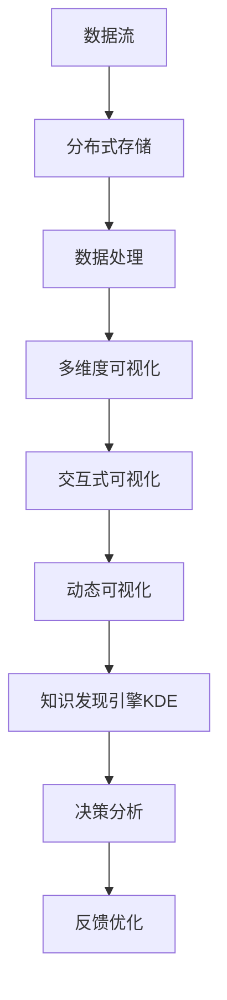

                 

# 知识发现引擎的数据可视化技术

## 1. 背景介绍

### 1.1 问题由来
在数据驱动的时代，知识发现引擎（Knowledge Discovery Engine, KDE）成为了企业决策和分析的重要工具。数据可视化技术作为KDE的核心组件，能够直观展示复杂数据信息，帮助分析师和业务人员快速洞察数据背后的洞察和趋势。然而，随着数据量的爆炸式增长和数据复杂性的不断提升，传统的静态图表和简单的数值展示方式已无法满足现代数据的需求。

### 1.2 问题核心关键点
现代知识发现引擎面临的关键问题包括：
- 数据规模巨大，如何高效存储和处理数据？
- 数据类型多样，如何统一展示和分析？
- 数据维度高，如何可视化多维度的复杂关系？
- 实时性要求高，如何支持即时响应和交互式分析？
- 用户需求多样，如何个性化定制和优化可视化展示？

### 1.3 问题研究意义
高效的数据可视化技术不仅能够提升KDE的功能性和用户体验，还能促进数据驱动决策的科学性和准确性。研究数据可视化技术对于构建先进的数据分析平台、提升企业竞争力、推动数字经济的发展具有重要意义。

## 2. 核心概念与联系

### 2.1 核心概念概述

为更好地理解知识发现引擎的数据可视化技术，本节将介绍几个密切相关的核心概念：

- **知识发现引擎(KDE)**：利用人工智能、数据挖掘和机器学习等技术，从大规模数据中提取有价值的信息和知识，帮助决策者进行智能分析的引擎。
- **数据可视化**：通过图形、图表等形式，将数据转换为易于理解和分析的视觉表示，帮助人们快速洞察数据背后的趋势和规律。
- **动态可视化**：基于实时数据流的动态展示技术，支持用户即时交互和探索分析，提升可视化效果和用户体验。
- **交互式可视化**：结合用户交互操作，支持用户进行数据探索、操作和分析，实现个性化的数据发现和分析。
- **多维度可视化**：支持多维数据的联合展示和分析，展现复杂数据间的关联和关系。
- **分布式可视化**：针对大规模数据的分布式存储和可视化，支持大数据量的高效处理和展示。

这些核心概念之间的逻辑关系可以通过以下Mermaid流程图来展示：



这个流程图展示了一个完整的知识发现引擎数据可视化流程：

1. 数据流进入分布式存储系统，支持大规模数据存储。
2. 数据经过处理后，通过多维度可视化技术展现复杂数据关系。
3. 结合交互式可视化技术，支持用户即时操作和探索。
4. 动态可视化技术进一步提升交互体验和响应速度。
5. 可视化结果最终反馈到知识发现引擎，支持智能分析和决策优化。

## 3. 核心算法原理 & 具体操作步骤
### 3.1 算法原理概述

知识发现引擎的数据可视化技术，本质上是一个数据处理和展示的复杂过程。其核心思想是：利用先进的计算技术和图形表示方法，将复杂数据转换为直观、易懂的视觉形式，并通过用户交互技术实现数据分析和知识发现。

形式化地，假设原始数据为 $D=\{(x_i,y_i)\}_{i=1}^N$，其中 $x_i \in \mathcal{X}$ 为特征向量，$y_i \in \mathcal{Y}$ 为标签。数据可视化的目标是将数据 $D$ 转换为图形表示 $G$，使得用户能够直观地理解数据的内在规律和趋势。

在实践中，通常采用以下步骤：
1. 数据预处理：清洗、筛选、转换原始数据，提取有用的特征。
2. 选择可视化技术：根据数据特性选择合适的图形和展示方法。
3. 数据展示：将处理后的数据转换为图形，通过图表、仪表盘等方式展示。
4. 用户交互：支持用户对可视化结果进行操作和探索，提供个性化的展示。

### 3.2 算法步骤详解

以下是知识发现引擎数据可视化的主要步骤：

**Step 1: 数据预处理**

1. **数据清洗**：去除缺失值、异常值、重复值等不完整数据，保证数据的完整性和准确性。
2. **数据转换**：将原始数据转换为标准化的格式，如日期格式统一、缺失值填充等。
3. **特征提取**：选择和构造有意义的特征，进行归一化、降维等处理。

**Step 2: 选择可视化技术**

1. **图形类型选择**：根据数据特性选择合适的图形类型，如散点图、柱状图、热力图、树图等。
2. **颜色和标记设计**：使用颜色和标记区分不同类别或变量，提升图形的可读性。
3. **交互式元素添加**：支持用户进行放大、缩小、旋转、平移等交互操作，增强图形的互动性。

**Step 3: 数据展示**

1. **图表生成**：使用绘图库如Matplotlib、Seaborn、Plotly等，生成可视化图表。
2. **仪表盘设计**：设计多面板仪表盘，支持多种可视化图表的组合展示。
3. **动态展示**：使用JavaScript、D3.js等技术，实现动态数据的实时展示和更新。

**Step 4: 用户交互**

1. **工具条设计**：设计简单易用的交互工具，如滑块、按钮、菜单等。
2. **数据筛选和过滤**：支持用户根据条件筛选和过滤数据，获取感兴趣的子集。
3. **数据分析和操作**：支持用户进行数据统计、分析、排序等操作，支持可视化结果的导出和分享。

### 3.3 算法优缺点

知识发现引擎的数据可视化技术具有以下优点：
1. 直观易懂：图形展示方式直观、生动，易于用户理解和分析。
2. 交互性强：支持用户实时操作和探索，提升用户参与度和满意度。
3. 自动化高效：自动化处理数据、生成图表，节省人工成本。
4. 支持个性化：根据用户需求提供定制化的展示和分析工具。

同时，该技术也存在一定的局限性：
1. 数据量限制：对于超大规模数据，可视化处理和展示可能遇到性能瓶颈。
2. 交互复杂性：过多的交互功能可能导致系统复杂度增加，影响用户体验。
3. 可解释性不足：复杂图形展示可能难以解释背后的逻辑和机制。
4. 安全性问题：用户操作可能导致数据泄露或不当使用。

尽管存在这些局限性，但就目前而言，数据可视化技术仍然是知识发现引擎不可或缺的核心能力。未来相关研究的方向包括提升可视化性能、增强交互体验、优化可解释性、加强数据安全性等。

### 3.4 算法应用领域

知识发现引擎的数据可视化技术，广泛应用于各类数据分析和决策支持系统，例如：

- 商业智能（BI）：用于支持企业决策的BI系统，需要展示复杂的多维度数据。
- 客户关系管理（CRM）：展示客户数据，分析客户行为和需求。
- 供应链管理：展示供应链数据，优化供应链流程和运营。
- 金融风险管理：展示金融数据，评估风险和制定策略。
- 市场分析：展示市场数据，分析市场趋势和变化。
- 医疗健康：展示医疗数据，支持临床研究和疾病预防。
- 智能城市：展示城市数据，支持城市管理和智能决策。

除了上述这些经典应用外，数据可视化技术还在更多领域得到应用，如工业制造、农业生产、环境监测等，为各行业带来数据驱动的智能化升级。

## 4. 数学模型和公式 & 详细讲解  
### 4.1 数学模型构建

本节将使用数学语言对知识发现引擎的数据可视化技术进行更加严格的刻画。

假设原始数据集为 $D=\{(x_i,y_i)\}_{i=1}^N, x_i \in \mathcal{X}, y_i \in \mathcal{Y}$。其中 $\mathcal{X}$ 为特征空间，$\mathcal{Y}$ 为标签空间。

定义可视化函数 $V: \mathcal{X} \rightarrow \mathcal{G}$，将数据 $x_i$ 转换为图形表示 $G_i \in \mathcal{G}$。其中 $\mathcal{G}$ 为图形空间。

可视化目标为最大化用户满意度 $S(G_i)$，即：

$$
\max_{V} \sum_{i=1}^N S(G_i)
$$

在实践中，通常采用最大化用户感知度的目标函数，通过用户反馈不断优化可视化方法。

### 4.2 公式推导过程

以下我们以散点图为例，推导数据可视化的计算公式。

假设原始数据为 $D=\{(x_i,y_i)\}_{i=1}^N$，其中 $x_i \in \mathbb{R}^d$，$y_i \in \mathbb{R}$。散点图的计算公式为：

$$
G_i = (x_i, y_i)
$$

对于二维数据 $x_i \in \mathbb{R}^2$，散点图的展示方式为：

$$
(x_i, y_i) \rightarrow (x_i, y_i, 0)
$$

对于多维数据 $x_i \in \mathbb{R}^D$，散点图可以通过降维技术转换为二维或三维图形，如PCA降维：

$$
x_i \rightarrow x_i' = \Phi(x_i)
$$

其中 $\Phi$ 为降维映射函数。

在实际应用中，散点图的颜色和标记可以用来区分不同类别或变量。假设数据有 $C$ 个类别，标记颜色为 $c_1, c_2, ..., c_C$，则散点图的展示方式为：

$$
(x_i, y_i) \rightarrow (x_i', y_i', c_k)
$$

其中 $k$ 为类别标签，$k \in \{1, 2, ..., C\}$。

通过上述推导，可以看到散点图的计算公式和展示方式，进一步推导其他图形类型的计算公式和展示方式，即可实现数据可视化的自动化处理。

### 4.3 案例分析与讲解

以下我们以热力图为例，展示如何通过数据可视化技术发现数据背后的趋势和规律。

假设原始数据为 $D=\{(x_i,y_i)\}_{i=1}^N, x_i \in \mathbb{R}^2$，其中 $x_i \in \mathbb{R}$ 表示地理位置，$y_i \in \mathbb{R}$ 表示温度。

热力图的计算公式为：

$$
G_i = (x_i, y_i, y_i)
$$

其中 $y_i$ 表示温度值。

假设数据集为 $D=\{(x_i,y_i)\}_{i=1}^{1000}$，其中 $x_i \in [-200, 200]$，$y_i \in [0, 100]$。热力图的展示方式为：

1. 对数据集 $D$ 进行PCA降维，获得降维后的特征 $x_i' = \Phi(x_i)$，其中 $x_i' \in [-2, 2]$。
2. 将降维后的特征 $x_i'$ 作为横轴，原始温度 $y_i$ 作为纵轴和颜色，生成热力图。

假设生成热力图后，发现温度值在 $x_i' \in [-1, 1]$ 和 $x_i' \in [1, 2]$ 两个区间内存在明显的温度波动。进一步分析发现，这些温度波动与地理位置相关，可能是由于地理位置变化导致的气候变化。

通过热力图，我们能够直观地发现数据背后的趋势和规律，为进一步的深入分析和决策提供有力支持。

## 5. 项目实践：代码实例和详细解释说明
### 5.1 开发环境搭建

在进行数据可视化实践前，我们需要准备好开发环境。以下是使用Python进行开发的环境配置流程：

1. 安装Anaconda：从官网下载并安装Anaconda，用于创建独立的Python环境。

2. 创建并激活虚拟环境：
```bash
conda create -n python-env python=3.8 
conda activate python-env
```

3. 安装必要的工具包：
```bash
pip install numpy pandas matplotlib scikit-learn seaborn jupyter notebook ipython
```

完成上述步骤后，即可在`python-env`环境中开始数据可视化实践。

### 5.2 源代码详细实现

下面我们以热力图为例，给出使用Matplotlib库生成热力图的PyTorch代码实现。

首先，准备数据集：

```python
import numpy as np
import matplotlib.pyplot as plt

# 生成样本数据
np.random.seed(123)
N = 1000
x = np.random.normal(0, 1, N)
y = np.sin(2 * np.pi * x) + np.random.normal(0, 0.2, N)
```

接着，使用PCA降维生成降维后的特征 $x_i'$：

```python
from sklearn.decomposition import PCA

pca = PCA(n_components=1)
x_pca = pca.fit_transform(x.reshape(-1, 1))
```

然后，生成热力图：

```python
plt.figure(figsize=(8, 6))
plt.pcolormesh(x_pca, y, y.reshape(-1, 1), cmap='RdBu', shading='flat')
plt.colorbar()
plt.title('Temperature Heatmap')
plt.xlabel('PCA Dimension')
plt.ylabel('Temperature')
plt.show()
```

最后，输出热力图：

```python
plt.savefig('temperature_heatmap.png')
```

以上就是使用Matplotlib库生成热力图的完整代码实现。可以看到，通过Python代码，我们能够实现数据的降维处理和热力图的生成，展示了数据背后的趋势和规律。

### 5.3 代码解读与分析

让我们再详细解读一下关键代码的实现细节：

**数据准备**：
- 使用NumPy生成随机数据集，模拟地理位置和温度的关系。
- 通过PCA降维技术，将二维数据转换为降维后的特征 $x_i'$。

**热力图生成**：
- 使用Matplotlib库中的 `pcolormesh` 函数，生成热力图。
- `x_pca` 为降维后的特征，`y` 为原始温度值，`cmap='RdBu'` 设置颜色映射，`shading='flat'` 设置颜色平坦显示。
- `colorbar()` 添加颜色条，`title`、`xlabel`、`ylabel` 设置图形标题和坐标轴标签。
- `plt.show()` 显示图形。
- `plt.savefig()` 保存图形。

可以看到，Matplotlib库提供了丰富的绘图功能，能够满足各种图形的展示需求。在实际应用中，开发者可以根据具体任务选择合适的图形类型和展示方式，实现个性化的数据可视化。

## 6. 实际应用场景
### 6.1 智能商业分析

在商业智能（BI）领域，数据可视化技术通过展示复杂的多维度数据，帮助企业决策者快速洞察市场趋势、客户行为和运营效率。例如，电商企业可以通过展示销售数据、客户数据和物流数据，发现运营中的瓶颈和机会，优化供应链和运营策略。

具体而言，数据可视化技术可以帮助企业进行以下分析：
- 销售趋势分析：展示不同时间段和区域的销售数据，发现销售高峰和低谷。
- 客户行为分析：展示不同渠道和客户的购买行为，发现客户偏好和消费习惯。
- 运营效率分析：展示不同产品和物流环节的成本和效率，优化供应链和物流管理。

通过数据可视化技术，企业能够快速获取有价值的洞察和决策依据，提升业务效率和市场竞争力。

### 6.2 医疗健康监测

在医疗健康领域，数据可视化技术通过展示患者数据和医疗资源，帮助医生进行疾病诊断和健康管理。例如，医院可以通过展示患者病历、检查结果和治疗记录，发现疾病的规律和趋势，制定个性化的治疗方案。

具体而言，数据可视化技术可以帮助医院进行以下分析：
- 疾病趋势分析：展示不同时间段和地区的疾病发病率，发现疾病流行趋势。
- 患者健康监测：展示患者病历、检查结果和治疗记录，发现患者的健康变化和风险。
- 治疗效果分析：展示不同治疗方案和药物的效果，发现最佳治疗方案。

通过数据可视化技术，医院能够快速获取患者的健康信息，制定个性化的治疗方案，提升医疗服务质量和患者满意度。

### 6.3 智能城市治理

在智能城市治理领域，数据可视化技术通过展示城市数据和运营状况，帮助政府进行城市管理和决策。例如，城市可以通过展示交通流量、环境污染和公共设施使用情况，优化城市管理和服务。

具体而言，数据可视化技术可以帮助城市进行以下分析：
- 交通流量分析：展示不同时间段和地区的交通流量，发现交通拥堵点和优化路线。
- 环境污染分析：展示不同区域和时间的空气质量、水质等环境指标，发现污染源和优化措施。
- 公共设施使用情况：展示不同区域和时间的公共设施使用情况，优化公共服务配置。

通过数据可视化技术，城市能够快速获取城市运营信息，制定有效的城市管理和优化措施，提升城市治理水平和居民生活质量。

### 6.4 未来应用展望

随着数据量的不断增长和数据复杂性的提升，数据可视化技术将继续发展和进步，带来更多的应用前景和挑战。未来，数据可视化技术将呈现以下几个发展趋势：

1. 智能数据探索：利用人工智能技术，自动发现数据中的关联和趋势，提升数据探索的效率和深度。
2. 实时数据可视化：支持实时数据流，实现即时响应的可视化展示，增强用户体验。
3. 交互式可视化：结合自然语言处理技术，支持用户通过自然语言进行数据探索和分析。
4. 多维数据分析：支持多维度数据的高效展示和分析，展现复杂数据间的关联和关系。
5. 数据安全保护：结合加密和安全技术，保护数据隐私和安全性，防止数据泄露和滥用。
6. 数据可视化仪表盘：设计美观、易用的仪表盘，支持多种可视化图表的组合展示，提升用户满意度。

这些趋势展示了数据可视化技术的广阔前景，将进一步提升知识发现引擎的功能性和用户体验，推动数据驱动决策的科学化和智能化。

## 7. 工具和资源推荐
### 7.1 学习资源推荐

为了帮助开发者系统掌握数据可视化技术的理论基础和实践技巧，这里推荐一些优质的学习资源：

1. 《Python数据可视化实战》书籍：系统介绍了Matplotlib、Seaborn、Plotly等绘图库的使用，适合初学者和进阶学习。
2. 《数据可视化之美》在线课程：介绍数据可视化的基本概念和常用技术，适合入门学习。
3. 《TensorBoard实战》书籍：介绍TensorBoard的使用，适合深度学习模型的可视化展示。
4. 《Data Visualization with Python》课程：介绍Python中常用的数据可视化工具和库，适合进阶学习。
5. D3.js官方文档：详细介绍D3.js的使用和配置，适合高阶学习。

通过对这些资源的学习实践，相信你一定能够快速掌握数据可视化技术的精髓，并用于解决实际的数据分析和决策支持问题。

### 7.2 开发工具推荐

高效的开发离不开优秀的工具支持。以下是几款用于数据可视化开发的常用工具：

1. Matplotlib：Python中最流行的绘图库，支持多种图形类型和展示方式。
2. Seaborn：基于Matplotlib的高级绘图库，提供美观的默认风格和复杂的统计绘图。
3. Plotly：支持交互式可视化的绘图库，支持动态和分布式计算。
4. D3.js：基于JavaScript的交互式可视化库，支持复杂图形和动画效果。
5. Tableau：商业智能领域常用的数据可视化工具，支持多种数据源和展示方式。
6. Power BI：微软推出的商业智能平台，支持丰富的数据可视化功能和报表展示。
7. Grafana：开源的监控和数据可视化工具，支持多种数据源和图表类型。

合理利用这些工具，可以显著提升数据可视化任务的开发效率，加快创新迭代的步伐。

### 7.3 相关论文推荐

数据可视化技术的发展源于学界的持续研究。以下是几篇奠基性的相关论文，推荐阅读：

1. "A Survey of Visualization Techniques for Scientific Data"：综述了数据可视化的基本概念和常用技术，适合初学者和进阶学习。
2. "D3.js: A JavaScript Graphics Library"：详细介绍D3.js的使用和配置，适合高阶学习。
3. "Data Visualization as a Bridge Between People and Big Data"：探讨了数据可视化在数据科学和人类交流中的重要作用。
4. "Interactive Visualization Techniques for Exploring Scientific Data"：介绍了交互式可视化技术在数据探索中的应用。
5. "Beyond Big Data: Data Visualization in the Age of Exascale"：探讨了在超大规模数据场景下，数据可视化的技术和挑战。

这些论文代表了大数据可视化技术的发展脉络。通过学习这些前沿成果，可以帮助研究者把握学科前进方向，激发更多的创新灵感。

## 8. 总结：未来发展趋势与挑战

### 8.1 总结

本文对知识发现引擎的数据可视化技术进行了全面系统的介绍。首先阐述了数据可视化的背景和重要性，明确了数据可视化在知识发现引擎中的核心地位。其次，从原理到实践，详细讲解了数据可视化的数学模型和关键步骤，给出了数据可视化任务开发的完整代码实例。同时，本文还广泛探讨了数据可视化技术在商业智能、医疗健康、智能城市等多个领域的应用前景，展示了数据可视化技术的强大潜力。

通过本文的系统梳理，可以看到，数据可视化技术在知识发现引擎中扮演着不可或缺的角色，极大地提升了数据分析和决策的科学性和高效性。未来，伴随数据量的不断增长和数据复杂性的提升，数据可视化技术还将继续发展和进步，为数据驱动决策带来更强的动力和支持。

### 8.2 未来发展趋势

展望未来，数据可视化技术将呈现以下几个发展趋势：

1. 数据量的不断增长：随着数据采集技术的不断进步，数据量将呈指数级增长，数据可视化技术需要支持超大规模数据的高效处理和展示。
2. 数据类型的不断丰富：随着数据采集和生成的多样化，数据类型将更加复杂，数据可视化技术需要支持多模态数据的联合展示和分析。
3. 交互性的不断增强：随着用户对数据探索和操作的需求不断提升，数据可视化技术需要支持更多的交互式功能和操作。
4. 自动化的不断提升：随着人工智能技术的发展，数据可视化技术需要支持自动化的数据探索和发现，提升数据分析的效率和深度。
5. 安全性的不断加强：随着数据隐私和安全的日益重要，数据可视化技术需要支持数据加密和安全传输，保护数据隐私和安全性。

这些趋势展示了数据可视化技术的广阔前景，将进一步提升知识发现引擎的功能性和用户体验，推动数据驱动决策的科学化和智能化。

### 8.3 面临的挑战

尽管数据可视化技术已经取得了显著进展，但在迈向更加智能化、普适化应用的过程中，它仍面临诸多挑战：

1. 数据量瓶颈：对于超大规模数据，可视化处理和展示可能遇到性能瓶颈。如何优化数据处理和展示算法，提升系统性能，是亟待解决的问题。
2. 交互复杂性：过多的交互功能可能导致系统复杂度增加，影响用户体验。如何在提升交互性的同时，保持系统简洁和易用，是重要的挑战。
3. 可解释性不足：复杂图形展示可能难以解释背后的逻辑和机制，如何增强数据可视化的可解释性，是亟待解决的问题。
4. 安全性问题：用户操作可能导致数据泄露或不当使用，如何保障数据安全性和隐私，是重要的挑战。
5. 跨领域应用：不同领域的数据和任务具有不同的特点和需求，如何设计通用的数据可视化框架和方法，适应跨领域应用，是重要的挑战。

尽管存在这些挑战，但数据可视化技术在未来仍具有巨大的发展潜力和应用前景。研究者需要不断探索和创新，优化数据处理和展示算法，提升系统的性能和用户体验，同时也需要关注数据安全性和隐私保护，确保数据的合理使用。

### 8.4 研究展望

面对数据可视化面临的挑战，未来的研究需要在以下几个方面寻求新的突破：

1. 智能数据探索：结合人工智能技术，自动发现数据中的关联和趋势，提升数据探索的效率和深度。
2. 实时数据可视化：支持实时数据流，实现即时响应的可视化展示，增强用户体验。
3. 交互式可视化：结合自然语言处理技术，支持用户通过自然语言进行数据探索和分析。
4. 多维数据分析：支持多维度数据的高效展示和分析，展现复杂数据间的关联和关系。
5. 数据安全保护：结合加密和安全技术，保护数据隐私和安全性，防止数据泄露和滥用。
6. 数据可视化仪表盘：设计美观、易用的仪表盘，支持多种可视化图表的组合展示，提升用户满意度。

这些研究方向的探索，必将引领数据可视化技术的进一步发展和优化，为数据驱动决策带来更强的动力和支持。

## 9. 附录：常见问题与解答

**Q1：数据可视化技术如何应对大规模数据的挑战？**

A: 对于大规模数据的挑战，数据可视化技术通常采用以下策略：
1. 分布式存储和计算：使用分布式数据库和计算框架，如Hadoop、Spark等，支持大规模数据的存储和处理。
2. 数据降维和压缩：通过PCA、LDA等降维技术，减少数据维度，降低计算复杂度。使用压缩算法，如LZ77、LZ78等，减少数据存储空间。
3. 交互式可视化：支持用户通过交互式操作进行数据探索和分析，减少数据传输和计算量。
4. 动态展示：使用动态图形和可视化技术，减少图形生成和展示的时间。

通过这些策略，数据可视化技术可以高效处理大规模数据，提升系统的性能和用户体验。

**Q2：如何提高数据可视化的可解释性？**

A: 提高数据可视化的可解释性，可以通过以下方法：
1. 简化图形复杂度：通过去除冗余图形和标记，降低图形的复杂度，提升图形的可读性和可理解性。
2. 使用标准符号：使用标准的符号和标记，提升图形的规范性和一致性。
3. 提供详细说明：在图形旁边添加详细说明和注释，解释图形中的关键数据和特征。
4. 结合自然语言处理：使用自然语言处理技术，自动生成图形说明和注释，提升图形的可解释性。
5. 使用交互式工具：使用交互式工具，支持用户通过自然语言和操作进行数据探索和分析，提升图形的可解释性。

通过这些方法，可以提高数据可视化的可解释性，帮助用户更好地理解数据背后的规律和趋势。

**Q3：数据可视化技术如何支持多模态数据的联合展示和分析？**

A: 支持多模态数据的联合展示和分析，可以通过以下方法：
1. 统一数据格式：将不同模态的数据转换为统一的格式，支持多种数据源和格式。
2. 多维度展示：将不同模态的数据展示在同一个图形中，支持多维度数据的联合展示和分析。
3. 数据融合技术：使用数据融合技术，将不同模态的数据进行联合处理和展示。
4. 交互式探索：支持用户通过交互式操作进行多模态数据的联合探索和分析。

通过这些方法，数据可视化技术可以支持多模态数据的联合展示和分析，展现复杂数据间的关联和关系，提升数据驱动决策的科学性和全面性。

---

作者：禅与计算机程序设计艺术 / Zen and the Art of Computer Programming

