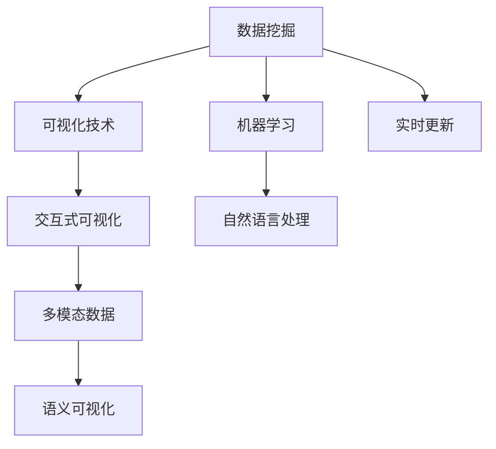

                 

# 知识发现引擎的数据可视化技术与实现

## 1. 背景介绍

### 1.1 问题由来
在数据时代，数据可视化的重要性日益凸显。人们不仅需要从海量数据中提取有用的信息，还需要对数据进行直观、清晰地展示。然而，数据的复杂性使得传统的图表、表格等形式难以全面表达数据的内在规律和特征。

为了解决这一问题，知识发现引擎(Knowledge Discovery Engine, KDE)应运而生。它通过整合数据挖掘、机器学习、自然语言处理等技术，将数据转化为易于理解的视觉化信息，帮助用户发现数据中的知识。

### 1.2 问题核心关键点
KDE的核心目标是将数据转化为易于理解的视觉化信息，其关键点包括：

- **数据挖掘**：通过算法自动挖掘数据中的模式、规律和趋势。
- **可视化技术**：利用图表、地图、网络图等形式展示数据特征。
- **用户交互**：通过交互工具使用户能主动探索和分析数据。
- **多模态数据融合**：将文本、图像、视频等多类型数据进行有效整合，提升分析效果。
- **实时更新**：实现数据的动态更新和可视化，保持信息的时效性。

## 2. 核心概念与联系

### 2.1 核心概念概述

在深入研究KDE之前，我们先要理解一些核心概念：

- **数据挖掘**：通过算法自动从数据中提取有用的信息。
- **可视化技术**：将数据转化为视觉信息，便于理解和分析。
- **交互式可视化**：通过用户交互提升可视化效果，如缩放、旋转、标注等操作。
- **多模态数据**：包含文本、图像、音频、视频等多种数据类型。
- **语义可视化**：展示数据中更深的语义信息，如情感、主题等。

这些概念之间存在着密切的联系。数据挖掘是KDE的基础，通过算法提取数据中的模式和规律；可视化技术是将这些规律转化为视觉信息的桥梁；交互式可视化增强了用户的理解能力；多模态数据使得KDE可以处理更复杂的数据类型；语义可视化则使KDE能展示更深层次的信息。

### 2.2 核心概念原理和架构的 Mermaid 流程图



## 3. 核心算法原理 & 具体操作步骤
### 3.1 算法原理概述

KDE的核心算法流程包括数据预处理、特征提取、模式挖掘和可视化展示等步骤。

1. **数据预处理**：清洗、归一化、分词、去停用词等操作，准备数据输入。
2. **特征提取**：提取文本、图像等数据的特征向量，方便算法处理。
3. **模式挖掘**：使用数据挖掘算法如关联规则、聚类、分类等，发现数据中的模式和规律。
4. **可视化展示**：将挖掘出的模式和规律转化为图表、地图等形式展示。

### 3.2 算法步骤详解

以文本数据为例，展示KDE的详细操作步骤：

**Step 1: 数据预处理**

- 清洗数据：去除噪声、缺失值，处理不一致的数据格式。
- 归一化：将数据缩放到[0,1]或[-1,1]范围内。
- 分词：将文本数据切分为单个词语。
- 去停用词：去除常见但不包含有用信息的停用词。

**Step 2: 特征提取**

- 文本特征提取：利用TF-IDF、Word2Vec、BERT等技术，将文本转化为特征向量。
- 图像特征提取：使用CNN等模型，提取图像的特征向量。

**Step 3: 模式挖掘**

- 关联规则挖掘：使用Apriori等算法，发现文本数据中的关联规则。
- 聚类分析：使用K-Means、DBSCAN等算法，将文本数据聚类成若干群组。
- 情感分析：使用情感词典、深度学习模型，判断文本情感倾向。

**Step 4: 可视化展示**

- 词云图：展示文本中高频词汇的分布情况。
- 热力图：展示文本中关键词的分布热点。
- 网络图：展示文本中实体和关系的关联网络。
- 词向量空间：通过词向量展示词语的语义关系。

### 3.3 算法优缺点

**优点**：

- 能处理多模态数据，提升分析效果。
- 支持实时更新，保持信息的时效性。
- 通过交互式可视化增强用户的理解能力。
- 能展示语义信息，挖掘更深层次的知识。

**缺点**：

- 对数据预处理的要求较高，需进行大量的清洗和归一化。
- 算法复杂度高，对计算资源要求较高。
- 对数据的深度挖掘可能需要专业知识和技能。
- 可视化效果的提升需要不断迭代和优化。

### 3.4 算法应用领域

KDE在多个领域得到广泛应用，包括：

- **商业智能**：展示销售数据、用户行为等，帮助企业决策。
- **金融分析**：展示股票市场、交易记录等，分析市场趋势。
- **医疗健康**：展示病患数据、诊疗记录等，辅助医生诊断。
- **安全监控**：展示网络流量、日志数据等，识别异常行为。
- **科学研究**：展示实验数据、文献引用等，发现科学规律。

## 4. 数学模型和公式 & 详细讲解 & 举例说明

### 4.1 数学模型构建

KDE的数学模型主要由以下几个部分组成：

- **数据预处理**：$X$ 表示原始数据，经过清洗和归一化后变为 $X'$。
- **特征提取**：$F$ 为特征提取函数，将 $X'$ 映射为特征向量 $X_F$。
- **模式挖掘**：$M$ 为模式挖掘算法，将 $X_F$ 转化为模式表示 $M_X$。
- **可视化展示**：$V$ 为可视化算法，将 $M_X$ 转化为可视化信息 $V_X$。

### 4.2 公式推导过程

以文本情感分析为例，推导情感分类器的数学模型：

设文本 $X$ 为：

$$
X = (w_1, w_2, ..., w_n)
$$

其中 $w_i$ 表示第 $i$ 个词语，经过分词和去停用词后，提取词向量特征 $X_F$：

$$
X_F = (v_1, v_2, ..., v_n)
$$

其中 $v_i$ 表示 $w_i$ 的词向量。假设 $X_F$ 经过模式挖掘后得到模式表示 $M_X$：

$$
M_X = (m_1, m_2, ..., m_n)
$$

其中 $m_i$ 表示 $v_i$ 的情感倾向。最后，使用 $V$ 进行可视化展示，得到可视化信息 $V_X$：

$$
V_X = \text{Vis}(M_X)
$$

### 4.3 案例分析与讲解

**案例一：电商销售数据分析**

电商公司希望通过KDE展示其销售数据，以了解产品趋势和用户行为。

1. **数据预处理**：
   - 清洗数据，去除缺失值和异常值。
   - 归一化数据，将销售额缩放到[0,1]范围内。
   - 分词处理，将订单信息分解为词语。
   - 去停用词，去除常见但不包含有用信息的词语。

2. **特征提取**：
   - 提取词向量特征，使用Word2Vec模型。
   - 提取数值特征，如订单数量、销售额等。

3. **模式挖掘**：
   - 使用聚类算法，将订单数据聚类成若干群组。
   - 使用关联规则挖掘，发现不同产品的销售关联。

4. **可视化展示**：
   - 使用热力图展示订单趋势。
   - 使用词云图展示高频关键词。
   - 使用网络图展示产品关联关系。

**案例二：金融市场数据可视化**

金融公司需要实时展示市场数据，帮助投资分析师进行决策。

1. **数据预处理**：
   - 清洗数据，去除噪声和异常值。
   - 归一化数据，将股票价格缩放到[0,1]范围内。
   - 分词处理，将交易记录分解为词语。
   - 去停用词，去除常见但不包含有用信息的词语。

2. **特征提取**：
   - 提取词向量特征，使用Word2Vec模型。
   - 提取数值特征，如股价、交易量等。

3. **模式挖掘**：
   - 使用聚类算法，将交易数据聚类成若干群组。
   - 使用关联规则挖掘，发现交易行为的模式。

4. **可视化展示**：
   - 使用热力图展示市场趋势。
   - 使用词云图展示高频关键词。
   - 使用网络图展示交易关系。

## 5. 项目实践：代码实例和详细解释说明
### 5.1 开发环境搭建

在进行KDE实践前，我们需要准备好开发环境。以下是使用Python进行KDE开发的环境配置流程：

1. 安装Anaconda：从官网下载并安装Anaconda，用于创建独立的Python环境。

2. 创建并激活虚拟环境：
```bash
conda create -n kde-env python=3.8 
conda activate kde-env
```

3. 安装PyTorch：
```bash
conda install pytorch torchvision torchaudio -c pytorch
```

4. 安装Numpy、Pandas、Matplotlib等库：
```bash
pip install numpy pandas matplotlib seaborn jupyter notebook ipython
```

完成上述步骤后，即可在`kde-env`环境中开始KDE实践。

### 5.2 源代码详细实现

下面我们以电商销售数据分析为例，给出使用PyTorch和Python实现KDE的完整代码实现。

**Step 1: 数据预处理**

```python
import pandas as pd
from sklearn.feature_extraction.text import CountVectorizer
from sklearn.preprocessing import MinMaxScaler

# 加载销售数据
df = pd.read_csv('sales_data.csv')

# 清洗数据，去除缺失值和异常值
df = df.dropna()
df = df[df['销售额'] > 0]

# 归一化数据
scaler = MinMaxScaler(feature_range=(0, 1))
df['sales'] = scaler.fit_transform(df['sales'].values.reshape(-1, 1))

# 分词处理
df['keywords'] = df['商品描述'].apply(lambda x: x.split(' '))
```

**Step 2: 特征提取**

```python
from sklearn.feature_extraction.text import TfidfVectorizer
from gensim.models import Word2Vec

# 提取词向量特征
vectorizer = TfidfVectorizer(stop_words='english')
X_F = vectorizer.fit_transform(df['keywords'].tolist())

# 提取数值特征
X_F = pd.DataFrame(X_F.toarray(), columns=['tfidf'] + ['w2v'] + [f'w2v_{i}' for i in range(len(df['销售额']))])
X_F['销售额'] = df['sales']

# 训练Word2Vec模型
w2v = Word2Vec(df['商品描述'], size=100, window=5, min_count=1)
X_F['w2v'] = w2v.wv[vectorizer.vocabulary_.keys()]
X_F['w2v'] = X_F['w2v'].apply(lambda x: x.tolist() if x else [0]*100)
```

**Step 3: 模式挖掘**

```python
from sklearn.cluster import KMeans
from mlxtend.frequent_patterns import apriori

# 使用聚类算法，将订单数据聚类成若干群组
X_F['聚类标签'] = KMeans(n_clusters=5).fit_predict(X_F)

# 使用关联规则挖掘，发现不同产品的销售关联
patterns = apriori(X_F, min_support=0.1, use_colnames=True)
```

**Step 4: 可视化展示**

```python
import seaborn as sns
import matplotlib.pyplot as plt
import networkx as nx

# 使用热力图展示订单趋势
sns.heatmap(df.groupby('聚类标签')['sales'].mean(), annot=True, fmt='d')
plt.show()

# 使用词云图展示高频关键词
from wordcloud import WordCloud
wordcloud = WordCloud().generate(' '.join(df['商品描述']))
plt.imshow(wordcloud, interpolation='bilinear')
plt.axis('off')
plt.show()

# 使用网络图展示产品关联关系
G = nx.Graph()
for item in patterns:
    G.add_edges_from(list(zip(item[:-1], item[1:])))
nx.draw(G, with_labels=True)
plt.show()
```

以上就是使用PyTorch和Python进行电商销售数据分析的完整代码实现。可以看到，在KDE的实践中，我们通过数据预处理、特征提取、模式挖掘和可视化展示等多个步骤，实现了对销售数据的全面分析和展示。

### 5.3 代码解读与分析

让我们再详细解读一下关键代码的实现细节：

**数据预处理**：
- 使用Pandas加载原始数据。
- 使用sklearn的CountVectorizer进行分词处理。
- 使用MinMaxScaler对数值数据进行归一化。

**特征提取**：
- 使用TfidfVectorizer提取词向量特征。
- 使用gensim的Word2Vec模型提取词向量特征。
- 将词向量特征和数值特征合并为一个DataFrame。

**模式挖掘**：
- 使用sklearn的KMeans算法进行聚类。
- 使用mlxtend的apriori算法进行关联规则挖掘。

**可视化展示**：
- 使用seaborn和matplotlib展示热力图和词云图。
- 使用networkx和matplotlib展示网络图。

## 6. 实际应用场景

### 6.1 电商销售数据分析

电商公司通过KDE展示其销售数据，帮助决策者理解产品趋势和用户行为。

**应用案例**：
- **订单趋势**：通过热力图展示不同时间段内订单的销售趋势。
- **高频关键词**：通过词云图展示高频关键词，帮助识别流行产品。
- **产品关联**：通过网络图展示产品间的关联关系，发现销售关联性。

**业务价值**：
- 帮助公司更好地理解用户需求，优化商品结构。
- 通过分析销售趋势，预测市场变化，优化库存管理。
- 通过产品关联分析，发现交叉销售机会，提升销售转化率。

### 6.2 金融市场数据可视化

金融公司需要实时展示市场数据，帮助投资分析师进行决策。

**应用案例**：
- **市场趋势**：通过热力图展示不同股票的价格趋势。
- **高频关键词**：通过词云图展示高频关键词，帮助识别市场热点。
- **交易关系**：通过网络图展示交易关系，发现异常交易行为。

**业务价值**：
- 帮助分析师及时掌握市场动态，做出投资决策。
- 通过分析市场趋势，预测未来走势，降低投资风险。
- 通过交易关系分析，发现潜在的操纵行为，保护投资者利益。

## 7. 工具和资源推荐

### 7.1 学习资源推荐

为了帮助开发者系统掌握KDE的理论基础和实践技巧，这里推荐一些优质的学习资源：

1. 《Python数据科学手册》：一本全面介绍Python数据科学的书籍，涵盖数据预处理、特征提取、模式挖掘和可视化等各个环节。
2. 《Kaggle机器学习竞赛指南》：通过Kaggle平台上的竞赛案例，学习如何在实际应用中使用数据挖掘和机器学习技术。
3. 《数据可视化实战》：一本实战性的数据可视化书籍，涵盖多种可视化技术和工具的使用。
4. 《Python可视化之美》：一本介绍Python可视化库的书籍，涵盖matplotlib、seaborn、networkx等工具的使用。
5. 《Python机器学习》：一本系统介绍机器学习算法的书籍，涵盖数据预处理、特征提取、模式挖掘和评估等环节。

通过对这些资源的学习实践，相信你一定能够快速掌握KDE的精髓，并用于解决实际的NLP问题。

### 7.2 开发工具推荐

高效的开发离不开优秀的工具支持。以下是几款用于KDE开发的常用工具：

1. Python：基于Python的开源数据科学和机器学习框架，灵活动态的计算图，适合快速迭代研究。
2. Pandas：Python的强大数据处理库，支持高效的数据清洗和转换。
3. NumPy：Python的科学计算库，支持高效的数值计算。
4. Matplotlib：Python的绘图库，支持绘制各种类型的图表。
5. Seaborn：基于Matplotlib的高级绘图库，支持更美观、更丰富的可视化效果。
6. NetworkX：Python的网络图库，支持绘制和分析复杂的网络图。

合理利用这些工具，可以显著提升KDE开发的效率，加快创新迭代的步伐。

### 7.3 相关论文推荐

KDE的发展源于学界的持续研究。以下是几篇奠基性的相关论文，推荐阅读：

1. "Knowledge Discovery in Databases: An Introduction"：介绍数据挖掘的基础概念和技术。
2. "On Visualization of Associations in Large Databases and Data Mining"：探讨如何通过可视化技术展示数据挖掘结果。
3. "Machine Learning: A Probabilistic Perspective"：介绍机器学习的基本算法和模型。
4. "Visualization of Data Using Information Theory"：探讨信息论在数据可视化中的应用。
5. "Interactive Data Visualization with Data Wrangler"：介绍如何使用Python进行交互式数据可视化。

这些论文代表了大数据挖掘和KDE的发展脉络。通过学习这些前沿成果，可以帮助研究者把握学科前进方向，激发更多的创新灵感。

## 8. 总结：未来发展趋势与挑战

### 8.1 总结

本文对KDE的数据可视化技术与实现进行了全面系统的介绍。首先阐述了KDE的核心目标和方法，明确了数据挖掘、可视化技术、交互式可视化等核心概念之间的联系。其次，从原理到实践，详细讲解了KDE的数学模型和算法步骤，给出了KDE任务开发的完整代码实例。同时，本文还广泛探讨了KDE在电商、金融、医疗等多个领域的应用前景，展示了KDE范式的巨大潜力。此外，本文精选了KDE技术的各类学习资源，力求为读者提供全方位的技术指引。

通过本文的系统梳理，可以看到，KDE在大数据时代具有重要的应用价值。它通过数据挖掘和可视化技术，将复杂的数据转化为易于理解的视觉信息，帮助用户发现数据中的知识。未来，随着大数据和人工智能技术的发展，KDE的应用将更加广泛，成为数据分析和决策支持的重要工具。

### 8.2 未来发展趋势

展望未来，KDE的发展趋势将呈现以下几个方向：

1. **多模态数据融合**：KDE将支持处理多类型数据，如图像、音频、视频等，提升综合分析能力。
2. **实时数据处理**：KDE将支持实时数据流处理，实现数据可视化的动态更新，保持信息的时效性。
3. **深度学习技术应用**：KDE将结合深度学习技术，提升模式挖掘和可视化的效果。
4. **交互式可视化**：KDE将支持更多交互式可视化技术，如动态缩放、旋转、拖动等，增强用户体验。
5. **大数据处理技术**：KDE将结合大数据处理技术，提升处理海量数据的能力。
6. **人工智能技术融合**：KDE将结合人工智能技术，如自然语言处理、语音识别等，实现更全面的数据理解和分析。

以上趋势凸显了KDE技术的广阔前景。这些方向的探索发展，必将进一步提升KDE系统的性能和应用范围，为大数据分析和决策支持提供更强大的支持。

### 8.3 面临的挑战

尽管KDE技术已经取得了显著成果，但在迈向更加智能化、普适化应用的过程中，仍面临诸多挑战：

1. **数据预处理复杂性**：数据预处理是KDE的基础，但处理复杂数据需要大量的时间和精力。
2. **算法复杂度高**：KDE的算法复杂度高，对计算资源要求较高。
3. **数据质量依赖性**：KDE的效果很大程度上依赖于数据的质量和数量，难以在数据质量差的情况下保证效果。
4. **可视化效果提升**：需要不断迭代和优化可视化技术，以提升用户体验。
5. **交互式可视化的实现**：需要开发更多的交互式可视化工具，提高用户的使用便捷性。
6. **多模态数据融合的挑战**：多模态数据融合需要解决数据格式、特征提取等方面的问题。

这些挑战需要我们持续关注和解决，才能使KDE技术在实际应用中发挥更大的价值。

### 8.4 研究展望

面对KDE面临的种种挑战，未来的研究需要在以下几个方面寻求新的突破：

1. **自动化数据预处理**：开发自动化的数据清洗和归一化工具，提高数据预处理的效率。
2. **高效算法设计**：设计更高效的算法，降低计算资源的消耗，提升算法的可扩展性。
3. **多模态数据融合**：研究多模态数据的特征提取和融合方法，提升综合分析能力。
4. **实时可视化技术**：研究实时数据流的可视化技术，实现数据的动态更新和展示。
5. **交互式可视化工具**：开发更多交互式可视化工具，提升用户体验。
6. **人工智能技术融合**：结合人工智能技术，提升KDE系统的智能水平。

这些研究方向的探索，必将引领KDE技术迈向更高的台阶，为大数据分析和决策支持提供更全面的支持。

## 9. 附录：常见问题与解答

**Q1: KDE的核心目标是什么？**

A: KDE的核心目标是将复杂的数据转化为易于理解的视觉信息，帮助用户发现数据中的知识。具体包括数据挖掘、模式挖掘、可视化展示等环节。

**Q2: KDE常用的数据挖掘算法有哪些？**

A: KDE常用的数据挖掘算法包括聚类、关联规则挖掘、分类等。其中聚类算法如K-Means、DBSCAN等；关联规则挖掘算法如Apriori等；分类算法如朴素贝叶斯、决策树等。

**Q3: KDE如何处理多模态数据？**

A: KDE可以处理多模态数据，如图像、音频、视频等。通过特征提取技术，将不同类型的数据转化为统一的特征表示，然后进行模式挖掘和可视化展示。

**Q4: KDE的算法复杂度如何？**

A: KDE的算法复杂度较高，需要大量的计算资源和时间。但随着算法的优化和硬件的提升，KDE的效率也在不断提高。

**Q5: KDE有哪些应用场景？**

A: KDE广泛应用于电商、金融、医疗、安全监控等多个领域。例如电商销售数据分析、金融市场数据可视化、医疗健康数据分析、安全监控异常行为识别等。

总之，KDE作为数据可视化的重要技术，通过数据挖掘和模式挖掘，将复杂的数据转化为易于理解的视觉信息，帮助用户发现数据中的知识。随着技术的不断进步，KDE将在更多领域得到应用，成为数据分析和决策支持的重要工具。

---

作者：禅与计算机程序设计艺术 / Zen and the Art of Computer Programming

