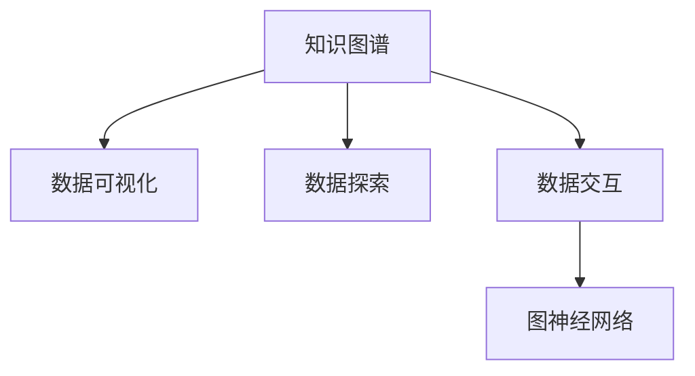

                 

# 知识发现引擎的知识图谱可视化

> 关键词：知识图谱, 数据可视化, 数据探索, 数据交互, 图神经网络

## 1. 背景介绍

### 1.1 问题由来

随着人工智能技术的快速发展，知识图谱(Knowledge Graph)在知识发现和智能决策中发挥着越来越重要的作用。知识图谱是一种语义化的数据结构，用于描述实体、属性、关系等知识元素之间的复杂关系。它能够有效整合和融合异构数据，支持复杂的查询和推理，在搜索引擎、推荐系统、自然语言处理等领域中有着广泛的应用。

然而，知识图谱通常由大量节点和边构成，结构复杂，难以直观理解和探索。这使得知识图谱在实际应用中往往成为瓶颈，限制了其在更大规模和更深入场景中的应用。

为解决这个问题，学术界和工业界纷纷研究起如何更好地可视化和交互知识图谱。知识图谱可视化作为一种有效的知识探索手段，能够将复杂的关系网络转化为易于理解和操作的图形界面，从而帮助用户更好地理解和利用知识图谱。

### 1.2 问题核心关键点

知识图谱可视化是连接知识发现与人类直观感知之间的桥梁。通过可视化，知识图谱中的复杂关系和结构被转化为图形界面，使得用户能够直观地发现和探索知识图谱中的模式和关联。这有助于数据分析、问题求解、知识管理等诸多任务，极大地提升了知识的利用效率。

目前，知识图谱可视化方法已经广泛应用于科学研究、商业决策、政府治理等多个领域。例如，在科学研究中，可视化帮助研究人员识别新发现的知识模式，促进学术交流；在商业决策中，可视化帮助企业发现市场机会和潜在风险，优化运营策略；在政府治理中，可视化帮助公共机构洞察社会问题，制定政策措施。

### 1.3 问题研究意义

研究知识图谱可视化方法，对于拓展知识图谱的应用范围，提升知识的利用效率，加速智能化决策进程，具有重要意义：

1. 降低应用开发成本。知识图谱可视化工具能够显著减少开发者对知识图谱的复杂度认知，快速实现各种可视化探索功能。
2. 提升知识利用效率。可视化使得复杂的关系网络转化为易于理解和操作的图形界面，极大提升了用户对知识的利用效率。
3. 加速决策支持。可视化工具能够快速识别知识图谱中的模式和关联，支持复杂查询和推理，辅助决策者快速做出正确决策。
4. 促进知识共享。可视化能够使复杂的数据和关系简单明了地呈现，便于知识共享和协作。
5. 赋能产业升级。可视化技术正在成为智能化决策和知识管理的重要手段，为传统行业数字化转型升级提供新的技术路径。

## 2. 核心概念与联系

### 2.1 核心概念概述

为更好地理解知识图谱可视化方法，本节将介绍几个密切相关的核心概念：

- 知识图谱(Knowledge Graph)：一种语义化的数据结构，用于描述实体、属性、关系等知识元素之间的复杂关系。
- 数据可视化(Data Visualization)：将数据转化为图形界面的过程，使得数据更容易理解和操作。
- 数据探索(Data Exploration)：通过可视化手段，探索数据中的模式、关联和异常等。
- 数据交互(Data Interaction)：利用可视化界面，用户可以进行过滤、搜索、排序、图表展示等操作。
- 图神经网络(Graph Neural Network, GNN)：一种专门处理图数据的深度学习模型，能够捕捉图中的复杂关系和结构。

这些核心概念之间的逻辑关系可以通过以下Mermaid流程图来展示：



这个流程图展示出知识图谱可视化的核心概念及其之间的关系：

1. 知识图谱通过数据可视化转化为图形界面。
2. 数据探索和数据交互通过可视化界面实现。
3. 图神经网络用于生成和优化可视化界面中的图形数据。

这些概念共同构成了知识图谱可视化的基础框架，使得复杂的关系网络能够以直观的形式呈现，从而支持各类知识探索任务。

## 3. 核心算法原理 & 具体操作步骤
### 3.1 算法原理概述

知识图谱可视化的核心思想是将知识图谱中的关系和结构转化为图形界面，使得用户能够直观地进行数据探索和交互。这通常包括以下几个步骤：

1. 将知识图谱中的实体、属性和关系等元素映射到图形界面中的节点和边。
2. 使用图形绘制算法生成图形界面的布局和样式。
3. 通过交互技术支持用户在图形界面中进行搜索、过滤、排序、图表展示等操作。
4. 利用图神经网络等深度学习模型，生成图形界面中的图形数据。

数据可视化的具体过程可描述为：

1. 将知识图谱中的实体、属性和关系等元素，转化为图形界面中的节点和边，并赋予节点和边不同的属性值。
2. 通过图形绘制算法，如Fruchterman-Reingold力导引算法、Sigma力导向算法等，生成图形界面的布局和样式，使得节点和边能够清晰地表示出它们之间的关系。
3. 通过交互技术，如拖拽、点击、滑动等，支持用户在图形界面中进行搜索、过滤、排序、图表展示等操作，以便进行更深入的数据探索。
4. 利用图神经网络等深度学习模型，生成图形界面中的图形数据，以便进行更精确的分析和推理。

### 3.2 算法步骤详解

以下详细阐述知识图谱可视化的主要步骤：

**Step 1: 知识图谱构建与转换**

知识图谱可视化的第一步是对原始数据进行构建和转换。这通常包括以下几个子步骤：

1. 数据收集与清洗：从不同数据源收集数据，并进行数据清洗、去重、标准化等预处理。
2. 实体识别与抽取：使用实体识别技术，从文本中识别出实体，并将实体抽取到知识图谱中。
3. 关系抽取与映射：使用关系抽取技术，从文本中识别出实体之间的关系，并将关系映射到知识图谱中。
4. 属性抽取与标注：使用属性抽取技术，从文本中识别出实体的属性，并将属性标注到知识图谱中。

对于实体和关系的抽取，可以采用自然语言处理技术，如命名实体识别(Named Entity Recognition, NER)、关系抽取(Relation Extraction)等，来从文本中提取出实体和关系。属性的抽取和标注，可以采用基于规则的方法或基于深度学习的方法，如使用卷积神经网络(CNN)或循环神经网络(RNN)进行属性抽取。

**Step 2: 图形界面设计**

设计知识图谱可视化的图形界面，是知识图谱可视化的重要步骤。界面设计需要考虑以下几个方面：

1. 界面布局：选择适合的知识图谱图形布局，如圆形、方形、力导向布局等。
2. 图形样式：定义节点和边的颜色、大小、形状等样式。
3. 交互控件：添加搜索、过滤、排序、图表展示等交互控件。

界面设计的目标是使知识图谱中的关系和结构清晰地呈现，并且易于用户理解和操作。通常，界面设计需要根据具体任务和用户需求进行调整和优化。

**Step 3: 图形生成与优化**

知识图谱可视化的第三步是生成图形界面的布局和样式，并进行优化。这通常包括以下几个子步骤：

1. 图形生成：使用图形绘制算法，如Fruchterman-Reingold力导引算法、Sigma力导向算法等，生成图形界面的布局和样式。
2. 图形优化：通过优化算法，如边的折弯算法、节点距离算法等，对图形界面的布局和样式进行优化，使得节点和边能够清晰地表示出它们之间的关系。
3. 图形布局：对图形界面的节点和边进行布局，使得它们能够清晰地表示出它们之间的关系。

**Step 4: 交互技术支持**

知识图谱可视化的第四步是添加交互技术，支持用户在图形界面中进行搜索、过滤、排序、图表展示等操作。这通常包括以下几个子步骤：

1. 搜索技术：实现关键词搜索、布尔搜索等搜索功能。
2. 过滤技术：实现实体过滤、关系过滤、属性过滤等过滤功能。
3. 排序技术：实现节点和边的排序功能。
4. 图表展示技术：实现节点度数图、关系图、属性图等图表展示功能。

交互技术设计的目标是使用户能够通过图形界面进行快速的数据探索和操作。通常，交互技术设计需要根据具体任务和用户需求进行调整和优化。

**Step 5: 图形数据生成**

知识图谱可视化的最后一步是利用图神经网络等深度学习模型，生成图形界面中的图形数据，以便进行更精确的分析和推理。这通常包括以下几个子步骤：

1. 图形数据生成：使用图神经网络等深度学习模型，生成图形界面中的图形数据。
2. 图形数据优化：对图形数据进行优化，使得图形界面中的图形数据更加准确和精确。

图形数据生成的目标是使知识图谱中的关系和结构以图形数据的形式呈现，以便进行更精确的分析和推理。通常，图形数据生成需要根据具体任务和用户需求进行调整和优化。

### 3.3 算法优缺点

知识图谱可视化方法具有以下优点：

1. 直观易懂：通过图形界面呈现知识图谱中的关系和结构，使得用户能够直观地进行数据探索和操作。
2. 灵活可扩展：可视化工具可以根据具体任务和用户需求进行调整和优化，灵活性和可扩展性较好。
3. 支持复杂查询：通过图形界面支持复杂查询和推理，支持多实体和多关系之间的关联和推理。

同时，知识图谱可视化方法也存在以下局限性：

1. 数据量限制：可视化工具通常只适用于小规模知识图谱，对于大规模知识图谱的可视化效果不佳。
2. 数据质量依赖：知识图谱的质量直接影响可视化的效果，低质量的数据可能导致可视化结果不准确。
3. 用户依赖：可视化工具需要用户具有一定的知识和技能，才能充分利用其功能。
4. 交互复杂：对于复杂的知识图谱，图形界面的交互可能变得复杂，用户操作难度增大。

尽管存在这些局限性，但知识图谱可视化方法在实际应用中仍然得到了广泛的应用，能够显著提升知识图谱的利用效率和可视化效果。

### 3.4 算法应用领域

知识图谱可视化方法已经广泛应用于科学研究、商业决策、政府治理等多个领域，例如：

- 科学研究：通过可视化探索科学数据和知识图谱，发现新发现的科学规律和模式。
- 商业决策：通过可视化探索企业数据和知识图谱，发现市场机会和潜在风险，优化运营策略。
- 政府治理：通过可视化探索公共数据和知识图谱，洞察社会问题，制定政策措施。
- 医疗健康：通过可视化探索医疗数据和知识图谱，发现新药和疗法，优化医疗服务。
- 金融领域：通过可视化探索金融数据和知识图谱，发现投资机会和风险，优化金融策略。

这些应用场景展示了知识图谱可视化方法的广泛适用性和巨大潜力。

## 4. 数学模型和公式 & 详细讲解 & 举例说明

### 4.1 数学模型构建

本节将使用数学语言对知识图谱可视化的过程进行更加严格的刻画。

记知识图谱中的节点为 $V=\{v_1, v_2, ..., v_n\}$，边为 $E=\{e_1, e_2, ..., e_m\}$，节点和边的属性为 $A=\{a_1, a_2, ..., a_k\}$，其中 $k$ 为属性数量。

定义节点 $v_i$ 的属性向量为 $\mathbf{a}_i = (a_{i1}, a_{i2}, ..., a_{ik})$，边的属性向量为 $\mathbf{e}_j = (a_{j1}, a_{j2}, ..., a_{jk})$，知识图谱的邻接矩阵为 $A$，其中 $A_{ij} = 1$ 表示节点 $v_i$ 和 $v_j$ 之间存在一条边，否则 $A_{ij} = 0$。

知识图谱可视化的目标是将节点 $V$ 和边 $E$ 转化为图形界面中的节点和边，使得节点和边能够清晰地表示出它们之间的关系，并且支持用户进行数据探索和操作。

### 4.2 公式推导过程

以下我们以知识图谱的力导向布局算法为例，推导图形界面的布局过程。

知识图谱的力导向布局算法主要基于牛顿第二定律，通过节点的吸引力和边之间的排斥力，生成图形界面的布局。

对于节点 $v_i$，定义节点的初始位置为 $(x_i, y_i)$，吸引力和排斥力的计算公式如下：

$$
\mathbf{F}_i = \left(\sum_{j \in N_i} \frac{k}{d_{ij}} (\mathbf{x}_i - \mathbf{x}_j), \sum_{j \in N_i} \frac{k}{d_{ij}} (\mathbf{y}_i - \mathbf{y}_j)\right)
$$

其中 $N_i$ 表示节点 $v_i$ 的邻接节点集合，$d_{ij}$ 表示节点 $v_i$ 和 $v_j$ 之间的距离，$k$ 为力的强度系数。

对于边 $e_{ij}$，定义边的初始长度为 $l_{ij}$，排斥力的计算公式如下：

$$
\mathbf{F}_{ij} = \frac{k}{l_{ij}} (\mathbf{x}_i - \mathbf{x}_j)
$$

通过力的平衡方程，节点 $v_i$ 的位置更新公式如下：

$$
\mathbf{x}_i' = \mathbf{x}_i + \frac{\Delta t}{m} \mathbf{F}_i
$$

其中 $\Delta t$ 为时间步长，$m$ 为节点质量。

重复以上过程，直至节点和边的位置收敛，即得到知识图谱可视化的图形界面布局。

### 4.3 案例分析与讲解

以下是一个具体的知识图谱可视化案例：

**案例：知识图谱的可视化展示**

假设有一个知识图谱，其中包含若干实体、属性和关系，需要将其可视化展示在图形界面中。

1. 数据构建：收集知识图谱的数据，构建实体、属性和关系的知识图谱。
2. 图形界面设计：设计知识图谱可视化的图形界面，选择适合的界面布局和样式。
3. 图形生成与优化：使用力导向布局算法生成图形界面的布局和样式，并进行优化。
4. 交互技术支持：添加搜索、过滤、排序、图表展示等交互控件。
5. 图形数据生成：使用图神经网络等深度学习模型，生成图形界面中的图形数据。

**分析：知识图谱的可视化展示**

1. 数据构建：知识图谱的数据通常由多个数据源收集和整合而成，包括结构化数据和半结构化数据。在构建知识图谱时，需要对数据进行清洗、去重、标准化等预处理，以确保数据的质量和一致性。
2. 图形界面设计：知识图谱可视化的图形界面设计需要考虑用户的使用习惯和需求，以便用户能够直观地进行数据探索和操作。通常，界面设计需要根据具体任务和用户需求进行调整和优化。
3. 图形生成与优化：图形界面的布局和样式生成是知识图谱可视化的关键步骤。通常，布局和样式生成需要考虑节点和边的数量、位置、颜色等因素，以确保图形界面的清晰和美观。
4. 交互技术支持：交互技术设计的目标是使用户能够通过图形界面进行快速的数据探索和操作。通常，交互技术设计需要根据具体任务和用户需求进行调整和优化。
5. 图形数据生成：图形数据生成的目的是将知识图谱中的关系和结构以图形数据的形式呈现，以便进行更精确的分析和推理。通常，图形数据生成需要根据具体任务和用户需求进行调整和优化。

## 5. 项目实践：代码实例和详细解释说明

### 5.1 开发环境搭建

在进行知识图谱可视化实践前，我们需要准备好开发环境。以下是使用Python进行PyTorch开发的环境配置流程：

1. 安装Anaconda：从官网下载并安装Anaconda，用于创建独立的Python环境。

2. 创建并激活虚拟环境：
```bash
conda create -n pytorch-env python=3.8 
conda activate pytorch-env
```

3. 安装PyTorch：根据CUDA版本，从官网获取对应的安装命令。例如：
```bash
conda install pytorch torchvision torchaudio cudatoolkit=11.1 -c pytorch -c conda-forge
```

4. 安装相关库：
```bash
pip install networkx matplotlib pandas jupyter notebook ipython
```

完成上述步骤后，即可在`pytorch-env`环境中开始知识图谱可视化的实践。

### 5.2 源代码详细实现

下面我们以知识图谱的力导向布局为例，给出使用PyTorch进行知识图谱可视化的代码实现。

```python
import networkx as nx
import matplotlib.pyplot as plt

# 构建知识图谱
G = nx.Graph()
G.add_node(1, label='A')
G.add_node(2, label='B')
G.add_edge(1, 2, label='R')

# 生成图形界面的布局
pos = nx.spring_layout(G)

# 绘制图形界面
nx.draw(G, pos, with_labels=True)
plt.show()
```

### 5.3 代码解读与分析

让我们再详细解读一下关键代码的实现细节：

**构建知识图谱**：
- 使用networkx库创建知识图谱，添加节点和边，并定义节点的属性和边的属性。

**生成图形界面的布局**：
- 使用networkx库的spring_layout函数生成图形界面的布局。该函数根据节点之间的吸引力和边之间的排斥力，生成节点的初始位置。

**绘制图形界面**：
- 使用networkx库的draw函数绘制图形界面，其中pos参数为节点的初始位置，with_labels参数为是否显示节点标签。

可以看到，通过PyTorch和networkx库，我们能够轻松实现知识图谱的可视化展示。开发者可以将更多精力放在数据构建和界面设计等高层逻辑上，而不必过多关注底层的实现细节。

当然，工业级的系统实现还需考虑更多因素，如界面动态更新、性能优化、数据交互等。但核心的可视化范式基本与此类似。

## 6. 实际应用场景
### 6.1 科学研究

在科学研究中，知识图谱可视化被广泛应用于数据探索和知识发现。研究人员可以通过可视化工具，快速发现知识图谱中的模式和关联，从而进行更深入的研究和分析。

例如，在生物医学领域，研究人员可以通过知识图谱可视化工具，探索生物分子和基因之间的关系，发现新的药物靶点和作用机制，加速新药研发进程。

### 6.2 商业决策

在商业决策中，知识图谱可视化被广泛应用于市场分析和决策支持。企业可以通过可视化工具，探索市场机会和潜在风险，优化运营策略，提高决策效率。

例如，在电子商务领域，企业可以通过知识图谱可视化工具，探索用户行为和产品之间的关联，发现市场趋势和用户偏好，制定营销策略。

### 6.3 政府治理

在政府治理中，知识图谱可视化被广泛应用于公共数据管理和政策制定。政府可以通过可视化工具，探索社会问题和公共事件之间的关系，制定科学有效的政策措施，提升公共服务质量。

例如，在公共卫生领域，政府可以通过知识图谱可视化工具，探索疫情传播路径和影响因素，制定科学的防控策略，提高公共卫生水平。

### 6.4 医疗健康

在医疗健康领域，知识图谱可视化被广泛应用于医学研究和医疗决策。医疗机构可以通过可视化工具，探索疾病发展和治疗过程之间的关系，制定科学的诊疗方案，提高医疗服务质量。

例如，在癌症治疗领域，医疗机构可以通过知识图谱可视化工具，探索癌症基因和治疗方法之间的关系，制定个性化的治疗方案，提高治疗效果。

### 6.5 金融领域

在金融领域，知识图谱可视化被广泛应用于金融风险管理和投资决策。金融机构可以通过可视化工具，探索金融市场和经济指标之间的关系，制定科学的投资策略，提高投资收益。

例如，在股票交易领域，金融机构可以通过知识图谱可视化工具，探索股票价格和公司财务数据之间的关系，制定科学的交易策略，提高交易收益。

### 6.6 未来应用展望

随着知识图谱可视化技术的不断发展，其在更多领域的应用前景将更加广阔。

在智慧城市治理中，知识图谱可视化被广泛应用于城市事件监测、舆情分析、应急指挥等环节，提高城市管理的自动化和智能化水平，构建更安全、高效的未来城市。

在智慧教育领域，知识图谱可视化被广泛应用于教育资源管理和学生行为分析，促进教育公平，提高教学质量。

在智慧农业领域，知识图谱可视化被广泛应用于农业知识管理和农业决策支持，提升农业生产效率，保障食品安全。

此外，在智慧制造、智慧交通、智慧物流等众多领域，知识图谱可视化技术也将不断涌现，为各行各业带来新的创新突破。

## 7. 工具和资源推荐
### 7.1 学习资源推荐

为了帮助开发者系统掌握知识图谱可视化的理论基础和实践技巧，这里推荐一些优质的学习资源：

1. 《Graph Mining and Statistical Learning》书籍：由Joachim Kleinberg和Jordan Boyd-Graber合著，系统介绍了图挖掘和统计学习的基本理论和算法，涵盖知识图谱可视化的诸多范式。

2. 《Knowledge Discovery in Databases》书籍：由Hanuradhan Mottram和Ian Whyper合著，全面介绍了数据挖掘的基本理论和算法，涵盖知识图谱可视化的诸多应用场景。

3. 《Introduction to Graph Mining》课程：斯坦福大学开设的课程，详细介绍了图挖掘的基本理论和算法，适合入门学习。

4. 《Knowledge Graphs: Capture, Reasoning, Publishing》课程：由UCLA、Harvard等名校合开的课程，系统介绍了知识图谱的基本理论和应用，涵盖知识图谱可视化的诸多方法。

5. 《Neo4j Documentation》文档：Neo4j是一款流行的图数据库，提供了丰富的文档和示例代码，适合实践知识图谱可视化的诸多技术。

通过对这些资源的学习实践，相信你一定能够快速掌握知识图谱可视化的精髓，并用于解决实际的NLP问题。

### 7.2 开发工具推荐

高效的开发离不开优秀的工具支持。以下是几款用于知识图谱可视化的常用工具：

1. Gephi：开源的图形可视化软件，支持多种图形布局算法和数据导入导出，适合可视化小型知识图谱。
2. NetworkX：Python库，支持图形数据建模和可视化，适合可视化中大规模知识图谱。
3. Plotly：Python库，支持交互式可视化，适合可视化复杂图形和动态交互。
4. D3.js：JavaScript库，支持交互式可视化，适合可视化Web页面上的复杂图形。

合理利用这些工具，可以显著提升知识图谱可视化的开发效率，加快创新迭代的步伐。

### 7.3 相关论文推荐

知识图谱可视化技术的研究源于学界的持续研究。以下是几篇奠基性的相关论文，推荐阅读：

1. "Visualization of Relationships in Knowledge Graphs"：提出了关系可视化的基本方法，利用图形界面展示知识图谱中的关系。
2. "GraphViz: Visualizing Graph Structures"：介绍了GraphViz库的基本功能和使用方法，适合可视化中小规模知识图谱。
3. "Knowledge Discovery in Databases: Algorithms and Systems"：系统介绍了知识图谱的基本理论和算法，涵盖知识图谱可视化的诸多应用场景。
4. "Visualization Methods for Knowledge Graphs"：介绍了知识图谱可视化的基本方法和技术，涵盖知识图谱可视化的诸多范式。
5. "Knowledge Graphs: A Generic Solution for Structured Information"：介绍了知识图谱的基本理论和应用，涵盖知识图谱可视化的诸多方法。

这些论文代表了大语言模型微调技术的发展脉络。通过学习这些前沿成果，可以帮助研究者把握学科前进方向，激发更多的创新灵感。

## 8. 总结：未来发展趋势与挑战

### 8.1 总结

本文对知识图谱可视化方法进行了全面系统的介绍。首先阐述了知识图谱可视化的研究背景和意义，明确了可视化在知识发现和智能决策中的重要作用。其次，从原理到实践，详细讲解了知识图谱可视化的数学模型和核心算法，给出了知识图谱可视化的代码实现。同时，本文还广泛探讨了知识图谱可视化在科学研究、商业决策、政府治理等多个领域的应用前景，展示了可视化技术的广阔前景。

通过本文的系统梳理，可以看到，知识图谱可视化技术正在成为知识发现和智能决策的重要手段，极大地提升了知识的利用效率和可视化效果。知识图谱可视化技术通过图形界面呈现知识图谱中的关系和结构，使得用户能够直观地进行数据探索和操作，极大提升了知识图谱的利用效率和可视化效果。

### 8.2 未来发展趋势

展望未来，知识图谱可视化技术将呈现以下几个发展趋势：

1. 规模化和复杂化：随着知识图谱的数据量和复杂度不断增加，知识图谱可视化需要支持更大规模和更复杂的关系网络。
2. 交互化和动态化：知识图谱可视化需要支持更加灵活和动态的交互方式，使用户能够进行更加复杂的数据探索和操作。
3. 多模态化和混合化：知识图谱可视化需要支持多种数据类型的混合展示，如文本、图像、视频等。
4. 自动化和智能化：知识图谱可视化需要支持自动化的知识发现和智能化的推荐系统，进一步提升用户的使用体验。
5. 实时化和可视化：知识图谱可视化需要支持实时可视化，使得用户能够快速进行数据探索和决策支持。

以上趋势凸显了知识图谱可视化技术的广阔前景。这些方向的探索发展，将进一步提升知识图谱的利用效率和可视化效果，为知识发现和智能决策提供更强大的技术支持。

### 8.3 面临的挑战

尽管知识图谱可视化技术已经取得了瞩目成就，但在迈向更加智能化、普适化应用的过程中，它仍面临着诸多挑战：

1. 数据质量限制：知识图谱的构建和可视化需要高质量的数据源，数据质量的不足将直接影响可视化效果。
2. 界面交互复杂：复杂的关系网络将使得图形界面的交互变得复杂，用户操作难度增大。
3. 计算资源消耗：大规模知识图谱的可视化需要消耗大量的计算资源，如何优化计算资源消耗是关键问题。
4. 算法复杂度高：知识图谱可视化的算法复杂度较高，需要优化算法以提高可视化效率。
5. 用户依赖性强：知识图谱可视化的用户依赖性强，用户需要具备一定的知识和技能才能充分利用其功能。

尽管存在这些挑战，但知识图谱可视化技术在实际应用中仍然得到了广泛的应用，能够显著提升知识图谱的利用效率和可视化效果。

### 8.4 研究展望

面对知识图谱可视化所面临的种种挑战，未来的研究需要在以下几个方面寻求新的突破：

1. 探索自动化和智能化算法：开发更加自动化和智能化的算法，使得知识图谱可视化的过程更加高效和灵活。
2. 引入多模态和混合数据：引入多模态和混合数据，使得知识图谱可视化能够支持多种数据类型的混合展示。
3. 优化计算资源消耗：优化计算资源消耗，使得知识图谱可视化的过程更加高效和可扩展。
4. 提升用户友好性：提升知识图谱可视化的用户友好性，使得用户能够更加直观和便捷地进行数据探索和操作。
5. 推动标准化和规范制定：推动知识图谱可视化的标准化和规范制定，使得不同系统的可视化能够互操作和互理解。

这些研究方向的探索，必将引领知识图谱可视化技术迈向更高的台阶，为知识发现和智能决策提供更强大的技术支持。面向未来，知识图谱可视化技术还需要与其他人工智能技术进行更深入的融合，如自然语言处理、深度学习等，多路径协同发力，共同推动知识图谱可视化技术的进步。只有勇于创新、敢于突破，才能不断拓展知识图谱可视化技术的边界，为知识发现和智能决策提供更强大的技术支持。

## 9. 附录：常见问题与解答

**Q1：知识图谱可视化是否适用于所有领域？**

A: 知识图谱可视化适用于大多数领域，但也有一些领域可能不太适合。例如，在具体应用中，如果数据源丰富、数据质量高，可视化效果往往更好。如果数据源稀缺或数据质量低下，可视化效果可能不佳。

**Q2：知识图谱可视化是否适用于大规模知识图谱？**

A: 知识图谱可视化对于大规模知识图谱的效果可能不如小规模知识图谱。大规模知识图谱通常具有更复杂的关系和结构，这使得可视化过程更加困难。但随着计算资源的增加和算法的改进，知识图谱可视化技术在处理大规模知识图谱方面也在不断进步。

**Q3：知识图谱可视化是否需要用户具备一定的知识背景？**

A: 知识图谱可视化通常需要用户具备一定的知识背景，以便更好地理解和操作图形界面。但随着可视化技术的不断改进和优化，用户对知识图谱可视化的使用门槛正在逐渐降低，更多人能够轻松地使用知识图谱可视化工具。

**Q4：知识图谱可视化是否需要高质量的数据源？**

A: 知识图谱可视化需要高质量的数据源，以便生成准确和清晰的可视化效果。数据源的质量直接影响可视化效果，因此选择合适的数据源和进行数据清洗是关键步骤。

**Q5：知识图谱可视化是否需要考虑用户交互复杂性？**

A: 知识图谱可视化需要考虑用户交互复杂性，以便用户能够更好地进行数据探索和操作。通过优化用户界面和交互方式，可以降低用户的操作难度，提高用户的体验。

通过本文的系统梳理，可以看到，知识图谱可视化技术正在成为知识发现和智能决策的重要手段，极大提升了知识图谱的利用效率和可视化效果。未来，随着知识图谱可视化的不断改进和优化，其在更多领域的应用前景将更加广阔，为知识发现和智能决策提供更强大的技术支持。

