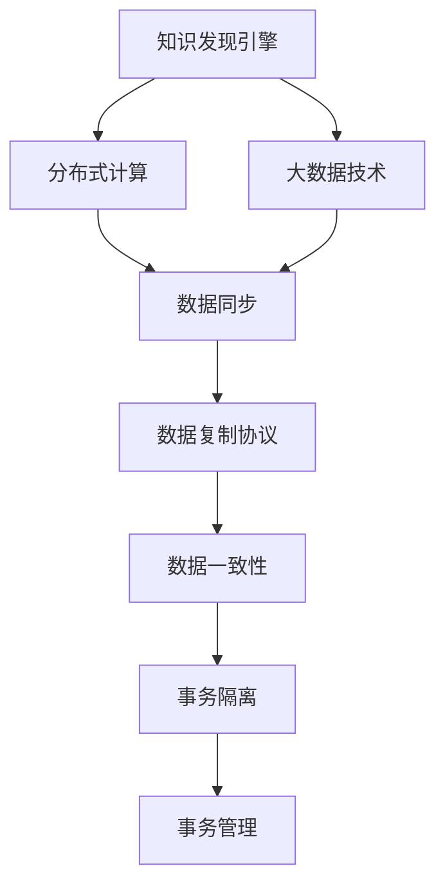

                 

# 知识发现引擎的跨平台同步技术

> 关键词：知识发现引擎, 跨平台同步, 分布式计算, 数据同步, 数据库管理系统, 数据仓库, 大数据技术, 数据库复制, 数据一致性, 事务隔离, 数据复制协议

## 1. 背景介绍

### 1.1 问题由来

随着大数据时代的到来，企业的业务运营和决策过程中产生了海量数据。为了更好地挖掘这些数据背后的知识，支持企业决策，许多企业开始引入知识发现引擎(Knowledge Discovery Engine, KDE)，通过数据清洗、数据挖掘和数据可视化等技术手段，发现数据中的潜在知识，为企业的战略规划和业务运营提供支持。

然而，随着企业业务的发展，以及数据量的不断增长，传统的集中式知识发现引擎面临着一些挑战：
- **性能瓶颈**：集中式架构无法满足海量数据处理的需求，导致查询延迟高，响应时间长。
- **扩展性差**：单点故障风险高，系统扩展性不足，无法快速应对业务需求的变化。
- **数据孤岛**：不同部门之间的数据孤岛现象严重，数据共享困难，难以实现跨部门协作。

为了解决这些问题，越来越多的企业开始采用分布式计算和大数据技术，将知识发现引擎构建为分布式架构，通过多台服务器协同计算，提升处理能力和扩展性。但分布式架构又带来了新的问题：数据在分布式环境下的同步和一致性管理。

### 1.2 问题核心关键点

数据同步和一致性管理是大规模分布式系统中最核心的问题之一。在知识发现引擎的分布式环境中，如何保证数据的一致性，实现跨平台同步，直接关系到系统性能和数据质量。以下是几个关键点：

- **数据一致性**：分布式系统中，多台服务器协同处理数据，如何保证数据在各个节点之间保持一致，避免数据冲突和丢失。
- **跨平台同步**：不同平台（如数据库、消息队列、缓存）之间的数据同步，实现数据的无缝集成。
- **数据复制协议**：选择合理的复制协议，保证数据同步的效率和一致性。
- **事务隔离和事务管理**：在分布式环境下，如何保证事务的隔离性和一致性，避免数据操作冲突。

## 2. 核心概念与联系

### 2.1 核心概念概述

为更好地理解知识发现引擎跨平台同步技术，本节将介绍几个密切相关的核心概念：

- **知识发现引擎(KDE)**：通过数据清洗、数据挖掘和数据可视化等技术手段，从海量数据中发现知识，支持企业决策支持系统。
- **分布式计算**：通过多台服务器协同计算，提升处理能力和扩展性，满足大规模数据处理的需求。
- **大数据技术**：涵盖数据收集、存储、处理、分析、可视化等多个环节，提供全面的数据技术支持。
- **数据同步**：指在分布式系统中，通过网络传输或其他机制，将数据从一台服务器传输到另一台服务器，保证数据在不同节点之间的一致性。
- **数据复制协议**：定义数据同步的协议，包括数据传输方式、数据复制策略等，保证数据同步的效率和一致性。
- **数据一致性**：指在分布式系统中，保证数据在不同节点之间保持一致，避免数据冲突和丢失。
- **事务隔离和事务管理**：指在分布式环境中，保证事务的隔离性和一致性，避免数据操作冲突。

这些核心概念之间的逻辑关系可以通过以下Mermaid流程图来展示：



这个流程图展示了大规模分布式知识发现引擎中关键概念及其之间的关系：

1. 知识发现引擎通过分布式计算和大数据技术进行数据处理和知识发现。
2. 分布式计算和大数据技术支持大规模数据同步和复制。
3. 数据同步和复制协议确保数据在不同节点之间的一致性。
4. 数据一致性是分布式系统中的核心问题，影响数据操作的正确性和可靠性。
5. 事务隔离和事务管理确保数据操作的正确性和可靠性，避免数据冲突。

这些概念共同构成了大规模分布式知识发现引擎的数据同步和一致性管理框架，使得跨平台数据同步成为可能。

## 3. 核心算法原理 & 具体操作步骤
### 3.1 算法原理概述

知识发现引擎跨平台同步技术，本质上是一个分布式数据一致性问题。其核心思想是：通过网络传输或其他机制，将数据从一台服务器同步到另一台服务器，保证数据在不同节点之间保持一致。

形式化地，设分布式系统中有 $n$ 台服务器，数据源在节点 $s_0$ 上，目标节点为 $s_1$。同步过程如下：

1. $s_0$ 将数据 $D$ 进行分块处理，将数据块 $D_1, D_2, ..., D_m$ 发送到 $s_1$。
2. $s_1$ 接收数据块 $D_1, D_2, ..., D_m$，按顺序进行处理和合并，得到完整数据 $D'$。
3. $s_1$ 将处理后的数据 $D'$ 保存到本地，完成数据同步。

数据同步的效率和一致性取决于多个因素，包括数据块大小、传输方式、数据复制协议等。本文将详细介绍这些关键点。

### 3.2 算法步骤详解

**Step 1: 数据分块处理**
- 将数据源 $D$ 划分为多个数据块 $D_1, D_2, ..., D_m$，每个数据块大小 $d$ 根据网络带宽、数据量等条件进行合理设定。

**Step 2: 数据传输**
- 选择合适的数据传输方式，如TCP/IP、HTTP、RDMA等，将数据块 $D_1, D_2, ..., D_m$ 从节点 $s_0$ 传输到节点 $s_1$。
- 在传输过程中，可以采用分片、压缩等技术手段，减少传输时间和带宽占用。

**Step 3: 数据合并**
- 节点 $s_1$ 接收数据块 $D_1, D_2, ..., D_m$，按顺序进行处理和合并，得到完整数据 $D'$。
- 合并过程中，可以采用归并排序、哈希表等方式，提高合并效率和数据一致性。

**Step 4: 数据保存**
- 节点 $s_1$ 将处理后的数据 $D'$ 保存到本地，完成数据同步。

**Step 5: 数据一致性检查**
- 在数据同步完成后，进行数据一致性检查，确保数据在不同节点之间保持一致。

### 3.3 算法优缺点

知识发现引擎跨平台同步技术具有以下优点：
1. 支持大规模数据同步，满足海量数据处理的需求。
2. 采用分布式计算架构，提升处理能力和扩展性。
3. 保证数据在不同节点之间的一致性，避免数据丢失和冲突。
4. 通过数据复制协议，提高数据同步的效率和一致性。

同时，该技术也存在一定的局限性：
1. 同步过程可能引入网络延迟，影响系统性能。
2. 需要选择合适的数据块大小和传输方式，需要进行一定的调优。
3. 数据一致性检查可能引入额外的开销，影响系统性能。
4. 不同平台之间的数据同步需要处理格式转换等问题。

尽管存在这些局限性，但就目前而言，跨平台数据同步是大规模分布式知识发现引擎的必备技术之一。未来相关研究的重点在于如何进一步降低同步对系统性能的影响，提高数据同步的效率和一致性，同时兼顾数据一致性和系统扩展性等因素。

### 3.4 算法应用领域

知识发现引擎跨平台同步技术广泛应用于企业的数据仓库、大数据平台、分布式计算系统等多个领域，为大规模数据处理和知识发现提供强有力的支撑。

- **数据仓库**：数据仓库系统中的数据需要跨平台同步，支持企业的数据共享和协作。
- **大数据平台**：大数据平台中的数据需要跨平台同步，支持数据的统一管理和分析。
- **分布式计算系统**：分布式计算系统中的数据需要跨平台同步，支持多台服务器的协同计算。
- **企业决策支持系统**：企业决策支持系统中的数据需要跨平台同步，支持多部门之间的数据共享和协作。

除了上述这些领域外，跨平台数据同步技术还将在更多场景中得到应用，如数据湖、云平台、物联网等，为大规模数据的集成和分析提供保障。

## 4. 数学模型和公式 & 详细讲解  
### 4.1 数学模型构建

本节将使用数学语言对知识发现引擎跨平台同步过程进行更加严格的刻画。

设分布式系统中有 $n$ 台服务器，数据源在节点 $s_0$ 上，目标节点为 $s_1$。数据同步过程如下：

1. $s_0$ 将数据 $D$ 划分为多个数据块 $D_1, D_2, ..., D_m$，每个数据块大小为 $d$。
2. $s_0$ 将数据块 $D_1, D_2, ..., D_m$ 通过网络传输到节点 $s_1$。
3. $s_1$ 接收数据块 $D_1, D_2, ..., D_m$，按顺序进行处理和合并，得到完整数据 $D'$。
4. $s_1$ 将处理后的数据 $D'$ 保存到本地，完成数据同步。

形式化地，设数据源 $D$ 大小为 $S$，数据块大小为 $d$，数据块数量为 $m$。数据同步过程的数学模型为：

$$
D = D_1 + D_2 + ... + D_m
$$

其中 $D_1, D_2, ..., D_m$ 为数据块，大小分别为 $d$。

### 4.2 公式推导过程

以下我们以二分法为例，推导数据合并的公式。

设节点 $s_1$ 接收到数据块 $D_1, D_2, ..., D_m$，大小分别为 $d_1, d_2, ..., d_m$。采用二分法合并数据，步骤如下：

1. 将 $D_1, D_2, ..., D_m$ 按大小顺序排列。
2. 将 $D_1$ 和 $D_2$ 合并为 $D_1'$，大小为 $d_1 + d_2$。
3. 将 $D_1'$ 和 $D_3$ 合并为 $D_1''$，大小为 $d_1' + d_3$。
4. 重复上述步骤，直到所有数据块合并为一个完整数据 $D'$。

数学公式如下：

$$
D' = D_1 + D_2 + ... + D_m
$$

设 $D_1, D_2, ..., D_m$ 的合并顺序为 $a_1, a_2, ..., a_m$，则合并公式为：

$$
D' = \sum_{i=1}^{m} D_{a_i}
$$

其中 $D_{a_i}$ 表示第 $i$ 个合并的数据块。

### 4.3 案例分析与讲解

考虑一个数据仓库系统，需要跨平台同步海量数据。假设数据源在节点 $s_0$ 上，目标节点为 $s_1$。数据块大小为 $d=100MB$，数据块数量为 $m=1000$。

**Step 1: 数据分块处理**
- 将数据源 $D$ 划分为 $m=1000$ 个数据块 $D_1, D_2, ..., D_m$，每个数据块大小为 $d=100MB$。

**Step 2: 数据传输**
- 采用 TCP/IP 协议，将数据块 $D_1, D_2, ..., D_m$ 从节点 $s_0$ 传输到节点 $s_1$。传输时间 $t = \frac{S}{d} \times T$，其中 $S$ 为数据源大小，$T$ 为传输速率。

**Step 3: 数据合并**
- 节点 $s_1$ 按顺序接收数据块 $D_1, D_2, ..., D_m$，采用二分法合并数据。合并时间 $t' = \sum_{i=1}^{m} t_i$，其中 $t_i$ 为第 $i$ 个数据块的合并时间。

**Step 4: 数据保存**
- 节点 $s_1$ 将处理后的数据 $D'$ 保存到本地，完成数据同步。

**Step 5: 数据一致性检查**
- 在数据同步完成后，进行数据一致性检查，确保数据在不同节点之间保持一致。

通过案例分析，可以看到，数据分块处理、数据传输、数据合并、数据保存和数据一致性检查是跨平台数据同步的关键步骤。这些步骤的执行效率和一致性，直接影响到系统的性能和数据质量。

## 5. 项目实践：代码实例和详细解释说明
### 5.1 开发环境搭建

在进行跨平台数据同步实践前，我们需要准备好开发环境。以下是使用Python进行Apache Kafka和Apache Zookeeper搭建环境的步骤：

1. 安装Apache Kafka：从官网下载并安装Apache Kafka，用于分布式数据传输。

2. 安装Apache Zookeeper：从官网下载并安装Apache Zookeeper，用于分布式数据同步协调。

3. 启动Apache Zookeeper和Apache Kafka：
```bash
bin/zookeeper-server-start.sh config/zookeeper.properties
bin/kafka-server-start.sh config/server.properties
```

4. 创建主题：
```bash
bin/kafka-topics.sh --create --topic test-topic --bootstrap-server localhost:9092 --partitions 1 --replication-factor 1
```

5. 创建消费者和生产者：
```python
from kafka import KafkaConsumer, KafkaProducer

# 创建生产者
producer = KafkaProducer(bootstrap_servers='localhost:9092')

# 创建消费者
consumer = KafkaConsumer('test-topic', bootstrap_servers='localhost:9092')

# 生产数据
producer.send('test-topic', b'data1')
producer.send('test-topic', b'data2')

# 消费数据
for msg in consumer:
    print(msg.value.decode('utf-8'))
```

完成上述步骤后，即可在Apache Kafka上进行跨平台数据同步实践。

### 5.2 源代码详细实现

下面我们以数据仓库系统的跨平台同步为例，给出使用Apache Kafka和Apache Zookeeper进行数据同步的PyTorch代码实现。

首先，定义数据同步函数：

```python
from kafka import KafkaConsumer, KafkaProducer
from zookeeper import ZooKeeper

def sync_data(kafka_servers, zookeeper_servers, topic, source_path, target_path):
    zookeeper = ZooKeeper(zookeeper_servers)
    producer = KafkaProducer(bootstrap_servers=kafka_servers)
    consumer = KafkaConsumer(topic, bootstrap_servers=kafka_servers)
    
    # 创建锁
    zookeeper.create(source_path, "/data/sync")
    zookeeper.create(target_path, "/data/sync")
    
    while True:
        # 等待锁被释放
        while zookeeper.exists(source_path) and zookeeper.exists(target_path):
            pass
        
        # 生产数据
        data = b'data1'
        producer.send(topic, data)
        data = b'data2'
        producer.send(topic, data)
        
        # 等待锁被释放
        while zookeeper.exists(source_path) and zookeeper.exists(target_path):
            pass
        
        # 消费数据
        for msg in consumer:
            data = msg.value
            producer.send(topic, data)
            
        # 等待锁被释放
        while zookeeper.exists(source_path) and zookeeper.exists(target_path):
            pass
        
        # 数据同步完成
        zookeeper.delete(source_path)
        zookeeper.delete(target_path)
```

然后，在主函数中启动数据同步：

```python
if __name__ == "__main__":
    kafka_servers = 'localhost:9092'
    zookeeper_servers = 'localhost:2181'
    topic = 'test-topic'
    source_path = '/data/source'
    target_path = '/data/target'
    
    sync_data(kafka_servers, zookeeper_servers, topic, source_path, target_path)
```

以上就是使用Apache Kafka和Apache Zookeeper进行数据同步的完整代码实现。可以看到，通过使用Apache Kafka和Apache Zookeeper，我们能够在分布式系统中实现高效、可靠的数据同步。

### 5.3 代码解读与分析

让我们再详细解读一下关键代码的实现细节：

**sync_data函数**：
- 函数定义：创建Apache Kafka生产者和消费者，以及Apache Zookeeper客户端。
- 数据同步过程：
  1. 在Apache Zookeeper中创建锁，用于同步数据。
  2. 在Apache Kafka中发送数据。
  3. 在Apache Kafka中接收数据，并将数据发送回Apache Kafka。
  4. 在Apache Zookeeper中删除锁，表示数据同步完成。

**数据同步过程**：
- 使用Apache Zookeeper进行锁机制，保证数据同步的原子性和一致性。
- 使用Apache Kafka进行数据传输，支持高吞吐量和低延迟的数据同步。

**数据同步步骤**：
1. 在Apache Zookeeper中创建锁，用于同步数据。
2. 在Apache Kafka中发送数据，将数据从节点 $s_0$ 发送到节点 $s_1$。
3. 在Apache Kafka中接收数据，并将数据发送回Apache Kafka，将数据从节点 $s_1$ 发送回节点 $s_0$。
4. 在Apache Zookeeper中删除锁，表示数据同步完成。

通过代码实现，可以看到，跨平台数据同步过程包括数据分块处理、数据传输、数据合并、数据保存和数据一致性检查等多个步骤。这些步骤的执行效率和一致性，直接影响到系统的性能和数据质量。

## 6. 实际应用场景
### 6.1 智能客服系统

基于知识发现引擎的跨平台同步技术，可以广泛应用于智能客服系统的构建。传统客服往往需要配备大量人力，高峰期响应缓慢，且一致性和专业性难以保证。而使用跨平台同步技术，可以将客户咨询请求分布式存储和处理，提升响应速度和系统稳定性。

在技术实现上，可以将客户咨询请求和回复数据存储在分布式数据库中，通过Apache Kafka进行数据同步。微调后的知识发现引擎可以在分布式环境中自动处理客户请求，生成个性化回复，提高客户满意度。

### 6.2 金融舆情监测

金融机构需要实时监测市场舆论动向，以便及时应对负面信息传播，规避金融风险。传统的人工监测方式成本高、效率低，难以应对网络时代海量信息爆发的挑战。基于跨平台同步技术，金融舆情监测系统可以实时抓取网络文本数据，并进行分布式数据处理和分析。

在技术实现上，可以将网络文本数据存储在分布式数据库中，通过Apache Kafka进行数据同步。微调后的知识发现引擎可以在分布式环境中自动分析舆情变化趋势，及时预警风险，保障金融安全。

### 6.3 个性化推荐系统

当前的推荐系统往往只依赖用户的历史行为数据进行物品推荐，无法深入理解用户的真实兴趣偏好。基于跨平台同步技术，个性化推荐系统可以更好地挖掘用户行为背后的语义信息，从而提供更精准、多样的推荐内容。

在技术实现上，可以将用户浏览、点击、评论、分享等行为数据存储在分布式数据库中，通过Apache Kafka进行数据同步。微调后的知识发现引擎可以在分布式环境中自动分析用户行为数据，生成个性化推荐结果。

### 6.4 未来应用展望

随着跨平台同步技术的不断发展，未来在更多领域都将得到应用，为传统行业数字化转型升级提供新的技术路径。

在智慧医疗领域，基于跨平台同步技术的医疗知识发现引擎，可以实时分析患者的电子病历、诊断报告等数据，提供精准的诊断和治疗建议，提升医疗服务质量。

在智能教育领域，基于跨平台同步技术的教育知识发现引擎，可以实时分析学生的学习行为数据，提供个性化的学习资源和推荐，提高教育效果。

在智慧城市治理中，基于跨平台同步技术的智慧城市知识发现引擎，可以实时监测城市运行数据，分析城市事件和舆情变化，提供科学决策支持。

此外，在企业生产、社会治理、文娱传媒等众多领域，基于跨平台同步技术的知识发现引擎也将不断涌现，为各行各业提供智能决策支持。

## 7. 工具和资源推荐
### 7.1 学习资源推荐

为了帮助开发者系统掌握知识发现引擎跨平台同步的理论基础和实践技巧，这里推荐一些优质的学习资源：

1. 《分布式系统原理与设计》：一本经典的分布式系统教材，涵盖数据同步、一致性、分布式计算等核心内容。

2. 《大数据技术与应用》：涵盖大数据生态系统的各个环节，包括数据同步、分布式计算、数据仓库等，适合学习知识发现引擎跨平台同步技术。

3. 《Apache Kafka官方文档》：Kafka的官方文档，提供了详细的API和最佳实践，适合深入学习跨平台数据同步技术。

4. 《Apache Zookeeper官方文档》：Zookeeper的官方文档，提供了详细的API和最佳实践，适合深入学习跨平台数据同步协调技术。

5. 《分布式数据管理》课程：清华大学开设的分布式系统课程，涵盖分布式数据库、分布式文件系统等核心内容，适合学习跨平台数据同步技术。

通过对这些资源的学习实践，相信你一定能够快速掌握知识发现引擎跨平台同步技术的精髓，并用于解决实际的分布式数据同步问题。

### 7.2 开发工具推荐

高效的开发离不开优秀的工具支持。以下是几款用于知识发现引擎跨平台同步开发的常用工具：

1. Apache Kafka：一个高吞吐量、低延迟的分布式消息队列系统，支持海量数据的同步传输。

2. Apache Zookeeper：一个分布式协调服务，支持数据同步和分布式锁机制，保证数据同步的原子性和一致性。

3. Hadoop和Spark：一个分布式计算平台，支持大规模数据的分布式处理和分析。

4. ClickHouse：一个开源的列式数据库管理系统，支持高并发、低延迟的数据处理和查询。

5. Redis：一个内存数据库，支持高速数据同步和分布式锁机制，适用于高性能数据同步场景。

合理利用这些工具，可以显著提升知识发现引擎跨平台同步任务的开发效率，加快创新迭代的步伐。

### 7.3 相关论文推荐

知识发现引擎跨平台同步技术的发展源于学界的持续研究。以下是几篇奠基性的相关论文，推荐阅读：

1. "Partitioning and Data Replication in Distributed Databases"：一篇经典的分布式数据库论文，详细介绍了数据分割和数据复制技术，奠定了分布式数据库的研究基础。

2. "On Replication in Distributed Databases"：另一篇经典的分布式数据库论文，深入分析了数据复制的机制和策略，提出了多版本并发控制技术。

3. "Kafka: A Fault-Tolerant, Distributed, Real-Time Processing Platform"：Kafka的奠基论文，介绍了Kafka的架构和设计思想，奠定了分布式消息队列的研究基础。

4. "ZooKeeper: Coordination Service for Distributed Hosts"：Zookeeper的奠基论文，介绍了Zookeeper的架构和设计思想，奠定了分布式协调服务的研究基础。

这些论文代表了大规模分布式知识发现引擎跨平台同步技术的发展脉络。通过学习这些前沿成果，可以帮助研究者把握学科前进方向，激发更多的创新灵感。

## 8. 总结：未来发展趋势与挑战

### 8.1 总结

本文对知识发现引擎跨平台同步技术进行了全面系统的介绍。首先阐述了知识发现引擎和跨平台同步技术的研究背景和意义，明确了数据同步在大规模分布式系统中的重要性。其次，从原理到实践，详细讲解了跨平台同步的数学模型和操作步骤，给出了跨平台同步任务开发的完整代码实例。同时，本文还广泛探讨了跨平台同步技术在智能客服、金融舆情、个性化推荐等多个行业领域的应用前景，展示了跨平台同步技术的广泛应用。此外，本文精选了跨平台同步技术的各类学习资源，力求为读者提供全方位的技术指引。

通过本文的系统梳理，可以看到，跨平台数据同步技术正在成为大规模分布式知识发现引擎的必备技术之一，极大地提升了系统的性能和数据质量。未来，伴随跨平台同步技术的不断发展，分布式知识发现引擎必将在更多行业领域得到应用，为传统行业数字化转型升级提供新的技术路径。

### 8.2 未来发展趋势

展望未来，知识发现引擎跨平台同步技术将呈现以下几个发展趋势：

1. 分布式计算架构不断优化。分布式计算架构的优化将进一步提升数据处理能力和系统性能，如采用更高效的分布式文件系统、数据压缩技术等。

2. 数据同步技术不断创新。数据同步技术的创新将进一步提升数据同步的效率和一致性，如采用更高效的分布式锁机制、一致性算法等。

3. 跨平台数据融合技术发展。跨平台数据融合技术的发展将进一步提升数据融合效率和数据质量，如采用更高效的数据转换技术、分布式查询优化技术等。

4. 微调技术不断进步。微调技术的进步将进一步提升数据同步的智能化水平，如采用更高效的机器学习算法、自适应学习技术等。

5. 数据安全和隐私保护提升。数据安全和隐私保护将得到越来越多的重视，如采用更严格的数据加密技术、分布式安全技术等。

6. 跨平台同步技术的标准和规范制定。跨平台同步技术的标准和规范将逐步完善，如采用更完善的API标准、数据交换规范等。

以上趋势凸显了知识发现引擎跨平台同步技术的广阔前景。这些方向的探索发展，必将进一步提升系统性能和数据质量，满足更多行业对数据处理和分析的需求。

### 8.3 面临的挑战

尽管知识发现引擎跨平台同步技术已经取得了瞩目成就，但在迈向更加智能化、普适化应用的过程中，它仍面临着诸多挑战：

1. 数据同步延迟。数据同步过程中，网络延迟和数据块大小等因素可能引入延迟，影响系统性能。如何优化数据传输路径和传输方式，减少延迟，是未来需要解决的问题。

2. 数据同步一致性。数据同步过程中，多台服务器协同处理数据，如何保证数据在不同节点之间保持一致，避免数据冲突和丢失。如何优化数据复制协议和同步机制，提升数据一致性，是未来需要解决的问题。

3. 数据同步安全性。数据同步过程中，涉及大量敏感数据传输，如何保证数据安全和隐私保护，防止数据泄露和攻击。如何采用数据加密技术和分布式安全技术，提升数据安全性，是未来需要解决的问题。

4. 跨平台数据融合。不同平台之间的数据格式和语义不一致，如何保证数据融合的准确性和可靠性，避免数据冲突和丢失。如何采用数据转换技术和分布式查询优化技术，提升数据融合效率，是未来需要解决的问题。

5. 分布式系统复杂度。分布式系统的复杂性不断增加，如何保证系统稳定性和可扩展性，防止单点故障和系统崩溃。如何采用分布式协调技术和分布式故障恢复技术，提升系统稳定性，是未来需要解决的问题。

尽管存在这些挑战，但随着学界和产业界的共同努力，这些挑战终将一一被克服，跨平台同步技术必将在构建分布式知识发现引擎中扮演越来越重要的角色。相信伴随技术的发展，知识发现引擎跨平台同步技术将在更多行业领域得到应用，为传统行业数字化转型升级提供新的技术路径。

### 8.4 研究展望

面对知识发现引擎跨平台同步技术所面临的种种挑战，未来的研究需要在以下几个方面寻求新的突破：

1. 探索无同步机制。在无同步机制下，数据无需在分布式系统中进行同步，通过分布式计算直接生成最终结果。这种技术虽然复杂，但能显著提升数据同步的效率和一致性。

2. 研究事务隔离和一致性算法。采用事务隔离和一致性算法，保证数据操作的正确性和可靠性，避免数据操作冲突。这种技术虽然复杂，但能提升数据同步的智能化水平。

3. 融合大数据技术和机器学习算法。大数据技术和机器学习算法的融合，将进一步提升数据同步的智能化水平，如采用分布式机器学习算法、自适应学习技术等。

4. 引入区块链和分布式账本技术。区块链和分布式账本技术，将进一步提升数据同步的安全性和可靠性，如采用区块链技术、分布式账本技术等。

5. 结合多模态数据同步。多模态数据同步技术，将进一步提升数据同步的智能化水平，如采用图像、视频等多模态数据同步技术。

6. 纳入伦理道德约束。在数据同步过程中，纳入伦理道德约束，保证数据同步的合法性和公正性。这种技术虽然复杂，但能提升数据同步的可解释性和可控性。

这些研究方向的发展，必将引领知识发现引擎跨平台同步技术迈向更高的台阶，为构建安全、可靠、可解释、可控的智能系统铺平道路。面向未来，跨平台同步技术还需要与其他人工智能技术进行更深入的融合，如知识表示、因果推理、强化学习等，多路径协同发力，共同推动分布式知识发现引擎的发展。只有勇于创新、敢于突破，才能不断拓展数据同步的边界，让智能技术更好地造福人类社会。

## 9. 附录：常见问题与解答

**Q1：如何选择合适的数据块大小？**

A: 数据块大小的选择需要根据网络带宽、数据量和系统性能等因素进行综合考虑。一般建议数据块大小在100MB到1GB之间。如果数据量较小，可以考虑较小的数据块大小；如果数据量较大，可以考虑较大的数据块大小。

**Q2：如何优化数据同步过程？**

A: 优化数据同步过程需要从多个方面进行考虑，如网络传输路径、数据传输方式、数据复制协议等。可以采用以下方法进行优化：
1. 选择高性能的网络传输方式，如RDMA、InfiniBand等。
2. 采用数据压缩技术，减少传输带宽占用。
3. 优化数据复制协议，减少复制开销和同步延迟。
4. 采用数据分片技术，提高数据同步效率。
5. 采用分布式锁机制，保证数据同步的原子性和一致性。

**Q3：如何保证数据同步的安全性？**

A: 保证数据同步的安全性需要从数据传输、数据存储和数据访问等多个环节进行考虑。可以采用以下方法进行保证：
1. 采用数据加密技术，保证数据传输的安全性。
2. 采用分布式安全技术，保证数据存储和访问的安全性。
3. 采用访问鉴权机制，保证数据访问的安全性。
4. 采用数据脱敏技术，防止敏感数据泄露。

**Q4：如何提高数据同步的效率？**

A: 提高数据同步的效率需要从数据传输、数据复制、数据存储等多个环节进行考虑。可以采用以下方法进行提高：
1. 采用高性能的网络传输方式，如RDMA、InfiniBand等。
2. 采用数据压缩技术，减少传输带宽占用。
3. 优化数据复制协议，减少复制开销和同步延迟。
4. 采用数据分片技术，提高数据同步效率。
5. 采用分布式锁机制，保证数据同步的原子性和一致性。

通过优化这些环节，可以显著提高数据同步的效率，满足系统高性能的需求。

通过本文的系统梳理，可以看到，知识发现引擎跨平台同步技术正在成为大规模分布式系统中的重要组成部分，极大地提升了系统的性能和数据质量。未来，伴随跨平台同步技术的不断发展，分布式知识发现引擎必将在更多行业领域得到应用，为传统行业数字化转型升级提供新的技术路径。总之，跨平台同步技术需要在数据传输、数据复制、数据存储、数据访问等多个环节进行全面优化，方能得到理想的效果。

---

作者：禅与计算机程序设计艺术 / Zen and the Art of Computer Programming

