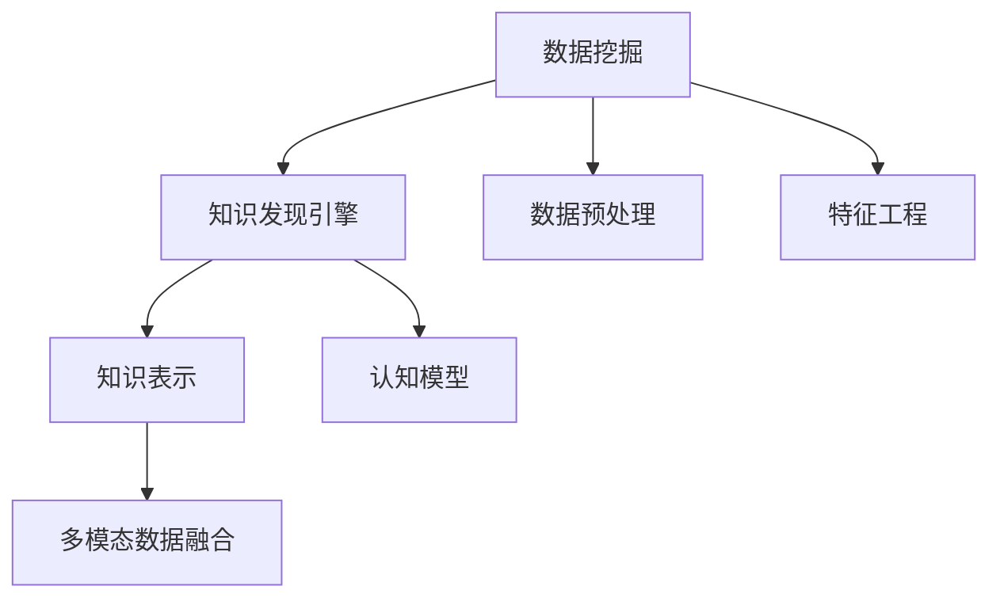

                 

# 知识发现引擎：人类认知的新frontier

在快速发展的数字化时代，数据如潮水般涌来，而知识则藏匿其中，等待我们去挖掘。面对信息过载，人类认知能力的局限性愈发显现。知识发现引擎（Knowledge Discovery Engine, KDE）应运而生，它以数据为素材，以算法为工具，向我们揭示出知识的新维度。本文旨在深入探讨知识发现引擎的原理、技术与实践，揭示其在人类认知拓展中的新前沿。

## 1. 背景介绍

### 1.1 问题由来

自互联网普及以来，全球范围内的信息量呈指数级增长，面对海量数据，人类认知和处理能力显得捉襟见肘。在这样的背景下，数据挖掘（Data Mining）应运而生，它通过数据分析发现数据中的规律和模式，但往往过于强调定量分析，忽略了知识的主观性和隐含性。

知识发现（Knowledge Discovery）则进一步强调对知识的主观理解和主观推理，使得知识更贴近人类的认知模式。知识发现引擎（KDE）作为知识发现的工具，通过算法从数据中挖掘知识，辅助人类在认知领域取得新的突破。

### 1.2 问题核心关键点

1. **大数据与数据驱动**：海量数据和数据驱动成为知识发现的前提。
2. **知识表示与认知模型**：如何将数据转化为知识，以及如何更好地利用知识模型，辅助人类认知。
3. **算法与技术**：包括数据预处理、特征工程、模型训练、评估与优化等。
4. **可解释性与人类认知**：知识发现的结果如何更好地服务于人类，如何解释和应用这些结果。
5. **多模态数据融合**：如何整合不同类型的数据（如文本、图像、语音），发现更全面、深入的知识。

### 1.3 问题研究意义

- 提升人类认知能力：通过知识发现引擎，人类可以更深入地理解自然规律，拓展认知边界。
- 促进决策科学化：在商业、医疗、教育等众多领域，基于知识发现引擎的决策系统能显著提升决策的准确性和效率。
- 推动科学创新：知识发现引擎为科学研究提供了新的工具和方法，加速科学发现和技术创新。
- 构建智能系统：知识发现引擎为人工智能、智能推荐、智能搜索等系统的开发提供了强有力的支撑。

## 2. 核心概念与联系

### 2.1 核心概念概述

**知识发现引擎（KDE）**：通过数据挖掘和统计学习等技术，从数据中发现知识，辅助人类认知的技术系统。

**数据挖掘（Data Mining）**：利用算法对大量数据进行分析，发现数据中隐含的规律和知识。

**知识表示（Knowledge Representation）**：将知识转化为可计算的形式，使机器能理解和处理知识。

**认知模型（Cognitive Model）**：模拟人类认知过程，通过算法和模型辅助人类进行认知任务。

**多模态数据融合（Multi-modal Data Fusion）**：整合不同类型的数据，从多维度获取更全面的知识。

这些概念之间的关系可通过以下Mermaid流程图来展示：



这个流程图展示了知识发现引擎的关键环节及其之间的关系：

1. 数据挖掘作为知识发现的前提，通过对大量数据进行分析，发现数据中的模式和规律。
2. 数据预处理和特征工程对原始数据进行清洗和转换，为后续的模型训练做准备。
3. 知识表示和认知模型将数据转化为知识，模拟人类认知过程。
4. 多模态数据融合整合不同类型的数据，获取更全面、深入的知识。

## 3. 核心算法原理 & 具体操作步骤

### 3.1 算法原理概述

知识发现引擎的核心算法原理主要基于统计学习和机器学习技术。其核心思想是通过数据挖掘技术从大量数据中发现潜在的知识模式，并利用知识表示和认知模型，将知识转化为可解释的形式，辅助人类进行认知决策。

### 3.2 算法步骤详解

#### 3.2.1 数据预处理

- **数据清洗**：去除数据中的噪声和异常值，确保数据质量。
- **数据归一化**：将数据转换为标准格式，便于后续处理。
- **数据集成**：将来自不同来源的数据合并，构建统一的数据集。

#### 3.2.2 特征工程

- **特征选择**：从原始数据中选择最重要的特征，减少噪声，提高模型性能。
- **特征构建**：通过组合、转换等方法，生成新的特征，增强模型表达能力。
- **特征降维**：利用降维技术减少特征数量，提高计算效率。

#### 3.2.3 模型训练

- **选择模型**：根据任务特点选择最合适的模型，如决策树、支持向量机、神经网络等。
- **训练模型**：利用训练数据集对模型进行训练，优化模型参数。
- **模型评估**：通过测试集评估模型性能，选择最优模型。

#### 3.2.4 知识表示

- **本体构建**：建立领域本体，定义知识实体和关系。
- **规则提取**：通过逻辑规则和推理方法，提取知识规则。
- **框架构建**：利用知识框架，组织和表示知识。

#### 3.2.5 认知模型

- **构建认知模型**：利用符号推理、神经网络等技术，构建认知模型。
- **模型训练**：利用标注数据训练认知模型，提升模型准确性。
- **推理和解释**：通过认知模型进行推理，解释模型输出。

### 3.3 算法优缺点

**优点：**

1. **高效性**：自动化数据处理和模型训练，提高处理效率。
2. **泛化能力**：基于统计学习模型，具备良好的泛化能力。
3. **可解释性**：知识表示和认知模型提供直观的知识解释。

**缺点：**

1. **依赖高质量数据**：对数据质量和标注数据依赖性较高。
2. **模型复杂性**：复杂模型可能导致过拟合，影响泛化能力。
3. **计算资源需求高**：大规模数据集和高维特征工程需要大量计算资源。

### 3.4 算法应用领域

知识发现引擎在多个领域中得到了广泛应用，例如：

- **商业智能**：通过挖掘市场趋势和消费者行为，辅助商业决策。
- **金融分析**：利用金融数据发现风险和投资机会。
- **医疗健康**：通过病历数据发现疾病模式，辅助临床决策。
- **教育**：通过学习数据发现教育规律，优化教学方法。
- **环境监测**：通过环境数据发现污染趋势，辅助环境保护。

## 4. 数学模型和公式 & 详细讲解

### 4.1 数学模型构建

知识发现引擎的数学模型构建主要基于统计学习和机器学习。

**假设数据集**： $D=\{(x_i,y_i)\}_{i=1}^N$，其中 $x_i$ 为特征向量，$y_i$ 为标签。

**模型函数**： $f(x)$ 表示从特征 $x$ 到标签 $y$ 的映射函数。

**损失函数**： $L(f(x),y)$ 表示模型预测 $f(x)$ 与真实标签 $y$ 之间的差异。

**优化目标**：最小化损失函数 $L(f(x),y)$。

### 4.2 公式推导过程

**线性回归**：
$$
\min_{f} L(f(x),y) = \min_{w,b} \sum_{i=1}^N (y_i - f(x_i))^2
$$

其中 $f(x) = wx + b$。

**逻辑回归**：
$$
\min_{w,b} L(f(x),y) = \min_{w,b} -\frac{1}{N}\sum_{i=1}^N y_i \log f(x_i) + (1-y_i) \log (1-f(x_i))
$$

其中 $f(x) = \sigma(w^Tx+b)$，$\sigma$ 为sigmoid函数。

**决策树**：
$$
f(x) = \sum_{i=1}^n w_i \phi_i(x) + b
$$

其中 $\phi_i(x)$ 为决策树节点特征函数，$w_i,b$ 为模型参数。

### 4.3 案例分析与讲解

#### 4.3.1 线性回归案例

某电商平台希望通过用户行为数据，预测用户是否购买某产品。使用线性回归模型，假设特征为年龄、性别、浏览历史、购买记录等，标签为是否购买。

1. 数据预处理：清洗数据，去除异常值，归一化数据。
2. 特征选择：选择年龄、浏览历史和购买记录作为特征。
3. 模型训练：利用训练集训练线性回归模型，优化参数 $w$ 和 $b$。
4. 模型评估：利用测试集评估模型，计算均方误差。
5. 知识表示：将线性回归模型转化为知识表示，如年龄越大，购买概率越高。

#### 4.3.2 决策树案例

某医院希望通过病历数据，发现糖尿病患者的风险因素。使用决策树模型，假设特征为年龄、BMI、血压、血糖等，标签为是否患有糖尿病。

1. 数据预处理：清洗数据，去除异常值，归一化数据。
2. 特征选择：选择年龄、BMI、血压和血糖作为特征。
3. 模型训练：利用训练集训练决策树模型，优化树形结构和节点划分。
4. 模型评估：利用测试集评估模型，计算准确率和召回率。
5. 知识表示：将决策树模型转化为知识表示，如年龄大于60岁、BMI大于30等是高风险因素。

## 5. 项目实践：代码实例和详细解释说明

### 5.1 开发环境搭建

在进行知识发现引擎的实践前，我们需要准备好开发环境。以下是使用Python进行Scikit-learn开发的环境配置流程：

1. 安装Anaconda：从官网下载并安装Anaconda，用于创建独立的Python环境。

2. 创建并激活虚拟环境：
```bash
conda create -n kde-env python=3.8 
conda activate kde-env
```

3. 安装Scikit-learn：
```bash
conda install scikit-learn
```

4. 安装各类工具包：
```bash
pip install numpy pandas scikit-learn matplotlib tqdm jupyter notebook ipython
```

完成上述步骤后，即可在`kde-env`环境中开始知识发现引擎的实践。

### 5.2 源代码详细实现

这里我们以线性回归模型为例，给出使用Scikit-learn库进行数据挖掘和知识发现的PyTorch代码实现。

首先，定义数据集：

```python
from sklearn.datasets import load_boston
from sklearn.model_selection import train_test_split

boston = load_boston()
X = boston.data
y = boston.target

X_train, X_test, y_train, y_test = train_test_split(X, y, test_size=0.2, random_state=42)
```

然后，定义模型：

```python
from sklearn.linear_model import LinearRegression
from sklearn.metrics import mean_squared_error

model = LinearRegression()
```

接着，训练模型：

```python
model.fit(X_train, y_train)
```

最后，评估模型：

```python
y_pred = model.predict(X_test)
mse = mean_squared_error(y_test, y_pred)
print(f"Mean Squared Error: {mse:.2f}")
```

以上就是使用Scikit-learn对线性回归模型进行数据挖掘和知识发现的完整代码实现。可以看到，得益于Scikit-learn的强大封装，我们可以用相对简洁的代码完成线性回归模型的构建和评估。

### 5.3 代码解读与分析

让我们再详细解读一下关键代码的实现细节：

**数据集定义**：
- 使用Scikit-learn内置的波士顿房价数据集。
- 将数据集分为训练集和测试集，使用train_test_split函数，测试集大小为20%。

**模型定义**：
- 定义线性回归模型，通过LinearRegression类实现。
- 定义评估指标，使用均方误差。

**模型训练**：
- 使用fit函数，将训练集数据和标签输入模型，训练模型参数。

**模型评估**：
- 使用predict函数，将测试集数据输入模型，得到预测值。
- 使用mean_squared_error函数，计算预测值与真实值之间的均方误差，评估模型性能。

**结果输出**：
- 打印均方误差，评估模型预测的准确性。

## 6. 实际应用场景

### 6.1 商业智能

在商业智能领域，知识发现引擎可以应用于客户行为分析、市场趋势预测、产品推荐等任务。通过分析用户数据，企业可以了解用户需求，预测市场变化，优化产品设计，提高竞争力。

### 6.2 金融分析

在金融分析领域，知识发现引擎可以用于股票价格预测、信用风险评估、投资组合优化等任务。通过分析历史交易数据和市场信息，金融机构可以发现潜在的投资机会，规避风险，优化投资策略。

### 6.3 医疗健康

在医疗健康领域，知识发现引擎可以用于疾病预测、诊断辅助、药物研发等任务。通过分析病历数据和实验室数据，医疗机构可以发现疾病模式，提高诊断准确性，加速新药开发进程。

### 6.4 环境监测

在环境监测领域，知识发现引擎可以用于污染源追踪、气候变化预测、灾害预警等任务。通过分析环境监测数据，环境保护机构可以发现污染源，预测环境变化，提高灾害应对能力。

### 6.5 教育

在教育领域，知识发现引擎可以用于学生行为分析、课程推荐、学习路径优化等任务。通过分析学习数据，教育机构可以了解学生学习情况，优化教学内容，提高教学效果。

## 7. 工具和资源推荐

### 7.1 学习资源推荐

为了帮助开发者系统掌握知识发现引擎的理论基础和实践技巧，这里推荐一些优质的学习资源：

1. 《数据挖掘与统计学习》书籍：由知名机器学习专家撰写，全面介绍了数据挖掘和统计学习的基本概念和经典方法。

2. 《Python数据科学手册》书籍：由数据科学领域的知名作者撰写，介绍了Python在数据科学中的应用，包括数据处理、模型训练、结果可视化等。

3. 《机器学习实战》书籍：由知名数据科学家撰写，提供了丰富的案例和代码示例，适合初学者快速上手。

4. 《Scikit-learn官方文档》：Scikit-learn的官方文档，提供了海量模型的代码实现和详细解释。

5. Kaggle竞赛平台：全球知名的数据科学竞赛平台，提供丰富的数据集和模型实战机会，助力开发者提升技能。

通过对这些资源的学习实践，相信你一定能够快速掌握知识发现引擎的精髓，并用于解决实际的认知问题。

### 7.2 开发工具推荐

高效的开发离不开优秀的工具支持。以下是几款用于知识发现引擎开发的常用工具：

1. Python：通用编程语言，拥有丰富的数据科学库和框架，适合知识发现引擎的开发。

2. R：专注于数据分析和统计学计算，适合进行数据预处理和特征工程。

3. Scikit-learn：基于Python的机器学习库，提供了丰富且易用的模型实现和评估工具。

4. TensorFlow：由Google主导的深度学习框架，支持分布式计算，适合大规模数据处理。

5. Weights & Biases：模型训练的实验跟踪工具，可以记录和可视化模型训练过程中的各项指标，方便对比和调优。

6. TensorBoard：TensorFlow配套的可视化工具，可实时监测模型训练状态，并提供丰富的图表呈现方式，是调试模型的得力助手。

合理利用这些工具，可以显著提升知识发现引擎的开发效率，加快创新迭代的步伐。

### 7.3 相关论文推荐

知识发现引擎的发展源于学界的持续研究。以下是几篇奠基性的相关论文，推荐阅读：

1. 《数据挖掘：概念与技术》书籍：数据挖掘领域的经典教材，全面介绍了数据挖掘的基本概念和技术方法。

2. 《机器学习：实战指南》论文：机器学习领域的经典论文，介绍了机器学习的基本概念和应用方法。

3. 《大规模数据集上的知识发现》论文：提出了在大规模数据集上进行知识发现的技术和方法，推动了知识发现引擎的发展。

4. 《基于知识图谱的推荐系统》论文：利用知识图谱构建推荐系统，提高了推荐系统的准确性和可靠性。

5. 《多模态数据融合的创新方法》论文：提出了多模态数据融合的新方法，提高了知识发现引擎的准确性和鲁棒性。

这些论文代表了大规模知识发现引擎的研究方向和发展脉络。通过学习这些前沿成果，可以帮助研究者把握学科前进方向，激发更多的创新灵感。

## 8. 总结：未来发展趋势与挑战

### 8.1 总结

本文对知识发现引擎的原理、技术与实践进行了全面系统的介绍。首先阐述了知识发现引擎的研究背景和意义，明确了知识发现引擎在提升人类认知能力方面的重要价值。其次，从原理到实践，详细讲解了知识发现引擎的数学模型和算法流程，给出了知识发现引擎开发的具体代码实现。同时，本文还广泛探讨了知识发现引擎在商业智能、金融分析、医疗健康等多个领域的应用前景，展示了知识发现引擎的广泛应用潜力。此外，本文精选了知识发现引擎的学习资源，力求为读者提供全方位的技术指引。

通过本文的系统梳理，可以看到，知识发现引擎作为人类认知的利器，正逐渐成为数据驱动决策的重要工具。随着数据量的激增和算法的不断进步，知识发现引擎必将在更多领域发挥重要作用，为人类认知的进一步拓展提供新契机。

### 8.2 未来发展趋势

展望未来，知识发现引擎将呈现以下几个发展趋势：

1. **自动化水平提升**：自动化数据清洗、特征工程和模型训练将成为主流，提升知识发现引擎的效率。

2. **多模态数据融合技术进步**：多模态数据融合技术不断发展，知识发现引擎将能够处理更多类型的数据，从多维度获取更全面的知识。

3. **深度学习与知识表示结合**：深度学习与知识表示技术深度结合，提升知识发现引擎的准确性和可解释性。

4. **交互式认知系统出现**：知识发现引擎与用户交互更加紧密，提供更加智能和人性化的服务。

5. **跨领域应用拓展**：知识发现引擎的应用领域将进一步扩展，涵盖更多专业领域，提升其跨领域适应能力。

这些趋势凸显了知识发现引擎的广阔前景。未来的研究将更多地关注如何更好地利用数据、算法和认知模型，提升知识发现引擎的性能和应用价值。

### 8.3 面临的挑战

尽管知识发现引擎已经取得了不少进展，但在迈向更广泛应用的过程中，仍面临诸多挑战：

1. **数据质量和标注问题**：知识发现引擎的性能很大程度上依赖于数据质量和标注数据，获取高质量的数据和标注仍是一个难题。

2. **模型复杂性和可解释性**：复杂的知识发现模型虽然性能更好，但难以解释其内部决策过程，影响其可解释性和可信度。

3. **计算资源需求**：大规模数据集和高维特征工程需要大量计算资源，如何降低计算成本是未来的重要研究方向。

4. **跨领域知识整合**：不同领域的知识具有不同特征，如何整合跨领域知识，构建全面的知识图谱，是一个重要挑战。

5. **知识的时效性和更新**：知识发现引擎需要不断更新和维护，以适应数据分布的变化，保持其时效性。

这些挑战将激励知识发现引擎的研究者不断创新和突破，推动技术的发展和应用。

### 8.4 研究展望

面对知识发现引擎所面临的挑战，未来的研究需要在以下几个方面寻求新的突破：

1. **数据生成与自监督学习**：开发数据生成方法，结合自监督学习技术，减少对标注数据的依赖。

2. **多模态知识表示**：研究多模态数据的知识表示方法，提高知识发现引擎的全面性和鲁棒性。

3. **认知模型优化**：优化认知模型，提高其可解释性和决策的合理性。

4. **高效计算方法**：开发高效计算方法，降低知识发现引擎的计算成本。

5. **跨领域知识融合**：研究跨领域知识融合技术，构建全面的知识图谱，提升知识发现引擎的跨领域适应能力。

这些研究方向将推动知识发现引擎向更加智能化、普适化的方向发展，为人类认知的进一步拓展提供新工具和方法。

## 9. 附录：常见问题与解答

**Q1：知识发现引擎与数据挖掘有何不同？**

A: 数据挖掘主要强调对数据模式的发现和归纳，侧重于数据驱动。而知识发现引擎更侧重于知识的主观理解和应用，通过认知模型辅助人类进行决策。

**Q2：如何选择合适的特征？**

A: 选择特征时，需要考虑数据的性质、任务的复杂度和模型的表现。一般建议选择与任务相关性高、互斥性强的特征。

**Q3：如何提高知识发现引擎的可解释性？**

A: 提高知识发现引擎的可解释性，需要从算法设计和结果呈现两方面入手。可以使用符号推理、可视化等方法，解释模型输出的因果关系。

**Q4：如何构建认知模型？**

A: 构建认知模型，需要根据任务特点选择合适的知识表示方法和推理机制。常用的方法包括符号推理、神经网络、逻辑规则等。

**Q5：知识发现引擎在落地部署时需要注意哪些问题？**

A: 在部署知识发现引擎时，需要注意数据的保护、模型的可扩展性和实时性。同时，需要进行实时监控和异常处理，确保系统的稳定性和可靠性。

总之，知识发现引擎作为一种新型技术工具，正以其独特的优势在各个领域展现出广泛的应用前景。通过持续的技术创新和优化，知识发现引擎必将成为人类认知智能的重要助力和推动器。

