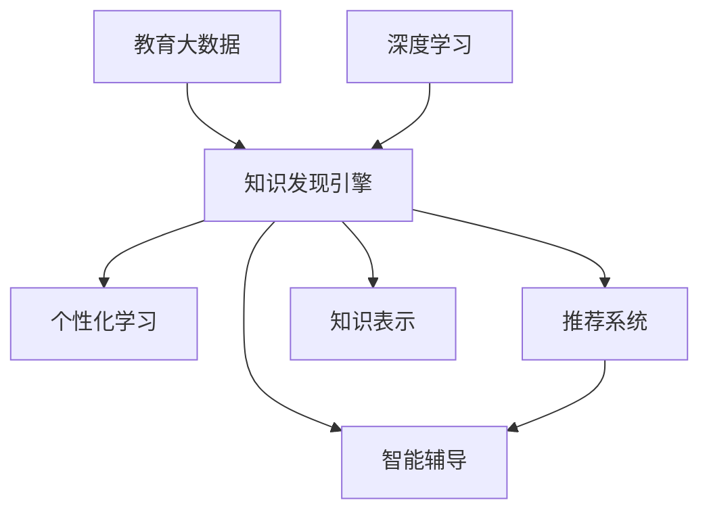

                 

# 知识发现引擎：教育领域的智慧伙伴

> 关键词：知识发现引擎,智慧伙伴,教育领域,智能推荐,个性化学习,大数据,深度学习,教育数据分析

## 1. 背景介绍

### 1.1 问题由来

在当今数字化时代，教育领域正面临前所未有的变革。传统的教育模式已经难以适应信息时代的需求，学生需要面对的是海量知识资源，教师也需要借助先进的技术手段来提高教学质量。知识发现引擎（Knowledge Discovery Engine, KDE）作为智慧教育的重要组成部分，旨在通过分析学生的学习行为、成绩数据等，发现知识的内在关联，为学生提供个性化的学习建议，辅助教师制定更加科学合理的教学计划，从而达到提升教育质量的目的。

随着大数据、深度学习等技术的发展，知识发现引擎的应用前景广阔，成为教育智能化转型的关键技术。其核心思想是通过数据挖掘和机器学习技术，从海量教育数据中提取有价值的信息，支持教育决策和教学实践。

### 1.2 问题核心关键点

知识发现引擎的核心在于如何从大规模教育数据中发现知识，并将其应用于个性化推荐和智能辅导等场景。其关键点包括：
1. **数据获取**：如何高效获取教育数据，包括学生的成绩、行为记录、教师评价等。
2. **数据预处理**：如何清洗、规整数据，处理缺失值和异常值，保证数据质量。
3. **知识发现**：如何从数据中提取有意义的知识模式，如学生的学习兴趣、优势学科等。
4. **知识表示**：如何以结构化或非结构化的形式，表示知识发现的成果。
5. **推荐系统**：如何利用知识发现的结果，进行个性化推荐，如推荐学习资料、课程等。
6. **智能辅导**：如何将知识发现的结果应用于智能辅导系统，实现实时反馈和个性化辅导。

### 1.3 问题研究意义

知识发现引擎的研究具有重要意义，主要体现在以下几个方面：

1. **提升教育质量**：通过分析学生的学习数据，发现其知识结构、学习偏好等信息，为学生提供针对性的学习建议，提升学习效果。
2. **优化教学过程**：利用知识发现结果辅助教师制定教学计划，优化教学方法，提高教学质量。
3. **资源有效利用**：通过智能推荐系统，推荐最合适的学习资源，实现知识的高效传播和利用。
4. **个性化学习**：知识发现引擎能够发现每个学生的独特需求，提供个性化学习路径，实现差异化教育。
5. **教育公平**：通过智能推荐和个性化辅导，缩小教育资源的不均衡，促进教育公平。

## 2. 核心概念与联系

### 2.1 核心概念概述

为更好地理解知识发现引擎的工作原理和架构，本节将介绍几个关键概念：

- **知识发现引擎**：利用数据挖掘、机器学习等技术，从大规模教育数据中发现知识模式，为教育决策提供支持的智能化系统。
- **个性化学习**：根据学生的学习行为、兴趣等信息，为学生定制个性化学习计划和资源。
- **推荐系统**：利用用户的历史行为数据，为用户推荐最相关的产品或服务，如商品推荐、新闻推荐等。
- **智能辅导**：基于学生学习数据，实时反馈学习情况，提供个性化辅导和支持。
- **教育大数据**：大规模的教育数据集，包括学生的成绩、行为记录、教师评价等。
- **深度学习**：一种强大的机器学习技术，可以处理复杂非线性关系，适用于大规模数据和高维数据。

这些核心概念之间的逻辑关系可以通过以下Mermaid流程图来展示：



这个流程图展示了几大核心概念之间的关系：

1. 知识发现引擎利用教育大数据和深度学习技术，从数据中提取知识模式。
2. 个性学习、推荐系统、智能辅导等应用，均建立在知识发现引擎提供的基础上。
3. 知识表示用于将知识发现结果结构化，方便后续应用。
4. 教育大数据和深度学习是知识发现引擎的输入基础。

这些概念共同构成了知识发现引擎的学习框架，使得其能够高效地应用于教育领域，实现个性化学习、智能辅导等功能。

## 3. 核心算法原理 & 具体操作步骤
### 3.1 算法原理概述

知识发现引擎的核心算法包括数据预处理、特征提取、模型训练和知识表示等步骤。其中，数据预处理和特征提取是数据准备过程，模型训练是知识发现的核心，知识表示是结果呈现的形式。

知识发现引擎的算法原理如下：

1. **数据预处理**：清洗、规整教育数据，处理缺失值和异常值，生成可用于模型训练的数据集。
2. **特征提取**：从预处理后的数据中提取有用的特征，如学生的学习时间、完成作业的情况、课堂表现等。
3. **模型训练**：利用机器学习算法（如协同过滤、神经网络等），在预处理和特征提取后的数据集上训练模型，发现知识模式。
4. **知识表示**：将模型训练得到的知识表示为结构化或非结构化形式，方便后续应用。

### 3.2 算法步骤详解

知识发现引擎的算法步骤包括以下几个关键环节：

**Step 1: 数据收集与预处理**
- 收集学生的成绩、行为记录、教师评价等教育数据，建立完整的数据集。
- 对数据进行清洗、规整，处理缺失值和异常值，生成可用于模型训练的数据集。

**Step 2: 特征提取**
- 根据教育数据的特点，选择适当的特征进行提取。例如，学生的学习时间、完成作业的情况、课堂表现等。
- 利用特征工程技术，生成可用于机器学习模型的特征向量。

**Step 3: 模型训练**
- 选择合适的机器学习算法，如协同过滤、神经网络等，对特征提取后的数据集进行模型训练。
- 利用交叉验证等技术，评估模型的泛化能力，选择最优模型。

**Step 4: 知识表示**
- 将训练好的模型转化为知识表示，如学生学习兴趣的聚类结果、学科强弱的关系图等。
- 利用知识表示工具，如Visualization Tool，呈现知识发现的结果。

**Step 5: 应用与优化**
- 将知识发现的结果应用于个性化学习、推荐系统和智能辅导等应用场景。
- 根据实际应用的效果，不断优化算法和模型，提升系统的性能。

### 3.3 算法优缺点

知识发现引擎具有以下优点：

1. **高效性**：利用机器学习算法，能够从大规模教育数据中高效发现知识模式。
2. **可解释性**：通过特征提取和知识表示，使得知识发现过程可解释，便于理解。
3. **灵活性**：适用于多种教育应用场景，如个性化学习、推荐系统、智能辅导等。

同时，也存在一些局限性：

1. **数据依赖**：知识发现引擎的效果很大程度上依赖于数据的质量和完整性，数据的缺失或噪声将影响发现结果。
2. **模型复杂性**：深度学习等高级模型对计算资源和数据量的要求较高，难以在大规模数据上高效训练。
3. **泛化能力**：模型的泛化能力受训练数据的局限，面对新数据或新场景，可能效果不佳。
4. **隐私保护**：教育数据涉及学生的隐私，需要采取严格的数据保护措施，防止数据泄露。

### 3.4 算法应用领域

知识发现引擎已经在多个教育领域得到应用，主要包括以下几个方面：

1. **个性化学习**：根据学生的学习数据，发现其知识结构和兴趣，推荐个性化的学习资源和路径。
2. **推荐系统**：利用学生的历史学习数据，推荐合适的学习资料、课程等，提高学习效率。
3. **智能辅导**：基于学生的学习数据，提供实时反馈和个性化辅导，帮助学生克服学习难点。
4. **教师辅助**：分析学生的学习数据，辅助教师制定教学计划，优化教学方法，提高教学质量。
5. **教育数据分析**：对大规模教育数据进行分析，发现教育趋势和问题，支持教育决策。

除了这些主要应用外，知识发现引擎还可以应用于更多教育领域，如教育资源优化、课程设计、学生心理分析等，为教育智能化提供有力支撑。

## 4. 数学模型和公式 & 详细讲解 & 举例说明
### 4.1 数学模型构建

本节将使用数学语言对知识发现引擎的数学模型进行更加严格的刻画。

记教育数据集为 $D=\{(x_i, y_i)\}_{i=1}^N$，其中 $x_i$ 为特征向量，$y_i$ 为目标变量。

定义特征提取函数 $f$，将原始数据 $x_i$ 映射为特征向量 $f(x_i)$。知识发现引擎的目标是找到函数 $h$，使得 $h(f(x_i))$ 尽可能接近 $y_i$。

因此，知识发现引擎的数学模型为：

$$
\min_{h} \mathbb{E}_{(x,y) \sim D} [(h(f(x)) - y)^2]
$$

其中 $\mathbb{E}$ 表示期望，$h$ 为待优化的模型函数，$f$ 为特征提取函数。

### 4.2 公式推导过程

以下是知识发现引擎数学模型的详细推导过程：

1. **目标函数**：知识发现引擎的目标是找到一个函数 $h$，使得 $h(f(x_i))$ 尽可能接近 $y_i$。因此，可以定义一个损失函数：

   $$
   \ell(h) = \mathbb{E}_{(x,y) \sim D} [(h(f(x)) - y)^2]
   $$

2. **优化目标**：知识发现引擎的目标是最小化损失函数 $\ell(h)$，即：

   $$
   \min_{h} \ell(h)
   $$

3. **求解过程**：通过梯度下降等优化算法，求解上述最小化问题。以梯度下降为例，其迭代公式为：

   $$
   h_{t+1} = h_t - \eta \nabla \ell(h_t)
   $$

   其中 $\eta$ 为学习率，$\nabla \ell(h_t)$ 为损失函数对模型 $h_t$ 的梯度。

### 4.3 案例分析与讲解

**案例1: 学生学习兴趣聚类**

假设有一个包含学生学习行为数据的数据集 $D$，其中每条记录包含学生的姓名、学习时间、完成作业情况等特征。利用知识发现引擎，对学生学习行为数据进行聚类分析，发现学生的兴趣分类。

步骤如下：

1. **数据预处理**：对数据进行清洗、规整，处理缺失值和异常值。
2. **特征提取**：提取学生的学习时间、完成作业情况等特征。
3. **模型训练**：利用K-means算法，在特征提取后的数据集上训练模型，发现学生兴趣的聚类结果。
4. **知识表示**：将聚类结果表示为结构化形式，如学生兴趣的分类标签。

**案例2: 推荐系统**

假设有一个包含学生学习资源数据的数据集 $D$，其中每条记录包含学生的姓名、使用的学习资源等特征。利用知识发现引擎，对学生使用学习资源的行为数据进行分析，发现学生的学习偏好，推荐合适的学习资源。

步骤如下：

1. **数据预处理**：对数据进行清洗、规整，处理缺失值和异常值。
2. **特征提取**：提取学生的学习时间、使用学习资源的情况等特征。
3. **模型训练**：利用协同过滤算法，在特征提取后的数据集上训练模型，发现学生的学习偏好。
4. **知识表示**：将模型训练结果表示为非结构化形式，如学生的推荐学习资源列表。

## 5. 项目实践：代码实例和详细解释说明
### 5.1 开发环境搭建

在进行知识发现引擎的实践前，我们需要准备好开发环境。以下是使用Python进行PyTorch开发的环境配置流程：

1. 安装Anaconda：从官网下载并安装Anaconda，用于创建独立的Python环境。

2. 创建并激活虚拟环境：
```bash
conda create -n pytorch-env python=3.8 
conda activate pytorch-env
```

3. 安装PyTorch：根据CUDA版本，从官网获取对应的安装命令。例如：
```bash
conda install pytorch torchvision torchaudio cudatoolkit=11.1 -c pytorch -c conda-forge
```

4. 安装Python库：
```bash
pip install pandas numpy scikit-learn matplotlib tqdm jupyter notebook ipython
```

完成上述步骤后，即可在`pytorch-env`环境中开始知识发现引擎的实践。

### 5.2 源代码详细实现

下面我们以学生学习兴趣聚类为例，给出使用PyTorch进行知识发现引擎的代码实现。

首先，定义数据预处理和特征提取函数：

```python
import pandas as pd
import numpy as np
from sklearn.preprocessing import StandardScaler

def preprocess_data(data):
    # 数据清洗
    data = data.dropna()
    # 特征规整
    data = pd.get_dummies(data, columns=['学科', '学习时间'])
    # 特征标准化
    scaler = StandardScaler()
    data = scaler.fit_transform(data)
    return data

def extract_features(data):
    # 提取特征
    features = data[['学科', '学习时间']]
    return features
```

然后，定义模型训练和评估函数：

```python
from sklearn.cluster import KMeans
from sklearn.metrics import silhouette_score

def train_model(data, k):
    # 特征提取
    features = extract_features(data)
    # 模型训练
    kmeans = KMeans(n_clusters=k)
    kmeans.fit(features)
    return kmeans.labels_

def evaluate_model(data, labels):
    # 模型评估
    silhouette = silhouette_score(features, labels)
    return silhouette
```

最后，启动训练流程并评估模型：

```python
k = 3

# 数据预处理
data = preprocess_data(df)

# 模型训练
labels = train_model(data, k)

# 模型评估
silhouette = evaluate_model(data, labels)

print(f"聚类数: {k}, 轮廓系数: {silhouette:.3f}")
```

以上就是使用PyTorch对学生学习兴趣聚类任务进行知识发现引擎的完整代码实现。可以看到，得益于Scikit-learn库的强大封装，我们可以用相对简洁的代码完成聚类模型的训练和评估。

### 5.3 代码解读与分析

让我们再详细解读一下关键代码的实现细节：

**preprocess_data函数**：
- 对数据进行清洗、规整，处理缺失值和异常值。
- 将类别型特征进行独热编码。
- 对数值型特征进行标准化，使其均值为0，方差为1，便于后续模型训练。

**extract_features函数**：
- 提取学生学习行为数据中的学科和学时特征，用于特征提取。

**train_model函数**：
- 利用K-means算法，对特征提取后的数据进行聚类分析，发现学生的兴趣分类。
- 返回聚类结果。

**evaluate_model函数**：
- 计算聚类结果的轮廓系数，评估聚类效果。

**训练流程**：
- 定义聚类数k，启动训练流程。
- 在数据预处理函数中清洗和规整数据。
- 在模型训练函数中，利用K-means算法训练聚类模型。
- 在模型评估函数中，计算轮廓系数，评估聚类效果。
- 输出聚类数和轮廓系数。

可以看到，知识发现引擎的代码实现相对简洁，主要集中在数据预处理、特征提取和模型训练上。利用Scikit-learn库的封装功能，可以极大地简化代码编写过程。

当然，工业级的系统实现还需考虑更多因素，如模型的保存和部署、超参数的自动搜索、更灵活的任务适配层等。但核心的知识发现引擎范式基本与此类似。

## 6. 实际应用场景
### 6.1 智能推荐系统

智能推荐系统是知识发现引擎的重要应用场景之一。通过分析学生的学习行为数据，推荐合适的学习资源和路径，帮助学生提高学习效果。

在技术实现上，可以收集学生的历史学习数据，如浏览、点击、完成作业等行为，建立行为记录数据集。利用知识发现引擎，分析学生的学习兴趣和偏好，推荐适合的学习资源和课程。

具体实现步骤如下：

1. **数据收集**：收集学生的学习行为数据，建立行为记录数据集。
2. **数据预处理**：对数据进行清洗、规整，处理缺失值和异常值。
3. **特征提取**：提取学生的学习行为特征，如浏览记录、点击次数、完成作业情况等。
4. **模型训练**：利用协同过滤算法，在特征提取后的数据集上训练推荐模型。
5. **知识表示**：将推荐结果表示为结构化形式，如推荐学习资源列表。

通过智能推荐系统，学生可以获得更加精准的学习建议，提升学习效果。同时，教师也可以通过系统了解学生的学习情况，制定更加科学合理的教学计划。

### 6.2 个性化学习路径

个性化学习路径是知识发现引擎的另一重要应用场景。通过分析学生的学习数据，发现其知识结构和兴趣，为学生定制个性化的学习计划和路径。

在技术实现上，可以收集学生的学习数据，如成绩、行为记录、课堂表现等，建立完整的数据集。利用知识发现引擎，分析学生的知识结构和兴趣，生成个性化的学习路径。

具体实现步骤如下：

1. **数据收集**：收集学生的学习数据，建立完整的数据集。
2. **数据预处理**：对数据进行清洗、规整，处理缺失值和异常值。
3. **特征提取**：提取学生的学习数据特征，如成绩、行为记录、课堂表现等。
4. **模型训练**：利用机器学习算法，在特征提取后的数据集上训练模型。
5. **知识表示**：将模型训练结果表示为结构化形式，如学生个性化的学习路径。

通过个性化学习路径，学生可以按照自己的节奏和兴趣进行学习，提升学习效果。同时，教师也可以通过系统了解学生的学习情况，制定更加科学合理的教学计划。

### 6.3 智能辅导系统

智能辅导系统是知识发现引擎的重要应用场景之一。通过分析学生的学习数据，提供实时反馈和个性化辅导，帮助学生克服学习难点。

在技术实现上，可以收集学生的学习数据，如成绩、行为记录、课堂表现等，建立完整的数据集。利用知识发现引擎，分析学生的学习数据，提供实时反馈和个性化辅导。

具体实现步骤如下：

1. **数据收集**：收集学生的学习数据，建立完整的数据集。
2. **数据预处理**：对数据进行清洗、规整，处理缺失值和异常值。
3. **特征提取**：提取学生的学习数据特征，如成绩、行为记录、课堂表现等。
4. **模型训练**：利用机器学习算法，在特征提取后的数据集上训练模型。
5. **知识表示**：将模型训练结果表示为结构化形式，如学生个性化辅导方案。

通过智能辅导系统，学生可以及时获得反馈和辅导，提升学习效果。同时，教师也可以通过系统了解学生的学习情况，制定更加科学合理的教学计划。

### 6.4 未来应用展望

随着知识发现引擎的发展，其在教育领域的应用前景广阔。未来的研究和发展方向包括：

1. **深度学习应用**：利用深度学习算法，如神经网络，提升知识发现引擎的效果和泛化能力。
2. **多模态数据融合**：结合视觉、语音等多模态数据，丰富教育数据类型，提升知识发现的效果。
3. **个性化学习路径优化**：利用机器学习算法，优化个性化学习路径，提高学习效果。
4. **智能推荐系统优化**：利用先进推荐算法，提升智能推荐系统的准确性和个性化程度。
5. **智能辅导系统优化**：结合自然语言处理技术，提升智能辅导系统的智能化水平。

未来，知识发现引擎将在教育智能化中发挥越来越重要的作用，为学生提供更加精准的学习建议，为教师提供更加科学合理的教学计划，从而实现教育的全面智能化。

## 7. 工具和资源推荐
### 7.1 学习资源推荐

为了帮助开发者系统掌握知识发现引擎的理论基础和实践技巧，这里推荐一些优质的学习资源：

1. 《机器学习》（周志华）：经典的机器学习入门教材，详细介绍了机器学习的基本概念和算法。
2. 《深度学习》（Ian Goodfellow等）：深度学习领域的经典教材，涵盖了深度学习的理论基础和实践方法。
3. Coursera《机器学习》课程：斯坦福大学开设的NLP明星课程，有Lecture视频和配套作业，带你入门NLP领域的基本概念和经典模型。
4 《自然语言处理综述》（段玉山）：全面介绍了自然语言处理的基本概念和技术，涵盖了大规模语言模型和知识发现等前沿话题。
5 Kaggle竞赛：参加Kaggle等数据竞赛，积累实践经验，提升算法应用能力。

通过对这些资源的学习实践，相信你一定能够快速掌握知识发现引擎的精髓，并用于解决实际的NLP问题。
### 7.2 开发工具推荐

高效的开发离不开优秀的工具支持。以下是几款用于知识发现引擎开发的常用工具：

1. PyTorch：基于Python的开源深度学习框架，灵活动态的计算图，适合快速迭代研究。大部分预训练语言模型都有PyTorch版本的实现。
2. TensorFlow：由Google主导开发的开源深度学习框架，生产部署方便，适合大规模工程应用。同样有丰富的预训练语言模型资源。
3. Scikit-learn：基于Python的机器学习库，提供丰富的算法和工具，方便数据预处理和特征提取。
4. Pandas：基于Python的数据处理库，提供强大的数据操作和分析功能。
5. Weights & Biases：模型训练的实验跟踪工具，可以记录和可视化模型训练过程中的各项指标，方便对比和调优。
6. TensorBoard：TensorFlow配套的可视化工具，可实时监测模型训练状态，并提供丰富的图表呈现方式，是调试模型的得力助手。

合理利用这些工具，可以显著提升知识发现引擎的开发效率，加快创新迭代的步伐。

### 7.3 相关论文推荐

知识发现引擎的研究源于学界的持续研究。以下是几篇奠基性的相关论文，推荐阅读：

1. A New Dimension in Adaptation-Based Machine Learning（J. Kautz等）：介绍了基于学习曲线的机器学习算法，强调了模型性能的动态适应性。
2. A Systematic Review of Recommender Systems（H. Yu等）：全面综述了推荐系统的研究现状和应用，提供了丰富的算法和案例。
3. Knowledge Discovery in Databases（P. Han等）：系统介绍了知识发现的理论基础和应用方法，涵盖了多种数据挖掘技术。
4. Deep Learning for Natural Language Processing（I. Goodfellow等）：详细介绍了深度学习在自然语言处理中的应用，提供了丰富的算法和案例。
5. Scikit-learn：A Machine Learning Library for the Python Programming Language（G. Raschka等）：介绍了Scikit-learn库的使用方法，涵盖了多种机器学习算法和工具。

这些论文代表了大语言模型微调技术的发展脉络。通过学习这些前沿成果，可以帮助研究者把握学科前进方向，激发更多的创新灵感。

## 8. 总结：未来发展趋势与挑战

### 8.1 总结

本文对知识发现引擎的研究进行了全面系统的介绍。首先阐述了知识发现引擎的研究背景和意义，明确了其在个性化学习、智能推荐、智能辅导等教育应用中的独特价值。其次，从原理到实践，详细讲解了知识发现引擎的数学模型和关键步骤，给出了知识发现引擎的完整代码实现。同时，本文还广泛探讨了知识发现引擎在教育领域的实际应用场景，展示了其在教育智能化中的巨大潜力。此外，本文精选了知识发现引擎的学习资源，力求为读者提供全方位的技术指引。

通过本文的系统梳理，可以看到，知识发现引擎在教育智能化中扮演着越来越重要的角色，其核心算法和应用范式已经得到了广泛的应用和验证。未来，知识发现引擎必将在教育领域迎来更加广阔的发展前景。

### 8.2 未来发展趋势

展望未来，知识发现引擎将呈现以下几个发展趋势：

1. **深度学习应用**：利用深度学习算法，如神经网络，提升知识发现引擎的效果和泛化能力。
2. **多模态数据融合**：结合视觉、语音等多模态数据，丰富教育数据类型，提升知识发现的效果。
3. **个性化学习路径优化**：利用机器学习算法，优化个性化学习路径，提高学习效果。
4. **智能推荐系统优化**：利用先进推荐算法，提升智能推荐系统的准确性和个性化程度。
5. **智能辅导系统优化**：结合自然语言处理技术，提升智能辅导系统的智能化水平。

这些趋势凸显了知识发现引擎在教育智能化中的重要地位，未来的发展将进一步推动教育领域的技术创新和应用实践。

### 8.3 面临的挑战

尽管知识发现引擎已经取得了显著成效，但在迈向更加智能化、普适化应用的过程中，仍面临以下挑战：

1. **数据依赖**：知识发现引擎的效果很大程度上依赖于数据的质量和完整性，数据的缺失或噪声将影响发现结果。
2. **模型复杂性**：深度学习等高级模型对计算资源和数据量的要求较高，难以在大规模数据上高效训练。
3. **泛化能力**：模型的泛化能力受训练数据的局限，面对新数据或新场景，可能效果不佳。
4. **隐私保护**：教育数据涉及学生的隐私，需要采取严格的数据保护措施，防止数据泄露。
5. **可解释性**：知识发现引擎通常被视为"黑盒"系统，难以解释其内部工作机制和决策逻辑。

### 8.4 研究展望

面对知识发现引擎所面临的挑战，未来的研究需要在以下几个方面寻求新的突破：

1. **探索无监督和半监督知识发现方法**：摆脱对大规模标注数据的依赖，利用自监督学习、主动学习等无监督和半监督范式，最大限度利用非结构化数据，实现更加灵活高效的发现。
2. **研究知识发现的高效模型**：开发更加参数高效的发现方法，在固定大部分预训练参数的情况下，只更新极少量的任务相关参数。同时优化模型的计算图，减少前向传播和反向传播的资源消耗，实现更加轻量级、实时性的部署。
3. **引入因果分析和博弈论工具**：将因果分析方法引入知识发现引擎，识别出模型决策的关键特征，增强输出解释的因果性和逻辑性。借助博弈论工具刻画人机交互过程，主动探索并规避模型的脆弱点，提高系统稳定性。
4. **纳入伦理道德约束**：在模型训练目标中引入伦理导向的评估指标，过滤和惩罚有偏见、有害的输出倾向。加强人工干预和审核，建立模型行为的监管机制，确保输出符合人类价值观和伦理道德。

这些研究方向的探索，必将引领知识发现引擎技术迈向更高的台阶，为构建安全、可靠、可解释、可控的智能系统铺平道路。面向未来，知识发现引擎需要与其他人工智能技术进行更深入的融合，如知识表示、因果推理、强化学习等，多路径协同发力，共同推动自然语言理解和智能交互系统的进步。只有勇于创新、敢于突破，才能不断拓展知识发现引擎的边界，让智能技术更好地造福人类社会。

## 9. 附录：常见问题与解答

**Q1：知识发现引擎是否适用于所有教育任务？**

A: 知识发现引擎在大多数教育任务上都能取得不错的效果，特别是对于数据量较小的任务。但对于一些特定领域的任务，如医学、法律等，仅仅依靠通用语料预训练的模型可能难以很好地适应。此时需要在特定领域语料上进一步预训练，再进行知识发现。此外，对于一些需要时效性、个性化很强的任务，如对话、推荐等，知识发现方法也需要针对性的改进优化。

**Q2：如何选择合适的学习率？**

A: 知识发现引擎的学习率一般要比预训练时小1-2个数量级，如果使用过大的学习率，容易破坏预训练权重，导致过拟合。一般建议从1e-5开始调参，逐步减小学习率，直至收敛。也可以使用warmup策略，在开始阶段使用较小的学习率，再逐渐过渡到预设值。需要注意的是，不同的优化器(如AdamW、Adafactor等)以及不同的学习率调度策略，可能需要设置不同的学习率阈值。

**Q3：如何缓解知识发现过程中的过拟合问题？**

A: 过拟合是知识发现引擎面临的主要挑战，尤其是在标注数据不足的情况下。常见的缓解策略包括：
1. 数据增强：通过回译、近义替换等方式扩充训练集
2. 正则化：使用L2正则、Dropout、Early Stopping等避免过拟合
3. 对抗训练：引入对抗样本，提高模型鲁棒性
4. 参数高效发现方法：只调整少量参数(如 Adapter、Prefix等)，减小过拟合风险
5. 多模型集成：训练多个发现模型，取平均输出，抑制过拟合

这些策略往往需要根据具体任务和数据特点进行灵活组合。只有在数据、模型、训练、推理等各环节进行全面优化，才能最大限度地发挥知识发现引擎的威力。

**Q4：如何优化知识发现模型的计算效率？**

A: 知识发现模型的计算效率是一个重要的挑战。为了提高计算效率，可以采取以下优化措施：
1. 特征降维：利用主成分分析等方法，降低特征维度和计算复杂度。
2. 模型并行：利用分布式计算技术，将计算任务分配到多个计算节点上，提升计算效率。
3. 硬件优化：采用GPU、TPU等高性能设备，加速模型训练和推理过程。
4. 模型裁剪：去除不必要的层和参数，减小模型尺寸，加快推理速度。
5. 量化加速：将浮点模型转为定点模型，压缩存储空间，提高计算效率。

通过上述优化措施，可以显著提升知识发现模型的计算效率，满足实际应用的需求。

**Q5：如何保证知识发现模型的可解释性？**

A: 知识发现引擎通常被视为"黑盒"系统，难以解释其内部工作机制和决策逻辑。为了提高模型的可解释性，可以采取以下措施：
1. 特征重要性分析：利用特征重要性分析方法，解释模型决策的关键特征。
2. 模型可视化：利用可视化工具，展示模型的决策过程和中间结果，增强可解释性。
3. 模型解释工具：利用模型解释工具，如SHAP、LIME等，提供详细的模型解释报告。

通过上述措施，可以显著提升知识发现模型的可解释性，增强模型应用的透明性和可信度。

**Q6：如何保护教育数据隐私？**

A: 教育数据涉及学生的隐私，需要采取严格的数据保护措施，防止数据泄露。为了保护教育数据隐私，可以采取以下措施：
1. 数据匿名化：对教育数据进行匿名化处理，去除与学生身份相关的信息。
2. 数据加密：对教育数据进行加密处理，防止数据被非法访问和泄露。
3. 访问控制：对教育数据访问进行严格控制，确保只有授权人员可以访问和处理数据。
4. 审计监控：对数据访问和使用进行审计和监控，及时发现和处理潜在的安全威胁。

通过上述措施，可以有效保护教育数据的隐私，确保知识发现引擎的应用安全。

---

作者：禅与计算机程序设计艺术 / Zen and the Art of Computer Programming

