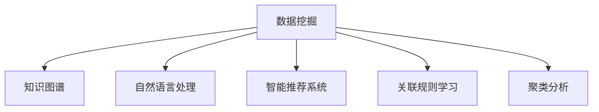

                 

# 知识发现引擎：赋能人类知识进化的加速器

> 关键词：知识发现引擎,数据挖掘,人工智能,机器学习,数据挖掘技术,大数据,知识图谱,智能推荐系统

## 1. 背景介绍

在信息爆炸的时代，如何有效处理和利用海量数据，提取和挖掘其中的知识，已成为各界关注的焦点。数据驱动决策、智能化服务、精准推荐等应用场景，都需要高效的知识发现引擎，在短时间内从海量数据中抽取出有价值的信息，赋能人类知识进化，驱动社会进步。

### 1.1 问题由来

随着互联网的普及和数字化进程的推进，人类每天产生的数据量呈爆炸式增长。以社交媒体、电商平台、金融交易、医疗健康等为代表的各类数据，蕴含着无尽的知识。如何从这些数据中挖掘出有用的信息，是业界亟待解决的重要问题。传统的基于规则和统计的方法，难以处理复杂多变的数据模式。而现代的知识发现引擎，利用人工智能和机器学习技术，能够从数据中自动发现关联规律，实现智能化的知识发现和信息抽取。

### 1.2 问题核心关键点

知识发现引擎的核心关键点在于：
1. 数据挖掘：从海量数据中自动抽取和分类知识信息。
2. 数据分析：对数据进行统计分析和模式识别。
3. 数据可视化：将复杂的数据信息以直观的形式展现给用户。
4. 知识融合：将不同数据源、不同领域的数据进行整合，形成全局视图。
5. 知识服务：将挖掘出的知识转化为可操作的智能服务，提升决策效率。

## 2. 核心概念与联系

### 2.1 核心概念概述

知识发现引擎通过数据挖掘技术，将数据转化为知识，赋能各行业决策和应用。其核心概念包括：

- **数据挖掘**：从数据中自动抽取模式、信息和知识的过程。
- **知识图谱**：用图形表示实体和实体间关系的知识结构。
- **自然语言处理**：利用机器学习技术处理和理解自然语言，提取其中的知识。
- **智能推荐系统**：通过用户行为数据，推荐用户可能感兴趣的信息。
- **关联规则学习**：从事务数据中发现关联规则，挖掘出潜在的知识。
- **聚类分析**：根据数据特征，将数据进行分类和群组分析。

这些概念通过以下Mermaid流程图展示它们之间的联系：



可以看出，数据挖掘是知识发现引擎的基础，其输出包括知识图谱、自然语言知识、智能推荐、关联规则和聚类分析结果。这些结果通过数据可视化展示给用户，成为知识服务的输入，最终用于实际应用。

## 3. 核心算法原理 & 具体操作步骤

### 3.1 算法原理概述

知识发现引擎的核心算法包括数据挖掘算法、模式识别算法、统计学习算法等。其原理如下：

1. **数据预处理**：清洗、归一化数据，消除噪声，提取有用特征。
2. **数据挖掘算法**：基于统计学习、机器学习等算法，自动发现数据中的模式和规律。
3. **知识图谱构建**：将挖掘出的实体和关系整合为知识图谱，便于全局分析。
4. **自然语言处理**：通过自然语言处理算法，从文本中提取关键信息，构建语义知识图谱。
5. **智能推荐算法**：利用机器学习算法，根据用户行为数据，推荐感兴趣的内容。

### 3.2 算法步骤详解

以下详细介绍知识发现引擎的核心算法步骤：

**Step 1: 数据收集与预处理**

1. 数据收集：通过网络爬虫、API接口等方式，从各类数据源收集数据。
2. 数据清洗：去除噪声、缺失值和异常值，确保数据质量。
3. 数据归一化：对数据进行标准化处理，统一度量单位。
4. 特征提取：选择有代表性的特征，提取重要信息。

**Step 2: 数据挖掘**

1. 关联规则学习：使用Apriori、FP-growth等算法，发现事务数据中的关联规则。
2. 聚类分析：使用K-means、层次聚类等算法，对数据进行分类和群组分析。
3. 分类与回归：使用决策树、支持向量机、神经网络等算法，对数据进行分类和预测。
4. 异常检测：使用孤立森林、LOF等算法，检测数据中的异常点。

**Step 3: 知识图谱构建**

1. 实体识别：使用命名实体识别(NER)算法，识别文本中的实体。
2. 关系抽取：使用关系抽取算法，发现实体间的语义关系。
3. 知识图谱存储：使用图数据库，存储和查询知识图谱。
4. 知识图谱扩展：通过引入新的数据，不断更新和扩展知识图谱。

**Step 4: 知识服务**

1. 智能推荐：根据用户历史行为数据，推荐相关内容。
2. 知识可视化：将知识图谱以图表形式展现，便于用户理解和使用。
3. 知识抽取：使用文本摘要、实体抽取等技术，从文本中提取关键信息。
4. 知识融合：将不同数据源的知识进行整合，形成全局视图。

### 3.3 算法优缺点

知识发现引擎具有以下优点：

1. 自动化高：通过算法自动化处理数据，减少人工干预，提高效率。
2. 效果显著：挖掘出的知识有助于决策、推荐和服务，带来显著效益。
3. 扩展性强：通过不断引入新数据，知识图谱可不断扩展和更新。

同时，其缺点包括：

1. 数据质量依赖性大：数据质量不高会影响算法效果。
2. 算法复杂度高：知识发现过程涉及多种算法，复杂度较高。
3. 可解释性差：一些复杂算法如深度学习，难以解释其内部机制。
4. 数据隐私问题：在处理敏感数据时，需考虑数据隐私和伦理问题。

## 4. 数学模型和公式 & 详细讲解 & 举例说明

### 4.1 数学模型构建

知识发现引擎的数学模型包括：

- 关联规则学习模型
- 聚类分析模型
- 分类与回归模型

### 4.2 公式推导过程

以关联规则学习为例，常用的Apriori算法包含以下步骤：

1. **频繁项集生成**：
   - 扫描数据集，生成频繁1-项集。
   - 利用剪枝算法去除低频项集。

2. **关联规则生成**：
   - 在频繁项集基础上生成关联规则。
   - 通过支持度和置信度筛选规则。

**Step 1: 数据预处理**

- 假设数据集为$D=\{T_1, T_2, \ldots, T_n\}$，其中$T_i$为事务，包含若干项$i_1, i_2, \ldots, i_m$。
- 预处理包括去除噪声、归一化处理等，确保数据质量。

**Step 2: 频繁项集生成**

- 利用剪枝算法，从$D$中生成频繁1-项集$F_1$。
- 迭代生成更高频繁度的项集$F_k$，直至满足最小支持度阈值$\alpha$。

**Step 3: 关联规则生成**

- 在$F_k$基础上生成候选规则$C_k$。
- 通过支持度和置信度筛选规则，得到最终关联规则。

### 4.3 案例分析与讲解

以电商推荐系统为例，假设系统需要推荐用户可能感兴趣的商品。用户历史行为数据为$D=\{T_1, T_2, \ldots, T_n\}$，其中$T_i$包含用户浏览、购买的历史商品记录。

1. **数据预处理**：去除无用记录、归一化处理等，生成清洗后的数据集$D'$。
2. **关联规则学习**：利用Apriori算法，从$D'$中生成频繁项集$F_1, F_2, \ldots$。
3. **关联规则生成**：根据频繁项集，生成关联规则$R_1, R_2, \ldots$。
4. **推荐算法**：利用规则$R_1, R_2, \ldots$，推荐用户可能感兴趣的商品。

通过以上步骤，系统能够根据用户历史行为数据，推荐相关商品，提升用户体验和销量。

## 5. 项目实践：代码实例和详细解释说明

### 5.1 开发环境搭建

在进行知识发现引擎项目实践前，需要准备好开发环境。以下是使用Python进行PyTorch开发的环境配置流程：

1. 安装Anaconda：从官网下载并安装Anaconda，用于创建独立的Python环境。
2. 创建并激活虚拟环境：
```bash
conda create -n pytorch-env python=3.8 
conda activate pytorch-env
```

3. 安装PyTorch：根据CUDA版本，从官网获取对应的安装命令。例如：
```bash
conda install pytorch torchvision torchaudio cudatoolkit=11.1 -c pytorch -c conda-forge
```

4. 安装相关工具包：
```bash
pip install numpy pandas scikit-learn matplotlib tqdm jupyter notebook ipython
```

完成上述步骤后，即可在`pytorch-env`环境中开始项目实践。

### 5.2 源代码详细实现

以下是一个简单的知识发现引擎实现，用于电商推荐系统：

```python
import pandas as pd
from surprise import Dataset, Reader, KNNBasic, accuracy
from surprise.model_selection import train_test_split

# 数据读取
data = pd.read_csv('user_browses.csv')
reader = Reader(rating_scale=(1, 5))
data = reader.load_bds(data)

# 数据预处理
data = data[data['item'] != '0']

# 划分训练集和测试集
trainset, testset = train_test_split(data, test_size=0.2, random_state=42)

# 模型训练
algo = KNNBasic(sim_options={'name': 'pearson_baseline', 'k': 50})
algo.fit(trainset)

# 模型评估
predictions = algo.test(testset)
accuracy.rmse(predictions)
```

### 5.3 代码解读与分析

**数据读取与预处理**

1. 使用pandas读取电商用户浏览记录，定义数据读取器。
2. 对数据进行清洗，去除无用的记录。
3. 划分训练集和测试集，用于模型评估。

**模型训练**

1. 使用KNN算法进行推荐，设定邻居数为50。
2. 使用Pearson基线相似度进行相似度计算。
3. 在训练集上训练模型，生成预测结果。

**模型评估**

1. 计算模型预测的均方根误差。
2. 评估模型的推荐准确率。

以上代码实现了一个简单的基于协同过滤的推荐系统。通过读取电商用户浏览数据，预处理数据，训练推荐模型，生成推荐结果，并评估模型性能。

## 6. 实际应用场景

### 6.1 电商推荐系统

电商推荐系统是知识发现引擎在商业领域的重要应用。通过分析用户浏览、购买历史，挖掘出用户的兴趣和行为模式，智能推荐用户可能感兴趣的商品，提升用户体验和销售额。

### 6.2 金融风控系统

金融行业面临诸多风险，知识发现引擎可以用于风险评估、欺诈检测、信用评分等。通过分析交易数据，挖掘出潜在风险因素，帮助金融机构提前预警风险，降低损失。

### 6.3 医疗健康系统

医疗健康系统需要处理海量病历数据，挖掘出疾病关联、治疗方案等信息。知识发现引擎可以帮助医院诊断疑难疾病，优化治疗方案，提高医疗服务水平。

### 6.4 未来应用展望

未来，知识发现引擎将在更多领域得到应用，为各行各业带来变革性影响。

1. 智能制造：通过分析生产数据，优化生产流程，降低成本，提升效率。
2. 智慧城市：利用传感器数据，挖掘城市运行规律，提升城市管理水平。
3. 农业智能：分析气象数据、土壤数据，提高农业生产效率，保障粮食安全。
4. 教育领域：通过分析学生数据，个性化推荐学习资源，提升教育质量。

知识发现引擎将在更多垂直领域大放异彩，成为推动各行各业数字化转型升级的重要工具。

## 7. 工具和资源推荐

### 7.1 学习资源推荐

为了帮助开发者系统掌握知识发现引擎的理论基础和实践技巧，这里推荐一些优质的学习资源：

1. 《Python数据挖掘与统计分析》书籍：介绍数据清洗、数据挖掘、统计分析等基础概念和算法。
2. 《深度学习与数据挖掘》课程：北京大学开设的在线课程，涵盖机器学习、数据挖掘、深度学习等核心内容。
3. Kaggle竞赛平台：提供丰富的数据集和挑战任务，实践数据挖掘技能，参与社区交流。
4. 《数据科学与数据工程》期刊：涵盖数据挖掘、数据管理、数据可视化等前沿研究，了解最新进展。
5. Coursera《数据科学与机器学习》课程：由加州大学戴维斯分校开设，系统介绍数据科学和机器学习的核心概念和方法。

通过对这些资源的学习实践，相信你一定能够快速掌握知识发现引擎的精髓，并用于解决实际的业务问题。

### 7.2 开发工具推荐

高效的开发离不开优秀的工具支持。以下是几款用于知识发现引擎开发的常用工具：

1. Python：作为数据科学和机器学习的主流语言，Python拥有丰富的数据处理和科学计算库，易于学习和使用。
2. R语言：特别适合统计分析和数据可视化，提供大量优秀的统计分析和可视化库。
3. Apache Spark：支持大规模数据处理，提供高效的分布式计算框架，适合大数据场景。
4. TensorFlow：谷歌开发的深度学习框架，支持高效计算和模型训练，适合复杂数据挖掘任务。
5. Weights & Biases：模型训练的实验跟踪工具，记录和可视化模型训练过程中的各项指标，方便对比和调优。
6. Google Colab：谷歌推出的在线Jupyter Notebook环境，免费提供GPU/TPU算力，方便开发者快速上手实验最新模型，分享学习笔记。

合理利用这些工具，可以显著提升知识发现引擎的开发效率，加快创新迭代的步伐。

### 7.3 相关论文推荐

知识发现引擎的发展源于学界的持续研究。以下是几篇奠基性的相关论文，推荐阅读：

1. "Association Rules and Itemset Mimers in Large Databases"：Gangkof，1993年提出关联规则学习，为知识发现引擎奠定了理论基础。
2. "k-Means: Algorithms for Vector Quantization"：Arthur和Vassilvitskii，2007年提出K-means聚类算法，广泛应用于知识发现引擎。
3. "The Elements of Statistical Learning"：Hastie等人，2009年介绍多种机器学习算法，包括回归、分类、聚类等。
4. "Deep Learning for NLP"：Goodfellow等人，2016年介绍深度学习在NLP中的应用，包括文本分类、语言生成等。
5. "Graph Neural Networks: A Review of Methods and Applications"：Scarselli等人，2018年综述了图神经网络在知识图谱中的应用，推动知识发现引擎向更高效、更智能的方向发展。

这些论文代表了大数据挖掘技术的发展脉络。通过学习这些前沿成果，可以帮助研究者把握学科前进方向，激发更多的创新灵感。

## 8. 总结：未来发展趋势与挑战

### 8.1 总结

本文对知识发现引擎的核心概念、算法原理和操作步骤进行了全面系统的介绍。从数据预处理到知识服务，每个环节都有详细的描述和解释。通过本文的学习，读者可以系统了解知识发现引擎的实现方法和应用场景。

### 8.2 未来发展趋势

展望未来，知识发现引擎将呈现以下几个发展趋势：

1. 自动化程度提升：自动化处理数据，减少人工干预，提高效率。
2. 算法模型多样化：引入更多先进的算法模型，提升发现知识的深度和广度。
3. 实时性增强：优化算法性能，提高数据处理和知识发现的实时性。
4. 跨领域融合：将知识发现引擎与其他技术结合，如AI、区块链等，提升综合能力。
5. 安全性保障：加强数据隐私和模型安全，确保数据和知识的安全性。
6. 伦理道德约束：引入伦理导向的评估指标，避免算法偏见和歧视。

### 8.3 面临的挑战

尽管知识发现引擎在各个领域取得了显著成效，但在迈向更加智能化、普适化应用的过程中，仍面临诸多挑战：

1. 数据质量瓶颈：数据质量不高会影响算法效果。
2. 算法复杂度高：知识发现过程涉及多种算法，复杂度较高。
3. 可解释性差：一些复杂算法如深度学习，难以解释其内部机制。
4. 数据隐私问题：在处理敏感数据时，需考虑数据隐私和伦理问题。
5. 高成本投入：知识发现引擎的开发和部署需要大量计算资源和人力资源。
6. 算法泛化能力差：在处理新数据时，部分算法可能无法很好地适应。

### 8.4 研究展望

未来，知识发现引擎的研究需要在以下几个方面寻求新的突破：

1. 优化数据预处理：提高数据质量，减少预处理步骤。
2. 简化算法复杂度：优化算法性能，降低计算复杂度。
3. 提高可解释性：引入可解释性强的算法，增强模型透明度。
4. 强化数据隐私保护：加强数据加密和匿名化处理，保护数据隐私。
5. 降低成本投入：提高算法效率，减少计算资源和人力资源的投入。
6. 提升泛化能力：引入更多的数据和领域，提升算法的泛化能力。

这些研究方向将推动知识发现引擎技术向更加高效、智能、安全的方向发展。相信随着学界和产业界的共同努力，知识发现引擎必将在各行各业大放异彩，成为推动人类知识进化的重要工具。

## 9. 附录：常见问题与解答

**Q1：数据预处理是否对知识发现引擎的效果有影响？**

A: 是的。数据预处理是知识发现引擎的重要环节，数据质量直接影响算法效果。预处理包括数据清洗、归一化、特征选择等，可以去除噪声，提高数据质量，增强算法性能。

**Q2：知识发现引擎是否适用于所有领域？**

A: 不完全适用。知识发现引擎的适用性取决于数据类型和任务特点。例如，在金融、医疗等领域，需要处理大量结构化数据，而在NLP领域，则需要处理文本数据。需要根据具体需求选择合适的方法。

**Q3：如何提高知识发现引擎的可解释性？**

A: 可解释性是知识发现引擎的重要研究方向。提高可解释性可以通过以下方法：
1. 使用可解释性强的算法，如决策树、逻辑回归等。
2. 引入特征选择，解释算法输出。
3. 利用可视化工具，展示数据和模型信息。
4. 引入领域专家，解释算法结果。

**Q4：知识发现引擎的开发和部署成本如何？**

A: 知识发现引擎的开发和部署成本较高，涉及大量数据处理和算法优化。但随着技术的发展，一些开源工具和云服务提供了便捷的解决方案，降低了开发成本。需要根据具体需求选择合适的开发和部署策略。

**Q5：知识发现引擎的未来发展方向是什么？**

A: 知识发现引擎的未来发展方向包括：
1. 自动化程度提升：自动化处理数据，减少人工干预。
2. 算法模型多样化：引入更多先进的算法模型，提升发现知识的深度和广度。
3. 实时性增强：优化算法性能，提高数据处理和知识发现的实时性。
4. 跨领域融合：将知识发现引擎与其他技术结合，如AI、区块链等，提升综合能力。
5. 安全性保障：加强数据隐私和模型安全，确保数据和知识的安全性。
6. 伦理道德约束：引入伦理导向的评估指标，避免算法偏见和歧视。

这些方向将推动知识发现引擎技术向更加高效、智能、安全的方向发展。

---

作者：禅与计算机程序设计艺术 / Zen and the Art of Computer Programming

