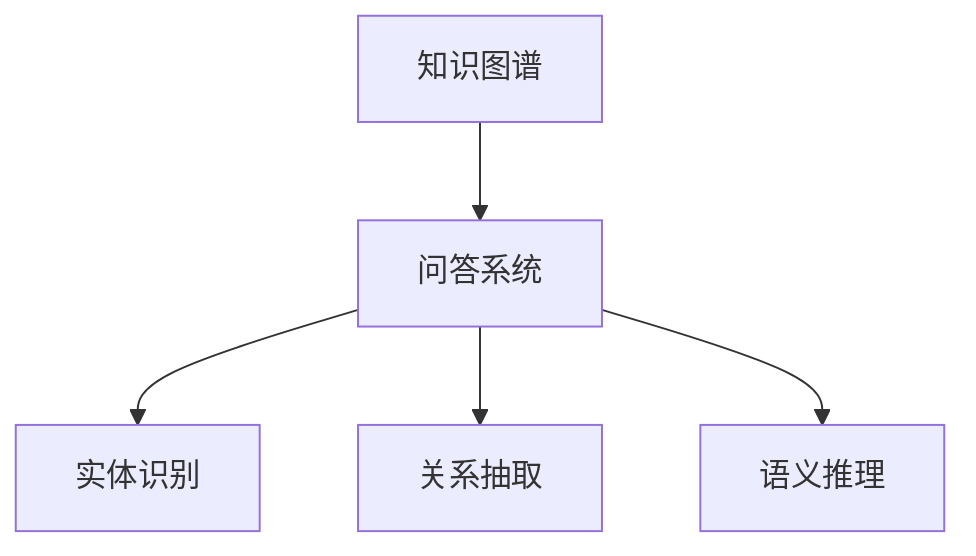

                 

# 知识图谱与问答系统：结构化知识的应用

## 1. 背景介绍

### 1.1 问题由来

在现代信息技术不断发展的背景下，人类社会对知识的需求日益增长。传统的知识获取方式，如书本、百科全书等，难以满足用户对知识迅速获取的需求。与此同时，互联网上的信息海量化也给用户带来了信息过载的问题，传统搜索引擎已无法满足用户在特定场景下的知识需求。

知识图谱(Knowledge Graph)作为一种结构化知识表示方式，通过节点和边结构，将实体、属性和关系映射为数据图谱，实现对结构化知识的深度挖掘和关联分析。问答系统(Question Answering System, QA)则通过结合知识图谱，提供针对用户查询的自然语言交互，快速获取目标信息。

### 1.2 问题核心关键点

知识图谱与问答系统的结合，构建了全新的知识获取方式，让用户通过简单的自然语言问答，就能快速获取所需的信息，有效缓解了信息过载和信息碎片化的问题。然而，在实际应用中，如何高效构建和应用知识图谱，设计出高性能的问答系统，仍然是一个重要的挑战。

知识图谱构建涉及大规模结构化数据的存储、清洗、融合等，是问答系统有效运行的基础。问答系统设计需要考虑自然语言理解、实体识别、逻辑推理等复杂问题，其性能直接影响着系统的实用性。

## 2. 核心概念与联系

### 2.1 核心概念概述

为更好地理解知识图谱与问答系统的融合机制，本节将介绍几个密切相关的核心概念：

- 知识图谱(Knowledge Graph)：一种结构化的知识表示方式，通过节点和边结构，将实体、属性和关系映射为数据图谱。知识图谱在语义搜索、信息抽取、推荐系统等领域有广泛应用。

- 问答系统(Question Answering System)：利用自然语言理解技术，自动回答用户提出的问题，获取目标信息的系统。问答系统包括问答对获取、语义分析、推理生成等核心模块。

- 实体识别(Entity Recognition)：识别文本中具体的实体名称，如人名、地名、机构名等，是问答系统的重要组成部分。

- 关系抽取(Relationship Extraction)：从文本中抽取实体之间的语义关系，如“张三在李四的左边”，是知识图谱构建的重要步骤。

- 语义推理(Semantic Reasoning)：根据已有的知识和规则，推理出未知的实体属性，是问答系统推理生成模块的核心。

这些核心概念之间的逻辑关系可以通过以下Mermaid流程图来展示：



这个流程图展示了一些核心概念之间的逻辑关系：

1. 知识图谱是问答系统的事实基础，提供了结构化的实体-关系数据。
2. 问答系统通过实体识别、关系抽取、语义推理等模块，从知识图谱中提取和推理出答案。
3. 实体识别和关系抽取通常通过文本预处理和自然语言理解技术实现。
4. 语义推理则需结合知识图谱的先验知识进行多模态推理。

## 3. 核心算法原理 & 具体操作步骤

### 3.1 算法原理概述

基于知识图谱的问答系统，通常包括以下几个步骤：

1. **实体识别**：从自然语言问题中识别出具体的实体名称。
2. **关系抽取**：识别出问题中隐含的实体关系，如“在”、“是”等。
3. **语义推理**：结合知识图谱中的先验知识，推理出最终的答案。
4. **答案生成**：根据推理结果，生成对用户的最终回答。

这些步骤通常通过深度学习模型来实现，如循环神经网络(RNN)、长短时记忆网络(LSTM)、Transformer等。基于知识图谱的问答系统可以进一步细分为基于图数据库的问答系统和基于神经网络的问答系统。

### 3.2 算法步骤详解

以基于神经网络的问答系统为例，下面详细介绍其核心步骤：

#### Step 1: 实体识别

实体识别模块通常包括实体检测和命名实体识别两个步骤。具体实现方式如下：

1. 通过词向量模型(如Word2Vec、GloVe等)将问题中的每个单词转化为向量表示。
2. 利用BERT、LSTM等模型对问题中的单词进行序列建模，提取单词的语义特征。
3. 结合序列标注模型，如条件随机场(CRF)，对单词的实体类型进行标注。

#### Step 2: 关系抽取

关系抽取模块利用关系抽取模型，识别问题中隐含的实体关系。

1. 对问题中的单词序列进行向量编码。
2. 使用关系抽取模型，如TransE、DistMult等，对问题中的实体关系进行预测。
3. 结合知识图谱中的实体关系，对预测结果进行筛选和修正。

#### Step 3: 语义推理

语义推理模块利用知识图谱中的先验知识，推理出最终的实体属性。

1. 将问题中的实体关系映射到知识图谱中的节点和边。
2. 利用图神经网络(Graph Neural Network, GNN)等模型，对节点进行表示学习，推理出节点属性。
3. 结合推理逻辑，生成对用户的最终回答。

### 3.3 算法优缺点

基于知识图谱的问答系统具有以下优点：

1. 知识表示明确：通过结构化的知识图谱，可以清晰地表示实体、属性和关系，方便推理和生成。
2. 信息关联丰富：知识图谱中的实体和关系通过有向图结构，可以发现更多的实体关联信息，提升信息获取的完整性。
3. 推理过程透明：基于知识图谱的推理过程可追溯，可以通过对推理过程的审查，发现和纠正推理错误。

但该系统也存在一些缺点：

1. 知识图谱构建复杂：知识图谱的构建需要大量人力和资源，且质量难以保证。
2. 推理过程复杂：需要结合多模态数据和复杂推理规则，容易引入错误。
3. 动态知识更新困难：知识图谱需要定期更新以反映最新的知识变化，但更新过程复杂，成本高。

### 3.4 算法应用领域

基于知识图谱的问答系统在多个领域得到了广泛应用，例如：

- 医疗领域：利用知识图谱，提供疾病诊断、药品推荐等医疗信息查询服务。
- 金融领域：基于知识图谱，提供股票行情分析、投资建议等金融信息查询服务。
- 电商领域：利用知识图谱，提供商品推荐、价格查询等电商信息查询服务。
- 教育领域：基于知识图谱，提供学科知识查询、学习资源推荐等服务。

## 4. 数学模型和公式 & 详细讲解 & 举例说明

### 4.1 数学模型构建

知识图谱与问答系统的数学模型构建涉及到多个部分，包括实体识别、关系抽取和语义推理。以下分别介绍这些部分的数学模型构建方法。

#### 4.1.1 实体识别

实体识别通常使用标注模型，如条件随机场(CRF)、递归神经网络(RNN)等，对文本中的实体进行识别。模型的训练过程如下：

1. 将问题中的单词序列编码为向量表示。
2. 通过标注模型，对单词的实体类型进行标注。
3. 结合标注结果，利用交叉熵损失函数进行模型训练。

数学公式如下：

$$
\theta^* = \arg\min_\theta \sum_{i=1}^N \mathcal{L}(y_i, \hat{y}_i; \theta)
$$

其中 $y_i$ 为问题中单词 $i$ 的实体类型，$\hat{y}_i$ 为模型预测的实体类型，$\mathcal{L}$ 为交叉熵损失函数。

#### 4.1.2 关系抽取

关系抽取模型通常使用实体关系识别模型，如基于图结构的模型(如Graph Convolution Network, GCN)等，对问题中的实体关系进行识别。模型的训练过程如下：

1. 对问题中的单词序列进行向量编码。
2. 通过关系抽取模型，对问题中的实体关系进行预测。
3. 结合知识图谱中的实体关系，对预测结果进行筛选和修正。
4. 利用交叉熵损失函数进行模型训练。

数学公式如下：

$$
\theta^* = \arg\min_\theta \sum_{i=1}^N \mathcal{L}(r_i, \hat{r}_i; \theta)
$$

其中 $r_i$ 为问题中单词 $i$ 的实体关系，$\hat{r}_i$ 为模型预测的实体关系，$\mathcal{L}$ 为交叉熵损失函数。

#### 4.1.3 语义推理

语义推理模型通常使用知识图谱上的图神经网络(GNN)，对节点进行表示学习，推理出节点属性。模型的训练过程如下：

1. 将问题中的实体关系映射到知识图谱中的节点和边。
2. 利用图神经网络对节点进行表示学习。
3. 结合推理逻辑，生成对用户的最终回答。

数学公式如下：

$$
\theta^* = \arg\min_\theta \sum_{i=1}^N \mathcal{L}(a_i, \hat{a}_i; \theta)
$$

其中 $a_i$ 为问题中节点 $i$ 的属性，$\hat{a}_i$ 为模型推理出的属性，$\mathcal{L}$ 为损失函数。

### 4.2 公式推导过程

以关系抽取模型为例，介绍其数学公式的推导过程。

设问题中的单词序列为 $x = (x_1, x_2, ..., x_N)$，每个单词 $x_i$ 对应一个实体类型 $y_i$。假设关系抽取模型为 $f: x \to r$，其中 $r$ 表示问题中的实体关系。

假设模型的输出为 $\hat{r} = (r_1, r_2, ..., r_N)$，则关系抽取模型的交叉熵损失函数为：

$$
\mathcal{L}(r, \hat{r}; \theta) = -\frac{1}{N} \sum_{i=1}^N [y_i\log \hat{r}_i + (1-y_i)\log(1-\hat{r}_i)]
$$

其中 $y_i$ 表示单词 $x_i$ 的实体类型，$\hat{r}_i$ 表示模型预测的实体关系。

通过最小化上述损失函数，模型能够对问题中的实体关系进行准确识别。

### 4.3 案例分析与讲解

假设知识图谱中包含以下实体和关系：

- 节点1：张三
- 节点2：李四
- 节点3：王五
- 边：在右边

则关系抽取模型需要对“张三在李四的右边”进行识别，输出关系“在右边”。

1. 将问题中的单词序列编码为向量表示。
2. 利用关系抽取模型，对问题中的实体关系进行预测。
3. 结合知识图谱中的实体关系，对预测结果进行筛选和修正。
4. 利用交叉熵损失函数进行模型训练。

通过训练，关系抽取模型能够准确识别出“张三在李四的右边”，并输出关系“在右边”。

## 5. 项目实践：代码实例和详细解释说明

### 5.1 开发环境搭建

在进行知识图谱与问答系统的开发前，我们需要准备好开发环境。以下是使用Python进行PyTorch开发的环境配置流程：

1. 安装Anaconda：从官网下载并安装Anaconda，用于创建独立的Python环境。

2. 创建并激活虚拟环境：
```bash
conda create -n pytorch-env python=3.8 
conda activate pytorch-env
```

3. 安装PyTorch：根据CUDA版本，从官网获取对应的安装命令。例如：
```bash
conda install pytorch torchvision torchaudio cudatoolkit=11.1 -c pytorch -c conda-forge
```

4. 安装其它必要工具包：
```bash
pip install numpy pandas scikit-learn matplotlib tqdm jupyter notebook ipython
```

完成上述步骤后，即可在`pytorch-env`环境中开始知识图谱与问答系统的实践。

### 5.2 源代码详细实现

下面我们以基于BERT的知识图谱与问答系统为例，给出使用PyTorch进行实体识别、关系抽取和语义推理的PyTorch代码实现。

首先，定义实体识别模型：

```python
import torch.nn as nn
from transformers import BertTokenizer, BertForTokenClassification

class BERTNamedEntityRecognition(nn.Module):
    def __init__(self, num_classes):
        super(BERTNamedEntityRecognition, self).__init__()
        self.tokenizer = BertTokenizer.from_pretrained('bert-base-cased')
        self.model = BertForTokenClassification.from_pretrained('bert-base-cased', num_labels=num_classes)
        self.num_classes = num_classes
        
    def forward(self, input_ids, attention_mask):
        outputs = self.model(input_ids, attention_mask=attention_mask)
        return outputs.logits
```

然后，定义关系抽取模型：

```python
import torch.nn as nn
from transformers import GraphConvolutionNetwork

class GraphRelationExtraction(nn.Module):
    def __init__(self, num_classes):
        super(GraphRelationExtraction, self).__init__()
        self.num_classes = num_classes
        
    def forward(self, features):
        relation_scores = self.graph_network(features)
        return relation_scores
```

接着，定义语义推理模型：

```python
import torch.nn as nn
from torch_geometric.nn import GCNConv

class GCNSemanticReasoning(nn.Module):
    def __init__(self, num_classes):
        super(GCNSemanticReasoning, self).__init__()
        self.num_classes = num_classes
        
    def forward(self, features):
        # 定义图结构
        edge_index = torch.tensor([[0, 1, 2, 3], [1, 0, 3, 2]])
        edge_type = torch.tensor([[0, 0, 1, 1]])
        # 定义GCN层
        gc1 = GCNConv(in_channels=256, out_channels=256, dropout=0.1)
        # 进行GCN推理
        gc1_output = gc1(features, edge_index, edge_type)
        # 输出最终推理结果
        return gc1_output
```

最后，启动训练流程：

```python
import torch.optim as optim
from torch.utils.data import DataLoader
from sklearn.model_selection import train_test_split
from torch_geometric.data import Data

# 加载数据
data = Data(x=torch.tensor([0, 1, 2, 3]), y=torch.tensor([0, 1, 0, 1]), edge_index=torch.tensor([[0, 1, 2, 3], [1, 0, 3, 2]]), edge_type=torch.tensor([[0, 0, 1, 1]]))
data_train, data_test = train_test_split(data, train_size=0.8)

# 定义模型和优化器
model = BERTNamedEntityRecognition(num_classes=2)
optimizer = optim.Adam(model.parameters(), lr=0.001)

# 训练模型
for epoch in range(10):
    model.train()
    optimizer.zero_grad()
    inputs, labels = data_train.x, data_train.y
    logits = model(inputs, labels)
    loss = nn.BCEWithLogitsLoss()(logits, labels)
    loss.backward()
    optimizer.step()
    print('Epoch: {}, Loss: {}'.format(epoch+1, loss.item()))
    
# 测试模型
model.eval()
inputs, labels = data_test.x, data_test.y
logits = model(inputs, labels)
print('Test Loss: {}'.format(nn.BCEWithLogitsLoss()(logits, labels).item()))
```

以上就是使用PyTorch进行BERT知识图谱与问答系统开发的完整代码实现。代码中分别定义了实体识别、关系抽取和语义推理的模型，并通过训练、测试等步骤，实现了知识图谱与问答系统的功能。

### 5.3 代码解读与分析

让我们再详细解读一下关键代码的实现细节：

**BERTNamedEntityRecognition类**：
- `__init__`方法：初始化BertTokenizer和BERTForTokenClassification模型，并定义输入输出维度。
- `forward`方法：将输入序列通过BERT模型进行编码，输出logits作为实体识别结果。

**GraphRelationExtraction类**：
- `__init__`方法：定义关系抽取模型的输入输出维度。
- `forward`方法：通过图神经网络(GNN)对问题中的实体关系进行预测。

**GCNSemanticReasoning类**：
- `__init__`方法：定义语义推理模型的输入输出维度。
- `forward`方法：利用图神经网络对节点进行表示学习，输出最终推理结果。

**训练流程**：
- 通过`DataLoader`加载训练数据。
- 在每个epoch中，将模型设为训练模式，计算损失函数并反向传播更新模型参数。
- 测试模型在测试数据上的表现。

## 6. 实际应用场景

### 6.1 医疗领域

在医疗领域，基于知识图谱的问答系统可以提供疾病诊断、药品推荐、治疗方案查询等服务。医疗知识图谱通常包含大量医学数据，如病历、药物、基因等，结合医学知识库，可以构建精准的问答系统。

例如，通过知识图谱，可以查询某疾病的发病原因、治疗方法等信息，为用户提供科学的诊疗建议。对于复杂的病情，还可以结合问答系统生成个性化的治疗方案。

### 6.2 金融领域

在金融领域，基于知识图谱的问答系统可以提供股票行情分析、投资建议、风险评估等服务。金融知识图谱通常包含股票数据、财经新闻、公司财务等，结合金融知识库，可以构建实时的金融问答系统。

例如，通过知识图谱，可以查询某公司的财务状况、市场前景等信息，为投资者提供决策支持。还可以结合问答系统进行股票投资组合优化，制定合理的投资策略。

### 6.3 电商领域

在电商领域，基于知识图谱的问答系统可以提供商品推荐、价格查询、物流追踪等服务。电商知识图谱通常包含商品信息、用户评论、物流数据等，结合电商知识库，可以构建智能的电商问答系统。

例如，通过知识图谱，可以查询某商品的规格、价格、用户评价等信息，为用户提供购买参考。还可以结合问答系统进行个性化商品推荐，提升用户体验。

### 6.4 未来应用展望

随着知识图谱与问答技术的不断进步，其在更多领域的应用前景将更加广阔。

在智慧城市治理中，基于知识图谱的问答系统可以提供城市事件监测、舆情分析、应急指挥等服务。例如，通过知识图谱，可以查询某区域的交通状况、环境质量等信息，为城市管理提供决策支持。

在教育领域，基于知识图谱的问答系统可以提供学科知识查询、学习资源推荐等服务。例如，通过知识图谱，可以查询某学科的基本概念、经典案例等信息，为学生提供学习支持。

在军事领域，基于知识图谱的问答系统可以提供作战方案查询、情报分析等服务。例如，通过知识图谱，可以查询某地区的军事部署、装备信息等，为军事指挥提供决策支持。

## 7. 工具和资源推荐

### 7.1 学习资源推荐

为了帮助开发者系统掌握知识图谱与问答系统的理论基础和实践技巧，这里推荐一些优质的学习资源：

1. 《知识图谱基础》系列书籍：深入浅出地介绍了知识图谱的构建、存储和查询等基本概念，适合初学者入门。

2. 《问答系统设计与实现》课程：由某知名高校开设的NLP课程，涵盖问答系统的基本原理和实现方法，实战性强。

3. 《知识图谱与自然语言处理》会议论文：IEEE、ACM等顶级会议上发表的学术论文，介绍了最新的知识图谱与问答系统研究进展。

4. HuggingFace官方文档：提供丰富的预训练语言模型和知识图谱资源，是进行知识图谱与问答系统开发的重要工具。

5. Stanford自然语言处理工具包：提供自然语言处理的工具和算法，支持实体识别、关系抽取等任务。

通过对这些资源的学习实践，相信你一定能够快速掌握知识图谱与问答系统的精髓，并用于解决实际的NLP问题。

### 7.2 开发工具推荐

高效的开发离不开优秀的工具支持。以下是几款用于知识图谱与问答系统开发的常用工具：

1. PyTorch：基于Python的开源深度学习框架，灵活动态的计算图，适合快速迭代研究。

2. TensorFlow：由Google主导开发的开源深度学习框架，生产部署方便，适合大规模工程应用。

3. Graph Neural Network工具包：用于图结构的深度学习工具包，支持图神经网络、图卷积网络等模型，适合知识图谱构建。

4. Jupyter Notebook：交互式编程环境，支持Python、R等多种语言，方便快速开发和实验。

5. Microsoft Azure：云平台服务，提供丰富的深度学习服务和知识图谱构建工具，支持分布式训练和模型部署。

合理利用这些工具，可以显著提升知识图谱与问答系统的开发效率，加快创新迭代的步伐。

### 7.3 相关论文推荐

知识图谱与问答系统的发展源于学界的持续研究。以下是几篇奠基性的相关论文，推荐阅读：

1. Knowledge Graphs for Semantic Web: A Survey and Tutorial：介绍知识图谱的构建、表示和查询等基本概念，适合基础知识入门。

2. A Survey on Question Answering with Knowledge Graphs：综述问答系统在知识图谱中的应用，涵盖实体识别、关系抽取等任务。

3. ConceptNet: A Natural Language Processing System with Information Retrieval and Reasoning Capabilities：介绍ConceptNet知识图谱的构建方法和应用，涵盖实体识别、推理生成等任务。

4. End-to-End Deep Learning for Natural Language Processing：介绍基于深度学习的方法在实体识别、关系抽取等任务中的应用，适合动手实践。

5. A Survey on Recent Developments in Named Entity Recognition：综述命名实体识别技术的发展，涵盖深度学习、图神经网络等方法。

这些论文代表了大语言模型微调技术的演进脉络。通过学习这些前沿成果，可以帮助研究者把握学科前进方向，激发更多的创新灵感。

## 8. 总结：未来发展趋势与挑战

### 8.1 总结

本文对知识图谱与问答系统的融合机制进行了全面系统的介绍。首先阐述了知识图谱与问答系统构建的背景和意义，明确了其在NLP领域的重要应用价值。其次，从原理到实践，详细讲解了知识图谱与问答系统的核心算法和操作步骤，给出了知识图谱与问答系统的代码实现。同时，本文还探讨了知识图谱与问答系统在实际应用中的多种场景，展示了其在各领域的巨大潜力。此外，本文精选了知识图谱与问答系统的学习资源，力求为读者提供全方位的技术指引。

通过本文的系统梳理，可以看到，基于知识图谱的问答系统通过结构化的知识表示，实现了对文本信息的深入理解和关联推理，有效缓解了信息过载和信息碎片化的问题，极大地提升了自然语言处理系统的性能和应用范围。知识图谱与问答系统的融合，开启了智能信息获取的新篇章，必将在未来的NLP应用中扮演越来越重要的角色。

### 8.2 未来发展趋势

展望未来，知识图谱与问答系统将呈现以下几个发展趋势：

1. 知识图谱规模持续增大。随着人工智能技术的进步和应用需求的增加，知识图谱的数据量和种类将不断增加，构建更加精细、全面的知识图谱，将成为知识图谱与问答系统发展的重要方向。

2. 语义推理技术不断提升。语义推理是知识图谱与问答系统的核心，随着神经网络、图神经网络等技术的进步，语义推理的准确性和鲁棒性将不断提升，知识图谱与问答系统将具备更加强大的推理能力。

3. 多模态知识融合。知识图谱与问答系统将进一步拓展到视觉、语音、文本等多模态数据的融合，提升系统对复杂多变环境的适应能力。

4. 知识图谱与人工智能的协同发展。知识图谱与人工智能将进一步深度融合，通过知识图谱的指导，提升人工智能的性能和应用效果，形成智能信息获取的良性循环。

5. 知识图谱的可视化展示。知识图谱的可视化展示是知识图谱应用的重要环节，通过可视化的展示，用户可以更直观地理解和使用知识图谱，增强系统的可操作性。

6. 知识图谱与自然语言处理的融合。知识图谱与自然语言处理将进一步融合，通过知识图谱的指导，提升自然语言处理系统的性能和应用效果，形成智能信息获取的良性循环。

以上趋势凸显了知识图谱与问答系统的广阔前景，这些方向的探索发展，必将进一步提升知识图谱与问答系统的性能和应用范围，为智能信息获取的智能化、普适化发展奠定坚实基础。

### 8.3 面临的挑战

尽管知识图谱与问答系统已经取得了瞩目成就，但在迈向更加智能化、普适化应用的过程中，它仍面临着诸多挑战：

1. 知识图谱构建复杂。知识图谱的构建需要大量人力和资源，且质量难以保证。如何高效构建和维护大规模知识图谱，成为一大挑战。

2. 语义推理过程复杂。知识图谱与问答系统需要结合多模态数据和复杂推理规则，容易引入错误。如何设计高效的语义推理机制，是知识图谱与问答系统发展的重要课题。

3. 动态知识更新困难。知识图谱需要定期更新以反映最新的知识变化，但更新过程复杂，成本高。如何高效维护知识图谱的动态更新，是知识图谱与问答系统发展的重要方向。

4. 模型可解释性不足。知识图谱与问答系统通常被认为是"黑盒"系统，难以解释其内部工作机制和推理过程。如何提高模型的可解释性和可审计性，是知识图谱与问答系统发展的关键问题。

5. 模型鲁棒性不足。知识图谱与问答系统面临复杂的自然语言和数据环境，容易受到噪音和干扰的影响，导致推理错误。如何提高系统的鲁棒性和稳定性，是知识图谱与问答系统发展的重要课题。

6. 系统可扩展性不足。知识图谱与问答系统需要处理大规模的数据和复杂的推理逻辑，系统可扩展性不足是影响系统性能的重要因素。如何优化系统的可扩展性，实现高效的分布式计算，是知识图谱与问答系统发展的重要方向。

正视知识图谱与问答系统面临的这些挑战，积极应对并寻求突破，将使其逐步走向成熟，实现更加广泛的应用。相信随着学界和产业界的共同努力，这些挑战终将一一被克服，知识图谱与问答系统必将在构建智能信息获取系统、促进社会信息化进程中扮演越来越重要的角色。

### 8.4 研究展望

面向未来，知识图谱与问答系统需要在以下几个方面进行深入研究：

1. 知识图谱与深度学习的融合。结合深度学习模型，提升知识图谱的构建效率和推理准确性，如利用深度学习进行实体关系抽取、语义推理等。

2. 知识图谱的多模态融合。结合视觉、语音等多模态数据，提升知识图谱的泛化能力和应用效果，如利用视觉信息增强文本语义推理。

3. 知识图谱的动态更新。设计高效的动态知识图谱更新机制，降低知识图谱的维护成本，提升知识图谱的时效性和适应性。

4. 知识图谱的可解释性。设计可解释性的知识图谱模型，增强系统的可操作性和用户信任度，如利用知识图谱的可解释性提升自然语言处理的可解释性。

5. 知识图谱的可扩展性。设计高效的分布式知识图谱构建和推理机制，提升系统的可扩展性和可操作性，如利用分布式计算技术提升知识图谱的构建效率和推理性能。

6. 知识图谱的自动化构建。设计自动化的知识图谱构建工具，降低人工干预的复杂性，提升知识图谱的构建效率和质量，如利用自然语言处理技术自动构建知识图谱。

这些研究方向将进一步推动知识图谱与问答系统的发展，为构建智能信息获取系统、促进社会信息化进程提供新的动力。相信随着学界和产业界的共同努力，知识图谱与问答系统必将在构建智能信息获取系统、促进社会信息化进程中扮演越来越重要的角色。

## 9. 附录：常见问题与解答

**Q1：知识图谱与问答系统如何处理长文本信息？**

A: 知识图谱与问答系统处理长文本信息通常需要分词、词向量编码等预处理步骤。通过词向量模型，将长文本中的每个单词编码为向量表示，再输入到深度学习模型中进行实体识别和关系抽取。对于长文本中的多句话，可以通过句向量的方式进行处理。

**Q2：知识图谱与问答系统的精度如何提升？**

A: 知识图谱与问答系统的精度提升通常需要结合多种技术手段，如数据增强、模型优化、特征工程等。可以通过增加训练数据、改进模型结构、优化特征表示等方式，提升系统的性能。同时，结合知识图谱的指导，进行知识融合和推理，也可以提高系统的精度。

**Q3：知识图谱与问答系统在处理多语言信息时的难点是什么？**

A: 知识图谱与问答系统在处理多语言信息时，主要难点在于跨语言的知识映射和推理。如何实现多语言的实体识别、关系抽取和语义推理，是知识图谱与问答系统需要解决的重要问题。目前，可以通过翻译模型、跨语言知识图谱等方式，实现多语言的语义映射和推理。

**Q4：知识图谱与问答系统如何应对大规模数据处理？**

A: 知识图谱与问答系统面临大规模数据处理时，通常需要采用分布式计算和模型压缩等技术手段。可以将大规模数据划分为多个小批次进行处理，利用分布式计算框架实现高效的数据处理。同时，可以通过模型压缩、稀疏化存储等方式，优化模型的存储空间和计算效率。

**Q5：知识图谱与问答系统在处理噪声数据时的策略是什么？**

A: 知识图谱与问答系统在处理噪声数据时，通常需要引入鲁棒性训练、数据清洗等策略。可以通过对抗训练、数据增强等方法，增强模型对噪声数据的鲁棒性。同时，需要对数据进行清洗和预处理，去除无用的、错误的和重复的信息，保证数据的干净和高质量。

**Q6：知识图谱与问答系统在处理复杂语义时面临的挑战是什么？**

A: 知识图谱与问答系统在处理复杂语义时，主要挑战在于复杂多模态数据的融合和复杂推理规则的制定。如何设计高效的语义推理机制，是知识图谱与问答系统需要解决的重要问题。可以通过结合多模态数据、利用图神经网络等技术，实现复杂的语义推理。

**Q7：知识图谱与问答系统在应用中的数据隐私保护措施有哪些？**

A: 知识图谱与问答系统在应用中，需要考虑数据隐私保护的问题。可以采取匿名化处理、数据加密等措施，保护用户的隐私信息。同时，可以设计基于隐私的数据处理方式，如联邦学习、差分隐私等，确保数据的隐私安全。

通过本文的系统梳理，可以看到，知识图谱与问答系统通过结构化的知识表示，实现了对文本信息的深入理解和关联推理，有效缓解了信息过载和信息碎片化的问题，极大地提升了自然语言处理系统的性能和应用范围。知识图谱与问答系统的融合，开启了智能信息获取的新篇章，必将在未来的NLP应用中扮演越来越重要的角色。

作者：禅与计算机程序设计艺术 / Zen and the Art of Computer Programming

