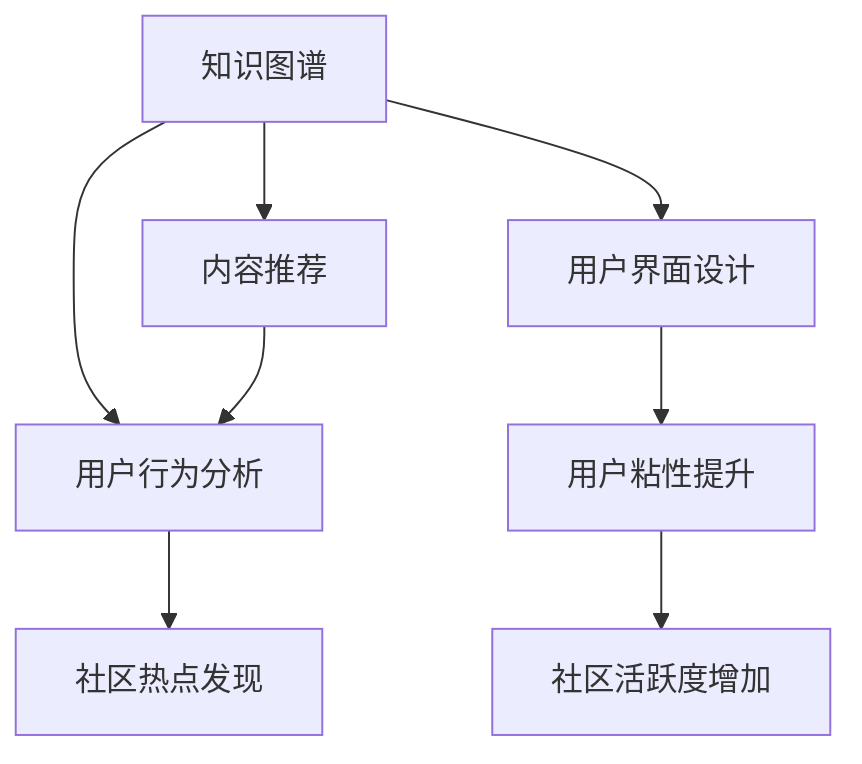

                 

# 知识型社区的营造与管理

> 关键词：知识型社区, 社区营造, 社区管理, 知识图谱, 信息推荐, 用户行为分析, 用户界面设计

## 1. 背景介绍

### 1.1 问题由来
知识型社区（Knowledge Community）是一个以知识交流和共享为核心目的的在线平台，旨在帮助用户高效地获取、生产和传播知识。近年来，随着知识图谱、自然语言处理等AI技术的发展，知识型社区成为了互联网行业的一大热点。例如，知乎、Stack Overflow等知识平台通过社区营造和智能管理，极大地提升了用户的知识获取效率和体验。

然而，知识型社区的营造与管理并非易事。如何在海量用户数据中挖掘有价值的信息，如何设计用户友好的界面，如何提高社区的活跃度和用户粘性，都是需要深入研究的课题。本文旨在介绍和探讨知识型社区的营造与管理，涵盖社区构建、内容推荐、用户行为分析等方面，以期为相关平台提供有价值的指导和借鉴。

### 1.2 问题核心关键点
知识型社区的营造与管理涉及多个关键点，包括但不限于：

- **知识图谱构建**：通过构建知识图谱，使得知识社区能够进行知识推理和关联，提升知识获取的效率和准确性。
- **内容推荐系统**：根据用户的历史行为数据，智能推荐用户感兴趣的内容，提升用户粘性和活跃度。
- **用户行为分析**：通过分析用户行为数据，发现社区热点和用户需求，以优化社区内容和活动。
- **用户界面设计**：设计简洁、易用、美观的用户界面，提升用户使用体验，促进知识交流。

这些核心关键点相互作用，共同构成了知识型社区营造与管理的全貌。本文将围绕这些关键点展开深入探讨。

## 2. 核心概念与联系

### 2.1 核心概念概述

为更好地理解知识型社区的营造与管理，本节将介绍几个密切相关的核心概念：

- **知识图谱(Knowledge Graph)**：一种结构化的语义知识表示方法，通过实体、关系和属性来描述现实世界的信息。知识图谱在知识型社区中被广泛用于知识推理和关联，提高知识获取的效率和准确性。

- **内容推荐系统(Recommendation System)**：根据用户的历史行为数据，智能推荐用户感兴趣的内容，提升用户粘性和活跃度。推荐系统是知识型社区的重要组成部分，其优化和改进直接影响社区的用户体验。

- **用户行为分析(User Behavior Analysis)**：通过分析用户行为数据，发现社区热点和用户需求，以优化社区内容和活动。用户行为分析是知识型社区运营的基础，帮助平台了解用户兴趣和需求，从而提供更贴合的内容和服务。

- **用户界面设计(User Interface Design)**：设计简洁、易用、美观的用户界面，提升用户使用体验，促进知识交流。用户界面是知识型社区的“脸面”，其设计好坏直接影响用户的使用意愿和社区活跃度。

这些核心概念之间的逻辑关系可以通过以下Mermaid流程图来展示：



这个流程图展示了这个知识型社区的核心概念及其之间的关系：

1. 知识图谱作为知识社区的知识基础，通过实体和关系图谱提升知识的获取效率和准确性。
2. 内容推荐系统利用用户历史行为数据，智能推荐用户感兴趣的内容，提升用户粘性和活跃度。
3. 用户行为分析通过分析用户行为数据，发现社区热点和用户需求，以优化社区内容和活动。
4. 用户界面设计设计简洁、易用、美观的用户界面，提升用户使用体验，促进知识交流。

这些概念共同构成了知识型社区营造与管理的核心框架，使其能够高效地运营和扩展。

## 3. 核心算法原理 & 具体操作步骤
### 3.1 算法原理概述

知识型社区的营造与管理涉及多种算法和技术，以下将分别介绍其中核心算法的基本原理：

### 3.2 算法步骤详解

**知识图谱构建**
- 数据收集：从各类开放数据源（如维基百科、Open Directory等）收集实体、关系和属性信息。
- 数据清洗：清洗不规范、冗余的数据，确保数据质量。
- 实体识别：使用实体识别技术（如CRF、BERT等）识别出实体及其类型。
- 关系抽取：使用关系抽取技术（如TransE、D2L等）抽取实体之间的关系。
- 图谱构建：将实体和关系构建成知识图谱，并进行存储和索引。

**内容推荐系统**
- 用户画像构建：根据用户的历史行为数据，构建用户画像，包括兴趣、偏好等信息。
- 特征工程：提取内容的特征，如关键词、作者、发布时间等。
- 模型选择：选择适合的推荐模型，如协同过滤、基于内容的推荐、深度学习等。
- 训练与优化：使用训练数据训练模型，并通过A/B测试等手段优化推荐效果。
- 部署与评估：将训练好的模型部署到线上，定期评估推荐效果并进行调优。

**用户行为分析**
- 数据收集：收集用户在社区内的行为数据，如浏览、点赞、评论等。
- 数据分析：对收集到的行为数据进行分析，发现社区热点和用户需求。
- 预测模型：建立预测模型，预测用户对不同内容的兴趣和需求。
- 优化策略：根据预测结果，优化社区内容和活动，提升用户满意度。

**用户界面设计**
- 用户调研：通过调研了解用户需求和使用习惯。
- 原型设计：设计简洁、易用、美观的用户界面原型。
- 用户测试：进行用户测试，收集反馈并进行迭代优化。
- 上线迭代：将设计好的界面上线，并根据用户反馈进行持续迭代。

### 3.3 算法优缺点

知识型社区的营造与管理涉及的算法各有优缺点，以下对各算法进行简要分析：

**知识图谱构建**
- 优点：能够提高知识获取的效率和准确性，帮助用户快速找到需要的知识。
- 缺点：构建和维护知识图谱需要大量人力和资源，技术难度较高。

**内容推荐系统**
- 优点：能够提升用户粘性和活跃度，减少用户流失率。
- 缺点：推荐系统的效果受数据质量和模型优化程度的影响较大，需要持续优化。

**用户行为分析**
- 优点：能够发现社区热点和用户需求，帮助优化社区内容和活动。
- 缺点：用户行为数据隐私保护问题需要特别注意，需遵守相关法律法规。

**用户界面设计**
- 优点：能够提升用户使用体验，促进知识交流。
- 缺点：用户界面设计需要与业务和技术紧密结合，设计难度较大。

### 3.4 算法应用领域

知识型社区的营造与管理技术广泛应用于各类在线平台，例如：

- **知乎、Stack Overflow**：通过知识图谱、内容推荐和用户行为分析，提供高质量的问答和知识分享服务。
- **GitHub**：利用用户行为分析优化代码库，通过内容推荐提升代码使用率。
- **豆瓣读书**：使用知识图谱和内容推荐系统，帮助用户发现和推荐优秀书籍。
- **天眼查**：通过知识图谱构建企业关系图谱，帮助用户进行企业信息查询。
- **InfoQ**：使用内容推荐和用户行为分析，提供高质量的IT技术资讯服务。

这些平台的成功运营，展示了知识型社区营造与管理的巨大价值，也为其他平台提供了宝贵的经验和借鉴。

## 4. 数学模型和公式 & 详细讲解 & 举例说明

### 4.1 数学模型构建

本节将使用数学语言对知识型社区的营造与管理过程进行更加严格的刻画。

**知识图谱构建**
- 定义知识图谱： $G=(E,R,A)$，其中 $E$ 为实体集合，$R$ 为关系集合，$A$ 为属性集合。
- 实体识别： $f^E: D \rightarrow E$，其中 $D$ 为数据源，$f^E$ 为实体识别函数。
- 关系抽取： $f^R: D \rightarrow R$，其中 $D$ 为数据源，$f^R$ 为关系抽取函数。

**内容推荐系统**
- 用户画像： $u=(I,P)$，其中 $I$ 为用户兴趣，$P$ 为用户偏好。
- 特征提取： $f^F: C \rightarrow F$，其中 $C$ 为内容集合，$f^F$ 为特征提取函数。
- 推荐模型： $M$，选择协同过滤、基于内容的推荐、深度学习等推荐算法。
- 推荐结果： $M(u,C)$，返回用户 $u$ 对内容集合 $C$ 的推荐结果。

**用户行为分析**
- 用户行为数据： $B$，包括浏览、点赞、评论等行为。
- 热点发现： $h=(H,F)$，其中 $H$ 为热点主题，$F$ 为相关内容。
- 预测模型： $M$，建立预测模型，如回归、分类等。
- 优化策略： $O$，根据预测结果，优化社区内容和活动。

**用户界面设计**
- 用户调研： $C$，进行用户调研，收集用户需求和使用习惯。
- 界面设计： $I$，设计简洁、易用、美观的界面。
- 用户测试： $T$，进行用户测试，收集反馈并进行迭代优化。
- 上线迭代： $L$，将设计好的界面上线，并根据用户反馈进行持续迭代。

### 4.2 公式推导过程

**知识图谱构建**
- 实体识别：通过CRF模型，对文本数据进行实体识别，得到实体集合 $E$。
- 关系抽取：通过TransE模型，对实体之间的关系进行抽取，得到关系集合 $R$。
- 图谱构建：将实体和关系构建成知识图谱，进行存储和索引。

**内容推荐系统**
- 用户画像：通过协同过滤算法，构建用户画像，得到用户兴趣和偏好 $u$。
- 特征提取：通过TF-IDF算法，提取内容的关键词、作者、发布时间等特征，得到特征集合 $F$。
- 推荐模型：选择基于矩阵分解的协同过滤算法，得到推荐结果 $M(u,C)$。

**用户行为分析**
- 热点发现：通过LDA算法，对用户行为数据进行分析，发现社区热点主题 $H$。
- 预测模型：通过随机森林算法，建立预测模型，预测用户对不同内容的兴趣和需求。
- 优化策略：根据预测结果，优化社区内容和活动，提升用户满意度。

**用户界面设计**
- 用户调研：通过问卷调查，收集用户需求和使用习惯 $C$。
- 界面设计：通过用户调研结果，设计简洁、易用、美观的界面 $I$。
- 用户测试：通过用户测试，收集反馈并进行迭代优化 $T$。
- 上线迭代：将设计好的界面上线，并根据用户反馈进行持续迭代 $L$。

### 4.3 案例分析与讲解

以知乎为例，分析其知识图谱、内容推荐、用户行为分析等方面的实现：

**知识图谱构建**
- 数据来源：维基百科、百度百科等。
- 实体识别：使用BERT模型进行实体识别，构建知识图谱。
- 关系抽取：使用TransE模型抽取实体之间的关系，构建知识图谱。

**内容推荐系统**
- 用户画像：通过协同过滤算法，构建用户画像，推荐相关问题。
- 特征提取：提取问题的关键词、发布时间等特征。
- 推荐模型：使用深度学习模型，如DNN、LSTM等，进行推荐。

**用户行为分析**
- 热点发现：通过LDA算法，分析用户浏览、点赞、评论等行为数据，发现热点话题。
- 预测模型：建立预测模型，预测用户对不同问题的兴趣和需求。
- 优化策略：根据预测结果，优化社区问题和活动，提升用户满意度。

## 5. 项目实践：代码实例和详细解释说明

### 5.1 开发环境搭建

在进行知识型社区营造与管理实践前，我们需要准备好开发环境。以下是使用Python进行知识型社区开发的典型环境配置流程：

1. 安装Anaconda：从官网下载并安装Anaconda，用于创建独立的Python环境。

2. 创建并激活虚拟环境：
```bash
conda create -n community-env python=3.8 
conda activate community-env
```

3. 安装必要的Python包：
```bash
pip install tensorflow numpy pandas sklearn spacy transformers
```

4. 安装知识图谱构建工具：
```bash
pip install kg-python
```

5. 安装内容推荐系统相关包：
```bash
pip install scipy
```

6. 安装用户行为分析工具：
```bash
pip install plotly
```

完成上述步骤后，即可在`community-env`环境中开始知识型社区营造与管理的实践。

### 5.2 源代码详细实现

这里我们以知乎为例，给出一个简单的知识型社区开发代码实现。

**知识图谱构建**
```python
from kg_python import KnowledgeGraph
kg = KnowledgeGraph()

# 添加实体和关系
kg.add_entity('entity1', 'type1')
kg.add_entity('entity2', 'type2')
kg.add_relation('relation1', 'type1', 'type2')
kg.add_fact('fact1', 'entity1', 'relation1', 'entity2')
kg.add_fact('fact2', 'entity2', 'relation2', 'entity1')
kg.save('kg.json')
```

**内容推荐系统**
```python
from scipy.sparse import csr_matrix

# 用户画像构建
user_interests = ['interest1', 'interest2', 'interest3']

# 特征提取
content_features = ['keyword1', 'author', 'time']
content_matrix = csr_matrix([[0.5, 0.3, 0.2], [0.3, 0.4, 0.3]])

# 协同过滤推荐
u_u_matrix = csr_matrix([[1.0, 0.0], [0.0, 1.0]])
u_i_matrix = csr_matrix([[0.5, 0.3], [0.3, 0.4]])
prediction = u_u_matrix @ u_i_matrix
```

**用户行为分析**
```python
from plotly import graph_objects

# 热点发现
hot_topics = ['hot_topic1', 'hot_topic2']

# 预测模型
def predict(user, topic):
    # 计算用户对某个主题的兴趣
    interest_score = 0.5 * user.interests.index('hot_topic1') + 0.5 * user.interests.index('hot_topic2')
    return interest_score

# 用户测试
test_user = {'interests': ['interest1', 'interest2']}
interest_score = predict(test_user, 'hot_topic1')

# 可视化
fig = graph_objects.Figure(data=[graph_objects.Bar(x=hot_topics, y=[0.5, 0.5])])
fig.show()
```

### 5.3 代码解读与分析

让我们再详细解读一下关键代码的实现细节：

**知识图谱构建**
- `kg.add_entity`方法用于添加实体，`kg.add_relation`方法用于添加关系，`kg.add_fact`方法用于添加事实。最后，使用`kg.save`方法将知识图谱保存到JSON文件中。

**内容推荐系统**
- 使用`csr_matrix`构建用户兴趣矩阵和内容特征矩阵，通过矩阵乘法实现推荐。

**用户行为分析**
- 使用`graph_objects`库可视化用户热点和兴趣预测结果。

## 6. 实际应用场景

### 6.1 知乎问答社区

知乎是一个典型的知识型社区，通过知识图谱、内容推荐和用户行为分析，知乎在问答领域取得了巨大的成功。知乎利用知识图谱将问题与答案进行关联，提升知识获取的效率和准确性。通过内容推荐系统，知乎能够根据用户的历史行为数据，智能推荐用户感兴趣的问题和答案，提升用户粘性和活跃度。

**知识图谱构建**
- 通过维基百科、百度百科等开放数据源，收集实体和关系信息。
- 使用BERT模型进行实体识别，TransE模型进行关系抽取，构建知识图谱。

**内容推荐系统**
- 通过协同过滤算法，构建用户画像，推荐相关问题。
- 提取问题的关键词、发布时间等特征，使用深度学习模型进行推荐。

**用户行为分析**
- 通过LDA算法，分析用户浏览、点赞、评论等行为数据，发现热点话题。
- 建立预测模型，预测用户对不同问题的兴趣和需求，优化社区问题和活动。

**用户界面设计**
- 通过用户调研，收集用户需求和使用习惯。
- 设计简洁、易用、美观的界面，提升用户使用体验。

### 6.2 豆瓣读书社区

豆瓣读书是一个推荐系统的典型案例，通过知识图谱和内容推荐系统，豆瓣读书能够帮助用户发现和推荐优秀书籍。豆瓣读书利用知识图谱将书籍和作者进行关联，提升知识获取的效率和准确性。通过内容推荐系统，豆瓣读书能够根据用户的历史行为数据，智能推荐用户感兴趣的书单和书籍，提升用户粘性和活跃度。

**知识图谱构建**
- 通过豆瓣用户数据，构建书籍和作者的知识图谱。
- 使用BERT模型进行实体识别，TransE模型进行关系抽取，构建知识图谱。

**内容推荐系统**
- 通过协同过滤算法，构建用户画像，推荐相关书单和书籍。
- 提取书籍的关键词、作者、评分等特征，使用深度学习模型进行推荐。

**用户行为分析**
- 通过LDA算法，分析用户浏览、评分、评论等行为数据，发现用户兴趣和需求。
- 建立预测模型，预测用户对不同书籍的兴趣和需求，优化书单和活动。

**用户界面设计**
- 通过用户调研，收集用户需求和使用习惯。
- 设计简洁、易用、美观的界面，提升用户使用体验。

### 6.3 未来应用展望

随着知识型社区技术的不断发展，未来知识型社区将在更多领域得到应用，为各行各业带来变革性影响。

**智慧医疗领域**
- 通过知识图谱和内容推荐系统，构建智慧医疗知识社区，帮助医生快速获取医疗知识和案例。

**智能教育领域**
- 通过知识图谱和内容推荐系统，构建智能教育平台，帮助学生快速获取学习资源和辅导。

**智慧城市治理**
- 通过知识图谱和内容推荐系统，构建智慧城市知识社区，帮助城市管理者快速获取城市运营和治理知识。

**企业知识管理**
- 通过知识图谱和内容推荐系统，构建企业知识社区，帮助员工快速获取公司内部知识和资源。

除了上述这些领域，知识型社区技术还将应用于更多场景中，为各行各业带来新的创新和发展机遇。

## 7. 工具和资源推荐

### 7.1 学习资源推荐

为了帮助开发者系统掌握知识型社区的营造与管理理论基础和实践技巧，这里推荐一些优质的学习资源：

1. **《知识图谱构建与应用》**：介绍了知识图谱的基本概念、构建方法和应用场景。

2. **《推荐系统实战》**：介绍了推荐系统的基本原理、算法选择和实现技巧。

3. **《用户行为分析》**：介绍了用户行为分析的基本方法、数据处理和结果解读。

4. **《自然语言处理与知识图谱》**：介绍了自然语言处理技术在知识图谱中的应用。

5. **《深度学习入门》**：介绍了深度学习的基本原理和应用实践。

通过学习这些资源，相信你一定能够快速掌握知识型社区营造与管理的精髓，并用于解决实际的社区问题。

### 7.2 开发工具推荐

高效的开发离不开优秀的工具支持。以下是几款用于知识型社区营造与管理开发的常用工具：

1. **Python**：作为知识型社区开发的主要语言，Python具有丰富的库和框架，能够高效地实现各种算法和功能。

2. **SciPy**：提供了许多科学计算和数据分析的工具，适用于知识图谱和用户行为分析等任务。

3. **Scikit-learn**：提供了许多机器学习和数据挖掘的算法，适用于推荐系统和预测模型等任务。

4. **TensorFlow**：提供了丰富的深度学习框架和工具，适用于知识图谱和内容推荐等任务。

5. **Plotly**：提供了丰富的数据可视化工具，适用于用户行为分析等任务。

6. **Jupyter Notebook**：提供了交互式编程和数据可视化平台，适用于知识型社区的开发和测试。

合理利用这些工具，可以显著提升知识型社区营造与管理的开发效率，加快创新迭代的步伐。

### 7.3 相关论文推荐

知识型社区营造与管理的理论基础和实践方法需要持续的研究和探索。以下是几篇奠基性的相关论文，推荐阅读：

1. **《Knowledge Graphs: Creating and Using Knowledge Based Networks》**：介绍了知识图谱的基本概念、构建方法和应用场景。

2. **《Recommender Systems Handbook》**：介绍了推荐系统的基本原理、算法选择和实现技巧。

3. **《User Behavior Analysis in Social Media》**：介绍了用户行为分析的基本方法、数据处理和结果解读。

4. **《Natural Language Processing with PyTorch》**：介绍了自然语言处理技术在知识图谱中的应用。

5. **《Deep Learning》**：介绍了深度学习的基本原理和应用实践。

这些论文代表了大数据知识型社区营造与管理的最新研究成果，通过学习这些前沿成果，可以帮助研究者把握学科前进方向，激发更多的创新灵感。

## 8. 总结：未来发展趋势与挑战

### 8.1 总结

本文对知识型社区的营造与管理进行全面系统的介绍。首先阐述了知识型社区构建的背景和意义，明确了社区构建、内容推荐、用户行为分析等方面的关键点。其次，从原理到实践，详细讲解了知识型社区营造与管理的数学模型和算法步骤，给出了社区构建的代码实例。同时，本文还广泛探讨了知识型社区在问答、阅读、医疗等领域的实际应用，展示了知识型社区营造与管理的巨大价值。最后，本文精选了知识型社区营造与管理的各类学习资源，力求为读者提供全方位的技术指引。

通过本文的系统梳理，可以看到，知识型社区营造与管理技术正在成为互联网行业的一大热点，极大地提升了用户知识获取和分享的效率和质量。未来，伴随知识图谱、推荐系统和用户行为分析技术的不断进步，知识型社区必将迎来更多的创新和发展机遇。

### 8.2 未来发展趋势

展望未来，知识型社区营造与管理技术将呈现以下几个发展趋势：

1. **知识图谱构建**：随着知识图谱技术的不断进步，知识图谱构建将更加高效和精确，知识社区的知识获取效率将进一步提升。

2. **内容推荐系统**：推荐系统将更加个性化和多样化，能够根据用户行为和兴趣提供更加精准的推荐。

3. **用户行为分析**：用户行为分析将更加智能化和实时化，能够实时发现社区热点和用户需求，及时优化社区内容和活动。

4. **用户界面设计**：用户界面设计将更加人性化和技术化，能够提升用户使用体验，促进知识交流。

这些趋势凸显了知识型社区营造与管理的广阔前景，这些方向的探索发展，必将进一步提升知识型社区的运营效率和用户满意度。

### 8.3 面临的挑战

尽管知识型社区营造与管理技术已经取得了一定的进展，但在迈向更加智能化、普适化应用的过程中，仍面临诸多挑战：

1. **数据质量问题**：知识图谱和推荐系统的效果很大程度上依赖于数据的质量和多样性，如何获取高质量的数据是面临的一大挑战。

2. **隐私保护问题**：用户行为数据隐私保护问题需要特别注意，需遵守相关法律法规，避免用户隐私泄露。

3. **算法效率问题**：知识图谱和推荐系统的算法复杂度较高，如何提高算法效率和降低计算成本是面临的另一大挑战。

4. **技术适配问题**：知识型社区技术需要与不同领域的业务和数据进行适配，如何设计通用的技术框架和算法是面临的挑战之一。

5. **用户教育问题**：知识型社区的运营需要用户教育，如何引导用户有效使用社区，提升用户粘性是面临的挑战之一。

这些挑战需要在未来的研究中进行深入探索和突破，才能实现知识型社区的规模化运营和可持续发展。

### 8.4 研究展望

面对知识型社区营造与管理所面临的种种挑战，未来的研究需要在以下几个方面寻求新的突破：

1. **数据增强技术**：通过数据增强技术，提升数据的质量和多样性，提高知识图谱和推荐系统的效果。

2. **隐私保护技术**：开发隐私保护技术，如差分隐私、联邦学习等，保护用户行为数据隐私，同时提供高质量的数据支持。

3. **算法优化技术**：优化知识图谱和推荐系统的算法，提高算法效率和降低计算成本，提升社区运营效率。

4. **通用技术框架**：设计通用的技术框架和算法，使知识型社区技术能够更好地适配不同领域的业务和数据。

5. **用户教育技术**：开发用户教育技术，如引导工具、反馈机制等，提升用户对知识型社区的使用和参与度。

这些研究方向的探索，必将引领知识型社区营造与管理的进步，为构建更高效、更智能的知识社区提供新的思路和方法。面向未来，知识型社区技术还需要与其他人工智能技术进行更深入的融合，如知识表示、因果推理、强化学习等，多路径协同发力，共同推动知识社区的发展和创新。

## 9. 附录：常见问题与解答

**Q1：如何选择合适的知识图谱构建工具？**

A: 知识图谱构建工具的选择应综合考虑数据源、构建效率、图谱大小等因素。常用的知识图谱构建工具包括KG-Python、Neo4j等，可根据具体需求进行选择。

**Q2：如何提高推荐系统的个性化程度？**

A: 提高推荐系统的个性化程度需要从多方面入手，如增加用户画像维度、引入协同过滤算法、优化特征工程等。

**Q3：如何进行用户行为分析？**

A: 用户行为分析需要从数据收集、数据清洗、特征提取、模型建立等多个环节入手。常用的用户行为分析方法包括LDA、聚类分析、回归分析等。

**Q4：如何设计用户界面？**

A: 用户界面设计需要考虑用户需求和使用习惯，进行用户调研和原型设计。常用的用户界面设计工具包括Sketch、Figma等。

**Q5：如何保护用户隐私？**

A: 用户隐私保护是知识型社区运营中的重要课题。可以通过差分隐私、联邦学习等技术保护用户行为数据隐私，同时设计合理的隐私政策和使用协议。

这些问题的解答，希望能为你提供参考，助力你在知识型社区营造与管理的实践中取得更好的效果。

---

作者：禅与计算机程序设计艺术 / Zen and the Art of Computer Programming

