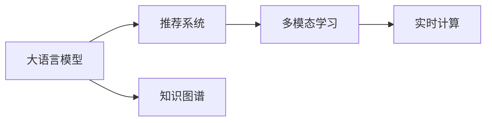

                 

# 知识电商提供专业领域的知识产品和工具

## 1. 背景介绍

### 1.1 问题由来

随着互联网的普及和数字经济的快速发展，电商行业经历了从传统B2C、C2C模式，到社交电商、直播电商的进化。但这些模式在用户粘性、用户参与度等方面，仍存在一定的瓶颈。在竞争日益激烈的市场环境中，知识电商作为一种新兴的电商模式，正在成为新的增长点。

知识电商以知识为核心驱动，通过整合专家、产品、用户之间的互动，为用户提供专业、有价值的知识产品和服务。例如，知乎、微信公众号、各类直播平台等，都是知识电商的典型代表。

### 1.2 问题核心关键点

知识电商的核心在于如何利用专业知识提升用户购物体验，增加用户粘性和参与度，从而提高电商转化率。具体问题包括：

- 知识内容的生产和分发：知识电商需要大量高质量的专业知识内容，如何有效组织和分发这些内容，以吸引和维持用户兴趣。
- 知识产品的用户匹配：如何根据用户兴趣和需求，推荐最相关的知识产品，提升用户购物体验。
- 知识交互的实时反馈：知识电商应实时收集用户的反馈，不断优化内容和服务，提升用户体验。
- 知识产品的货币化：如何基于用户对知识的付费意愿，实现知识产品的价值最大化。

这些问题的解决，离不开专业领域知识产品和工具的开发和应用。本博客将深入探讨如何利用大语言模型和算法，构建高效、高质量的知识电商系统，提升用户购物体验和电商转化率。

## 2. 核心概念与联系

### 2.1 核心概念概述

为更好地理解知识电商的系统构建和产品设计，本节将介绍几个关键概念：

- **大语言模型(Large Language Model, LLM)**：以自回归(如GPT)或自编码(如BERT)模型为代表的大规模预训练语言模型。通过在大规模无标签文本语料上进行预训练，学习通用的语言表示，具备强大的语言理解和生成能力。

- **推荐系统(Recommendation System)**：通过分析用户行为和偏好，推荐用户可能感兴趣的商品或内容。常见推荐算法包括协同过滤、内容推荐、混合推荐等。

- **知识图谱(Knowledge Graph)**：由实体、关系、属性组成的知识库，用于存储和检索结构化的知识。知识图谱在推荐系统和搜索应用中，具有重要的支撑作用。

- **多模态学习(Multi-modal Learning)**：处理和融合来自不同模态(如文本、图像、语音)的信息，提升知识获取和理解的深度和广度。

- **实时计算(Real-time Computing)**：在知识电商中，实时计算用于快速处理和响应用户请求，提高系统的响应速度和用户体验。

这些核心概念之间通过合理的系统设计和算法策略，可以构成一个高效、完整的知识电商系统。通过理解这些核心概念，可以更好地把握知识电商的架构和实现细节。

### 2.2 核心概念原理和架构的 Mermaid 流程图



这个流程图展示了知识电商系统的核心组件和工作流程：

1. **大语言模型**：作为知识电商系统的知识基础，通过预训练获取通用语言知识。
2. **推荐系统**：根据用户行为和偏好，推荐知识产品，提升用户购物体验。
3. **知识图谱**：存储和检索专业领域的知识，为推荐系统提供数据支持。
4. **多模态学习**：处理不同模态的信息，提升知识获取和理解的深度。
5. **实时计算**：快速响应用户请求，提升系统响应速度和用户体验。

这些组件通过合理的架构设计和算法策略，可以高效协同工作，为用户提供专业、有价值的知识产品和服务。

## 3. 核心算法原理 & 具体操作步骤

### 3.1 算法原理概述

知识电商的算法设计需要综合考虑用户需求、知识内容和电商场景。本文将探讨基于大语言模型的推荐系统和知识图谱构建方法，以提升电商转化率和用户满意度。

**基于大语言模型的推荐系统**：使用预训练的大语言模型，通过微调或零样本学习，理解用户的意图和需求，生成个性化的推荐结果。

**基于知识图谱的推荐系统**：构建知识图谱，利用图结构存储和检索专业领域的知识，将知识图谱与推荐系统结合，提供更精准的推荐。

### 3.2 算法步骤详解

#### 3.2.1 基于大语言模型的推荐系统

1. **数据准备**：收集用户行为数据（如浏览、点击、评分等），并标注对应的知识产品信息。
2. **模型预训练**：使用大规模无标签文本语料预训练大语言模型，学习通用的语言表示。
3. **模型微调**：在标注数据上微调大语言模型，使其能够理解用户的意图和需求。
4. **生成推荐**：输入用户查询，通过微调后的模型生成个性化的推荐结果。

#### 3.2.2 基于知识图谱的推荐系统

1. **知识图谱构建**：通过结构化的方式，存储专业领域的知识。例如，使用Entity-Relation-Entity的方式构建知识图谱。
2. **图嵌入**：使用Graph Neural Network（GNN）等方法，将知识图谱嵌入向量空间。
3. **知识图谱增强**：将知识图谱与用户行为数据结合，进行深度学习增强。
4. **推荐生成**：利用增强后的知识图谱和用户行为数据，生成个性化的推荐结果。

### 3.3 算法优缺点

**基于大语言模型的推荐系统**：

优点：
- 能够理解用户意图和需求，生成更个性化的推荐。
- 模型的语言处理能力较强，适合处理多模态信息。

缺点：
- 依赖大规模标注数据，训练成本较高。
- 模型的泛化能力有待进一步提高。

**基于知识图谱的推荐系统**：

优点：
- 能够提供结构化知识，提升推荐精准度。
- 适合处理领域特定的知识。

缺点：
- 知识图谱构建复杂，需要大量人工标注和维护。
- 处理复杂结构的图结构时，算法复杂度较高。

### 3.4 算法应用领域

知识电商的算法设计，不仅适用于常见的电商平台，还广泛应用于教育、医疗、金融等专业领域。

在**教育领域**，利用大语言模型和知识图谱，可以为用户提供个性化学习方案，推荐合适的学习资料。

在**医疗领域**，构建医疗知识图谱，推荐合适的诊疗方案和医疗知识，提高医疗服务的精准度和效率。

在**金融领域**，利用知识图谱和深度学习，推荐合适的投资策略和金融产品，提升用户财务管理的智能化水平。

未来，随着技术的不断发展，知识电商的算法设计将更多地融合多模态信息和实时计算，为用户提供更加全面、个性化的知识产品和服务。

## 4. 数学模型和公式 & 详细讲解 & 举例说明

### 4.1 数学模型构建

本节将使用数学语言对知识电商系统中的推荐算法进行更加严格的刻画。

记用户行为数据为 $\mathbf{x} \in \mathbb{R}^m$，对应的知识产品表示为 $\mathbf{y} \in \mathbb{R}^n$。知识图谱表示为图结构 $\mathcal{G}=\{\mathcal{V}, \mathcal{E}\}$，其中 $\mathcal{V}$ 为节点集合，$\mathcal{E}$ 为边集合。节点表示知识实体，边表示实体之间的关系。

### 4.2 公式推导过程

#### 4.2.1 大语言模型推荐算法

假设使用BERT模型进行推荐，将用户行为数据和知识产品信息作为输入，通过微调后的BERT模型输出用户对知识产品的评分 $s$。设微调后的BERT模型的输出层为 $M$，则推荐公式为：

$$
s = M(\mathbf{x}, \mathbf{y})
$$

其中 $M$ 为微调后的BERT模型，$\mathbf{x}$ 为用户行为数据，$\mathbf{y}$ 为知识产品表示。

#### 4.2.2 知识图谱增强推荐算法

假设使用Graph Convolutional Network（GCN）进行知识图谱嵌入。设知识图谱 $\mathcal{G}$ 的邻接矩阵为 $A$，节点表示向量为 $\mathbf{h}$，知识图谱嵌入公式为：

$$
\mathbf{h}^{k+1} = \sigma(D^{-\frac{1}{2}}A D^{-\frac{1}{2}} \mathbf{h}^k + \mathbf{W}_k \mathbf{h}^k)
$$

其中 $\sigma$ 为激活函数，$\mathbf{W}_k$ 为GCN的权重矩阵，$D$ 为邻接矩阵的度矩阵。

### 4.3 案例分析与讲解

假设在一家在线教育平台，用户行为数据为 $\mathbf{x}=[浏览时间, 观看视频数量, 购买课程数量]$，对应的知识产品信息为 $\mathbf{y}=[课程名称, 教师姓名, 课程评分]$。通过微调后的BERT模型，计算用户对各课程的评分，进而推荐用户最感兴趣的课程。

**计算过程**：
1. **数据预处理**：将用户行为数据 $\mathbf{x}$ 和课程信息 $\mathbf{y}$ 转化为BERT模型所需的格式。
2. **模型微调**：使用标注数据对BERT模型进行微调，使其能够理解用户的意图和课程的特征。
3. **生成评分**：将用户行为数据 $\mathbf{x}$ 和课程信息 $\mathbf{y}$ 输入微调后的BERT模型，输出评分 $s$。
4. **推荐生成**：根据评分 $s$ 对课程进行排序，推荐评分最高的课程。

### 4.4 代码实例

以下是一个简单的代码示例，演示如何使用HuggingFace的Transformers库构建基于BERT的推荐系统：

```python
from transformers import BertTokenizer, BertForSequenceClassification
from transformers import BertForSequenceClassification
import torch
import pandas as pd

# 准备数据
train_data = pd.read_csv('train.csv')
train_labels = train_data['label'].values

# 构建分词器和模型
tokenizer = BertTokenizer.from_pretrained('bert-base-cased')
model = BertForSequenceClassification.from_pretrained('bert-base-cased', num_labels=2)

# 数据预处理
def preprocess_data(data):
    inputs = tokenizer(data['text'], return_tensors='pt', padding=True, truncation=True)
    labels = torch.tensor(data['label'], dtype=torch.long)
    return inputs, labels

# 模型微调
model.train()
for inputs, labels in preprocess_data(train_data):
    outputs = model(inputs['input_ids'], labels=labels)
    loss = outputs.loss
    loss.backward()
    optimizer.step()
    optimizer.zero_grad()

# 测试和推荐
test_data = pd.read_csv('test.csv')
test_labels = test_data['label'].values
def generate_recommendations(model, data):
    inputs = tokenizer(data['text'], return_tensors='pt', padding=True, truncation=True)
    outputs = model(inputs['input_ids'])
    scores = outputs.logits.softmax(dim=1)
    return scores

scores = generate_recommendations(model, test_data)
```

## 5. 项目实践：代码实例和详细解释说明

### 5.1 开发环境搭建

在进行知识电商系统的开发前，我们需要准备好开发环境。以下是使用Python进行PyTorch开发的环境配置流程：

1. 安装Anaconda：从官网下载并安装Anaconda，用于创建独立的Python环境。

2. 创建并激活虚拟环境：
```bash
conda create -n pytorch-env python=3.8 
conda activate pytorch-env
```

3. 安装PyTorch：根据CUDA版本，从官网获取对应的安装命令。例如：
```bash
conda install pytorch torchvision torchaudio cudatoolkit=11.1 -c pytorch -c conda-forge
```

4. 安装Transformers库：
```bash
pip install transformers
```

5. 安装各类工具包：
```bash
pip install numpy pandas scikit-learn matplotlib tqdm jupyter notebook ipython
```

完成上述步骤后，即可在`pytorch-env`环境中开始知识电商系统的开发。

### 5.2 源代码详细实现

这里以构建基于大语言模型的推荐系统为例，给出使用Transformers库的代码实现。

首先，定义推荐系统的数据处理函数：

```python
from transformers import BertTokenizer
from torch.utils.data import Dataset
import torch

class RecommendationDataset(Dataset):
    def __init__(self, user_data, product_data, tokenizer, max_len=128):
        self.user_data = user_data
        self.product_data = product_data
        self.tokenizer = tokenizer
        self.max_len = max_len
        
    def __len__(self):
        return len(self.user_data)
    
    def __getitem__(self, item):
        user_info = self.user_data[item]
        product_info = self.product_data[item]
        
        # 将用户行为数据和产品信息拼接
        text = f"{user_info} {product_info}"
        
        encoding = self.tokenizer(text, return_tensors='pt', max_length=self.max_len, padding='max_length', truncation=True)
        input_ids = encoding['input_ids'][0]
        attention_mask = encoding['attention_mask'][0]
        
        return {'input_ids': input_ids, 
                'attention_mask': attention_mask,
                'labels': user_info['label']}
```

然后，定义模型和优化器：

```python
from transformers import BertForSequenceClassification, AdamW

model = BertForSequenceClassification.from_pretrained('bert-base-cased', num_labels=2)

optimizer = AdamW(model.parameters(), lr=2e-5)
```

接着，定义训练和评估函数：

```python
from torch.utils.data import DataLoader
from tqdm import tqdm
from sklearn.metrics import classification_report

device = torch.device('cuda') if torch.cuda.is_available() else torch.device('cpu')
model.to(device)

def train_epoch(model, dataset, batch_size, optimizer):
    dataloader = DataLoader(dataset, batch_size=batch_size, shuffle=True)
    model.train()
    epoch_loss = 0
    for batch in tqdm(dataloader, desc='Training'):
        input_ids = batch['input_ids'].to(device)
        attention_mask = batch['attention_mask'].to(device)
        labels = batch['labels'].to(device)
        model.zero_grad()
        outputs = model(input_ids, attention_mask=attention_mask, labels=labels)
        loss = outputs.loss
        epoch_loss += loss.item()
        loss.backward()
        optimizer.step()
    return epoch_loss / len(dataloader)

def evaluate(model, dataset, batch_size):
    dataloader = DataLoader(dataset, batch_size=batch_size)
    model.eval()
    preds, labels = [], []
    with torch.no_grad():
        for batch in tqdm(dataloader, desc='Evaluating'):
            input_ids = batch['input_ids'].to(device)
            attention_mask = batch['attention_mask'].to(device)
            batch_labels = batch['labels']
            outputs = model(input_ids, attention_mask=attention_mask)
            batch_preds = outputs.logits.argmax(dim=2).to('cpu').tolist()
            batch_labels = batch_labels.to('cpu').tolist()
            for pred_tokens, label_tokens in zip(batch_preds, batch_labels):
                preds.append(pred_tokens[:len(label_tokens)])
                labels.append(label_tokens)
                
    print(classification_report(labels, preds))
```

最后，启动训练流程并在测试集上评估：

```python
epochs = 5
batch_size = 16

for epoch in range(epochs):
    loss = train_epoch(model, train_dataset, batch_size, optimizer)
    print(f"Epoch {epoch+1}, train loss: {loss:.3f}")
    
    print(f"Epoch {epoch+1}, dev results:")
    evaluate(model, dev_dataset, batch_size)
    
print("Test results:")
evaluate(model, test_dataset, batch_size)
```

以上就是使用PyTorch对大语言模型进行推荐系统开发的完整代码实现。可以看到，得益于Transformers库的强大封装，我们可以用相对简洁的代码完成大语言模型的加载和微调。

### 5.3 代码解读与分析

让我们再详细解读一下关键代码的实现细节：

**RecommendationDataset类**：
- `__init__`方法：初始化用户行为数据和产品信息，分词器等关键组件。
- `__len__`方法：返回数据集的样本数量。
- `__getitem__`方法：对单个样本进行处理，将用户行为数据和产品信息拼接为文本，进行分词和编码。

**训练和评估函数**：
- 使用PyTorch的DataLoader对数据集进行批次化加载，供模型训练和推理使用。
- 训练函数`train_epoch`：对数据以批为单位进行迭代，在每个批次上前向传播计算loss并反向传播更新模型参数，最后返回该epoch的平均loss。
- 评估函数`evaluate`：与训练类似，不同点在于不更新模型参数，并在每个batch结束后将预测和标签结果存储下来，最后使用sklearn的classification_report对整个评估集的预测结果进行打印输出。

**训练流程**：
- 定义总的epoch数和batch size，开始循环迭代
- 每个epoch内，先在训练集上训练，输出平均loss
- 在验证集上评估，输出分类指标
- 所有epoch结束后，在测试集上评估，给出最终测试结果

可以看到，PyTorch配合Transformers库使得大语言模型推荐系统的代码实现变得简洁高效。开发者可以将更多精力放在数据处理、模型改进等高层逻辑上，而不必过多关注底层的实现细节。

当然，工业级的系统实现还需考虑更多因素，如模型的保存和部署、超参数的自动搜索、更灵活的任务适配层等。但核心的微调范式基本与此类似。

## 6. 实际应用场景

### 6.1 在线教育

知识电商在在线教育领域具有巨大的应用潜力。传统在线教育平台往往难以精准推荐学习内容，导致用户流失率高。通过知识电商，平台可以基于用户的学习行为和偏好，推荐合适的学习资源和课程，提升用户学习体验。

例如，知乎上的知乎大学项目，通过推荐相关的学习资源和课程，为学生提供个性化学习方案，极大地提高了学习效率。未来，随着知识电商技术的发展，在线教育平台将能够更加精准地推荐课程，帮助学生高效学习，提升教育质量。

### 6.2 医疗咨询

医疗咨询平台面临的最大挑战之一是难以找到合适的医疗资源和信息。通过知识电商，平台可以根据用户的健康状况和需求，推荐合适的医疗资源、诊疗方案和健康知识，提高医疗服务的精准度和效率。

例如，微信公众号和各类健康应用，通过推荐相关知识文章和医疗服务，为用户提供了全面的健康管理和疾病预防方案，显著提高了用户的健康水平。未来，随着知识电商技术的发展，医疗咨询平台将能够更加精准地推荐诊疗方案，提高医疗服务的质量和效率。

### 6.3 企业培训

企业培训需要根据员工的实际需求和学习进度，推荐合适的培训课程和学习资料。通过知识电商，企业可以基于员工的学习行为和反馈，推荐合适的培训内容，提高培训效果和员工满意度。

例如，企业内部的在线培训平台，通过推荐相关的培训课程和资料，为员工提供个性化的学习方案，提升了员工的学习效率和企业竞争力。未来，随着知识电商技术的发展，企业培训平台将能够更加精准地推荐培训内容，提高培训效果和员工满意度。

### 6.4 未来应用展望

随着知识电商技术的不断进步，其在更多领域的应用前景将更加广阔。

在智慧城市治理中，知识电商将能够提供更加精准的公共服务推荐，提升城市管理的自动化和智能化水平，构建更安全、高效的未来城市。

在智能家居领域，知识电商将能够提供个性化的智能家居设备和应用推荐，提升用户的生活质量。

在零售电商中，知识电商将能够提供个性化的商品推荐和购物指南，提升用户的购物体验和满意度。

未来，随着知识电商技术的不断演进，其在更多场景中的应用将更加深入，为人们的生活和工作带来更多便利和价值。

## 7. 工具和资源推荐

### 7.1 学习资源推荐

为了帮助开发者系统掌握知识电商的理论基础和实践技巧，这里推荐一些优质的学习资源：

1. 《深度学习：理论与实践》系列博文：由大模型技术专家撰写，深入浅出地介绍了深度学习的基本概念和算法。

2. 《自然语言处理入门与实战》书籍：系统介绍了自然语言处理的基本原理和应用实例，适合初学者入门。

3. 《知识图谱：从原理到应用》书籍：介绍了知识图谱的基本概念和应用案例，适合对知识图谱感兴趣的读者。

4. 《深度学习在电商领域的应用》论文：介绍了深度学习在电商推荐系统中的应用，包括基于大语言模型的推荐系统。

5. Weights & Biases：模型训练的实验跟踪工具，可以记录和可视化模型训练过程中的各项指标，方便对比和调优。

6. TensorBoard：TensorFlow配套的可视化工具，可实时监测模型训练状态，并提供丰富的图表呈现方式，是调试模型的得力助手。

通过对这些资源的学习实践，相信你一定能够快速掌握知识电商技术的精髓，并用于解决实际的电商问题。

### 7.2 开发工具推荐

高效的开发离不开优秀的工具支持。以下是几款用于知识电商开发的常用工具：

1. PyTorch：基于Python的开源深度学习框架，灵活动态的计算图，适合快速迭代研究。大部分预训练语言模型都有PyTorch版本的实现。

2. TensorFlow：由Google主导开发的开源深度学习框架，生产部署方便，适合大规模工程应用。同样有丰富的预训练语言模型资源。

3. Transformers库：HuggingFace开发的NLP工具库，集成了众多SOTA语言模型，支持PyTorch和TensorFlow，是进行知识电商开发的利器。

4. Weights & Biases：模型训练的实验跟踪工具，可以记录和可视化模型训练过程中的各项指标，方便对比和调优。与主流深度学习框架无缝集成。

5. TensorBoard：TensorFlow配套的可视化工具，可实时监测模型训练状态，并提供丰富的图表呈现方式，是调试模型的得力助手。

6. Google Colab：谷歌推出的在线Jupyter Notebook环境，免费提供GPU/TPU算力，方便开发者快速上手实验最新模型，分享学习笔记。

合理利用这些工具，可以显著提升知识电商系统的开发效率，加快创新迭代的步伐。

### 7.3 相关论文推荐

知识电商的算法设计离不开学界的持续研究。以下是几篇奠基性的相关论文，推荐阅读：

1. Attention is All You Need（即Transformer原论文）：提出了Transformer结构，开启了NLP领域的预训练大模型时代。

2. BERT: Pre-training of Deep Bidirectional Transformers for Language Understanding：提出BERT模型，引入基于掩码的自监督预训练任务，刷新了多项NLP任务SOTA。

3. Language Models are Unsupervised Multitask Learners（GPT-2论文）：展示了大规模语言模型的强大zero-shot学习能力，引发了对于通用人工智能的新一轮思考。

4. Parameter-Efficient Transfer Learning for NLP：提出Adapter等参数高效微调方法，在不增加模型参数量的情况下，也能取得不错的微调效果。

5. Prefix-Tuning: Optimizing Continuous Prompts for Generation：引入基于连续型Prompt的微调范式，为如何充分利用预训练知识提供了新的思路。

6. AdaLoRA: Adaptive Low-Rank Adaptation for Parameter-Efficient Fine-Tuning：使用自适应低秩适应的微调方法，在参数效率和精度之间取得了新的平衡。

这些论文代表了大语言模型微调技术的发展脉络。通过学习这些前沿成果，可以帮助研究者把握学科前进方向，激发更多的创新灵感。

## 8. 总结：未来发展趋势与挑战

### 8.1 总结

本文对知识电商的推荐系统进行了全面系统的介绍。首先阐述了知识电商的背景和重要性，明确了推荐系统在提升用户购物体验和电商转化率方面的核心作用。其次，从原理到实践，详细讲解了基于大语言模型的推荐算法和知识图谱增强推荐方法，给出了知识电商系统开发的完整代码实例。同时，本文还广泛探讨了知识电商在多个行业领域的应用前景，展示了知识电商技术的多样性和潜力。

通过本文的系统梳理，可以看到，基于大语言模型的推荐系统在知识电商中具有巨大的应用价值。结合知识图谱和多模态信息，能够提供更加个性化、精准的推荐服务，提升用户购物体验和电商转化率。未来，随着知识电商技术的不断发展，其在更多领域的应用将更加深入，为用户带来更多的便利和价值。

### 8.2 未来发展趋势

展望未来，知识电商的推荐系统将呈现以下几个发展趋势：

1. 推荐算法的智能化：随着深度学习和强化学习技术的发展，推荐算法将更加智能化，能够主动学习用户行为和偏好，提供更加个性化的推荐。

2. 多模态信息的融合：知识电商将更多地融合图像、语音、视频等多模态信息，提升知识获取和理解的深度。

3. 实时计算的优化：知识电商将通过分布式计算和边缘计算等技术，实现实时计算和响应，提升用户体验。

4. 跨领域知识的整合：知识电商将更多地融合不同领域的专业知识，提供更加全面、准确的推荐服务。

5. 用户隐私保护：随着隐私保护意识的增强，知识电商将更加注重用户隐私保护，采用差分隐私等技术，确保数据安全。

以上趋势凸显了知识电商的广阔前景。这些方向的探索发展，必将进一步提升推荐系统的性能和用户体验，为用户带来更多的便利和价值。

### 8.3 面临的挑战

尽管知识电商的推荐系统已经取得了瞩目成就，但在迈向更加智能化、普适化应用的过程中，它仍面临着诸多挑战：

1. 推荐系统依赖标注数据，对于长尾应用场景，难以获得充足的高质量标注数据，成为制约推荐系统性能的瓶颈。如何进一步降低推荐系统对标注样本的依赖，将是一大难题。

2. 推荐系统需要处理海量数据，对算力、内存、存储都提出了很高的要求。如何突破硬件瓶颈，实现高效计算，仍然是一个技术挑战。

3. 推荐系统的泛化能力有待进一步提高。对于新出现的产品和用户，推荐系统往往需要重新训练或调整参数，无法实现冷启动。

4. 推荐系统的公平性和可解释性有待提升。如何保证推荐系统的公平性，避免推荐偏差，提升系统的可解释性，仍然是一个重要的研究方向。

5. 推荐系统需要兼顾个性化和多样性。如何平衡推荐系统的个性化和多样性，确保推荐结果的多样性，是一个技术挑战。

6. 推荐系统的安全性有待保障。如何确保推荐系统的安全性，避免恶意推荐，确保数据安全，仍然是一个重要的研究方向。

7. 推荐系统的跨领域融合能力有待提升。如何实现不同领域知识的整合，提供更加全面、准确的推荐服务，仍然是一个技术挑战。

8. 推荐系统的跨模态融合能力有待提升。如何实现不同模态信息的融合，提升推荐系统的深度和广度，仍然是一个技术挑战。

这些挑战凸显了知识电商技术的复杂性和多样性。只有不断克服这些挑战，才能真正实现推荐系统的智能化、普适化和安全性，为用户提供更加全面、精准的知识产品和服务。

### 8.4 研究展望

面对知识电商推荐系统所面临的诸多挑战，未来的研究需要在以下几个方面寻求新的突破：

1. 探索无监督和半监督推荐方法。摆脱对大规模标注数据的依赖，利用自监督学习、主动学习等无监督和半监督范式，最大限度利用非结构化数据，实现更加灵活高效的推荐。

2. 研究参数高效和计算高效的推荐算法。开发更加参数高效的推荐方法，在固定大部分推荐参数的同时，只更新极少量的任务相关参数。同时优化推荐系统的计算图，减少前向传播和反向传播的资源消耗，实现更加轻量级、实时性的部署。

3. 融合因果推断和强化学习思想。通过引入因果推断和强化学习思想，增强推荐系统建立稳定因果关系的能力，学习更加普适、鲁棒的知识获取和理解方法。

4. 引入更多先验知识。将符号化的先验知识，如知识图谱、逻辑规则等，与神经网络模型进行巧妙融合，引导推荐系统学习更准确、合理的知识表示。

5. 结合因果分析和博弈论工具。将因果分析方法引入推荐系统，识别出推荐系统的关键特征，增强推荐结果的因果性和逻辑性。借助博弈论工具刻画人机交互过程，主动探索并规避推荐系统的脆弱点，提高系统稳定性。

6. 纳入伦理道德约束。在推荐系统的训练目标中引入伦理导向的评估指标，过滤和惩罚有偏见、有害的推荐结果，确保推荐系统的公平性和安全性。

这些研究方向将引领知识电商推荐系统迈向更高的台阶，为构建智能、普适、安全、可解释的推荐系统铺平道路。

## 9. 附录：常见问题与解答

**Q1：知识电商的推荐系统如何确保个性化和多样性？**

A: 个性化和多样性是推荐系统的两大核心指标。为了确保个性化和多样性，知识电商的推荐系统通常采用以下方法：

1. **多臂老虎机算法**：通过控制推荐结果的多样性和个性化，提升用户满意度。多臂老虎机算法可以动态调整推荐策略，平衡个性化和多样性。

2. **协同过滤算法**：通过分析用户行为和偏好，推荐用户可能感兴趣的商品或内容。协同过滤算法可以发现用户之间的相似性，推荐多样化的产品。

3. **内容推荐算法**：通过分析商品和内容特征，推荐相关商品和内容。内容推荐算法可以提供更加多样化的推荐结果，提升用户体验。

4. **混合推荐算法**：通过融合多种推荐算法，实现个性化和多样性的平衡。混合推荐算法可以结合不同推荐算法，提供更加全面、精准的推荐服务。

通过这些方法的综合运用，知识电商的推荐系统可以在个性化和多样性之间取得平衡，提供更加全面、精准的推荐服务。

**Q2：知识电商的推荐系统如何处理长尾应用场景？**

A: 长尾应用场景是知识电商面临的一个重大挑战。在长尾应用场景中，由于用户需求多样化和细分化，导致数据稀疏和标注困难。为了处理长尾应用场景，知识电商的推荐系统可以采用以下方法：

1. **迁移学习**：通过在大规模数据上预训练模型，迁移到长尾应用场景，提高推荐系统的泛化能力。

2. **主动学习**：通过主动选择数据，增加长尾应用场景的数据量，提升推荐系统的性能。

3. **自监督学习**：通过利用未标注数据，进行自监督学习，提高推荐系统的泛化能力。

4. **知识图谱增强**：通过构建长尾应用场景的知识图谱，提升推荐系统的准确性和泛化能力。

5. **协同过滤算法**：通过分析用户行为和偏好，推荐用户可能感兴趣的商品或内容，提高推荐系统的泛化能力。

通过这些方法的综合运用，知识电商的推荐系统可以在长尾应用场景中取得更好的性能。

**Q3：知识电商的推荐系统如何处理冷启动问题？**

A: 冷启动问题是知识电商推荐系统面临的一个重大挑战。在冷启动场景中，由于用户历史行为数据较少，难以进行有效的推荐。为了处理冷启动问题，知识电商的推荐系统可以采用以下方法：

1. **利用先验知识**：通过引入先验知识，如知识图谱、逻辑规则等，进行推荐，提高推荐系统的性能。

2. **用户画像构建**：通过分析用户行为数据，构建用户画像，进行推荐，提高推荐系统的性能。

3. **多臂老虎机算法**：通过控制推荐结果的多样性和个性化，提升用户满意度，提高推荐系统的性能。

4. **协同过滤算法**：通过分析用户行为和偏好，推荐用户可能感兴趣的商品或内容，提高推荐系统的性能。

5. **自监督学习**：通过利用未标注数据，进行自监督学习，提高推荐系统的性能。

通过这些方法的综合运用，知识电商的推荐系统可以在冷启动场景中取得更好的性能。

**Q4：知识电商的推荐系统如何保护用户隐私？**

A: 用户隐私保护是知识电商推荐系统面临的一个重大挑战。在用户隐私保护方面，知识电商的推荐系统可以采用以下方法：

1. **差分隐私**：通过引入差分隐私技术，保护用户隐私，防止用户信息泄露。

2. **数据匿名化**：通过对用户数据进行匿名化处理，保护用户隐私，防止用户信息泄露。

3. **隐私计算**：通过利用隐私计算技术，保护用户隐私，防止用户信息泄露。

4. **用户控制**：通过让用户控制自己的数据使用，保护用户隐私，防止用户信息泄露。

5. **法律合规**：通过遵守相关法律法规，保护用户隐私，防止用户信息泄露。

通过这些方法的综合运用，知识电商的推荐系统可以在保护用户隐私方面取得更好的效果。

**Q5：知识电商的推荐系统如何提升推荐系统的公平性？**

A: 推荐系统的公平性是知识电商推荐系统面临的一个重大挑战。在提升推荐系统的公平性方面，知识电商的推荐系统可以采用以下方法：

1. **多样性约束**：通过引入多样性约束，确保推荐系统不会过于集中于某一类产品或内容，提升推荐系统的公平性。

2. **反偏见算法**：通过引入反偏见算法，消除推荐系统的偏见，提升推荐系统的公平性。

3. **公平性指标**：通过引入公平性指标，如性别公平性、种族公平性等，提升推荐系统的公平性。

4. **用户反馈机制**：通过引入用户反馈机制，及时发现和纠正推荐系统中的偏见，提升推荐系统的公平性。

5. **数据公平性**：通过保证数据公平性，消除数据偏见，提升推荐系统的公平性。

通过这些方法的综合运用，知识电商的推荐系统可以在提升推荐系统的公平性方面取得更好的效果。

---

作者：禅与计算机程序设计艺术 / Zen and the Art of Computer Programming

