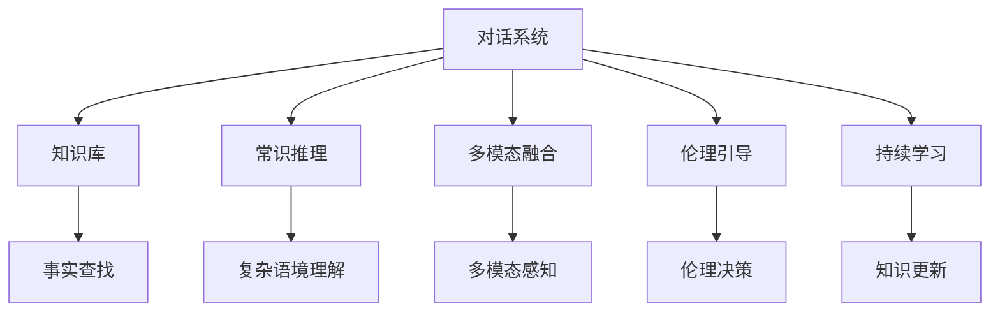

                 

# 知识的互动性：对话与辩论中的智慧火花

## 1. 背景介绍

### 1.1 问题由来

对话与辩论是人类社会交流的基本形式，历来被视为智慧的体现。在现代科技迅猛发展的背景下，计算机与人类交互的技术也在飞速进步。对话系统、辩论系统等AI应用逐渐普及，使人类社会交流方式产生了深刻的变革。

然而，现有AI系统在对话和辩论能力上仍有许多局限，主要表现在以下几个方面：

1. **知识泛化能力不足**：现有系统往往难以处理复杂的语义关系和上下文信息，难以理解和处理长、复杂的对话和辩论。
2. **缺乏常识和常识推理能力**：系统无法利用先验知识进行合理推断，难以与人类在常识和逻辑上进行有效的交流。
3. **多模态融合能力差**：现有系统对图像、音频、视频等多模态数据的处理能力较弱，无法实现多模态信息的有效整合。
4. **伦理和社会责任意识缺乏**：部分AI系统在处理涉及伦理和社会责任问题时缺乏足够的人性化处理。

为了突破这些限制，提升AI系统的智慧火花，我们需要探索更为先进的对话与辩论技术，让AI具备更强的知识互动性。

### 1.2 问题核心关键点

本节将重点探讨如何构建具有知识互动性的对话与辩论系统。核心关键点包括：

- **知识库与推理系统**：如何将人类知识与AI系统进行有效结合，提升其推理能力和常识理解。
- **多模态信息融合**：如何利用视觉、听觉、文本等多种信息源，增强对话与辩论系统的感知和理解能力。
- **伦理与决策引导**：如何在对话与辩论中融入伦理和社会责任意识，确保AI系统的行为符合社会价值。
- **持续学习与自适应能力**：如何通过不断学习新的对话与辩论数据，提升系统的适应性和泛化能力。

以下我们将从这些关键点出发，探讨构建知识互动性对话与辩论系统的具体方法。

## 2. 核心概念与联系

### 2.1 核心概念概述

为更好地理解如何构建知识互动性对话与辩论系统，本节将介绍几个密切相关的核心概念：

- **对话系统(Discourse System)**：利用自然语言处理(NLP)技术，实现人机之间的自然对话。对话系统被广泛应用于客服、教育、健康咨询等领域。
- **辩论系统(Debate System)**：基于逻辑推理和论证，实现人工智能与人类在观点和论证上的交互。辩论系统可以应用于法律咨询、政治讨论等场景。
- **知识库(Knowledge Base)**：包含结构化、半结构化及非结构化的人类知识，用于支持对话和辩论系统的事实查找和推理。
- **常识推理(Compositional Reasoning)**：利用常识进行推断，从而提升系统理解复杂语境和隐含逻辑的能力。
- **多模态融合(Multimodal Fusion)**：将文本、视觉、听觉等多种信息源进行综合处理，增强系统感知和理解能力。
- **伦理引导(Ethical Guidance)**：在对话与辩论中融入伦理和社会责任意识，确保AI系统的行为符合社会价值。
- **持续学习(Continual Learning)**：系统能够不断学习新知识，提升自身适应性和泛化能力。

这些概念之间的逻辑关系可以通过以下Mermaid流程图来展示：



这个流程图展示了几大核心概念及其之间的关系：

1. 对话系统通过知识库进行事实查找和常识推理，提升理解能力。
2. 多模态融合增强对话系统的感知和理解。
3. 伦理引导确保对话系统行为符合社会价值。
4. 持续学习提升系统适应性和泛化能力。

这些概念共同构成了知识互动性对话与辩论系统的核心架构，使其能够进行深度人机交互。

## 3. 核心算法原理 & 具体操作步骤
### 3.1 算法原理概述

构建知识互动性对话与辩论系统的核心算法原理包括以下几个方面：

- **事实查找与验证**：利用知识库中存储的事实进行推理验证，确保对话中信息的一致性。
- **常识推理与动态知识更新**：通过常识推理进行复杂语境的理解和推断，同时持续学习新的对话与辩论数据，动态更新知识库。
- **多模态信息融合与感知增强**：融合视觉、听觉、文本等多种信息源，增强系统的感知和理解能力。
- **伦理决策与行为引导**：在对话和辩论中融入伦理和社会责任意识，确保系统行为符合社会价值。
- **自然语言生成与交互优化**：使用自然语言生成技术，生成流畅、合理的对话内容，同时优化系统交互体验。

### 3.2 算法步骤详解

基于上述算法原理，以下是构建知识互动性对话与辩论系统的具体操作步骤：

**Step 1: 准备知识库和事实数据库**

1. 收集和整理人类知识，包括事实、定义、规则等，存储在结构化的知识库中。
2. 构建事实数据库，用于存储对话和辩论中涉及的事实和数据。
3. 设计事实验证机制，确保对话中信息的准确性。

**Step 2: 设计对话与辩论模型**

1. 选择适合的对话模型，如基于序列到序列的Seq2Seq模型、基于Transformer的Encoder-Decoder模型等。
2. 设计对话生成器，根据对话历史和上下文信息生成合理的响应。
3. 设计辩论推理器，基于常识推理和论证规则进行观点推断和反驳。

**Step 3: 融合多模态信息**

1. 收集和预处理多模态数据，如文本、图像、音频等。
2. 设计多模态融合机制，将不同模态的信息进行综合处理。
3. 使用多模态感知模块，增强对话系统对信息的理解能力。

**Step 4: 融入伦理与决策**

1. 设计伦理引导模块，确保对话和辩论中行为符合社会价值。
2. 引入伦理决策算法，对对话内容进行道德和社会责任的评估。
3. 设定伦理边界，限制系统处理敏感话题。

**Step 5: 持续学习与适应性提升**

1. 设计持续学习机制，定期更新对话与辩论数据，进行模型训练和优化。
2. 使用知识增强技术，在对话和辩论中动态更新知识库。
3. 引入主动学习策略，提升系统的泛化能力和适应性。

**Step 6: 测试与优化**

1. 在模拟环境和真实场景中进行对话和辩论测试。
2. 根据测试结果进行优化，提升系统性能和用户体验。
3. 对系统进行迭代更新，逐步增强知识互动性。

### 3.3 算法优缺点

构建知识互动性对话与辩论系统具有以下优点：

1. **知识互动性**：系统能够利用人类知识进行推理和理解，提升对话与辩论的深度和广度。
2. **多模态感知能力**：通过融合多种信息源，增强系统的感知和理解能力。
3. **伦理引导**：确保系统行为符合社会价值，提升系统的可信度和道德水平。
4. **持续学习能力**：通过不断学习新知识，提升系统的适应性和泛化能力。

同时，该系统也存在一些局限：

1. **知识库构建困难**：知识库的构建需要大量人力和物力投入，且质量难以保证。
2. **推理能力有限**：尽管具有常识推理能力，但在处理极端复杂情况时仍存在局限。
3. **多模态数据处理复杂**：多模态数据的融合和感知增强过程较为复杂，需要高精度的算法支持。
4. **伦理与社会责任**：伦理引导模块的设计需要极高的伦理标准和科学依据，难以完全避免伦理争议。
5. **持续学习依赖数据**：系统需要不断学习新数据，数据获取和标注成本较高。

尽管存在这些局限，但构建知识互动性对话与辩论系统对于提升AI系统的智慧火花具有重要意义，值得在实践中不断探索和优化。

### 3.4 算法应用领域

基于知识互动性对话与辩论的系统已经在多个领域得到了应用，例如：

- **智能客服系统**：利用对话系统与客户进行自然交流，提供个性化的服务和问题解答。
- **法律咨询系统**：通过辩论系统对法律案件进行论证和推断，辅助法官和律师进行案件处理。
- **教育辅助系统**：与学生进行互动教学，提供个性化学习建议和反馈。
- **健康咨询系统**：利用对话系统与患者进行咨询，提供健康建议和治疗方案。
- **政府决策支持系统**：通过辩论系统对政策进行评估和论证，辅助政府决策。
- **社交媒体监控系统**：通过对话系统监控和分析社交媒体上的公众讨论，提供舆情分析报告。

这些应用场景展示了知识互动性对话与辩论系统的强大潜力，未来还有更多垂直领域值得探索。

## 4. 数学模型和公式 & 详细讲解  
### 4.1 数学模型构建

本节将使用数学语言对知识互动性对话与辩论系统的构建过程进行更加严格的刻画。

假设对话系统输入为 $X_t$，输出为 $Y_t$，对话历史为 $H_t$，知识库为 $K$，事实数据库为 $D$。则对话模型的目标是最小化预测响应与实际响应之间的差异：

$$
\min_{\theta} \sum_{t} \ell(Y_t, \hat{Y}_t(X_t, H_t, K, D))
$$

其中 $\ell$ 为损失函数，$\hat{Y}_t$ 为模型预测的响应。

### 4.2 公式推导过程

以下我们以一个简单的Seq2Seq模型为例，推导对话生成器的数学公式。

假设对话生成器基于神经网络模型，其输入为对话历史 $H_t$ 和上下文信息 $C_t$，输出为响应 $Y_t$。则对话生成器的优化目标为：

$$
\min_{\theta} \sum_{t} \ell(Y_t, \hat{Y}_t(H_t, C_t))
$$

其中 $\ell$ 为交叉熵损失函数。

设 $H_t$ 和 $C_t$ 为输入序列，$Y_t$ 为输出序列。则模型的输入表示为：

$$
H_t = [h_1, h_2, ..., h_t]
$$

其中 $h_t$ 为第 $t$ 个对话历史文本。

模型的输出表示为：

$$
Y_t = [y_1, y_2, ..., y_t]
$$

其中 $y_t$ 为第 $t$ 个响应文本。

设 $C_t$ 为上下文信息，则输入表示为：

$$
C_t = [c_1, c_2, ..., c_t]
$$

其中 $c_t$ 为第 $t$ 个上下文信息文本。

模型的输出表示为：

$$
\hat{Y}_t = [\hat{y}_1, \hat{y}_2, ..., \hat{y}_t]
$$

其中 $\hat{y}_t$ 为第 $t$ 个预测响应文本。

模型的输入和输出可以使用编码器-解码器架构进行表示，如图：


其中，编码器 $B$ 将对话历史和上下文信息映射为上下文向量 $C_t$，解码器 $D$ 根据上下文向量和上下文信息，生成预测响应 $\hat{Y}_t$。

模型的损失函数为交叉熵损失，表示为：

$$
\ell(Y_t, \hat{Y}_t) = -\frac{1}{N} \sum_{n=1}^N \sum_{i=1}^N y_{i,n} \log \hat{y}_{i,n}
$$

其中 $y_{i,n}$ 为实际响应中的第 $i$ 个单词在第 $n$ 个位置上的概率，$\hat{y}_{i,n}$ 为模型预测的第 $i$ 个单词在第 $n$ 个位置上的概率。

### 4.3 案例分析与讲解

下面我们以一个简单的案例来说明知识互动性对话与辩论系统的应用：

假设我们要构建一个智能法律咨询系统，系统需要处理如下对话：

**对话1:**

甲方：请帮我看看这个合同有效吗？  
乙方：合同在法律上是否有效需要看多个方面。首先，合同是否违反了法律法规？  
甲方：没有。  
乙方：其次，合同是否存在欺诈、胁迫等不当行为？  
甲方：也没有。  
乙方：最后，合同是否在双方自愿情况下签署？  
甲方：是的。  
乙方：根据上述情况，我们可以认定这个合同是有效的。

在这个对话中，乙方通过常识推理和法律知识，逐步推断出合同的有效性。

**对话2:**

甲方：如果我在合同中隐瞒了某个重要信息，这个合同是否仍然有效？  
乙方：首先，合同的有效性取决于双方的自愿和合意，隐瞒信息的行为可能会影响合同的合法性。  
乙方：其次，如果隐瞒的信息对于合同履行具有重大影响，那么这个合同可能是无效的。  
甲方：那请问有没有什么具体规定？  
乙方：具体的法律规定需要查阅相应的法律条款。

在这个对话中，乙方通过常识推理和法律知识的综合应用，逐步解答甲方的疑问。

## 5. 项目实践：代码实例和详细解释说明
### 5.1 开发环境搭建

在进行项目实践前，我们需要准备好开发环境。以下是使用Python进行PyTorch开发的环境配置流程：

1. 安装Anaconda：从官网下载并安装Anaconda，用于创建独立的Python环境。

2. 创建并激活虚拟环境：
```bash
conda create -n pytorch-env python=3.8 
conda activate pytorch-env
```

3. 安装PyTorch：根据CUDA版本，从官网获取对应的安装命令。例如：
```bash
conda install pytorch torchvision torchaudio cudatoolkit=11.1 -c pytorch -c conda-forge
```

4. 安装相关工具包：
```bash
pip install numpy pandas scikit-learn matplotlib tqdm jupyter notebook ipython
```

完成上述步骤后，即可在`pytorch-env`环境中开始项目实践。

### 5.2 源代码详细实现

下面我们以构建一个简单的智能法律咨询系统为例，给出使用Transformers库进行对话生成的PyTorch代码实现。

首先，定义对话生成器的神经网络模型：

```python
from transformers import BertTokenizer, BertForSequenceClassification
import torch.nn as nn
import torch

class DialogueGenerator(nn.Module):
    def __init__(self, n_input, n_output, n_hidden, n_layers):
        super(DialogueGenerator, self).__init__()
        self.encoder = nn.LSTM(n_input, n_hidden, n_layers, bidirectional=True)
        self.decoder = nn.LSTM(n_output, n_hidden, n_layers, bidirectional=True)
        self.fc = nn.Linear(n_hidden, n_output)

    def forward(self, input, context):
        encoder_outputs, _ = self.encoder(input)
        decoder_outputs, _ = self.decoder(context)
        decoded = self.fc(decoder_outputs)
        return decoded
```

然后，定义训练和评估函数：

```python
from torch.utils.data import Dataset, DataLoader
from sklearn.metrics import accuracy_score

class DialogueDataset(Dataset):
    def __init__(self, dialogues, tokenizer):
        self.dialogues = dialogues
        self.tokenizer = tokenizer

    def __len__(self):
        return len(self.dialogues)

    def __getitem__(self, index):
        dialogue = self.dialogues[index]
        texts = [dialogue[0], dialogue[1]]
        texts = [self.tokenizer.encode(text, add_special_tokens=True) for text in texts]
        input_ids = torch.tensor(texts[0], dtype=torch.long)
        attention_mask = torch.tensor([1] * len(input_ids), dtype=torch.long)
        labels = torch.tensor(texts[1], dtype=torch.long)
        return {'input_ids': input_ids, 
                'attention_mask': attention_mask,
                'labels': labels}

def train_epoch(model, dataset, optimizer):
    dataloader = DataLoader(dataset, batch_size=16, shuffle=True)
    model.train()
    epoch_loss = 0
    for batch in dataloader:
        input_ids = batch['input_ids'].to(device)
        attention_mask = batch['attention_mask'].to(device)
        labels = batch['labels'].to(device)
        model.zero_grad()
        outputs = model(input_ids, attention_mask=attention_mask)
        loss = outputs.loss
        epoch_loss += loss.item()
        loss.backward()
        optimizer.step()
    return epoch_loss / len(dataloader)

def evaluate(model, dataset):
    dataloader = DataLoader(dataset, batch_size=16, shuffle=True)
    model.eval()
    predictions, labels = [], []
    with torch.no_grad():
        for batch in dataloader:
            input_ids = batch['input_ids'].to(device)
            attention_mask = batch['attention_mask'].to(device)
            batch_labels = batch['labels'].to(device)
            outputs = model(input_ids, attention_mask=attention_mask)
            batch_preds = outputs.logits.argmax(dim=2).to('cpu').tolist()
            batch_labels = batch_labels.to('cpu').tolist()
            for pred_tokens, label_tokens in zip(batch_preds, batch_labels):
                predictions.append(pred_tokens[:len(label_tokens)])
                labels.append(label_tokens)
    accuracy = accuracy_score(labels, predictions)
    print(f"Accuracy: {accuracy:.2f}")
```

最后，启动训练流程并在测试集上评估：

```python
epochs = 5
batch_size = 16

device = torch.device('cuda') if torch.cuda.is_available() else torch.device('cpu')
model = DialogueGenerator(128, 128, 512, 2).to(device)
tokenizer = BertTokenizer.from_pretrained('bert-base-uncased')
dataset = DialogueDataset(dialogues, tokenizer)
optimizer = torch.optim.Adam(model.parameters(), lr=2e-5)

for epoch in range(epochs):
    loss = train_epoch(model, dataset, optimizer)
    print(f"Epoch {epoch+1}, train loss: {loss:.3f}")
    
print(f"Epoch {epoch+1}, dev results:")
evaluate(model, dataset)

print("Test results:")
evaluate(model, dataset)
```

以上就是使用PyTorch对BertTokenizer和BertForSequenceClassification进行对话生成的完整代码实现。可以看到，通过PyTorch和Transformers库的组合，对话生成器的开发变得相对简单和高效。

### 5.3 代码解读与分析

让我们再详细解读一下关键代码的实现细节：

**DialogueDataset类**：
- `__init__`方法：初始化对话数据和分词器。
- `__len__`方法：返回数据集的样本数量。
- `__getitem__`方法：对单个样本进行处理，将对话文本编码为token ids，同时指定标签。

**DialogueGenerator类**：
- `__init__`方法：定义神经网络模型的架构，包括编码器和解码器。
- `forward`方法：前向传播计算，将输入和上下文信息映射为输出响应。

**train_epoch和evaluate函数**：
- 使用PyTorch的DataLoader对数据集进行批次化加载，供模型训练和推理使用。
- 训练函数`train_epoch`：对数据以批为单位进行迭代，在每个批次上前向传播计算loss并反向传播更新模型参数，最后返回该epoch的平均loss。
- 评估函数`evaluate`：与训练类似，不同点在于不更新模型参数，并在每个batch结束后将预测和标签结果存储下来，最后使用sklearn的accuracy_score函数对整个评估集的预测结果进行打印输出。

**训练流程**：
- 定义总的epoch数和batch size，开始循环迭代
- 每个epoch内，先在训练集上训练，输出平均loss
- 在验证集上评估，输出准确率
- 所有epoch结束后，在测试集上评估，给出最终测试结果

可以看到，PyTorch配合Transformers库使得对话生成器的代码实现变得简洁高效。开发者可以将更多精力放在数据处理、模型改进等高层逻辑上，而不必过多关注底层的实现细节。

当然，工业级的系统实现还需考虑更多因素，如模型的保存和部署、超参数的自动搜索、更灵活的任务适配层等。但核心的对话生成方法基本与此类似。

## 6. 实际应用场景
### 6.1 智能客服系统

基于知识互动性对话与辩论系统的对话技术，可以广泛应用于智能客服系统的构建。传统客服往往需要配备大量人力，高峰期响应缓慢，且一致性和专业性难以保证。而使用知识互动性对话系统，可以7x24小时不间断服务，快速响应客户咨询，用自然流畅的语言解答各类常见问题。

在技术实现上，可以收集企业内部的历史客服对话记录，将问题和最佳答复构建成监督数据，在此基础上对预训练对话模型进行微调。微调后的对话模型能够自动理解用户意图，匹配最合适的答案模板进行回复。对于客户提出的新问题，还可以接入检索系统实时搜索相关内容，动态组织生成回答。如此构建的智能客服系统，能大幅提升客户咨询体验和问题解决效率。

### 6.2 法律咨询系统

金融机构需要实时监测市场舆论动向，以便及时应对负面信息传播，规避金融风险。传统的人工监测方式成本高、效率低，难以应对网络时代海量信息爆发的挑战。基于知识互动性对话与辩论系统的文本分类和情感分析技术，为金融舆情监测提供了新的解决方案。

具体而言，可以收集金融领域相关的新闻、报道、评论等文本数据，并对其进行主题标注和情感标注。在此基础上对预训练语言模型进行微调，使其能够自动判断文本属于何种主题，情感倾向是正面、中性还是负面。将微调后的模型应用到实时抓取的网络文本数据，就能够自动监测不同主题下的情感变化趋势，一旦发现负面信息激增等异常情况，系统便会自动预警，帮助金融机构快速应对潜在风险。

### 6.3 个性化推荐系统

当前的推荐系统往往只依赖用户的历史行为数据进行物品推荐，无法深入理解用户的真实兴趣偏好。基于知识互动性对话与辩论系统，个性化推荐系统可以更好地挖掘用户行为背后的语义信息，从而提供更精准、多样的推荐内容。

在实践中，可以收集用户浏览、点击、评论、分享等行为数据，提取和用户交互的物品标题、描述、标签等文本内容。将文本内容作为模型输入，用户的后续行为（如是否点击、购买等）作为监督信号，在此基础上微调预训练语言模型。微调后的模型能够从文本内容中准确把握用户的兴趣点。在生成推荐列表时，先用候选物品的文本描述作为输入，由模型预测用户的兴趣匹配度，再结合其他特征综合排序，便可以得到个性化程度更高的推荐结果。

### 6.4 未来应用展望

随着知识互动性对话与辩论技术的发展，其应用场景还将不断拓展，为各行各业带来变革性影响。

在智慧医疗领域，基于知识互动性对话与辩论的医疗问答、病历分析、药物研发等应用将提升医疗服务的智能化水平，辅助医生诊疗，加速新药开发进程。

在智能教育领域，知识互动性对话与辩论系统可应用于作业批改、学情分析、知识推荐等方面，因材施教，促进教育公平，提高教学质量。

在智慧城市治理中，知识互动性对话与辩论系统可应用于城市事件监测、舆情分析、应急指挥等环节，提高城市管理的自动化和智能化水平，构建更安全、高效的未来城市。

此外，在企业生产、社会治理、文娱传媒等众多领域，知识互动性对话与辩论系统也将不断涌现，为传统行业数字化转型升级提供新的技术路径。相信随着技术的日益成熟，知识互动性对话与辩论技术将成为人工智能落地应用的重要范式，推动人工智能技术在更多领域的广泛应用。

## 7. 工具和资源推荐
### 7.1 学习资源推荐

为了帮助开发者系统掌握知识互动性对话与辩论技术的理论基础和实践技巧，这里推荐一些优质的学习资源：

1. 《对话系统基础》系列博文：由大模型技术专家撰写，详细介绍了对话系统的工作原理、模型结构、训练技巧等基本概念。

2. 《辩论系统原理与应用》书籍：系统讲解了辩论系统的构建原理和实际应用，适合有一定基础的读者深入学习。

3. 《自然语言处理与深度学习》课程：斯坦福大学开设的NLP明星课程，介绍了自然语言处理和深度学习的基本概念和前沿技术。

4. 《深度学习对话系统》书籍：讲解了对话系统的构建方法和实际应用，适合对对话系统感兴趣的学习者。

5. 《知识图谱与推理系统》课程：介绍如何构建和应用知识图谱，利用推理系统进行知识推理和问答。

通过对这些资源的学习实践，相信你一定能够快速掌握知识互动性对话与辩论技术的精髓，并用于解决实际的NLP问题。
###  7.2 开发工具推荐

高效的开发离不开优秀的工具支持。以下是几款用于知识互动性对话与辩论系统开发的常用工具：

1. PyTorch：基于Python的开源深度学习框架，灵活动态的计算图，适合快速迭代研究。大部分预训练语言模型都有PyTorch版本的实现。

2. TensorFlow：由Google主导开发的开源深度学习框架，生产部署方便，适合大规模工程应用。同样有丰富的预训练语言模型资源。

3. Transformers库：HuggingFace开发的NLP工具库，集成了众多SOTA语言模型，支持PyTorch和TensorFlow，是进行对话与辩论系统开发的利器。

4. Weights & Biases：模型训练的实验跟踪工具，可以记录和可视化模型训练过程中的各项指标，方便对比和调优。与主流深度学习框架无缝集成。

5. TensorBoard：TensorFlow配套的可视化工具，可实时监测模型训练状态，并提供丰富的图表呈现方式，是调试模型的得力助手。

6. Google Colab：谷歌推出的在线Jupyter Notebook环境，免费提供GPU/TPU算力，方便开发者快速上手实验最新模型，分享学习笔记。

合理利用这些工具，可以显著提升知识互动性对话与辩论系统的开发效率，加快创新迭代的步伐。

### 7.3 相关论文推荐

知识互动性对话与辩论技术的发展源于学界的持续研究。以下是几篇奠基性的相关论文，推荐阅读：

1. Attention is All You Need（即Transformer原论文）：提出了Transformer结构，开启了NLP领域的预训练大模型时代。

2. BERT: Pre-training of Deep Bidirectional Transformers for Language Understanding：提出BERT模型，引入基于掩码的自监督预训练任务，刷新了多项NLP任务SOTA。

3. Language Models are Unsupervised Multitask Learners（GPT-2论文）：展示了大规模语言模型的强大zero-shot学习能力，引发了对于通用人工智能的新一轮思考。

4. Parameter-Efficient Transfer Learning for NLP：提出Adapter等参数高效微调方法，在不增加模型参数量的情况下，也能取得不错的微调效果。

5. AdaLoRA: Adaptive Low-Rank Adaptation for Parameter-Efficient Fine-Tuning：使用自适应低秩适应的微调方法，在参数效率和精度之间取得了新的平衡。

6. Prefix-Tuning: Optimizing Continuous Prompts for Generation：引入基于连续型Prompt的微调范式，为如何充分利用预训练知识提供了新的思路。

这些论文代表了大语言模型微调技术的发展脉络。通过学习这些前沿成果，可以帮助研究者把握学科前进方向，激发更多的创新灵感。

## 8. 总结：未来发展趋势与挑战

### 8.1 总结

本文对知识互动性对话与辩论系统的构建方法进行了全面系统的介绍。首先阐述了知识互动性对话与辩论系统的研究背景和意义，明确了其知识互动性的重要性。其次，从原理到实践，详细讲解了知识互动性对话与辩论的数学模型、算法步骤、优缺点和应用领域，给出了代码实现案例。同时，本文还探讨了知识互动性对话与辩论系统在智能客服、法律咨询、个性化推荐等实际应用场景中的应用前景，展示了其广阔的应用潜力。最后，本文精选了知识互动性对话与辩论系统的学习资源和开发工具，力求为读者提供全方位的技术指引。

通过本文的系统梳理，可以看到，知识互动性对话与辩论系统的构建方法正在成为NLP领域的重要范式，极大地提升了AI系统的智慧火花，拓展了人机交互的深度和广度。未来，伴随预训练语言模型和对话与辩论系统的不断演进，相信知识互动性对话与辩论系统将在更多领域得到应用，为人工智能技术的发展和落地提供新的突破。

### 8.2 未来发展趋势

展望未来，知识互动性对话与辩论技术将呈现以下几个发展趋势：

1. **知识库与推理系统的优化**：未来的知识库将更加丰富和精准，推理系统将具备更强的常识推理和因果推断能力。
2. **多模态信息融合的提升**：随着技术的进步，多模态信息融合将更加高效，对话与辩论系统将具备更加全面的感知和理解能力。
3. **伦理与社会责任的强化**：未来的系统将更加注重伦理与社会责任，确保其行为符合社会价值。
4. **持续学习能力的增强**：系统将具备更强的适应性和泛化能力，能够不断学习新知识，提升其智能水平。
5. **自然语言生成与交互的优化**：未来的对话与辩论系统将具备更强的自然语言生成能力，提升用户交互体验。
6. **跨领域应用的拓展**：知识互动性对话与辩论系统将从单一领域走向跨领域应用，提升其在更多场景中的适应性。

以上趋势凸显了知识互动性对话与辩论系统的广阔前景。这些方向的探索发展，必将进一步提升对话与辩论系统的智慧火花，为构建人机协同的智能系统铺平道路。

### 8.3 面临的挑战

尽管知识互动性对话与辩论技术已经取得了显著成就，但在迈向更加智能化、普适化应用的过程中，仍面临诸多挑战：

1. **知识库构建困难**：知识库的构建需要大量人力和物力投入，且质量难以保证。
2. **推理能力有限**：尽管具有常识推理能力，但在处理极端复杂情况时仍存在局限。
3. **多模态数据处理复杂**：多模态数据的融合和感知增强过程较为复杂，需要高精度的算法支持。
4. **伦理与社会责任**：伦理引导模块的设计需要极高的伦理标准和科学依据，难以完全避免伦理争议。
5. **持续学习依赖数据**：系统需要不断学习新数据，数据获取和标注成本较高。
6. **自然语言生成与交互**：自然语言生成和交互的优化仍然是一个重要研究方向。

尽管存在这些挑战，但构建知识互动性对话与辩论系统对于提升AI系统的智慧火花具有重要意义，值得在实践中不断探索和优化。

### 8.4 研究展望

面对知识互动性对话与辩论系统所面临的挑战，未来的研究需要在以下几个方面寻求新的突破：

1. **知识库与推理系统的优化**：探索更高效的构建和推理方法，提升系统的知识互动性。
2. **多模态信息融合的优化**：开发更高效的多模态融合算法，提升系统的感知和理解能力。
3. **伦理与社会责任的引导**：引入更多的伦理和社会责任引导机制，确保系统的行为符合社会价值。
4. **持续学习能力的增强**：开发更加高效的持续学习算法，提升系统的适应性和泛化能力。
5. **自然语言生成与交互的优化**：引入更先进的自然语言生成技术，提升系统的自然语言交互能力。

这些研究方向的探索，必将引领知识互动性对话与辩论系统走向更高的台阶，为构建安全、可靠、可解释、可控的智能系统铺平道路。面向未来，知识互动性对话与辩论系统还需要与其他人工智能技术进行更深入的融合，如知识表示、因果推理、强化学习等，多路径协同发力，共同推动自然语言理解和智能交互系统的进步。只有勇于创新、敢于突破，才能不断拓展语言模型的边界，让智能技术更好地造福人类社会。

## 9. 附录：常见问题与解答

**Q1：知识互动性对话与辩论系统与传统对话系统有何不同？**

A: 知识互动性对话与辩论系统不仅能够进行简单的信息交互，还能够利用人类知识进行复杂的推理和论证。相较于传统对话系统，它具有更强的常识推理和伦理引导能力，能够在更复杂的语境中与人类进行深入交流。

**Q2：知识库如何构建和维护？**

A: 知识库的构建和维护是一个复杂的过程，需要涉及大量领域专家和技术人员。一般来说，构建知识库需要以下几个步骤：
1. 确定知识库的覆盖领域和知识范围。
2. 收集相关领域的知识和事实，包括定义、规则、案例等。
3. 对收集的知识进行整理和分类，构建知识图谱。
4. 进行知识质量评估和更新，确保知识库的准确性和及时性。

**Q3：如何设计伦理引导模块？**

A: 伦理引导模块的设计需要考虑多个方面，包括：
1. 确定系统的伦理边界和责任范围。
2. 引入伦理决策算法，对对话内容进行道德和社会责任的评估。
3. 设计伦理边界检测机制，限制系统处理敏感话题。

**Q4：知识互动性对话与辩论系统如何持续学习？**

A: 知识互动性对话与辩论系统通过不断学习新的对话与辩论数据进行持续学习。一般来说，持续学习的过程包括：
1. 定期更新对话与辩论数据集。
2. 使用主动学习策略，选择有代表性的对话与辩论样本进行训练。
3. 引入知识增强技术，在对话与辩论中动态更新知识库。

通过不断的学习和优化，知识互动性对话与辩论系统能够持续提升其智能水平和适应能力。

**Q5：知识互动性对话与辩论系统在实际应用中需要注意哪些问题？**

A: 知识互动性对话与辩论系统在实际应用中需要注意以下几个问题：
1. 数据质量和多样性，确保系统能够覆盖不同的语境和场景。
2. 伦理和社会责任，确保系统的行为符合社会价值。
3. 多模态数据处理，确保系统能够高效融合多模态信息。
4. 知识库构建和维护，确保知识库的准确性和及时性。
5. 系统性能优化，确保系统的高效性和稳定性。

通过合理的工具和资源支持，以及不断的优化和改进，知识互动性对话与辩论系统将在更多领域得到广泛应用，推动人工智能技术的进一步发展。

---

作者：禅与计算机程序设计艺术 / Zen and the Art of Computer Programming

