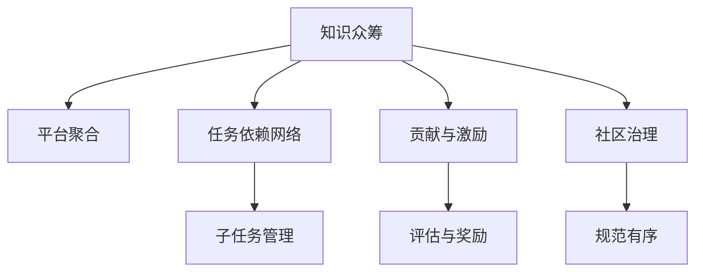

                 

# 知识的众筹模式：大众参与的研究方式

> 关键词：众筹, 知识管理, 大众参与, 研究方式, 创新, 协作平台, 数据贡献, 社区治理, 社会资本

## 1. 背景介绍

### 1.1 问题由来

在知识经济时代，创新成为企业持续发展的核心驱动力。然而，创新的过程往往充满了不确定性，尤其是在复杂的技术领域，如何高效、低成本地产生高质量的创新成果，成为了一个重大挑战。传统的创新方式往往依赖于少数专家团队，这种“闭门造车”的方式，不仅效率低下，还可能陷入思维定式，难以实现真正的创新突破。

为了解决这一问题，近年来，“知识众筹”模式应运而生。它利用互联网平台，将创新任务分解成多个小任务，吸引大众参与其中，从而汇聚集体智慧，加速创新进程。与传统的封闭式创新不同，知识众筹模式更强调开放、协作和共享，充分利用了众人的智慧和资源，降低了创新成本，提高了创新成功率。

### 1.2 问题核心关键点

知识众筹模式的核心关键点在于：

- **任务分解与子任务管理**：将复杂的大型创新任务分解成可操作的子任务，并分配给不同背景的参与者，形成任务依赖网络，提高任务完成的效率和质量。
- **贡献与激励机制**：通过合理的激励机制，吸引公众积极参与，并对其贡献进行评估和奖励。
- **社区治理**：在众筹平台建立良好的社区治理机制，确保平台规范有序运行，鼓励用户积极贡献并维护平台健康发展。
- **数据贡献与融合**：汇聚不同参与者的数据贡献，通过集成创新，产生更加丰富、多样、可信的知识。

这些关键点共同构成了知识众筹模式的核心理念和运作机制，为大众参与研究提供了一个全新的范式。

## 2. 核心概念与联系

### 2.1 核心概念概述

为更好地理解知识众筹模式，本节将介绍几个密切相关的核心概念：

- **知识众筹(Knowledge Crowdfunding)**：利用互联网平台，吸引大众参与创新任务，形成集体智慧的聚合和共享，加速知识创新的过程。
- **平台聚合**：通过搭建线上平台，汇集不同领域专家的知识和经验，促进信息交流和协作。
- **任务依赖网络**：将创新任务分解成多个子任务，每个任务之间有明确依赖关系，形成网络结构，提高任务完成的效率和质量。
- **贡献与激励**：设计合理的激励机制，鼓励大众积极参与，并对贡献进行评估和奖励，确保平台的良性运行。
- **社区治理**：在众筹平台建立良好的社区治理机制，确保平台规范有序运行，促进协作和共享。

这些核心概念之间的逻辑关系可以通过以下Mermaid流程图来展示：



这个流程图展示了许多核心概念之间的相互关系：

1. 知识众筹通过平台聚合汇聚不同领域的专家，形成任务依赖网络，并通过任务分解和管理，提升任务完成效率。
2. 贡献与激励机制吸引公众积极参与，并通过评估和奖励确保平台良性运行。
3. 社区治理确保平台规范有序，促进协作和共享。

这些概念共同构成了知识众筹模式的运作框架，使其能够高效地汇聚和整合众人的智慧和资源。

## 3. 核心算法原理 & 具体操作步骤

### 3.1 算法原理概述

知识众筹模式基于任务依赖网络，将复杂的大型创新任务分解成可操作的子任务，并分配给不同背景的参与者，形成任务依赖网络，提高任务完成的效率和质量。其主要算法原理包括：

- **任务分解与子任务管理**：将创新任务分解成多个子任务，每个任务之间有明确依赖关系，形成网络结构。
- **贡献与激励机制**：设计合理的激励机制，鼓励大众积极参与，并对贡献进行评估和奖励。
- **社区治理**：在众筹平台建立良好的社区治理机制，确保平台规范有序运行，促进协作和共享。

### 3.2 算法步骤详解

知识众筹模式的具体操作步骤如下：

1. **任务定义与分解**：
   - 定义创新的总体目标和任务，将其分解成多个可操作的子任务，每个子任务具有明确的目标和完成标准。
   - 将任务分解成小的、独立的任务单元，以便于分配和执行。

2. **平台搭建与宣传**：
   - 搭建线上平台，为大众提供一个方便的参与渠道，并设计用户界面和交互方式，便于用户了解和参与任务。
   - 通过多种渠道进行宣传，吸引大众参与，如社交媒体、邮件列表、专业论坛等。

3. **任务分配与依赖关系建立**：
   - 将任务分配给具有相应背景和技能的志愿者，并建立任务之间的依赖关系。
   - 为每个任务分配负责人，确保任务按时完成，并负责协调任务之间的依赖关系。

4. **贡献与激励**：
   - 设计合理的激励机制，如积分、奖励、证书等，鼓励大众积极参与，并对贡献进行评估和奖励。
   - 通过社区反馈和评价，确保任务完成质量，并对贡献者进行公正评估。

5. **社区治理与维护**：
   - 建立良好的社区治理机制，如规则制定、用户反馈、投诉处理等，确保平台规范有序运行。
   - 定期更新和维护平台，及时修复漏洞，优化用户体验。

### 3.3 算法优缺点

知识众筹模式有以下优点：

- **高效协作**：通过将任务分解成多个子任务，大众可以在不同阶段、不同领域协作，形成高效的工作网络。
- **成本低廉**：利用互联网平台，减少线下交流成本，提高任务完成的效率。
- **创新加速**：汇聚众人的智慧和资源，加速创新进程，提高创新成功率。

同时，该模式也存在一定的局限性：

- **质量参差不齐**：大众的参与质量可能存在差异，需要建立有效的评估和筛选机制。
- **激励机制复杂**：设计合理的激励机制需要考虑多方面因素，如公平性、可行性等。
- **社区治理难度大**：如何维护社区秩序，避免滥竽充数和恶意行为，是众筹平台面临的重要挑战。

尽管存在这些局限性，但就目前而言，知识众筹模式仍是一种高效、低成本的创新方式，具有广泛的应用前景。

### 3.4 算法应用领域

知识众筹模式在多个领域都有广泛的应用，例如：

- **开源项目**：如Linux内核、Apache软件基金会等，通过众筹模式吸引全球开发者参与贡献，推动项目持续发展。
- **科学研究**：如GDP的估算、气候变化的预测等，通过众筹平台汇聚研究数据，加速科研进程。
- **公共事务**：如环境保护、城市规划等，通过社区参与推动公共政策的制定和执行。
- **企业创新**：如产品设计、市场调研等，通过众筹模式汇聚外部智慧，提升企业创新能力。
- **社会治理**：如社区自治、政策建议等，通过众筹平台增强社会治理的透明度和参与度。

这些领域中的成功应用，展示了知识众筹模式在推动创新、促进协作、提升治理等方面的巨大潜力。

## 4. 数学模型和公式 & 详细讲解

### 4.1 数学模型构建

知识众筹模式可以通过数学模型进行更加严格的刻画。假设任务总数为 $N$，每个任务分解成 $K$ 个子任务，每个子任务需要 $M_i$ 单位时间完成，设 $T_i$ 为子任务 $i$ 的实际完成时间。每个子任务的贡献度为 $C_i$，任务总贡献度为 $C$。每个任务的完成度为 $D_i$，任务总完成度为 $D$。任务分配的平均时间 $T$ 为所有子任务完成时间的加权平均值。

定义任务依赖关系矩阵 $A$，其中 $a_{ij}=1$ 表示任务 $i$ 依赖于任务 $j$，$a_{ij}=0$ 表示不依赖。

定义激励机制参数 $\alpha$，表示任务完成度对贡献的权重。

数学模型构建如下：

1. **任务完成度计算**：
   - $D_i = \frac{\sum_{j=1}^N a_{ij}C_j}{\sum_{j=1}^N a_{ij}T_j}$

2. **任务总完成度计算**：
   - $D = \sum_{i=1}^N D_i$

3. **任务总贡献度计算**：
   - $C = \sum_{i=1}^N C_i$

4. **任务平均完成时间计算**：
   - $T = \sum_{i=1}^N C_iD_i / C$

### 4.2 公式推导过程

以下我们以科学研究任务为例，推导贡献度的计算公式。

假设任务 $i$ 的总贡献度 $C_i = c_1 + c_2 + \cdots + c_k$，其中 $c_j$ 表示子任务 $j$ 的贡献度，其贡献度评估可以通过专家评分、数据质量等指标计算得到。

设 $T_i = t_1 + t_2 + \cdots + t_k$，其中 $t_j$ 表示子任务 $j$ 的完成时间。则任务 $i$ 的总完成度 $D_i = \frac{c_1 + c_2 + \cdots + c_k}{t_1 + t_2 + \cdots + t_k}$。

在数学模型中，任务总贡献度 $C$ 和总完成度 $D$ 分别表示为：

- $C = \sum_{i=1}^N c_i$
- $D = \sum_{i=1}^N \frac{c_i}{t_i}$

通过这些公式，我们可以对任务完成度和贡献度进行精确计算，从而评估每个参与者的贡献，并对其激励进行合理分配。

### 4.3 案例分析与讲解

**案例：全球温度数据贡献平台**

为了推动气候变化的科学研究，某国际科学组织搭建了一个全球温度数据贡献平台，通过知识众筹模式，吸引全球志愿者参与温度数据的收集和分析。具体步骤如下：

1. **任务定义与分解**：
   - 定义全球温度数据收集任务，并将其分解成多个子任务，如数据收集、清洗、分析等。
   - 每个子任务设定明确的目标和完成标准，如数据收集任务要求每天收集10个数据点。

2. **平台搭建与宣传**：
   - 搭建在线平台，方便全球志愿者参与任务，并设计简单易用的用户界面。
   - 通过社交媒体、邮件列表等渠道进行宣传，吸引全球志愿者参与。

3. **任务分配与依赖关系建立**：
   - 将任务分配给具有相应背景和技能的志愿者，并建立任务之间的依赖关系。
   - 为每个任务分配负责人，确保任务按时完成，并协调任务之间的依赖关系。

4. **贡献与激励**：
   - 设计合理的激励机制，如积分、奖励、证书等，鼓励志愿者积极参与，并对贡献进行评估和奖励。
   - 通过社区反馈和评价，确保任务完成质量，并对贡献者进行公正评估。

5. **社区治理与维护**：
   - 建立良好的社区治理机制，如规则制定、用户反馈、投诉处理等，确保平台规范有序运行。
   - 定期更新和维护平台，及时修复漏洞，优化用户体验。

通过上述步骤，该平台成功地吸引了全球数千名志愿者参与全球温度数据的收集和分析，极大地推动了气候变化的研究进展，展示了知识众筹模式的强大潜力。

## 5. 项目实践：代码实例和详细解释说明

### 5.1 开发环境搭建

在进行知识众筹平台开发前，我们需要准备好开发环境。以下是使用Python进行Django开发的环境配置流程：

1. 安装Anaconda：从官网下载并安装Anaconda，用于创建独立的Python环境。

2. 创建并激活虚拟环境：
```bash
conda create -n crowdsourcing-env python=3.8 
conda activate crowdsourcing-env
```

3. 安装Django：根据CUDA版本，从官网获取对应的安装命令。例如：
```bash
conda install django
```

4. 安装各类工具包：
```bash
pip install numpy pandas scikit-learn matplotlib tqdm jupyter notebook ipython
```

完成上述步骤后，即可在`crowdsourcing-env`环境中开始平台开发。

### 5.2 源代码详细实现

下面我们以科学研究任务为例，给出使用Django搭建知识众筹平台的PyTorch代码实现。

首先，定义任务模型：

```python
from django.db import models

class Task(models.Model):
    name = models.CharField(max_length=100)
    description = models.TextField()
    dependencies = models.ManyToManyField('self')
    start_time = models.DateTimeField(auto_now_add=True)
    end_time = models.DateTimeField()
    contributors = models.ManyToManyField('Contributor')
    completed = models.BooleanField(default=False)

    def __str__(self):
        return self.name
```

然后，定义贡献者模型：

```python
class Contributor(models.Model):
    name = models.CharField(max_length=100)
    email = models.EmailField()
    contributions = models.ManyToManyField(Task)
    score = models.DecimalField(max_digits=5, decimal_places=2)

    def __str__(self):
        return self.name
```

接着，定义激励模型：

```python
class Incentive(models.Model):
    name = models.CharField(max_length=100)
    amount = models.DecimalField(max_digits=10, decimal_places=2)
    contributors = models.ManyToManyField(Contributor)

    def __str__(self):
        return self.name
```

然后，定义视图和模板：

```python
from django.shortcuts import render
from django.views.generic import ListView, DetailView
from .models import Task, Contributor, Incentive

class TaskListView(ListView):
    model = Task
    template_name = 'task_list.html'

class TaskDetailView(DetailView):
    model = Task
    template_name = 'task_detail.html'

class ContributorListView(ListView):
    model = Contributor
    template_name = 'contributor_list.html'

class IncentiveListView(ListView):
    model = Incentive
    template_name = 'incentive_list.html'
```

最后，编写相关视图函数和模板代码，完成用户界面设计：

```html
<!-- task_list.html -->



    <h1>Tasks</h1>
    <ul>
        
            <li><a href="">{{ task.name }}</a></li>
        
    </ul>

```

```html
<!-- task_detail.html -->



    <h1>{{ task.name }}</h1>
    <p>{{ task.description }}</p>
    <ul>
        <li>Dependencies: {{ task.dependencies.all }}</li>
        <li>Start Time: {{ task.start_time }}</li>
        <li>End Time: {{ task.end_time }}</li>
        <li>Contributors: {{ task.contributors.all }}</li>
        <li>Completed: {{ task.completed }}</li>
    </ul>

```

以上是使用Django对知识众筹平台进行开发的基本代码实现。可以看到，利用Django等框架，平台开发的复杂度大大降低，开发者可以将更多精力放在业务逻辑的设计上，而不必过多关注底层的实现细节。

### 5.3 代码解读与分析

让我们再详细解读一下关键代码的实现细节：

**Task模型**：
- `name` 字段：任务的名称。
- `description` 字段：任务的描述。
- `dependencies` 字段：任务之间的依赖关系，通过多对多关系表示。
- `start_time` 字段：任务的起始时间，自动设置为创建时间。
- `end_time` 字段：任务的结束时间。
- `contributors` 字段：任务的贡献者列表，通过多对多关系表示。
- `completed` 字段：任务是否完成。

**Contributor模型**：
- `name` 字段：贡献者的姓名。
- `email` 字段：贡献者的邮箱。
- `contributions` 字段：贡献者对任务的贡献列表，通过多对多关系表示。
- `score` 字段：贡献者的得分，通过小数点后两位保留。

**Incentive模型**：
- `name` 字段：激励的名称。
- `amount` 字段：激励的金额，通过小数点后两位保留。
- `contributors` 字段：激励的接受者列表，通过多对多关系表示。

**视图和模板**：
- `TaskListView` 视图：展示所有任务的列表，点击任务名称进入任务详情页面。
- `TaskDetailView` 视图：展示单个任务的详情，包括任务描述、依赖关系、贡献者列表等信息。
- `ContributorListView` 视图：展示所有贡献者的列表，显示每个贡献者的任务贡献情况和得分。
- `IncentiveListView` 视图：展示所有激励的列表，显示每个激励的金额和接受者列表。

可以看到，通过Django框架的封装，平台开发的代码实现变得简洁高效。开发者可以灵活地扩展和定制平台的功能，满足不同的需求。

## 6. 实际应用场景

### 6.1 科学研究

知识众筹模式在科学研究中得到了广泛应用，例如全球温度数据贡献平台、全球基因组计划等，通过汇聚全球科学家的智慧和资源，加速科学研究进程，推动人类对自然界的认识。

### 6.2 开源项目

开源项目如Linux内核、Apache软件基金会等，通过知识众筹模式吸引全球开发者参与贡献，推动项目持续发展，提升代码质量和开发效率。

### 6.3 公共事务

在公共事务领域，如环境保护、城市规划等，通过知识众筹模式增强社区自治和公民参与，推动公共政策的制定和执行，促进社会治理的透明化和民主化。

### 6.4 企业创新

在企业创新领域，通过知识众筹模式汇聚外部智慧，提升企业创新能力和产品竞争力，推动企业持续发展。

### 6.5 社会治理

在社会治理领域，通过知识众筹模式增强社会治理的透明度和参与度，推动社会治理的现代化和智能化。

## 7. 工具和资源推荐

### 7.1 学习资源推荐

为了帮助开发者系统掌握知识众筹的理论基础和实践技巧，这里推荐一些优质的学习资源：

1. 《 crowdsourcing》一书：由众筹领域的专家撰写，深入浅出地介绍了知识众筹的理论基础、实践方法和案例分析。
2. 《 crowdsourcing: translating research into action》一书：详细介绍了知识众筹的应用场景和案例，探讨了众筹平台的设计和运营策略。
3. Coursera上的《 crowdsourcing》课程：由众筹领域的专家讲授，系统介绍了众筹的理论基础和实践技巧，适合初学者入门。
4. edX上的《 crowdsourcing》课程：由众筹领域的专家讲授，介绍了知识众筹的应用场景和案例，适合进阶学习。
5. Udemy上的《 crowdsourcing》课程：详细介绍了知识众筹的实践技巧和案例分析，适合实战演练。

通过对这些资源的学习实践，相信你一定能够快速掌握知识众筹的精髓，并用于解决实际的创新问题。

### 7.2 开发工具推荐

高效的开发离不开优秀的工具支持。以下是几款用于知识众筹平台开发的常用工具：

1. Django：基于Python的Web框架，功能强大，易于扩展，适合开发复杂的众筹平台。
2. Flask：轻量级的Web框架，灵活高效，适合快速开发小型的众筹平台。
3. React：基于组件化的JavaScript库，适合开发动态用户界面。
4. Bootstrap：流行的前端框架，提供了丰富的组件和样式，适合快速构建美观的用户界面。
5. PostgreSQL：可靠的数据库，适合存储和管理众筹平台的数据。

合理利用这些工具，可以显著提升知识众筹平台开发的效率，加快创新迭代的步伐。

### 7.3 相关论文推荐

知识众筹模式的发展得益于学界的持续研究。以下是几篇奠基性的相关论文，推荐阅读：

1. "Crowdsourcing: A New Model for Collaborative Problem Solving" by Howard A. Smith：提出了知识众筹的概念，探讨了其运作机制和应用场景。
2. "Crowdsourcing Design: A Guide to Platform Development" by William F. Blythe III, Robert Munson：详细介绍了知识众筹平台的设计和运营策略，提供了丰富的案例分析。
3. "Crowdsourcing Development: A Framework for Implementing Crowdsourcing" by Tim O'Reilly：探讨了知识众筹的实施框架和方法，适合实际应用。
4. "Crowdsourcing Data: A Critical Analysis" by Steve Blank, Jeff Howe：分析了数据众筹的优缺点，探讨了其应用场景和挑战。
5. "Crowdsourcing Platforms: A Review of the Literature" by Markus Wagner, Jean-Pierre Lambert：系统回顾了知识众筹平台的研究进展，提供了丰富的文献参考。

这些论文代表了大众参与研究的发展脉络。通过学习这些前沿成果，可以帮助研究者把握学科前进方向，激发更多的创新灵感。

## 8. 总结：未来发展趋势与挑战

### 8.1 总结

本文对知识众筹模式进行了全面系统的介绍。首先阐述了知识众筹模式的核心理念和运作机制，明确了其高效协作、成本低廉、创新加速等优点。其次，从原理到实践，详细讲解了知识众筹模型的核心算法原理和具体操作步骤，给出了平台开发的完整代码实例。同时，本文还广泛探讨了知识众筹模式在科学研究、开源项目、公共事务、企业创新、社会治理等多个领域的应用前景，展示了其巨大的潜力。

通过本文的系统梳理，可以看到，知识众筹模式利用互联网平台，吸引大众参与创新任务，形成集体智慧的聚合和共享，加速创新进程，具有广泛的应用前景。未来，伴随众筹平台技术的不断进步，知识众筹模式必将在更多领域得到应用，为社会发展和人类福祉带来深远影响。

### 8.2 未来发展趋势

展望未来，知识众筹模式将呈现以下几个发展趋势：

1. **平台生态系统**：平台之间将形成紧密的生态系统，用户和资源可以在不同平台之间自由流动，提升整体创新效率。
2. **技术融合**：知识众筹将与区块链、物联网等技术进行融合，提升平台的透明性和安全性，降低信任成本。
3. **全球化应用**：平台将逐步实现全球化，吸引全球志愿者参与贡献，推动全球创新。
4. **跨学科融合**：知识众筹将与更多的学科进行融合，如社会学科、工程技术、医学等，提升跨学科研究的创新能力。
5. **数据驱动**：平台将更加依赖数据驱动，通过大数据分析优化任务分配和激励机制，提升平台运行效率。

以上趋势展示了知识众筹模式在推动创新、促进协作、提升治理等方面的巨大潜力。这些方向的探索发展，必将进一步提升知识众筹平台的性能和应用范围，为社会发展和人类福祉带来深远影响。

### 8.3 面临的挑战

尽管知识众筹模式已经取得了瞩目成就，但在迈向更加智能化、普适化应用的过程中，它仍面临诸多挑战：

1. **质量控制**：如何确保任务完成质量和用户贡献的真实性，需要建立有效的评估和筛选机制。
2. **激励机制复杂**：设计合理的激励机制需要考虑多方面因素，如公平性、可行性等。
3. **社区治理难度大**：如何维护社区秩序，避免滥竽充数和恶意行为，是众筹平台面临的重要挑战。
4. **数据隐私和安全**：如何保护用户数据隐私和安全，防止数据泄露和滥用，是众筹平台需要解决的重大问题。
5. **平台可持续性**：如何确保平台长期稳定运行，避免平台疲劳和用户流失，需要持续优化和维护。

尽管存在这些挑战，但通过不断改进和优化，知识众筹模式必将在更多领域得到应用，为社会发展和人类福祉带来深远影响。

### 8.4 研究展望

面向未来，知识众筹模式的研究需要在以下几个方面寻求新的突破：

1. **技术创新**：引入更多的技术手段，如人工智能、区块链等，提升平台的智能化和安全性。
2. **社区治理**：建立更加完善的社区治理机制，确保平台规范有序运行，促进协作和共享。
3. **数据隐私**：研究如何保护用户数据隐私和安全，防止数据泄露和滥用。
4. **跨学科融合**：推动知识众筹与更多学科的融合，提升跨学科研究的创新能力。
5. **全球化应用**：推动平台全球化，吸引全球志愿者参与贡献，推动全球创新。

这些研究方向的探索，必将引领知识众筹模式迈向更高的台阶，为社会发展和人类福祉带来深远影响。

## 9. 附录：常见问题与解答

**Q1：知识众筹模式是否适用于所有创新任务？**

A: 知识众筹模式在大多数创新任务上都能取得不错的效果，特别是对于数据量较小的任务。但对于一些特定领域的任务，如医学、法律等，仅仅依靠通用语料预训练的模型可能难以很好地适应。此时需要在特定领域语料上进一步预训练，再进行微调，才能获得理想效果。此外，对于一些需要时效性、个性化很强的任务，如对话、推荐等，微调方法也需要针对性的改进优化。

**Q2：如何设计合理的激励机制？**

A: 设计合理的激励机制需要考虑多方面因素，如公平性、可行性等。一般可以从以下几个方面考虑：
1. 贡献度评估：根据任务的完成度和贡献者的实际贡献，评估其贡献度。
2. 激励类型：设计多种激励类型，如积分、奖励、证书等，满足不同贡献者的需求。
3. 激励策略：设计灵活的激励策略，如分级激励、即时激励等，提升用户参与积极性。
4. 激励监控：建立激励监控机制，确保激励机制的公平性和透明度。

这些策略需要根据具体任务和平台特点进行灵活组合，以实现最优的效果。

**Q3：如何保证任务完成质量？**

A: 保证任务完成质量需要建立有效的评估和筛选机制，如：
1. 任务评估指标：根据任务目标设定评估指标，如准确率、完成度、贡献度等。
2. 贡献者筛选：根据贡献者的历史表现和贡献度进行筛选，选择有信誉的贡献者参与任务。
3. 任务监督：建立任务监督机制，对任务完成情况进行定期检查，确保任务按时完成。
4. 反馈机制：建立反馈机制，及时收集用户反馈，改进任务完成质量。

这些措施需要与平台运行机制紧密结合，以实现高效的任务完成和用户参与。

**Q4：知识众筹模式是否需要平台支持？**

A: 知识众筹模式需要平台支持，平台作为知识众筹的载体，提供任务分配、贡献者管理、激励机制等功能，帮助大众参与创新任务。平台还可以提供数据分析、任务监控等辅助工具，提升任务完成的效率和质量。

以上是知识众筹模式及其应用的详细介绍，希望能为读者提供有价值的参考。

---

作者：禅与计算机程序设计艺术 / Zen and the Art of Computer Programming

