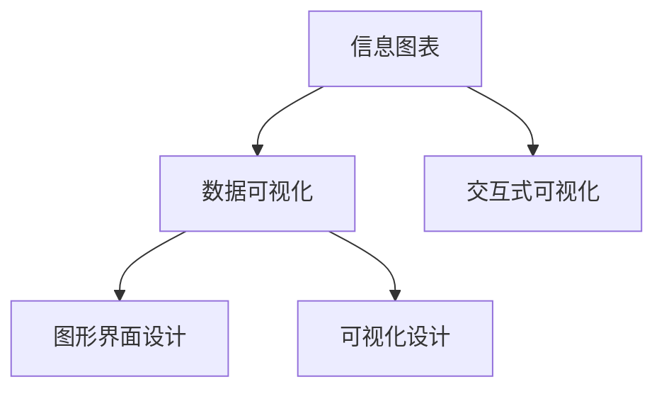

                 

# 知识的可视化工具：信息图表的力量

> 关键词：信息图表, 知识可视化, 数据可视化, 图形界面设计, 数据图表, 交互式可视化

## 1. 背景介绍

### 1.1 问题由来
在信息化和数字化时代，信息爆炸导致我们日常接收到的数据量急剧增加。传统的数据表示方式，如文本、表格等，往往难以直观、有效地传达复杂信息。因此，信息图表作为一种新型的数据表示和沟通工具，逐渐成为数据可视化的主流形式。信息图表以其简洁明了、形式多样的特点，不仅方便人们理解和记忆，还能够在沟通和交流中产生更大的影响力。

### 1.2 问题核心关键点
信息图表的核心在于将复杂的数据和信息转化为易于理解和记忆的视觉形式。信息图表的核心优势在于其直观性、易读性、可理解性，能够在短时间内传达大量信息，帮助人们快速做出决策。同时，信息图表还可以用于展示数据的趋势、比较、关联、分布等复杂关系，帮助用户发现数据中的模式和规律。

### 1.3 问题研究意义
研究信息图表的设计和应用，对于提升信息传达效率、优化决策过程、推动数据科学和商业智能的普及具有重要意义。信息图表不仅在数据可视化和信息传播中起到关键作用，还能够在教育、市场营销、新闻媒体等多个领域中发挥重要作用。通过深入了解信息图表的设计原则和应用方法，我们可以更好地利用数据可视化技术，为社会创造更多价值。

## 2. 核心概念与联系

### 2.1 核心概念概述

为更好地理解信息图表的原理和应用，本节将介绍几个关键概念：

- 信息图表(Information Chart)：将数据和信息以图形化的方式进行表示，帮助用户快速理解和分析数据的工具。
- 数据可视化(Data Visualization)：通过图形、图表等视觉元素，将数据转化为直观、易于理解的形式，帮助人们更好地理解和分析数据。
- 图形界面设计(UI/UX Design)：专注于界面的设计，关注用户体验和易用性，使信息图表更加友好和高效。
- 可视化设计(Visualization Design)：研究如何将抽象数据转化为直观、易懂的视觉表现形式，包括图表的布局、色彩、符号设计等。
- 交互式可视化(Interactive Visualization)：通过交互手段，如鼠标悬停、点击等，增强图表的互动性，帮助用户更深入地探索数据。

这些核心概念之间的联系可以通过以下Mermaid流程图来展示：



这个流程图展示了信息图表的设计流程：

1. 信息图表是基于数据可视化的，通过图形界面设计和技术手段，将数据转化为直观、易懂的视觉形式。
2. 可视化设计关注图表的布局、色彩、符号等视觉元素，提升图表的可读性和吸引力。
3. 交互式可视化通过用户交互手段，增强图表的互动性和探索深度。

## 3. 核心算法原理 & 具体操作步骤
### 3.1 算法原理概述

信息图表的设计和实现涉及多个环节，主要包括数据准备、图表设计、界面优化、交互设计等。其核心原理是将复杂的数据和信息转化为视觉元素，通过图形、颜色、字体等手段，将数据和信息传递给用户。

信息图表的生成过程通常包括以下步骤：

1. 数据收集和预处理：收集和清洗数据，确保数据质量和完整性。
2. 数据分析和建模：对数据进行分析和建模，发现数据中的模式和规律。
3. 图表设计和布局：根据数据特点，选择合适的图表类型和布局方式。
4. 界面设计和优化：优化图表的界面，提高可读性和易用性。
5. 交互设计和实现：通过交互手段，增强图表的互动性和探索深度。

### 3.2 算法步骤详解

信息图表的设计和实现流程可以分为以下几个关键步骤：

**Step 1: 数据准备**
- 收集和清洗数据，确保数据质量和完整性。
- 根据分析目标，选择合适的数据集和分析方法。
- 将数据转化为图表所需的数据格式，如数值、类别、时间序列等。

**Step 2: 图表设计和布局**
- 根据数据特点，选择合适的图表类型，如柱状图、折线图、饼图等。
- 设计图表的布局，包括轴线、标签、图例等元素的位置和样式。
- 考虑图表的可读性，选择合适的颜色、字体大小和对比度。

**Step 3: 界面设计和优化**
- 设计图表的界面，包括工具栏、标题、描述等元素。
- 优化界面的布局，提高可读性和易用性。
- 考虑不同用户群体的需求，设计多语言、多格式的界面。

**Step 4: 交互设计和实现**
- 设计图表的交互方式，如鼠标悬停、点击等。
- 实现交互功能，增强图表的互动性和探索深度。
- 考虑不同用户群体的使用习惯，优化交互方式和功能。

**Step 5: 测试和发布**
- 对图表进行测试，确保其功能和可读性。
- 优化图表的性能，提高加载速度和响应速度。
- 发布图表，让用户访问和使用。

### 3.3 算法优缺点

信息图表的设计和实现具有以下优点：
1. 直观性：通过视觉元素将复杂数据转化为易于理解的形式，帮助用户快速做出决策。
2. 易读性：简洁明了的图形和符号，使图表更易于理解和记忆。
3. 易用性：通过交互手段，用户可以更加深入地探索数据，发现数据中的模式和规律。
4. 可扩展性：信息图表可以适应不同数据集和分析目标，满足多样化的需求。

同时，信息图表的设计和实现也存在一些局限性：
1. 制作复杂：需要综合考虑数据特点、用户需求、设计原则等多个因素，制作过程较为复杂。
2. 适应性有限：不同类型的数据可能需要不同的图表类型和设计方式，难以适应所有数据集。
3. 可解释性不足：复杂的图表设计可能让用户难以理解，需要适当的解释和说明。
4. 易受数据质量影响：数据质量不高可能导致图表的误导性，用户做出错误决策。

尽管存在这些局限性，但信息图表在数据可视化和信息传播中仍然发挥着不可替代的作用。随着技术的发展和设计的不断优化，信息图表将会变得更加高效和智能。

### 3.4 算法应用领域

信息图表的应用领域广泛，涵盖各个行业的业务分析和决策支持。以下是一些典型的应用场景：

- 企业数据分析：用于展示企业运营数据，帮助管理层做出决策。
- 市场营销：用于展示市场数据，帮助企业制定营销策略。
- 金融分析：用于展示金融数据，帮助投资者做出投资决策。
- 医疗健康：用于展示健康数据，帮助医生做出诊断和治疗决策。
- 教育培训：用于展示学习数据，帮助教师制定教学策略。
- 政府决策：用于展示政府数据，帮助政府制定政策和规划。

除了这些传统领域，信息图表还在新闻媒体、社交网络、科学研究等多个领域中得到了广泛应用。

## 4. 数学模型和公式 & 详细讲解 & 举例说明

### 4.1 数学模型构建

信息图表的生成涉及数据处理、图形设计等多个环节，以下是一些常用的数学模型：

- 数据处理模型：用于清洗和处理数据，如去重、缺失值处理、数据转换等。
- 图表设计模型：用于选择合适的图表类型和设计布局，如柱状图、折线图、饼图等。
- 界面设计模型：用于设计界面元素和布局，如工具栏、标题、描述等。
- 交互设计模型：用于设计交互方式和功能，如鼠标悬停、点击等。

### 4.2 公式推导过程

以一个简单的柱状图为例，其生成过程可以概括为以下几个步骤：

1. 数据收集和预处理：
   - 假设有一个数据集 $D=\{(x_i, y_i)\}_{i=1}^n$，其中 $x_i$ 表示类别标签，$y_i$ 表示该类别的计数。
   - 对数据进行清洗和预处理，确保数据完整性和一致性。

2. 图表设计和布局：
   - 选择合适的图表类型，如柱状图。
   - 设计图表的布局，包括柱子的高度、宽度、颜色等。
   - 设计横纵坐标轴、图例等元素的位置和样式。

3. 界面设计和优化：
   - 设计图表的界面，包括工具栏、标题、描述等元素。
   - 优化界面的布局，提高可读性和易用性。

4. 交互设计和实现：
   - 设计交互方式，如鼠标悬停、点击等。
   - 实现交互功能，增强图表的互动性和探索深度。

5. 测试和发布：
   - 对图表进行测试，确保其功能和可读性。
   - 优化图表的性能，提高加载速度和响应速度。
   - 发布图表，让用户访问和使用。

### 4.3 案例分析与讲解

假设我们要展示某地区的月均气温变化，可以采用以下步骤：

1. 数据收集和预处理：
   - 收集该地区的月均气温数据，进行清洗和预处理。
   - 将数据转化为图表所需的数据格式，如数值。

2. 图表设计和布局：
   - 选择合适的图表类型，如折线图。
   - 设计图表的布局，包括横纵坐标轴、时间标签、气温值等。
   - 设计图例、标题、描述等元素。

3. 界面设计和优化：
   - 设计图表的界面，包括工具栏、标题、描述等元素。
   - 优化界面的布局，提高可读性和易用性。

4. 交互设计和实现：
   - 设计交互方式，如鼠标悬停、点击等。
   - 实现交互功能，增强图表的互动性和探索深度。

5. 测试和发布：
   - 对图表进行测试，确保其功能和可读性。
   - 优化图表的性能，提高加载速度和响应速度。
   - 发布图表，让用户访问和使用。

## 5. 项目实践：代码实例和详细解释说明

### 5.1 开发环境搭建

在进行信息图表的开发前，我们需要准备好开发环境。以下是使用Python进行PyCharm开发的环境配置流程：

1. 安装Anaconda：从官网下载并安装Anaconda，用于创建独立的Python环境。

2. 创建并激活虚拟环境：
```bash
conda create -n pyvisualization python=3.8 
conda activate pyvisualization
```

3. 安装PyCharm：下载并安装PyCharm IDE，适合图形界面设计和交互式开发。

4. 安装必要的库：
```bash
pip install matplotlib pandas seaborn plotly
```

5. 安装相关的工具：
```bash
pip install plotly-graph_objects dash dash-dependent-components
```

完成上述步骤后，即可在`pyvisualization`环境中开始信息图表的开发。

### 5.2 源代码详细实现

下面我们以一个简单的柱状图为例，给出使用Plotly库生成信息图表的Python代码实现。

```python
import plotly.graph_objects as go
import pandas as pd

# 读取数据
data = pd.read_csv('temperature.csv')

# 创建柱状图
fig = go.Figure(data=go.Bar(x=data['month'], y=data['temperature']))

# 添加布局
fig.update_layout(
    title='Monthly Average Temperature',
    xaxis_title='Month',
    yaxis_title='Temperature (°C)'
)

# 显示图表
fig.show()
```

这个代码片段展示了如何使用Plotly库生成一个简单的柱状图。可以看到，生成信息图表的过程相对简单，只需调用相应的函数和配置即可。

### 5.3 代码解读与分析

让我们再详细解读一下关键代码的实现细节：

**读取数据**：
- 使用`pandas`库读取数据文件，将数据转化为Pandas DataFrame格式。
- 假设数据文件名为`temperature.csv`，文件格式为csv。

**创建柱状图**：
- 使用`plotly.graph_objects`模块中的`Bar`类，创建柱状图数据。
- `x`参数表示横坐标数据，`y`参数表示纵坐标数据。
- `data`参数为数据源，用于绘制图表。

**添加布局**：
- 使用`update_layout`方法，添加图表的标题、横纵坐标轴标题等布局元素。
- `title`参数表示图表的标题。
- `xaxis_title`和`yaxis_title`参数分别表示横纵坐标轴的标题。

**显示图表**：
- 使用`show`方法，显示图表。

可以看到，使用Plotly库生成信息图表的过程相对简洁，代码量较少，易于理解和实现。

## 6. 实际应用场景

### 6.1 企业数据分析

企业数据分析是信息图表在商业领域的重要应用场景。通过信息图表，企业可以直观地展示运营数据，帮助管理层做出决策。例如，可以使用柱状图展示各部门的销售业绩，使用饼图展示各产品的销售占比，使用折线图展示销售趋势等。信息图表可以帮助企业发现数据中的模式和规律，制定更加科学合理的业务策略。

### 6.2 市场营销

市场营销是信息图表在广告和市场推广领域的重要应用场景。通过信息图表，企业可以展示市场数据，帮助制定营销策略。例如，可以使用折线图展示市场份额的变化趋势，使用散点图展示用户行为和反馈，使用地图展示用户分布等。信息图表可以帮助企业更好地理解市场动态，制定更加精准的营销策略。

### 6.3 金融分析

金融分析是信息图表在金融领域的重要应用场景。通过信息图表，投资者可以直观地展示金融数据，帮助做出投资决策。例如，可以使用柱状图展示各行业的市值，使用折线图展示股价变化趋势，使用饼图展示资产配置比例等。信息图表可以帮助投资者发现市场中的投资机会，规避风险。

### 6.4 医疗健康

医疗健康是信息图表在医疗领域的重要应用场景。通过信息图表，医生可以直观地展示健康数据，帮助做出诊断和治疗决策。例如，可以使用折线图展示患者的体温变化，使用饼图展示病种分布，使用散点图展示症状与疾病的关系等。信息图表可以帮助医生更好地理解患者的健康状况，制定更加科学的治疗方案。

### 6.5 教育培训

教育培训是信息图表在教育领域的重要应用场景。通过信息图表，教师可以直观地展示学习数据，帮助制定教学策略。例如，可以使用柱状图展示学生的成绩分布，使用折线图展示学生的学习进度，使用饼图展示课程内容的比例等。信息图表可以帮助教师更好地理解学生的学习情况，制定更加科学的教学计划。

### 6.6 政府决策

政府决策是信息图表在政府领域的重要应用场景。通过信息图表，政府可以直观地展示数据，帮助制定政策和规划。例如，可以使用折线图展示经济增长的趋势，使用饼图展示财政支出结构，使用散点图展示社会事件的发生频率等。信息图表可以帮助政府更好地理解数据，制定更加科学的政策。

## 7. 工具和资源推荐

### 7.1 学习资源推荐

为了帮助开发者系统掌握信息图表的设计和应用，这里推荐一些优质的学习资源：

1. 《Python数据可视化教程》系列书籍：全面介绍了Python中的数据可视化工具，包括Matplotlib、Seaborn、Plotly等，适合初学者和进阶学习者。

2. 《数据可视化实战》系列课程：通过实际项目，深入讲解了数据可视化的原理和实现方法，适合动手实践。

3. 《D3.js权威指南》书籍：介绍了D3.js这个强大的JavaScript数据可视化库，适合学习和使用D3.js进行数据可视化。

4. 《Tableau实战》书籍：介绍了Tableau这个流行的商业智能工具，适合学习和使用Tableau进行数据可视化。

5. 《信息图表设计》课程：由知名设计师和数据可视化专家授课，介绍了信息图表的设计原理和实现方法，适合提升信息图表设计能力。

通过对这些资源的学习实践，相信你一定能够快速掌握信息图表的设计和应用，并用于解决实际的NLP问题。

### 7.2 开发工具推荐

信息图表的开发离不开优秀的工具支持。以下是几款用于信息图表开发的常用工具：

1. PyCharm：强大的IDE工具，支持图形界面设计和交互式开发，适合初学者和高级开发者。

2. Plotly：基于JavaScript的可视化库，支持丰富的图表类型和交互功能，适合制作复杂的交互式图表。

3. Tableau：流行的商业智能工具，支持丰富的数据源和图表类型，适合制作简洁易读的信息图表。

4. D3.js：强大的JavaScript数据可视化库，支持高度定制的图表和交互效果，适合开发复杂的交互式图表。

5. Matplotlib：Python的图表库，支持丰富的图表类型和自定义选项，适合制作基本的信息图表。

6. Seaborn：Python的高级图表库，支持美观的图表风格和高度定制的选项，适合制作专业化的信息图表。

合理利用这些工具，可以显著提升信息图表的开发效率，加快创新迭代的步伐。

### 7.3 相关论文推荐

信息图表的发展源于学界的持续研究。以下是几篇奠基性的相关论文，推荐阅读：

1. 《信息图表设计原则》：介绍了信息图表设计的基本原则和方法，适合理解信息图表的设计原理。

2. 《交互式可视化技术》：介绍了交互式可视化的技术原理和方法，适合理解和实现交互式信息图表。

3. 《数据可视化在市场营销中的应用》：介绍了数据可视化在市场营销中的应用案例，适合学习实际应用场景。

4. 《信息图表在医疗健康中的应用》：介绍了信息图表在医疗健康领域的应用案例，适合学习实际应用场景。

5. 《信息图表在教育培训中的应用》：介绍了信息图表在教育培训领域的应用案例，适合学习实际应用场景。

这些论文代表了大数据可视化技术的发展脉络。通过学习这些前沿成果，可以帮助研究者把握学科前进方向，激发更多的创新灵感。

## 8. 总结：未来发展趋势与挑战

### 8.1 总结

本文对信息图表的设计和应用进行了全面系统的介绍。首先阐述了信息图表和数据可视化的研究背景和意义，明确了信息图表在数据表达和决策支持中的独特价值。其次，从原理到实践，详细讲解了信息图表的生成过程和关键步骤，给出了信息图表开发和应用的全流程代码实例。同时，本文还广泛探讨了信息图表在多个行业领域的应用前景，展示了信息图表的广阔应用场景。此外，本文精选了信息图表设计的各类学习资源，力求为读者提供全方位的技术指引。

通过本文的系统梳理，可以看到，信息图表在数据可视化和信息传播中起到了关键作用。信息图表不仅在信息传达效率和决策支持中具有优势，还在教育、市场营销、金融等多个领域中发挥重要作用。通过深入了解信息图表的设计原则和应用方法，我们可以更好地利用数据可视化技术，为社会创造更多价值。

### 8.2 未来发展趋势

展望未来，信息图表的发展趋势如下：

1. 可视化工具的智能化：未来的信息图表将更加智能化，具备自动化数据挖掘、分析、展示能力，帮助用户更快速、准确地发现数据中的模式和规律。

2. 交互式可视化的多样化：未来的信息图表将支持更多的交互方式，如语音交互、手势交互等，增强用户的互动体验。

3. 可视化工具的集成化：未来的信息图表将与其他工具和系统集成，如大数据平台、机器学习平台等，实现数据的全面可视化。

4. 可视化工具的跨平台化：未来的信息图表将支持跨平台访问，在网页、移动端、桌面端等设备上都能正常使用。

5. 可视化工具的可扩展化：未来的信息图表将支持数据类型、格式和大小的扩展，适应不同数据集和分析需求。

6. 可视化工具的标准化：未来的信息图表将遵循统一的标准和规范，提高可视化的可读性和可比性。

以上趋势凸显了信息图表的发展潜力。这些方向的探索发展，必将进一步提升信息图表的实用性和影响力。

### 8.3 面临的挑战

尽管信息图表在数据可视化和信息传播中已经取得了瞩目成就，但在迈向更加智能化、普适化应用的过程中，仍面临诸多挑战：

1. 数据复杂性：不同类型的数据可能需要不同的可视化方式，难以适应所有数据集。
2. 用户多样性：不同用户群体的需求和偏好不同，难以设计统一的信息图表。
3. 交互复杂性：复杂的交互方式可能使用户感到困惑，影响信息传达效果。
4. 性能瓶颈：大规模数据的可视化可能导致性能瓶颈，影响加载速度和响应速度。
5. 数据安全：用户隐私和数据安全问题可能影响信息图表的应用推广。

尽管存在这些挑战，但随着技术的发展和设计的不断优化，信息图表必将在数据可视化和信息传播中发挥更大作用。未来，信息图表将更加智能化、普适化、多样化，为用户带来更好的体验。

### 8.4 研究展望

面对信息图表面临的挑战，未来的研究需要在以下几个方面寻求新的突破：

1. 探索自动化和智能化的可视化工具：开发具备数据挖掘、分析、展示能力的智能可视化工具，提高用户发现数据模式的能力。

2. 研究和设计适合不同用户群体的信息图表：针对不同用户群体的需求和偏好，设计适合的信息图表，提高可视化工具的可读性和可用性。

3. 研究和实现多样化的交互方式：开发多样化的交互方式，如语音交互、手势交互等，增强用户的互动体验。

4. 优化可视化工具的性能：通过算法优化和硬件升级，提升可视化工具的性能，提高加载速度和响应速度。

5. 研究和实现数据安全保护措施：设计安全保护措施，确保用户隐私和数据安全，提高可视化工具的可信度和可扩展性。

这些研究方向的研究成果，必将引领信息图表技术迈向更高的台阶，为社会创造更多价值。面向未来，信息图表需要与其他技术进行更深入的融合，如人工智能、大数据等，协同发力，共同推动信息图表技术的进步。

## 9. 附录：常见问题与解答

**Q1：信息图表与数据可视化有何区别？**

A: 数据可视化是指将数据以图形化的形式呈现，使数据更易于理解和分析。信息图表则是一种特定的数据可视化形式，通过简洁明了的图形和符号，将数据转化为易于理解的形式，帮助用户快速做出决策。

**Q2：如何选择合适的信息图表类型？**

A: 选择合适的信息图表类型需要考虑数据的类型、特点和分析目标。例如，可以使用柱状图展示分类数据，使用折线图展示趋势数据，使用饼图展示比例数据。

**Q3：信息图表的设计原则有哪些？**

A: 信息图表的设计原则包括简洁性、可读性、准确性、对比性、易理解性等。设计信息图表时，需要考虑图表的布局、颜色、字体等视觉元素，确保图表清晰、易读、易懂。

**Q4：信息图表的交互方式有哪些？**

A: 信息图表的交互方式包括鼠标悬停、点击、拖拽等。交互方式可以增强用户与图表的互动性，帮助用户更深入地探索数据。

**Q5：信息图表在实际应用中需要注意哪些问题？**

A: 信息图表在实际应用中需要注意数据质量、图表可读性、用户需求、交互方式等问题。设计信息图表时，需要确保数据完整性和准确性，优化图表的可读性和易用性，考虑不同用户群体的需求，选择合适的交互方式。

---

作者：禅与计算机程序设计艺术 / Zen and the Art of Computer Programming

