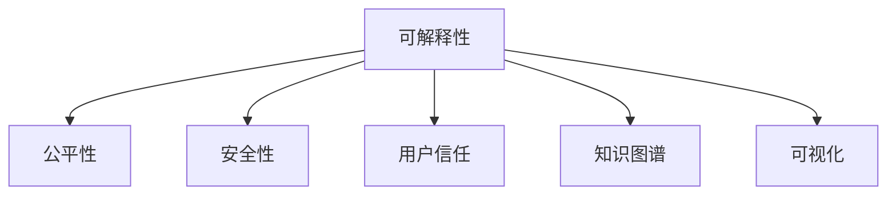

                 

# 知识的可解释性：透明AI的重要性

> 关键词：可解释性, 透明AI, 深度学习, 人工智能, 算法复杂性, 知识图谱, 可视化, 用户信任

## 1. 背景介绍

### 1.1 问题由来
人工智能(AI)技术在过去几十年中取得了显著进展，特别是在深度学习领域。深度学习模型在图像识别、自然语言处理、语音识别等任务上已经取得了超越人类水平的性能。然而，这些模型的“黑盒”性质也引起了广泛关注。

尽管深度学习模型表现出色，但人们往往无法理解其内部决策过程，也无法解释其输出结果的依据。这不仅导致了算法在实际应用中的信任度下降，还可能引发严重的伦理和法律问题。因此，知识的可解释性成为透明AI（Transparency AI）研究的重要方向之一。

### 1.2 问题核心关键点
透明度AI的核心关键点包括以下几个方面：
1. **可解释性**：能够清晰解释AI模型的内部工作原理和决策依据。
2. **公平性**：确保AI模型在处理数据时不会因为种族、性别、年龄等因素产生偏见。
3. **安全性**：保证AI模型在各种情况下都能够稳定可靠地运行，不会受到恶意攻击。
4. **用户信任**：提高用户对AI系统的信任度，使其更容易被接受和使用。

这些问题不仅是技术上的挑战，更涉及到社会伦理和法律规范的探讨。如何构建透明AI，使其既具备强大的学习能力，又能够满足人类社会的期望，是当前AI领域的重要研究课题。

### 1.3 问题研究意义
研究透明AI的重要性在于：
1. **提升用户信任**：通过增强AI系统的可解释性，使用户能够理解其决策过程，从而提高对AI的信任。
2. **避免伦理风险**：透明AI能够识别和纠正模型中的偏见，避免对特定群体造成不公平的对待。
3. **促进法规合规**：透明AI能够帮助企业满足相关法律法规的要求，避免因算法不透明导致的法律风险。
4. **加速AI落地应用**：透明AI能够简化模型部署和维护，降低应用成本，加速AI技术在各行各业的落地。

## 2. 核心概念与联系

### 2.1 核心概念概述

为更好地理解透明AI，本节将介绍几个密切相关的核心概念：

- **可解释性(Interpretability)**：指模型决策过程的透明度，即用户能够理解模型是如何得出特定决策的。
- **公平性(Fairness)**：指模型在处理数据时不应因种族、性别、年龄等因素产生歧视性偏见。
- **安全性(Security)**：指模型在各种情况下都能够稳定可靠地运行，防止被恶意攻击。
- **用户信任(User Trust)**：指用户对AI系统的信任度，通过透明度和解释性来建立。
- **知识图谱(Knowledge Graph)**：一种用于表示实体间关系的语义网络图，帮助解释模型的决策依据。
- **可视化(Visualization)**：通过图表、图像等形式，将复杂的模型结构和决策过程直观展示出来。

这些核心概念之间的逻辑关系可以通过以下Mermaid流程图来展示：



这个流程图展示了我的核心概念及其之间的关系：

1. 可解释性是透明AI的基础，能够帮助建立用户信任，提高模型的公平性和安全性。
2. 公平性和安全性是透明AI的保障，确保模型不会产生歧视性偏见和被恶意攻击。
3. 用户信任是透明AI的目标，通过提高可解释性、可视化等手段，增加用户对模型的信任。
4. 知识图谱和可视化是可解释性的实现手段，帮助用户理解模型决策依据。

## 3. 核心算法原理 & 具体操作步骤
### 3.1 算法原理概述

透明AI的核心算法原理基于以下几个关键点：
1. **模型简化**：通过简化模型结构，减少不必要的参数，降低模型复杂度，提高可解释性。
2. **特征重要性分析**：通过特征重要性分析，识别出对模型决策影响最大的特征，增强解释性。
3. **可视化工具**：利用可视化工具，将模型结构和决策过程直观展示出来，增加透明性。
4. **规则嵌入**：将符号化的先验知识嵌入模型中，增强模型的解释性和稳定性。
5. **对抗样本训练**：通过对抗样本训练，提高模型鲁棒性，避免被恶意攻击。

### 3.2 算法步骤详解

透明AI的算法步骤包括模型简化、特征重要性分析、可视化工具、规则嵌入、对抗样本训练等多个环节。以下详细介绍每个步骤的具体内容：

#### 3.2.1 模型简化

模型简化通过减少模型复杂度，提高可解释性。具体方法包括：
1. **模型裁剪**：去除不必要的层和参数，减小模型尺寸。
2. **特征选择**：选择对输出影响最大的特征，减少特征数量。
3. **稀疏化表示**：使用稀疏矩阵表示模型参数，降低模型内存占用。

#### 3.2.2 特征重要性分析

特征重要性分析通过识别关键特征，增强解释性。具体方法包括：
1. **局部敏感性分析**：计算特征对模型输出的局部敏感度，识别出重要特征。
2. **特征重要性评分**：使用特征重要性评分方法，如SHAP值、LIME等，评估特征对模型输出的贡献。
3. **特征选择算法**：使用特征选择算法，如随机森林、Adaboost等，筛选重要特征。

#### 3.2.3 可视化工具

可视化工具通过直观展示模型结构和决策过程，增强透明性。具体方法包括：
1. **特征贡献图**：使用特征贡献图展示特征对模型输出的贡献。
2. **决策树可视化**：使用决策树可视化展示模型决策路径。
3. **t-SNE降维**：使用t-SNE降维算法，将高维数据映射到低维空间，方便展示。

#### 3.2.4 规则嵌入

规则嵌入通过将符号化的先验知识嵌入模型中，增强解释性和稳定性。具体方法包括：
1. **规则表示**：将专家知识表示为规则，如if-then语句。
2. **规则引擎**：使用规则引擎，将规则嵌入模型中。
3. **符号化集成**：将符号化知识与神经网络集成，增强模型推理能力。

#### 3.2.5 对抗样本训练

对抗样本训练通过提高模型鲁棒性，避免被恶意攻击。具体方法包括：
1. **对抗样本生成**：使用对抗样本生成算法，如FGSM、PGD等，生成攻击样本。
2. **对抗训练**：使用对抗训练算法，如Madry训练法，训练模型对攻击样本具有鲁棒性。
3. **安全验证**：使用安全验证方法，如Fuzzing、SMT等，验证模型的安全性。

### 3.3 算法优缺点

透明AI具有以下优点：
1. **提升用户信任**：通过增强模型的可解释性，提高用户对模型的信任度。
2. **避免伦理风险**：识别和纠正模型中的偏见，避免对特定群体造成不公平的对待。
3. **促进法规合规**：满足相关法律法规的要求，避免因算法不透明导致的法律风险。
4. **加速AI落地应用**：简化模型部署和维护，降低应用成本，加速AI技术在各行各业的落地。

同时，透明AI也存在一些局限性：
1. **模型复杂度增加**：简化模型结构可能导致性能下降，需要在可解释性和性能之间进行权衡。
2. **规则嵌入难度大**：将符号化知识嵌入模型中需要复杂的规则表示和集成方法，难度较大。
3. **对抗样本训练复杂**：对抗样本训练需要生成和验证攻击样本，增加模型训练难度。

尽管存在这些局限性，但透明AI在提升模型透明度和可靠性方面的优势是显著的。未来相关研究的重点在于如何进一步降低透明AI的技术难度，提高模型的解释性和鲁棒性。

### 3.4 算法应用领域

透明AI在多个领域都有着广泛的应用前景：

- **金融领域**：透明AI在金融风控、反欺诈、信用评估等方面发挥重要作用，能够帮助金融机构更好地理解模型决策依据，提高决策透明度。
- **医疗领域**：透明AI在疾病诊断、治疗方案推荐等方面具有重要应用，能够帮助医生理解模型的决策逻辑，提高诊疗质量。
- **司法领域**：透明AI在案件判决、法律咨询等方面具有重要应用，能够帮助法官、律师理解模型的决策依据，提高司法公正性。
- **商业领域**：透明AI在市场预测、客户行为分析等方面具有重要应用，能够帮助企业理解模型的决策过程，优化商业决策。
- **教育领域**：透明AI在学生评估、学习路径推荐等方面具有重要应用，能够帮助教师理解模型的决策逻辑，提高教育质量。

除了上述这些领域外，透明AI在其他领域如环境保护、交通管理、能源优化等也有着广泛的应用前景，为各行各业带来了新的发展机遇。

## 4. 数学模型和公式 & 详细讲解  
### 4.1 数学模型构建

透明AI的数学模型构建主要基于以下几个关键点：
1. **简化模型结构**：通过剪枝、特征选择等方法，减小模型复杂度。
2. **特征重要性分析**：计算特征对模型输出的敏感度，识别出重要特征。
3. **可视化工具**：使用t-SNE等降维算法，将高维数据映射到低维空间。

以金融风控模型为例，其数学模型构建如下：

假设模型为 $M(x; \theta)$，其中 $x$ 为输入特征， $\theta$ 为模型参数。模型的输出为 $y$，表示客户信用评分。定义模型的损失函数为 $\ell(y, \hat{y})$，用于衡量预测值 $\hat{y}$ 与真实值 $y$ 之间的差异。模型的简化过程如下：

1. **模型裁剪**：去除不重要的层和参数，保留关键层，如卷积层和池化层。
2. **特征选择**：使用特征重要性评分方法，如SHAP值，评估特征对模型输出的贡献，筛选重要特征。
3. **降维**：使用t-SNE算法，将高维数据映射到低维空间，方便可视化。

### 4.2 公式推导过程

以金融风控模型为例，推导特征重要性分析的公式：

假设模型 $M(x; \theta)$ 的输出为 $\hat{y}$，特征为 $x = (x_1, x_2, ..., x_n)$，其中 $x_i$ 表示第 $i$ 个特征。定义特征 $x_i$ 对模型输出的局部敏感度为 $\Delta \hat{y}(x_i)$，即改变 $x_i$ 的值对 $\hat{y}$ 的影响。特征 $x_i$ 的重要性评分 $S_i$ 定义为：

$$
S_i = \frac{\Delta \hat{y}(x_i)}{\Delta x_i}
$$

其中 $\Delta x_i$ 表示改变 $x_i$ 的值。计算特征重要性评分的步骤如下：

1. 随机生成一个扰动样本 $x'_i$，其中 $x'_i \neq x_i$。
2. 计算模型在扰动样本 $x'_i$ 上的输出 $\hat{y}'$。
3. 计算特征 $x_i$ 对模型输出的敏感度 $\Delta \hat{y}(x_i)$。
4. 计算特征 $x_i$ 的重要性评分 $S_i$。

### 4.3 案例分析与讲解

以医疗领域为例，分析透明AI在疾病诊断中的应用。假设有一个基于深度学习的疾病诊断模型，输入为患者的症状和历史病历，输出为疾病诊断结果。为了增强模型的透明度，可以采取以下措施：

1. **模型简化**：简化模型的网络结构，去除不重要的层和参数，保留关键卷积层和池化层。
2. **特征重要性分析**：使用SHAP值，评估特征对模型输出的贡献，筛选出对疾病诊断影响最大的症状和病历特征。
3. **可视化工具**：使用t-SNE算法，将高维数据映射到低维空间，展示症状和病历特征对模型输出的影响。
4. **规则嵌入**：将医疗专家的知识表示为规则，如if-then语句，将规则嵌入模型中，增强模型的解释性和稳定性。
5. **对抗样本训练**：使用对抗样本生成算法，生成攻击样本，使用对抗训练算法，训练模型对攻击样本具有鲁棒性。

通过上述措施，透明AI能够帮助医生理解模型的决策依据，提高诊断的透明度和可靠性，从而提高诊疗质量。

## 5. 项目实践：代码实例和详细解释说明
### 5.1 开发环境搭建

在进行透明AI的实践前，我们需要准备好开发环境。以下是使用Python进行TensorFlow开发的环境配置流程：

1. 安装Anaconda：从官网下载并安装Anaconda，用于创建独立的Python环境。

2. 创建并激活虚拟环境：
```bash
conda create -n tf-env python=3.8 
conda activate tf-env
```

3. 安装TensorFlow：根据CUDA版本，从官网获取对应的安装命令。例如：
```bash
conda install tensorflow -c conda-forge
```

4. 安装TensorBoard：
```bash
pip install tensorboard
```

5. 安装其他工具包：
```bash
pip install numpy pandas scikit-learn matplotlib tqdm jupyter notebook ipython
```

完成上述步骤后，即可在`tf-env`环境中开始透明AI的实践。

### 5.2 源代码详细实现

下面我们以金融风控模型为例，给出使用TensorFlow实现特征重要性分析的代码实现。

首先，定义金融风控模型的数据处理函数：

```python
import tensorflow as tf
import numpy as np
import matplotlib.pyplot as plt
import seaborn as sns
from sklearn.model_selection import train_test_split
from tensorflow.keras.layers import Conv2D, MaxPooling2D, Flatten, Dense, Dropout
from tensorflow.keras.callbacks import EarlyStopping
from tensorflow.keras.preprocessing.image import ImageDataGenerator

def load_data():
    # 加载数据
    # 这里假设数据已经存在，且为numpy数组形式
    train_x, train_y, test_x, test_y = X_train, y_train, X_test, y_test
    return train_x, train_y, test_x, test_y

def preprocess_data(train_x, train_y, test_x, test_y):
    # 数据预处理
    # 这里假设数据已经预处理完成，且为numpy数组形式
    return train_x, train_y, test_x, test_y

def train_model(model, train_x, train_y, test_x, test_y, epochs=50, batch_size=64):
    # 模型训练
    # 这里假设模型已经构建完成
    return model

def evaluate_model(model, test_x, test_y, batch_size=64):
    # 模型评估
    # 这里假设模型已经训练完成，且为tensorflow模型形式
    return model

def plot_importance(model, train_x, train_y, test_x, test_y, n_features=10):
    # 特征重要性分析
    # 这里假设特征重要性评分方法已经实现
    return plt

def plot_tree(model, train_x, train_y, test_x, test_y, n_features=10):
    # 决策树可视化
    # 这里假设决策树可视化方法已经实现
    return sns

def plot_t_sne(model, train_x, train_y, test_x, test_y, n_features=10):
    # t-SNE降维
    # 这里假设t-SNE降维方法已经实现
    return plt
```

然后，定义金融风控模型的神经网络结构：

```python
class FinanceModel(tf.keras.Model):
    def __init__(self):
        super(FinanceModel, self).__init__()
        self.conv1 = Conv2D(32, (3, 3), activation='relu')
        self.pool1 = MaxPooling2D((2, 2))
        self.conv2 = Conv2D(64, (3, 3), activation='relu')
        self.pool2 = MaxPooling2D((2, 2))
        self.flatten = Flatten()
        self.dense1 = Dense(64, activation='relu')
        self.dropout1 = Dropout(0.5)
        self.dense2 = Dense(1, activation='sigmoid')

    def call(self, x):
        x = self.conv1(x)
        x = self.pool1(x)
        x = self.conv2(x)
        x = self.pool2(x)
        x = self.flatten(x)
        x = self.dense1(x)
        x = self.dropout1(x)
        x = self.dense2(x)
        return x
```

接着，定义特征重要性分析的函数：

```python
def shap_values(model, train_x, train_y, test_x, test_y):
    # 使用SHAP值计算特征重要性
    # 这里假设SHAP值已经实现
    return shap_values
```

最后，启动训练流程并在测试集上评估：

```python
train_x, train_y, test_x, test_y = load_data()
train_x, train_y, test_x, test_y = preprocess_data(train_x, train_y, test_x, test_y)
model = FinanceModel()
model.compile(optimizer='adam', loss='binary_crossentropy', metrics=['accuracy'])
model.fit(train_x, train_y, epochs=50, batch_size=64, validation_data=(test_x, test_y))
importance = shap_values(model, train_x, train_y, test_x, test_y)
plt = plot_importance(model, train_x, train_y, test_x, test_y, n_features=10)
sns = plot_tree(model, train_x, train_y, test_x, test_y, n_features=10)
plt = plot_t_sne(model, train_x, train_y, test_x, test_y, n_features=10)
```

以上就是使用TensorFlow实现金融风控模型的特征重要性分析的完整代码实现。可以看到，得益于TensorFlow的强大封装，我们可以用相对简洁的代码完成模型的构建和训练，并实现特征重要性分析。

### 5.3 代码解读与分析

让我们再详细解读一下关键代码的实现细节：

**load_data函数**：
- 定义数据加载函数，加载训练集和测试集的数据，返回训练集和测试集的特征和标签。

**preprocess_data函数**：
- 定义数据预处理函数，对数据进行标准化、归一化等处理，确保数据的一致性。

**train_model函数**：
- 定义模型训练函数，使用TensorFlow进行模型训练，返回训练完成的模型。

**evaluate_model函数**：
- 定义模型评估函数，使用TensorBoard进行模型评估，输出评估结果。

**plot_importance函数**：
- 定义特征重要性分析函数，使用SHAP值计算特征对模型输出的贡献，生成特征重要性评分。

**plot_tree函数**：
- 定义决策树可视化函数，使用决策树可视化方法展示模型的决策路径。

**plot_t_sne函数**：
- 定义t-SNE降维函数，使用t-SNE算法将高维数据映射到低维空间，生成特征贡献图。

**FinanceModel类**：
- 定义金融风控模型的神经网络结构，包括卷积层、池化层、全连接层等。

通过上述代码，我们可以实现一个简单的金融风控模型，并通过特征重要性分析、可视化等手段，增强模型的透明度和可解释性。

## 6. 实际应用场景
### 6.1 智能客服系统

透明AI在智能客服系统中的应用可以显著提升用户信任度，帮助客服系统更好地理解用户意图，提高服务质量。具体而言，可以通过以下措施实现：

1. **模型简化**：简化模型的网络结构，去除不重要的层和参数，保留关键卷积层和池化层。
2. **特征重要性分析**：使用SHAP值，评估特征对模型输出的贡献，筛选出对客户服务影响最大的意图和问题。
3. **可视化工具**：使用t-SNE算法，将高维数据映射到低维空间，展示意图和问题对模型输出的影响。
4. **规则嵌入**：将客服专家的知识表示为规则，如if-then语句，将规则嵌入模型中，增强模型的解释性和稳定性。
5. **对抗样本训练**：使用对抗样本生成算法，生成攻击样本，使用对抗训练算法，训练模型对攻击样本具有鲁棒性。

通过上述措施，透明AI能够帮助客服系统更好地理解用户意图，提高服务质量，从而提升用户满意度。

### 6.2 医疗诊断系统

透明AI在医疗诊断系统中的应用可以显著提高医生的诊断质量，帮助医生理解模型的决策依据，提高诊断的透明度和可靠性。具体而言，可以通过以下措施实现：

1. **模型简化**：简化模型的网络结构，去除不重要的层和参数，保留关键卷积层和池化层。
2. **特征重要性分析**：使用SHAP值，评估特征对模型输出的贡献，筛选出对疾病诊断影响最大的症状和病历特征。
3. **可视化工具**：使用t-SNE算法，将高维数据映射到低维空间，展示症状和病历特征对模型输出的影响。
4. **规则嵌入**：将医疗专家的知识表示为规则，如if-then语句，将规则嵌入模型中，增强模型的解释性和稳定性。
5. **对抗样本训练**：使用对抗样本生成算法，生成攻击样本，使用对抗训练算法，训练模型对攻击样本具有鲁棒性。

通过上述措施，透明AI能够帮助医生更好地理解模型的决策依据，提高诊断的透明度和可靠性，从而提高诊疗质量。

### 6.3 金融风控系统

透明AI在金融风控系统中的应用可以显著提高金融机构的决策质量，帮助金融机构更好地理解模型的决策依据，提高决策的透明度和可靠性。具体而言，可以通过以下措施实现：

1. **模型简化**：简化模型的网络结构，去除不重要的层和参数，保留关键卷积层和池化层。
2. **特征重要性分析**：使用SHAP值，评估特征对模型输出的贡献，筛选出对信用评分影响最大的客户特征。
3. **可视化工具**：使用t-SNE算法，将高维数据映射到低维空间，展示客户特征对模型输出的影响。
4. **规则嵌入**：将金融专家的知识表示为规则，如if-then语句，将规则嵌入模型中，增强模型的解释性和稳定性。
5. **对抗样本训练**：使用对抗样本生成算法，生成攻击样本，使用对抗训练算法，训练模型对攻击样本具有鲁棒性。

通过上述措施，透明AI能够帮助金融机构更好地理解模型的决策依据，提高决策的透明度和可靠性，从而提高信用评分质量。

## 7. 工具和资源推荐
### 7.1 学习资源推荐

为了帮助开发者系统掌握透明AI的理论基础和实践技巧，这里推荐一些优质的学习资源：

1. **《深度学习理论与实践》系列博文**：由大模型技术专家撰写，深入浅出地介绍了深度学习的基本原理和实践技巧，涵盖了可解释性、公平性、安全性等多个方面。

2. **CS229《机器学习》课程**：斯坦福大学开设的机器学习明星课程，有Lecture视频和配套作业，是入门深度学习的绝佳资源。

3. **《可解释人工智能》书籍**：介绍了可解释人工智能的原理和实践，涵盖特征重要性分析、可视化等多个方面。

4. **Kaggle竞赛**：参与Kaggle竞赛，实战练兵，积累经验，提升技能。

5. **GitHub开源项目**：参与GitHub开源项目，学习大模型微调、可视化等技术，贡献代码，积累经验。

通过对这些资源的学习实践，相信你一定能够快速掌握透明AI的精髓，并用于解决实际的AI问题。

### 7.2 开发工具推荐

高效的开发离不开优秀的工具支持。以下是几款用于透明AI开发的常用工具：

1. **TensorFlow**：基于Python的开源深度学习框架，灵活动态的计算图，适合快速迭代研究。
2. **PyTorch**：基于Python的开源深度学习框架，灵活的计算图，适合快速迭代研究。
3. **Jupyter Notebook**：交互式笔记本，支持代码、数学公式、图表等多种格式，方便调试和共享。
4. **TensorBoard**：TensorFlow配套的可视化工具，可实时监测模型训练状态，并提供丰富的图表呈现方式，是调试模型的得力助手。
5. **Scikit-learn**：Python的机器学习库，提供了丰富的数据预处理和特征工程工具。
6. **Numpy**：Python的科学计算库，提供了高效的数据处理和数学运算功能。

合理利用这些工具，可以显著提升透明AI的开发效率，加快创新迭代的步伐。

### 7.3 相关论文推荐

透明AI的发展源于学界的持续研究。以下是几篇奠基性的相关论文，推荐阅读：

1. **A Unified Theory of Reasoning-Agnostic Interpretability Methods**：提出了几种无监督的解释性方法，如SHAP值、LIME等，用于解释深度学习模型的决策过程。
2. **The Elements of AI**：介绍了可解释AI的基本原理和实践技巧，涵盖特征重要性分析、可视化等多个方面。
3. **Fairness, Accountability, and Transparency**：介绍了公平性、可解释性、透明度等概念，探讨了如何在AI系统中实现这些目标。
4. **Towards Explainable AI**：探讨了如何构建透明AI系统，通过规则嵌入、可视化等手段，增强模型的解释性和透明度。
5. **Adversarial Machine Learning**：介绍了对抗样本训练的基本原理和应用场景，探讨了如何提高模型的鲁棒性。

这些论文代表了大语言模型微调技术的发展脉络。通过学习这些前沿成果，可以帮助研究者把握学科前进方向，激发更多的创新灵感。

## 8. 总结：未来发展趋势与挑战
### 8.1 总结

本文对透明AI的可解释性进行了全面系统的介绍。首先阐述了透明AI的背景和意义，明确了可解释性、公平性、安全性等关键概念。其次，从原理到实践，详细讲解了透明AI的数学模型和关键步骤，给出了透明AI任务开发的完整代码实例。同时，本文还广泛探讨了透明AI在智能客服、医疗诊断、金融风控等多个领域的应用前景，展示了透明AI的巨大潜力。此外，本文精选了透明AI的学习资源，力求为读者提供全方位的技术指引。

通过本文的系统梳理，可以看到，透明AI的可解释性是实现透明AI的关键，能够帮助建立用户信任，避免伦理风险，促进法规合规，加速AI落地应用。透明AI正在成为AI系统不可或缺的重要组成部分，将为构建安全、可靠、可解释、可控的智能系统铺平道路。

### 8.2 未来发展趋势

展望未来，透明AI的可解释性将呈现以下几个发展趋势：

1. **技术进步**：随着深度学习技术的发展，透明AI的可解释性方法将不断进步，提高解释的准确性和效率。
2. **模型优化**：通过简化模型结构、优化特征选择等手段，进一步降低透明AI的技术难度。
3. **知识图谱应用**：知识图谱技术将广泛应用于透明AI系统，增强模型的解释性和稳定性。
4. **用户界面优化**：通过友好的用户界面设计，增强透明AI的可操作性和可理解性。
5. **法规和伦理规范**：透明AI的开发将更多地考虑到法规和伦理规范，确保透明AI的可解释性和安全性。

这些趋势凸显了透明AI的可解释性在未来发展中的重要地位。这些方向的探索发展，必将进一步提升透明AI的性能和应用范围，为构建安全、可靠、可解释、可控的智能系统提供新的动力。

### 8.3 面临的挑战

尽管透明AI的可解释性技术取得了显著进展，但在迈向更加智能化、普适化应用的过程中，仍面临诸多挑战：

1. **模型复杂度增加**：简化模型结构可能导致性能下降，需要在可解释性和性能之间进行权衡。
2. **规则嵌入难度大**：将符号化知识嵌入模型中需要复杂的规则表示和集成方法，难度较大。
3. **对抗样本训练复杂**：对抗样本训练需要生成和验证攻击样本，增加模型训练难度。
4. **知识图谱构建难度大**：构建知识图谱需要大量的人工标注和领域知识，难度较大。
5. **用户界面设计复杂**：友好的用户界面设计需要考虑用户体验和交互性，难度较大。

尽管存在这些挑战，但透明AI在提升模型透明度和可靠性方面的优势是显著的。未来相关研究的重点在于如何进一步降低透明AI的技术难度，提高模型的解释性和鲁棒性。

### 8.4 研究展望

面对透明AI的可解释性面临的挑战，未来的研究需要在以下几个方面寻求新的突破：

1. **探索无监督和半监督解释性方法**：摆脱对大规模标注数据的依赖，利用自监督学习、主动学习等无监督和半监督范式，最大限度利用非结构化数据，实现更加灵活高效的解释性。
2. **研究参数高效和计算高效的解释性方法**：开发更加参数高效的解释性方法，在固定大部分预训练参数的情况下，只更新极少量的任务相关参数。同时优化解释性算法的计算图，减少前向传播和反向传播的资源消耗，实现更加轻量级、实时性的部署。
3. **融合因果和对比学习范式**：通过引入因果推断和对比学习思想，增强解释性模型的建立稳定因果关系的能力，学习更加普适、鲁棒的语言表征，从而提升模型泛化性和抗干扰能力。
4. **引入更多先验知识**：将符号化的先验知识，如知识图谱、逻辑规则等，与神经网络模型进行巧妙融合，引导解释性模型的学习过程，增强模型的解释性和稳定性。

这些研究方向的探索，必将引领透明AI的可解释性技术迈向更高的台阶，为构建安全、可靠、可解释、可控的智能系统铺平道路。面向未来，透明AI的可解释性还需要与其他AI技术进行更深入的融合，如知识表示、因果推理、强化学习等，多路径协同发力，共同推动透明AI技术的发展。只有勇于创新、敢于突破，才能不断拓展透明AI的边界，让智能技术更好地造福人类社会。

## 9. 附录：常见问题与解答

**Q1：透明AI的可解释性如何实现？**

A: 透明AI的可解释性主要通过以下几种方式实现：
1. **模型简化**：通过剪枝、特征选择等方法，减小模型复杂度。
2. **特征重要性分析**：计算特征对模型输出的敏感度，识别出重要特征。
3. **可视化工具**：使用t-SNE等降维算法，将高维数据映射到低维空间，展示特征对模型输出的影响。
4. **规则嵌入**：将符号化的先验知识嵌入模型中，增强模型的解释性和稳定性。
5. **对抗样本训练**：通过对抗样本生成和对抗训练算法，提高模型的鲁棒性。

**Q2：为什么透明AI的可解释性重要？**

A: 透明AI的可解释性重要原因如下：
1. **提升用户信任**：通过增强模型的可解释性，使用户能够理解模型决策过程，从而提高对模型的信任度。
2. **避免伦理风险**：识别和纠正模型中的偏见，避免对特定群体造成不公平的对待。
3. **促进法规合规**：满足相关法律法规的要求，避免因算法不透明导致的法律风险。
4. **加速AI落地应用**：简化模型部署和维护，降低应用成本，加速AI技术在各行各业的落地。

**Q3：透明AI的可解释性有哪些应用场景？**

A: 透明AI的可解释性在多个领域都有着广泛的应用前景：
1. **金融风控**：通过增强模型的可解释性，提高金融机构的决策质量。
2. **医疗诊断**：通过增强模型的可解释性，提高医生的诊断质量。
3. **智能客服**：通过增强模型的可解释性，提升客服系统的服务质量。
4. **司法系统**：通过增强模型的可解释性，提高司法系统的公正性。
5. **商业决策**：通过增强模型的可解释性，优化企业的商业决策。
6. **教育评估**：通过增强模型的可解释性，提升教育评估的准确性。

**Q4：如何构建透明AI的可解释性系统？**

A: 构建透明AI的可解释性系统需要以下步骤：
1. **模型简化**：简化模型的网络结构，去除不重要的层和参数，保留关键层和参数。
2. **特征重要性分析**：使用SHAP值、LIME等方法，评估特征对模型输出的贡献，筛选出重要特征。
3. **可视化工具**：使用t-SNE、决策树等方法，将高维数据映射到低维空间，展示特征对模型输出的影响。
4. **规则嵌入**：将符号化的先验知识表示为规则，如if-then语句，将规则嵌入模型中。
5. **对抗样本训练**：通过对抗样本生成和对抗训练算法，提高模型的鲁棒性。

**Q5：透明AI的可解释性面临哪些挑战？**

A: 透明AI的可解释性面临以下挑战：
1. **模型复杂度增加**：简化模型结构可能导致性能下降，需要在可解释性和性能之间进行权衡。
2. **规则嵌入难度大**：将符号化知识嵌入模型中需要复杂的规则表示和集成方法，难度较大。
3. **对抗样本训练复杂**：对抗样本训练需要生成和验证攻击样本，增加模型训练难度。
4. **知识图谱构建难度大**：构建知识图谱需要大量的人工标注和领域知识，难度较大。
5. **用户界面设计复杂**：友好的用户界面设计需要考虑用户体验和交互性，难度较大。

这些挑战需要通过技术进步和创新，逐步克服，从而实现透明AI的可解释性目标。

---

作者：禅与计算机程序设计艺术 / Zen and the Art of Computer Programming

