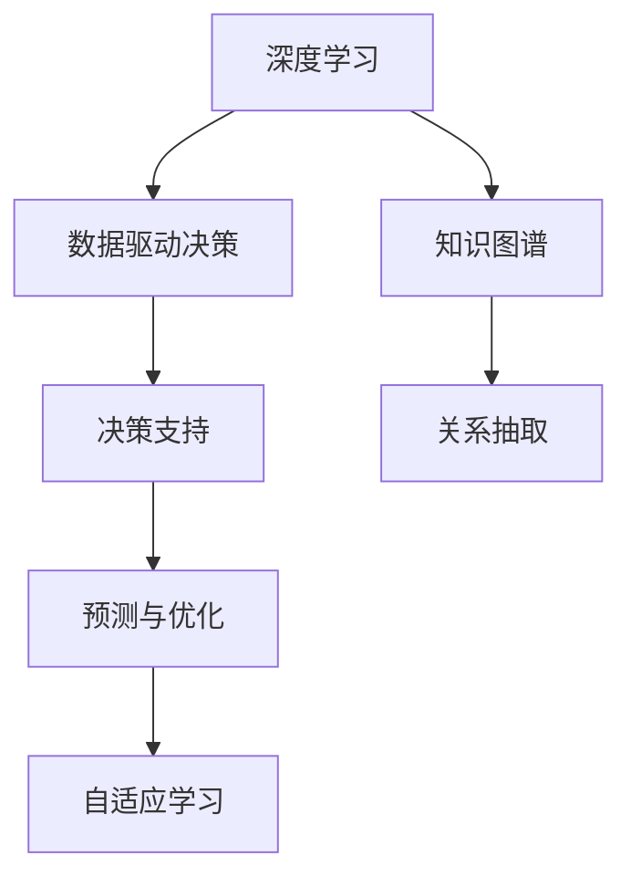

                 

# 知识的应用价值：洞察力的独特视角

> 关键词：知识应用，洞察力，深度学习，人工智能，数据驱动决策

## 1. 背景介绍

### 1.1 问题由来

在当今数据驱动的时代，知识的积累和应用变得尤为重要。无论是商业决策、科学研究，还是日常生活，洞察力（Insight）已成为推动变革的关键要素。然而，如何有效利用已有知识，提高决策的科学性和预见性，却是一大难题。深度学习和大数据技术的结合，为这一问题提供了全新的解决方案。

深度学习通过对大量数据进行自学习，挖掘出数据中的模式和规律，形成了强大的模型预测能力。而人工智能（AI）则进一步扩展了这一能力，使其能够自主学习和适应环境，在各种复杂场景中展现出了卓越的表现。

本文章将从深度学习和AI的角度出发，探讨知识的价值、应用方式及其对洞察力的独特影响，以期为读者提供有价值的参考。

### 1.2 问题核心关键点

要理解知识的应用价值和洞察力的独特视角，我们需要关注以下几个核心问题：

1. 知识的价值是什么？如何在海量数据中提取和应用知识？
2. 洞察力是如何通过知识实现的？它在决策中扮演了什么角色？
3. 深度学习和大数据技术如何为知识应用提供支持？
4. 知识的应用中面临哪些挑战？如何克服这些挑战？
5. 未来知识应用的发展趋势和挑战是什么？

## 2. 核心概念与联系

### 2.1 核心概念概述

为了更好地理解深度学习和AI在知识应用中的作用，本节将介绍几个关键概念：

- 深度学习（Deep Learning）：一种基于神经网络的机器学习技术，通过多层非线性变换，实现对复杂数据模式的高效识别和预测。

- 人工智能（Artificial Intelligence, AI）：一种模仿人类智能行为的技术，包括学习、推理、自我修正等能力，可以处理非结构化数据，实现智能决策和自动化。

- 数据驱动决策（Data-Driven Decision Making）：利用数据分析和建模技术，从数据中提取知识，辅助决策过程，提升决策效率和准确性。

- 知识图谱（Knowledge Graph）：一种结构化的知识表示方式，通过节点和边，构建实体和关系的网络，帮助理解和推理知识。

- 深度学习应用：如自然语言处理（NLP）、计算机视觉（CV）、语音识别（ASR）等，通过深度学习技术，实现对数据的深度理解和处理。

### 2.2 核心概念原理和架构的 Mermaid 流程图



该流程图展示了深度学习、知识图谱、数据驱动决策和决策支持系统之间的关系：

1. 深度学习技术从大量数据中提取知识，构建模型。
2. 知识图谱提供结构化的知识表示，辅助模型理解和推理。
3. 数据驱动决策系统利用模型和知识图谱，进行预测和优化。
4. 决策支持系统基于预测结果，辅助用户进行决策。

## 3. 核心算法原理 & 具体操作步骤

### 3.1 算法原理概述

深度学习和AI在知识应用中的核心算法原理是自监督学习和迁移学习。

- 自监督学习（Self-Supervised Learning）：利用数据的自身结构进行学习，无需人工标注。例如，通过掩码语言模型（Masked Language Model, MLM）和自回归模型（Autoregressive Model, AR），深度学习可以从无标签的数据中学习到语言和图像的知识。

- 迁移学习（Transfer Learning）：将在一个领域学到的知识迁移到另一个领域。通过预训练模型，可以在一个大规模数据集上学习通用知识，然后在特定任务上进行微调，实现知识的迁移应用。

### 3.2 算法步骤详解

#### 3.2.1 数据准备

1. 数据收集：从不同渠道收集数据，包括结构化数据、非结构化数据等。
2. 数据清洗：处理缺失值、异常值等问题，保证数据质量。
3. 数据预处理：进行特征工程，如数据归一化、分词、图像预处理等。

#### 3.2.2 模型选择与训练

1. 选择模型架构：根据任务需求选择合适的深度学习模型，如CNN、RNN、Transformer等。
2. 模型初始化：使用预训练模型或随机初始化模型参数。
3. 训练模型：利用优化算法（如SGD、Adam等），对模型进行梯度下降训练。

#### 3.2.3 知识提取与推理

1. 知识提取：通过模型学习到的特征，提取知识图谱中的实体和关系。
2. 推理应用：利用知识图谱进行推理，辅助决策支持系统做出决策。

### 3.3 算法优缺点

深度学习和AI在知识应用中的优点包括：

1. 高效处理复杂数据：深度学习和大数据技术能够处理复杂的非结构化数据，提取其中的模式和规律。
2. 提升决策科学性：通过数据驱动决策，提高决策的科学性和可解释性。
3. 实现自适应学习：模型能够不断学习新知识，适应环境变化，提升预测和推理能力。

缺点包括：

1. 数据需求量大：深度学习模型需要大量的数据进行训练，对数据收集和处理提出了较高要求。
2. 计算资源消耗高：深度学习模型往往需要强大的计算资源支持，导致训练和推理成本高昂。
3. 模型复杂度高：深度学习模型结构复杂，难以解释，对模型的调试和优化带来了挑战。

### 3.4 算法应用领域

深度学习和AI在知识应用中的主要应用领域包括：

1. 自然语言处理（NLP）：如文本分类、情感分析、机器翻译等，通过深度学习技术实现自然语言理解和生成。
2. 计算机视觉（CV）：如图像识别、目标检测、图像生成等，通过深度学习技术实现图像理解和处理。
3. 语音识别（ASR）：如语音识别、语音合成等，通过深度学习技术实现语音的识别和生成。
4. 推荐系统：如商品推荐、内容推荐等，通过深度学习技术实现个性化推荐。
5. 医疗健康：如疾病预测、药物研发等，通过深度学习技术实现医疗数据分析和预测。

## 4. 数学模型和公式 & 详细讲解 & 举例说明

### 4.1 数学模型构建

深度学习和AI在知识应用中，常用的数学模型包括神经网络模型、决策树模型、支持向量机模型等。

以神经网络模型为例，其数学模型构建如下：

$$
y = f(x; \theta)
$$

其中，$y$ 表示输出结果，$x$ 表示输入数据，$f$ 表示模型函数，$\theta$ 表示模型参数。

### 4.2 公式推导过程

以自监督学习的掩码语言模型为例，其训练过程如下：

1. 数据预处理：将文本数据转换为向量表示。
2. 模型初始化：随机初始化模型参数。
3. 训练过程：通过掩码语言模型，对模型进行训练。

掩码语言模型的训练公式如下：

$$
\mathcal{L} = -\frac{1}{N}\sum_{i=1}^N\sum_{j=1}^m [\log p(x_i[j]; \theta)]
$$

其中，$N$ 表示数据集大小，$m$ 表示掩码位置数量，$x_i[j]$ 表示掩码后的文本，$\log p(x_i[j]; \theta)$ 表示预测概率。

### 4.3 案例分析与讲解

以BERT为例，其是一种基于Transformer的预训练模型，通过掩码语言模型和自回归模型进行预训练，学习到丰富的语言知识。在微调过程中，可以在特定任务上进行有监督学习，提升模型性能。

例如，在情感分析任务中，通过BERT微调，可以实现对文本情感的精准判断。其步骤如下：

1. 准备情感标注数据集。
2. 使用BERT预训练模型作为初始化参数。
3. 在情感标注数据集上进行微调。
4. 使用微调后的模型对新文本进行情感判断。

## 5. 项目实践：代码实例和详细解释说明

### 5.1 开发环境搭建

为了实现深度学习和AI在知识应用中的项目实践，需要搭建相应的开发环境。以下是一个基本的搭建流程：

1. 安装Python：Python是目前最流行的深度学习开发语言，需要根据项目需求安装相应的版本。
2. 安装深度学习框架：如TensorFlow、PyTorch等，选择合适的框架进行开发。
3. 安装相关库：如Numpy、Pandas、Scikit-Learn等，提供数据处理和分析功能。

### 5.2 源代码详细实现

以下是一个基于PyTorch实现情感分析的代码示例：

```python
import torch
import torch.nn as nn
import torch.optim as optim

class BERT(nn.Module):
    def __init__(self):
        super(BERT, self).__init__()
        self.bert = nn.BertModel.from_pretrained('bert-base-uncased')
        self.classifier = nn.Linear(768, 2)

    def forward(self, x):
        x = self.bert(x)
        x = torch.mean(x, dim=1)
        x = self.classifier(x)
        return x

model = BERT()
optimizer = optim.Adam(model.parameters(), lr=0.001)
criterion = nn.CrossEntropyLoss()

# 训练模型
def train(model, optimizer, criterion, train_data, train_labels):
    model.train()
    total_loss = 0
    for x, y in zip(train_data, train_labels):
        optimizer.zero_grad()
        x = x.to(device)
        y = y.to(device)
        output = model(x)
        loss = criterion(output, y)
        loss.backward()
        optimizer.step()
        total_loss += loss.item()
    return total_loss / len(train_data)

# 评估模型
def evaluate(model, test_data, test_labels):
    model.eval()
    total_correct = 0
    total_pred = 0
    with torch.no_grad():
        for x, y in zip(test_data, test_labels):
            x = x.to(device)
            y = y.to(device)
            output = model(x)
            _, preds = torch.max(output, dim=1)
            total_correct += torch.sum(preds == y)
            total_pred += preds.size(0)
    return total_correct / total_pred

# 数据准备
train_data = ...
train_labels = ...
test_data = ...
test_labels = ...

# 训练模型
device = torch.device('cuda' if torch.cuda.is_available() else 'cpu')
model.to(device)
for epoch in range(5):
    loss = train(model, optimizer, criterion, train_data, train_labels)
    print('Epoch {}: Loss = {:.4f}'.format(epoch+1, loss))
    acc = evaluate(model, test_data, test_labels)
    print('Epoch {}: Accuracy = {:.4f}'.format(epoch+1, acc))
```

### 5.3 代码解读与分析

在上述代码中，我们使用了BERT模型进行情感分析。BERT模型是通过预训练学到的，因此在微调时只需要调整模型顶层的分类器即可。通过Adam优化算法和交叉熵损失函数，我们对模型进行了训练和评估。

## 6. 实际应用场景

### 6.1 金融风控

在金融风控领域，深度学习和AI可以应用于风险评估、欺诈检测等任务。通过分析客户的历史交易数据、社交媒体数据等，构建知识图谱，辅助模型进行风险评估和欺诈检测。例如，通过知识图谱中的实体和关系，可以构建客户画像，评估客户的信用风险。

### 6.2 健康医疗

在健康医疗领域，深度学习和AI可以应用于疾病预测、基因分析等任务。通过分析患者的病历数据、基因数据等，构建知识图谱，辅助模型进行疾病预测和基因分析。例如，通过知识图谱中的实体和关系，可以提取患者的病情特征，辅助医生进行诊断和治疗决策。

### 6.3 零售电商

在零售电商领域，深度学习和AI可以应用于商品推荐、客户画像等任务。通过分析消费者的购物数据、行为数据等，构建知识图谱，辅助模型进行商品推荐和客户画像。例如，通过知识图谱中的实体和关系，可以提取消费者的兴趣和偏好，辅助推荐系统进行商品推荐。

### 6.4 未来应用展望

随着深度学习和AI技术的不断发展，知识应用领域将不断拓展，未来可能的应用场景包括：

1. 智能城市：通过数据分析和建模，辅助城市规划和管理，提升城市运行效率。
2. 智能制造：通过数据分析和建模，辅助企业进行生产优化和质量控制，提升生产效率。
3. 智能交通：通过数据分析和建模，辅助交通管理，提升交通运行效率和安全性。

## 7. 工具和资源推荐

### 7.1 学习资源推荐

为了深入理解深度学习和AI在知识应用中的原理和应用，以下推荐一些优质的学习资源：

1. 《深度学习》（Deep Learning）：Ian Goodfellow等人著作，全面介绍了深度学习的原理和应用。
2. 《TensorFlow实战》（TensorFlow in Practice）：O’Reilly出版社，介绍了TensorFlow框架的实用技巧。
3. 《PyTorch实战》（PyTorch in Practice）：Packer出版社，介绍了PyTorch框架的实用技巧。
4. 《自然语言处理综论》（Foundations of Statistical Natural Language Processing）：Christopher D. Manning等人著作，介绍了NLP的原理和应用。
5. 《计算机视觉：模型、学习和推理》（Computer Vision: Models, Learning, and Inference）：John C. Russakovsky等人著作，介绍了CV的原理和应用。

### 7.2 开发工具推荐

以下是几款用于深度学习和AI开发的工具：

1. TensorFlow：由Google开发的深度学习框架，支持分布式训练和部署。
2. PyTorch：由Facebook开发的深度学习框架，支持动态图和静态图，适合研究和原型开发。
3. Keras：基于TensorFlow和Theano的深度学习框架，支持快速原型开发。
4. Jupyter Notebook：开源的交互式笔记本，支持Python代码开发和数据分析。
5. Google Colab：谷歌提供的在线Jupyter Notebook环境，支持GPU计算和免费试用。

### 7.3 相关论文推荐

以下推荐一些关于深度学习和AI在知识应用中的经典论文：

1. "Attention is All You Need"（Transformer论文）：提出Transformer模型，实现了序列到序列的深度学习。
2. "BERT: Pre-training of Deep Bidirectional Transformers for Language Understanding"：提出BERT模型，通过掩码语言模型进行预训练。
3. "Large-Scale Language Model Fine-Tuning for Low-Resource Languages"：提出GPT模型，通过自回归模型进行预训练。
4. "Knowledge Graph Embeddings"：提出知识图谱嵌入模型，将知识图谱转化为向量表示。
5. "Reinforcement Learning for Generative Adversarial Nets"：提出GAN模型，通过对抗训练实现生成式模型。

## 8. 总结：未来发展趋势与挑战

### 8.1 研究成果总结

本文从深度学习和AI的角度出发，探讨了知识的应用价值和洞察力的独特视角。主要结论包括：

1. 深度学习和大数据技术为知识应用提供了强大的工具和平台。
2. 知识图谱和数据驱动决策为深度学习提供了结构化的数据和指导。
3. 深度学习和AI在金融风控、健康医疗、零售电商等多个领域展现了巨大的应用潜力。

### 8.2 未来发展趋势

深度学习和AI在知识应用领域的未来发展趋势包括：

1. 模型更加复杂和高效：随着计算能力的提升，模型将更加复杂和高效，能够处理更复杂的任务。
2. 数据驱动决策将更加普及：数据分析和建模技术将更加普及，决策更加科学和可解释。
3. 知识图谱将更加全面和精确：知识图谱将更加全面和精确，辅助模型进行更准确的推理和决策。

### 8.3 面临的挑战

深度学习和AI在知识应用领域仍面临一些挑战：

1. 数据质量和标注成本：数据质量和标注成本仍是制约深度学习应用的重要因素。
2. 模型解释性和透明性：模型的黑盒性质使得其解释性和透明性成为难题。
3. 计算资源和部署效率：深度学习模型的计算资源和部署效率仍需优化。

### 8.4 研究展望

为了应对未来挑战，深度学习和AI在知识应用领域的研究方向包括：

1. 无监督学习和半监督学习：探索无需大量标注数据的深度学习方法，提高模型的泛化能力和应用效率。
2. 知识图谱与深度学习结合：进一步研究知识图谱和深度学习的结合方式，提高模型的推理能力和应用效果。
3. 数据驱动决策的透明性和可解释性：研究如何提高数据驱动决策的透明性和可解释性，增强用户对决策的理解和信任。

## 9. 附录：常见问题与解答

**Q1: 深度学习和AI在知识应用中有什么优势？**

A: 深度学习和AI在知识应用中的优势包括：

1. 高效处理复杂数据：深度学习模型能够处理复杂的非结构化数据，提取其中的模式和规律。
2. 提升决策科学性：通过数据驱动决策，提高决策的科学性和可解释性。
3. 实现自适应学习：模型能够不断学习新知识，适应环境变化，提升预测和推理能力。

**Q2: 深度学习和AI在知识应用中需要哪些步骤？**

A: 深度学习和AI在知识应用中的主要步骤包括：

1. 数据收集和预处理：从不同渠道收集数据，并进行数据清洗和预处理。
2. 模型选择和训练：选择合适的深度学习模型，进行模型初始化，并进行训练。
3. 知识提取和推理：通过模型学习到的特征，提取知识图谱中的实体和关系，利用知识图谱进行推理，辅助决策支持系统做出决策。

**Q3: 深度学习和AI在知识应用中面临哪些挑战？**

A: 深度学习和AI在知识应用中面临的挑战包括：

1. 数据需求量大：深度学习模型需要大量的数据进行训练，对数据收集和处理提出了较高要求。
2. 计算资源消耗高：深度学习模型往往需要强大的计算资源支持，导致训练和推理成本高昂。
3. 模型复杂度高：深度学习模型结构复杂，难以解释，对模型的调试和优化带来了挑战。

**Q4: 未来深度学习和AI在知识应用中有哪些发展趋势？**

A: 未来深度学习和AI在知识应用中的发展趋势包括：

1. 模型更加复杂和高效：随着计算能力的提升，模型将更加复杂和高效，能够处理更复杂的任务。
2. 数据驱动决策将更加普及：数据分析和建模技术将更加普及，决策更加科学和可解释。
3. 知识图谱将更加全面和精确：知识图谱将更加全面和精确，辅助模型进行更准确的推理和决策。

**Q5: 如何提高深度学习和AI在知识应用中的透明性和可解释性？**

A: 提高深度学习和AI在知识应用中的透明性和可解释性可以通过以下方法：

1. 模型可解释性研究：研究如何通过解释性方法（如SHAP、LIME等），提高模型的可解释性。
2. 模型透明性设计：在设计模型时，注重透明性和可解释性，避免模型黑盒化。
3. 数据驱动决策的透明性：通过数据可视化工具，展示决策过程和依据，增强用户对决策的理解和信任。

---

作者：禅与计算机程序设计艺术 / Zen and the Art of Computer Programming

