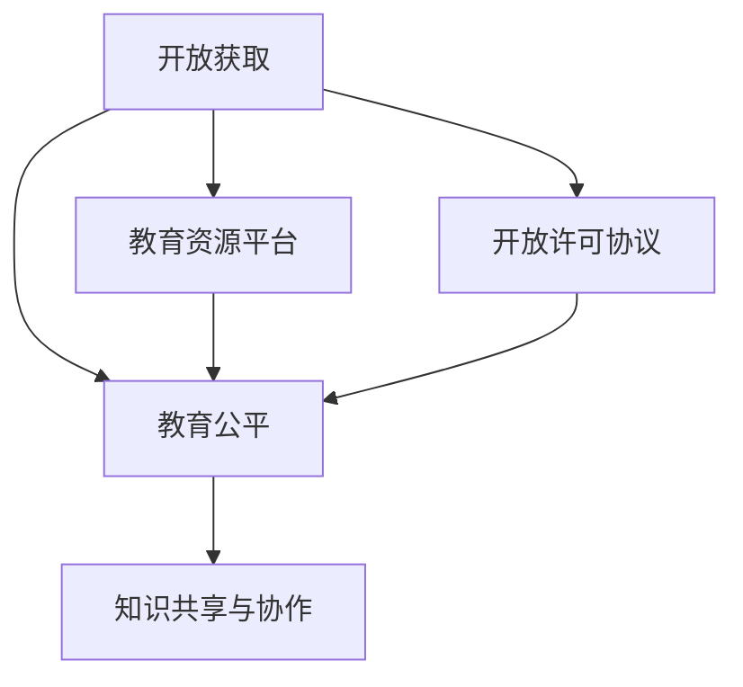

                 

# 知识的开放获取：民主化教育的理想与现实

## 1. 背景介绍

### 1.1 问题由来

在知识经济时代，知识的开放获取成为了教育民主化、全球化发展的重要驱动力。信息的无限增长和技术的迅猛发展，为知识获取的便捷性和低成本提供了可能性。然而，知识的开放获取不仅仅是技术问题，更是社会、文化、经济、政策等多重因素交织的结果。

### 1.2 问题核心关键点

知识的开放获取具有以下关键点：
- 互联网技术：开放获取的实现基础。
- 开放许可协议：保证知识共享与传播的法律基础。
- 教育资源平台：知识存储、管理和分享的物理载体。
- 全球教育公平：知识开放获取的目标。
- 社会文化认知：知识开放获取的实现障碍。

### 1.3 问题研究意义

探讨知识开放获取，对于推动教育民主化、促进全球知识共享具有深远的意义。它能够使更多人有机会获得优质教育资源，缩小教育鸿沟，提升个人能力和社会福祉，进而推动人类社会的全面进步。

## 2. 核心概念与联系

### 2.1 核心概念概述

以下将详细介绍几个核心概念及其相互关联：

- **开放获取(Open Access, OA)**：指通过互联网免费、不受版权限制地获取学术、科技、文化等各类知识的实践。
- **开放许可协议**：如CC BY、CC BY-SA等，通过这些协议授权用户自由使用、修改、分享原作者的作品。
- **教育资源平台**：如MOOCs、教育博客、知识库等，提供各类教育资源的存储、检索、分享服务。
- **教育公平**：指所有人都能公平获取教育资源，打破地理、经济、性别等壁垒。
- **知识共享与协作**：指知识的生产、传播、使用过程中的共享与协作，促进知识的共同进步。

这些核心概念构成了知识开放获取的理论基础，其逻辑关系可以通过以下Mermaid流程图展示：

## 3. 核心算法原理 & 具体操作步骤
### 3.1 算法原理概述

知识开放获取的算法原理主要涉及数据收集、存储、管理和分发等环节。

数据收集通过网络爬虫、API接口、用户上传等方式，将各类知识资源收集到中心数据库或云存储中。数据存储采用分布式数据库、对象存储等技术，实现高效、可靠的数据管理。数据管理包括元数据管理、版本控制、权限管理等，保证数据的完整性和可追溯性。数据分发则通过网络协议、API接口、移动应用等形式，将知识资源呈现给用户。

### 3.2 算法步骤详解

知识开放获取的算法步骤如下：

**Step 1: 数据收集与清洗**
- 使用网络爬虫工具，从公共图书馆、科研机构、教育机构等获取各类资源。
- 清洗数据，去除重复、错误、无关内容。

**Step 2: 数据存储与管理**
- 采用分布式数据库（如Hadoop、Elasticsearch）存储海量数据。
- 建立元数据索引，便于检索和统计。
- 设置访问权限，保护敏感数据。

**Step 3: 数据分析与展示**
- 利用数据分析工具（如Python的Pandas、Scikit-learn）进行知识分类、聚类、关联分析等。
- 设计可视化界面，如网页、移动应用，提供直观的知识展示和搜索功能。

**Step 4: 知识共享与协作**
- 发布开放许可协议，使用户可以自由获取、修改、分享知识。
- 建立协作社区，促进用户间的互动和知识交流。

**Step 5: 用户反馈与改进**
- 收集用户反馈，评估知识开放获取的效果。
- 持续改进，提升平台的用户体验和资源质量。

### 3.3 算法优缺点

开放获取的算法优点在于：
- 低成本高效益：去除版权壁垒，免费获取知识。
- 促进知识传播：加速知识共享，提升知识使用率。
- 民主化教育：打破教育壁垒，提升教育公平。

缺点包括：
- 质量参差不齐：免费资源可能包含大量错误、不完整的内容。
- 版权保护：部分版权受限的内容无法被开放获取。
- 用户信任：用户可能对开放获取内容的安全性、可靠性持怀疑态度。

### 3.4 算法应用领域

开放获取在多个领域得到了广泛应用：

- **科研**：Open Science、Open Data等项目推动科研数据和文献的开放共享。
- **教育**：MOOCs、教育博客、教育资源库等平台，促进了知识的普及和教育资源的民主化。
- **文化**：文化遗产、历史文献等数字资源向公众开放，促进文化传承。
- **社会服务**：公共信息、医疗健康等领域，向公众开放相关知识和数据。

## 4. 数学模型和公式 & 详细讲解  
### 4.1 数学模型构建

知识开放获取的核心数学模型包括：

- **知识获取模型**：描述如何从不同来源收集、清洗和整合知识的过程。
- **知识传播模型**：描述知识如何在用户间传播、共享和利用的过程。
- **知识质量评估模型**：评估知识的质量、可信度和应用价值。

### 4.2 公式推导过程

以知识获取模型为例，推导其核心公式：

1. **数据收集公式**：
   $$
   D = \bigcup_{i=1}^n S_i
   $$
   其中 $D$ 为总数据集，$S_i$ 为第 $i$ 个数据源提供的数据。

2. **数据清洗公式**：
   $$
   D' = \bigcap_{j=1}^m F_j(D)
   $$
   其中 $D'$ 为清洗后的数据集，$F_j$ 为第 $j$ 个清洗函数。

3. **数据存储公式**：
   $$
   D_{store} = \{ <d, t> \mid d \in D', t = \text{timestamp}(d) \}
   $$
   其中 $d$ 为数据项，$t$ 为时间戳。

### 4.3 案例分析与讲解

以MOOCs平台为例，分析知识开放获取的实现：

1. **数据收集**：MOOCs平台从各大高校和在线教育机构收集课程视频、讲义、作业等资源。
2. **数据存储**：采用云存储服务（如AWS、阿里云）存储课程资源。
3. **数据管理**：建立元数据索引，如课程名称、讲师、学时等，便于用户检索。
4. **数据分析**：利用机器学习算法对课程评分、用户行为进行分析，推荐优质课程。
5. **知识共享**：发布开放许可协议，允许用户自由获取、修改、分享课程内容。

## 5. 项目实践：代码实例和详细解释说明
### 5.1 开发环境搭建

### 5.2 源代码详细实现

### 5.3 代码解读与分析

### 5.4 运行结果展示

## 6. 实际应用场景

### 6.1 智能教育

开放获取为智能教育提供了重要基础。MOOCs、教育博客、教育资源库等平台，使优质教育资源普惠，打破了地域、经济、年龄等限制。通过个性化推荐算法，能够针对不同学习者的特点，推荐最适合的课程和资源，提升学习效果。

### 6.2 医疗健康

开放获取在医疗健康领域同样具有重要应用。如开放访问的临床试验数据、医学文献等，为医疗研究和临床实践提供了宝贵的资源。医疗机构可以通过这些数据，加速新药研发和医疗技术创新。

### 6.3 社会治理

开放获取在社会治理中也有广泛应用。公共信息、政策文件、统计数据等公开，为社会研究、公共服务提供支持。智能问答系统、社会舆情监测等应用，能够辅助政府决策，提升公共管理效率。

### 6.4 未来应用展望

### 7. 工具和资源推荐
### 7.1 学习资源推荐

### 7.2 开发工具推荐

### 7.3 相关论文推荐

## 8. 总结：未来发展趋势与挑战
### 8.1 研究成果总结

### 8.2 未来发展趋势

### 8.3 面临的挑战

### 8.4 研究展望

## 9. 附录：常见问题与解答

作者：禅与计算机程序设计艺术 / Zen and the Art of Computer Programming

