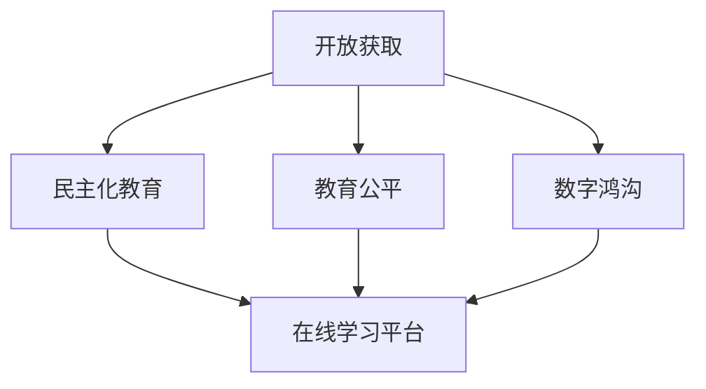

                 

# 知识的开放获取：民主化教育的理想与现实

> 关键词：开放获取,民主化教育,知识共享,教育公平,教育资源,数字鸿沟,互联网教育,在线学习平台

## 1. 背景介绍

### 1.1 问题由来

互联网技术的快速发展为知识的开放获取提供了可能，进而推动了民主化教育的发展。随着在线教育平台的普及，世界各地的学生都能够通过互联网接触到丰富的教育资源。然而，现实中的教育资源分配不均、数字鸿沟等问题，依然制约着民主化教育的实现。

### 1.2 问题核心关键点

开放获取和民主化教育的核心在于：

- **开放获取**：指教育资源可以免费或低成本获取，无版权限制，不受地域、经济、身份等限制。
- **民主化教育**：指所有个体，无论其背景、地位、经济条件如何，都能够享有平等的教育机会和资源。

这些概念之间的联系在于，开放获取提供了实现民主化教育的技术基础，而民主化教育则揭示了开放获取的社会价值。

### 1.3 问题研究意义

开放获取和民主化教育研究的意义在于：

1. **提高教育普及率**：开放获取打破了教育资源的地域和身份限制，使得更多个体能够接受到优质教育。
2. **促进教育公平**：通过免费或低成本获取教育资源，缩小教育差距，实现教育机会的公平。
3. **推动知识创新**：开放获取促进了知识的交流与共享，加速了知识的创新和传播。
4. **构建终身学习社会**：民主化教育使终身学习成为可能，提升个体和社会的整体知识水平。

## 2. 核心概念与联系

### 2.1 核心概念概述

为更好地理解开放获取和民主化教育的概念及其关系，本节将介绍几个密切相关的核心概念：

- **开放获取**：指教育资源（如教材、课件、论文、课程等）以免费或低成本的形式公开，无版权限制，任何人都可以自由使用。
- **民主化教育**：指教育资源和教育机会的公平获取，所有个体都能够平等地接触到优质教育资源，不受其背景、地位、经济条件等限制。
- **教育公平**：指教育机会、教育资源的公平分配，使得所有个体都能享有平等的教育权利。
- **数字鸿沟**：指不同个体或群体之间在数字技术获取和使用方面的差异，导致教育资源获取不均。
- **在线学习平台**：指通过互联网提供教育资源的平台，如MOOCs、e-learning平台等。

这些概念之间的逻辑关系可以通过以下Mermaid流程图来展示：



这个流程图展示了几者之间的关系：

1. 开放获取提供了实现民主化教育的技术基础。
2. 教育公平是民主化教育的目标，通过开放获取实现。
3. 数字鸿沟影响教育公平，需要通过开放获取和技术手段加以克服。
4. 在线学习平台是开放获取和民主化教育的主要实现形式。

## 3. 核心算法原理 & 具体操作步骤
### 3.1 算法原理概述

开放获取和民主化教育的实现，本质上是一个复杂的多目标优化问题。其核心思想是：通过开放获取技术，将教育资源进行数字化、网络化，并使这些资源在互联网上广泛传播，以实现民主化教育。

形式化地，假设教育资源为 $R$，用户群体为 $U$，教育公平度为 $F$，数字鸿沟为 $D$，则开放获取和民主化教育的优化目标为：

$$
\max_{R, U, F, D} F - D
$$

即在确保教育公平度的前提下，尽量减小数字鸿沟的影响。

### 3.2 算法步骤详解

开放获取和民主化教育的实现，一般包括以下几个关键步骤：

**Step 1: 教育资源数字化**

- 将传统教育资源（如教材、课件、论文等）进行数字化处理，转化为适合在线传播的格式。
- 使用OCR技术、文本挖掘、语义分析等技术，提取资源中的关键信息，便于搜索和使用。

**Step 2: 构建在线学习平台**

- 搭建一个功能齐全、易于使用的在线学习平台，支持资源上传、共享、检索等。
- 平台应具备社交网络功能，便于用户交流和协作。

**Step 3: 实现资源开放获取**

- 在平台上公开教育资源，任何人都可以免费或低成本获取。
- 采用开源协议（如CC BY-SA、CC0等），确保资源无版权限制，鼓励更多人参与贡献。

**Step 4: 促进教育公平**

- 通过技术手段，如大数据分析、推荐算法，确保用户能够获取适合其学习水平的教育资源。
- 提供定制化学习方案，以满足不同用户的需求。

**Step 5: 减小数字鸿沟**

- 通过技术手段，如互联网基础设施建设、移动设备普及，缩小数字鸿沟。
- 提供多种接入方式，如PC、平板、手机等，确保所有用户都能访问在线平台。

### 3.3 算法优缺点

开放获取和民主化教育方法的优点在于：

1. **成本低**：通过数字化和开放获取，降低了教育资源的制作和传播成本。
2. **覆盖广**：开放获取和在线学习平台使得教育资源能够覆盖更多地区和个体。
3. **高效便捷**：在线学习平台提供了方便的用户体验，加速了知识传播和交流。
4. **灵活性高**：用户可以根据自己的需求，自由选择学习资源和时间。

但该方法也存在一些局限性：

1. **资源质量参差不齐**：开放获取资源的质量良莠不齐，需要用户具备一定的筛选能力。
2. **技术依赖性高**：开放获取和民主化教育对技术和基础设施的依赖较高，可能存在技术门槛。
3. **用户自律性要求高**：在线学习平台需要用户具备一定的自律性，才能获得良好的学习效果。
4. **社会公平性问题**：虽然在线平台减小了数字鸿沟，但仍可能存在社会经济差距导致的教育不公平。

### 3.4 算法应用领域

开放获取和民主化教育在教育领域的应用，涉及以下几方面：

- **K-12教育**：通过开放获取平台，提供基础教育的教材、课件等资源，推动教育公平。
- **高等教育**：提供开放课程、在线讲座等资源，提升高等教育资源的普及率。
- **职业培训**：提供职业技能培训课程，帮助社会成员提升职业技能，缩小职业培训资源差距。
- **终身学习**：通过开放获取平台，提供各类终身学习资源，推动终身学习社会的构建。

## 4. 数学模型和公式 & 详细讲解 & 举例说明

### 4.1 数学模型构建

本节将使用数学语言对开放获取和民主化教育的优化目标进行严格刻画。

假设教育资源 $R$ 的数字化质量为 $Q$，用户群体 $U$ 的获取能力为 $C$，教育公平度 $F$ 为 $P$，数字鸿沟 $D$ 为 $G$。则开放获取和民主化教育的数学模型为：

$$
\max_{Q, C, P, G} P - G
$$

其中 $P$ 和 $G$ 之间的关系为：

$$
G = f(P)
$$

即数字鸿沟 $G$ 随教育公平度 $P$ 的变化而变化。

### 4.2 公式推导过程

以下我们以K-12教育为例，推导教育公平度 $P$ 和数字鸿沟 $G$ 的关系。

假设K-12教育资源 $R_k$ 的数字化质量为 $Q_k$，用户群体 $U_k$ 的获取能力为 $C_k$，教育公平度 $P_k$ 为 $P_k = \frac{P_{total} - G_k}{P_{total}}$，其中 $P_{total}$ 为教育公平度的上限。

当用户能够获取资源时，数字鸿沟 $G_k = 0$，教育公平度 $P_k = 1$；当用户无法获取资源时，数字鸿沟 $G_k = P_{total}$，教育公平度 $P_k = 0$。

因此，教育公平度 $P_k$ 与数字鸿沟 $G_k$ 的关系可以表示为：

$$
P_k = 1 - \frac{G_k}{P_{total}}
$$

进一步，根据上述关系，教育公平度 $P_k$ 和数字鸿沟 $G_k$ 的优化目标可以表示为：

$$
\max_{Q_k, C_k} P_k - G_k = \max_{Q_k, C_k} 1 - \frac{G_k}{P_{total}} - G_k
$$

### 4.3 案例分析与讲解

以MOOCs平台为例，分析其如何通过开放获取和民主化教育，实现教育资源的公平获取。

**案例背景**：某MOOCs平台收集了全球顶尖大学的课程资源，通过在线平台向全球用户提供免费或低成本的教育资源。

**案例分析**：

1. **教育资源数字化**：平台对全球顶尖大学课程进行数字化处理，提取关键信息，生成课程视频、讲义等资源。
2. **构建在线学习平台**：平台提供用户注册、登录、搜索、评论等功能，支持课程资源上传和分享。
3. **实现资源开放获取**：平台采用CC BY-SA协议，确保课程资源无版权限制，任何人都可以免费或低成本获取。
4. **促进教育公平**：平台使用推荐算法，根据用户的学习历史和兴趣推荐合适的课程资源，确保用户能够获取适合其学习水平的资源。
5. **减小数字鸿沟**：平台提供移动应用和离线模式，确保用户在不同设备上都能访问课程资源。

通过上述步骤，MOOCs平台成功实现了教育资源的开放获取和民主化教育，帮助全球用户获取优质教育资源。

## 5. 项目实践：代码实例和详细解释说明
### 5.1 开发环境搭建

在进行开放获取和民主化教育的应用开发前，我们需要准备好开发环境。以下是使用Python进行Django开发的环境配置流程：

1. 安装Python：从官网下载并安装Python，推荐使用Python 3.7及以上版本。
2. 安装Pip：在终端运行 `python -m ensurepip --default-pip` 安装Pip。
3. 安装虚拟环境：使用 `virtualenv` 命令创建虚拟环境。
4. 安装Django：在虚拟环境中运行 `pip install Django` 安装Django框架。
5. 安装其他依赖包：使用 `pip install` 命令安装其他需要的依赖包，如SQLite、Numpy、Pandas等。

完成上述步骤后，即可在虚拟环境中开始开发实践。

### 5.2 源代码详细实现

下面以一个简单的在线学习平台为例，展示开放获取和民主化教育的应用开发。

首先，定义课程资源类和用户类：

```python
from django.db import models

class Course(models.Model):
    title = models.CharField(max_length=100)
    description = models.TextField()
    video_url = models.URLField()
    lecture_notes = models.TextField()
    uploader = models.ForeignKey('User', on_delete=models.CASCADE)
    
class User(models.Model):
    username = models.CharField(max_length=50, unique=True)
    email = models.EmailField(unique=True)
    password = models.CharField(max_length=100)
    courses = models.ManyToManyField(Course, through='Enrollment')
    
    def __str__(self):
        return self.username
```

然后，定义课程资源上传和用户注册、登录等视图：

```python
from django.shortcuts import render, redirect
from django.contrib.auth.decorators import login_required
from django.contrib.auth import login, authenticate
from .forms import CourseForm

def course_upload(request):
    if request.method == 'POST':
        form = CourseForm(request.POST, request.FILES)
        if form.is_valid():
            form.save()
            return redirect('home')
    else:
        form = CourseForm()
    return render(request, 'course_upload.html', {'form': form})

@login_required
def user_login(request):
    if request.method == 'POST':
        username = request.POST['username']
        password = request.POST['password']
        user = authenticate(request, username=username, password=password)
        if user is not None:
            login(request, user)
            return redirect('home')
    return render(request, 'login.html')
```

最后，定义用户注册和登录表单：

```python
from django import forms
from .models import User

class UserForm(forms.ModelForm):
    class Meta:
        model = User
        fields = ['username', 'email', 'password']
        widgets = {
            'password': forms.PasswordInput(),
        }
    
class CourseForm(forms.ModelForm):
    class Meta:
        model = Course
        fields = ['title', 'description', 'video_url', 'lecture_notes']
        widgets = {
            'title': forms.TextInput(),
            'description': forms.Textarea(),
            'video_url': forms.URLInput(),
            'lecture_notes': forms.Textarea(),
        }
```

### 5.3 代码解读与分析

让我们再详细解读一下关键代码的实现细节：

**Course类和User类**：
- `Course`类：定义课程资源的基本属性，如标题、描述、视频URL、讲义等，同时关联上传者。
- `User`类：定义用户的基本属性，如用户名、邮箱、密码等，同时关联已参与的课程。

**course_upload视图**：
- 用户登录后，可通过该视图上传课程资源。
- 使用Django的表单（Form）类封装上传数据，确保数据的合法性。
- 使用Django的模板（Template）技术渲染HTML页面，确保界面友好。

**user_login视图**：
- 使用Django的认证（Authentication）机制，实现用户登录功能。
- 用户登录后，跳转到主页或上传页面，进一步操作。

通过上述代码实现，我们可以看到，Django框架提供了强大的开发工具和库，帮助开发者快速构建开放获取和民主化教育的应用。

当然，工业级的系统实现还需考虑更多因素，如用户权限管理、课程推荐算法、搜索优化等。但核心的开放获取和民主化教育逻辑基本与此类似。

## 6. 实际应用场景
### 6.1 智慧城市教育平台

基于开放获取和民主化教育理念，智慧城市教育平台可以为当地居民提供高质量的教育资源。该平台可以通过收集、整理本地大学的课程资源，提供给本地居民免费或低成本的课程学习，缩小城乡教育差距。

在技术实现上，智慧城市教育平台可以与本地教育机构合作，实现资源共享。平台可以通过API接口，接入本地大学的课程资源，并进行数字化处理和开放获取。同时，平台可以根据用户的学习历史和兴趣，推荐适合的课程资源，确保用户能够获取优质学习内容。

### 6.2 农村教育资源共享

在偏远和农村地区，教育资源往往非常匮乏。基于开放获取和民主化教育理念，可以搭建农村教育资源共享平台，使得农村学生能够接触到优质教育资源。

平台可以通过采集城市学校的课程资源，提供给农村学生免费或低成本的课程学习。同时，平台可以提供多种接入方式，如PC、平板、手机等，确保所有农村学生都能访问在线平台。平台还可以引入智能推荐和个性定制功能，根据农村学生的学习需求，推荐适合的课程资源，提升学习效果。

### 6.3 企业员工培训

现代企业需要不断提升员工的知识水平和技能，以适应快速变化的市场需求。基于开放获取和民主化教育理念，企业可以搭建员工培训平台，提供在线培训课程和学习资源。

平台可以收集国内外顶尖大学和企业内部培训课程，通过数字化和开放获取，供企业员工免费或低成本学习。平台还可以根据员工的学习历史和职业发展路径，推荐适合的课程资源，帮助员工提升职业技能，提升企业竞争力。

### 6.4 未来应用展望

随着互联网技术的不断发展和普及，开放获取和民主化教育将进一步拓展其应用范围，为更多领域带来变革性影响。

在智慧医疗领域，开放获取和民主化教育可以为医疗从业者提供优质的学习资源，提升医疗服务质量。在金融领域，平台可以提供金融知识普及和投资理财课程，提升公众金融素养。在农业领域，平台可以提供农业技术培训课程，提升农业生产效率。

未来，开放获取和民主化教育将在更多领域得到应用，为传统行业数字化转型升级提供新的技术路径。

## 7. 工具和资源推荐
### 7.1 学习资源推荐

为了帮助开发者系统掌握开放获取和民主化教育的技术基础和实践技巧，这里推荐一些优质的学习资源：

1. 《开放获取与民主化教育》系列博文：由开放获取专家撰写，深入浅出地介绍了开放获取和民主化教育的基本概念和实现方法。

2. 《教育资源数字化与开放获取》课程：斯坦福大学开设的课程，涵盖开放获取和教育资源数字化的核心技术。

3. 《开放教育资源》（OER）书籍：开放获取领域的经典书籍，全面介绍了开放获取和教育资源共享的实现方法。

4. Open Educational Resources (OER)网站：提供大量开放获取教育资源的平台，供开发者参考和学习。

5. Coursera和edX平台：提供在线课程和教育资源，帮助用户免费或低成本获取知识。

通过对这些资源的学习实践，相信你一定能够快速掌握开放获取和民主化教育的核心原理，并用于解决实际的教育问题。
###  7.2 开发工具推荐

高效的开发离不开优秀的工具支持。以下是几款用于开放获取和民主化教育开发的常用工具：

1. Django：开源的Python Web框架，功能强大，易于扩展，适合快速构建在线学习平台。

2. Flask：轻量级的Python Web框架，灵活高效，适合小型项目开发。

3. Kinto：开源的教育资源管理系统，支持资源的存储、共享和搜索。

4. Google Cloud Platform：提供云存储、计算和分析服务，支持在线学习平台的建设。

5. EdX：全球领先的在线教育平台，提供丰富的开放获取课程资源。

6. Khan Academy：免费的在线教育平台，提供K-12教育资源。

合理利用这些工具，可以显著提升开放获取和民主化教育应用的开发效率，加速创新迭代的步伐。

### 7.3 相关论文推荐

开放获取和民主化教育的发展源于学界的持续研究。以下是几篇奠基性的相关论文，推荐阅读：

1. "Open Educational Resources: Making More Knowledge Free"：开放获取教育的先驱之作，探讨了开放获取和教育资源共享的实现方法。

2. "Democratizing Education Through Open Access"：开放获取教育对教育公平的影响研究，分析了开放获取如何缩小教育差距。

3. "Massive Open Online Courses: Do They Really Change Anything?"：MOOCs对教育质量的影响研究，探讨了开放获取教育的质量保障问题。

4. "Public Universities and Open Access Publishing"：开放获取教育在公共大学中的应用研究，分析了开放获取对大学出版的影响。

5. "Open Education Resources: A Meta-Analysis of Empirical Studies"：开放获取教育效果的实证研究，探讨了开放获取对学习效果的影响。

这些论文代表了大规模开放获取和民主化教育的发展脉络。通过学习这些前沿成果，可以帮助研究者把握学科前进方向，激发更多的创新灵感。

## 8. 总结：未来发展趋势与挑战
### 8.1 总结

本文对开放获取和民主化教育的实现过程进行了全面系统的介绍。首先阐述了开放获取和民主化教育的研究背景和意义，明确了开放获取在实现民主化教育中的基础作用。其次，从原理到实践，详细讲解了开放获取和民主化教育的核心算法和操作步骤，给出了开放获取和民主化教育应用的完整代码实例。同时，本文还广泛探讨了开放获取和民主化教育在多个行业领域的应用前景，展示了开放获取和民主化教育的社会价值。

通过本文的系统梳理，可以看到，开放获取和民主化教育已经为教育资源的公平获取提供了新的途径，极大地提升了教育普及率和教育公平度。未来，伴随技术的不断进步，开放获取和民主化教育必将在更多领域得到应用，为人类社会的知识共享和终身学习带来新的可能性。

### 8.2 未来发展趋势

展望未来，开放获取和民主化教育将呈现以下几个发展趋势：

1. **技术普及化**：随着技术的不断普及，更多的教育资源将被数字化和开放获取，实现全民化学习。
2. **个性化学习**：开放获取和民主化教育将结合个性化学习技术，提供定制化学习方案，提升学习效果。
3. **多模态融合**：开放获取和民主化教育将融合多模态资源，如视频、音频、图像等，提升学习体验。
4. **全球化协作**：开放获取和民主化教育将促进全球教育资源的共享和协作，提升全球教育水平。
5. **伦理和公平**：开放获取和民主化教育将引入伦理和公平的考量，确保教育资源的公平获取。

以上趋势凸显了开放获取和民主化教育的广阔前景。这些方向的探索发展，必将进一步推动教育资源的公平获取，提升教育质量和效率。

### 8.3 面临的挑战

尽管开放获取和民主化教育已经取得了瞩目成就，但在迈向更加智能化、普适化应用的过程中，它仍面临着诸多挑战：

1. **资源质量问题**：开放获取资源的质量参差不齐，需要进一步筛选和验证。
2. **数字鸿沟问题**：即使开放获取，仍可能存在数字鸿沟，需要进一步缩小。
3. **教育公平问题**：开放获取和民主化教育虽然缩小了教育差距，但仍可能存在社会经济差距导致的教育不公平。
4. **版权和伦理问题**：开放获取教育需要考虑版权和伦理问题，确保资源的合法合规。
5. **技术依赖问题**：开放获取和民主化教育对技术和基础设施的依赖较高，可能存在技术门槛。

### 8.4 研究展望

面对开放获取和民主化教育所面临的挑战，未来的研究需要在以下几个方面寻求新的突破：

1. **提高资源质量**：开发更好的资源筛选和验证技术，确保开放获取资源的可靠性和有效性。
2. **缩小数字鸿沟**：加强互联网基础设施建设，提高技术普及率，缩小数字鸿沟。
3. **提升教育公平**：引入更多伦理和公平的考量，确保开放获取教育的公平获取。
4. **融合多模态资源**：结合多模态教育资源，提升学习体验和效果。
5. **引入AI技术**：结合人工智能技术，提升个性化学习和知识发现的能力。

这些研究方向的探索，必将引领开放获取和民主化教育走向更加智能化、普适化的未来，为人类社会的知识共享和终身学习带来新的可能性。

## 9. 附录：常见问题与解答
**Q1：开放获取和民主化教育是否适用于所有领域？**

A: 开放获取和民主化教育在教育资源获取和分配方面具有广泛适用性，但对于一些特殊领域，如医疗、法律等，可能存在一些限制。这些领域通常涉及专业知识的获取和应用，开放获取和民主化教育需要结合专业认证和培训体系，才能发挥更大作用。

**Q2：开放获取教育的质量如何保障？**

A: 开放获取教育的质量保障可以通过以下措施实现：

1. **资源筛选和验证**：通过专家评审、用户评价等方式，筛选高质量的教育资源。
2. **持续更新**：定期更新和维护开放获取教育资源，确保资源的时效性和可靠性。
3. **引入认证体系**：结合专业认证和培训体系，确保开放获取教育的质量。
4. **引入AI技术**：结合人工智能技术，提升开放获取教育的个性化和智能化水平。

**Q3：开放获取教育如何实现资源共享？**

A: 开放获取教育实现资源共享可以通过以下方式：

1. **平台建设**：搭建开放获取教育平台，提供资源的上传、检索、共享等功能。
2. **开源协议**：采用开源协议（如CC BY-SA、CC0等），确保资源的开放获取和无版权限制。
3. **合作机制**：与教育机构和组织合作，共享优质教育资源。
4. **全球协作**：参与全球教育资源共享项目，促进全球教育资源的互通互融。

**Q4：开放获取和民主化教育如何应对技术挑战？**

A: 开放获取和民主化教育应对技术挑战可以通过以下措施实现：

1. **技术普及化**：加强互联网基础设施建设，提高技术普及率。
2. **多模态融合**：融合多模态教育资源，提升学习体验和效果。
3. **AI技术应用**：结合人工智能技术，提升个性化学习和知识发现的能力。
4. **技术支持**：提供技术支持和培训，帮助用户克服技术障碍。

**Q5：开放获取和民主化教育如何提升教育公平？**

A: 开放获取和民主化教育提升教育公平可以通过以下方式实现：

1. **资源公平获取**：通过平台和开源协议，确保所有用户能够公平获取优质教育资源。
2. **个性化学习**：结合个性化学习技术，提供定制化学习方案，提升学习效果。
3. **社会公平**：引入伦理和公平的考量，确保开放获取教育的公平获取。

通过上述措施，开放获取和民主化教育可以逐步缩小教育差距，实现教育公平。

---

作者：禅与计算机程序设计艺术 / Zen and the Art of Computer Programming

