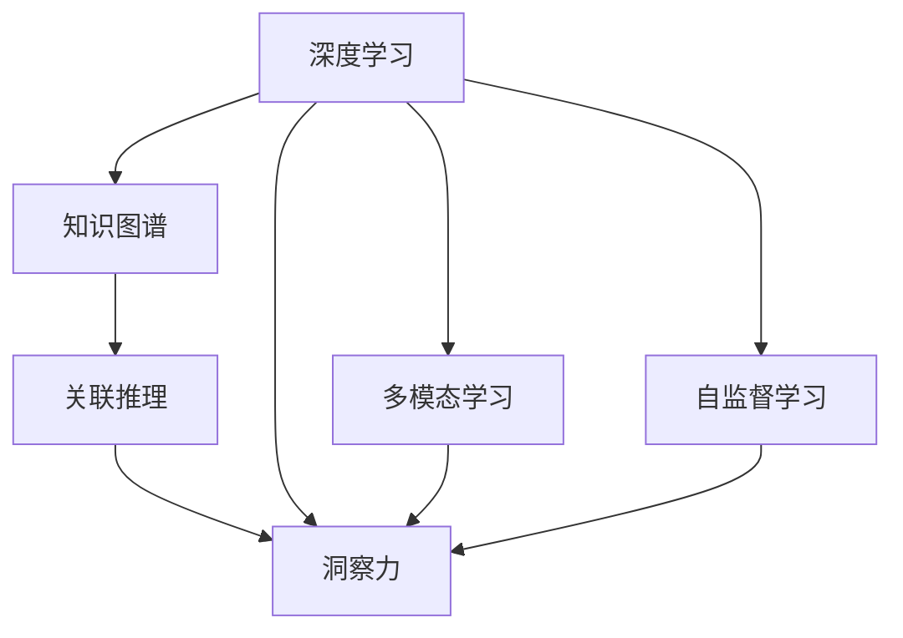
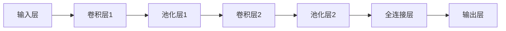

                 

# 知识的深度挖掘：洞察力的独特优势

> 关键词：深度学习, 洞察力, 知识图谱, 关联推理, 多模态学习, 自监督学习

## 1. 背景介绍

### 1.1 问题由来
在信息爆炸的时代，海量的数据和知识正在以前所未有的速度积累。如何从这些数据中挖掘出有价值的信息和知识，成为当前AI领域的重要挑战。传统的统计学习和浅层机器学习方法已无法满足这一需求。深度学习技术的兴起，特别是深度神经网络的广泛应用，为这一问题提供了解决方案。

深度学习模型通过构建多层次的特征表示，可以从原始数据中提取出更高层次的抽象特征。这些特征不仅能够更好地表示复杂的关系和模式，还能够提供更丰富的语义信息，从而实现更精准的知识发现和推理。然而，仅仅依赖数据驱动的方法，还远远不够。为了在真实世界中更好地应用深度学习模型，我们需要更多的洞察力，来帮助理解数据的本质和背后的知识。

### 1.2 问题核心关键点
洞察力在知识挖掘中的独特优势在于其能够帮助人类更好地理解和解释深度学习模型输出的结果。具体而言，洞察力可以分为以下几个关键点：

1. **解释能力**：能够清晰地解释模型为何得出某一结论，提高了模型的可解释性和可理解性。
2. **知识融合**：将人类专家的知识和经验与机器学习模型结合起来，提升模型对特定领域的理解。
3. **异常检测**：通过对比模型输出与实际事实，发现并纠正模型的错误和偏见。
4. **多模态学习**：结合不同类型的数据源，如文本、图像、语音等，提升模型的综合能力。
5. **关联推理**：利用知识图谱和逻辑规则，实现知识的推理和扩展，增强模型的泛化能力。

## 2. 核心概念与联系

### 2.1 核心概念概述

为了更好地理解深度学习在知识挖掘中的应用，以及洞察力在其中扮演的角色，我们需要对以下几个核心概念有一个清晰的认识：

1. **深度学习**：一种基于神经网络的机器学习方法，通过多层次的特征表示，实现对复杂数据的建模和预测。
2. **知识图谱**：一种语义化的知识表示方法，将现实世界中的实体、属性和关系表示为图形结构。
3. **关联推理**：基于知识图谱，通过逻辑推理和规则推理，实现知识的扩展和推理。
4. **多模态学习**：结合不同类型的数据源，提升模型的综合能力和泛化能力。
5. **自监督学习**：利用未标注的数据进行训练，提升模型的鲁棒性和泛化能力。
6. **洞察力**：通过解释、融合、检测、推理等手段，提升模型对数据和知识的理解。

这些核心概念之间存在紧密的联系，如图2所示。



### 2.2 核心概念原理和架构的 Mermaid 流程图
以下是深度学习、知识图谱、关联推理、多模态学习、自监督学习与洞察力的联系的Mermaid流程图：


## 3. 核心算法原理 & 具体操作步骤
### 3.1 算法原理概述

洞察力在大数据和深度学习中的作用，是通过对模型输出结果的解释、修正和扩展来实现的。其基本原理可以概括为以下几个步骤：

1. **数据预处理**：对原始数据进行清洗和转换，准备模型训练。
2. **模型训练**：利用深度学习模型，从预处理后的数据中提取特征。
3. **模型解释**：通过可视化、解释器等手段，解释模型的输出结果。
4. **知识融合**：将人类专家的知识和经验，与模型输出相结合，提升模型性能。
5. **异常检测**：通过对比模型输出与实际结果，发现并修正模型的错误和偏见。
6. **推理扩展**：利用知识图谱和关联推理，将模型输出的知识进行扩展和推理。

### 3.2 算法步骤详解

以下是深度学习模型进行知识挖掘和洞察力的具体操作步骤：

**Step 1: 数据预处理**
- 收集原始数据，并进行清洗、标注和转换。
- 将数据划分为训练集、验证集和测试集。
- 对文本数据进行分词、向量化等预处理。

**Step 2: 模型训练**
- 选择合适的深度学习模型，如卷积神经网络、循环神经网络、Transformer等。
- 设置模型的超参数，如学习率、批大小、迭代次数等。
- 使用优化算法（如Adam、SGD等）进行模型训练。

**Step 3: 模型解释**
- 使用可视化工具（如TensorBoard）展示模型的权重和特征图。
- 开发解释器，解释模型的决策过程。
- 生成模型输出的可视化结果，如混淆矩阵、ROC曲线等。

**Step 4: 知识融合**
- 收集人类专家的知识和经验，如规则、模板、词典等。
- 将专家知识与模型输出结合，进行融合操作。
- 利用专家知识对模型进行修正和优化。

**Step 5: 异常检测**
- 收集真实数据和模型预测数据，计算预测误差。
- 对比预测结果与实际结果，发现异常点和错误。
- 对模型进行修正和优化，提高其鲁棒性。

**Step 6: 推理扩展**
- 构建知识图谱，将模型输出的知识进行图形化表示。
- 利用关联推理算法（如基于规则推理、基于神经网络推理等），扩展和推理知识图谱中的关系。
- 将推理结果与模型输出结合，提升模型的泛化能力。

### 3.3 算法优缺点

深度学习模型进行知识挖掘的优点在于：

1. **高效性**：能够处理大规模数据集，提取高层次的特征表示。
2. **鲁棒性**：通过自监督学习，提升模型的泛化能力。
3. **可扩展性**：结合多模态数据和多类型知识，提升模型的综合能力。
4. **自动化**：通过训练和优化，自动学习知识表示。

缺点在于：

1. **可解释性不足**：深度学习模型的决策过程难以解释，缺乏可理解性。
2. **知识依赖**：模型需要大量标注数据和专家知识，才能取得较好的效果。
3. **偏差和错误**：模型容易受到数据偏差和标注错误的影响。
4. **资源消耗**：模型训练和推理需要大量计算资源和时间。

### 3.4 算法应用领域

深度学习模型和洞察力在大数据和深度学习中的应用领域非常广泛，包括但不限于以下几个方面：

- **自然语言处理**：如文本分类、命名实体识别、机器翻译等。
- **计算机视觉**：如图像分类、目标检测、图像生成等。
- **推荐系统**：如个性化推荐、广告推荐、行为分析等。
- **金融分析**：如风险评估、信用评分、欺诈检测等。
- **医疗诊断**：如影像诊断、基因分析、疾病预测等。
- **智能制造**：如质量检测、设备监控、生产调度等。

## 4. 数学模型和公式 & 详细讲解 & 举例说明
### 4.1 数学模型构建

深度学习模型进行知识挖掘的基本数学模型可以概括为以下几个部分：

1. **输入层**：将原始数据转换为神经网络能够处理的格式。
2. **隐藏层**：通过神经网络的多层次特征提取，提取数据的高层次特征表示。
3. **输出层**：将隐藏层的特征表示转换为最终的预测结果。

以卷积神经网络（CNN）为例，其基本数学模型如图4所示。



### 4.2 公式推导过程

以卷积神经网络为例，其基本公式推导如下：

**Step 1: 卷积层**
- 输入数据：$X \in \mathbb{R}^{h\times w\times c}$
- 卷积核：$W \in \mathbb{R}^{k\times k\times c\times o}$
- 卷积操作：$O_1 = F(X,W) = W^T * X = \sum_i W_{i,:,:,:} * X_{i,:,:,:}$

**Step 2: 池化层**
- 池化窗口大小：$k \in \mathbb{R}$
- 池化操作：$O_2 = F(O_1,k) = \sum_i \max(O_1_{i,:,:,:})$

**Step 3: 全连接层**
- 全连接层权重：$W \in \mathbb{R}^{d\times h\times w\times o}$
- 全连接操作：$O_3 = F(O_2,W) = W^T * O_2$

**Step 4: 输出层**
- 输出层权重：$W \in \mathbb{R}^{m\times d}$
- 输出操作：$Y = F(O_3,W) = W^T * O_3$

其中，$h$、$w$、$c$ 分别为输入数据的高、宽、通道数；$k$、$o$ 分别为卷积核的宽度、深度和输出通道数；$d$、$m$ 分别为全连接层的节点数和输出结果数。

### 4.3 案例分析与讲解

以图像分类为例，深度学习模型可以使用卷积神经网络进行训练和预测。具体步骤如下：

1. **数据预处理**：将图像数据转换为神经网络能够处理的格式，如像素矩阵。
2. **模型训练**：使用训练集数据，训练卷积神经网络模型，提取图像特征。
3. **模型解释**：使用可视化工具，展示模型的权重和特征图。
4. **知识融合**：收集图像领域专家的知识和经验，如分类规则、标签词典等。
5. **异常检测**：收集真实数据和模型预测数据，计算预测误差。
6. **推理扩展**：将模型输出的分类结果扩展为更丰富的语义信息，如物体位置、姿态等。

## 5. 项目实践：代码实例和详细解释说明
### 5.1 开发环境搭建

以下是使用Python和TensorFlow进行卷积神经网络训练和预测的开发环境搭建流程：

1. 安装Anaconda：从官网下载并安装Anaconda，用于创建独立的Python环境。
2. 创建并激活虚拟环境：
```bash
conda create -n tf-env python=3.7 
conda activate tf-env
```
3. 安装TensorFlow：根据CUDA版本，从官网获取对应的安装命令。例如：
```bash
conda install tensorflow-gpu=2.7.0 -c pytorch -c conda-forge
```
4. 安装各类工具包：
```bash
pip install numpy pandas scikit-learn matplotlib tqdm jupyter notebook ipython
```

完成上述步骤后，即可在`tf-env`环境中开始深度学习项目实践。

### 5.2 源代码详细实现

下面以图像分类为例，给出使用TensorFlow进行卷积神经网络训练的PyTorch代码实现。

```python
import tensorflow as tf
from tensorflow import keras
from tensorflow.keras import layers

# 定义卷积神经网络模型
model = keras.Sequential([
    layers.Conv2D(32, (3, 3), activation='relu', input_shape=(28, 28, 1)),
    layers.MaxPooling2D((2, 2)),
    layers.Conv2D(64, (3, 3), activation='relu'),
    layers.MaxPooling2D((2, 2)),
    layers.Flatten(),
    layers.Dense(64, activation='relu'),
    layers.Dense(10, activation='softmax')
])

# 编译模型
model.compile(optimizer='adam', loss='sparse_categorical_crossentropy', metrics=['accuracy'])

# 训练模型
model.fit(train_images, train_labels, epochs=5, batch_size=32)

# 评估模型
test_loss, test_acc = model.evaluate(test_images, test_labels)
print(f'Test accuracy: {test_acc}')
```

### 5.3 代码解读与分析

让我们再详细解读一下关键代码的实现细节：

**model定义**：
- 使用Sequential模型定义卷积神经网络，包含多个卷积层、池化层和全连接层。
- 卷积层使用32和64个3x3的卷积核，激活函数为ReLU。
- 池化层使用2x2的池化窗口，减小特征图大小。
- 全连接层使用64个节点，激活函数为ReLU。
- 输出层使用10个节点，激活函数为softmax，用于分类任务。

**model.compile**：
- 使用adam优化器，损失函数为sparse_categorical_crossentropy，评价指标为accuracy。
- 编译模型，为后续训练和评估做好准备。

**model.fit**：
- 使用训练集数据进行模型训练，迭代5个epochs，每个batch大小为32。
- 在每个epoch结束时，使用验证集评估模型性能。

**model.evaluate**：
- 使用测试集数据进行模型评估，输出测试集上的准确率。

通过上述代码，可以完整实现卷积神经网络的训练和预测，进一步理解深度学习模型在知识挖掘中的应用。

## 6. 实际应用场景
### 6.1 智慧医疗

深度学习在智慧医疗领域有着广泛的应用，包括医学影像分析、疾病预测、基因分析等。洞察力可以帮助医生更好地理解模型的输出结果，提高诊断和治疗的准确性和效率。

例如，在医学影像分析中，深度学习模型可以从CT、MRI等影像数据中提取高层次的特征表示。医生可以利用洞察力，解释模型的特征提取过程和分类结果，判断影像异常点和病变区域，提高诊断的准确性和可解释性。

### 6.2 智能制造

深度学习在智能制造中的应用包括设备监控、质量检测、生产调度等。洞察力可以帮助工人更好地理解模型的输出结果，提高生产效率和质量。

例如，在设备监控中，深度学习模型可以从传感器数据中提取设备运行状态特征。工人可以利用洞察力，解释模型的特征提取过程和异常检测结果，及时发现设备故障和异常情况，避免生产中断和设备损坏，提高生产效率。

### 6.3 金融分析

深度学习在金融分析中的应用包括风险评估、信用评分、欺诈检测等。洞察力可以帮助分析师更好地理解模型的输出结果，提高风险管理和决策的准确性。

例如，在信用评分中，深度学习模型可以从用户的历史行为数据中提取特征。分析师可以利用洞察力，解释模型的特征提取过程和评分结果，评估用户的信用风险，做出合理的贷款决策，降低坏账率。

### 6.4 未来应用展望

随着深度学习技术的发展，其应用领域将不断扩展，洞察力在其中扮演的角色也将越来越重要。未来的研究将关注以下几个方面：

1. **多模态学习**：结合不同类型的数据源，提升模型的综合能力和泛化能力。
2. **自监督学习**：利用未标注数据进行训练，提升模型的泛化能力和鲁棒性。
3. **知识图谱和关联推理**：利用知识图谱和关联推理，实现知识的推理和扩展，增强模型的泛化能力。
4. **深度学习与可解释性**：开发更具有可解释性的深度学习模型，提高模型的透明度和可信度。
5. **跨领域应用**：将深度学习应用于更多领域，如交通、教育、环保等，实现跨领域的知识挖掘和推理。

## 7. 工具和资源推荐
### 7.1 学习资源推荐

为了帮助开发者系统掌握深度学习在知识挖掘中的应用，以及洞察力的独特优势，这里推荐一些优质的学习资源：

1. 《深度学习》系列书籍：由李宏毅教授主编，系统介绍了深度学习的基本概念和应用。
2. 《Python深度学习》书籍：由Francois Chollet著，介绍了TensorFlow和Keras的使用方法。
3. CS231n《卷积神经网络》课程：斯坦福大学开设的深度学习课程，详细讲解了卷积神经网络的原理和应用。
4. 《自然语言处理与深度学习》书籍：介绍了自然语言处理和深度学习的基本原理和应用。
5. 《深度学习实战》书籍：介绍了深度学习在实际项目中的应用，包括图像分类、文本生成等。
6. TensorFlow官方文档：提供了TensorFlow的详细使用方法和示例代码。

通过对这些资源的学习实践，相信你一定能够快速掌握深度学习在知识挖掘中的应用，并用于解决实际的NLP问题。

### 7.2 开发工具推荐

高效的开发离不开优秀的工具支持。以下是几款用于深度学习开发的常用工具：

1. TensorFlow：由Google主导开发的开源深度学习框架，生产部署方便，适合大规模工程应用。
2. PyTorch：基于Python的开源深度学习框架，灵活动态的计算图，适合快速迭代研究。
3. Keras：高级神经网络API，可以无缝集成TensorFlow和Theano，简单易用。
4. TensorBoard：TensorFlow配套的可视化工具，可实时监测模型训练状态，并提供丰富的图表呈现方式。
5. Weights & Biases：模型训练的实验跟踪工具，可以记录和可视化模型训练过程中的各项指标，方便对比和调优。
6. Jupyter Notebook：交互式编程环境，支持多种编程语言和库，方便开发和调试。

合理利用这些工具，可以显著提升深度学习开发和研究效率，加快创新迭代的步伐。

### 7.3 相关论文推荐

深度学习在知识挖掘中的应用和洞察力的独特优势，得益于学界的持续研究。以下是几篇奠基性的相关论文，推荐阅读：

1. AlexNet：Alex Krizhevsky等人，2012年，ImageNet大规模视觉识别挑战赛的冠军算法，开启了深度学习在计算机视觉中的应用。
2. InceptionNet：Christian Szegedy等人，2014年，提出了Inception模块，进一步提升了卷积神经网络的性能。
3. ResNet：Kaiming He等人，2015年，提出了残差网络，解决了深度神经网络训练中的梯度消失问题。
4. GAN：Ian Goodfellow等人，2014年，提出了生成对抗网络，实现了高保真度的图像生成和图像转换。
5. VGGNet：Karen Simonyan和Andrew Zisserman，2014年，提出了VGG网络，提升了深度学习模型的分类性能。
6. Attention is All You Need：Ashish Vaswani等人，2017年，提出了Transformer结构，开启了大模型在自然语言处理中的应用。

这些论文代表了大数据和深度学习领域的发展脉络。通过学习这些前沿成果，可以帮助研究者把握学科前进方向，激发更多的创新灵感。

## 8. 总结：未来发展趋势与挑战

### 8.1 总结

本文对深度学习在知识挖掘中的应用，以及洞察力的独特优势进行了全面系统的介绍。首先阐述了深度学习在数据驱动中的应用，以及洞察力在其中扮演的角色。其次，从原理到实践，详细讲解了深度学习模型的构建和训练过程，给出了深度学习项目开发的完整代码实例。同时，本文还广泛探讨了深度学习在智慧医疗、智能制造、金融分析等诸多行业领域的应用前景，展示了深度学习技术的巨大潜力。

通过本文的系统梳理，可以看到，深度学习在知识挖掘中的应用前景广阔，洞察力在其中扮演着重要角色。深度学习模型能够高效提取高层次特征，洞察力能够帮助理解模型的输出结果，提升模型的可解释性和泛化能力。未来，深度学习技术还将进一步发展和完善，成为知识挖掘和智能应用的重要工具。

### 8.2 未来发展趋势

展望未来，深度学习在知识挖掘中的应用将呈现以下几个发展趋势：

1. **多模态学习**：结合不同类型的数据源，提升模型的综合能力和泛化能力。
2. **自监督学习**：利用未标注数据进行训练，提升模型的泛化能力和鲁棒性。
3. **知识图谱和关联推理**：利用知识图谱和关联推理，实现知识的推理和扩展，增强模型的泛化能力。
4. **深度学习与可解释性**：开发更具有可解释性的深度学习模型，提高模型的透明度和可信度。
5. **跨领域应用**：将深度学习应用于更多领域，如交通、教育、环保等，实现跨领域的知识挖掘和推理。

### 8.3 面临的挑战

尽管深度学习技术已经取得了瞩目成就，但在迈向更加智能化、普适化应用的过程中，它仍面临着诸多挑战：

1. **数据依赖**：深度学习模型需要大量标注数据进行训练，获取高质量标注数据的高成本和复杂性仍是主要瓶颈。
2. **可解释性不足**：深度学习模型的决策过程难以解释，缺乏可理解性。
3. **资源消耗**：模型训练和推理需要大量计算资源和时间，计算资源的消耗和存储空间的占用成为主要问题。
4. **知识依赖**：模型需要大量标注数据和专家知识，才能取得较好的效果。
5. **偏差和错误**：模型容易受到数据偏差和标注错误的影响。

### 8.4 研究展望

面对深度学习在知识挖掘中面临的种种挑战，未来的研究需要在以下几个方面寻求新的突破：

1. **无监督学习和半监督学习**：利用自监督学习、主动学习等方法，降低对标注数据的依赖，提升模型的泛化能力和鲁棒性。
2. **知识融合和推理**：结合人类专家的知识和经验，提升模型的综合能力和推理能力。
3. **多模态学习和跨领域应用**：结合不同类型的数据源，提升模型的综合能力和泛化能力，将深度学习应用于更多领域。
4. **深度学习与可解释性**：开发更具有可解释性的深度学习模型，提高模型的透明度和可信度。
5. **跨领域知识图谱**：构建跨领域的知识图谱，实现知识的推理和扩展，增强模型的泛化能力。

这些研究方向的探索，必将引领深度学习技术迈向更高的台阶，为知识挖掘和智能应用提供新的工具和方法。相信随着学界和产业界的共同努力，深度学习技术必将在知识挖掘和智能应用中发挥越来越重要的作用。

## 9. 附录：常见问题与解答
### 9.1 深度学习模型如何实现跨领域应用？

深度学习模型可以通过迁移学习实现跨领域应用。迁移学习是指将在一个领域训练好的模型应用于另一个领域，利用已有知识提升新领域模型的性能。具体步骤如下：

1. **数据预处理**：将新领域的数据进行预处理，转换成模型能够处理的格式。
2. **微调模型**：在新领域数据上进行微调，调整模型的权重和参数。
3. **迁移知识**：将已有领域模型中的知识迁移到新领域模型中，提高新领域模型的泛化能力。

通过迁移学习，深度学习模型可以在不同的领域中实现高效应用，提升模型的泛化能力和鲁棒性。

### 9.2 深度学习模型如何进行异常检测？

深度学习模型可以通过异常检测技术识别模型输出中的异常点和错误。具体步骤如下：

1. **数据预处理**：将原始数据进行清洗和转换，准备模型训练。
2. **模型训练**：使用正常数据和异常数据训练异常检测模型，学习正常数据和异常数据的特征表示。
3. **模型解释**：使用可视化工具，展示模型的权重和特征图。
4. **异常检测**：将新数据输入异常检测模型，计算模型输出的置信度，判断新数据是否为异常数据。

通过异常检测技术，深度学习模型可以及时发现和修正模型的错误和偏见，提高模型的鲁棒性和可靠性。

### 9.3 深度学习模型如何进行跨模态学习？

深度学习模型可以通过跨模态学习，结合不同类型的数据源，提升模型的综合能力和泛化能力。具体步骤如下：

1. **数据预处理**：将不同类型的数据进行清洗和转换，准备模型训练。
2. **模型训练**：使用不同类型的数据训练跨模态学习模型，学习不同数据源之间的关联特征。
3. **模型解释**：使用可视化工具，展示模型的权重和特征图。
4. **跨模态推理**：将不同类型的数据进行组合，使用跨模态学习模型进行推理，提取高层次的综合特征表示。

通过跨模态学习，深度学习模型可以结合不同类型的数据源，提升模型的综合能力和泛化能力，实现多模态数据的协同建模。

### 9.4 深度学习模型如何进行关联推理？

深度学习模型可以通过关联推理技术，利用知识图谱和逻辑规则，实现知识的推理和扩展，增强模型的泛化能力。具体步骤如下：

1. **数据预处理**：将知识图谱进行预处理，提取实体、属性和关系。
2. **模型训练**：使用知识图谱训练关联推理模型，学习实体、属性和关系之间的关联特征。
3. **模型解释**：使用可视化工具，展示模型的权重和特征图。
4. **推理扩展**：将模型输出的知识进行扩展和推理，利用知识图谱和关联规则，实现知识推理和关联。

通过关联推理技术，深度学习模型可以利用知识图谱和逻辑规则，实现知识的推理和扩展，增强模型的泛化能力，提升知识挖掘的效果。

### 9.5 深度学习模型如何进行知识融合？

深度学习模型可以通过知识融合技术，将人类专家的知识和经验与模型输出相结合，提升模型的性能。具体步骤如下：

1. **数据预处理**：将专家知识和经验进行预处理，转换成模型能够处理的形式。
2. **模型训练**：将专家知识和经验与模型输出进行融合，训练融合后的模型。
3. **模型解释**：使用可视化工具，展示模型的权重和特征图。
4. **模型优化**：利用专家知识和经验，对模型进行修正和优化，提高模型的性能。

通过知识融合技术，深度学习模型可以结合人类专家的知识和经验，提升模型的性能和泛化能力，实现更好的知识挖掘效果。

---

作者：禅与计算机程序设计艺术 / Zen and the Art of Computer Programming

