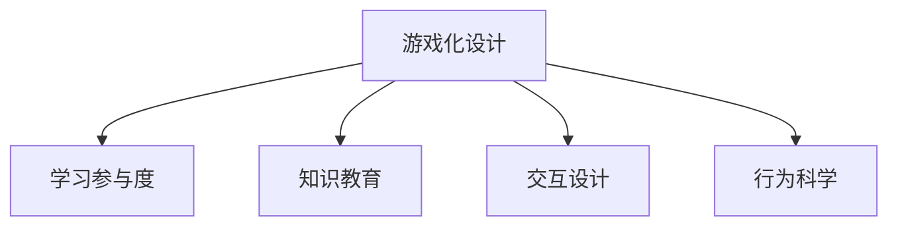

                 

# 知识的游戏化设计：提高学习参与度的策略

> 关键词：游戏化设计, 学习参与度, 知识教育, 交互设计, 行为科学

## 1. 背景介绍

### 1.1 问题由来

随着知识经济时代的到来，终身学习已成为个体和组织的基本需求。然而，传统的课堂教学模式往往难以适应快节奏、多样化的学习需求，导致学习参与度不足、学习效率低下。游戏化设计（Gamification）作为一种创新教育方法，将游戏元素融入学习过程中，有效提升学习者的参与度和学习效果。

近年来，游戏化设计在教育领域得到广泛应用，取得了显著成效。例如，通过积分奖励、勋章认证、成就系统等，激发了学习者的内在动机，增强了学习的持续性和积极性。但同时也存在一些问题，如游戏化设计过度商业化、形式化，忽视学习内容的实质性价值等。

### 1.2 问题核心关键点

游戏化设计的核心在于如何利用游戏元素与学习过程结合，增强学习者的参与感和动机。以下是一些关键点：

- **内在动机**：通过游戏化设计激发学习者的内在动机，使学习成为一种主动选择和享受的过程。
- **互动体验**：设计互动性的学习活动，提升学习者的沉浸感和参与度。
- **及时反馈**：提供及时的反馈机制，帮助学习者及时调整学习策略和行为。
- **渐进挑战**：设置逐步增加的挑战和难度，保持学习者的好奇心和成就感。
- **社交互动**：通过合作与竞争机制，促进学习者之间的交流和协作。

## 2. 核心概念与联系

### 2.1 核心概念概述

为更好地理解知识游戏化设计的原理和实践，本节将介绍几个密切相关的核心概念：

- **游戏化设计**：将游戏元素和机制融入到非游戏情境中，以增强用户参与度和动机。常见游戏元素包括积分、徽章、排行榜等。
- **学习参与度**：指学习者在学习过程中投入的时间、注意力和情感等心理资源的程度。
- **知识教育**：通过科学方法和结构化知识，传递系统性、专业性的知识，培养学习者的综合能力。
- **交互设计**：利用人机交互原理，设计用户友好的界面和操作流程，提升用户体验。
- **行为科学**：研究人类行为和心理的规律，指导设计更加符合人类行为习惯的产品和服务。

这些概念之间的逻辑关系可以通过以下Mermaid流程图来展示：



这个流程图展示了几大核心概念之间的联系：

1. 游戏化设计通过引入游戏元素，激发学习者的内在动机，提升学习参与度。
2. 知识教育提供系统化、结构化的知识，是游戏化设计的基础。
3. 交互设计通过友好的界面和操作流程，增强学习者的互动体验。
4. 行为科学指导游戏化设计，使其更加符合学习者的行为习惯。

这些概念共同构成了知识游戏化设计的框架，使其能够更好地实现教育目标。

## 3. 核心算法原理 & 具体操作步骤
### 3.1 算法原理概述

知识游戏化设计的算法原理，主要基于行为科学和认知心理学的研究成果。核心思想是通过游戏化元素和机制，激发学习者的内在动机，增强其学习参与度。

具体来说，知识游戏化设计通过以下几个步骤实现：

1. **目标设定**：明确学习目标和期望成果，设计与之匹配的游戏元素和机制。
2. **任务设计**：将学习目标转化为具体的任务和活动，设计互动性强、挑战适中的任务。
3. **反馈机制**：提供及时、正面的反馈，帮助学习者了解自己的进展和不足，调整学习策略。
4. **激励系统**：设置积分、徽章、排行榜等激励机制，激发学习者的内在动机。
5. **社交互动**：引入合作与竞争机制，促进学习者之间的交流和协作。

### 3.2 算法步骤详解

以下详细介绍知识游戏化设计的算法步骤：

**Step 1: 明确学习目标和期望成果**

首先需要明确学习目标和期望成果，这是知识游戏化设计的起点。例如，如果是为了提升编程技能，目标可能是掌握某项编程语言的基本语法和数据结构。

**Step 2: 设计游戏元素和机制**

根据学习目标，设计与之匹配的游戏元素和机制。例如，对于编程学习，可以设计编程挑战、代码评审、代码优化等游戏元素。

**Step 3: 设计具体任务和活动**

将学习目标转化为具体的任务和活动，设计互动性强、挑战适中的任务。例如，设计一系列编程挑战，每个挑战都有明确的目标和难度，逐步提高挑战难度。

**Step 4: 提供及时反馈**

在每个任务完成后，提供及时、正面的反馈，帮助学习者了解自己的进展和不足，调整学习策略。例如，对于编程挑战，可以设计自动代码评审和优化建议。

**Step 5: 设置激励系统**

设置积分、徽章、排行榜等激励系统，激发学习者的内在动机。例如，设置编程挑战的积分奖励，根据积分排名发放徽章。

**Step 6: 引入社交互动**

引入合作与竞争机制，促进学习者之间的交流和协作。例如，设计编程小组项目，小组成员共同完成一个项目，最后根据项目完成情况进行评价和奖励。

### 3.3 算法优缺点

知识游戏化设计的优点：

- **提高参与度**：通过游戏化元素和机制，激发学习者的内在动机，提升学习参与度。
- **增强动机**：通过激励系统，激发学习者的成就感和内在动机，保持学习兴趣。
- **增强互动性**：通过互动任务和活动，增强学习者的沉浸感和互动体验。
- **及时反馈**：提供及时反馈，帮助学习者了解自己的进展和不足，调整学习策略。

知识游戏化设计的主要缺点：

- **商业化问题**：部分游戏化设计过度商业化，忽视学习内容的实质性价值。
- **形式化问题**：部分游戏化设计过于形式化，未能有效结合学习内容和目标。
- **过度娱乐化**：部分游戏化设计过于娱乐化，未能达到教育目标。
- **数据隐私问题**：部分游戏化设计需要收集学习者数据，可能存在数据隐私问题。

尽管存在这些局限性，但知识游戏化设计在提高学习参与度方面的作用不容忽视。未来相关研究的重点在于如何更好地平衡游戏化设计和教育目标，提高游戏的教育性和实用性。

### 3.4 算法应用领域

知识游戏化设计在游戏化教育、在线课程、企业培训等多个领域都有广泛应用：

- **游戏化教育**：将游戏元素融入教育课程中，提升学生的学习参与度和效果。
- **在线课程**：设计互动性强、挑战适中的在线课程，吸引学生参与学习。
- **企业培训**：通过游戏化设计，提升员工的技能培训效果和参与度。
- **个人技能提升**：通过游戏化设计，提升个人自学和自我提升的效果。

## 4. 数学模型和公式 & 详细讲解 & 举例说明

### 4.1 数学模型构建

知识游戏化设计的数学模型构建，需要综合考虑学习者行为和游戏化元素的效果。这里以编程技能提升为例，构建一个简单的学习效果模型：

记学习者完成一个编程挑战的时间为 $t$，完成挑战后获得的积分奖励为 $R$，学习者对挑战的满意程度为 $S$。学习效果 $E$ 可以表示为：

$$
E = f(t, R, S)
$$

其中 $f$ 是一个非线性函数，描述了时间、奖励和满意度对学习效果的综合影响。

### 4.2 公式推导过程

根据上述模型，我们可以推导出学习效果的计算公式：

$$
E = g(R) + h(S)
$$

其中 $g(R)$ 表示奖励对学习效果的影响，$h(S)$ 表示满意度对学习效果的影响。具体函数形式需要根据实际数据进行拟合。

### 4.3 案例分析与讲解

假设某编程课程的学习者，完成每个编程挑战后获得 10 积分奖励，对挑战的满意度为 0.8。根据上述模型，可以计算出该学习者的学习效果：

$$
E = g(10) + h(0.8)
$$

设 $g(R)$ 和 $h(S)$ 的函数形式如下：

$$
g(R) = 0.5R
$$

$$
h(S) = 0.3S
$$

代入具体值计算：

$$
E = 0.5 \times 10 + 0.3 \times 0.8 = 8.4
$$

表示该学习者对编程挑战的掌握程度为 8.4。

## 5. 项目实践：代码实例和详细解释说明
### 5.1 开发环境搭建

在进行知识游戏化设计的项目实践前，我们需要准备好开发环境。以下是使用Python进行Flask开发的开发环境配置流程：

1. 安装Anaconda：从官网下载并安装Anaconda，用于创建独立的Python环境。

2. 创建并激活虚拟环境：
```bash
conda create -n myenv python=3.8 
conda activate myenv
```

3. 安装Flask：使用pip安装Flask框架，并设置项目路径：
```bash
pip install Flask
mkdir project
cd project
```

4. 创建Flask应用程序：
```python
from flask import Flask, render_template, request, jsonify

app = Flask(__name__)

@app.route('/')
def index():
    return render_template('index.html')

@app.route('/submit', methods=['POST'])
def submit():
    name = request.form['name']
    score = request.form['score']
    return jsonify({'name': name, 'score': score})

if __name__ == '__main__':
    app.run(debug=True)
```

5. 创建HTML模板：
```html
<!-- index.html -->
<html>
    <head>
        <title>知识游戏化设计</title>
    </head>
    <body>
        <h1>欢迎访问知识游戏化设计平台</h1>
        <form method="POST">
            <label>输入名字：</label>
            <input type="text" name="name" required><br><br>
            <label>输入得分：</label>
            <input type="number" name="score" required><br><br>
            <button type="submit">提交得分</button>
        </form>
    </body>
</html>
```

完成上述步骤后，即可在`myenv`环境中开始知识游戏化设计的项目实践。

### 5.2 源代码详细实现

下面是一个简单的知识游戏化设计平台示例，用户可以在平台上进行编程挑战，并获得积分和奖励。

```python
import random

class Challenge:
    def __init__(self):
        self.name = '编程挑战 1'
        self.description = '编写一个简单的计算器程序。'
        self.reward = 10
        self.entrance = True

    def __str__(self):
        return self.name

class Leaderboard:
    def __init__(self):
        self.leaderboard = []

    def add_score(self, user, score):
        self.leaderboard.append({'name': user, 'score': score})
        self.leaderboard.sort(key=lambda x: x['score'], reverse=True)

    def __str__(self):
        return '\n'.join([f'{user}：{score}' for user, score in self.leaderboard])

def get_challenges():
    challenges = []
    challenges.append(Challenge())
    challenges.append(Challenge())
    return challenges

def get_leaderboard():
    leaderboard = Leaderboard()
    leaderboard.add_score('Alice', 50)
    leaderboard.add_score('Bob', 30)
    leaderboard.add_score('Charlie', 20)
    return leaderboard

if __name__ == '__main__':
    challenges = get_challenges()
    leaderboard = get_leaderboard()
    print('挑战列表：')
    for challenge in challenges:
        print(challenge)
    print('排行榜：')
    print(leaderboard)
```

### 5.3 代码解读与分析

让我们再详细解读一下关键代码的实现细节：

**Challenge类**：
- `__init__`方法：初始化挑战的详细信息，包括名称、描述、奖励、是否开放等。
- `__str__`方法：定义挑战的字符串表示形式。

**Leaderboard类**：
- `__init__`方法：初始化排行榜的详细信息。
- `add_score`方法：添加用户的得分到排行榜中。
- `__str__`方法：定义排行榜的字符串表示形式。

**get_challenges和get_leaderboard函数**：
- `get_challenges`函数：返回预定义的挑战列表。
- `get_leaderboard`函数：返回预定义的排行榜。

**主程序**：
- 首先，获取挑战列表和排行榜，并进行打印输出。
- 可以看到，挑战列表包含两个编程挑战，排行榜展示了三位用户的得分情况。

这个示例展示了知识游戏化设计平台的基本功能，包括挑战设计、排行榜展示等。通过Flask框架，用户可以轻松地将前端页面和后端逻辑集成在一起，实现互动性和可扩展性。

当然，工业级的系统实现还需考虑更多因素，如用户注册、任务评分、积分系统等。但核心的知识游戏化设计思想基本与此类似。

## 6. 实际应用场景
### 6.1 教育领域

知识游戏化设计在教育领域的应用，可以帮助教师设计更加互动、趣味化的课程，提升学生的学习参与度和效果。

例如，某数学课程可以使用游戏化设计，将复杂的数学问题转化为游戏挑战。学生完成每个挑战后，可以获得积分奖励，并在排行榜上展示得分。通过这种方式，学生可以更加积极地参与学习，并在竞争中寻找学习动力。

### 6.2 企业培训

企业培训也需要考虑员工的学习参与度。知识游戏化设计可以帮助企业在培训过程中，提升员工的积极性和互动性。

例如，某IT公司可以使用知识游戏化设计，设计一系列编程和技能培训课程。员工完成每个课程后，可以获得积分和奖励，并在公司内部排行榜上展示成绩。通过这种方式，员工可以更加主动地学习新技能，并在公司内部形成学习竞赛氛围。

### 6.3 个人自学

知识游戏化设计也可以应用于个人自学。通过设计互动性强、挑战适中的学习任务，帮助学习者保持持续的学习兴趣和动力。

例如，某编程爱好者可以使用知识游戏化设计，设计一系列编程挑战和项目，完成每个挑战后获得积分奖励，并在个人排行榜上展示成绩。通过这种方式，学习者可以更加积极地进行自学，并在成就感中获得持续动力。

### 6.4 未来应用展望

随着知识游戏化设计的不断发展，未来的应用场景将更加广泛，涵盖更多领域和人群。

在智慧教育领域，知识游戏化设计可以帮助学校设计更加互动、趣味化的教学课程，提升学生的学习兴趣和效果。在企业培训领域，知识游戏化设计可以帮助企业设计更加高效、互动的培训课程，提升员工的培训效果和参与度。在个人自学领域，知识游戏化设计可以帮助学习者设计更加灵活、互动的学习任务，提升个人的自学效果和动力。

## 7. 工具和资源推荐
### 7.1 学习资源推荐

为了帮助开发者系统掌握知识游戏化设计的理论基础和实践技巧，这里推荐一些优质的学习资源：

1. **《游戏化设计：实战手册》**：一本关于游戏化设计的实用书籍，涵盖了游戏化设计的原理、方法和实践。
2. **Coursera游戏化设计课程**：Coursera开设的游戏化设计课程，由游戏设计师和心理学家联合授课，深入浅出地介绍了游戏化设计的理论和实践。
3. **Gamification Insights**：一个游戏化设计的在线资源平台，提供大量的案例分析、工具和资源，帮助开发者设计更好的游戏化系统。
4. **Gamify The World**：一本游戏化设计的综合性书籍，介绍了游戏化设计在各个领域的应用案例和策略。
5. **Behavioral Design Lab**：一个行为科学研究的在线平台，提供大量的实验数据和理论分析，帮助开发者设计更加符合人类行为习惯的游戏化系统。

通过对这些资源的学习实践，相信你一定能够快速掌握知识游戏化设计的精髓，并用于解决实际的教育问题。

### 7.2 开发工具推荐

高效的开发离不开优秀的工具支持。以下是几款用于知识游戏化设计开发的常用工具：

1. **Flask**：一个轻量级的Web开发框架，适合快速开发知识游戏化设计平台。
2. **React**：一个流行的JavaScript库，适合开发互动性强的前端页面。
3. **Figma**：一个在线设计工具，适合设计师协作设计知识游戏化设计的用户界面和用户体验。
4. **Trello**：一个项目管理工具，适合团队协作设计和管理知识游戏化设计项目。
5. **Jupyter Notebook**：一个在线笔记本工具，适合数据科学家进行数据分析和实验。

合理利用这些工具，可以显著提升知识游戏化设计的开发效率，加快创新迭代的步伐。

### 7.3 相关论文推荐

知识游戏化设计的理论研究和实践探索，源于学界的持续努力。以下是几篇奠基性的相关论文，推荐阅读：

1. **《Gamification in Higher Education: An Empirical Study of Usage and Outcomes》**：一篇关于游戏化设计在高等教育中的应用研究，探讨了游戏化设计对学习效果的影响。
2. **《Gamification Effects on User Participation and Performance in a Social Learning Environment》**：一篇关于游戏化设计在社交学习环境中的应用研究，探讨了游戏化设计对用户参与度和性能的影响。
3. **《Gamification in Online Learning: Conceptual Insights and Empirical Findings》**：一篇关于游戏化设计在在线学习中的应用研究，探讨了游戏化设计对在线学习效果的影响。
4. **《Designing Effective Learning Games: An Experimental Study》**：一篇关于设计有效学习游戏的实验研究，探讨了游戏化设计对学习效果的影响。
5. **《Gamification for the Masses: A Practical Guide》**：一本游戏化设计的实用指南，介绍了游戏化设计的原理、方法和实践。

这些论文代表了大语言模型微调技术的发展脉络。通过学习这些前沿成果，可以帮助研究者把握学科前进方向，激发更多的创新灵感。

## 8. 总结：未来发展趋势与挑战
### 8.1 总结

本文对知识游戏化设计的原理和实践进行了全面系统的介绍。首先阐述了知识游戏化设计的背景和意义，明确了游戏化设计在提高学习参与度方面的独特价值。其次，从原理到实践，详细讲解了知识游戏化设计的数学模型和操作步骤，给出了知识游戏化设计平台开发的完整代码实例。同时，本文还探讨了知识游戏化设计在教育、企业培训、个人自学等多个领域的应用前景，展示了知识游戏化设计的广阔前景。最后，本文精选了知识游戏化设计的各类学习资源，力求为读者提供全方位的技术指引。

通过本文的系统梳理，可以看到，知识游戏化设计正在成为提高学习参与度的重要范式，极大地拓展了教育技术的应用边界，为知识传播和技能提升提供了新的途径。未来，伴随知识游戏化设计的不断演进，相信游戏化技术将成为教育领域的重要工具，促进个性化、互动化的学习模式，提升教育质量和效率。

### 8.2 未来发展趋势

展望未来，知识游戏化设计将呈现以下几个发展趋势：

1. **个性化设计**：根据不同学习者的特点，设计个性化、定制化的游戏化方案，提升学习效果和动机。
2. **动态调整**：通过实时分析学习者的行为和反馈，动态调整游戏化策略和内容，优化学习体验。
3. **多模态设计**：将知识游戏化设计扩展到多模态学习场景，如虚拟现实、增强现实等，提升学习者的沉浸感和互动性。
4. **自适应学习**：结合自适应学习算法，动态调整游戏化任务的难度和目标，适应学习者的认知水平和学习需求。
5. **社会互动**：引入社交网络、合作学习等机制，增强学习者之间的互动和协作，提升学习效果。

以上趋势凸显了知识游戏化设计的广阔前景。这些方向的探索发展，必将进一步提升学习参与度和效果，为教育技术带来新的突破。

### 8.3 面临的挑战

尽管知识游戏化设计已经取得了一定的成效，但在迈向更加智能化、普适化应用的过程中，仍面临诸多挑战：

1. **数据隐私问题**：游戏化设计需要收集学习者的数据，可能存在数据隐私和安全问题。如何保障学习者的数据安全和隐私权，仍需进一步研究。
2. **效果评估问题**：如何科学评估游戏化设计的效果，衡量其对学习者的实际影响，仍需建立更加客观、可量化的评估标准。
3. **设计复杂度问题**：知识游戏化设计涉及多学科交叉，包括教育学、心理学、计算机科学等，设计复杂度高。如何设计简单、有效的游戏化系统，仍需进一步探索。
4. **成本问题**：游戏化设计的开发和部署成本较高，特别是在大规模应用场景中，成本问题难以忽视。如何降低游戏化设计的开发和部署成本，仍需进一步研究。
5. **可扩展性问题**：知识游戏化设计需要适应不同学习者和学习场景，如何设计可扩展的游戏化系统，适应各种应用场景，仍需进一步探索。

尽管存在这些挑战，但知识游戏化设计在游戏化教育、在线课程、企业培训等多个领域的应用前景广阔。未来相关研究的重点在于如何更好地平衡游戏化设计和教育目标，提高游戏的教育性和实用性。

### 8.4 研究展望

面向未来，知识游戏化设计需要从以下几个方面寻求新的突破：

1. **行为科学的应用**：结合行为科学理论，深入理解学习者的行为和心理，设计更加符合人类行为习惯的游戏化系统。
2. **人工智能的融合**：将人工智能技术，如自然语言处理、计算机视觉等，融入知识游戏化设计中，提升系统的智能化水平。
3. **大数据分析**：利用大数据技术，分析和预测学习者的行为和需求，设计更加个性化的游戏化方案。
4. **跨学科合作**：结合教育学、心理学、计算机科学等多学科知识，设计和实施更加科学、有效的游戏化系统。
5. **技术创新**：推动技术创新，提升游戏化设计的开发效率和效果，降低成本，提高可扩展性。

这些研究方向的探索，必将引领知识游戏化设计技术迈向更高的台阶，为提高学习参与度和效果提供新的动力。相信随着学界和产业界的共同努力，知识游戏化设计必将在教育领域大放异彩，推动教育技术的不断进步。

## 9. 附录：常见问题与解答

**Q1：知识游戏化设计是否适用于所有学习场景？**

A: 知识游戏化设计适用于大多数学习场景，特别是那些需要互动性强、参与度高的学习任务。但对于一些需要系统化、结构化教学的场景，如基础教育，知识游戏化设计需要适度结合传统教学方法，才能达到最佳效果。

**Q2：如何设计一个有效的知识游戏化系统？**

A: 设计一个有效的知识游戏化系统，需要综合考虑以下几个方面：

1. 明确学习目标和期望成果，设计与之匹配的游戏元素和机制。
2. 设计互动性强、挑战适中的任务和活动，提升学习者的沉浸感和参与度。
3. 提供及时、正面的反馈，帮助学习者了解自己的进展和不足，调整学习策略。
4. 设置激励系统，激发学习者的内在动机，保持学习兴趣。
5. 引入社交互动机制，促进学习者之间的交流和协作。

**Q3：知识游戏化设计需要多少数据？**

A: 知识游戏化设计需要一定的数据支持，用于评估游戏化效果和学习者的行为数据。数据量的大小需要根据具体应用场景和需求进行评估。一般来说，数据量越大，游戏化设计的效果越好，但也需注意数据隐私和安全问题。

**Q4：知识游戏化设计是否适用于所有年龄段的学习者？**

A: 知识游戏化设计适用于大多数年龄段的学习者，特别是儿童和青少年。但对于成年人，需要设计更加复杂、挑战适中的任务，才能激发他们的参与度。

**Q5：知识游戏化设计需要多长时间开发？**

A: 知识游戏化设计的开发时间取决于具体项目规模和需求，一般来说，小型项目需要几周到几个月的时间，大型项目则需要几个月到一年的时间。开发过程中需要不断迭代和优化，才能设计出高质量的游戏化系统。

---

作者：禅与计算机程序设计艺术 / Zen and the Art of Computer Programming

