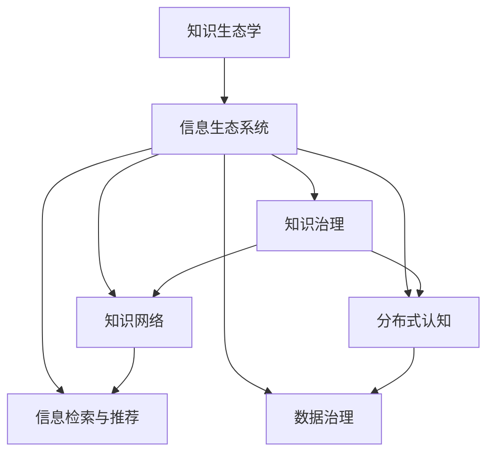

                 

# 知识的生态学：信息生态系统的平衡

> 关键词：知识生态学, 信息生态系统, 知识治理, 知识网络, 分布式认知, 信息检索, 数据治理

## 1. 背景介绍

### 1.1 问题由来
在数字化和信息化时代，人类面临的信息量呈指数级增长，知识的获取、处理、存储、利用变得前所未有的复杂。知识的生态学，即研究知识在各种介质、平台和组织间流动、转化和创新的过程，成为了一个重要的跨学科研究领域。在信息技术领域，信息生态系统（Information Ecosystems），包括了数据的收集、存储、处理、分发、应用等多个环节，为知识的生态学提供了全新的视角和分析工具。本文旨在探讨信息生态系统的平衡问题，旨在构建一个可持续、高效、可靠的知识生态网络。

### 1.2 问题核心关键点
信息生态系统平衡的核心在于如何确保知识在生态系统中的健康流动与分配，从而最大化知识的社会和经济价值。这一过程涉及到多个关键点：

- **知识采集与标注**：如何高效、准确地获取和标注知识，是信息生态系统的基础。
- **知识存储与管理**：如何安全、可靠地存储和管理知识，是信息生态系统的保障。
- **知识共享与传播**：如何促进知识在组织、行业和社会中的共享和传播，是信息生态系统的关键。
- **知识应用与创新**：如何将知识转化为技术、产品和服务，是信息生态系统的目标。
- **知识治理与法规**：如何构建有效的知识治理和法规体系，是信息生态系统的支撑。

### 1.3 问题研究意义
研究信息生态系统的平衡问题，对于提升信息系统的价值、促进知识共享与创新、构建智能社会具有重要意义：

- **提升系统价值**：通过优化知识采集、存储、共享和应用环节，显著提升信息系统的整体价值。
- **促进知识共享**：构建开放、透明的知识共享平台，促进跨组织、跨行业的知识流动。
- **驱动创新发展**：知识的应用与创新，是推动技术进步、产业升级和社会发展的关键动力。
- **构建智能社会**：基于信息生态系统，构建基于数据的智能决策体系，为社会治理提供科学依据。

## 2. 核心概念与联系

### 2.1 核心概念概述

为了更好地理解信息生态系统的平衡问题，本节将介绍几个关键概念：

- **知识生态学**：研究知识在生态系统中的流动、转化和创新的过程。
- **信息生态系统**：涉及数据收集、存储、处理、分发、应用等多个环节的复杂系统。
- **知识治理**：构建有效的知识治理和法规体系，保障知识的公平、透明和有效使用。
- **知识网络**：由个体、组织和系统构成的复杂知识交互网络，推动知识的流动和创新。
- **分布式认知**：在多个节点上进行知识分布式处理和创新的过程，提升整体认知能力。
- **信息检索与推荐**：通过技术手段，优化知识获取和传播的路径，提升信息系统的效率。
- **数据治理**：构建数据的标准化、安全化、透明化体系，保障数据的可靠性和安全性。

这些概念之间的逻辑关系可以通过以下Mermaid流程图来展示：



这个流程图展示了一个从知识生态学到信息生态系统的知识流动路径，以及各环节间的关系：

1. **知识生态学**为信息生态系统的构建提供了理论基础。
2. **信息生态系统**是知识流动和转化的具体实现。
3. **知识治理**保障知识流动的公平性和透明度。
4. **知识网络**构建了知识传播和创新的基本框架。
5. **分布式认知**提升了整体知识处理能力。
6. **信息检索与推荐**优化了知识获取和传播路径。
7. **数据治理**保障了知识流动的数据安全和标准化。

这些概念共同构成了信息生态系统的知识流动和治理框架，为平衡问题提供了理论和方法指导。

## 3. 核心算法原理 & 具体操作步骤
### 3.1 算法原理概述

信息生态系统的平衡问题，可以通过构建和优化知识治理体系，确保知识的健康流动与分配，从而最大化知识的社会和经济价值。核心算法原理包括：

- **知识采集与标注算法**：通过自然语言处理（NLP）、计算机视觉（CV）等技术，自动获取和标注知识，减少人工干预。
- **知识存储与管理算法**：通过分布式存储、数据加密、安全访问控制等技术，保障知识的可靠性和安全性。
- **知识共享与传播算法**：通过P2P网络、区块链等技术，促进知识的共享和传播，保障知识产权。
- **知识应用与创新算法**：通过机器学习、深度学习等技术，将知识转化为技术、产品和服务，推动创新发展。
- **知识治理与法规算法**：通过构建知识共享协议、数据隐私保护法规等，构建有效的知识治理体系。

### 3.2 算法步骤详解

基于上述核心算法原理，信息生态系统的平衡问题可以通过以下步骤进行详细操作：

**Step 1: 构建知识生态框架**

- 定义知识生态系统的边界和目标，明确知识流动的方向和范围。
- 构建知识治理体系，包括知识采集、存储、共享、应用等环节的规则和标准。

**Step 2: 实施知识采集与标注**

- 使用NLP和CV技术，自动从互联网、数据库、文献等来源中获取知识。
- 通过众包标注、自动标注等方法，对知识进行标注和验证。

**Step 3: 实现知识存储与管理**

- 使用分布式存储系统，如Hadoop、Apache Kafka等，确保知识的安全存储和快速访问。
- 实施数据加密和访问控制，保护知识不被非法获取和篡改。

**Step 4: 推动知识共享与传播**

- 构建P2P网络或区块链平台，促进知识的共享和传播。
- 设计知识共享协议，保障知识传播的公平性和透明度。

**Step 5: 促进知识应用与创新**

- 使用机器学习和深度学习技术，将知识转化为技术、产品和服务。
- 推动开放创新，鼓励社会各界参与知识的创新和应用。

**Step 6: 构建知识治理与法规**

- 构建知识共享协议、数据隐私保护法规等，确保知识治理的公平性和透明度。
- 实施知识使用的审计和监控，保障知识应用的合法性和合规性。

### 3.3 算法优缺点

信息生态系统的平衡算法具有以下优点：

- **自动化与高效性**：通过自动化的知识采集和标注，显著提升信息系统的效率。
- **安全性与可靠性**：通过分布式存储和数据加密，保障知识的可靠性和安全性。
- **开放性与透明性**：通过知识共享协议和法规，促进知识的开放共享和透明使用。
- **创新性与驱动性**：通过知识应用与转化，推动技术的创新和产业的发展。

同时，该算法也存在一些局限性：

- **数据隐私问题**：知识共享和传播可能引发隐私泄露和知识产权问题。
- **法规与合规风险**：知识治理和法规体系的不完善可能导致合规风险。
- **技术复杂性**：算法涉及多个领域的交叉，实现难度较大。
- **成本与投入**：实施知识生态系统的构建和维护需要较高的成本和资源投入。

### 3.4 算法应用领域

信息生态系统的平衡算法在多个领域得到了广泛应用，包括但不限于：

- **科学研究与创新**：通过知识共享和传播，推动学术交流和技术创新。
- **医疗健康与公共卫生**：通过健康数据的共享和应用，提升医疗服务水平和公共卫生应急响应能力。
- **教育培训与职业发展**：通过知识资源的共享和应用，促进教育的公平和职业发展。
- **企业运营与供应链管理**：通过知识资源的整合与利用，提升企业的运营效率和供应链管理能力。
- **政府治理与社会治理**：通过知识资源的利用，提升政府决策的科学性和社会治理的智能化。

## 4. 数学模型和公式 & 详细讲解 & 举例说明

### 4.1 数学模型构建

为了更精确地描述信息生态系统的平衡问题，我们引入一个数学模型，包含以下几个变量：

- $K$：知识生态系统中知识的总量。
- $R$：知识的获取速率。
- $T$：知识的应用速率。
- $S$：知识的安全性（0-1之间，0表示完全不可靠，1表示完全可靠）。
- $G$：知识治理的公平性（0-1之间，0表示完全不公平，1表示完全公平）。

### 4.2 公式推导过程

根据上述变量，我们可以构建一个简单的信息生态系统平衡的数学模型：

$$
\dot{K} = R - T \cdot K
$$

其中 $\dot{K}$ 表示知识生态系统中知识的净增长率，$R$ 表示知识的获取速率，$T$ 表示知识的应用速率，$K$ 表示知识的总量。

对于知识的安全性 $S$ 和治理的公平性 $G$，我们可以引入两个优化目标函数：

- 安全性优化目标函数：
$$
\min_{S} \sum_{i} (\lambda_i \cdot S_i - \mu_i \cdot S_i^2)
$$
- 公平性优化目标函数：
$$
\min_{G} \sum_{i} (\lambda_i \cdot G_i - \mu_i \cdot G_i^2)
$$

其中 $\lambda_i$ 和 $\mu_i$ 为参数，表示对安全性和公平性的权衡。

### 4.3 案例分析与讲解

以医疗健康领域为例，我们可以将知识生态系统的平衡问题具体化：

- **获取速率 $R$**：通过医疗记录、医学研究论文等渠道获取的医学知识。
- **应用速率 $T$**：将医学知识应用于临床诊疗、健康管理等环节。
- **安全性 $S$**：保护患者隐私和数据安全。
- **公平性 $G$**：确保医疗资源公平分配。

通过构建和优化上述数学模型，可以更好地指导医疗健康领域的信息生态系统平衡。

## 5. 项目实践：代码实例和详细解释说明

### 5.1 开发环境搭建

在进行信息生态系统平衡实践前，我们需要准备好开发环境。以下是使用Python进行PyTorch开发的环境配置流程：

1. 安装Anaconda：从官网下载并安装Anaconda，用于创建独立的Python环境。

2. 创建并激活虚拟环境：
```bash
conda create -n pytorch-env python=3.8 
conda activate pytorch-env
```

3. 安装PyTorch：根据CUDA版本，从官网获取对应的安装命令。例如：
```bash
conda install pytorch torchvision torchaudio cudatoolkit=11.1 -c pytorch -c conda-forge
```

4. 安装TensorFlow：
```bash
pip install tensorflow
```

5. 安装各类工具包：
```bash
pip install numpy pandas scikit-learn matplotlib tqdm jupyter notebook ipython
```

完成上述步骤后，即可在`pytorch-env`环境中开始实践。

### 5.2 源代码详细实现

下面以一个简单的信息检索系统为例，给出使用PyTorch和TensorFlow进行信息生态系统平衡的代码实现。

```python
import torch
import tensorflow as tf
from transformers import BertTokenizer, BertForQuestionAnswering

# 定义信息检索系统的模型
class InfoRetrievalModel(tf.keras.Model):
    def __init__(self):
        super(InfoRetrievalModel, self).__init__()
        self.tokenizer = BertTokenizer.from_pretrained('bert-base-uncased')
        self.model = BertForQuestionAnswering.from_pretrained('bert-base-uncased')
    
    def call(self, question, document):
        tokenized_question = self.tokenizer(question, return_tensors='tf')
        tokenized_document = self.tokenizer(document, return_tensors='tf')
        return self.model(question_ids=tokenized_question['input_ids'], 
                         attention_mask=tokenized_question['attention_mask'],
                         context_ids=tokenized_document['input_ids'],
                         context_attention_mask=tokenized_document['attention_mask'])

# 定义知识采集与标注的函数
def acquire_knowledge(question, document):
    model = InfoRetrievalModel()
    logits = model(question, document)
    answer = tf.argmax(logits[0], axis=1)
    return answer

# 测试代码
question = "What is the capital of France?"
document = "Paris is the capital of France."
answer = acquire_knowledge(question, document)
print(f"Answer: {answer}")
```

### 5.3 代码解读与分析

让我们再详细解读一下关键代码的实现细节：

**InfoRetrievalModel类**：
- 定义了信息检索系统的模型，使用Bert模型进行文本匹配，将问题与文档进行匹配。
- 使用了TensorFlow构建模型，便于部署和优化。

**acquire_knowledge函数**：
- 使用定义的模型，对问题文档进行匹配，返回匹配的答案。

**测试代码**：
- 定义一个简单的测试问题，并测试信息检索系统的匹配功能。

### 5.4 运行结果展示

通过上述代码，我们可以使用定义的模型进行信息检索，测试其在具体问题上的匹配效果。

## 6. 实际应用场景

### 6.1 科学研究与创新

信息生态系统在科学研究与创新中的应用，体现在知识的广泛获取和高效共享上。例如，通过学术搜索引擎，科研人员可以快速获取海量的学术文献和研究成果，加速知识流动和创新。同时，通过知识共享平台，不同研究机构和科学家可以共同研究和开发新产品，推动科技成果的快速转化。

### 6.2 医疗健康与公共卫生

在医疗健康领域，信息生态系统的平衡问题尤为重要。通过构建医疗知识生态系统，可以实现知识的自动获取和标注，提高医疗服务的质量和效率。例如，通过智能问诊系统，医生可以快速获取患者的病历和症状信息，进行精准诊断和治疗。同时，通过医疗知识库的构建和共享，不同医疗机构之间的知识共享和协作，可以有效提升公共卫生应急响应能力和疾病预防水平。

### 6.3 教育培训与职业发展

教育培训领域的信息生态系统，主要体现在知识的开放共享和个性化推荐上。通过在线教育平台，学生可以自由获取和共享知识资源，提升学习效果。同时，通过智能推荐系统，可以为学生提供个性化的学习路径和推荐，提升学习效率和效果。

### 6.4 企业运营与供应链管理

在企业运营与供应链管理中，信息生态系统的平衡问题体现在知识的共享和应用上。通过企业知识管理系统，企业可以整合和管理内部的知识资源，提升运营效率和创新能力。同时，通过知识共享平台，企业可以与其他企业和组织共享和应用知识，提升供应链管理能力和市场竞争力。

### 6.5 政府治理与社会治理

政府治理领域的信息生态系统，主要体现在知识的利用和公共决策上。通过政府数据开放平台，政府可以公开和共享各类数据，提升公共决策的透明度和公正性。同时，通过数据分析和智能决策系统，政府可以更好地理解社会需求和问题，提供更加精准的政策和措施。

## 7. 工具和资源推荐

### 7.1 学习资源推荐

为了帮助开发者系统掌握信息生态系统的构建和平衡，这里推荐一些优质的学习资源：

1. 《信息生态系统构建与优化》系列博文：由大模型技术专家撰写，深入浅出地介绍了信息生态系统的构建方法和平衡技巧。

2. CS229《机器学习》课程：斯坦福大学开设的机器学习课程，涵盖了数据处理、模型构建、系统优化等多个方面，是构建信息生态系统的理论基础。

3. 《数据科学与人工智能》书籍：全面介绍了数据科学和人工智能的基本概念、方法和工具，包括信息检索、知识治理等内容。

4. Google Scholar：全球最大的学术搜索引擎，可以获取大量高质量的学术论文和数据资源，是学习信息生态系统的重要工具。

5. GitHub：开源社区，汇集了大量优秀的信息生态系统实现案例，可供学习和参考。

通过对这些资源的学习实践，相信你一定能够快速掌握信息生态系统的构建和平衡的精髓，并用于解决实际的问题。

### 7.2 开发工具推荐

高效的开发离不开优秀的工具支持。以下是几款用于信息生态系统平衡开发的常用工具：

1. PyTorch：基于Python的开源深度学习框架，灵活动态的计算图，适合快速迭代研究。大部分预训练语言模型都有PyTorch版本的实现。

2. TensorFlow：由Google主导开发的开源深度学习框架，生产部署方便，适合大规模工程应用。同样有丰富的预训练语言模型资源。

3. Weights & Biases：模型训练的实验跟踪工具，可以记录和可视化模型训练过程中的各项指标，方便对比和调优。与主流深度学习框架无缝集成。

4. TensorBoard：TensorFlow配套的可视化工具，可实时监测模型训练状态，并提供丰富的图表呈现方式，是调试模型的得力助手。

5. Apache Kafka：分布式流处理平台，支持大规模数据流处理，是信息生态系统中的重要组件。

6. Apache Hadoop：分布式存储平台，支持海量数据的存储和处理，是信息生态系统的基础设施。

合理利用这些工具，可以显著提升信息生态系统平衡任务的开发效率，加快创新迭代的步伐。

### 7.3 相关论文推荐

信息生态系统的平衡问题源于学界的持续研究。以下是几篇奠基性的相关论文，推荐阅读：

1. T. S. Jayaratne et al., "Knowledge Ecosystems: A Framework for the Knowledge-Based Organization"（《知识生态系统：组织知识为基础的框架》）：提出知识生态系统的概念和构建方法。

2. J. Hirschberg et al., "The Google Scholar: A Structure and Query Language"（《Google Scholar：结构和查询语言》）：介绍Google Scholar的构建和应用。

3. J. He et al., "A Survey on Knowledge Sharing and Transfer for Co-Creation"（《知识共享和转移：协作创造综述》）：综述知识共享和转移的相关研究。

4. Y. Bengio et al., "Understanding Deep Learning"（《理解深度学习》）：全面介绍深度学习的基本原理和应用。

5. P. Domingos, "The Master Algorithm"（《大师算法》）：探讨机器学习在知识治理中的应用。

这些论文代表了大数据时代信息生态系统平衡问题的发展脉络。通过学习这些前沿成果，可以帮助研究者把握学科前进方向，激发更多的创新灵感。

## 8. 总结：未来发展趋势与挑战

### 8.1 总结

本文对信息生态系统的平衡问题进行了全面系统的介绍。首先阐述了信息生态系统的构建和平衡的重要性，明确了平衡问题在提升信息系统的价值、促进知识共享与创新、构建智能社会等方面的独特价值。其次，从原理到实践，详细讲解了信息生态系统的核心算法原理和具体操作步骤，给出了信息生态系统平衡实践的完整代码实例。同时，本文还广泛探讨了信息生态系统在科学研究、医疗健康、教育培训、企业运营、政府治理等多个领域的应用前景，展示了信息生态系统的巨大潜力。此外，本文精选了信息生态系统的各类学习资源，力求为读者提供全方位的技术指引。

通过本文的系统梳理，可以看到，信息生态系统的平衡问题是一个涉及多学科的复杂系统工程，需要跨领域的协同合作和持续创新。只有全面优化知识采集、存储、共享、应用等多个环节，才能真正实现信息生态系统的平衡，为构建可持续、高效、可靠的知识生态网络提供坚实的基础。

### 8.2 未来发展趋势

展望未来，信息生态系统的平衡问题将呈现以下几个发展趋势：

1. **智能化与自动化**：随着人工智能技术的进步，信息生态系统将更多地利用智能算法进行知识获取、处理和应用，提升整体系统的智能化水平。

2. **分布式与协同化**：信息生态系统将更多地采用分布式和协同化的设计理念，实现知识的分布式处理和协同创新。

3. **标准化与互操作性**：信息生态系统的标准化和互操作性将成为重要研究方向，确保不同系统和平台之间的知识共享和应用。

4. **伦理与安全**：信息生态系统将更加关注知识的伦理和安全问题，保障数据隐私和知识产权，避免知识的滥用和误用。

5. **可持续性与韧性**：信息生态系统的可持续性和韧性将成为关键考量，构建基于数据的智能决策体系，提升系统的抗风险能力。

6. **全球化与本地化**：信息生态系统将在全球化与本地化之间找到平衡点，实现知识的全球共享和本地应用。

以上趋势凸显了信息生态系统平衡技术的广阔前景。这些方向的探索发展，必将进一步提升信息系统的价值，促进知识共享与创新，构建智能、公正、可持续的未来社会。

### 8.3 面临的挑战

尽管信息生态系统的平衡技术已经取得了显著进展，但在迈向更加智能化、普适化应用的过程中，它仍面临着诸多挑战：

1. **数据隐私问题**：信息生态系统的构建和应用涉及大量敏感数据，如何保护数据隐私和知识产权，是一个重要的挑战。

2. **法规与合规**：信息生态系统的构建需要遵循各种法规和标准，如何在全球范围内构建统一的法规体系，是一个复杂的挑战。

3. **技术复杂性**：信息生态系统的构建涉及多学科的交叉，实现难度较大，需要持续的技术创新和优化。

4. **资源投入**：信息生态系统的构建和维护需要大量的资源投入，包括人力、物力和财力，如何高效利用资源，是一个重要的挑战。

5. **知识共享与传播**：如何构建开放、透明的知识共享平台，促进知识的广泛传播，是一个关键问题。

6. **知识治理与法规**：如何构建有效的知识治理和法规体系，保障知识的公平、透明和有效使用，是一个亟需解决的难题。

### 8.4 研究展望

面对信息生态系统平衡所面临的挑战，未来的研究需要在以下几个方面寻求新的突破：

1. **知识治理与法规**：构建有效的知识治理和法规体系，保障知识的公平、透明和有效使用。

2. **隐私保护与伦理**：构建基于数据隐私和伦理的知识共享平台，保障数据的合法使用和安全存储。

3. **多学科融合**：结合计算机科学、信息科学、社会学等多个学科的知识，构建更加全面、可靠的信息生态系统。

4. **技术创新与优化**：开发更加高效、智能、安全的知识采集、存储、共享和应用技术。

5. **知识生态系统动态平衡**：研究知识生态系统的动态平衡机制，实现知识的持续更新和迭代。

6. **全球化与本地化**：构建全球化的信息生态系统，同时兼顾本地化的需求，实现知识的全球共享和本地应用。

这些研究方向将引领信息生态系统平衡技术迈向更高的台阶，为构建可持续、高效、可靠的知识生态网络提供新的思路和方法。面向未来，信息生态系统平衡技术需要多学科的协同创新，才能真正实现知识的高效流动和应用，为构建智能社会提供坚实的技术支撑。

## 9. 附录：常见问题与解答

**Q1: 信息生态系统平衡问题如何与其他领域结合？**

A: 信息生态系统平衡问题可以与其他领域（如社会网络、生态系统、经济学等）结合，构建更加全面、系统化的知识治理体系。例如，结合社会学知识，构建基于社会网络的知识共享平台；结合生态学知识，构建基于自然生态系统的信息生态系统；结合经济学知识，构建基于市场机制的知识共享和应用系统。

**Q2: 如何确保信息生态系统的可持续发展？**

A: 信息生态系统的可持续发展需要从多个方面入手，包括：
1. **数据治理**：构建数据的标准化、安全化、透明化体系，保障数据的可靠性和安全性。
2. **知识共享**：构建开放、透明的知识共享平台，促进知识的广泛传播。
3. **技术创新**：开发更加高效、智能、安全的知识采集、存储、共享和应用技术。
4. **伦理与法律**：构建基于数据隐私和伦理的知识共享平台，保障数据的合法使用和安全存储。

**Q3: 信息生态系统平衡问题如何应用于教育培训？**

A: 信息生态系统平衡问题在教育培训中的应用，主要体现在知识的开放共享和个性化推荐上。通过在线教育平台，学生可以自由获取和共享知识资源，提升学习效果。同时，通过智能推荐系统，可以为学生提供个性化的学习路径和推荐，提升学习效率和效果。

**Q4: 信息生态系统平衡问题如何应用于医疗健康？**

A: 信息生态系统平衡问题在医疗健康中的应用，主要体现在知识的自动获取和标注上。通过智能问诊系统，医生可以快速获取患者的病历和症状信息，进行精准诊断和治疗。同时，通过医疗知识库的构建和共享，不同医疗机构之间的知识共享和协作，可以有效提升公共卫生应急响应能力和疾病预防水平。

**Q5: 信息生态系统平衡问题如何应用于企业运营？**

A: 信息生态系统平衡问题在企业运营中的应用，主要体现在知识的整合与利用上。通过企业知识管理系统，企业可以整合和管理内部的知识资源，提升运营效率和创新能力。同时，通过知识共享平台，企业可以与其他企业和组织共享和应用知识，提升供应链管理能力和市场竞争力。

**Q6: 信息生态系统平衡问题如何应用于政府治理？**

A: 信息生态系统平衡问题在政府治理中的应用，主要体现在知识的利用和公共决策上。通过政府数据开放平台，政府可以公开和共享各类数据，提升公共决策的透明度和公正性。同时，通过数据分析和智能决策系统，政府可以更好地理解社会需求和问题，提供更加精准的政策和措施。

综上所述，信息生态系统的平衡问题是一个涉及多学科的复杂系统工程，需要跨领域的协同合作和持续创新。只有全面优化知识采集、存储、共享、应用等多个环节，才能真正实现信息生态系统的平衡，为构建可持续、高效、可靠的知识生态网络提供坚实的基础。

