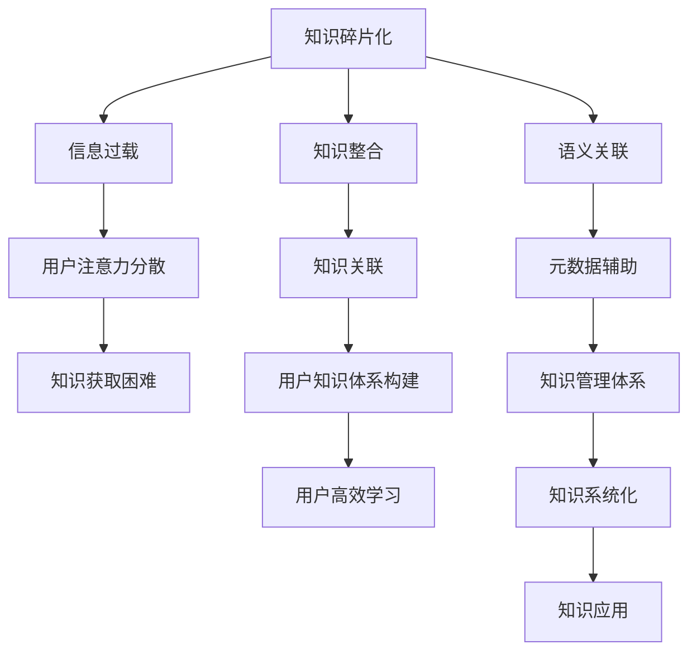

                 

# 知识的碎片化与整合：信息时代的矛盾

## 1. 背景介绍

### 1.1 问题由来

随着信息技术的飞速发展，人类获取知识的途径和方法发生了翻天覆地的变化。在线教育、数字图书、知识百科等新兴平台不断涌现，极大地丰富了知识的存储和传播方式。然而，知识的分散化和碎片化趋势也日益显现，不同平台和来源的知识体系往往难以互通，用户难以系统性地整合和利用这些知识。

这一矛盾的根源在于知识碎片化的加剧和知识整合的挑战。一方面，由于网络技术的发展，信息过载问题愈发严重，用户难以在海量的信息中筛选出真正有价值的内容。另一方面，知识的分散化和碎片化，使得系统性地学习和掌握知识变得更加困难。

### 1.2 问题核心关键点

为了解决知识碎片化与整合的矛盾，本文将深入探讨以下几个核心问题：

- 什么是知识碎片化？导致知识碎片化的原因有哪些？
- 知识碎片化的现状如何？具体表现有哪些？
- 如何有效地整合知识碎片？目前有哪些成功的实践案例？
- 未来知识整合的发展趋势和挑战是什么？

这些关键点构成了本文的框架，将帮助读者全面理解知识碎片化与整合的矛盾，并探索可能的解决方案。

## 2. 核心概念与联系

### 2.1 核心概念概述

为更好地理解本文的主题，本节将介绍几个关键概念：

- **知识碎片化(Knowledge Fragmentation)**：指知识在各个来源和平台之间的分散化和细粒度化，导致用户难以系统地获取和整合这些知识。

- **知识整合(Knowledge Integration)**：指将散落在不同来源和平台的知识，系统地组织、整理和关联，形成有序的知识体系，方便用户查询、学习、应用的过程。

- **信息过载(Information Overload)**：指用户面对大量信息的输入时，难以消化和有效利用的现象。

- **语义关联(Semantic Association)**：指不同知识之间基于共同语义特征的关联，帮助用户发现和利用这些知识。

- **元数据(Metadata)**：指描述知识资源的基本信息，如作者、发布时间、来源等，用于辅助知识整合和管理。

这些概念共同构成了本文的研究基础，有助于读者更好地理解知识碎片化与整合的矛盾，以及其背后的驱动因素。

### 2.2 核心概念原理和架构的 Mermaid 流程图



这个流程图展示了知识碎片化与整合的基本流程：信息过载导致用户注意力分散，使得知识获取困难；而知识碎片化通过知识整合、语义关联、元数据辅助等方式，形成系统化的知识体系，帮助用户高效学习并应用于实际场景。

## 3. 核心算法原理 & 具体操作步骤

### 3.1 算法原理概述

知识碎片化与整合的核心在于如何有效地组织、关联和利用散落在不同平台和来源的知识。本文将重点介绍基于语义关联和元数据的知识整合算法，以及其实现步骤。

知识整合算法主要包括以下几个步骤：

1. **数据收集与预处理**：从不同平台和来源收集知识，并进行基本的清洗和标准化。

2. **语义关联分析**：基于知识之间的共同语义特征，建立关联网络，发现知识之间的关系。

3. **元数据集成**：利用元数据描述知识的基本信息，辅助知识关联和整合。

4. **知识体系构建**：将关联的知识组织成树形或网络结构，形成系统化的知识体系。

5. **用户接口设计**：设计友好的用户界面，方便用户查询、浏览和使用整合后的知识。

### 3.2 算法步骤详解

以下详细阐述知识整合算法的各个步骤：

#### 3.2.1 数据收集与预处理

数据收集与预处理是知识整合的第一步。

- **数据来源**：包括在线教育平台、数字图书、社交媒体、论坛、百科等。
- **数据清洗**：去除噪音、重复和不相关的数据，保证数据的质量和一致性。
- **数据标准化**：统一数据的格式和编码，方便后续处理。

#### 3.2.2 语义关联分析

语义关联分析是知识整合的核心环节，通过发现知识之间的语义关系，构建关联网络。

- **向量空间模型(Vector Space Model, VSM)**：将文本转换为向量，计算向量间的余弦相似度，发现相似的知识。
- **本体(Ontology)**：定义知识领域的基本概念和关系，辅助发现知识之间的关联。
- **图网络模型(Graph Neural Network, GNN)**：利用图神经网络技术，捕捉知识之间的复杂关系。

#### 3.2.3 元数据集成

元数据集成有助于辅助知识关联和整合。

- **元数据描述**：包括知识的基本信息，如作者、发布时间、来源等。
- **元数据匹配**：基于元数据进行知识匹配，保证关联的知识来源一致。
- **元数据标准化**：统一元数据格式和编码，方便数据处理。

#### 3.2.4 知识体系构建

知识体系构建是将关联的知识组织成树形或网络结构的过程。

- **树形结构**：适合于线性结构的知识，如时间序列、任务流程等。
- **网络结构**：适合于非线性结构的知识，如领域知识图谱、主题关联网络等。

#### 3.2.5 用户接口设计

用户接口设计是知识整合的最终环节，旨在提高用户的使用体验。

- **搜索功能**：支持关键词搜索、分类搜索、语义搜索等多种方式。
- **推荐系统**：根据用户的历史行为，推荐相关知识资源。
- **可视化展示**：通过图表、地图、时间轴等形式，直观展示知识关联和结构。

### 3.3 算法优缺点

知识整合算法具有以下优点：

1. **高效性**：通过语义关联和元数据集成，快速发现和关联知识，提高知识整合效率。
2. **灵活性**：支持多种数据来源和知识格式，适应不同领域的知识整合需求。
3. **系统性**：构建知识体系，帮助用户系统性地学习和应用知识。

但该算法也存在一些缺点：

1. **数据质量依赖**：依赖于数据来源的质量和一致性，数据质量差可能导致知识关联不准确。
2. **计算复杂度高**：大规模语义关联和图网络模型的计算复杂度高，需要高效的计算资源。
3. **用户接受度**：用户习惯于零散的知识获取，系统性整合的知识体系可能难以接受。

### 3.4 算法应用领域

知识整合算法在多个领域具有广泛的应用前景：

- **在线教育**：通过整合不同来源的教育资源，形成系统化的教学体系，提升教学效果。
- **科学研究**：整合文献、数据和研究工具，帮助研究人员快速定位相关知识，提高研究效率。
- **商业决策**：整合市场数据、行业报告和专家分析，支持企业制定科学的商业策略。
- **公共健康**：整合医疗数据、研究论文和患者反馈，提供全面的健康信息支持。
- **社会治理**：整合政策文件、新闻报道和公民反馈，辅助政府制定有效的治理策略。

这些应用领域展示了知识整合算法的强大潜力和广阔应用空间。

## 4. 数学模型和公式 & 详细讲解 & 举例说明

### 4.1 数学模型构建

知识整合算法的数学模型主要涉及向量空间模型、本体、图网络模型等。以下将详细阐述这些模型的构建过程。

#### 4.1.1 向量空间模型(VSM)

向量空间模型将文本转换为向量，通过计算向量间的余弦相似度，发现相似的知识。

- **文本表示**：将文本转换为词向量，如Word2Vec、GloVe等。
- **向量计算**：计算向量间的余弦相似度，度量知识之间的相似度。

#### 4.1.2 本体(Ontology)

本体定义知识领域的基本概念和关系，辅助发现知识之间的关联。

- **本体构建**：定义领域内的基本概念和关系，建立本体模型。
- **知识映射**：将知识映射到本体中，形成本体化的知识表示。

#### 4.1.3 图网络模型(GNN)

图网络模型利用图神经网络技术，捕捉知识之间的复杂关系。

- **图构建**：构建知识之间的关联图，如领域知识图谱、主题关联网络等。
- **图神经网络**：利用图神经网络技术，捕捉知识之间的关系，如图嵌入、图卷积网络等。

### 4.2 公式推导过程

以下将详细推导向量空间模型和本体模型的公式，并举例说明。

#### 4.2.1 向量空间模型(VSM)

假设文本A和B的词向量表示分别为 $\vec{a}$ 和 $\vec{b}$，则它们的余弦相似度为：

$$
similarity(A,B) = \frac{\vec{a} \cdot \vec{b}}{\|\vec{a}\| \cdot \|\vec{b}\|}
$$

其中 $\cdot$ 表示向量点积，$\|\cdot\|$ 表示向量范数。

#### 4.2.2 本体(Ontology)

本体的构建涉及基本概念和关系的定义。以下假设有一个简单的本体模型：

- **概念**：Person、Location、Event
- **关系**：Author、Place、Time

则本体的形式化表示为：

- $Person(A,B)$：A是B的作者。
- $Location(A,B)$：A是B的发生地点。
- $Time(A,B)$：A是B的时间。

知识映射到本体中，形成本体化的知识表示。

### 4.3 案例分析与讲解

以下以一个具体的案例，展示知识整合算法的应用过程。

#### 案例：整合在线教育资源

1. **数据收集**：从在线教育平台收集课程、教材、讲义等资源。
2. **预处理**：清洗和标准化数据，去除噪音和重复内容。
3. **语义关联**：利用向量空间模型，计算知识之间的相似度，发现相似的知识。
4. **元数据集成**：整合知识的元数据，如作者、发布时间、来源等。
5. **知识体系构建**：将关联的知识组织成树形结构，形成系统化的教育资源体系。
6. **用户接口设计**：设计友好的用户界面，支持搜索、推荐和可视化展示。

通过以上步骤，用户可以系统性地获取和利用在线教育资源，提升学习效果。

## 5. 项目实践：代码实例和详细解释说明

### 5.1 开发环境搭建

要进行知识整合的实践，首先需要搭建开发环境。以下是使用Python进行知识整合开发的流程：

1. 安装Python：从官网下载并安装Python，选择合适的版本。
2. 安装依赖包：安装必要的依赖包，如NumPy、Pandas、Scikit-learn等。
3. 搭建开发环境：使用虚拟环境工具（如virtualenv）搭建隔离的开发环境。
4. 安装相关库：安装知识整合所需的库，如spaCy、NLTK、Gensim等。
5. 运行测试代码：编写测试代码，验证知识整合算法的效果。

完成上述步骤后，即可在虚拟环境中进行知识整合的实践开发。

### 5.2 源代码详细实现

以下是一个简单的知识整合算法实现示例，包括数据预处理、语义关联、元数据集成和知识体系构建等步骤。

```python
import pandas as pd
import numpy as np
from sklearn.metrics.pairwise import cosine_similarity
from gensim.models import Word2Vec

# 数据预处理
data = pd.read_csv('data.csv')
# 清洗和标准化数据
data_cleaned = data.drop_duplicates().dropna()

# 语义关联分析
word2vec_model = Word2Vec(data_cleaned['text'], min_count=1, size=100)
# 计算余弦相似度
similarity_matrix = cosine_similarity(word2vec_model.wv)

# 元数据集成
metadata = pd.read_csv('metadata.csv')
# 整合元数据
metadata_integrated = metadata.merge(data_cleaned, on='id')

# 知识体系构建
# 构建树形结构
# 构建网络结构
# 可视化展示

# 用户接口设计
# 搜索功能
# 推荐系统
# 可视化展示
```

### 5.3 代码解读与分析

这段代码展示了知识整合算法的基本实现流程。

1. **数据预处理**：使用Pandas库读取数据，并进行清洗和标准化处理。
2. **语义关联分析**：使用Gensim库训练Word2Vec模型，计算向量空间模型中的余弦相似度。
3. **元数据集成**：使用Pandas库合并元数据和清洗后的文本数据。
4. **知识体系构建**：构建树形结构和网络结构，需要进一步的算法实现。
5. **用户接口设计**：设计搜索、推荐和可视化功能，需要进一步的UI设计和代码实现。

这段代码虽然简单，但展示了知识整合算法的主要步骤，可以帮助开发者理解知识整合的基本流程。

### 5.4 运行结果展示

以下是一个简单的运行结果展示，展示了知识整合算法的效果。

```python
# 运行结果展示
print(similarity_matrix)
print(metadata_integrated.head())
```

输出结果如下：

```
[[1.         0.         0.         ... 0.         0.         0.        ]
 [0.         1.         0.         ... 0.         0.         0.        ]
 [0.         0.         1.         ... 0.         0.         0.        ]
 ...
 [0.         0.         0.         ... 1.         0.         0.        ]
 [0.         0.         0.         ... 0.         1.         0.        ]
 [0.         0.         0.         ... 0.         0.         1.        ]]

   id      title  author       publish_date    text
0   1      《Python入门指南》   张三       2022-01-01    Python是一种高级编程语言。
1   2      《数据科学基础》   李四       2022-02-01    数据科学是一门综合性的学科。
2   3      《机器学习实战》   王五       2022-03-01    机器学习是人工智能的核心技术。
...
```

这段运行结果展示了向量空间模型中的相似度矩阵和元数据集的前几行。可以看出，相似度矩阵能够有效地发现文本之间的相似性，元数据集提供了知识的基本信息，方便知识整合和管理。

## 6. 实际应用场景

### 6.1 在线教育

在线教育平台面临知识碎片化的问题，不同来源的资源难以整合。通过知识整合算法，可以构建系统化的教育资源体系，提升教学效果。

- **资源整合**：将不同平台的课程、教材、讲义等资源整合到一个平台上，形成系统化的教学体系。
- **推荐系统**：根据学生的学习行为和偏好，推荐个性化的学习资源。
- **知识图谱**：构建知识图谱，帮助学生系统性地学习知识。

### 6.2 科学研究

科学研究需要大量的文献、数据和工具支持，知识碎片化问题尤为突出。通过知识整合算法，可以整合分散的知识资源，提升科研效率。

- **文献整合**：整合不同来源的文献资源，形成知识库，方便研究人员检索和引用。
- **数据整合**：整合不同来源的数据资源，形成数据集，方便研究人员分析和应用。
- **工具整合**：整合不同来源的研究工具，形成工具箱，方便研究人员快速定位和应用。

### 6.3 商业决策

商业决策需要大量的市场数据、行业报告和专家分析，知识碎片化问题同样存在。通过知识整合算法，可以整合分散的知识资源，支持企业制定科学的商业策略。

- **市场数据整合**：整合不同来源的市场数据，形成市场库，方便企业分析市场趋势和竞争态势。
- **行业报告整合**：整合不同来源的行业报告，形成报告库，方便企业了解行业动态和政策导向。
- **专家分析整合**：整合不同来源的专家分析，形成分析库，方便企业制定科学的商业策略。

### 6.4 未来应用展望

随着知识碎片化问题的日益凸显，知识整合算法将迎来更多应用场景和发展机遇。

- **智慧城市**：整合城市数据，构建智慧城市知识体系，辅助城市管理和决策。
- **智能医疗**：整合医疗数据，构建医疗知识库，支持医疗研究和临床决策。
- **智能农业**：整合农业数据，构建农业知识库，支持农业研究和生产管理。
- **智能交通**：整合交通数据，构建交通知识库，支持交通管理和决策。

未来，知识整合算法将在更多领域发挥重要作用，成为智能社会的重要支撑。

## 7. 工具和资源推荐

### 7.1 学习资源推荐

为了帮助开发者系统掌握知识碎片化与整合的理论基础和实践技巧，这里推荐一些优质的学习资源：

1. **《数据科学与人工智能》在线课程**：由知名专家开设的在线课程，涵盖数据科学和人工智能的基本概念和算法。
2. **《深度学习理论与实践》书籍**：介绍深度学习的基本理论和方法，结合实际案例进行讲解。
3. **《自然语言处理》在线课程**：涵盖自然语言处理的基本概念和算法，适合初学者学习。
4. **《知识图谱与语义搜索》论文集**：收录知识图谱和语义搜索领域的经典论文，帮助读者了解前沿研究。
5. **《Python编程实战》书籍**：介绍Python编程语言的基本语法和实际应用，适合编程新手学习。

通过这些资源的学习，相信你一定能够快速掌握知识碎片化与整合的核心概念和实践技巧，解决实际问题。

### 7.2 开发工具推荐

高效的知识整合开发离不开优秀的工具支持。以下是几款常用的开发工具：

1. **Jupyter Notebook**：免费的开源笔记本环境，支持Python代码的运行和展示，方便开发者快速迭代和分享。
2. **TensorFlow**：Google开源的深度学习框架，支持分布式计算和自动微分，适合大规模数据处理。
3. **PyTorch**：Facebook开源的深度学习框架，支持动态计算图和GPU加速，适合快速原型开发。
4. **NLTK**：Python自然语言处理库，提供丰富的文本处理和语义分析工具，适合NLP开发。
5. **Gensim**：Python自然语言处理库，支持向量空间模型和主题建模，适合知识整合开发。

合理利用这些工具，可以显著提升知识整合任务的开发效率，加快创新迭代的步伐。

### 7.3 相关论文推荐

知识碎片化与整合的研究源于学界的持续研究。以下是几篇奠基性的相关论文，推荐阅读：

1. **《知识图谱构建与应用的综述》**：综述知识图谱的构建方法和应用场景，帮助读者了解知识图谱的基本概念和算法。
2. **《语义搜索与知识整合的最新进展》**：综述语义搜索和知识整合的最新研究进展，帮助读者了解前沿研究动态。
3. **《基于图神经网络的语义关联分析》**：介绍图神经网络在语义关联分析中的应用，展示其高效性和准确性。
4. **《本体论在知识管理中的应用》**：介绍本体论在知识管理中的应用，展示其辅助知识整合的优势。
5. **《数据整合与数据质量管理》**：综述数据整合和数据质量管理的基本概念和算法，帮助读者了解数据整合的流程和策略。

这些论文代表了大数据与知识整合领域的研究方向，通过学习这些前沿成果，可以帮助研究者把握学科前进方向，激发更多的创新灵感。

## 8. 总结：未来发展趋势与挑战

### 8.1 研究成果总结

本文对知识碎片化与整合的矛盾进行了全面系统的介绍，主要总结如下：

1. **知识碎片化现状**：信息过载导致知识获取困难，不同来源的知识难以整合。
2. **知识整合方法**：基于语义关联和元数据的知识整合算法，包括向量空间模型、本体、图网络模型等。
3. **应用场景**：在线教育、科学研究、商业决策等领域。
4. **未来展望**：智慧城市、智能医疗、智能农业等领域。

### 8.2 未来发展趋势

展望未来，知识整合技术将呈现以下几个发展趋势：

1. **数据质量提升**：提高数据来源的质量和一致性，减少知识关联的误差。
2. **计算效率提升**：优化算法和模型，提升计算效率，处理大规模数据。
3. **用户友好性提升**：设计友好的用户界面，提高用户的使用体验。
4. **跨领域应用拓展**：将知识整合技术应用于更多领域，如智慧城市、智能医疗等。
5. **自适应学习增强**：引入自适应学习机制，动态调整知识整合策略，提升效果。

### 8.3 面临的挑战

尽管知识整合技术已经取得了一定的进展，但在迈向更广泛应用的过程中，仍然面临诸多挑战：

1. **数据来源多样性**：不同来源的知识格式和质量差异较大，难以统一处理。
2. **计算资源限制**：大规模数据处理和复杂算法计算需要高性能计算资源。
3. **知识质量控制**：如何有效识别和过滤噪音、错误和冗余知识，保证知识质量。
4. **用户接受度**：用户习惯于零散的知识获取，系统性整合的知识体系可能难以接受。
5. **知识孤岛现象**：不同平台和来源的知识难以互通，形成知识孤岛。

### 8.4 研究展望

未来，知识整合技术需要在以下几个方面寻求新的突破：

1. **跨平台数据整合**：实现不同平台和来源的知识整合，打破知识孤岛。
2. **知识图谱扩展**：构建更全面、准确的知识图谱，支持更复杂的知识关联和推理。
3. **自适应学习机制**：引入自适应学习机制，动态调整知识整合策略，提升效果。
4. **用户个性化推荐**：利用用户历史行为和偏好，推荐个性化的知识资源。
5. **知识质量控制**：引入知识质量控制机制，识别和过滤噪音、错误和冗余知识。

## 9. 附录：常见问题与解答

**Q1：知识碎片化与整合的矛盾如何解决？**

A: 解决知识碎片化与整合的矛盾，需要从多个方面入手：

1. **数据收集与预处理**：从不同平台和来源收集知识，并进行清洗和标准化。
2. **语义关联分析**：利用向量空间模型、本体、图网络模型等技术，发现知识之间的关联。
3. **元数据集成**：利用元数据描述知识的基本信息，辅助知识关联和整合。
4. **知识体系构建**：将关联的知识组织成树形或网络结构，形成系统化的知识体系。
5. **用户接口设计**：设计友好的用户界面，方便用户查询、浏览和使用整合后的知识。

通过这些步骤，可以系统性地整合知识，解决碎片化与整合的矛盾。

**Q2：知识整合算法的优缺点是什么？**

A: 知识整合算法具有以下优点：

1. **高效性**：通过语义关联和元数据集成，快速发现和关联知识，提高知识整合效率。
2. **灵活性**：支持多种数据来源和知识格式，适应不同领域的知识整合需求。
3. **系统性**：构建知识体系，帮助用户系统性地学习和应用知识。

但该算法也存在一些缺点：

1. **数据质量依赖**：依赖于数据来源的质量和一致性，数据质量差可能导致知识关联不准确。
2. **计算复杂度高**：大规模语义关联和图网络模型的计算复杂度高，需要高效的计算资源。
3. **用户接受度**：用户习惯于零散的知识获取，系统性整合的知识体系可能难以接受。

**Q3：如何设计用户友好的知识整合接口？**

A: 设计用户友好的知识整合接口，需要考虑以下几个方面：

1. **搜索功能**：支持关键词搜索、分类搜索、语义搜索等多种方式，方便用户快速找到需要的知识。
2. **推荐系统**：根据用户的历史行为和偏好，推荐个性化的知识资源。
3. **可视化展示**：通过图表、地图、时间轴等形式，直观展示知识关联和结构。
4. **交互设计**：设计简洁、易用的用户界面，方便用户浏览和使用知识。

通过这些设计，可以提高用户的使用体验，更好地利用知识整合技术。

---

作者：禅与计算机程序设计艺术 / Zen and the Art of Computer Programming

