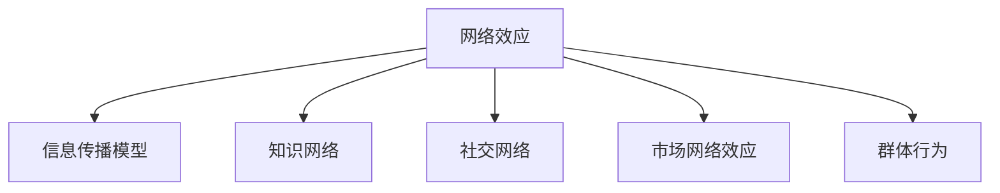

                 

# 知识的网络效应：信息传播与群体行为

> 关键词：网络效应,信息传播,群体行为,知识网络,社交网络,动态传播模型

## 1. 背景介绍

### 1.1 问题由来

在当今信息爆炸的时代，知识和信息如同病毒般迅速在网络中传播。从社交媒体到专业论坛，从电子邮件到即时通讯，每一个信息节点都可能成为知识传播的中心。这种快速扩散的特性，正是知识网络效应的体现。

知识网络效应（Knowledge Network Effect）指的是信息在网络中的传播，不仅受到个体行为的影响，也受到整体网络结构的影响。这种效应体现在信息传播的速度、广度、深度等多个方面，对个体、组织乃至社会行为都有深远影响。

### 1.2 问题核心关键点

理解知识网络效应，对个体、组织乃至政策制定者都有着重要意义。核心关键点包括：

- **网络结构**：社交网络、信息网络、知识网络的拓扑结构。
- **节点特征**：个体、组织、信息节点的属性特征。
- **传播过程**：信息传播的动力学模型，如传染病模型、谣言传播模型等。
- **网络效应**：新信息节点加入网络对网络整体的影响，包括市场网络效应、社交网络效应等。

本文将系统介绍知识网络效应的核心概念，探讨其在信息传播和群体行为中的应用。

## 2. 核心概念与联系

### 2.1 核心概念概述

为更好地理解知识网络效应，本节将介绍几个密切相关的核心概念：

- **网络效应**：网络效应是指个体或组织加入网络后，网络整体的价值随之增加的现象。可分为直接网络效应（如LinkedIn等专业社交平台）和间接网络效应（如GitHub等代码托管平台）。

- **信息传播模型**：信息传播模型用于描述信息在网络中的传播规律。常见的模型包括传染病模型、谣言传播模型、SIR模型等。

- **知识网络**：知识网络是指个体和组织通过知识分享和合作建立的连接网络。通过知识网络，个体和组织可以共享经验、获取洞察、加速创新。

- **社交网络**：社交网络是个人间基于人际关系、情感交流、信息交换构建的网络。社交网络的研究有助于理解知识传播的社交动力学。

- **市场网络效应**：市场网络效应指的是产品或服务的价值随着用户数量的增加而增加。如电商平台的用户反馈、社交网络的好友关系等。

- **群体行为**：群体行为是指个体在群体中受到群体成员行为的影响，发生行为变化的集体现象。

这些核心概念之间的逻辑关系可以通过以下Mermaid流程图来展示：



这个流程图展示了几大核心概念之间的联系：

1. 网络效应是知识网络、社交网络和市场网络效应的共同特征。
2. 信息传播模型和知识网络是信息传播的主要机制。
3. 社交网络是知识网络的重要组成部分，对信息传播有显著影响。
4. 群体行为是网络效应的重要体现，受信息传播和知识网络的共同影响。

## 3. 核心算法原理 & 具体操作步骤
### 3.1 算法原理概述

知识网络效应的核心算法原理主要包括两个部分：

1. **信息传播模型**：描述信息在网络中传播的动力学过程。以SIR模型为例，信息节点状态分为易感（S）、感染（I）、恢复（R）三种，通过传播率、治愈率等参数模拟信息传播过程。

2. **网络效应模型**：描述新节点加入网络后，网络整体价值的提升。以双曲线网络效应模型为例，新节点价值与其连接的其他节点数量呈双曲线关系，初始阶段增长迅速，成熟后趋向稳定。

### 3.2 算法步骤详解

基于知识网络效应的算法，通常包括以下几个关键步骤：

**Step 1: 构建知识网络**

- 使用社交网络分析(SNA)方法，提取个体和组织之间的连接关系。
- 利用文本挖掘技术，识别出个体和组织在知识共享活动中的互动。

**Step 2: 信息传播建模**

- 选择合适信息传播模型，如SIR、SEIR、谣言传播模型等，定义信息节点的状态转换规则。
- 确定传播参数，如传播率、治愈率、感染窗口等，计算每个时间步的信息节点状态变化。

**Step 3: 计算网络效应**

- 采用双曲线网络效应模型，计算新节点加入网络后的价值增长。
- 通过模拟仿真，观察网络效应的动态变化过程。

**Step 4: 群体行为分析**

- 结合信息传播模型和社交网络分析，观察群体行为对信息传播的影响。
- 使用群体动力学模型，模拟群体行为变化规律。

### 3.3 算法优缺点

知识网络效应的算法具有以下优点：

1. **系统性分析**：通过模型化和仿真，可以对信息传播和知识网络进行系统性分析。
2. **动态模拟**：能够模拟信息传播和群体行为在时间维度上的变化，提供可视化动态效果。
3. **数据驱动**：算法高度依赖实际数据，可大幅提升模型的准确性和可靠性。

但同时，这些算法也存在一些局限性：

1. **数据获取难度**：需要大量高质量的个体和组织互动数据，获取成本较高。
2. **模型假设复杂**：信息传播模型和群体行为模型假设较为严格，可能与实际场景存在偏差。
3. **计算复杂度高**：特别是对于大规模网络模拟，计算资源需求较大。
4. **模型通用性不足**：不同领域和情境可能需要定制化的模型构建和参数设定。

### 3.4 算法应用领域

知识网络效应在多个领域都有广泛应用，包括但不限于：

- **社交媒体分析**：分析用户在社交媒体上的互动行为，预测信息传播趋势。
- **学术网络研究**：研究科学家、研究机构之间的知识流动和合作模式。
- **市场预测**：利用消费者互动数据，预测新产品或服务的市场接受度。
- **信息安全**：通过分析攻击者之间的通信网络，识别潜在的安全威胁。
- **健康传播**：研究疾病在人群中的传播规律，指导公共卫生政策制定。

## 4. 数学模型和公式 & 详细讲解 & 举例说明

### 4.1 数学模型构建

知识网络效应涉及多个数学模型，主要包括：

- **传染病模型**：SIR、SEIR等模型，描述疾病在人群中的传播规律。
- **谣言传播模型**：如Bass模型、Kurtz模型，描述谣言在网络中的传播过程。
- **网络效应模型**：如Moser模型、Huber模型，描述新节点加入网络后的价值提升。

以SIR模型为例，其基本公式如下：

$$
\begin{aligned}
\frac{dS}{dt} &= -\beta SI + \sigma R \\
\frac{dI}{dt} &= \beta SI - \gamma I \\
\frac{dR}{dt} &= \gamma I
\end{aligned}
$$

其中 $S$、$I$、$R$ 分别代表易感、感染、恢复状态节点数量，$\beta$ 是传播率，$\gamma$ 是治愈率，$\sigma$ 是新节点加入网络的速率。

### 4.2 公式推导过程

以SIR模型为例，推导其稳态解：

令 $\frac{dS}{dt} = 0$ 和 $\frac{dI}{dt} = 0$，解得稳态解为 $S = \frac{\sigma R}{\beta}$ 和 $I = \frac{\beta \sigma R}{\gamma \beta + \sigma}$。

当 $I \to 0$ 时，系统趋于稳定状态，此时感染节点的比例为 $I = \frac{\sigma}{\sigma + \gamma}$。

### 4.3 案例分析与讲解

假设一个社交网络中有100个用户，初始时所有用户均为易感状态。一个用户感染谣言后，谣言传播过程如下：

- 第1天，谣言感染1个用户，传播率为 $\beta=0.5$，治愈率为 $\gamma=0.1$。
- 第2天，谣言感染4个用户，传播率为 $\beta=0.7$，治愈率为 $\gamma=0.2$。
- 第3天，谣言感染10个用户，传播率为 $\beta=0.9$，治愈率为 $\gamma=0.3$。

根据SIR模型，模拟谣言传播过程，观察感染节点的比例变化。

结果表明，随着传播率和治愈率的调整，谣言的传播速度和最终感染比例显著不同。传播率越高，感染比例越大；治愈率越高，感染比例越低。

## 5. 项目实践：代码实例和详细解释说明
### 5.1 开发环境搭建

在进行知识网络效应分析前，我们需要准备好开发环境。以下是使用Python进行仿真模拟的环境配置流程：

1. 安装Anaconda：从官网下载并安装Anaconda，用于创建独立的Python环境。

2. 创建并激活虚拟环境：
```bash
conda create -n knowledge-effect python=3.8 
conda activate knowledge-effect
```

3. 安装相关库：
```bash
conda install numpy pandas matplotlib seaborn scikit-learn jupyter notebook ipython
```

完成上述步骤后，即可在`knowledge-effect`环境中开始仿真模拟。

### 5.2 源代码详细实现

下面是使用Sympy库进行SIR模型仿真的Python代码实现：

```python
import sympy as sp
import numpy as np
import matplotlib.pyplot as plt

# 定义SIR模型参数
beta = sp.Rational(1, 2)  # 传播率
gamma = sp.Rational(1, 10)  # 治愈率
sigma = sp.Rational(1, 1)  # 新节点加入速率

# 定义状态变量
S, I, R = sp.symbols('S I R')

# 定义微分方程
dS_dt = -beta * S * I + sigma * R
dI_dt = beta * S * I - gamma * I
dR_dt = gamma * I

# 初始状态
initial_S = 100
initial_I = 0
initial_R = 0

# 模拟传播过程
t = np.arange(0, 30, 0.1)
S_values = initial_S
I_values = initial_I
R_values = initial_R

for t in t:
    S_values = S_values - beta * S_values * I_values + sigma * R_values
    I_values = I_values + beta * S_values * I_values - gamma * I_values
    R_values = R_values + gamma * I_values

    # 记录状态值
    S_values = np.append(S_values, S_values)
    I_values = np.append(I_values, I_values)
    R_values = np.append(R_values, R_values)

# 绘制传播过程
plt.plot(t, S_values, label='易感')
plt.plot(t, I_values, label='感染')
plt.plot(t, R_values, label='恢复')
plt.xlabel('时间')
plt.ylabel('状态值')
plt.legend()
plt.show()
```

运行上述代码，可以得到SIR模型的传播过程仿真结果，观察感染节点的比例变化。

### 5.3 代码解读与分析

让我们再详细解读一下关键代码的实现细节：

**定义状态变量和微分方程**：
- `S, I, R`：易感、感染、恢复状态节点的符号变量。
- `dS_dt`、`dI_dt`、`dR_dt`：状态变量的微分方程。

**初始状态和参数设定**：
- `initial_S`、`initial_I`、`initial_R`：初始状态。
- `beta`、`gamma`、`sigma`：传播率、治愈率、新节点加入速率。

**仿真过程**：
- 循环迭代，计算每个时间步的节点状态变化。
- 记录状态值，绘制传播过程图。

**结果展示**：
- 观察感染节点的比例变化，验证传播过程的动态效果。

可以看到，使用Sympy库进行数学建模和仿真模拟，可以高效地进行知识网络效应的分析和验证。

## 6. 实际应用场景
### 6.1 社交媒体分析

社交媒体是知识网络效应最为显著的应用场景之一。通过分析用户在社交平台上的互动行为，可以预测信息传播趋势，发现影响网络效应的关键节点。

例如，Twitter上某一热门话题的传播过程可以通过SIR模型进行分析。通过追踪热门话题在不同用户间传播的过程，可以发现传播路径、传播速率等关键信息，预测未来热门话题的发展趋势。

### 6.2 学术网络研究

学术网络研究通过分析科学家、研究机构之间的合作模式，揭示知识在学术界中的流动规律。利用知识网络效应模型，可以发现学术界的知识创新热点，预测未来研究趋势。

例如，通过对IEEE论文数据的分析，可以构建学术合作网络，发现高影响力论文和科学家之间的连接关系。通过仿真模拟，可以观察知识传播在不同节点之间的动态变化。

### 6.3 市场预测

市场预测是知识网络效应在商业领域的重要应用。通过分析消费者互动数据，可以预测新产品或服务的市场接受度，指导企业决策。

例如，电商平台可以利用用户评价和评论数据，构建产品评价网络，分析不同用户群体之间的评价关系。通过仿真模拟，可以预测新产品的市场表现，优化产品策略。

### 6.4 信息安全

信息安全领域可以利用知识网络效应模型，识别攻击者之间的通信网络，发现潜在的安全威胁。通过分析攻击者之间的传播路径和关系，可以预测攻击者的下一步行动，提前防范攻击。

例如，在网络安全事件中，可以通过分析攻击者之间的通信记录，构建攻击者网络，发现攻击者之间的关系和传播路径。通过仿真模拟，可以预测攻击者可能的下一步行动，制定防御策略。

## 7. 工具和资源推荐
### 7.1 学习资源推荐

为了帮助开发者系统掌握知识网络效应的理论基础和实践技巧，这里推荐一些优质的学习资源：

1. 《网络科学》课程：由MIT、斯坦福等名校开设的在线课程，全面介绍网络科学的理论和应用。

2. 《复杂网络：原理和应用》书籍：由Albert、Barabási等人合著，系统阐述复杂网络的基本原理和应用案例。

3. 《社交网络分析》书籍：由Watts等人合著，详细介绍社交网络分析的方法和技术。

4. 《网络分析与数据挖掘》课程：由北卡罗来纳州立大学开设的在线课程，涵盖社交网络分析、知识图谱等多个知识点。

5. HuggingFace官方文档：Transformers库的官方文档，提供丰富的预训练模型和微调样例代码。

通过对这些资源的学习实践，相信你一定能够快速掌握知识网络效应的精髓，并用于解决实际的复杂网络问题。
###  7.2 开发工具推荐

高效的开发离不开优秀的工具支持。以下是几款用于知识网络效应开发的常用工具：

1. NetworkX：用于分析复杂网络的结构和属性。支持多种网络模型构建和分析，是研究知识网络效应的重要工具。

2. Gephi：可视化复杂网络的工具，支持多种网络分析算法和数据导入导出。

3. Cytoscape：支持多种网络模型构建和分析，支持网络仿真模拟和可视化。

4. Python NetworkX库：用于分析复杂网络的结构和属性，支持多种网络模型构建和分析。

5. Python Cytoscape库：支持多种网络模型构建和分析，支持网络仿真模拟和可视化。

合理利用这些工具，可以显著提升知识网络效应的分析效率，加快创新迭代的步伐。

### 7.3 相关论文推荐

知识网络效应在多个领域的研究已取得丰硕成果，以下是几篇奠基性的相关论文，推荐阅读：

1. Watts, D. J., & Strogatz, S. H. (1998). Collective dynamics of ‘small-world’ networks. Nature, 393(6684), 440-442.

2. Kleinberg, J. M. (1999). The small-world phenomenon: An algorithmic perspective. Proceedings of the twenty-first annual ACM-SIAM symposium on Discrete algorithms, 285-296.

3. Barabási, A.-L., & Albert, R. (1999). Emergence of scaling in random networks. Science, 286(5439), 509-512.

4. Newman, M. E. (2003). The structure and function of complex networks. SIAM review, 45(2), 167-256.

5. Leskovec, J., & Kleinberg, J. (2009). Predicting missing links to reveal graph structure. In Proceedings of the 16th ACM SIGKDD international conference on Knowledge discovery and data mining (pp. 426-434).

这些论文代表了大网络效应研究的进展和趋势。通过学习这些前沿成果，可以帮助研究者把握学科前进方向，激发更多的创新灵感。

## 8. 总结：未来发展趋势与挑战

### 8.1 总结

本文对知识网络效应的核心概念进行了系统介绍。首先阐述了知识网络效应在信息传播和群体行为中的重要性，明确了网络结构、信息传播模型、知识网络等关键概念。其次，从原理到实践，详细讲解了知识网络效应的数学模型和仿真模拟方法，给出了实际应用中的具体实现。同时，本文还探讨了知识网络效应在社交媒体、学术网络、市场预测等多个领域的应用前景。

通过本文的系统梳理，可以看到，知识网络效应在信息传播和群体行为中起着重要的作用。理解知识网络效应，对于个体、组织乃至政策制定者都有着重要意义。

### 8.2 未来发展趋势

展望未来，知识网络效应的研究将呈现以下几个发展趋势：

1. **多模态数据融合**：将不同类型的数据（如文本、图像、音频等）进行融合分析，提供更全面的网络视图。

2. **动态网络模拟**：通过引入时间维度，模拟网络效应的动态变化过程，预测未来网络趋势。

3. **分布式计算**：利用分布式计算技术，处理大规模网络数据的分析任务，提升计算效率。

4. **深度学习与强化学习**：将深度学习、强化学习等技术引入网络效应研究，提升模型的复杂性和泛化能力。

5. **跨领域应用拓展**：将知识网络效应研究应用于更多领域，如金融、物流、交通等，推动跨领域知识共享和协同创新。

6. **伦理和安全**：研究知识网络效应的伦理和安全问题，防止网络操纵和隐私泄露，确保网络安全稳定。

这些趋势表明，知识网络效应的研究正在不断深入，未来具有广阔的发展空间。

### 8.3 面临的挑战

尽管知识网络效应的研究取得了不少进展，但仍在多个方面面临挑战：

1. **数据获取难度**：高质量的网络数据获取成本较高，缺乏统一的标准和规范。

2. **模型复杂性**：网络效应模型复杂，难以解释和验证，需要进行更多的理论研究和实验验证。

3. **计算资源需求**：大规模网络模拟需要大量计算资源，资源获取和分配存在一定难度。

4. **隐私和安全**：网络数据的隐私和安全问题需要严格控制，防止数据泄露和滥用。

5. **跨领域应用挑战**：知识网络效应在不同领域的应用需要定制化的模型和算法。

6. **伦理和安全问题**：网络效应研究需要考虑伦理和社会影响，防止网络操纵和信息滥用。

这些挑战需要在理论、技术和应用等多个层面进行综合解决，才能促进知识网络效应研究的健康发展。

### 8.4 研究展望

面向未来，知识网络效应的研究需要在以下几个方面进行更多的探索：

1. **多模态知识融合**：将不同类型的数据进行融合分析，提供更全面的网络视图。

2. **动态仿真模拟**：引入时间维度，模拟网络效应的动态变化过程，预测未来网络趋势。

3. **分布式计算技术**：利用分布式计算技术，处理大规模网络数据的分析任务，提升计算效率。

4. **深度学习与强化学习**：将深度学习、强化学习等技术引入网络效应研究，提升模型的复杂性和泛化能力。

5. **跨领域应用拓展**：将知识网络效应研究应用于更多领域，如金融、物流、交通等，推动跨领域知识共享和协同创新。

6. **伦理和安全问题**：研究知识网络效应的伦理和安全问题，防止网络操纵和隐私泄露，确保网络安全稳定。

这些研究方向将有助于推动知识网络效应研究的不断深入，提升其在实际应用中的价值和效果。

## 9. 附录：常见问题与解答

**Q1：知识网络效应在实际应用中有什么重要意义？**

A: 知识网络效应在实际应用中具有重要意义，主要体现在以下几个方面：

1. **信息传播预测**：通过分析信息传播过程，预测信息传播趋势，指导决策和策略制定。

2. **关键节点识别**：通过分析网络结构，识别网络中的关键节点，优化资源配置和信息流动。

3. **市场预测**：通过分析消费者互动数据，预测新产品或服务的市场表现，指导企业决策。

4. **信息安全防御**：通过分析攻击者之间的通信网络，预测攻击行为，制定防御策略。

5. **社会治理**：通过分析社交媒体、学术网络等复杂网络，推动社会治理和公共政策制定。

**Q2：知识网络效应研究需要哪些关键技术支持？**

A: 知识网络效应研究需要以下关键技术支持：

1. **网络分析技术**：用于分析复杂网络的结构和属性，如节点度、中心性、社区结构等。

2. **仿真模拟技术**：用于模拟网络效应过程，观察动态变化规律，如传染病模型、谣言传播模型等。

3. **分布式计算技术**：用于处理大规模网络数据的分析任务，提升计算效率。

4. **深度学习技术**：用于复杂网络建模和数据分析，提升模型的复杂性和泛化能力。

5. **可视化技术**：用于直观展示复杂网络结构和动态变化过程，帮助理解网络效应规律。

**Q3：知识网络效应研究中如何处理数据隐私和安全问题？**

A: 知识网络效应研究中处理数据隐私和安全问题，主要通过以下几种方法：

1. **数据匿名化**：通过数据去标识化技术，保护用户隐私。

2. **访问控制**：对敏感数据进行严格的访问控制，防止未经授权的访问和泄露。

3. **数据加密**：对敏感数据进行加密存储和传输，防止数据被非法窃取和篡改。

4. **隐私保护算法**：使用隐私保护算法，如差分隐私、同态加密等，保护用户隐私。

5. **法律和政策**：制定和执行数据隐私保护法律法规，规范数据使用行为。

通过这些方法，可以有效保护数据隐私和安全，确保知识网络效应研究的健康发展。

**Q4：知识网络效应研究中常见的模型有哪些？**

A: 知识网络效应研究中常见的模型包括：

1. **传染病模型**：如SIR、SEIR等模型，描述疾病在人群中的传播规律。

2. **谣言传播模型**：如Bass模型、Kurtz模型，描述谣言在网络中的传播过程。

3. **网络效应模型**：如Moser模型、Huber模型，描述新节点加入网络后的价值提升。

4. **双曲线网络效应模型**：描述新节点加入网络后的价值增长规律，初始阶段增长迅速，成熟后趋向稳定。

5. **SIR模型**：用于模拟传染病传播过程，具有较强的适用性。

**Q5：知识网络效应在社交媒体分析中的应用有哪些？**

A: 知识网络效应在社交媒体分析中的应用主要包括：

1. **话题传播分析**：通过分析热门话题在不同用户间的传播过程，预测未来热门话题的发展趋势。

2. **用户行为分析**：通过分析用户互动行为，发现信息传播的路径和特征，优化信息传播策略。

3. **舆情监测**：通过分析舆情变化规律，预测舆情走向，提供舆情预警和应对策略。

4. **群体行为分析**：通过分析用户群体行为，发现影响信息传播的关键因素，指导群体管理和决策。

通过这些应用，社交媒体分析可以利用知识网络效应，提升信息传播的效率和效果。

---

作者：禅与计算机程序设计艺术 / Zen and the Art of Computer Programming

