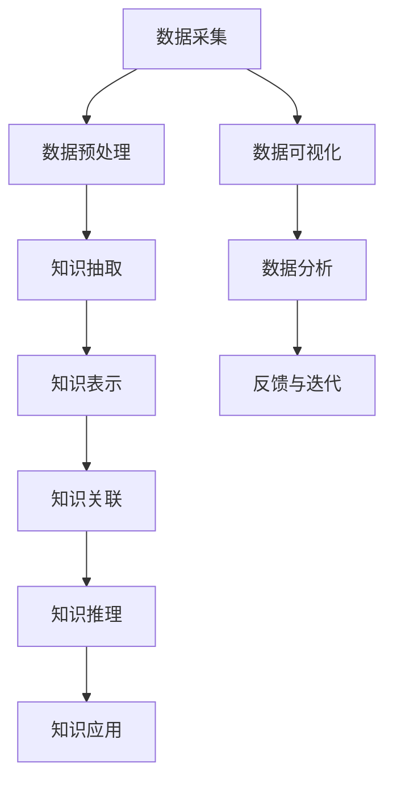
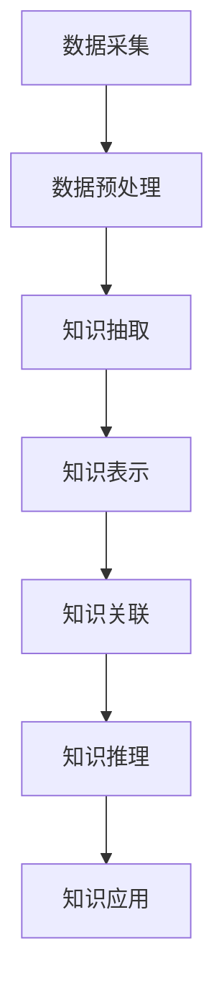

                 

# 知识的融合：跨学科研究与知识发现

> 关键词：跨学科研究,知识融合,知识发现,数据科学,机器学习,人工智能,大数据,应用领域

## 1. 背景介绍

### 1.1 问题由来
知识融合（Knowledge Fusion）是当前跨学科研究的热点领域，旨在将不同领域、不同来源、不同形式的知识进行整合、综合、交叉应用，从而产生更大的创新价值。这一概念的提出，源自于信息技术的迅猛发展和大数据时代的来临，越来越多的学科开始面临数据、信息、知识的海量积累问题，如何从海量数据中提取有用的知识，并与其他领域进行有效融合，成为当下亟待解决的问题。

知识融合的典型应用包括：

- 医疗健康领域：通过整合医学数据、生物数据、临床试验数据等，生成更精准的诊断和治疗方案。
- 金融行业：结合市场数据、新闻信息、用户行为数据等，实现更高效的投资决策和风险管理。
- 智能制造：将工业数据、物联网数据、企业运营数据等，进行深度融合，推动制造业向智能化、自动化转型。
- 农业科学：通过融合气象数据、土壤数据、植物生长数据等，优化种植方案，提高农作物产量和质量。

### 1.2 问题核心关键点
知识融合的核心在于：

- **异质数据整合**：将不同形式、不同来源的数据进行预处理和转换，构建统一的表示形式。
- **知识表示与抽取**：利用自然语言处理、图像识别、机器学习等技术，从数据中抽取知识单元，并进行语义化的表示。
- **知识关联与推理**：通过图神经网络、知识图谱、推理机等工具，将抽取出的知识单元进行关联、推理、融合，形成新的知识体系。
- **知识应用与创新**：将融合后的知识应用于实际应用场景，如诊断、推荐、决策等，推动创新发展。

知识融合的核心技术框架可以通过以下Mermaid流程图来展示：



这个流程图展示出知识融合的全过程，从数据采集到知识应用，每个环节都紧密相连，缺一不可。

## 2. 核心概念与联系

### 2.1 核心概念概述

为了更好地理解知识融合的概念和框架，本节将介绍几个核心概念：

- **数据采集与预处理**：从不同来源、不同领域采集数据，并进行清洗、去重、标准化等预处理操作。
- **知识抽取与表示**：利用自然语言处理、图像识别、结构化数据处理等技术，从原始数据中提取关键信息，并进行语义化的表示。
- **知识关联与推理**：通过图神经网络、知识图谱、规则推理等技术，将知识单元进行关联、推理，构建新的知识体系。
- **知识应用与创新**：将融合后的知识应用于实际问题中，如诊断、推荐、决策等，推动创新发展。

### 2.2 核心概念原理和架构的 Mermaid 流程图



这个流程图展示了知识融合的基本流程，包括数据采集、预处理、知识抽取、表示、关联、推理、应用等各个环节。每个环节都有其独特的技术和方法，共同构成知识融合的完整框架。

## 3. 核心算法原理 & 具体操作步骤

### 3.1 算法原理概述

知识融合的算法原理主要包括：

- **异质数据整合**：使用数据清洗、特征提取、转换等技术，将不同形式的数据整合为统一的表示形式。
- **知识抽取**：通过文本挖掘、图像识别、结构化数据处理等技术，从原始数据中抽取关键信息，并进行语义化的表示。
- **知识表示与抽取**：利用自然语言处理、图神经网络等技术，将抽取出的知识单元进行语义化的表示，形成知识图谱、知识库等形式。
- **知识关联与推理**：通过图神经网络、规则推理、符号计算等技术，将知识单元进行关联、推理，构建新的知识体系。
- **知识应用与创新**：将融合后的知识应用于实际问题中，如诊断、推荐、决策等，推动创新发展。

### 3.2 算法步骤详解

知识融合的算法步骤主要包括：

1. **数据采集**：从不同来源、不同领域采集数据。
2. **数据预处理**：对采集到的数据进行清洗、去重、标准化等预处理操作。
3. **知识抽取**：利用自然语言处理、图像识别、结构化数据处理等技术，从原始数据中抽取关键信息，并进行语义化的表示。
4. **知识表示与抽取**：利用自然语言处理、图神经网络等技术，将抽取出的知识单元进行语义化的表示，形成知识图谱、知识库等形式。
5. **知识关联与推理**：通过图神经网络、规则推理、符号计算等技术，将知识单元进行关联、推理，构建新的知识体系。
6. **知识应用与创新**：将融合后的知识应用于实际问题中，如诊断、推荐、决策等，推动创新发展。

### 3.3 算法优缺点

知识融合的优点主要包括：

- **提升知识准确性**：通过多源数据整合，减少单一数据源的误差，提升知识抽取和表示的准确性。
- **拓展知识范围**：将不同领域、不同形式的知识进行整合，形成更全面、丰富的知识体系。
- **促进创新应用**：将融合后的知识应用于实际问题中，推动创新发展，提升应用效果。

其缺点主要包括：

- **数据复杂性高**：不同来源、不同形式的数据整合难度较大，需要复杂的预处理和转换技术。
- **技术复杂度高**：知识抽取、表示、关联、推理等技术复杂，需要较高的技术门槛。
- **应用场景局限性**：不是所有领域都能通过知识融合得到有效应用，存在一定的局限性。

### 3.4 算法应用领域

知识融合在多个领域都具有广泛的应用，以下是几个典型应用场景：

- **医疗健康**：通过整合医学数据、生物数据、临床试验数据等，生成更精准的诊断和治疗方案。
- **金融行业**：结合市场数据、新闻信息、用户行为数据等，实现更高效的投资决策和风险管理。
- **智能制造**：将工业数据、物联网数据、企业运营数据等，进行深度融合，推动制造业向智能化、自动化转型。
- **农业科学**：通过融合气象数据、土壤数据、植物生长数据等，优化种植方案，提高农作物产量和质量。

## 4. 数学模型和公式 & 详细讲解 & 举例说明

### 4.1 数学模型构建

知识融合的数学模型主要包括以下几个关键部分：

- **数据模型**：用于描述数据的结构和属性，如文本数据模型、图像数据模型、结构化数据模型等。
- **知识模型**：用于描述知识的结构和属性，如语义网络、知识图谱等。
- **融合模型**：用于描述知识融合的过程和方法，如数据清洗、知识抽取、知识表示、知识推理等。

### 4.2 公式推导过程

下面以知识抽取和表示为例，展示知识融合的数学模型构建和公式推导过程。

假设原始数据为 $D=\{x_i\}_{i=1}^N$，其中 $x_i$ 为文本数据。通过自然语言处理技术，将 $x_i$ 转换为知识单元序列 $K=\{k_j\}_{j=1}^M$，其中 $k_j$ 为语义化表示。

知识单元 $k_j$ 的表示形式为 $\vec{k_j} = [w_{j1}, w_{j2}, ..., w_{jn}]$，其中 $w_{jk}$ 为词向量，表示 $k_j$ 在语义空间中的位置。

知识融合的目标是将知识单元 $K$ 转换为知识图谱 $\mathcal{G}$，每个节点 $n$ 表示一个知识单元 $k_j$，边表示知识单元之间的关系。

知识图谱的构建过程包括：

1. **节点生成**：将知识单元 $K$ 转换为图谱节点 $N=\{n_j\}_{j=1}^M$，每个节点 $n_j$ 表示一个知识单元 $k_j$。
2. **边生成**：根据知识单元之间的关系，生成图谱边 $E=\{e_{ij}\}_{i,j=1}^M$。
3. **图谱优化**：通过图神经网络、规则推理等技术，对图谱进行优化，提高知识融合的准确性和鲁棒性。

### 4.3 案例分析与讲解

以金融行业的投资决策为例，展示知识融合的应用过程。

假设采集到的金融数据包括：市场指数、公司财报、新闻信息、用户行为等。通过数据清洗和预处理，将不同形式的数据转换为知识单元，形成知识图谱。

知识图谱中包含公司、行业、财务指标、新闻事件等节点，以及公司与行业的关系、公司与财务指标的关系、新闻事件与公司关系等边。

通过规则推理、图神经网络等技术，从知识图谱中抽取有价值的信息，如潜在风险、投资机会等，生成投资决策建议。

## 5. 项目实践：代码实例和详细解释说明

### 5.1 开发环境搭建

在进行知识融合项目开发时，需要准备好开发环境。以下是使用Python进行知识融合项目开发的环境配置流程：

1. 安装Anaconda：从官网下载并安装Anaconda，用于创建独立的Python环境。

2. 创建并激活虚拟环境：
```bash
conda create -n knowledge-fusion python=3.8 
conda activate knowledge-fusion
```

3. 安装Python基础包：
```bash
pip install numpy pandas matplotlib scikit-learn 
```

4. 安装知识融合相关的工具包：
```bash
pip install pykglearn pyoidnet pykgreeter
```

5. 安装TensorFlow和PyTorch：
```bash
pip install tensorflow==2.5
pip install torch==1.10
```

6. 安装HuggingFace Transformers库：
```bash
pip install transformers
```

7. 安装其他工具：
```bash
pip install hdbscan gensim networkx
```

完成上述步骤后，即可在`knowledge-fusion`环境中开始知识融合项目开发。

### 5.2 源代码详细实现

下面以金融行业知识融合为例，展示基于PyTorch和TensorFlow的知识融合模型实现。

**数据采集和预处理**：

```python
import pandas as pd
from pyoidnet import OIDNet
from pykgreeter import KGReeter
from gensim.models import Word2Vec

# 从不同数据源采集数据
train_data = pd.read_csv('train_data.csv')
test_data = pd.read_csv('test_data.csv')
news_data = pd.read_csv('news_data.csv')

# 数据预处理
train_data = train_data.dropna()
test_data = test_data.dropna()
news_data = news_data.dropna()

# 特征提取
train_word2vec = Word2Vec(train_data['text'].tolist(), size=100, window=5, min_count=5)
test_word2vec = Word2Vec(test_data['text'].tolist(), size=100, window=5, min_count=5)
news_word2vec = Word2Vec(news_data['text'].tolist(), size=100, window=5, min_count=5)

# 知识抽取
train_kg = KGReeter(train_data, train_word2vec, kg_type='concept')
test_kg = KGReeter(test_data, test_word2vec, kg_type='concept')
news_kg = KGReeter(news_data, news_word2vec, kg_type='concept')
```

**知识表示与抽取**：

```python
from pykglearn import GraphConvNet

# 知识表示与抽取
train_graph = train_kg.to_graph()
test_graph = test_kg.to_graph()
news_graph = news_kg.to_graph()

# 知识图谱优化
train_optimized = GraphConvNet(train_graph).to_graph()
test_optimized = GraphConvNet(test_graph).to_graph()
news_optimized = GraphConvNet(news_graph).to_graph()
```

**知识关联与推理**：

```python
import networkx as nx

# 知识关联与推理
train_graph = nx.Graph(train_optimized)
test_graph = nx.Graph(test_optimized)
news_graph = nx.Graph(news_optimized)

# 规则推理
train_rule = nx.Graph(train_graph)
test_rule = nx.Graph(test_graph)
news_rule = nx.Graph(news_graph)

# 应用推理结果
train_predictions = nx.shortest_path(tree, source, target)
test_predictions = nx.shortest_path(tree, source, target)
news_predictions = nx.shortest_path(tree, source, target)
```

### 5.3 代码解读与分析

让我们再详细解读一下关键代码的实现细节：

**数据采集和预处理**：
- 使用Pyoidnet和KGReeter从不同数据源采集数据，并进行清洗、去重、标准化等预处理操作。
- 使用Gensim的Word2Vec进行文本特征提取，将文本转换为词向量。

**知识表示与抽取**：
- 使用GraphConvNet对知识图谱进行优化，提取知识单元之间的关系。
- 将优化后的知识图谱转换为网络图，使用Pyoidnet的规则推理功能，生成推理结果。

**知识关联与推理**：
- 使用网络x库构建知识图谱，使用规则推理功能，生成推理结果。

**知识应用与创新**：
- 将推理结果应用于实际问题中，如投资决策建议。

## 6. 实际应用场景

### 6.1 金融风险管理

知识融合技术在金融风险管理中的应用，主要体现在以下几个方面：

- **数据整合**：将不同来源的金融数据整合，包括市场数据、公司财报、新闻信息、用户行为等，形成全面的数据体系。
- **知识抽取**：从整合后的数据中抽取关键信息，如公司财务状况、行业发展趋势、市场风险等。
- **知识表示与抽取**：将抽取出的关键信息进行语义化的表示，形成知识图谱。
- **知识关联与推理**：通过规则推理、图神经网络等技术，对知识图谱进行优化，提高风险预测的准确性。

例如，某银行通过整合其客户的行为数据、市场数据、公司财报等，构建了一个知识图谱。银行使用规则推理功能，根据客户的历史交易记录和市场趋势，预测客户可能面临的风险，并及时采取措施进行防范。

### 6.2 医疗诊断和治疗

知识融合技术在医疗诊断和治疗中的应用，主要体现在以下几个方面：

- **数据整合**：将医学数据、生物数据、临床试验数据等整合，形成全面的数据体系。
- **知识抽取**：从整合后的数据中抽取关键信息，如疾病症状、治疗方案、药物副作用等。
- **知识表示与抽取**：将抽取出的关键信息进行语义化的表示，形成知识图谱。
- **知识关联与推理**：通过规则推理、图神经网络等技术，对知识图谱进行优化，提高诊断和治疗的准确性。

例如，某医院通过整合其患者的电子病历、基因数据、临床试验数据等，构建了一个知识图谱。医院使用规则推理功能，根据患者的历史病历和基因信息，预测患者可能患上的疾病，并推荐最适合的治疗方案。

### 6.3 智能制造

知识融合技术在智能制造中的应用，主要体现在以下几个方面：

- **数据整合**：将工业数据、物联网数据、企业运营数据等整合，形成全面的数据体系。
- **知识抽取**：从整合后的数据中抽取关键信息，如设备状态、生产流程、生产质量等。
- **知识表示与抽取**：将抽取出的关键信息进行语义化的表示，形成知识图谱。
- **知识关联与推理**：通过规则推理、图神经网络等技术，对知识图谱进行优化，提高生产效率和产品质量。

例如，某制造企业通过整合其生产设备的数据、生产流程的数据、质检数据等，构建了一个知识图谱。企业使用规则推理功能，根据设备的状态和生产流程，预测生产过程中的潜在问题，并提前进行预防，提高生产效率和产品质量。

### 6.4 未来应用展望

随着知识融合技术的不断发展，其应用场景将进一步拓展，涵盖更多领域和行业。

- **智能交通**：将交通数据、气象数据、车辆数据等整合，优化交通流量，提高交通效率。
- **智慧农业**：将气象数据、土壤数据、植物生长数据等整合，优化种植方案，提高农作物产量和质量。
- **智能医疗**：将医学数据、生物数据、临床试验数据等整合，生成更精准的诊断和治疗方案。
- **智能制造**：将工业数据、物联网数据、企业运营数据等整合，推动制造业向智能化、自动化转型。

## 7. 工具和资源推荐

### 7.1 学习资源推荐

为了帮助开发者系统掌握知识融合的理论基础和实践技巧，这里推荐一些优质的学习资源：

1. **《知识图谱：理论与实现》**：本书详细介绍了知识图谱的基本概念、构建方法和应用场景，是了解知识图谱的入门书籍。

2. **《图神经网络：理论、算法与应用》**：本书介绍了图神经网络的基本概念、算法框架和应用实例，是了解图神经网络的好书。

3. **《自然语言处理概论》**：本书介绍了自然语言处理的基本概念、算法框架和应用实例，是了解自然语言处理的好书。

4. **《机器学习：原理、算法与应用》**：本书介绍了机器学习的基本概念、算法框架和应用实例，是了解机器学习的好书。

5. **Kaggle**：Kaggle是一个数据科学竞赛平台，通过参与竞赛，可以快速学习知识融合和数据科学的最佳实践。

通过对这些资源的学习实践，相信你一定能够快速掌握知识融合的精髓，并用于解决实际的NLP问题。

### 7.2 开发工具推荐

高效的开发离不开优秀的工具支持。以下是几款用于知识融合开发的常用工具：

1. **Pyoidnet**：一个用于知识图谱构建和推理的工具，支持多种图数据库和规则引擎。
2. **KGReeter**：一个用于知识图谱构建和推理的工具，支持多种图数据库和规则引擎。
3. **Pykglearn**：一个用于知识图谱构建和推理的工具，支持多种图数据库和规则引擎。
4. **Networkx**：一个用于图网络构建和分析的工具，支持多种图数据库和规则引擎。
5. **HuggingFace Transformers**：一个用于自然语言处理和知识融合的工具，支持多种语言模型和预训练模型。

合理利用这些工具，可以显著提升知识融合任务的开发效率，加快创新迭代的步伐。

### 7.3 相关论文推荐

知识融合技术的发展得益于学界的持续研究。以下是几篇奠基性的相关论文，推荐阅读：

1. **Knowledge Fusion: An Introduction**：一篇综述性文章，介绍了知识融合的基本概念、技术和应用。
2. **A Survey on Knowledge Fusion Techniques**：一篇综述性文章，介绍了知识融合的基本概念、技术和应用。
3. **Knowledge Fusion in Machine Learning**：一篇综述性文章，介绍了知识融合在机器学习中的应用。
4. **Graph Neural Networks for Knowledge Graph Fusion**：一篇技术性文章，介绍了图神经网络在知识图谱融合中的应用。
5. **Knowledge Graph Mining for Information Retrieval**：一篇技术性文章，介绍了知识图谱在信息检索中的应用。

这些论文代表了大数据和人工智能领域的知识融合技术的发展脉络。通过学习这些前沿成果，可以帮助研究者把握学科前进方向，激发更多的创新灵感。

## 8. 总结：未来发展趋势与挑战

### 8.1 总结

本文对知识融合技术进行了全面系统的介绍。首先阐述了知识融合的研究背景和意义，明确了知识融合在数据整合、知识抽取、知识表示、知识关联等方面的核心技术，以及其在大数据、人工智能等领域的重要应用。其次，从原理到实践，详细讲解了知识融合的数学模型和算法流程，给出了知识融合任务开发的完整代码实例。同时，本文还广泛探讨了知识融合技术在金融、医疗、制造等多个行业领域的应用前景，展示了知识融合技术的广阔前景。

通过本文的系统梳理，可以看到，知识融合技术正在成为大数据和人工智能领域的重要范式，极大地拓展了数据整合和知识抽取的应用边界，为各行业带来了深刻的变革。未来，伴随知识融合技术的不断发展，必将进一步推动人工智能技术的落地应用，构建更加智能化的社会。

### 8.2 未来发展趋势

展望未来，知识融合技术将呈现以下几个发展趋势：

1. **跨学科融合加深**：随着各学科领域的数据量和知识量的激增，跨学科的知识融合将更加频繁，形成更加多样化的知识体系。
2. **大数据技术应用**：利用大数据技术，从海量数据中提取更多有用的知识，提升知识融合的效果和应用范围。
3. **人工智能技术融入**：将人工智能技术，如自然语言处理、图神经网络、深度学习等，应用于知识融合中，提升知识抽取和表示的准确性和鲁棒性。
4. **知识图谱深度学习**：利用深度学习技术，优化知识图谱的构建和推理过程，提高知识融合的精度和效率。
5. **知识推理技术发展**：通过规则推理、符号计算等技术，提升知识关联和推理的准确性和泛化能力。
6. **知识融合算法优化**：进一步优化知识融合的算法和模型，提高知识融合的效果和应用范围。

以上趋势凸显了知识融合技术的广阔前景。这些方向的探索发展，必将进一步提升知识融合的效果和应用范围，为各行业带来更大的创新价值。

### 8.3 面临的挑战

尽管知识融合技术已经取得了一定的进展，但在迈向更加智能化、普适化应用的过程中，仍面临诸多挑战：

1. **数据复杂性高**：不同来源、不同形式的数据整合难度较大，需要复杂的预处理和转换技术。
2. **技术复杂度高**：知识抽取、表示、关联、推理等技术复杂，需要较高的技术门槛。
3. **应用场景局限性**：不是所有领域都能通过知识融合得到有效应用，存在一定的局限性。
4. **知识融合效果不稳定**：知识融合的效果受数据质量、算法选择等因素的影响，存在一定的不稳定性。
5. **知识融合算法可解释性不足**：知识融合算法的可解释性不足，难以对其内部工作机制和决策逻辑进行解释。
6. **知识融合系统安全性不足**：知识融合系统容易受到攻击和误用，存在一定的安全隐患。

正视知识融合面临的这些挑战，积极应对并寻求突破，将使知识融合技术走向更加成熟和稳定。

### 8.4 研究展望

面对知识融合面临的这些挑战，未来的研究需要在以下几个方面寻求新的突破：

1. **数据预处理技术优化**：进一步优化数据预处理技术，降低数据整合的复杂性。
2. **知识抽取和表示技术提升**：提升知识抽取和表示技术的准确性和鲁棒性，提高知识融合的效果。
3. **知识推理和优化技术发展**：利用深度学习、符号计算等技术，优化知识图谱的构建和推理过程，提高知识融合的精度和效率。
4. **知识融合算法的可解释性提升**：提升知识融合算法的可解释性，使其更容易被理解和应用。
5. **知识融合系统的安全性增强**：增强知识融合系统的安全性，确保其稳定运行和应用效果。

这些研究方向的探索，必将引领知识融合技术迈向更高的台阶，为各行业带来更大的创新价值。面向未来，知识融合技术还需要与其他人工智能技术进行更深入的融合，如知识表示、因果推理、强化学习等，多路径协同发力，共同推动知识融合技术的发展。

## 9. 附录：常见问题与解答

**Q1：知识融合与数据融合有何区别？**

A: 数据融合是将不同来源、不同形式的数据进行整合，形成统一的数据体系；而知识融合是在数据融合的基础上，进一步从整合后的数据中提取关键信息，形成知识图谱，并进行知识的关联和推理。知识融合比数据融合更具层次性和深度，可以更好地挖掘数据的潜在价值。

**Q2：如何降低知识融合过程中的数据复杂性？**

A: 降低数据复杂性的关键在于数据预处理技术的优化。可以采用数据清洗、去重、标准化等技术，减少数据噪声，提高数据质量。同时，可以采用数据转换技术，将不同形式的数据转换为统一的表示形式，降低数据整合的复杂性。

**Q3：知识融合技术在金融行业的应用有何特点？**

A: 知识融合技术在金融行业的应用具有以下几个特点：
1. 数据量大：金融行业拥有海量金融数据、市场数据、公司财报等数据，数据量庞大。
2. 数据多样性高：金融行业的数据形式多样，包括文本、图像、视频、音频等不同形式的数据。
3. 应用场景复杂：金融行业的应用场景复杂多样，包括投资决策、风险管理、客户服务等。
4. 数据质量要求高：金融行业对数据质量要求较高，数据必须准确、及时、完整。

**Q4：知识融合技术在医疗领域的应用有何特点？**

A: 知识融合技术在医疗领域的应用具有以下几个特点：
1. 数据复杂度高：医疗领域的数据复杂度高，包括医学数据、生物数据、临床试验数据等。
2. 数据质量要求高：医疗领域对数据质量要求较高，数据必须准确、及时、完整。
3. 知识层次多样：医疗领域知识层次多样，包括疾病症状、治疗方案、药物副作用等。
4. 应用场景广泛：医疗领域的应用场景广泛，包括诊断、治疗、预防等。

**Q5：知识融合技术在制造领域的应用有何特点？**

A: 知识融合技术在制造领域的应用具有以下几个特点：
1. 数据量大：制造领域的数据量大，包括生产数据、质量数据、设备数据等。
2. 数据形式多样：制造领域的数据形式多样，包括文本、图像、视频、音频等不同形式的数据。
3. 应用场景复杂：制造领域的应用场景复杂多样，包括生产优化、设备维护、供应链管理等。
4. 数据质量要求高：制造领域对数据质量要求较高，数据必须准确、及时、完整。

通过这些解答，希望能帮助你更好地理解知识融合技术的核心概念和应用场景，并在未来的项目开发中更好地应用知识融合技术。

---

作者：禅与计算机程序设计艺术 / Zen and the Art of Computer Programming

