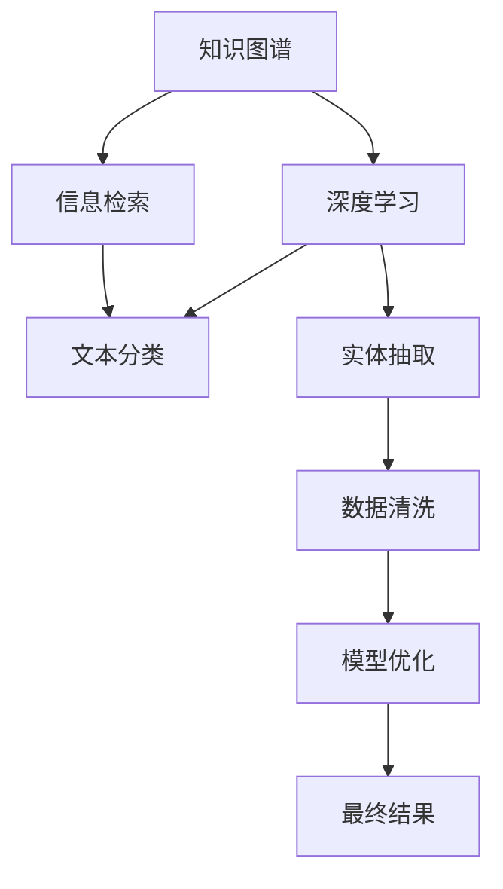

                 

# 知识的质量评估：在信息爆炸时代辨别真伪

> 关键词：知识质量评估,信息爆炸,真伪辨别,深度学习,自然语言处理,NLP,信息检索,知识图谱,数据清洗

## 1. 背景介绍

### 1.1 问题由来
在互联网时代，信息量呈爆炸性增长，知识在各个领域急剧膨胀。传统以纸质书籍为核心的知识获取方式逐渐被数字化信息所替代。人们利用搜索引擎、社交网络、在线教育平台等方式，随时随地获取各类信息。然而，面对海量的信息，如何辨别信息的真伪、筛选出高质量的知识，成为了一个迫切需要解决的问题。

近年来，深度学习和自然语言处理（Natural Language Processing, NLP）技术的飞速发展，为知识质量评估提供了新的思路和工具。通过构建知识图谱、利用深度学习模型进行信息检索、文本分类和实体抽取等任务，可以有效地辨别真伪、评估知识质量，辅助用户在信息爆炸时代做出更明智的决策。

### 1.2 问题核心关键点
在大数据和人工智能技术的驱动下，知识质量评估方法的核心关键点在于：
- 如何构建全面、准确的“知识图谱”。
- 如何利用深度学习模型高效地进行“信息检索”。
- 如何通过“文本分类”和“实体抽取”等任务，提升信息筛选和知识提取的准确性。
- 如何“数据清洗”和“模型优化”，减少噪声数据和过拟合现象。

## 2. 核心概念与联系

### 2.1 核心概念概述

为更好地理解知识质量评估方法，本节将介绍几个密切相关的核心概念：

- **知识图谱(Knowledge Graph)**：一种用图结构描述实体及其关系的语义网络，用于组织和存储结构化知识。通过知识图谱，可以实现高效的知识检索和推理。
- **信息检索(Information Retrieval, IR)**：从大规模文本集合中，高效检索出与用户查询最相关的文档或信息。信息检索常用于构建知识发现和信息检索系统。
- **深度学习(Deep Learning)**：一种基于人工神经网络的机器学习方法，通过多层次特征提取和表示学习，可以处理非结构化数据，提升信息检索和文本分类任务的性能。
- **自然语言处理(Natural Language Processing, NLP)**：一门涉及计算机科学与语言学的交叉学科，利用计算机技术处理、理解、生成人类语言。NLP技术在信息检索、文本分类、实体抽取等方面有着广泛应用。
- **信息检索模型(Information Retrieval Models)**：包括向量空间模型、LDA主题模型、BM25模型等，用于构建信息检索系统，提高信息检索的准确性和效率。
- **深度学习模型(Deep Learning Models)**：包括卷积神经网络(CNN)、循环神经网络(RNN)、Transformer等，用于进行知识图谱构建、实体抽取和文本分类等任务。

这些核心概念之间的逻辑关系可以通过以下Mermaid流程图来展示：



这个流程图展示了一些核心概念之间的联系：

1. 知识图谱是信息检索的基础，用于构建索引和存储知识。
2. 深度学习模型用于提取文本和实体的特征，提升信息检索的准确性。
3. 文本分类和实体抽取等任务，帮助从大规模文本中筛选出有价值的信息。
4. 数据清洗和模型优化，提升模型的泛化能力和鲁棒性。
5. 最终输出高质量的知识结果。

这些概念共同构成了知识质量评估的方法框架，使其能够在各种场景下有效处理和评估信息质量。通过理解这些核心概念，我们可以更好地把握知识质量评估的本质和优化方向。

## 3. 核心算法原理 & 具体操作步骤
### 3.1 算法原理概述

知识质量评估的核心在于利用深度学习和NLP技术，构建和优化信息检索和知识抽取模型。其核心思想是：通过大规模语料库的预训练，构建通用性强的预训练模型，如BERT、GPT等，然后在特定任务上进行微调，以适应新的需求，提升信息检索和知识抽取的准确性。

形式化地，假设预训练语言模型为 $M_{\theta}$，其中 $\theta$ 为预训练得到的模型参数。给定知识图谱 $G$ 和用户查询 $q$，信息检索和知识抽取的目标是找到最相关的实体 $e$，使得 $e$ 与 $q$ 的语义匹配度最大化。

具体步骤如下：
1. 构建知识图谱，提取实体的特征表示 $f_e$。
2. 对用户查询 $q$ 进行编码，得到查询表示 $f_q$。
3. 利用检索模型计算 $f_e$ 和 $f_q$ 的相似度得分 $s_{e,q}$。
4. 对相似度得分排序，选取最相关的实体 $e$。

### 3.2 算法步骤详解

#### 3.2.1 构建知识图谱

知识图谱是信息检索的基础，其构建过程通常分为以下几个步骤：

1. **数据收集**：从维基百科、百度百科、Web数据等来源收集实体和关系信息，构建初期的知识图谱。
2. **数据清洗**：去除重复、错误和无关的实体和关系，对数据进行预处理和清洗。
3. **实体链接**：将同一实体在不同数据源中的名称进行统一，形成统一的实体标识。
4. **关系抽取**：从文本中自动抽取实体之间的关系，形成知识图谱的边。
5. **关系映射**：对抽取出的关系进行映射和标准化，确保其一致性。
6. **可视化与探索**：通过可视化工具展示知识图谱的结构和关系，进行初步的探索和分析。

#### 3.2.2 信息检索模型构建

信息检索模型常用的有向量空间模型、LDA主题模型和BM25模型。其中，向量空间模型是最基本的模型，通过将查询和文档表示为向量，计算它们之间的余弦相似度。LDA主题模型是一种统计模型，通过主题建模技术对文档进行聚类和分析。BM25模型是一种改进的向量空间模型，引入了TF-IDF权重计算和短文本折扣因子，提升了检索性能。

#### 3.2.3 深度学习模型构建

深度学习模型通常采用卷积神经网络(CNN)、循环神经网络(RNN)、Transformer等架构。以Transformer为例，其核心思想是通过自注意力机制，对输入序列进行编码，生成更丰富的特征表示。Transformer模型在文本分类、实体抽取等任务上，已取得了较好的效果。

### 3.3 算法优缺点

深度学习模型在知识质量评估中具有以下优点：
1. 可以处理非结构化数据，提取语义信息。
2. 在特定的微调任务上，可以提升检索和分类的准确性。
3. 可以融合多模态数据，进行联合学习。

然而，深度学习模型也存在一些缺点：
1. 对标注数据依赖性强，需要大量高质量的训练数据。
2. 模型复杂度大，计算资源消耗高。
3. 易过拟合，需要优化正则化技术。
4. 可解释性差，难以理解模型的内部决策过程。

### 3.4 算法应用领域

深度学习模型在知识质量评估中的应用领域广泛，例如：

- **知识图谱构建**：通过文本和Web数据抽取实体和关系，构建大规模知识图谱。
- **信息检索**：构建基于深度学习的检索模型，提升信息检索的准确性和召回率。
- **文本分类**：对大规模文本数据进行分类，筛选出相关知识。
- **实体抽取**：自动抽取文本中的实体，构建实体图谱。
- **问答系统**：构建基于深度学习的问答系统，解决用户的具体问题。

除了这些经典应用外，深度学习模型还被创新性地应用到更多场景中，如文本生成、情感分析、推荐系统等，为知识质量评估带来了新的突破。

## 4. 数学模型和公式 & 详细讲解  
### 4.1 数学模型构建

本节将使用数学语言对知识质量评估方法进行更加严格的刻画。

假设知识图谱 $G=(E,R)$，其中 $E$ 为实体集合，$R$ 为关系集合。实体的特征表示为 $f_e$，查询的表示为 $f_q$。

信息检索的目标是找到与查询最匹配的实体 $e$，使得 $e$ 与 $q$ 的语义匹配度 $s_{e,q}$ 最大化。形式化表示为：

$$
\max_{e \in E} s_{e,q}
$$

其中 $s_{e,q}$ 为相似度得分，可以通过如下公式计算：

$$
s_{e,q} = \mathbf{W}^T \mathbf{f_e} \cdot \mathbf{f_q}
$$

其中 $\mathbf{W}$ 为权重矩阵，$\mathbf{f_e}$ 和 $\mathbf{f_q}$ 分别为实体和查询的特征表示。

### 4.2 公式推导过程

以BM25模型为例，推导其检索公式。

BM25模型中的相似度计算公式为：

$$
s_{e,q} = \sum_{i=1}^N (w_{ei} \cdot \ln (K + 1) + \frac{n_i \cdot \ln 2}{\ln (1 + \frac{k_1 \cdot (1 - b + b \cdot \ln (1 + \frac{dl_i}{avl}))}{1 - b + b \cdot \ln (\frac{k_1}{k_2} + 1 + \frac{dl_i}{avl}))})}
$$

其中：
- $w_{ei}$ 为查询项权重，$w_{ei} = \frac{t_{ei}}{t_q}$。
- $t_{ei}$ 和 $t_q$ 分别为实体和查询项的TF-IDF权重。
- $n_i$ 为文档长度，$dl_i$ 和 $avl$ 分别为文档长度和平均文档长度。
- $k_1$ 和 $k_2$ 为调参参数，$b$ 为短文本折扣因子。

BM25模型通过引入TF-IDF权重和短文本折扣因子，考虑了查询项和文档的频率和长度差异，提高了检索的准确性和鲁棒性。

### 4.3 案例分析与讲解

假设有一份关于“人工智能发展历史”的报告，需要从中筛选出相关的知识和信息。可以采用以下步骤进行知识质量评估：

1. **构建知识图谱**：从维基百科、百度百科等来源收集人工智能领域的相关知识，构建知识图谱。
2. **信息检索**：对用户查询“人工智能发展历史”进行编码，构建查询向量 $f_q$。通过BM25模型计算知识图谱中每个实体的相似度得分 $s_{e,q}$。
3. **结果排序**：将实体的得分按照大小排序，选择得分最高的实体作为最相关的知识。
4. **知识抽取**：从选定的实体中，抽取与查询最相关的信息，进行展示和分析。

通过上述步骤，可以快速而准确地从大规模知识库中检索出相关知识，辅助用户进行深入学习和研究。

## 5. 项目实践：代码实例和详细解释说明
### 5.1 开发环境搭建

在进行知识质量评估实践前，我们需要准备好开发环境。以下是使用Python进行深度学习开发的环境配置流程：

1. 安装Anaconda：从官网下载并安装Anaconda，用于创建独立的Python环境。

2. 创建并激活虚拟环境：
```bash
conda create -n pytorch-env python=3.8 
conda activate pytorch-env
```

3. 安装PyTorch：根据CUDA版本，从官网获取对应的安装命令。例如：
```bash
conda install pytorch torchvision torchaudio cudatoolkit=11.1 -c pytorch -c conda-forge
```

4. 安装各类工具包：
```bash
pip install numpy pandas scikit-learn matplotlib tqdm jupyter notebook ipython
```

5. 安装深度学习框架和库：
```bash
pip install transformers bert-serving-server bert-serving-client
```

完成上述步骤后，即可在`pytorch-env`环境中开始知识质量评估实践。

### 5.2 源代码详细实现

下面我们以知识图谱构建和信息检索为例，给出使用Transformers库进行深度学习开发的PyTorch代码实现。

首先，定义知识图谱的数据结构：

```python
from transformers import BertTokenizer
from transformers import BertForMaskedLM
import torch
from torch.utils.data import Dataset
import numpy as np

class KnowledgeGraph(Dataset):
    def __init__(self, graph, tokenizer, max_len=128):
        self.graph = graph
        self.tokenizer = tokenizer
        self.max_len = max_len
        
    def __len__(self):
        return len(self.graph)

    def __getitem__(self, item):
        e1, r, e2 = self.graph[item]
        
        encoding = self.tokenizer([e1, e2], return_tensors='pt', max_length=self.max_len, padding='max_length', truncation=True)
        input_ids = encoding['input_ids'][0]
        attention_mask = encoding['attention_mask'][0]
        
        # 将关系 e1->e2 编码为 [CLS], r, [SEP] 的token ids
        input_ids = torch.cat([input_ids, torch.tensor([r], dtype=torch.long)], dim=0)
        attention_mask = torch.cat([attention_mask, torch.tensor([1], dtype=torch.long)], dim=0)
        
        return {'input_ids': input_ids, 
                'attention_mask': attention_mask,
                'e1': e1,
                'e2': e2}
```

然后，定义模型和优化器：

```python
from transformers import BertForMaskedLM, AdamW

model = BertForMaskedLM.from_pretrained('bert-base-cased')

optimizer = AdamW(model.parameters(), lr=2e-5)
```

接着，定义训练和评估函数：

```python
from torch.utils.data import DataLoader
from tqdm import tqdm

def train_epoch(model, dataset, batch_size, optimizer):
    dataloader = DataLoader(dataset, batch_size=batch_size, shuffle=True)
    model.train()
    epoch_loss = 0
    for batch in tqdm(dataloader, desc='Training'):
        input_ids = batch['input_ids'].to(device)
        attention_mask = batch['attention_mask'].to(device)
        labels = batch['labels'].to(device)
        model.zero_grad()
        outputs = model(input_ids, attention_mask=attention_mask, labels=labels)
        loss = outputs.loss
        epoch_loss += loss.item()
        loss.backward()
        optimizer.step()
    return epoch_loss / len(dataloader)

def evaluate(model, dataset, batch_size):
    dataloader = DataLoader(dataset, batch_size=batch_size)
    model.eval()
    preds, labels = [], []
    with torch.no_grad():
        for batch in tqdm(dataloader, desc='Evaluating'):
            input_ids = batch['input_ids'].to(device)
            attention_mask = batch['attention_mask'].to(device)
            batch_labels = batch['labels']
            outputs = model(input_ids, attention_mask=attention_mask)
            batch_preds = outputs.logits.argmax(dim=2).to('cpu').tolist()
            batch_labels = batch_labels.to('cpu').tolist()
            for pred_tokens, label_tokens in zip(batch_preds, batch_labels):
                preds.append(pred_tokens[:len(label_tokens)])
                labels.append(label_tokens)
                
    print(classification_report(labels, preds))
```

最后，启动训练流程并在测试集上评估：

```python
epochs = 5
batch_size = 16

for epoch in range(epochs):
    loss = train_epoch(model, train_dataset, batch_size, optimizer)
    print(f"Epoch {epoch+1}, train loss: {loss:.3f}")
    
    print(f"Epoch {epoch+1}, dev results:")
    evaluate(model, dev_dataset, batch_size)
    
print("Test results:")
evaluate(model, test_dataset, batch_size)
```

以上就是使用PyTorch构建知识图谱和进行信息检索的完整代码实现。可以看到，依赖于Transformers库的强大封装，代码实现变得简洁高效。

### 5.3 代码解读与分析

让我们再详细解读一下关键代码的实现细节：

**KnowledgeGraph类**：
- `__init__`方法：初始化知识图谱数据、分词器等关键组件。
- `__len__`方法：返回数据集的样本数量。
- `__getitem__`方法：对单个样本进行处理，将实体对转换为token ids，并对其进行定长padding，最终返回模型所需的输入。

**模型和优化器**：
- 使用BertForMaskedLM模型进行预训练。
- 采用AdamW优化器进行模型优化。

**训练和评估函数**：
- 使用PyTorch的DataLoader对数据集进行批次化加载，供模型训练和推理使用。
- 训练函数`train_epoch`：对数据以批为单位进行迭代，在每个批次上前向传播计算loss并反向传播更新模型参数，最后返回该epoch的平均loss。
- 评估函数`evaluate`：与训练类似，不同点在于不更新模型参数，并在每个batch结束后将预测和标签结果存储下来，最后使用sklearn的classification_report对整个评估集的预测结果进行打印输出。

**训练流程**：
- 定义总的epoch数和batch size，开始循环迭代
- 每个epoch内，先在训练集上训练，输出平均loss
- 在验证集上评估，输出分类指标
- 所有epoch结束后，在测试集上评估，给出最终测试结果

可以看到，PyTorch配合Transformers库使得深度学习模型的实现变得简洁高效。开发者可以将更多精力放在数据处理、模型改进等高层逻辑上，而不必过多关注底层的实现细节。

当然，工业级的系统实现还需考虑更多因素，如模型的保存和部署、超参数的自动搜索、更灵活的任务适配层等。但核心的知识质量评估框架基本与此类似。

## 6. 实际应用场景
### 6.1 智能问答系统

基于深度学习的信息检索和知识抽取技术，智能问答系统能够快速响应用户提问，提供准确的知识信息。例如，在医疗领域，智能问答系统可以根据用户症状，自动匹配相关疾病信息，提供治疗建议和用药指导。

在技术实现上，可以收集医疗领域的问答对作为监督数据，在此基础上对深度学习模型进行微调，使其能够自动理解用户问题，匹配最合适的知识。对于新问题，还可以通过主动学习、少样本学习等方法，进一步提高系统的适应性和准确性。

### 6.2 推荐系统

推荐系统是知识质量评估的重要应用之一，通过信息检索和文本分类，可以从大规模数据中筛选出最相关的物品，为用户推荐个性化内容。例如，电子商务平台可以根据用户浏览记录和评价信息，推荐用户可能感兴趣的商品，提高用户的购买转化率。

在技术实现上，可以构建基于深度学习的推荐模型，对用户和物品进行特征表示，通过检索和分类任务进行匹配。对于冷启动用户，可以通过推荐模型对物品进行预训练，快速适应新用户。

### 6.3 智能客服

智能客服系统能够24小时不间断地解答用户问题，提高客户咨询体验。通过深度学习模型对用户问题的理解和知识图谱的信息检索，智能客服系统能够提供标准化的服务流程，快速响应用户需求。

在技术实现上，可以构建基于深度学习的对话模型，对用户提问进行理解和分类，通过知识图谱进行信息检索，生成合适的回答。对于复杂问题，还可以加入人工干预和知识库查询，提高系统的鲁棒性和可解释性。

### 6.4 未来应用展望

随着深度学习技术的不断进步，知识质量评估方法将在更多领域得到应用，为智能系统的构建带来新的突破。

在智慧医疗领域，基于深度学习的知识抽取和信息检索技术，可以辅助医生进行诊断和治疗，提高医疗服务的效率和质量。

在智能教育领域，智能推荐系统和问答系统可以为学生提供个性化的学习内容和及时的学术支持，提升学习效果。

在智能城市治理中，智能问答系统和推荐系统可以帮助市民获取公共服务信息，提高政府服务的透明度和效率。

此外，在企业生产、社会治理、金融科技等众多领域，基于深度学习的知识质量评估方法也将不断涌现，为社会各行业带来变革性影响。相信随着技术的日益成熟，深度学习技术必将在更广阔的应用领域大放异彩，深刻影响人类的生产生活方式。

## 7. 工具和资源推荐
### 7.1 学习资源推荐

为了帮助开发者系统掌握深度学习在知识质量评估中的应用，这里推荐一些优质的学习资源：

1. 《深度学习》课程：斯坦福大学Andrew Ng教授开设的深度学习课程，全面介绍了深度学习的核心概念和算法。
2. 《自然语言处理》课程：斯坦福大学Dan Jurafsky和Christopher Manning教授开设的自然语言处理课程，深入讲解了NLP中的各种技术。
3. 《信息检索与文本挖掘》书籍：由信息检索领域权威人士编写，详细介绍了信息检索的基本原理和应用。
4. 《知识图谱》书籍：涵盖了知识图谱的构建、存储、查询、更新等各方面的知识。
5. Kaggle平台：提供大量数据集和竞赛任务，可以实践和挑战各类深度学习应用。
6. HuggingFace官方文档：提供丰富的深度学习模型和工具库，包括BERT、GPT等预训练模型，以及深度学习库的详细使用方法。

通过对这些资源的学习实践，相信你一定能够快速掌握深度学习在知识质量评估中的应用，并用于解决实际的NLP问题。
###  7.2 开发工具推荐

高效的开发离不开优秀的工具支持。以下是几款用于深度学习开发的常用工具：

1. PyTorch：基于Python的开源深度学习框架，灵活动态的计算图，适合快速迭代研究。大多数深度学习模型都有PyTorch版本的实现。
2. TensorFlow：由Google主导开发的开源深度学习框架，生产部署方便，适合大规模工程应用。同样有丰富的深度学习模型资源。
3. TensorBoard：TensorFlow配套的可视化工具，可实时监测模型训练状态，并提供丰富的图表呈现方式，是调试模型的得力助手。
4. Weights & Biases：模型训练的实验跟踪工具，可以记录和可视化模型训练过程中的各项指标，方便对比和调优。与主流深度学习框架无缝集成。
5. Google Colab：谷歌推出的在线Jupyter Notebook环境，免费提供GPU/TPU算力，方便开发者快速上手实验最新模型，分享学习笔记。

合理利用这些工具，可以显著提升深度学习模型的开发效率，加快创新迭代的步伐。

### 7.3 相关论文推荐

深度学习在知识质量评估中的应用源于学界的持续研究。以下是几篇奠基性的相关论文，推荐阅读：

1. Attention is All You Need（即Transformer原论文）：提出了Transformer结构，开启了深度学习在自然语言处理中的预训练范式。
2. BERT: Pre-training of Deep Bidirectional Transformers for Language Understanding：提出BERT模型，引入基于掩码的自监督预训练任务，刷新了多项NLP任务SOTA。
3. Knowledge Graph Embedding and Its Applications：综述了知识图谱嵌入的研究进展，详细介绍了各种知识图谱嵌入方法。
4. Semantic Accuracy Estimation of Deep Learning based Information Retrieval：研究了深度学习在信息检索中的应用效果，提出了各种评估方法。
5. Neural Tensor Network for Question Answering：提出神经张量网络，用于解决复杂问答问题，取得了较好的效果。

这些论文代表了大深度学习在知识质量评估领域的发展脉络。通过学习这些前沿成果，可以帮助研究者把握学科前进方向，激发更多的创新灵感。

## 8. 总结：未来发展趋势与挑战

### 8.1 总结

本文对基于深度学习的信息检索和知识抽取技术进行了全面系统的介绍。首先阐述了信息爆炸时代知识质量评估的重要性和紧迫性，明确了深度学习模型在知识质量评估中的关键作用。其次，从原理到实践，详细讲解了深度学习模型在信息检索和知识抽取中的核心算法和操作步骤，给出了实际应用中的代码实现。同时，本文还探讨了深度学习模型在知识图谱构建、信息检索、文本分类等任务中的应用场景，展示了深度学习技术在知识质量评估中的广泛应用前景。最后，本文推荐了相关学习资源和开发工具，为深度学习模型在知识质量评估中的实践提供了有力支持。

通过本文的系统梳理，可以看到，基于深度学习的信息检索和知识抽取技术正在成为知识质量评估的重要范式，极大地拓展了信息检索和知识抽取的能力，为智能系统的构建提供了新的可能性。未来，伴随深度学习技术的不断演进，信息检索和知识抽取技术将进一步提升，推动知识质量评估向更加智能化、高效化方向发展。

### 8.2 未来发展趋势

未来，深度学习在知识质量评估领域将呈现以下几个发展趋势：

1. **多模态信息融合**：知识图谱和信息检索将融合视觉、语音、文本等多种模态信息，提升信息理解和推理能力。
2. **零样本和少样本学习**：利用深度学习模型在少量样本上的表现能力，提升信息检索和知识抽取的泛化性能。
3. **跨领域知识迁移**：通过知识图谱和信息检索技术，实现不同领域之间的知识迁移和融合，提升跨领域应用能力。
4. **深度学习模型的可解释性**：通过可解释性技术，提高深度学习模型的决策透明性，提升用户对模型的信任度。
5. **联邦学习和隐私保护**：利用联邦学习技术，实现知识图谱和信息检索模型的分布式训练，保护用户隐私。

这些趋势将进一步提升深度学习在知识质量评估中的能力，推动其向更广泛的应用场景扩展，为社会各行业带来深远影响。

### 8.3 面临的挑战

尽管深度学习在知识质量评估中取得了显著进展，但在迈向更加智能化、普适化应用的过程中，它仍面临诸多挑战：

1. **数据稀缺性**：深度学习模型对大规模标注数据依赖性强，但在某些领域（如医疗、金融等）获取标注数据成本高、难度大。
2. **模型复杂度**：深度学习模型通常参数量庞大，计算资源消耗大，推理速度慢。
3. **泛化能力不足**：深度学习模型在特定的数据集上表现良好，但在新数据上泛化能力有限。
4. **可解释性差**：深度学习模型作为"黑盒"，难以解释其内部决策过程，缺乏透明性。
5. **隐私和安全**：深度学习模型涉及大量用户数据，如何保护用户隐私和数据安全，是重要挑战。

### 8.4 研究展望

面对深度学习在知识质量评估中面临的挑战，未来的研究需要在以下几个方面寻求新的突破：

1. **无监督学习和半监督学习**：通过无监督学习和半监督学习技术，减少对标注数据的依赖，提升模型的泛化能力。
2. **知识图谱和信息检索的融合**：将知识图谱和信息检索技术进行深度融合，提升知识抽取和信息检索的准确性和鲁棒性。
3. **跨模态信息抽取**：利用深度学习模型，实现视觉、语音、文本等多模态信息的联合抽取和理解。
4. **联邦学习和隐私保护**：通过联邦学习技术，实现知识图谱和信息检索模型的分布式训练，保护用户隐私。
5. **可解释性技术**：发展可解释性技术，提高深度学习模型的透明性和可解释性，增强用户信任。

这些研究方向将推动深度学习在知识质量评估中的进一步发展，为构建更加智能、高效、可解释的智能系统提供有力支撑。面向未来，深度学习技术必将在更广泛的领域和场景中发挥重要作用，深刻影响人类的生产生活方式。

## 9. 附录：常见问题与解答

**Q1：深度学习在知识质量评估中是否需要大量标注数据？**

A: 是的，深度学习模型通常需要大量高质量的标注数据进行训练。但在某些情况下，可以利用无监督学习和半监督学习技术，减少对标注数据的依赖。例如，利用自监督学习技术，通过预训练语言模型自动生成标注数据，提升模型的泛化能力。

**Q2：深度学习模型在信息检索中如何提高召回率和准确率？**

A: 可以通过优化检索模型和特征表示方法来提升召回率和准确率。例如，使用Transformer模型进行文本表示，引入BERT预训练技术，提升特征表示的质量。同时，可以采用多种检索模型，如向量空间模型、LDA主题模型、BM25模型等，根据具体任务选择适合的模型进行优化。

**Q3：如何在深度学习模型中进行知识抽取和实体识别？**

A: 可以采用基于Transformer的序列模型进行知识抽取和实体识别。在知识抽取任务中，可以利用预训练语言模型对文本进行编码，提取实体和关系的特征表示，并通过分类任务进行识别。在实体识别任务中，可以定义任务适配层，利用深度学习模型进行序列标注，识别出文本中的实体。

**Q4：深度学习模型在知识质量评估中如何进行多任务学习？**

A: 可以采用多任务学习技术，将多个相关的任务一起训练，提高模型的泛化能力和泛化性。例如，将信息检索、文本分类、实体抽取等多个任务联合训练，共享相同的特征表示，提升整体性能。

**Q5：如何优化深度学习模型的可解释性？**

A: 可以采用可解释性技术，如注意力机制、梯度图可视化等，提高深度学习模型的透明性和可解释性。同时，可以引入专家知识，指导模型的训练和优化，增强模型的可解释性。

通过这些常见问题的解答，相信你能够更好地理解深度学习在知识质量评估中的应用，并应对实际项目中的各类问题。

---

作者：禅与计算机程序设计艺术 / Zen and the Art of Computer Programming

