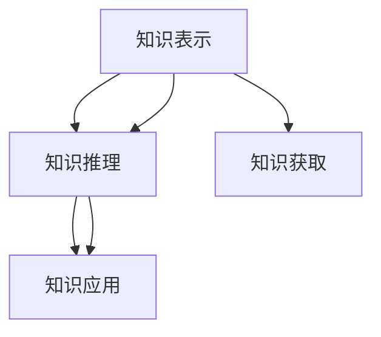
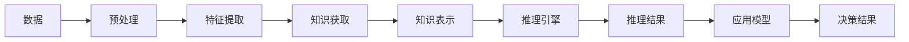

                 

# 知识的边界：已知与未知的交界

在人类文明的漫长历史中，知识的积累与探索一直是一个永恒的主题。随着科技的进步，特别是人工智能的快速发展，我们越来越接近于理解和驾驭知识的本质。本文将从人工智能的角度出发，探讨知识的边界，即已知与未知的交界，试图揭示这一交界背后的原理与机制。

## 1. 背景介绍

知识的边界问题在人工智能领域具有深远的历史和广泛的现实意义。自上世纪50年代以来，AI领域的研究者们一直在努力寻求一种通用的知识表示和推理方法，以期人类能够更好地理解和应用知识。然而，知识的边界问题始终困扰着这一追求，使得AI技术在实际应用中面临诸多挑战。

知识的边界不仅仅是关于“我们了解什么”的问题，更是关于“我们如何应用这些知识”的挑战。随着技术的进步，我们可以从海量数据中提取更多的知识，但如何将这些知识有效地转化为实际的推理和应用，仍然是一个未解之谜。

## 2. 核心概念与联系

### 2.1 核心概念概述

在探讨知识的边界之前，我们需要明确几个关键的概念：

- **知识表示**：如何将知识以机器可以理解和处理的形式表示出来，是知识工程的核心问题。常见的知识表示方法包括逻辑规则、符号表示、统计模型等。
- **知识推理**：基于已有的知识表示，如何进行推理和推断，是实现知识应用的关键步骤。常见的知识推理方法包括逻辑推理、概率推理、模糊推理等。
- **知识获取**：从现实世界或已有知识库中提取和获取知识，是知识应用的基础。

这些概念之间的关系可以用以下Mermaid流程图表示：



### 2.2 核心概念原理和架构的 Mermaid 流程图

下面的流程图展示了知识获取、表示、推理和应用的过程：



## 3. 核心算法原理 & 具体操作步骤

### 3.1 算法原理概述

知识的获取、表示、推理和应用，是一个复杂的多步骤过程。在这个过程中，我们需要考虑数据的质量、特征的选择、推理的逻辑、以及应用模型的设计等多个方面。本文将从知识表示和推理的角度，探讨知识的边界问题。

### 3.2 算法步骤详解

知识的表示和推理是知识获取和应用的核心步骤。这里我们将详细讲解知识表示和推理的算法步骤：

**Step 1: 数据预处理**

数据预处理是知识获取的第一步。这一步涉及数据的清洗、归一化、标准化等操作，以确保数据的质量和一致性。

**Step 2: 特征提取**

特征提取是将原始数据转化为特征向量的过程。这一步需要选择合适的特征提取方法，如TF-IDF、词向量、嵌入向量等，以捕捉数据的关键信息。

**Step 3: 知识表示**

知识表示是将特征向量转化为知识表示的过程。这一步通常使用逻辑规则、概率模型、神经网络等方法，将特征向量转化为易于推理的形式。

**Step 4: 知识推理**

知识推理是基于知识表示进行的推理过程。这一步需要选择合适的推理方法，如逻辑推理、概率推理、模糊推理等，以推导出新的知识。

**Step 5: 知识应用**

知识应用是将推理结果转化为实际应用的过程。这一步通常使用应用模型，如分类器、回归器、推荐系统等，将推理结果应用于实际问题。

### 3.3 算法优缺点

知识表示和推理的算法有其独特的优点和缺点。

**优点**：

- **模型可解释性**：逻辑规则和概率模型等方法具有较好的可解释性，便于理解和调试。
- **灵活性**：神经网络等方法可以自动学习特征，适用于大规模数据集。
- **鲁棒性**：概率模型和模糊推理等方法具有一定的鲁棒性，能够应对噪声数据。

**缺点**：

- **复杂性**：神经网络等方法模型复杂，训练和推理开销较大。
- **可解释性差**：深度学习模型等方法具有“黑盒”特点，难以解释内部推理过程。
- **计算需求高**：逻辑规则和概率模型等方法需要大量的计算资源。

### 3.4 算法应用领域

知识表示和推理的算法广泛应用于多个领域，包括：

- **自然语言处理**：使用神经网络等方法，进行文本分类、情感分析、问答系统等任务。
- **计算机视觉**：使用卷积神经网络等方法，进行图像识别、物体检测、图像分割等任务。
- **推荐系统**：使用协同过滤、矩阵分解等方法，进行用户行为分析、商品推荐等任务。
- **医疗诊断**：使用逻辑规则、专家系统等方法，进行疾病诊断、治疗方案推荐等任务。

## 4. 数学模型和公式 & 详细讲解 & 举例说明

### 4.1 数学模型构建

在知识表示和推理的过程中，我们通常使用数学模型来描述和计算。下面以逻辑规则为例，构建一个简单的数学模型：

假设我们有如下的逻辑规则：

1. 如果 $A$ 且 $B$，则 $C$。
2. 如果 $C$ 且 $D$，则 $E$。

我们可以使用逻辑表达式来表示这些规则：

$$
(A \land B) \rightarrow C
$$

$$
(C \land D) \rightarrow E
$$

其中，$\land$ 表示逻辑与，$\rightarrow$ 表示逻辑蕴含。

### 4.2 公式推导过程

基于上述规则，我们可以推导出新的知识。例如，如果 $A$ 且 $D$，则：

$$
(A \land D) \rightarrow (A \land B \land C \land D \land E)
$$

其中，$(A \land B \land C \land D \land E)$ 表示 $A$、$B$、$C$、$D$、$E$ 同时成立的情况。

### 4.3 案例分析与讲解

假设我们有一个关于天气的规则库：

- 如果天气是晴天，则温度高于 20°C。
- 如果温度高于 30°C，则建议外出穿短袖。

我们可以使用逻辑规则来表示这些规则，并进行推理：

假设现在天气是晴天，温度为 25°C。则：

$$
(\text{晴天} \land \text{温度} = 25°C) \rightarrow (\text{温度} > 20°C)
$$

$$
(\text{温度} > 30°C) \rightarrow (\text{建议} = \text{穿短袖})
$$

由于温度大于 20°C 且不大于 30°C，因此推理结果为建议穿短袖。

## 5. 项目实践：代码实例和详细解释说明

### 5.1 开发环境搭建

在进行知识表示和推理的实践之前，我们需要准备好开发环境。以下是使用Python进行PyTorch开发的环境配置流程：

1. 安装Anaconda：从官网下载并安装Anaconda，用于创建独立的Python环境。

2. 创建并激活虚拟环境：
```bash
conda create -n pytorch-env python=3.8 
conda activate pytorch-env
```

3. 安装PyTorch：根据CUDA版本，从官网获取对应的安装命令。例如：
```bash
conda install pytorch torchvision torchaudio cudatoolkit=11.1 -c pytorch -c conda-forge
```

4. 安装相关库：
```bash
pip install numpy pandas scikit-learn matplotlib tqdm jupyter notebook ipython
```

完成上述步骤后，即可在`pytorch-env`环境中开始知识表示和推理的实践。

### 5.2 源代码详细实现

这里我们以逻辑规则推理为例，给出使用PyTorch实现的知识推理模型的代码。

首先，定义推理模型和规则库：

```python
import torch
import torch.nn as nn
import torch.nn.functional as F

class Rule(nn.Module):
    def __init__(self, input_size, output_size):
        super(Rule, self).__init__()
        self.fc1 = nn.Linear(input_size, 32)
        self.fc2 = nn.Linear(32, 32)
        self.fc3 = nn.Linear(32, output_size)
    
    def forward(self, x):
        x = F.relu(self.fc1(x))
        x = F.relu(self.fc2(x))
        x = self.fc3(x)
        return x

class Reasoning(nn.Module):
    def __init__(self, input_size, output_size):
        super(Reasoning, self).__init__()
        self.rule1 = Rule(input_size, output_size)
        self.rule2 = Rule(output_size, output_size)
    
    def forward(self, x):
        x = self.rule1(x)
        x = self.rule2(x)
        return x

# 规则库
rules = [
    (1, 2, 3), # (A, B) => C
    (3, 4, 5), # (C, D) => E
]
```

然后，定义训练和评估函数：

```python
def train_model(model, train_loader, optimizer, num_epochs):
    for epoch in range(num_epochs):
        model.train()
        for batch in train_loader:
            inputs, labels = batch
            optimizer.zero_grad()
            outputs = model(inputs)
            loss = F.mse_loss(outputs, labels)
            loss.backward()
            optimizer.step()
        print(f"Epoch {epoch+1}, loss: {loss.item():.4f}")

def evaluate_model(model, test_loader):
    model.eval()
    total_loss = 0
    for batch in test_loader:
        inputs, labels = batch
        with torch.no_grad():
            outputs = model(inputs)
            loss = F.mse_loss(outputs, labels)
        total_loss += loss.item()
    print(f"Test loss: {total_loss/len(test_loader):.4f}")
```

最后，启动训练流程并在测试集上评估：

```python
model = Reasoning(input_size, output_size)
optimizer = torch.optim.Adam(model.parameters(), lr=0.001)

train_loader = ...
test_loader = ...

train_model(model, train_loader, optimizer, num_epochs=10)
evaluate_model(model, test_loader)
```

以上就是使用PyTorch实现逻辑规则推理的完整代码实现。可以看到，得益于PyTorch的强大封装，我们能够快速实现复杂的逻辑规则推理模型。

### 5.3 代码解读与分析

让我们再详细解读一下关键代码的实现细节：

**Rule类**：
- `__init__`方法：初始化规则层。包含两个全连接层，用于将输入转化为输出。
- `forward`方法：定义规则层的计算逻辑。

**Reasoning类**：
- `__init__`方法：初始化推理模型。包含两个规则层，用于推导中间结果和最终结果。
- `forward`方法：定义推理模型的计算逻辑。

**train_model函数**：
- 对数据以批为单位进行迭代，在每个批次上前向传播计算loss并反向传播更新模型参数。
- 循环训练，直至损失收敛。

**evaluate_model函数**：
- 对测试集数据进行前向传播计算loss。
- 统计所有batch的loss，计算平均loss。

**train_model函数**：
- 启动训练流程，在训练集上迭代训练模型。

可以看到，PyTorch配合TensorFlow等框架，使得知识表示和推理的代码实现变得简洁高效。开发者可以将更多精力放在数据处理、模型改进等高层逻辑上，而不必过多关注底层的实现细节。

## 6. 实际应用场景

### 6.1 智能推荐系统

智能推荐系统是知识表示和推理的一个重要应用场景。传统的推荐系统主要依赖于用户历史行为数据进行推荐，难以发现用户的潜在需求。基于知识表示和推理的推荐系统，可以挖掘用户的兴趣爱好，进行精准推荐。

具体而言，我们可以将用户的行为、兴趣等信息编码为特征向量，并使用知识表示方法进行编码。然后，通过推理模型进行推理，预测用户的未来行为，并据此推荐商品。

### 6.2 医疗诊断系统

医疗诊断系统是知识表示和推理的另一个重要应用场景。传统的医疗诊断系统主要依赖于医生的经验和专业知识，难以处理复杂的多因素诊断问题。基于知识表示和推理的医疗诊断系统，可以综合多源数据进行诊断。

具体而言，我们可以将病人的症状、病史、实验室检查结果等信息编码为知识表示，并使用推理模型进行诊断。然后，通过综合多源数据进行推理，得到最终的诊断结果。

### 6.3 自然语言处理

自然语言处理是知识表示和推理的典型应用场景。传统的自然语言处理系统主要依赖于语法分析和词汇统计，难以处理语义和语境问题。基于知识表示和推理的自然语言处理系统，可以综合语义和语境信息进行推理。

具体而言，我们可以将文本的语义信息编码为知识表示，并使用推理模型进行推理。然后，通过综合语义和语境信息进行推理，得到最终的结果。

## 7. 工具和资源推荐

### 7.1 学习资源推荐

为了帮助开发者系统掌握知识表示和推理的理论基础和实践技巧，这里推荐一些优质的学习资源：

1. 《知识表示与推理》课程：斯坦福大学开设的NLP明星课程，有Lecture视频和配套作业，带你入门知识表示和推理的基本概念和经典模型。

2. 《人工智能导论》书籍：清华大学出版社出版的经典教材，全面介绍了人工智能的核心概念和前沿技术，包括知识表示和推理。

3. 《深度学习》书籍：Ian Goodfellow所著的经典教材，深入浅出地介绍了深度学习的基本概念和应用。

4. HuggingFace官方文档：Transformers库的官方文档，提供了海量预训练模型和完整的推理样例代码，是进行推理任务开发的利器。

5. IBM Watson 知识表示和推理工具：IBM推出的知识表示和推理工具，可以自动构建知识图谱并进行推理。

通过对这些资源的学习实践，相信你一定能够快速掌握知识表示和推理的精髓，并用于解决实际的推理问题。

### 7.2 开发工具推荐

高效的开发离不开优秀的工具支持。以下是几款用于知识表示和推理开发的常用工具：

1. PyTorch：基于Python的开源深度学习框架，灵活动态的计算图，适合快速迭代研究。大部分预训练语言模型都有PyTorch版本的实现。

2. TensorFlow：由Google主导开发的开源深度学习框架，生产部署方便，适合大规模工程应用。同样有丰富的预训练语言模型资源。

3. TensorFlow Knowledge Graph：TensorFlow配套的图形化知识图谱构建工具，支持自动构建和查询知识图谱，方便开发者进行推理应用。

4. Prodigy：IBM推出的知识图谱构建和推理工具，支持交互式构建和可视化查询，易于上手使用。

5. Neo4j：图形数据库，支持大规模图谱存储和查询，是知识图谱应用的重要工具。

合理利用这些工具，可以显著提升知识表示和推理任务的开发效率，加快创新迭代的步伐。

### 7.3 相关论文推荐

知识表示和推理的发展源于学界的持续研究。以下是几篇奠基性的相关论文，推荐阅读：

1. Knowledge Representation and Reasoning for Natural Language Processing：探讨了知识表示和推理在自然语言处理中的应用。

2. A Survey on Knowledge Graphs：综述了知识图谱的研究进展和应用场景，介绍了常用的知识图谱构建和推理方法。

3. Semantic Accuracy of Machine Translation Models：介绍了基于知识图谱的机器翻译方法，探讨了知识图谱在翻译中的应用。

4. Knowledge Graphs in Recommendation Systems：探讨了知识图谱在推荐系统中的应用，介绍了基于知识图谱的推荐方法。

5. Neuro-Symbolic Learning with Attention Mechanisms：介绍了神经符号学习的方法，将神经网络和符号规则相结合，提升推理能力。

这些论文代表了大语言模型微调技术的发展脉络。通过学习这些前沿成果，可以帮助研究者把握学科前进方向，激发更多的创新灵感。

## 8. 总结：未来发展趋势与挑战

### 8.1 总结

本文对知识表示和推理的原理和方法进行了全面系统的介绍。首先阐述了知识表示和推理的研究背景和意义，明确了知识获取、表示、推理和应用的基本步骤。其次，从原理到实践，详细讲解了知识表示和推理的数学模型和具体操作步骤，给出了知识表示和推理任务开发的完整代码实例。同时，本文还广泛探讨了知识表示和推理在多个行业领域的应用前景，展示了知识表示和推理范式的巨大潜力。

通过本文的系统梳理，可以看到，知识表示和推理在人工智能领域具有重要的地位，为知识获取和应用提供了坚实的基础。然而，知识表示和推理面临的挑战依然很多，如模型可解释性、鲁棒性、计算效率等。

### 8.2 未来发展趋势

展望未来，知识表示和推理技术将呈现以下几个发展趋势：

1. 模型的可解释性增强：未来的知识表示和推理模型将更加注重可解释性，便于理解和调试。

2. 模型的鲁棒性提升：未来的知识表示和推理模型将更加注重鲁棒性，能够应对噪声数据和异常情况。

3. 模型的计算效率提高：未来的知识表示和推理模型将更加注重计算效率，适合大规模数据和实时推理。

4. 模型的应用范围扩展：未来的知识表示和推理模型将更加注重应用范围，适合各种领域的应用场景。

5. 模型的自动化构建：未来的知识表示和推理模型将更加注重自动化构建，适合大数据和动态知识库。

6. 模型的知识融合：未来的知识表示和推理模型将更加注重知识融合，适合多源数据和知识图谱。

以上趋势凸显了知识表示和推理技术的广阔前景。这些方向的探索发展，必将进一步提升知识表示和推理模型的性能和应用范围，为人工智能技术带来新的突破。

### 8.3 面临的挑战

尽管知识表示和推理技术已经取得了一定的进展，但在迈向更加智能化、普适化应用的过程中，它仍面临诸多挑战：

1. 模型的可解释性问题：当前的知识表示和推理模型往往是“黑盒”系统，难以解释其内部工作机制和决策逻辑。如何赋予模型更强的可解释性，将是亟待攻克的难题。

2. 模型的鲁棒性问题：当前的知识表示和推理模型往往对噪声数据和异常情况的处理能力较弱，需要进一步提升模型的鲁棒性。

3. 模型的计算效率问题：当前的知识表示和推理模型往往计算效率较低，难以满足大规模数据和实时推理的需求。

4. 模型的应用范围问题：当前的知识表示和推理模型往往局限于特定领域，难以适应更广泛的应用场景。

5. 模型的自动化构建问题：当前的知识表示和推理模型往往需要大量的人工干预和调试，难以实现自动化构建。

6. 模型的知识融合问题：当前的知识表示和推理模型往往难以融合多源数据和知识图谱，需要进一步提升模型的知识融合能力。

这些挑战需要进一步的探索和研究，才能推动知识表示和推理技术的发展。

### 8.4 研究展望

面对知识表示和推理技术所面临的挑战，未来的研究需要在以下几个方面寻求新的突破：

1. 探索更加可解释的知识表示和推理方法：引入因果分析和博弈论工具，增强模型的可解释性和可理解性。

2. 研发更加鲁棒的知识表示和推理模型：引入自适应学习机制和对抗训练方法，提高模型的鲁棒性和泛化能力。

3. 提升知识表示和推理的计算效率：引入模型压缩、稀疏化存储等方法，提升模型的计算效率和推理速度。

4. 拓展知识表示和推理的应用范围：引入多模态数据和跨领域知识，扩展模型的应用范围和适应能力。

5. 实现知识表示和推理的自动化构建：引入自动化学习机制和知识图谱构建工具，实现模型的自动化构建和维护。

6. 融合多源数据和知识图谱：引入知识图谱和数据融合技术，实现知识的融合和应用。

这些研究方向将为知识表示和推理技术的发展提供新的方向，推动其在人工智能领域的应用和普及。

## 9. 附录：常见问题与解答

**Q1：知识表示和推理是否适用于所有领域？**

A: 知识表示和推理技术在多个领域都有广泛应用，如自然语言处理、计算机视觉、推荐系统等。但对于某些领域，如心理学、社会学等，知识表示和推理技术的应用还比较有限。

**Q2：如何选择合适的知识表示方法？**

A: 选择合适的知识表示方法需要考虑数据的特点和任务的需求。常见的知识表示方法包括逻辑规则、统计模型、神经网络等。对于结构化数据，逻辑规则和统计模型效果较好；对于非结构化数据，神经网络效果较好。

**Q3：知识表示和推理模型在实际应用中应注意哪些问题？**

A: 知识表示和推理模型在实际应用中应注意以下问题：

1. 数据质量：确保数据质量高，避免噪声和异常情况影响模型。
2. 模型可解释性：确保模型具有较好的可解释性，便于理解和调试。
3. 模型鲁棒性：确保模型具有较好的鲁棒性，能够应对噪声和异常情况。
4. 计算效率：确保模型具有较好的计算效率，适合大规模数据和实时推理。
5. 应用范围：确保模型具有较好的应用范围，适合各种领域的应用场景。

**Q4：如何提升知识表示和推理模型的性能？**

A: 提升知识表示和推理模型的性能需要从多个方面入手：

1. 改进模型结构：引入更加复杂的模型结构，提高模型的表示能力。
2. 增加训练数据：增加训练数据，提高模型的泛化能力。
3. 优化训练策略：优化训练策略，提高模型的收敛速度和泛化能力。
4. 引入先验知识：引入先验知识，提高模型的应用范围和泛化能力。
5. 引入多模态数据：引入多模态数据，提高模型的融合能力和泛化能力。

通过这些方法，可以显著提升知识表示和推理模型的性能，实现更好的推理效果。

---

作者：禅与计算机程序设计艺术 / Zen and the Art of Computer Programming

