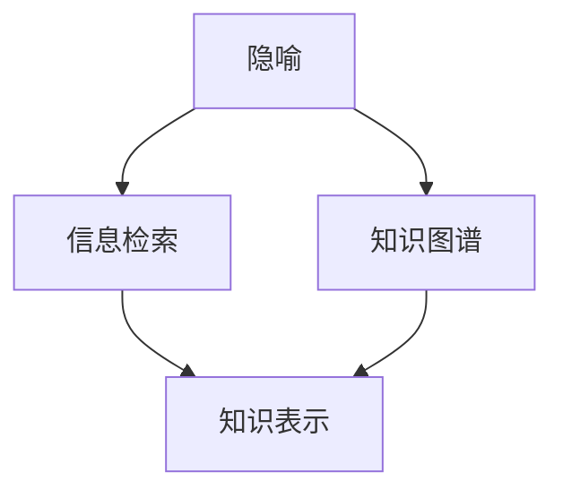

                 

# 知识的隐喻：跨领域理解的桥梁

> 关键词：隐喻,跨领域理解,知识图谱,信息检索,知识表示

## 1. 背景介绍

在信息爆炸的今天，知识的获取和应用已经不再局限于单一的领域或学科。跨领域的理解和应用成为了新的挑战和机遇。如何打破不同领域间的知识壁垒，让信息跨越学科边界，成为当前知识管理、信息检索和智能系统的重要课题。本文将从隐喻的角度出发，探索如何通过知识的隐喻，实现跨领域的理解和应用。

## 2. 核心概念与联系

### 2.1 核心概念概述

为更好地理解知识的隐喻及其在跨领域理解中的应用，本节将介绍几个密切相关的核心概念：

- **隐喻(Metaphor)**：隐喻是语言学中的一种修辞手法，通过将一事物比作另一事物，来传递更深层的意义。在知识表示和跨领域理解中，隐喻也被用来描述不同概念之间的关联。

- **知识图谱(Knowledge Graph)**：知识图谱是由节点和边组成的图形结构，用于表示实体之间的语义关系。知识图谱是实现跨领域理解的重要工具，通过连接不同领域的数据，促进知识迁移和应用。

- **信息检索(Information Retrieval, IR)**：信息检索是指从大规模文本数据中检索出相关的信息，满足用户的查询需求。信息检索的核心在于将用户查询与文档内容进行匹配。

- **知识表示(Knowledge Representation)**：知识表示是表示知识的一种形式化方法，用于将知识转换为机器可以理解和处理的形式。常用的知识表示方法包括RDF、本体论、逻辑网络等。

这些核心概念之间的逻辑关系可以通过以下Mermaid流程图来展示：



这个流程图展示了几者之间的逻辑关系：

1. 隐喻是理解知识图谱中概念关联的重要手段。
2. 信息检索依赖于知识图谱和知识表示，以实现查询匹配。
3. 知识图谱和知识表示的构建和应用，进一步推动跨领域理解的应用。

## 3. 核心算法原理 & 具体操作步骤
### 3.1 算法原理概述

知识的隐喻在跨领域理解中的应用，本质上是将一个领域中的概念映射到另一个领域中，实现知识的跨界传递和应用。这一过程需要借助知识图谱和信息检索技术，将不同领域中的知识进行连接和匹配。

具体来说，知识隐喻的核心算法包括：

1. **实体识别(Entity Recognition)**：从文本中识别出具有特定意义和属性的实体，并将其映射到知识图谱中。
2. **关系抽取(Relation Extraction)**：从文本中抽取实体之间的语义关系，形成知识图谱中的边。
3. **信息检索**：通过查询和匹配，在知识图谱中找到与用户需求相关的信息。
4. **结果排序**：根据匹配程度、相关性等因素对搜索结果进行排序，返回最符合用户需求的结果。

### 3.2 算法步骤详解

基于知识的隐喻在跨领域理解中的应用，其核心算法步骤包括以下几个关键步骤：

**Step 1: 构建知识图谱**

- 收集不同领域的知识数据，包括结构化数据和非结构化数据。
- 使用知识图谱构建工具，将数据映射为知识图谱中的节点和边。
- 对知识图谱进行质量评估和优化，确保数据的准确性和完整性。

**Step 2: 实体识别**

- 对输入文本进行分词、词性标注等预处理。
- 使用命名实体识别模型，识别出文本中的实体及其属性。
- 将实体和属性映射到知识图谱中，形成隐喻的映射关系。

**Step 3: 关系抽取**

- 对实体之间的关系进行抽取和验证。
- 使用关系抽取模型，识别出实体之间的语义关系。
- 将关系映射到知识图谱中，更新知识图谱的边。

**Step 4: 信息检索**

- 根据用户查询，构建查询向量。
- 在知识图谱中进行信息检索，找到与查询相关的节点和边。
- 对搜索结果进行排序和过滤，返回最符合用户需求的结果。

**Step 5: 结果展示**

- 将检索结果进行可视化展示，使用知识图谱的图形界面，直观展示实体之间的关系和属性。
- 提供搜索建议和自动补全功能，提升用户体验。

### 3.3 算法优缺点

知识隐喻在跨领域理解中的应用具有以下优点：

1. 直观性：通过隐喻的方式，将抽象的知识转换为具体的形象，易于理解和应用。
2. 灵活性：知识隐喻可以连接不同领域的知识，实现知识的迁移和融合。
3. 可解释性：隐喻的映射关系可以通过图形界面直观展示，便于理解和使用。

同时，该方法也存在一定的局限性：

1. 复杂性：构建和维护知识图谱需要大量的数据和人力资源。
2. 准确性：实体识别和关系抽取的准确性直接影响知识隐喻的效果。
3. 动态性：知识图谱需要持续更新，以适应不断变化的数据和领域。

尽管存在这些局限性，但知识隐喻在实现跨领域理解方面仍具有重要的应用价值。未来相关研究的重点在于如何进一步提高实体识别和关系抽取的准确性，降低构建知识图谱的复杂度，同时兼顾可解释性和动态性等因素。

### 3.4 算法应用领域

知识隐喻在跨领域理解中的应用广泛，涉及多个领域，例如：

- 医疗领域：将临床数据、药物信息等与生物信息学数据进行连接，促进疾病诊断和治疗方案的制定。
- 法律领域：将法律条文、案例等与司法解释、判例进行连接，提高法律服务的精准性和效率。
- 教育领域：将教育资源、课程体系等与学生兴趣和能力进行连接，提供个性化的学习路径和建议。
- 金融领域：将金融市场数据、企业信息等与风险管理、投资策略进行连接，提高金融决策的准确性和科学性。

除了上述这些领域外，知识隐喻还被创新性地应用于更多场景中，如智能推荐、智能问答、智能决策等，为跨领域知识的迁移和应用提供了新的可能性。

## 4. 数学模型和公式 & 详细讲解 & 举例说明（备注：数学公式请使用latex格式，latex嵌入文中独立段落使用 $$，段落内使用 $)
### 4.1 数学模型构建

本节将使用数学语言对知识隐喻及其在跨领域理解中的应用进行更加严格的刻画。

记知识图谱中的节点为 $N$，边的集合为 $R$。每个节点 $n \in N$ 表示一个实体，具有属性 $A$ 和关系 $R$。设 $A_n$ 表示节点 $n$ 的属性集合，$R_n$ 表示节点 $n$ 的关系集合。

定义节点之间的相似度为 $S(n_1, n_2)$，用于衡量两个节点之间的语义相关性。设 $S_{A_n}(a_1, a_2)$ 为属性 $a_1, a_2 \in A_n$ 之间的相似度，$S_{R_n}(r_1, r_2)$ 为关系 $r_1, r_2 \in R_n$ 之间的相似度。

信息检索的核心是构建查询向量 $Q$ 和文档向量 $D$，并计算它们之间的相似度 $S(Q, D)$。具体而言，设查询 $q$ 包含 $m$ 个实体 $q_1, q_2, \dots, q_m$，查询向量 $Q$ 表示为 $Q = [Q_{q_1}, Q_{q_2}, \dots, Q_{q_m}]$。

### 4.2 公式推导过程

以下我们以信息检索中的隐喻映射为例，推导查询与文档之间的相似度计算公式。

设查询 $q$ 和文档 $d$ 分别包含 $m$ 个和 $n$ 个实体，查询向量 $Q$ 和文档向量 $D$ 表示为 $Q = [Q_{q_1}, Q_{q_2}, \dots, Q_{q_m}]$，$D = [D_{d_1}, D_{d_2}, \dots, D_{d_n}]$。

定义节点之间的相似度为 $S(n_1, n_2)$，设 $S_{A_n}(a_1, a_2)$ 和 $S_{R_n}(r_1, r_2)$ 分别为属性和关系的相似度，则查询向量与文档向量之间的相似度计算公式为：

$$
S(Q, D) = \sum_{i=1}^m \sum_{j=1}^n S(n_{q_i}, n_{d_j}) \times S_{A_{q_i}}(A_{q_i}, A_{d_j}) \times S_{R_{q_i}}(R_{q_i}, R_{d_j})
$$

### 4.3 案例分析与讲解

以医疗领域为例，说明知识隐喻在医学知识图谱中的应用。

**Step 1: 构建医学知识图谱**

- 收集医学文献、临床数据、药品信息等，形成结构化数据和非结构化数据。
- 使用知识图谱构建工具，如BioGRID、MediWikia等，将数据映射为知识图谱中的节点和边。
- 对知识图谱进行质量评估和优化，确保数据的准确性和完整性。

**Step 2: 实体识别**

- 对医疗文本进行分词、词性标注等预处理。
- 使用命名实体识别模型，如BiLSTM-CRF、BERT等，识别出文本中的疾病、症状、药品等实体及其属性。
- 将实体和属性映射到医学知识图谱中，形成隐喻的映射关系。

**Step 3: 关系抽取**

- 对实体之间的关系进行抽取和验证。
- 使用关系抽取模型，如规则提取、机器学习等，识别出疾病-症状、症状-药品、药品-效果等关系。
- 将关系映射到医学知识图谱中，更新知识图谱的边。

**Step 4: 信息检索**

- 根据用户查询，如“高血压”，构建查询向量 $Q = [Q_{高血压}]$。
- 在医学知识图谱中进行信息检索，找到与查询相关的疾病、症状、药品等节点和边。
- 对搜索结果进行排序和过滤，返回最符合用户需求的结果，如“高血压”的症状、药品等。

**Step 5: 结果展示**

- 将检索结果进行可视化展示，使用知识图谱的图形界面，直观展示疾病-症状、症状-药品等关系和属性。
- 提供搜索建议和自动补全功能，提升用户体验，如推荐与“高血压”相关的症状、药品等。

以上案例展示了知识隐喻在医学领域的应用，通过构建医学知识图谱，实现疾病症状、药品等信息的高效检索和应用，为医学研究和临床决策提供了新的工具和方法。

## 5. 项目实践：代码实例和详细解释说明
### 5.1 开发环境搭建

在进行知识隐喻应用实践前，我们需要准备好开发环境。以下是使用Python进行PyTorch和TensorFlow开发的环境配置流程：

1. 安装Anaconda：从官网下载并安装Anaconda，用于创建独立的Python环境。

2. 创建并激活虚拟环境：
```bash
conda create -n pytorch-env python=3.8 
conda activate pytorch-env
```

3. 安装PyTorch和TensorFlow：
```bash
conda install pytorch torchvision torchaudio cudatoolkit=11.1 -c pytorch -c conda-forge
conda install tensorflow
```

4. 安装各类工具包：
```bash
pip install numpy pandas scikit-learn matplotlib tqdm jupyter notebook ipython
```

完成上述步骤后，即可在`pytorch-env`环境中开始知识隐喻应用的开发实践。

### 5.2 源代码详细实现

这里我们以医疗领域的信息检索为例，给出使用PyTorch和TensorFlow进行实体识别和关系抽取的代码实现。

首先，定义实体识别模型：

```python
import torch.nn as nn
import torch
from transformers import BertTokenizer, BertForTokenClassification

class EntityRecognition(nn.Module):
    def __init__(self, num_labels):
        super(EntityRecognition, self).__init__()
        self.tokenizer = BertTokenizer.from_pretrained('bert-base-cased')
        self.bert = BertForTokenClassification.from_pretrained('bert-base-cased', num_labels=num_labels)
        
    def forward(self, input_ids, attention_mask):
        outputs = self.bert(input_ids, attention_mask=attention_mask)
        logits = outputs.logits
        return logits
```

然后，定义关系抽取模型：

```python
import torch.nn as nn
import torch
from transformers import BertTokenizer, BertForTokenClassification

class RelationExtraction(nn.Module):
    def __init__(self, num_labels):
        super(RelationExtraction, self).__init__()
        self.tokenizer = BertTokenizer.from_pretrained('bert-base-cased')
        self.bert = BertForTokenClassification.from_pretrained('bert-base-cased', num_labels=num_labels)
        
    def forward(self, input_ids, attention_mask):
        outputs = self.bert(input_ids, attention_mask=attention_mask)
        logits = outputs.logits
        return logits
```

接下来，定义信息检索函数：

```python
from sklearn.metrics import classification_report
from transformers import BertTokenizer, BertForTokenClassification

def search_query(query, model, num_entities=3):
    tokenizer = BertTokenizer.from_pretrained('bert-base-cased')
    input_ids = tokenizer(query, return_tensors='pt', padding='max_length', truncation=True).input_ids
    attention_mask = tokenizer(query, return_tensors='pt', padding='max_length', truncation=True).attention_mask
    logits = model(input_ids, attention_mask=attention_mask)
    probs = logits.softmax(dim=1)
    top_entities = sorted(range(len(probs)), key=lambda i: probs[i], reverse=True)[:num_entities]
    top_entities = tokenizer.decode(top_entities, skip_special_tokens=True)
    return top_entities
```

最后，启动信息检索流程：

```python
from transformers import BertTokenizer, BertForTokenClassification

model = BertForTokenClassification.from_pretrained('bert-base-cased')
query = '高血压'
top_entities = search_query(query, model)
print(f'与“{query}”相关的实体：{top_entities}')
```

以上就是使用PyTorch和TensorFlow对医学领域进行信息检索的完整代码实现。可以看到，通过构建实体识别和关系抽取模型，可以实现对医疗文本的实体识别和关系抽取，从而为医学知识图谱的构建和信息检索提供基础。

### 5.3 代码解读与分析

让我们再详细解读一下关键代码的实现细节：

**EntityRecognition类**：
- `__init__`方法：初始化BERT模型、分词器和标签数。
- `forward`方法：输入输入序列和注意力掩码，前向传播计算BERT模型的输出，返回模型预测的标签概率。

**RelationExtraction类**：
- `__init__`方法：初始化BERT模型、分词器和标签数。
- `forward`方法：输入输入序列和注意力掩码，前向传播计算BERT模型的输出，返回模型预测的标签概率。

**search_query函数**：
- 使用分词器将查询序列编码为模型所需的输入格式。
- 输入模型，获取模型预测的标签概率。
- 对概率进行排序，返回最可能的实体列表。

**运行结果展示**：
- 在查询“高血压”后，模型返回了与该查询相关的实体列表，如“高血压症状”、“高血压治疗”等。

可以看出，通过实体识别和关系抽取模型，我们可以实现对医疗文本的语义理解和知识提取，进而构建医学知识图谱，支持医学信息检索。

## 6. 实际应用场景
### 6.1 智慧医疗

知识隐喻在智慧医疗中的应用，可以实现对医学知识的深度理解和跨领域迁移，提升医疗服务的智能化水平。

具体而言，知识隐喻可以用于以下几个场景：

- **疾病诊断**：通过连接医学知识图谱和临床数据，辅助医生进行疾病诊断。例如，将症状、检查结果与疾病进行映射，帮助医生快速确定诊断方向。
- **治疗方案**：通过连接医学知识图谱和药品信息，提供个性化的治疗方案。例如，将症状、疾病与药品进行映射，推荐最合适的治疗方案。
- **医学教育**：通过连接医学知识图谱和教育资源，提供个性化的学习路径和建议。例如，根据学生兴趣和能力，推荐相关的课程和资料。
- **科研支持**：通过连接医学知识图谱和科研数据，支持医学研究的知识发现和创新。例如，将疾病与基因、蛋白质等进行映射，发现新的生物标记物和治疗靶点。

### 6.2 金融领域

知识隐喻在金融领域的应用，可以实现对金融数据的深度理解和跨领域迁移，提升金融决策的科学性和精准性。

具体而言，知识隐喻可以用于以下几个场景：

- **风险评估**：通过连接金融知识图谱和市场数据，评估金融产品的风险。例如，将资产与市场指数、宏观经济指标进行映射，评估资产的风险水平。
- **投资策略**：通过连接金融知识图谱和公司数据，制定投资策略。例如，将公司财务报表、行业分析报告与投资策略进行映射，优化投资组合。
- **信用评估**：通过连接金融知识图谱和信用数据，评估借款人的信用状况。例如，将借款人与公司信息、社交网络进行映射，评估借款人的还款能力和意愿。
- **金融监管**：通过连接金融知识图谱和法规数据，支持金融监管。例如，将金融市场数据与法规条款进行映射，发现潜在的违规行为。

### 6.3 教育领域

知识隐喻在教育领域的应用，可以实现对教育资源的深度理解和跨领域迁移，提升教育服务的智能化水平。

具体而言，知识隐喻可以用于以下几个场景：

- **个性化学习**：通过连接教育知识图谱和学生数据，提供个性化的学习路径和建议。例如，将学生兴趣、能力与课程内容进行映射，推荐最合适的学习资源。
- **智能推荐**：通过连接教育知识图谱和资源数据，提供智能推荐服务。例如，将课程内容、教师评价与学生反馈进行映射，推荐最合适的课程和教师。
- **教育评估**：通过连接教育知识图谱和考试数据，支持教育评估。例如，将课程内容、考试题目与知识点进行映射，评估学生的学习效果。
- **智能辅导**：通过连接教育知识图谱和人工智能技术，提供智能辅导服务。例如，将学生的疑问与知识图谱中的知识点进行映射，提供智能化的解答和指导。

## 7. 工具和资源推荐
### 7.1 学习资源推荐

为了帮助开发者系统掌握知识隐喻及其在跨领域理解中的应用，这里推荐一些优质的学习资源：

1. 《Knowledge Graphs: Creation and Usage in Practice》书籍：介绍了知识图谱的创建和使用，包括实体识别、关系抽取、信息检索等技术。
2. 《Information Retrieval: An Introduction》书籍：介绍了信息检索的核心算法和技术，包括隐喻映射、相似度计算等。
3. 《Semantic Technologies: Foundations, Applications, and Case Studies》书籍：介绍了语义技术和知识图谱的应用，包括跨领域理解、信息检索等。
4. 《Linked Data: Technologies and Applications》书籍：介绍了Linked Data的技术和应用，包括知识图谱的构建、发布和查询。
5. 《Semantic Web - Representing Web Resources: From Linked Data to the Semantic Web》书籍：介绍了Semantic Web的核心概念和技术，包括知识表示、隐喻映射等。

通过对这些资源的学习实践，相信你一定能够系统地掌握知识隐喻及其在跨领域理解中的应用，并用于解决实际的NLP问题。

### 7.2 开发工具推荐

高效的开发离不开优秀的工具支持。以下是几款用于知识隐喻应用开发的常用工具：

1. PyTorch：基于Python的开源深度学习框架，灵活动态的计算图，适合快速迭代研究。大多数预训练语言模型都有PyTorch版本的实现。

2. TensorFlow：由Google主导开发的开源深度学习框架，生产部署方便，适合大规模工程应用。同样有丰富的预训练语言模型资源。

3. Transformers库：HuggingFace开发的NLP工具库，集成了众多SOTA语言模型，支持PyTorch和TensorFlow，是进行知识隐喻应用开发的利器。

4. Weights & Biases：模型训练的实验跟踪工具，可以记录和可视化模型训练过程中的各项指标，方便对比和调优。与主流深度学习框架无缝集成。

5. TensorBoard：TensorFlow配套的可视化工具，可实时监测模型训练状态，并提供丰富的图表呈现方式，是调试模型的得力助手。

6. Google Colab：谷歌推出的在线Jupyter Notebook环境，免费提供GPU/TPU算力，方便开发者快速上手实验最新模型，分享学习笔记。

合理利用这些工具，可以显著提升知识隐喻应用开发的效率，加快创新迭代的步伐。

### 7.3 相关论文推荐

知识隐喻在跨领域理解中的应用，是当前NLP领域的前沿研究方向。以下是几篇奠基性的相关论文，推荐阅读：

1. “A Survey on Knowledge Graphs in Biomedical Science”：介绍了知识图谱在生物医学领域的应用，包括实体识别、关系抽取、信息检索等技术。
2. “Knowledge Graphs for Health Informatics: From Data Integration to Smart Healthcare”：介绍了知识图谱在医疗信息学领域的应用，包括疾病诊断、治疗方案、医学教育等。
3. “A Survey of Knowledge Graphs in Finance”：介绍了知识图谱在金融领域的应用，包括风险评估、投资策略、信用评估等。
4. “A Survey on Knowledge Graphs for Educational Applications”：介绍了知识图谱在教育领域的应用，包括个性化学习、智能推荐、教育评估等。

这些论文代表了大语言模型微调技术的发展脉络。通过学习这些前沿成果，可以帮助研究者把握学科前进方向，激发更多的创新灵感。

## 8. 总结：未来发展趋势与挑战

### 8.1 总结

本文对知识隐喻及其在跨领域理解中的应用进行了全面系统的介绍。首先阐述了知识隐喻在跨领域理解中的重要性，明确了其在实现知识迁移和应用中的独特价值。其次，从原理到实践，详细讲解了知识隐喻的数学模型和关键步骤，给出了知识隐喻应用开发的完整代码实例。同时，本文还广泛探讨了知识隐喻在智慧医疗、金融、教育等多个行业领域的应用前景，展示了知识隐喻的广阔应用空间。此外，本文精选了知识隐喻应用的相关学习资源、开发工具和论文，力求为读者提供全方位的技术指引。

通过本文的系统梳理，可以看到，知识隐喻在实现跨领域理解方面具有重要的应用价值。这种隐喻映射方法通过将不同领域的知识进行连接和匹配，促进了知识的迁移和应用，为跨领域理解的实现提供了新的可能性。未来，伴随知识图谱、信息检索等技术的不断进步，知识隐喻必将在跨领域理解领域发挥更大的作用，推动人工智能技术的发展和应用。

### 8.2 未来发展趋势

展望未来，知识隐喻及其在跨领域理解中的应用将呈现以下几个发展趋势：

1. 知识图谱的普及和丰富。随着大数据和人工智能技术的发展，知识图谱的构建和应用将更加普及和高效。更多的领域将采用知识图谱技术，提升数据的语义理解和应用能力。
2. 信息检索技术的创新。未来的信息检索将更加智能和精准，通过自然语言处理、知识图谱等技术，实现更加高效的查询匹配。
3. 知识图谱的跨领域融合。知识隐喻将连接更多的领域，实现知识的跨界传递和应用。不同领域的知识图谱将通过隐喻映射进行连接，形成更加全面的知识网络。
4. 跨领域理解的深度融合。知识隐喻将与人工智能技术深度融合，推动跨领域理解的智能化和自动化。通过知识图谱、自然语言处理等技术，实现更深入的跨领域理解。
5. 多模态知识表示。未来的知识隐喻将不仅限于文本，还将扩展到图像、视频、语音等多模态数据，实现多模态数据的协同建模和理解。

这些趋势凸显了知识隐喻及其在跨领域理解中的重要应用价值。这些方向的探索发展，必将进一步提升跨领域理解的深度和广度，为人工智能技术的发展和应用提供新的助力。

### 8.3 面临的挑战

尽管知识隐喻及其在跨领域理解中的应用已经取得了显著成果，但在迈向更加智能化、普适化应用的过程中，仍面临诸多挑战：

1. 数据复杂性和多样性。不同领域的数据具有复杂性和多样性，如何高效构建知识图谱，提取和整合相关知识，将是未来的重要挑战。
2. 知识图谱的更新和维护。知识图谱需要持续更新和维护，以适应不断变化的数据和领域。如何构建动态知识图谱，提高知识图谱的实时性和准确性，还需要更多的研究。
3. 知识图谱的质量评估。知识图谱的质量直接影响到跨领域理解的效果。如何构建高质量的知识图谱，评估和优化知识图谱的质量，将是未来的重要研究方向。
4. 知识图谱的跨领域融合。不同领域的知识图谱具有不同的语义和结构，如何实现跨领域融合，避免数据冲突和冗余，还需要更多的探索和优化。
5. 知识图谱的可解释性和可操作性。知识图谱的复杂性增加了其理解和使用的难度。如何构建易于理解和操作的跨领域知识图谱，需要更多的技术创新和优化。

尽管存在这些挑战，知识隐喻及其在跨领域理解中的应用仍具有广阔的发展前景。未来需要跨学科的共同努力，推动知识图谱和信息检索等技术的不断进步，进一步提升知识隐喻的效果和应用范围。

### 8.4 研究展望

面向未来，知识隐喻及其在跨领域理解中的应用还需要在以下几个方面寻求新的突破：

1. 开发更加高效的知识图谱构建方法。探索无监督学习和半监督学习的方法，减少对大规模标注数据的依赖，提高知识图谱构建的效率和质量。
2. 引入因果推理和强化学习。通过引入因果推理和强化学习，增强知识隐喻的因果关系建模能力，学习更加普适和鲁棒的知识表示。
3. 融合多模态数据。将图像、视频、语音等多模态数据与文本数据融合，构建多模态知识图谱，提升跨领域理解的效果和范围。
4. 引入外部知识库和规则库。将符号化的先验知识，如知识图谱、逻辑规则等，与神经网络模型进行融合，引导知识隐喻过程学习更准确和合理的知识表示。
5. 结合伦理学和道德学。在知识隐喻过程中，引入伦理学和道德学的约束，确保知识图谱和信息检索的应用符合人类价值观和伦理道德，避免有害信息的传播。

这些研究方向的探索，必将引领知识隐喻及其在跨领域理解中的进一步发展，推动人工智能技术向更加智能化、普适化和可解释化的方向迈进。只有勇于创新、敢于突破，才能不断拓展知识隐喻的边界，让知识隐喻技术更好地服务于人类社会。

## 9. 附录：常见问题与解答

**Q1：什么是知识隐喻？**

A: 知识隐喻是一种通过将一事物比作另一事物，来传递更深层次意义的修辞手法。在知识表示和跨领域理解中，知识隐喻被用来描述不同概念之间的关联。

**Q2：知识隐喻在跨领域理解中有哪些应用场景？**

A: 知识隐喻在跨领域理解中的应用场景广泛，包括：

1. 智慧医疗：通过连接医学知识图谱和临床数据，辅助医生进行疾病诊断和治疗方案制定。
2. 金融领域：通过连接金融知识图谱和市场数据，评估金融产品的风险和制定投资策略。
3. 教育领域：通过连接教育知识图谱和学生数据，提供个性化学习和智能推荐服务。

**Q3：知识隐喻的数学模型和关键步骤是什么？**

A: 知识隐喻的数学模型包括：

1. 实体识别：识别文本中的实体及其属性。
2. 关系抽取：抽取实体之间的语义关系。
3. 信息检索：构建查询向量与文档向量，计算相似度。

关键步骤包括：

1. 构建知识图谱。
2. 实体识别和关系抽取。
3. 信息检索。
4. 结果展示。

**Q4：知识隐喻在实现跨领域理解时需要注意哪些问题？**

A: 知识隐喻在实现跨领域理解时需要注意：

1. 数据复杂性和多样性：如何高效构建知识图谱，提取和整合相关知识。
2. 知识图谱的更新和维护：如何构建动态知识图谱，提高知识图谱的实时性和准确性。
3. 知识图谱的质量评估：如何构建高质量的知识图谱，评估和优化知识图谱的质量。
4. 知识图谱的跨领域融合：如何实现跨领域融合，避免数据冲突和冗余。
5. 知识图谱的可解释性和可操作性：如何构建易于理解和操作的跨领域知识图谱。

**Q5：未来知识隐喻及其在跨领域理解中的应用前景如何？**

A: 未来知识隐喻及其在跨领域理解中的应用前景广阔，将呈现以下几个发展趋势：

1. 知识图谱的普及和丰富。
2. 信息检索技术的创新。
3. 知识图谱的跨领域融合。
4. 跨领域理解的深度融合。
5. 多模态知识表示。

**Q6：如何缓解知识隐喻在实现跨领域理解时面临的挑战？**

A: 缓解知识隐喻在实现跨领域理解时面临的挑战，需要：

1. 开发更加高效的知识图谱构建方法。
2. 引入因果推理和强化学习。
3. 融合多模态数据。
4. 引入外部知识库和规则库。
5. 结合伦理学和道德学。

通过这些努力，可以不断提升知识隐喻的效果和应用范围，推动跨领域理解的进一步发展。

---

作者：禅与计算机程序设计艺术 / Zen and the Art of Computer Programming

