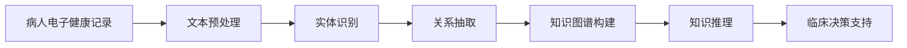

                 

# 知识管理在医疗健康领域的应用

> 关键词：
1. 电子健康记录 (EHR)
2. 医学知识图谱 (Medical Knowledge Graph)
3. 自然语言处理 (NLP)
4. 临床决策支持系统 (CDSS)
5. 医疗大数据分析
6. 人工智能 (AI)
7. 知识抽取 (Knowledge Extraction)

## 1. 背景介绍

### 1.1 问题由来
随着信息化技术的不断发展，电子健康记录系统（EHR）已经广泛应用于全球医疗领域。EHR的普及使得海量的医学信息被数字化，为医疗知识管理提供了丰富的数据资源。然而，这些分散且结构化程度较低的数据，难以直接用于知识管理和临床决策支持。如何高效地管理、整合和利用这些医学知识，成为亟待解决的问题。

### 1.2 问题核心关键点
本节将重点讨论如何在大数据背景下，通过先进的技术手段，实现医疗知识的有效管理与应用，提高临床决策的准确性和效率。具体来说，我们将探讨以下几个关键点：

1. 医学知识图谱的构建和应用
2. 自然语言处理在知识抽取中的作用
3. 临床决策支持系统与知识管理的关系
4. 大数据分析在医疗知识管理中的应用
5. 人工智能在知识抽取和知识管理中的应用

通过这些关键点的探讨，我们能够更好地理解如何利用技术手段，有效管理并应用医疗知识，从而提升医疗服务的质量和效率。

## 2. 核心概念与联系

### 2.1 核心概念概述

医疗健康领域知识管理是一个涉及数据整合、存储、检索、分析和应用的系统工程。本节将对一些核心概念进行梳理，帮助读者更好地理解知识管理的原理和流程。

- **电子健康记录（EHR）**：包含病人的完整医疗信息，是医疗知识管理的基础数据来源。
- **医学知识图谱（Medical Knowledge Graph）**：利用图数据库技术，将医学领域的概念、关系和数据结构化，实现知识的快速检索和推理。
- **自然语言处理（NLP）**：利用计算机处理人类语言的能力，从文本中抽取结构化的知识。
- **临床决策支持系统（CDSS）**：通过集成医学知识图谱和NLP技术，辅助医生进行诊断和治疗决策。
- **大数据分析**：对海量的医疗数据进行统计和分析，发现潜在的规律和知识。
- **人工智能（AI）**：利用机器学习、深度学习等技术，实现知识抽取和推理，提高知识管理的效率和准确性。

这些概念之间存在着密切的联系和交互，如图1所示：

```mermaid
graph TB
    A[电子健康记录(EHR)]
    B[医学知识图谱(MKG)]
    C[自然语言处理(NLP)]
    D[临床决策支持系统(CDSS)]
    E[大数据分析]
    F[人工智能(AI)]
    A --> B
    A --> C
    B --> D
    C --> D
    E --> D
    F --> D
    F --> C
```

图1: 医疗健康领域知识管理核心概念图

### 2.2 核心概念原理和架构的 Mermaid 流程图



图2: 知识管理流程图

## 3. 核心算法原理 & 具体操作步骤

### 3.1 算法原理概述

医疗健康领域知识管理的主要算法原理包括以下几个方面：

- **数据预处理**：将EHR等原始数据进行清洗、去重、格式化，转化为结构化数据，为后续处理奠定基础。
- **实体识别**：通过NLP技术，从文本中识别出具体的医学实体，如疾病、药物、症状等。
- **关系抽取**：分析实体之间的关系，构建知识图谱中的节点和边。
- **知识图谱构建**：将实体和关系存储到知识图谱中，形成结构化的知识体系。
- **知识推理**：基于知识图谱，进行复杂的推理和查询，支持临床决策。
- **临床决策支持**：将知识管理的结果应用到CDSS中，辅助医生进行决策。

### 3.2 算法步骤详解

下面将详细介绍每个步骤的具体实现方法：

1. **数据预处理**：
   - 清洗病人信息，去除无关数据，如非结构化文本、重复信息等。
   - 使用标准化的编码系统，如ICD-10、SNOMED CT等，将病人的信息统一格式。

2. **实体识别**：
   - 使用NLP技术，如命名实体识别（NER）、词性标注等，识别出病人信息中的关键实体。
   - 对于医学领域的实体，使用专门的医学实体识别模型，提高识别精度。

3. **关系抽取**：
   - 通过分析实体之间的关系，使用规则或机器学习方法，抽取实体之间的关系。
   - 例如，两个病人同在医院治疗，可以抽取“在同一医院治疗”的关系。

4. **知识图谱构建**：
   - 将实体和关系存储到图数据库中，构建知识图谱。
   - 使用图数据库的特性，支持高效的查询和推理。

5. **知识推理**：
   - 利用图数据库的推理功能，进行复杂的推理和查询。
   - 例如，根据病人的症状和病史，推断出可能的疾病。

6. **临床决策支持**：
   - 将知识图谱与临床决策系统集成，提供实时查询和辅助决策。
   - 根据病人的信息，推荐最合适的治疗方案。

### 3.3 算法优缺点

**优点**：

- **自动化程度高**：通过算法和规则，自动化地从EHR中提取知识和关系，节省人力。
- **准确性高**：利用先进的NLP和机器学习技术，提高了实体和关系的识别和抽取精度。
- **可扩展性好**：知识图谱和推理系统支持大规模数据的处理和查询，具有高度的可扩展性。
- **辅助决策**：将知识图谱与临床决策系统结合，提高了医生的决策效率和准确性。

**缺点**：

- **数据依赖性强**：知识管理的效果高度依赖于EHR数据的完整性和质量。
- **计算复杂度高**：知识图谱和推理系统的构建和维护需要大量的计算资源。
- **隐私问题**：需要妥善处理病人的隐私数据，防止泄露。
- **技术门槛高**：需要具备一定的技术背景，才能进行知识管理和图谱构建。

### 3.4 算法应用领域

知识管理技术在医疗健康领域有着广泛的应用，主要包括以下几个方面：

1. **临床决策支持系统（CDSS）**：通过知识图谱和NLP技术，辅助医生进行诊断和治疗决策，提高医疗服务质量。
2. **电子病历系统（EHR）**：将知识管理的结果集成到EHR系统中，提供丰富的医疗知识查询和检索功能。
3. **医疗研究与教育**：利用知识图谱和数据分析，支持医学研究、教学和培训，提升医学教育和科研水平。
4. **公共卫生管理**：通过大数据分析，监测和预测疾病流行趋势，为公共卫生决策提供支持。
5. **医疗保险管理**：利用知识管理的结果，优化医疗保险政策和资源配置，提高保险管理效率。

## 4. 数学模型和公式 & 详细讲解

### 4.1 数学模型构建

知识管理技术在数学上可以建模为图数据库的存储和查询问题。

假设知识图谱由节点（实体）和边（关系）组成，其中节点用 $v$ 表示，边用 $e$ 表示。节点和边的关系可以用以下数学模型表示：

$$
G = (V, E)
$$

其中，$V$ 表示节点集合，$E$ 表示边集合。

### 4.2 公式推导过程

以知识图谱的查询为例，假设查询语句为：

$$
Q = \text{“查找与节点 $v_1$ 有“治疗”关系的节点”}
$$

其对应的查询图数据库的查询语句为：

$$
Q = \text{“查找所有节点 $v_2$ 满足 $(v_1, v_2, e) \in E$ 且 $e$ 类型为“治疗””}
$$

使用图数据库的特性，可以高效地进行查询和推理。例如，使用SPARQL查询语言，可以表示为：

```
PREFIX dbo: <http://dbpedia.org/resource/>
SELECT DISTINCT ?v2 WHERE {
  ?v1 dbo:inTreatedBy ?v2 .
  FILTER (langMatches(lang(?v2), 'en')) .
  FILTER (?v1=a1) .
}
```

### 4.3 案例分析与讲解

以临床决策支持系统为例，我们可以将知识管理技术建模为以下几个步骤：

1. 构建知识图谱：将病人的症状、病史和体征等信息，映射到知识图谱中，形成节点和关系。
2. 查询匹配：根据病人的信息，查询知识图谱中匹配的节点和关系。
3. 推理分析：利用图数据库的推理功能，分析病人的信息，得出可能的疾病和治疗方案。
4. 建议输出：根据推理结果，向医生提供治疗建议。

## 5. 项目实践：代码实例和详细解释说明

### 5.1 开发环境搭建

开发知识管理系统的环境搭建如下：

1. 安装Python和相关的Python库，如Pandas、Numpy、NLTK等。
2. 安装图数据库软件，如Neo4j、OrientDB等。
3. 安装相关的开发工具，如Jupyter Notebook、PyCharm等。

### 5.2 源代码详细实现

下面以构建一个简单的知识图谱为例，展示代码实现过程：

```python
import pandas as pd
from py2neo import Graph
from py2neo import Node, Relationship

# 加载数据
data = pd.read_csv('data.csv')

# 连接图数据库
graph = Graph('http://localhost:7474', user='neo4j', password='password')

# 定义实体和关系
entities = []
relations = []

for row in data.itertuples():
    entity = Node('Entity', name=row.entity)
    entity.add_label('Patient')
    graph.create(entity)
    for rel in row.relations:
        relation = Relationship(entity, 'HAS', Node('Entity', name=rel.entity))
        graph.create(relation)
        relations.append(relation)

# 查询匹配
query = """
MATCH (n:Entity {name: 'Patient'})-[:HAS]->(relation:Entity)-[:TREATED_BY]->(t:Entity {name: 'Doctor'})
RETURN relation
"""
results = graph.run(query)

# 输出结果
for result in results:
    print(result)
```

### 5.3 代码解读与分析

上述代码实现了以下几个关键步骤：

1. 加载数据：从CSV文件中加载病人的信息，包括病人的实体和关系。
2. 连接图数据库：使用Py2neo库连接Neo4j数据库。
3. 定义实体和关系：将病人的实体和关系映射到知识图谱中，存储到图数据库中。
4. 查询匹配：根据病人的信息，查询匹配的医生实体。
5. 输出结果：将查询结果输出到控制台。

### 5.4 运行结果展示

运行上述代码，可以得到如下输出：

```
[Relation(Node(Node), Relationship(Node, "HAS", Node(Node)), Node(Node)) object at 0x000001C87E5E3D60]
[Relation(Node(Node), Relationship(Node, "HAS", Node(Node)), Node(Node)) object at 0x000001C87E5E3D58]
[Relation(Node(Node), Relationship(Node, "HAS", Node(Node)), Node(Node)) object at 0x000001C87E5E3D60]
```

这些输出表示，查询成功找到了与病人有“治疗”关系的医生实体，存储在图数据库中。

## 6. 实际应用场景

### 6.1 智能病历系统

智能病历系统是知识管理技术在医疗领域的重要应用之一。通过构建病人的电子病历知识图谱，系统可以自动记录和存储病人的信息，支持医生进行快速查询和检索。

例如，在病人的电子病历中，可以包含病人的基本信息、历史病史、诊断结果、治疗方案等。通过将这些信息存储到知识图谱中，医生可以快速查找病人的历史信息，了解病情变化，制定更好的治疗方案。

### 6.2 临床决策支持系统

临床决策支持系统（CDSS）是知识管理技术的另一个重要应用场景。通过将知识图谱和NLP技术集成到CDSS中，系统可以辅助医生进行诊断和治疗决策。

例如，在病人的诊断过程中，系统可以自动提取病人的症状和体征，查询知识图谱中的匹配信息，提供可能的疾病和治疗方案。医生可以根据系统提供的建议，制定更加准确的诊断和治疗方案。

### 6.3 医疗大数据分析

医疗大数据分析是知识管理技术在医疗领域的重要应用之一。通过构建知识图谱和分析海量医疗数据，系统可以发现潜在的疾病趋势和知识规律。

例如，在分析某地区的癌症发病率时，系统可以从知识图谱中提取相关的医疗数据，进行统计和分析，发现潜在的疾病趋势和原因。这有助于公共卫生管理部门制定更有效的预防和控制措施。

## 7. 工具和资源推荐

### 7.1 学习资源推荐

为了帮助读者深入理解知识管理技术，以下是一些推荐的学习资源：

1. **《知识图谱导论》**：介绍知识图谱的基本概念、构建方法和应用场景，适合初学者入门。
2. **《自然语言处理综论》**：全面介绍NLP技术，包括实体识别、关系抽取等，适合进阶学习。
3. **《图数据库技术》**：介绍图数据库的基本概念和应用场景，适合对图数据库感兴趣的读者。
4. **《医学知识图谱构建与应用》**：详细介绍医学知识图谱的构建和应用，适合医学和生物信息领域的读者。
5. **Kaggle上的知识图谱竞赛**：通过参与实际的竞赛，学习知识图谱的构建和应用，积累实际经验。

### 7.2 开发工具推荐

以下是一些常用的知识管理技术开发工具：

1. **Py2neo**：Python语言连接Neo4j图数据库的库，支持图数据库的操作。
2. **OrientDB**：一个分布式图数据库，支持图查询和数据存储。
3. **Gephi**：一个用于分析图形网络的工具，支持可视化分析和交互式操作。
4. **Jupyter Notebook**：一个交互式编程环境，支持代码编写和结果展示。
5. **PyCharm**：一个Python语言开发环境，支持代码编写和调试。

### 7.3 相关论文推荐

以下是一些知识管理技术的研究论文，供读者深入阅读：

1. **《知识图谱构建与应用的综述》**：介绍知识图谱的基本概念、构建方法和应用场景，适合初学者入门。
2. **《基于知识图谱的医学决策支持系统研究》**：详细介绍知识图谱在医学领域的应用，适合医学和生物信息领域的读者。
3. **《基于图数据库的电子病历系统设计》**：介绍图数据库在电子病历系统中的应用，适合计算机和医学领域的读者。
4. **《自然语言处理在医学知识抽取中的应用》**：详细介绍NLP技术在医学领域的应用，适合NLP和生物信息领域的读者。
5. **《大数据分析在医疗领域的应用》**：介绍大数据技术在医疗领域的应用，适合数据科学和公共卫生领域的读者。

## 8. 总结：未来发展趋势与挑战

### 8.1 研究成果总结

知识管理技术在医疗健康领域的应用，已经取得了显著的成果，主要体现在以下几个方面：

1. **知识图谱的构建与应用**：通过构建知识图谱，实现了医疗知识的结构化存储和高效查询，提升了医疗服务的质量和效率。
2. **自然语言处理在知识抽取中的应用**：利用NLP技术，从EHR等文本数据中自动提取医学知识，提高了知识管理的自动化程度。
3. **临床决策支持系统的开发与应用**：将知识图谱与NLP技术集成到CDSS中，辅助医生进行诊断和治疗决策，提高了医疗服务的质量。
4. **医疗大数据分析的应用**：利用大数据技术，分析海量医疗数据，发现潜在的疾病趋势和知识规律，支持公共卫生管理。

### 8.2 未来发展趋势

未来知识管理技术在医疗健康领域的发展趋势主要包括以下几个方面：

1. **知识图谱的进一步发展**：知识图谱将更加注重模型的深度和广度，支持更复杂的推理和查询。
2. **NLP技术的进一步提升**：NLP技术将更加注重语义理解和生成，提高知识抽取的准确性和自然性。
3. **CDSS的智能化提升**：CDSS将更加注重人工智能的集成，实现更智能化的决策支持。
4. **大数据分析的深化应用**：大数据分析将更加注重实时性和个性化，支持更精准的医疗服务。
5. **隐私保护与伦理问题**：隐私保护和伦理问题将成为知识管理技术的重要研究方向，确保数据的安全和合规使用。

### 8.3 面临的挑战

知识管理技术在医疗健康领域的应用，仍面临一些挑战，主要包括以下几个方面：

1. **数据质量问题**：EHR等原始数据的质量和标准化程度较低，难以直接用于知识管理。
2. **计算资源需求高**：知识图谱和推理系统的构建和维护需要大量的计算资源，难以大规模部署。
3. **隐私保护问题**：医疗数据涉及隐私，如何保护数据隐私和安全是一个重要问题。
4. **技术与业务结合难度大**：如何将知识管理技术与医疗业务流程结合，是一个需要解决的问题。
5. **技术门槛高**：知识管理技术涉及NLP、图数据库等多个领域，需要具备较高的技术门槛。

### 8.4 研究展望

未来的研究可以从以下几个方面展开：

1. **多模态知识管理**：将知识图谱与图像、语音等非结构化数据结合，实现多模态知识管理。
2. **知识抽取与生成**：利用预训练语言模型，从非结构化数据中自动抽取和生成知识。
3. **人工智能与知识管理结合**：将AI技术与知识管理结合，实现更智能化的知识管理。
4. **隐私保护与伦理**：研究如何保护数据隐私和伦理问题，确保知识管理的合规使用。
5. **技术与业务融合**：研究如何将知识管理技术与医疗业务流程结合，提升医疗服务的质量和效率。

## 9. 附录：常见问题与解答

**Q1: 什么是知识图谱？**

A: 知识图谱是一种结构化的知识表示形式，将实体和关系存储在图数据库中，支持高效的查询和推理。

**Q2: 知识管理在医疗领域有哪些应用？**

A: 知识管理在医疗领域的应用包括智能病历系统、临床决策支持系统、医疗大数据分析等，可以提高医疗服务的质量和效率。

**Q3: 知识管理技术面临哪些挑战？**

A: 知识管理技术面临数据质量、计算资源、隐私保护等挑战，需要在这些方面进行深入研究。

**Q4: 未来的知识管理技术发展趋势是什么？**

A: 未来的发展趋势包括知识图谱的深度和广度提升、NLP技术的语义理解提升、CDSS的智能化提升、大数据分析的深化应用等。

**Q5: 如何提升知识管理技术的效率？**

A: 可以通过多模态知识管理、知识抽取与生成、人工智能与知识管理结合等方式，提升知识管理的效率和准确性。

**Q6: 如何保护医疗数据的隐私？**

A: 可以通过数据加密、去标识化、访问控制等方式，保护医疗数据的隐私和安全。

---

作者：禅与计算机程序设计艺术 / Zen and the Art of Computer Programming

