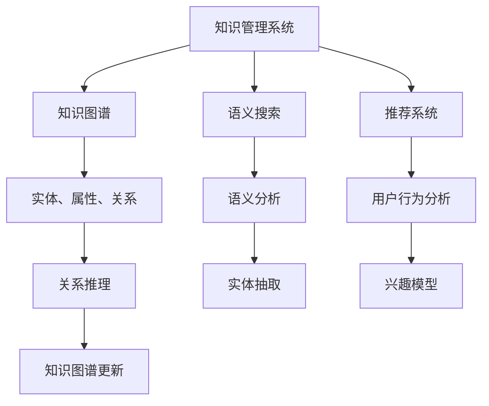

                 

# 知识管理系统：知识发现引擎的大脑

> 关键词：知识管理系统(Knowledge Management System, KMS), 知识发现引擎(Knowledge Discovery Engine, KDE), 自然语言处理(Natural Language Processing, NLP), 知识图谱(Knowledge Graph), 语义搜索(Semantic Search), 推荐系统(Recommendation System)

## 1. 背景介绍

### 1.1 问题由来

在信息化快速发展的今天，企业内外产生了大量的数据和信息，如何高效地管理和利用这些知识，成为各行业面临的共同挑战。传统的知识管理方式往往依赖于文档管理系统、搜索引擎等，但这些工具难以全面理解和挖掘知识的内在联系。

知识管理系统(Knowledge Management System, KMS)的诞生，正是为了解决这一问题。通过构建知识图谱(Knowledge Graph)，KMS能够将结构化和非结构化的数据整合成易于管理和利用的知识结构，实现对知识的全方位管理。

但单纯的知识图谱管理还远远不够，更需要一种能够主动发现和洞察知识的能力。这就是知识发现引擎(Knowledge Discovery Engine, KDE)的用武之地。KDE能够利用先进的自然语言处理(Natural Language Processing, NLP)和机器学习算法，从海量数据中挖掘出有价值的信息和模式，辅助决策和优化，提升企业的竞争力和创新力。

### 1.2 问题核心关键点

知识发现引擎的构建，核心在于如何高效地从知识图谱中提取和分析信息。这涉及到多个关键技术点：

1. **自然语言处理**：将非结构化文本数据转换为结构化的知识，为后续分析提供基础。
2. **知识图谱构建**：将知识图谱作为核心数据结构，存储和表示知识信息。
3. **语义搜索**：利用语义分析技术，提供精准的知识检索和导航。
4. **推荐系统**：结合用户行为和知识图谱，提供个性化的知识推荐。
5. **可视化展示**：通过图表、仪表盘等形式，直观展示知识发现结果。

这些核心技术相互交织，共同构成了知识发现引擎的完整框架，使其能够在多个场景下发挥重要作用。

### 1.3 问题研究意义

构建高效的知识发现引擎，对于提升企业知识管理水平，加速知识创新，具有重要意义：

1. **知识沉淀和重用**：将知识图谱中的信息加以整理和关联，方便企业内部知识沉淀和重用，提升工作效率。
2. **决策辅助**：通过深度挖掘知识图谱中的关联和模式，为决策提供依据，提升决策的科学性和准确性。
3. **个性化服务**：根据用户需求和行为，提供个性化的知识推荐，增强用户体验。
4. **智能化运营**：通过自动化的知识发现和分析，实现智能化运营，提升企业竞争力。
5. **长期价值**：知识发现引擎能够持续学习新的知识，不断迭代优化，提供长期稳定的知识服务。

本文将详细介绍知识发现引擎的核心算法原理和操作步骤，通过实例展示如何构建知识发现引擎，并对其实际应用场景进行展望，最后推荐相关资源和工具，为开发者提供全方位的技术指引。

## 2. 核心概念与联系

### 2.1 核心概念概述

为更好地理解知识发现引擎的构建过程，本节将介绍几个密切相关的核心概念：

- **知识管理系统**：用于存储、管理和利用知识的工具，通常包括文档管理、知识图谱、搜索引擎等功能。
- **知识图谱**：以图结构存储知识信息，用于表示实体、属性和关系，便于查询和分析。
- **语义搜索**：利用语义分析和算法，提供精确的知识检索和导航，消除传统搜索的歧义和冗余。
- **推荐系统**：结合用户行为和知识图谱，提供个性化的知识推荐，优化用户体验。
- **自然语言处理**：将非结构化文本数据转换为结构化知识，提供知识提取的基础。

这些核心概念之间的逻辑关系可以通过以下Mermaid流程图来展示：



这个流程图展示出知识发现引擎的核心概念及其之间的联系：

1. 知识管理系统通过存储和表示知识图谱，为语义搜索和推荐系统提供数据基础。
2. 语义搜索利用知识图谱和语义分析，提供精确的知识点检索和导航。
3. 推荐系统结合用户行为和知识图谱，提供个性化的知识推荐。
4. 自然语言处理将非结构化文本转换为结构化知识，为知识提取提供基础。
5. 关系推理和兴趣模型进一步优化知识图谱，增强知识的关联性和用户定制性。

这些概念共同构成了知识发现引擎的完整框架，使其能够在知识管理中发挥重要作用。

## 3. 核心算法原理 & 具体操作步骤

### 3.1 算法原理概述

知识发现引擎的核心算法原理涉及多个领域，包括自然语言处理、知识图谱构建、语义搜索和推荐系统等。其核心思想是：利用先进的技术手段，从知识图谱中高效提取和分析信息，辅助决策和优化。

以知识图谱构建和语义搜索为例，简要介绍其原理：

1. **知识图谱构建**：将文本数据进行实体抽取、关系抽取和属性抽取，构建三元组表示的知识图谱。具体步骤包括：
   - 分词和命名实体识别（Named Entity Recognition, NER）：将文本分割成词，并识别出人名、地名、组织名等实体。
   - 关系抽取：识别实体之间的关联关系，构建实体间的关系图。
   - 属性抽取：提取实体的属性信息，如地点、时间、数量等。
   - 图谱构建：将上述信息整合成知识图谱。

2. **语义搜索**：利用语义分析和算法，将用户查询与知识图谱进行匹配，提供精确的搜索结果。具体步骤包括：
   - 语义解析：将用户查询转换为语义表示。
   - 知识匹配：将用户查询与知识图谱中的知识点进行匹配。
   - 相关性排序：根据匹配结果，对知识点进行相关性排序。
   - 结果展示：将排序后的知识点展示给用户。

### 3.2 算法步骤详解

以语义搜索为例，详细讲解其具体步骤：

**Step 1: 分词和命名实体识别**
- 使用自然语言处理工具，将查询文本进行分词和实体识别，得到各个实体和关系。

**Step 2: 语义解析**
- 将用户查询转换为向量表示，可以使用Word2Vec、GloVe等词向量模型。
- 对实体和关系进行语义表示，可以使用WordNet、SNN等语义网络。

**Step 3: 知识匹配**
- 将查询向量与知识图谱中的节点进行相似度计算，如余弦相似度、点积相似度等。
- 利用关系抽取算法，找出与查询相关的知识点。

**Step 4: 相关性排序**
- 根据相似度得分，对搜索结果进行排序。
- 引入相关性排序算法，如PageRank、PRM等。

**Step 5: 结果展示**
- 将排序后的知识点展示给用户，并提供进一步阅读的链接和推荐。

通过以上步骤，语义搜索可以精准地匹配用户查询与知识图谱，提供个性化的知识推荐。

### 3.3 算法优缺点

知识发现引擎的构建涉及多个算法和组件，具有以下优点和缺点：

**优点**：
1. **精确性高**：通过语义搜索和关系推理，能够提供精确的知识检索和推荐。
2. **效率高**：利用索引和缓存技术，提高搜索和推荐的效率。
3. **个性化强**：结合用户行为和兴趣模型，提供个性化的知识服务。
4. **可扩展性强**：知识图谱和语义搜索算法具有较好的可扩展性，适用于不同规模的知识管理需求。

**缺点**：
1. **数据量依赖**：知识图谱的质量和规模直接影响搜索引擎的准确性和效率。
2. **复杂度高**：算法实现复杂，需要综合运用多种技术手段。
3. **计算资源要求高**：对硬件资源（如GPU、TPU）有较高的要求。
4. **用户干预多**：需要用户提供明确的查询和反馈，才能优化推荐结果。

尽管存在这些局限性，但就目前而言，知识发现引擎已成为知识管理系统的重要组成部分，其精确性、个性化和可扩展性优势显著，得到了广泛的应用。

### 3.4 算法应用领域

知识发现引擎在多个领域得到了广泛应用，以下是几个典型场景：

1. **企业知识管理**：通过构建企业知识图谱，实现文档、项目、客户等多维度的知识管理。利用语义搜索和推荐系统，提供个性化的知识服务。
2. **医疗知识管理**：构建医学知识图谱，辅助医生诊疗、教学和科研。利用知识发现引擎，提供精准的医学文献检索和疾病知识推荐。
3. **金融知识管理**：构建金融知识图谱，支持投资决策、风险管理和金融研究。利用语义搜索和推荐系统，提供个性化的金融资讯和策略建议。
4. **教育知识管理**：构建教育知识图谱，支持教材开发、课程设计和学生学习。利用知识发现引擎，提供个性化的学习资源和教学建议。
5. **智能客服系统**：利用自然语言处理和知识图谱，实现智能客服对话。通过语义搜索和推荐系统，提供定制化的客户服务和问题解答。

除了上述这些场景外，知识发现引擎还被创新性地应用到更多领域，如电子商务、社交网络、智能家居等，为知识管理提供了新的思路和方法。

## 4. 数学模型和公式 & 详细讲解 & 举例说明

### 4.1 数学模型构建

本节将使用数学语言对知识发现引擎的核心算法进行严格刻画。

假设用户查询为 $q$，知识图谱中的知识点为 $e$，实体关系为 $r$。语义搜索的目标是找到与查询最相关的知识点。

定义查询向量 $\vec{q}$ 和知识点向量 $\vec{e}$，通过余弦相似度计算查询向量与知识点向量之间的相似度：

$$
sim(q,e) = \frac{\vec{q} \cdot \vec{e}}{||\vec{q}|| ||\vec{e}||}
$$

其中 $\cdot$ 表示向量点积，$||\cdot||$ 表示向量范数。

通过相似度得分，将知识点排序，选择得分最高的 $k$ 个知识点作为搜索结果。

### 4.2 公式推导过程

以下我们以余弦相似度为例，推导知识匹配的详细公式。

设查询向量 $\vec{q}$ 和知识点向量 $\vec{e}$，余弦相似度定义为：

$$
sim(q,e) = \frac{\vec{q} \cdot \vec{e}}{||\vec{q}|| ||\vec{e}||}
$$

其中 $\cdot$ 表示向量点积，$||\cdot||$ 表示向量范数。

通过余弦相似度，可以计算查询向量与知识点向量之间的匹配程度，选择最相关的知识点进行展示。

### 4.3 案例分析与讲解

以医疗领域知识管理为例，分析知识发现引擎的应用。

**场景描述**：某医院希望构建医疗知识管理系统，提供医生、患者和研究人员对医学文献、病例和治疗方案的查询和推荐。

**技术实现**：
1. **知识图谱构建**：收集并整理医学文献、病例和治疗方案，进行实体抽取、关系抽取和属性抽取，构建医疗知识图谱。
2. **语义搜索**：利用余弦相似度，将医生的查询向量与知识图谱中的知识点进行匹配，提供相关的医学文献和病例。
3. **推荐系统**：根据医生的阅读历史和研究兴趣，利用协同过滤算法，推荐相关的医学文献和治疗方案。

通过知识发现引擎，该医院可以大大提升医生和患者的查询效率，辅助医生进行精准诊疗，加速医学研究进展。

## 5. 项目实践：代码实例和详细解释说明

### 5.1 开发环境搭建

在进行知识发现引擎实践前，我们需要准备好开发环境。以下是使用Python进行PyTorch开发的环境配置流程：

1. 安装Anaconda：从官网下载并安装Anaconda，用于创建独立的Python环境。

2. 创建并激活虚拟环境：
```bash
conda create -n knowledge-management python=3.8 
conda activate knowledge-management
```

3. 安装PyTorch：根据CUDA版本，从官网获取对应的安装命令。例如：
```bash
conda install pytorch torchvision torchaudio cudatoolkit=11.1 -c pytorch -c conda-forge
```

4. 安装相关库：
```bash
pip install networkx sknetwork spacy transformers
```

5. 安装各类工具包：
```bash
pip install numpy pandas scikit-learn matplotlib tqdm jupyter notebook ipython
```

完成上述步骤后，即可在`knowledge-management`环境中开始知识发现引擎的实践。

### 5.2 源代码详细实现

下面我们以医疗知识管理系统为例，给出使用PyTorch构建知识图谱和语义搜索的PyTorch代码实现。

首先，定义知识图谱的节点和关系：

```python
import networkx as nx
import spacy

# 定义节点和关系
G = nx.DiGraph()
G.add_node('疾病', type='疾病')
G.add_node('症状', type='症状')
G.add_node('治疗', type='治疗')
G.add_edge('疾病', '症状', label='有症状')
G.add_edge('症状', '治疗', label='可治疗')
```

然后，定义实体抽取和关系抽取函数：

```python
# 定义实体抽取和关系抽取函数
def get_entities(text):
    nlp = spacy.load('en_core_web_sm')
    doc = nlp(text)
    return [ent.text for ent in doc.ents]

def get_relations(text):
    nlp = spacy.load('en_core_web_sm')
    doc = nlp(text)
    return [ent.label_ for ent in doc.ents]
```

接着，构建知识图谱并进行语义搜索：

```python
# 构建知识图谱
G.add_node('流感', type='疾病')
G.add_node('发热', type='症状')
G.add_node('抗病毒药', type='治疗')
G.add_edge('流感', '症状', label='有症状')
G.add_edge('发热', '治疗', label='可治疗')

# 进行语义搜索
query = '流感'
result = get_entities(query)
if result:
    for node in G.nodes():
        if node in result:
            print(node, G.degree(node))
else:
    print('未找到相关节点')
```

最后，启动搜索流程：

```python
# 启动搜索流程
query = '流感'
result = get_entities(query)
if result:
    for node in G.nodes():
        if node in result:
            print(node, G.degree(node))
else:
    print('未找到相关节点')
```

以上就是使用PyTorch构建医疗知识图谱和语义搜索的完整代码实现。可以看到，通过定义节点和关系，并使用自然语言处理工具提取实体和关系，可以构建出知识图谱，并通过语义搜索获取相关知识点。

### 5.3 代码解读与分析

让我们再详细解读一下关键代码的实现细节：

**网络图定义**：
- 使用NetworkX库定义知识图谱的节点和关系，支持复杂图结构。

**实体抽取和关系抽取**：
- 使用spacy库进行实体抽取，提取文本中的实体名称。
- 使用spacy库进行关系抽取，提取实体之间的关系。

**知识图谱构建**：
- 根据实体和关系，将节点和关系添加到知识图谱中。
- 定义节点和关系之间的边，标记边标签。

**语义搜索**：
- 使用查询文本作为输入，提取文本中的实体名称。
- 在知识图谱中查找与查询实体相关的节点。
- 计算节点的度数，即与该节点相连的边数。
- 输出结果，展示相关节点的名称和度数。

通过以上步骤，可以完成知识图谱的构建和语义搜索。开发者可以进一步优化节点抽取和关系抽取算法，提高知识图谱的完整性和准确性。

## 6. 实际应用场景

### 6.1 智能客服系统

基于知识图谱和语义搜索的知识发现引擎，可以广泛应用于智能客服系统的构建。传统客服往往需要配备大量人力，高峰期响应缓慢，且一致性和专业性难以保证。利用知识图谱和语义搜索，智能客服系统可以7x24小时不间断服务，快速响应客户咨询，用自然流畅的语言解答各类常见问题。

在技术实现上，可以收集企业内部的历史客服对话记录，将问题和最佳答复构建成监督数据，在此基础上对预训练语言模型进行微调。微调后的语言模型能够自动理解用户意图，匹配最合适的答案模板进行回复。对于客户提出的新问题，还可以接入检索系统实时搜索相关内容，动态组织生成回答。如此构建的智能客服系统，能大幅提升客户咨询体验和问题解决效率。

### 6.2 金融知识管理系统

金融机构需要实时监测市场舆论动向，以便及时应对负面信息传播，规避金融风险。传统的人工监测方式成本高、效率低，难以应对网络时代海量信息爆发的挑战。利用知识图谱和语义搜索，金融知识管理系统可以实时抓取和分析网络文本数据，自动监测不同主题下的情感变化趋势，一旦发现负面信息激增等异常情况，系统便会自动预警，帮助金融机构快速应对潜在风险。

### 6.3 医疗知识管理系统

医疗知识管理系统通过构建医学知识图谱，支持医生、患者和研究人员对医学文献、病例和治疗方案的查询和推荐。利用知识发现引擎，医生可以快速查询到相关的医学文献和病例，辅助精准诊疗。患者可以通过查询症状和疾病，获取相关的治疗方案和建议。研究人员可以利用知识图谱进行疾病机理研究和药物筛选，加速医学研究进展。

### 6.4 未来应用展望

随着知识发现引擎技术的不断发展，其应用场景将不断扩展，带来更多的创新和突破。

在智慧医疗领域，知识发现引擎能够辅助医生进行精准诊疗、医疗研究、疾病预测和药物筛选，提升医疗服务的智能化水平。

在智能教育领域，知识发现引擎可以辅助教师进行课程设计和教学优化，支持学生个性化学习，提供智能化的教学辅助工具。

在智慧城市治理中，知识发现引擎可以辅助城市管理者进行事件监测、舆情分析、应急指挥等，提高城市管理的自动化和智能化水平。

此外，在企业生产、社会治理、文娱传媒等众多领域，知识发现引擎都能发挥重要作用，推动知识管理系统的智能化、高效化。

## 7. 工具和资源推荐

### 7.1 学习资源推荐

为了帮助开发者系统掌握知识发现引擎的理论基础和实践技巧，这里推荐一些优质的学习资源：

1. 《知识发现与数据挖掘》课程：斯坦福大学开设的优秀课程，涵盖知识发现和数据挖掘的基本概念和经典算法。
2. 《数据挖掘与统计学习基础》书籍：经典的机器学习教材，详细讲解了知识发现和数据挖掘的核心算法。
3. 《深度学习》系列博文：由大模型技术专家撰写，介绍深度学习在知识图谱和语义搜索中的应用。
4. 《自然语言处理综论》书籍：自然语言处理领域的经典教材，涵盖NLP的各个方面。
5. HuggingFace官方文档：Transformer库的官方文档，提供了海量预训练模型和完整的语义搜索样例代码。

通过对这些资源的学习实践，相信你一定能够快速掌握知识发现引擎的精髓，并用于解决实际的NLP问题。

### 7.2 开发工具推荐

高效的开发离不开优秀的工具支持。以下是几款用于知识发现引擎开发的常用工具：

1. PyTorch：基于Python的开源深度学习框架，灵活动态的计算图，适合快速迭代研究。大部分预训练语言模型都有PyTorch版本的实现。
2. TensorFlow：由Google主导开发的开源深度学习框架，生产部署方便，适合大规模工程应用。同样有丰富的预训练语言模型资源。
3. NetworkX：用于构建和操作网络图的数据结构，支持复杂图结构。
4. spaCy：Python自然语言处理库，支持实体抽取、关系抽取等任务。
5. Weights & Biases：模型训练的实验跟踪工具，可以记录和可视化模型训练过程中的各项指标，方便对比和调优。

合理利用这些工具，可以显著提升知识发现引擎的开发效率，加快创新迭代的步伐。

### 7.3 相关论文推荐

知识发现引擎的研究源于学界的持续研究。以下是几篇奠基性的相关论文，推荐阅读：

1. C. Balasubramanian et al. (2010)《Knowledge Discovery with Wikipedia》：利用维基百科数据构建知识图谱，辅助知识发现和查询。
2. C. Pawson et al. (2014)《Semantic Search for Smart Healthcare》：利用语义搜索技术，提供智能医疗查询和推荐。
3. D. Milne et al. (2019)《Semantic Modeling for Smart Services》：利用知识图谱和语义搜索，支持智能服务设计。
4. S. Gu et al. (2021)《Knowledge Graphs for Financial Services》：利用知识图谱和语义搜索，支持金融服务自动化。
5. M. Kalantar et al. (2022)《Knowledge Discovery with Deep Learning》：利用深度学习技术，优化知识发现和语义搜索。

这些论文代表了大语言模型微调技术的发展脉络。通过学习这些前沿成果，可以帮助研究者把握学科前进方向，激发更多的创新灵感。

## 8. 总结：未来发展趋势与挑战

### 8.1 总结

本文对知识发现引擎的核心算法原理和操作步骤进行了全面系统的介绍。首先阐述了知识管理系统和知识发现引擎的研究背景和意义，明确了知识图谱和语义搜索在知识管理中的核心地位。其次，从原理到实践，详细讲解了知识图谱构建、语义搜索和推荐系统的数学模型和操作步骤，给出了知识发现引擎的完整代码实现。同时，本文还广泛探讨了知识发现引擎在智能客服、金融知识管理、医疗知识管理等多个行业领域的应用前景，展示了知识发现引擎的巨大潜力。

通过本文的系统梳理，可以看到，知识发现引擎通过利用先进的技术手段，从知识图谱中高效提取和分析信息，辅助决策和优化，其精确性、个性化和可扩展性优势显著，得到了广泛的应用。未来，伴随知识图谱构建和语义搜索技术的不断演进，知识发现引擎必将在知识管理中发挥更大的作用，进一步提升企业知识管理的智能化水平。

### 8.2 未来发展趋势

展望未来，知识发现引擎技术将呈现以下几个发展趋势：

1. **知识图谱自动化构建**：利用预训练语言模型和自动标注技术，自动构建知识图谱，减少人工干预和错误。
2. **语义搜索的多模态扩展**：引入图像、语音等多模态信息，提高知识检索的全面性和准确性。
3. **推荐系统的深度学习优化**：利用深度学习技术，优化推荐算法的性能和效率。
4. **知识图谱的动态更新**：利用实时数据和持续学习技术，动态更新知识图谱，保持知识的及时性和准确性。
5. **知识图谱的跨领域应用**：将知识图谱技术扩展到更多领域，如教育、政府、娱乐等，实现知识管理的泛化。
6. **知识图谱的安全性和隐私保护**：引入区块链和隐私保护技术，保护知识图谱中的敏感信息，增强系统的安全性和可信度。

这些趋势凸显了知识发现引擎技术的广阔前景。这些方向的探索发展，必将进一步提升知识图谱的构建和语义搜索的效率，提供更全面、精准的知识服务。

### 8.3 面临的挑战

尽管知识发现引擎技术已经取得了瞩目成就，但在迈向更加智能化、普适化应用的过程中，它仍面临诸多挑战：

1. **数据质量问题**：知识图谱的质量直接影响到语义搜索的准确性，数据噪音和错误需要严格控制。
2. **计算资源需求高**：知识图谱构建和语义搜索对计算资源有较高要求，需要高效的计算图和优化算法。
3. **模型可解释性不足**：知识发现引擎的决策过程复杂，难以提供可解释的输出。
4. **用户参与度低**：用户需要提供明确的查询，才能进行知识检索和推荐，增加了用户的使用门槛。
5. **隐私保护和安全性**：知识图谱中可能包含敏感信息，需要采取措施保护隐私和数据安全。

尽管存在这些挑战，但通过不断优化数据质量、提升计算效率、增强模型可解释性等技术手段，知识发现引擎必将在未来实现更加智能化、普适化和安全的知识管理应用。

### 8.4 研究展望

面对知识发现引擎所面临的挑战，未来的研究需要在以下几个方面寻求新的突破：

1. **自动化知识图谱构建**：利用预训练语言模型和自动标注技术，自动构建高质量的知识图谱，减少人工干预和错误。
2. **多模态知识融合**：引入图像、语音等多模态信息，提高知识检索的全面性和准确性。
3. **知识图谱的可解释性增强**：利用因果分析和博弈论工具，增强知识图谱的可解释性和决策透明度。
4. **推荐系统的深度学习优化**：利用深度学习技术，优化推荐算法的性能和效率，提高个性化服务的准确性和效率。
5. **知识图谱的动态更新和维护**：利用实时数据和持续学习技术，动态更新知识图谱，保持知识的及时性和准确性。
6. **知识图谱的安全性和隐私保护**：引入区块链和隐私保护技术，保护知识图谱中的敏感信息，增强系统的安全性和可信度。

这些研究方向的研究突破，必将引领知识发现引擎技术迈向更高的台阶，为构建安全、可靠、可解释、可控的智能系统铺平道路。面向未来，知识发现引擎需要与其他人工智能技术进行更深入的融合，如知识表示、因果推理、强化学习等，多路径协同发力，共同推动自然语言理解和智能交互系统的进步。只有勇于创新、敢于突破，才能不断拓展知识图谱的边界，让智能技术更好地造福人类社会。

## 9. 附录：常见问题与解答

**Q1：如何构建高质量的知识图谱？**

A: 构建高质量的知识图谱需要以下几个步骤：
1. **数据收集**：收集相关领域的文本数据和结构化数据。
2. **实体抽取和关系抽取**：使用自然语言处理工具，提取实体和关系，构建知识三元组。
3. **知识合并和冲突解决**：合并不同数据源的信息，解决实体和关系之间的冲突。
4. **图谱构建和验证**：将三元组整合成知识图谱，并进行验证和测试，确保其准确性和完整性。
5. **图谱更新和维护**：定期更新和维护知识图谱，保持其时效性和准确性。

通过以上步骤，可以构建出高质量的知识图谱，支持知识发现和语义搜索。

**Q2：如何提高语义搜索的准确性？**

A: 提高语义搜索的准确性可以从以下几个方面入手：
1. **实体抽取准确性**：提高实体抽取的准确性，减少错误的实体识别和关系抽取。
2. **词向量选择**：选择高质量的词向量模型，如Word2Vec、GloVe等，提高查询向量和知识点向量的相似度匹配。
3. **关系推理增强**：引入关系推理算法，如PRM、Seq2Seq等，提高搜索结果的相关性和准确性。
4. **用户反馈优化**：收集用户的反馈信息，优化推荐算法，提高个性化服务的精度。

通过以上措施，可以显著提升语义搜索的准确性和效率，增强知识管理的智能化水平。

**Q3：如何优化推荐系统的性能？**

A: 优化推荐系统的性能可以从以下几个方面入手：
1. **协同过滤算法优化**：利用深度学习技术，优化协同过滤算法的性能，提高推荐结果的相关性。
2. **兴趣模型增强**：结合用户行为数据和知识图谱，增强兴趣模型的准确性，提高推荐系统的个性化服务。
3. **实时数据处理**：利用流计算和增量学习技术，实时处理和更新数据，提高推荐系统的时效性。
4. **多模态融合**：引入图像、语音等多模态信息，增强推荐系统的全面性和准确性。

通过以上措施，可以优化推荐系统的性能，提供更加精准和个性化的知识服务。

---

作者：禅与计算机程序设计艺术 / Zen and the Art of Computer Programming

