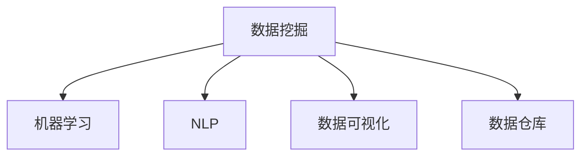

                 

# 知识管理革命：知识发现引擎的主场秀

> 关键词：知识发现引擎,数据挖掘,机器学习,自然语言处理,数据可视化,数据仓库

## 1. 背景介绍

### 1.1 问题由来
随着数字化转型的加速和数据量的激增，企业不再满足于传统的报表和文档管理，而是希望通过深度分析挖掘数据中的知识，以支持决策、优化运营和推动创新。然而，面对日益复杂的数据结构和高维度的海量数据，传统的知识管理方式显得力不从心。知识发现引擎(Knowledge Discovery Engine, KDE)应运而生，通过结合数据挖掘、机器学习、自然语言处理等技术，高效、智能地从海量数据中发现隐含的知识和模式。

### 1.2 问题核心关键点
知识发现引擎的核心在于从大规模数据中提取有价值的知识。它利用先进的算法模型对数据进行多维度分析，识别出潜在的关联、趋势、异常等信息，为业务决策提供依据。关键点包括：

- **数据挖掘**：从数据集中自动、智能地提取信息。
- **机器学习**：利用算法模型从数据中学习规律和知识。
- **自然语言处理(NLP)**：解析和处理文本数据，提取关键信息。
- **数据可视化**：将分析结果直观展示，便于理解和决策。
- **数据仓库**：整合数据，构建统一的数据存储和管理平台。

### 1.3 问题研究意义
知识发现引擎对于提升企业数据驱动决策能力、优化运营效率、加速创新具有重要意义：

- **增强决策支持**：通过分析历史数据和实时数据，识别趋势和模式，为企业提供更准确的决策支持。
- **优化运营管理**：发现生产过程中的瓶颈和改进机会，优化资源配置。
- **推动创新发展**：从大量数据中提取前沿科技和市场需求，驱动新产品的开发和现有业务的创新。
- **提高数据利用率**：通过自动化数据处理和分析，释放人力资源，提高数据资产的利用效率。

## 2. 核心概念与联系

### 2.1 核心概念概述

为更好地理解知识发现引擎的工作原理和优化方向，本节将介绍几个密切相关的核心概念：

- **数据挖掘**：从数据集中自动发现并抽取有用信息和知识的过程。
- **机器学习**：利用算法模型学习数据中的模式和规律，实现预测、分类等任务。
- **自然语言处理(NLP)**：通过语言模型解析和生成文本数据，提取关键信息。
- **数据可视化**：将分析结果以图表、仪表盘等方式直观展示，辅助理解和决策。
- **数据仓库**：集中管理数据，提供高效的数据查询和分析功能。

这些核心概念之间的逻辑关系可以通过以下Mermaid流程图来展示：



这个流程图展示了一些关键组件及其之间的关系：

1. 数据挖掘对原始数据进行初步处理和分析，发现有用的特征和模式。
2. 机器学习利用算法模型从数据中学习规律，实现更深入的分析和预测。
3. NLP解析文本数据，提取关键信息，辅助理解和分析。
4. 数据可视化将分析结果直观展示，便于理解和决策。
5. 数据仓库集中管理数据，为分析提供高效的支持。

这些组件共同构成了知识发现引擎的核心框架，使得企业能够从海量数据中发现潜在的知识和价值。

## 3. 核心算法原理 & 具体操作步骤
### 3.1 算法原理概述

知识发现引擎的核心原理是利用数据挖掘、机器学习、NLP等技术，从大规模数据中提取知识。其核心思想是：通过对数据集进行多维度的分析和建模，发现数据中的模式、趋势和异常，从而为业务决策提供支持。

知识发现引擎通常包括以下几个关键步骤：

1. **数据预处理**：清洗、归一化、特征选择等步骤，提高数据质量。
2. **特征工程**：提取、选择、构建特征，为机器学习模型提供输入。
3. **模型训练与评估**：选择合适的模型，利用数据进行训练和评估，优化模型参数。
4. **知识发现与可视化**：将模型应用于新数据，发现知识并可视化展示。

### 3.2 算法步骤详解

知识发现引擎的实现过程涉及多个技术环节，以下以一个典型案例为例，详细讲解其实现步骤。

**案例背景**：一家电商平台希望利用用户行为数据预测用户购买倾向，优化推荐系统，提升用户体验和销售额。

**步骤 1: 数据预处理**

- 收集平台上的用户点击、浏览、购买等行为数据。
- 清洗数据，去除异常值和噪声，处理缺失值。
- 归一化特征，使其在相同量纲下进行比较。
- 特征选择，选择与购买行为相关的关键特征。

**步骤 2: 特征工程**

- 构建用户行为特征，如浏览时间、点击次数、购买频率等。
- 引入时间特征，考虑用户行为的时序性。
- 引入交叉特征，考虑不同特征间的交互影响。
- 将文本数据转化为向量，供NLP模型处理。

**步骤 3: 模型训练与评估**

- 选择合适的机器学习算法，如逻辑回归、随机森林、深度学习等。
- 利用历史数据进行模型训练，调整模型参数。
- 在验证集上评估模型性能，选择合适的超参数。
- 使用交叉验证等技术，确保模型泛化能力。

**步骤 4: 知识发现与可视化**

- 将模型应用于新数据，预测用户购买倾向。
- 将预测结果和实际购买行为进行对比，发现预测误差。
- 利用可视化工具，如Tableau、Power BI等，将分析结果直观展示。
- 定期更新模型，确保其与最新数据保持一致。

### 3.3 算法优缺点

知识发现引擎具有以下优点：

- **高效自动**：能够自动处理大规模数据，发现潜在知识和模式。
- **精准分析**：通过多维度分析和建模，提高分析的准确性和深度。
- **实时更新**：能够快速响应数据变化，提供最新的分析结果。
- **可视化展示**：通过直观的图表展示分析结果，便于理解和决策。

同时，知识发现引擎也存在一些局限：

- **依赖数据质量**：数据清洗和预处理需要消耗大量时间和人力。
- **模型选择困难**：不同任务可能需要不同的算法模型，选择合适的模型比较复杂。
- **结果解释困难**：复杂的模型输出可能难以解释，影响用户理解和信任。
- **计算资源需求高**：处理大规模数据需要高性能计算资源，硬件成本较高。

尽管存在这些局限，但知识发现引擎在提升企业数据分析能力、优化运营效率和推动创新方面，具有不可替代的价值。

### 3.4 算法应用领域

知识发现引擎已经在多个领域得到了广泛应用，包括但不限于：

- **零售业**：通过用户行为数据分析，优化推荐系统和库存管理，提升用户体验和销售额。
- **金融业**：利用交易数据和舆情分析，发现市场趋势和风险，支持投资决策。
- **制造业**：从生产数据中发现异常和改进机会，优化生产流程和产品质量。
- **医疗健康**：利用患者数据和临床记录，提高诊断准确性，推动个性化医疗。
- **政府公共服务**：通过数据分析，优化政策制定和公共资源配置。

## 4. 数学模型和公式 & 详细讲解 & 举例说明

### 4.1 数学模型构建

知识发现引擎的核心数学模型包括：

- **分类模型**：如逻辑回归、支持向量机等，用于分类和预测。
- **聚类模型**：如K-means、层次聚类等，用于发现数据中的群集和模式。
- **回归模型**：如线性回归、决策树等，用于预测连续数值。
- **关联规则**：如Apriori算法，用于发现数据中的关联规则和频繁项集。
- **时间序列分析**：如ARIMA模型，用于预测时间序列数据的变化趋势。

### 4.2 公式推导过程

以线性回归模型为例，其基本公式为：

$$
y = \beta_0 + \beta_1x_1 + \beta_2x_2 + ... + \beta_nx_n + \epsilon
$$

其中，$y$ 为预测值，$\beta_0, \beta_1, ..., \beta_n$ 为模型参数，$x_1, x_2, ..., x_n$ 为特征向量，$\epsilon$ 为误差项。

在线性回归模型中，通过最小化误差项的平方和，求解模型参数。其公式为：

$$
\hat{\beta} = (X^TX)^{-1}X^Ty
$$

其中，$\hat{\beta}$ 为参数估计值，$X$ 为特征矩阵，$y$ 为真实值向量。

### 4.3 案例分析与讲解

假设我们有一个电商平台的销售数据，包含用户ID、浏览时间、点击次数、购买频率等特征。我们想要预测用户是否会购买某件商品。

**数据预处理**：
- 清洗数据，去除异常值和噪声。
- 归一化特征，使其在0到1之间。
- 特征选择，选择与购买行为相关的关键特征。

**特征工程**：
- 构建用户行为特征，如浏览时间、点击次数、购买频率等。
- 引入时间特征，考虑用户行为的时序性。
- 引入交叉特征，考虑不同特征间的交互影响。
- 将文本数据转化为向量，供NLP模型处理。

**模型训练与评估**：
- 选择线性回归模型，利用历史数据进行模型训练。
- 在验证集上评估模型性能，选择合适的超参数。
- 使用交叉验证等技术，确保模型泛化能力。

**知识发现与可视化**：
- 将模型应用于新数据，预测用户购买倾向。
- 将预测结果和实际购买行为进行对比，发现预测误差。
- 利用可视化工具，如Tableau、Power BI等，将分析结果直观展示。

## 5. 项目实践：代码实例和详细解释说明

### 5.1 开发环境搭建

在进行知识发现引擎的实践开发前，我们需要准备好开发环境。以下是使用Python进行Scikit-learn和TensorFlow开发的环境配置流程：

1. 安装Anaconda：从官网下载并安装Anaconda，用于创建独立的Python环境。

2. 创建并激活虚拟环境：
```bash
conda create -n kde-env python=3.8 
conda activate kde-env
```

3. 安装Scikit-learn和TensorFlow：根据CUDA版本，从官网获取对应的安装命令。例如：
```bash
conda install scikit-learn tensorflow -c conda-forge
```

4. 安装各类工具包：
```bash
pip install numpy pandas scikit-learn matplotlib seaborn matplotlib
```

完成上述步骤后，即可在`kde-env`环境中开始知识发现引擎的开发实践。

### 5.2 源代码详细实现

下面我们以电商平台的推荐系统为例，给出使用Scikit-learn和TensorFlow进行知识发现引擎的PyTorch代码实现。

首先，定义特征工程函数：

```python
import pandas as pd
from sklearn.preprocessing import StandardScaler
from sklearn.feature_selection import SelectKBest, chi2

def feature_engineering(df):
    # 数据清洗
    df = df.dropna()
    # 特征归一化
    scaler = StandardScaler()
    scaled_df = pd.DataFrame(scaler.fit_transform(df), columns=df.columns)
    # 特征选择
    selector = SelectKBest(chi2, k=10)
    selected_features = selector.fit_transform(scaled_df, df['is_purchase'])
    return pd.DataFrame(selected_features, columns=df.columns)
```

然后，定义模型训练和评估函数：

```python
from sklearn.linear_model import LogisticRegression
from sklearn.model_selection import train_test_split
from sklearn.metrics import accuracy_score

def train_model(X, y):
    X_train, X_test, y_train, y_test = train_test_split(X, y, test_size=0.2, random_state=42)
    model = LogisticRegression()
    model.fit(X_train, y_train)
    y_pred = model.predict(X_test)
    return accuracy_score(y_test, y_pred)

# 训练模型并评估
accuracy = train_model(feature_engineering(train_df), train_df['is_purchase'])
print(f"模型准确率：{accuracy:.3f}")
```

接着，定义可视化函数：

```python
import seaborn as sns
import matplotlib.pyplot as plt

def visualize_results(y_true, y_pred):
    plt.figure(figsize=(8, 6))
    sns.scatterplot(x=y_true, y=y_pred)
    plt.xlabel('真实值')
    plt.ylabel('预测值')
    plt.title('模型预测结果散点图')
    plt.show()
```

最后，启动模型训练和可视化流程：

```python
# 加载数据
train_df = pd.read_csv('train.csv')
test_df = pd.read_csv('test.csv')

# 特征工程
train_df = feature_engineering(train_df)
test_df = feature_engineering(test_df)

# 模型训练
accuracy = train_model(train_df, train_df['is_purchase'])

# 可视化结果
visualize_results(train_df['is_purchase'], train_df['is_purchase_pred'])
```

以上就是使用Scikit-learn和TensorFlow对电商平台推荐系统进行知识发现引擎的完整代码实现。可以看到，借助Scikit-learn提供的各种机器学习算法，能够快速构建并训练模型，实现预测任务。同时，TensorFlow提供的高效计算能力，能够处理大规模数据，确保知识发现引擎的实时性和准确性。

### 5.3 代码解读与分析

让我们再详细解读一下关键代码的实现细节：

**feature_engineering函数**：
- 数据清洗：通过`dropna()`方法去除缺失值。
- 特征归一化：使用`StandardScaler()`对特征进行归一化处理。
- 特征选择：使用`SelectKBest()`和卡方检验选择与目标变量高度相关的特征。

**train_model函数**：
- 数据分割：使用`train_test_split()`方法将数据集分为训练集和测试集。
- 模型训练：利用`LogisticRegression()`训练逻辑回归模型。
- 模型评估：使用`accuracy_score()`计算模型在测试集上的准确率。

**visualize_results函数**：
- 绘制散点图：使用`scatterplot()`方法绘制真实值和预测值之间的散点图。
- 设置坐标轴：通过`xlabel()`和`ylabel()`设置坐标轴标签。
- 设置图表标题：通过`title()`方法设置图表标题。

通过以上代码实现，我们完成了一个简单的知识发现引擎项目。实际上，这只是一个基础框架，根据具体任务的需求，还需进行更加深入的特征工程、模型选择和优化等工作。

## 6. 实际应用场景

### 6.1 电商推荐系统

电商平台的推荐系统利用知识发现引擎，通过对用户行为数据的分析，发现用户的购买偏好和兴趣，从而实现个性化推荐，提升用户体验和销售额。

具体实现中，数据预处理和特征工程是关键步骤。通过分析用户的历史浏览、点击、购买行为，提取用户兴趣特征，结合物品特征，构建用户行为模型。利用机器学习算法训练模型，预测用户对不同商品的兴趣程度，生成个性化推荐列表。可视化结果展示推荐效果，辅助业务人员调整推荐策略。

### 6.2 金融风险管理

金融行业利用知识发现引擎，通过分析交易数据和市场舆情，发现潜在的风险点和异常交易，提高风险管理能力。

具体实现中，通过多维度数据分析，识别市场趋势和异常交易，构建风险评估模型。利用聚类算法对交易数据进行分类，发现异常交易群集。利用时间序列分析预测市场变化趋势，辅助风险预警和决策。可视化结果展示风险分布和预警信息，帮助金融分析师和交易员做出快速响应。

### 6.3 医疗诊断系统

医疗诊断系统利用知识发现引擎，通过分析患者数据和临床记录，发现疾病模式和潜在风险，辅助医生进行诊断和治疗决策。

具体实现中，通过多维度数据分析，识别疾病特征和风险因素，构建诊断模型。利用分类算法对患者数据进行分类，发现潜在疾病群集。利用关联规则分析发现疾病关联，辅助医生进行诊断和治疗。可视化结果展示疾病分布和风险预警，提高诊断和治疗的精准性和及时性。

### 6.4 未来应用展望

随着知识发现引擎技术的不断发展，其在更多领域的应用前景广阔：

- **智能制造**：通过分析生产数据，发现生产瓶颈和改进机会，优化生产流程和产品质量。
- **智慧城市**：利用城市数据，发现交通流量和环境变化趋势，优化城市资源配置和管理。
- **公共安全**：通过分析安全数据，发现异常行为和潜在威胁，提高公共安全管理能力。
- **教育领域**：通过分析学生数据，发现学习行为和效果模式，辅助教育资源配置和个性化教学。
- **社会治理**：利用社会数据，发现社会动态和公共需求，优化政策制定和公共资源配置。

## 7. 工具和资源推荐

### 7.1 学习资源推荐

为了帮助开发者系统掌握知识发现引擎的理论基础和实践技巧，这里推荐一些优质的学习资源：

1. 《Python数据科学手册》系列博文：由数据科学家撰写，深入浅出地介绍了Python在数据科学中的应用，包括Scikit-learn、TensorFlow等工具的使用。

2. 《机器学习实战》书籍：斯坦福大学开设的机器学习课程，有Lecture视频和配套作业，带你入门机器学习的基本概念和经典模型。

3. 《深度学习与数据挖掘》书籍：Transformer库的作者所著，全面介绍了如何使用Scikit-learn和TensorFlow进行数据挖掘和机器学习任务的开发。

4. Kaggle：机器学习和数据挖掘竞赛平台，提供海量数据集和模型，是学习数据科学实践的绝佳资源。

5. Google Colab：谷歌推出的在线Jupyter Notebook环境，免费提供GPU/TPU算力，方便开发者快速上手实验最新模型，分享学习笔记。

通过对这些资源的学习实践，相信你一定能够快速掌握知识发现引擎的精髓，并用于解决实际的数据分析问题。

### 7.2 开发工具推荐

高效的开发离不开优秀的工具支持。以下是几款用于知识发现引擎开发的常用工具：

1. Scikit-learn：基于Python的机器学习库，提供各种经典的机器学习算法和模型。
2. TensorFlow：由Google主导开发的开源深度学习框架，生产部署方便，适合大规模工程应用。
3. PyTorch：基于Python的开源深度学习框架，灵活动态的计算图，适合快速迭代研究。
4. Weights & Biases：模型训练的实验跟踪工具，可以记录和可视化模型训练过程中的各项指标，方便对比和调优。
5. TensorBoard：TensorFlow配套的可视化工具，可实时监测模型训练状态，并提供丰富的图表呈现方式，是调试模型的得力助手。

合理利用这些工具，可以显著提升知识发现引擎的开发效率，加快创新迭代的步伐。

### 7.3 相关论文推荐

知识发现引擎的研究源于学界的持续研究。以下是几篇奠基性的相关论文，推荐阅读：

1. K-means: A Method for Qualitative Quantitative Classification and Pattern Recognition（K-means论文）：提出K-means聚类算法，成为经典的数据挖掘工具。

2. Logistic Regression, A Statistical Learning Method for Classification Problms（逻辑回归论文）：提出逻辑回归模型，广泛应用于分类任务。

3. Association Rules in Large Databases: A Machine Learning Approach（关联规则论文）：提出Apriori算法，用于发现数据中的关联规则和频繁项集。

4. Support Vector Machines for Classification: A Review and Comparative Study（支持向量机论文）：全面回顾和比较支持向量机算法，成为分类任务的经典方法。

5. Deep Learning for Unsupervised Feature Learning（深度学习论文）：提出深度学习模型，通过多层次非线性映射，实现复杂模式的发现和表示。

这些论文代表了大数据挖掘和机器学习的发展脉络。通过学习这些前沿成果，可以帮助研究者把握学科前进方向，激发更多的创新灵感。

## 8. 总结：未来发展趋势与挑战

### 8.1 总结

本文对知识发现引擎的知识发现过程进行了全面系统的介绍。首先阐述了知识发现引擎的背景和研究意义，明确了其在提升数据分析能力、优化运营效率和推动创新方面的独特价值。其次，从原理到实践，详细讲解了知识发现引擎的数学模型和关键步骤，给出了知识发现引擎任务开发的完整代码实例。同时，本文还广泛探讨了知识发现引擎在多个行业领域的应用前景，展示了知识发现引擎范式的巨大潜力。此外，本文精选了知识发现引擎学习的各类资源，力求为读者提供全方位的技术指引。

通过本文的系统梳理，可以看到，知识发现引擎正在成为数据分析和智能决策的重要范式，极大地拓展了数据驱动决策的能力，加速了业务创新和运营优化。未来，伴随数据挖掘和机器学习技术的进一步发展，知识发现引擎必将进入更加成熟和智能的新阶段。

### 8.2 未来发展趋势

展望未来，知识发现引擎将呈现以下几个发展趋势：

1. **自动化程度提升**：通过自动化特征工程和模型选择，降低人工干预的复杂性，提高数据处理的效率。
2. **多源数据融合**：将不同来源的数据进行整合，构建更加全面、真实的数据集，提升分析的深度和广度。
3. **实时分析能力**：通过分布式计算和流式处理技术，实现实时数据处理和分析，满足业务实时决策的需求。
4. **智能决策支持**：利用深度学习和强化学习等技术，构建更加智能的决策支持系统，提升决策的精准性和效率。
5. **增强可解释性**：通过模型可视化、解释性算法等手段，提高模型的可解释性和透明度，增强用户信任。
6. **跨领域应用拓展**：将知识发现引擎应用到更多领域，如智能制造、智慧城市、医疗健康等，实现领域知识与技术的深度融合。

以上趋势凸显了知识发现引擎的广阔前景。这些方向的探索发展，必将进一步提升知识发现引擎的能力，为各行各业的数据驱动决策和业务创新提供新的动力。

### 8.3 面临的挑战

尽管知识发现引擎在数据驱动决策和业务优化方面具有重要价值，但在实际应用中仍面临诸多挑战：

1. **数据质量和处理**：数据清洗、预处理和特征工程需要消耗大量时间和人力，且难以保证数据质量。
2. **模型选择和调优**：不同任务可能需要不同的算法模型，选择合适的模型并进行调优较为复杂。
3. **结果解释和应用**：复杂模型的输出难以解释，影响用户理解和应用。
4. **计算资源需求**：处理大规模数据需要高性能计算资源，硬件成本较高。
5. **跨领域应用困难**：不同领域的数据结构和特征差异大，知识发现引擎在跨领域应用中可能面临困难。
6. **安全和隐私问题**：数据分析过程中可能涉及敏感信息，如何保护数据安全和隐私是一个重要问题。

正视这些挑战，积极应对并寻求突破，将知识发现引擎推向更加成熟和实用化的阶段。相信随着技术的发展和应用的推广，知识发现引擎必将在各行各业中发挥更大的作用，推动数据的价值最大化。

### 8.4 研究展望

面对知识发现引擎面临的挑战，未来的研究需要在以下几个方面寻求新的突破：

1. **自动化特征工程**：开发自动化的特征工程工具，降低人工干预的复杂性，提高数据处理效率。
2. **多源数据融合**：研究多源数据的整合方法，提升数据的全面性和真实性，增强分析的深度和广度。
3. **实时数据处理**：研究分布式计算和流式处理技术，实现实时数据处理和分析，满足业务实时决策的需求。
4. **智能决策支持**：利用深度学习和强化学习等技术，构建更加智能的决策支持系统，提升决策的精准性和效率。
5. **增强可解释性**：通过模型可视化、解释性算法等手段，提高模型的可解释性和透明度，增强用户信任。
6. **跨领域应用**：开发跨领域知识发现引擎，实现领域知识与技术的深度融合，提升跨领域应用的能力。

这些研究方向的探索，必将引领知识发现引擎技术迈向更高的台阶，为各行各业的数据驱动决策和业务创新提供新的动力。面向未来，知识发现引擎还需要与其他人工智能技术进行更深入的融合，如知识表示、因果推理、强化学习等，多路径协同发力，共同推动知识发现引擎的进步。只有勇于创新、敢于突破，才能不断拓展知识发现引擎的边界，让知识发现引擎更好地服务于社会和经济发展。

## 9. 附录：常见问题与解答

**Q1：知识发现引擎和数据挖掘有什么区别？**

A: 知识发现引擎是数据挖掘技术的一个具体应用，它不仅局限于数据特征的提取和统计分析，更强调对数据中的隐含知识进行发现和解释。数据挖掘更多关注于数据分析的初步阶段，如数据清洗、特征选择等。

**Q2：知识发现引擎在实际应用中需要注意哪些问题？**

A: 知识发现引擎在实际应用中需要注意以下几个问题：
1. 数据质量和处理：数据清洗、预处理和特征工程需要消耗大量时间和人力，且难以保证数据质量。
2. 模型选择和调优：不同任务可能需要不同的算法模型，选择合适的模型并进行调优较为复杂。
3. 结果解释和应用：复杂模型的输出难以解释，影响用户理解和应用。
4. 计算资源需求：处理大规模数据需要高性能计算资源，硬件成本较高。
5. 跨领域应用困难：不同领域的数据结构和特征差异大，知识发现引擎在跨领域应用中可能面临困难。
6. 安全和隐私问题：数据分析过程中可能涉及敏感信息，如何保护数据安全和隐私是一个重要问题。

**Q3：如何提高知识发现引擎的性能？**

A: 提高知识发现引擎性能的策略包括：
1. 自动化特征工程：开发自动化的特征工程工具，降低人工干预的复杂性，提高数据处理效率。
2. 多源数据融合：研究多源数据的整合方法，提升数据的全面性和真实性，增强分析的深度和广度。
3. 实时数据处理：研究分布式计算和流式处理技术，实现实时数据处理和分析，满足业务实时决策的需求。
4. 智能决策支持：利用深度学习和强化学习等技术，构建更加智能的决策支持系统，提升决策的精准性和效率。
5. 增强可解释性：通过模型可视化、解释性算法等手段，提高模型的可解释性和透明度，增强用户信任。
6. 跨领域应用：开发跨领域知识发现引擎，实现领域知识与技术的深度融合，提升跨领域应用的能力。

这些策略需要根据具体任务和数据特点进行灵活组合，以充分发挥知识发现引擎的优势，提高数据分析的效率和效果。

---

作者：禅与计算机程序设计艺术 / Zen and the Art of Computer Programming

