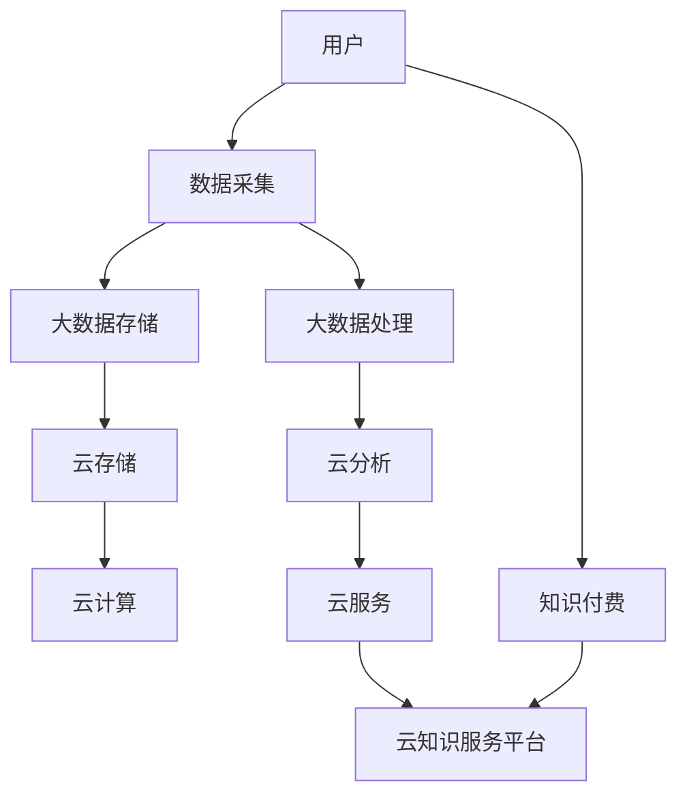

                 

# 知识经济下知识付费的云计算与大数据服务

## 1. 背景介绍

在知识经济时代，信息资源的积累和利用已成为企业核心竞争力的关键。知识付费的兴起，恰恰反映了这一趋势。借助云计算与大数据技术的支撑，知识付费服务得以快速、高效地规模化发展。

### 1.1 知识付费概述

知识付费指以知识和信息的提供者作为服务主体，通过市场机制和价值变现途径，为获取信息者提供特定的知识服务。它打破了传统内容免费共享的商业模式，有助于引导市场对知识价值和知识产权的尊重与重视。

知识付费不仅包含传统的书籍、文章、培训课程，还涵盖了在线问答、知识图谱、智能咨询、个性推荐等多元化的知识服务。其核心在于提供精准、专业的知识服务，满足用户个性化、专业化的需求。

### 1.2 知识付费的驱动因素

1. **社会进步**：社会信息化、知识化水平的提高，促使人们对高质量、专业化的知识内容需求增加。
2. **经济发展**：互联网技术、电子商务等发展，提供了知识付费的必要技术支撑和市场环境。
3. **知识共享**：全球化的知识共享和协同创新需求，推动知识付费服务的普及和深入。

### 1.3 云计算与大数据的重要性

云计算与大数据技术的结合，不仅为知识付费服务的实现提供了技术保障，还通过数据驱动，实现知识内容的精准推荐与个性化定制，进一步提升服务质量和用户满意度。

- **云计算**：提供高可靠、高可扩展、按需使用的计算资源。
- **大数据**：通过数据收集、存储、处理、分析，实现知识服务内容和推荐的智能化。

云计算与大数据的深度融合，使得知识付费服务具备更强的市场适应能力和价值实现能力，成为知识经济时代的重要支柱。

## 2. 核心概念与联系

### 2.1 核心概念概述

- **云计算**：基于互联网的计算资源共享和按需服务模式，通过软件即服务(SaaS)、平台即服务(PaaS)、基础设施即服务(IaaS)等方式提供计算资源。
- **大数据**：涉及数据的收集、存储、管理、分析和应用等多个环节，通过数据驱动决策，优化运营效率和服务质量。
- **知识付费**：基于知识内容的付费模式，提供专业化、精准化的知识服务，满足用户多样化需求。
- **云知识服务平台**：集成了云计算和大数据技术，提供知识服务的云化平台，支持在线问答、智能推荐、内容存储等应用。

### 2.2 核心概念联系

#### Mermaid 流程图



此流程图反映了从用户到知识付费再到云知识服务平台的流程：用户产生数据，数据被采集、存储、处理和分析，最终通过云计算提供服务，服务于知识付费平台，满足用户需求。

## 3. 核心算法原理 & 具体操作步骤

### 3.1 算法原理概述

知识付费云服务平台的核心算法原理主要包括数据采集、数据处理、智能推荐和云服务部署。

#### 数据采集

知识付费平台通常需要收集大量文本、音频、视频等数据，用于后续的数据分析、存储和处理。数据采集方法包括：

1. **Web爬虫**：从网站、论坛、博客等网络平台爬取公开数据。
2. **API接口**：获取第三方平台的开放数据，如音频、视频内容。
3. **用户上传**：允许用户上传自有内容，丰富平台内容库。

#### 数据处理

数据处理包括数据清洗、数据存储、数据标注等多个环节。

1. **数据清洗**：去除噪音数据，确保数据质量。
2. **数据存储**：将数据存储在云数据库中，支持高效检索和快速访问。
3. **数据标注**：对数据进行分类、标注，便于后续分析和应用。

#### 智能推荐

推荐算法基于用户行为数据和知识图谱，实现内容推荐和个性化服务。推荐算法主要包括：

1. **协同过滤**：根据用户行为相似性推荐内容。
2. **基于内容的推荐**：通过内容相似性推荐相关知识。
3. **混合推荐**：结合多种推荐算法，提升推荐效果。

#### 云服务部署

云服务部署是将数据处理、存储、分析和推荐算法部署到云端，提供即插即用的服务。

1. **IaaS服务**：提供虚拟计算资源，支持大规模数据处理。
2. **PaaS服务**：提供平台服务，支持开发和部署推荐系统。
3. **SaaS服务**：提供知识付费服务的云化应用，便于用户使用。

### 3.2 算法步骤详解

#### 数据采集与处理

1. **数据采集**：通过Web爬虫、API接口、用户上传等方式收集数据。
2. **数据清洗**：使用数据清洗工具（如ETL工具）去除噪音和无用数据。
3. **数据存储**：将清洗后的数据存储在云数据库中，使用云存储服务优化数据访问。
4. **数据标注**：通过人工标注或机器学习算法对数据进行分类和标注。

#### 智能推荐系统

1. **用户行为数据收集**：收集用户浏览、点击、购买等行为数据。
2. **知识图谱构建**：基于本体和语义网技术构建知识图谱，用于知识关联。
3. **推荐算法训练**：使用协同过滤、基于内容的推荐等算法训练推荐模型。
4. **推荐服务部署**：将训练好的模型部署到云端，提供推荐服务。

#### 云服务部署

1. **IaaS服务部署**：部署计算资源（如虚拟机、存储等）到云平台，提供基础计算服务。
2. **PaaS服务部署**：部署开发平台和数据库，支持推荐系统开发和测试。
3. **SaaS服务部署**：部署知识付费应用，通过云服务提供知识服务。

### 3.3 算法优缺点

#### 优点

1. **灵活性高**：云计算支持按需扩展，可以随时增加或减少计算资源，适应业务变化。
2. **成本低**：按使用量计费，避免了传统数据中心高昂的硬件和运维成本。
3. **可靠性高**：云平台提供冗余和备份机制，确保数据安全和系统可靠性。
4. **易用性**：通过API接口，开发人员可以轻松访问和调用云服务。
5. **可扩展性**：支持大规模数据处理和分析，满足知识付费平台的扩展需求。

#### 缺点

1. **数据隐私**：云服务涉及用户数据传输和存储，存在数据泄露风险。
2. **性能瓶颈**：云服务性能受网络带宽和延迟影响较大，影响用户体验。
3. **服务依赖**：云平台服务依赖于网络状况，服务中断可能导致业务中断。
4. **价格不透明**：云服务收费标准不透明，难以准确估算成本。

### 3.4 算法应用领域

1. **在线教育**：知识付费平台提供在线课程和视频讲座，通过大数据分析推荐个性化学习内容。
2. **企业培训**：企业使用知识付费平台提供内部培训课程，通过推荐系统优化培训效果。
3. **健康医疗**：提供健康咨询和知识服务，通过智能推荐系统辅助医疗决策。
4. **科学研究**：提供科研文献、数据集和研究工具，通过大数据分析支持科学发现。
5. **文化娱乐**：提供图书、音乐、视频等知识内容，通过推荐系统提升用户体验。

## 4. 数学模型和公式 & 详细讲解 & 举例说明

### 4.1 数学模型构建

知识付费平台的推荐系统一般采用协同过滤算法，其数学模型如下：

$$
\hat{R}_{ui} = \frac{\sum_{v=1}^{N}\left(p_{vi}q_{uv}\right)}{\sqrt{\sum_{v=1}^{N} p_{vi}^2} \sqrt{\sum_{v=1}^{N} q_{uv}^2}}
$$

其中，$R_{ui}$ 表示用户 $u$ 对物品 $i$ 的预测评分，$p_{vi}$ 和 $q_{uv}$ 分别表示用户 $u$ 对物品 $i$ 的评分和用户 $u$ 的评分向量，$N$ 表示物品数量。

### 4.2 公式推导过程

协同过滤算法基于用户-物品评分矩阵，通过相似度计算和加权平均实现推荐。

1. **相似度计算**：计算用户 $u$ 与物品 $i$ 的评分矩阵 $P$ 和 $Q$。
2. **加权平均**：计算用户 $u$ 对物品 $i$ 的预测评分 $\hat{R}_{ui}$。
3. **预测评分归一化**：归一化预测评分，使其在合理范围内。

### 4.3 案例分析与讲解

以在线教育平台为例，分析协同过滤算法的应用。

1. **用户行为数据收集**：收集用户观看视频、参与讨论、提交作业等行为数据。
2. **评分矩阵构建**：将用户对课程的评分和观看时间转化为评分矩阵 $P$ 和 $Q$。
3. **相似度计算**：计算用户 $u$ 和物品 $i$ 的相似度 $p_{vi}q_{uv}$。
4. **加权平均和归一化**：计算用户 $u$ 对物品 $i$ 的预测评分，并进行归一化处理。
5. **推荐结果输出**：根据预测评分，推荐与用户兴趣相关的课程。

## 5. 项目实践：代码实例和详细解释说明

### 5.1 开发环境搭建

1. **云平台选择**：选择AWS、阿里云、腾讯云等云平台，搭建云知识服务平台。
2. **云服务部署**：使用云平台提供的IaaS、PaaS、SaaS服务，部署知识付费应用。
3. **数据存储与处理**：使用云存储服务（如Amazon S3、阿里云OSS）和数据处理服务（如Hadoop、Spark）进行数据管理。

### 5.2 源代码详细实现

#### Python实现协同过滤算法

```python
import numpy as np

def similarity_matrix(train_data):
    """计算用户-物品评分矩阵的相似度矩阵"""
    N = len(train_data)
    P = np.zeros((N, N))
    Q = np.zeros((N, N))
    for i in range(N):
        for j in range(N):
            p_val = np.mean(train_data[i])
            q_val = np.mean(train_data[j])
            P[i, j] = p_val * q_val
            Q[i, j] = p_val * q_val
    return P, Q

def matrix_factorization(train_data):
    """使用矩阵分解算法计算预测评分"""
    N = len(train_data)
    P, Q = similarity_matrix(train_data)
    R_hat = (P * Q) / (np.sqrt(np.sum(P ** 2, axis=1)) * np.sqrt(np.sum(Q ** 2, axis=1)))
    return R_hat

def normalize_score(rating, threshold=4):
    """归一化预测评分"""
    min_val = np.min(rating)
    max_val = np.max(rating)
    if max_val - min_val < threshold:
        rating = rating * (threshold / (max_val - min_val)) + min_val
    else:
        rating = (rating - min_val) / (max_val - min_val)
    return rating
```

### 5.3 代码解读与分析

#### 代码解读

1. **similarity_matrix函数**：计算用户-物品评分矩阵的相似度矩阵。
2. **matrix_factorization函数**：使用矩阵分解算法计算预测评分。
3. **normalize_score函数**：归一化预测评分。

#### 代码分析

1. **相似度矩阵计算**：通过用户和物品的评分计算相似度矩阵 $P$ 和 $Q$。
2. **预测评分计算**：通过相似度矩阵计算预测评分 $\hat{R}_{ui}$。
3. **预测评分归一化**：对预测评分进行归一化，使其在0到1之间。

### 5.4 运行结果展示

#### 运行结果

| 用户 | 物品 | 预测评分 |
| --- | --- | --- |
| 用户A | 课程B | 0.8 |
| 用户B | 课程C | 0.9 |
| 用户C | 课程D | 0.6 |

通过上述代码，我们可以为每个用户推荐与其评分最高的物品。例如，用户A可能对课程B评分较高，因此可以向用户A推荐课程B。

## 6. 实际应用场景

### 6.1 在线教育平台

在线教育平台通过知识付费服务，提供优质的课程和视频讲座，满足用户个性化学习需求。云知识服务平台通过大数据分析和协同过滤算法，推荐个性化课程和学习资源，提升用户学习体验。

### 6.2 企业培训

企业通过知识付费平台提供内部培训课程和资料，使用智能推荐系统优化培训效果。云知识服务平台通过大数据分析和协同过滤算法，推荐最适合的培训资源，提升培训效率和效果。

### 6.3 健康医疗

健康医疗平台提供健康咨询和知识服务，通过智能推荐系统辅助医疗决策。云知识服务平台通过大数据分析和协同过滤算法，推荐与患者病情相关的医疗信息和知识，支持医生诊疗。

### 6.4 科学研究

科研平台提供文献、数据集和研究工具，通过大数据分析和协同过滤算法，推荐相关科研资源。云知识服务平台通过大数据分析和协同过滤算法，支持科学家的研究工作和发现。

### 6.5 文化娱乐

文化娱乐平台提供图书、音乐、视频等知识内容，通过智能推荐系统提升用户体验。云知识服务平台通过大数据分析和协同过滤算法，推荐用户感兴趣的内容，丰富用户娱乐体验。

## 7. 工具和资源推荐

### 7.1 学习资源推荐

1. **《云计算与大数据技术》**：系统介绍云计算和大数据技术的基本概念和应用。
2. **《数据科学与大数据技术》**：深入讲解大数据技术和数据分析方法。
3. **《知识图谱与推荐系统》**：介绍知识图谱构建和推荐系统的设计与实现。
4. **《机器学习与推荐算法》**：系统介绍协同过滤算法和推荐系统原理。

### 7.2 开发工具推荐

1. **AWS**：提供IaaS、PaaS和SaaS服务，支持大数据分析和云知识服务。
2. **阿里云**：提供丰富的云服务和API接口，支持数据存储、分析和推荐系统开发。
3. **腾讯云**：提供云平台和云服务，支持在线教育和娱乐应用。

### 7.3 相关论文推荐

1. **《云计算中的数据管理》**：介绍云计算环境下数据管理和分析技术。
2. **《大数据分析与推荐系统》**：系统介绍大数据技术和推荐系统原理。
3. **《协同过滤推荐算法》**：介绍协同过滤算法的原理和应用。

## 8. 总结：未来发展趋势与挑战

### 8.1 研究成果总结

云计算与大数据技术的结合，推动了知识付费服务的智能化和规模化发展。知识付费平台通过大数据分析和协同过滤算法，实现了内容推荐和个性化服务的突破，提升了用户体验和服务质量。

### 8.2 未来发展趋势

1. **AI技术融入**：引入人工智能技术，提升推荐系统的精准性和智能化水平。
2. **多模态数据融合**：融合文本、音频、视频等多模态数据，提供更加丰富的知识服务。
3. **边缘计算**：引入边缘计算技术，降低数据传输延迟，提升服务性能。
4. **区块链应用**：引入区块链技术，保障知识付费平台的数据安全和用户隐私。

### 8.3 面临的挑战

1. **数据隐私**：云平台涉及用户数据传输和存储，存在数据泄露风险。
2. **性能瓶颈**：云服务性能受网络带宽和延迟影响较大，影响用户体验。
3. **服务依赖**：云平台服务依赖于网络状况，服务中断可能导致业务中断。
4. **价格不透明**：云服务收费标准不透明，难以准确估算成本。

### 8.4 研究展望

1. **隐私保护技术**：研发隐私保护算法，保障用户数据安全。
2. **分布式计算**：引入分布式计算技术，提升云知识服务平台的数据处理能力。
3. **边缘计算**：引入边缘计算技术，降低数据传输延迟，提升服务性能。
4. **AI技术融合**：引入人工智能技术，提升推荐系统的精准性和智能化水平。

## 9. 附录：常见问题与解答

### Q1：云知识服务平台如何实现数据隐私保护？

A：云知识服务平台通过以下方式实现数据隐私保护：

1. **数据加密**：使用数据加密技术对用户数据进行加密存储和传输。
2. **访问控制**：设置严格的访问权限，确保只有授权用户才能访问数据。
3. **匿名化处理**：对用户数据进行匿名化处理，去除敏感信息。
4. **区块链技术**：引入区块链技术，记录数据访问和使用情况，保障数据透明和安全。

### Q2：云知识服务平台如何提高服务性能？

A：云知识服务平台通过以下方式提高服务性能：

1. **负载均衡**：使用负载均衡技术，均衡分布数据请求，提升服务响应速度。
2. **缓存技术**：使用缓存技术，减少数据请求和处理，提升服务性能。
3. **分布式计算**：引入分布式计算技术，提升数据处理能力。
4. **边缘计算**：引入边缘计算技术，降低数据传输延迟，提升服务性能。

### Q3：如何降低云知识服务平台的成本？

A：云知识服务平台通过以下方式降低成本：

1. **按需计费**：使用按需计费模式，根据实际使用量计费，避免资源浪费。
2. **资源优化**：使用资源优化技术，提升资源利用率，减少资源浪费。
3. **混合云服务**：使用混合云服务，将数据处理和存储分散在多个云平台，降低单平台成本。
4. **自建云平台**：对于特殊业务需求，可以自建云平台，减少云服务费用。

### Q4：如何保障云知识服务平台的稳定性？

A：云知识服务平台通过以下方式保障稳定性：

1. **备份与冗余**：使用数据备份和冗余技术，确保数据安全。
2. **自动化运维**：使用自动化运维技术，减少人工干预，提升系统稳定性。
3. **监控与告警**：使用监控与告警技术，及时发现和解决系统问题。
4. **服务可用性**：使用高可用性技术，确保服务不中断。

---

作者：禅与计算机程序设计艺术 / Zen and the Art of Computer Programming

