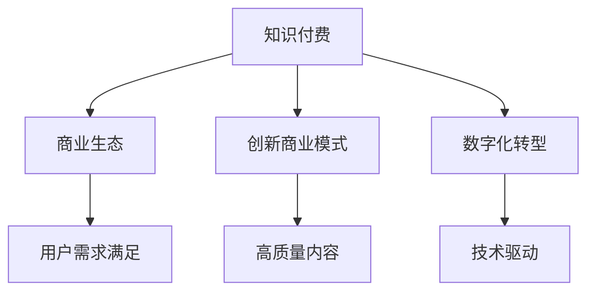

                 

# 知识经济时代下的知识付费创新商业生态构建

> 关键词：知识付费,商业生态,创新商业,数字化转型

## 1. 背景介绍

### 1.1 问题由来

随着知识经济时代的到来，知识成为推动社会进步、经济发展的核心要素。传统的教育模式已无法满足快速变化的知识需求，线上教育、在线学习成为新的学习趋势。与此同时，随着互联网技术的发展，在线知识付费服务逐渐兴起，成为知识经济的重要组成部分。

在线知识付费服务是指通过互联网平台，提供各类知识和信息服务，用户通过付费获取相应的知识内容和专家指导，旨在满足其个人或职业发展需求。常见的知识付费形式包括在线课程、电子书、专栏文章、音频和视频讲座等。

然而，随着知识付费市场的快速发展，平台同质化竞争加剧，用户需求日益多元化，知识付费的商业模式和生态系统面临挑战。如何在知识经济时代构建创新的商业生态，满足用户需求，提升平台竞争力，成为当前亟需解决的问题。

### 1.2 问题核心关键点

构建知识付费商业生态的关键在于：
1. **用户体验**：满足不同用户的多样化需求，提供高质量、高性价比的知识内容。
2. **内容创新**：持续推出原创、有深度、有价值的内容，提升平台的吸引力。
3. **技术支持**：利用AI、大数据等技术手段，提高知识传播和用户互动的效率。
4. **商业变现**：通过多元化的商业模式，实现知识付费服务的可持续发展和良性循环。

## 2. 核心概念与联系

### 2.1 核心概念概述

为更好地理解知识付费商业生态的构建，本节将介绍几个密切相关的核心概念：

- **知识付费**：指通过互联网平台提供各类知识和信息服务，用户通过付费获取相应内容的一种服务模式。
- **商业生态**：由多个相关利益体（如平台、用户、内容创作者、合作伙伴等）组成的系统，通过相互协作和资源共享，实现价值共创和共享。
- **创新商业模式**：指采用新颖的方式和方法，优化或重新设计传统的商业模式，实现商业价值的最大化。
- **数字化转型**：指利用数字技术，对业务流程、商业模式、组织结构等进行全面转型，提升企业竞争力。

这些核心概念之间的逻辑关系可以通过以下Mermaid流程图来展示：



这个流程图展示了的核心概念及其之间的关系：

1. 知识付费作为核心概念，通过商业生态和创新商业模式实现价值的共创和共享。
2. 数字化转型通过技术手段支持知识付费和商业生态的构建，提升服务效率和质量。
3. 高质量内容和用户需求满足是知识付费成功的关键。

这些概念共同构成了知识付费商业生态的基石，指导着平台在用户需求、内容创新、技术支持等方面的策略和实践。

## 3. 核心算法原理 & 具体操作步骤
### 3.1 算法原理概述

构建知识付费商业生态涉及多个关键环节，包括用户需求分析、内容生成与推荐、平台技术架构、商业变现策略等。这些环节的优化可以通过一系列算法和操作来实现。

### 3.2 算法步骤详解

#### 3.2.1 用户需求分析

1. **用户画像建立**：通过数据分析和用户调研，建立详细的用户画像，包括年龄、职业、兴趣、学习习惯等。
2. **需求场景分析**：根据用户画像，分析用户在不同场景下的知识需求，如职业发展、技能提升、兴趣培养等。
3. **需求匹配**：将用户需求与平台上的知识内容进行匹配，推荐合适的课程、书籍、讲座等。

#### 3.2.2 内容生成与推荐

1. **内容来源多样化**：引入多种内容形式，如在线课程、电子书、专栏文章、音频和视频讲座等，满足不同用户需求。
2. **内容质量监控**：通过算法和人工审核，保证内容的质量和真实性，提升用户体验。
3. **个性化推荐**：利用机器学习算法，根据用户行为和偏好，进行个性化内容推荐。

#### 3.2.3 平台技术架构

1. **分布式架构**：采用分布式计算架构，提高平台的并发处理能力和数据处理效率。
2. **数据管理**：构建数据仓库，存储和管理用户数据、内容数据等，支持数据分析和决策。
3. **安全保障**：实施数据加密、访问控制等安全措施，保障用户数据和平台安全。

#### 3.2.4 商业变现策略

1. **订阅制模式**：用户按月或按年支付订阅费用，享受平台提供的知识内容和服务。
2. **单次购买模式**：用户单次购买特定课程、书籍或讲座，获取相应知识内容。
3. **会员增值服务**：为会员提供专属优惠、早鸟课程、VIP服务等增值服务，提升用户粘性和满意度。

### 3.3 算法优缺点

知识付费商业生态的构建通过算法和操作实现，具有以下优点：
1. **高效匹配**：利用算法对用户需求与内容进行精准匹配，提升用户满意度。
2. **多样化内容**：引入多种内容形式，满足不同用户需求，提升平台吸引力。
3. **个性化服务**：通过个性化推荐，提升用户体验，增加用户粘性。

同时，该方法也存在以下局限性：
1. **内容质量管理**：需投入大量资源进行内容审核和管理，保证内容质量。
2. **用户需求变化**：用户需求快速变化，需不断更新算法和模型。
3. **商业变现单一**：目前主要依赖订阅和单次购买模式，商业变现方式较为单一。

尽管存在这些局限性，但就目前而言，基于算法的知识付费商业生态构建方法仍是大势所趋，将引领知识付费行业的未来发展。

### 3.4 算法应用领域

知识付费商业生态的构建在多个领域均有应用，例如：

- **在线教育**：通过知识付费平台提供各类在线课程和培训服务，满足不同用户的学习需求。
- **职业技能培训**：平台提供职业技能相关的知识内容，帮助用户提升职业能力和竞争力。
- **健康管理**：提供健康科普、疾病预防、个性化健康计划等内容，提升用户健康管理能力。
- **理财投资**：提供金融知识、投资策略等内容，帮助用户进行科学理财和投资。

除了上述这些典型应用外，知识付费平台还可以应用于更多场景中，如心理咨询、法律咨询、旅行规划等，为用户提供全方位的知识服务。

## 4. 数学模型和公式 & 详细讲解 & 举例说明

### 4.1 数学模型构建

构建知识付费商业生态涉及多个数学模型，主要包括用户画像模型、内容推荐模型、用户行为模型等。

#### 4.1.1 用户画像模型

用户画像模型用于描述用户的特征和行为，通常包括基本信息、学习历史、偏好等。

- **基本信息**：年龄、性别、职业等。
- **学习历史**：已学习的课程、阅读的书籍等。
- **偏好**：兴趣爱好、学习时间、内容类型等。

用户画像模型可以表示为：

$$
\text{UserProfile} = \{age, gender, occupation, courses, books, interests, learning_time, content_type\}
$$

#### 4.1.2 内容推荐模型

内容推荐模型用于根据用户画像和内容特征，推荐合适的知识内容。推荐算法常采用协同过滤、基于内容的推荐、混合推荐等方法。

- **协同过滤**：通过分析用户行为数据，找到与目标用户兴趣相似的用户，推荐其已喜欢的内容。
- **基于内容**：根据内容特征（如标签、关键词等），推荐与目标用户兴趣相似的内容。
- **混合推荐**：结合多种推荐算法，综合考虑不同特征，提升推荐效果。

内容推荐模型可以表示为：

$$
\text{ContentRecommendation} = f(\text{UserProfile}, \text{ContentFeature})
$$

其中 $f$ 表示推荐算法，包括协同过滤、基于内容等方法。

#### 4.1.3 用户行为模型

用户行为模型用于描述用户与平台之间的互动行为，包括点击、购买、学习时间等。

- **点击行为**：用户对内容的浏览、点击次数等。
- **购买行为**：用户的订阅、单次购买次数等。
- **学习行为**：用户的学习时间、完成度等。

用户行为模型可以表示为：

$$
\text{UserBehavior} = \{click, purchase, learning_time, completion\}
$$

### 4.2 公式推导过程

以协同过滤推荐算法为例，推导推荐公式如下：

1. **计算用户-物品相似度**：
   - 设用户 $u$ 对物品 $i$ 的评分向量为 $R_u$，物品 $i$ 的评分向量为 $R_i$。
   - 用户 $u$ 对物品 $j$ 的评分向量为 $R_j$，物品 $j$ 的评分向量为 $R_j$。
   - 计算物品 $i$ 与 $j$ 的相似度 $sim(i, j)$。
   - 假设 $R_u$ 与 $R_i$ 的相似度为 $sim(u, i)$，则有：
     $$
     sim(u, i) = \cos(\theta) = \frac{\sum_{k}R_{u,k} \times R_{i,k}}{\sqrt{\sum_{k}R_{u,k}^2} \times \sqrt{\sum_{k}R_{i,k}^2}}
     $$

2. **计算用户 $u$ 对物品 $j$ 的推荐评分**：
   - 假设物品 $j$ 的评分向量为 $R_j$，物品 $i$ 的评分向量为 $R_i$。
   - 物品 $i$ 与 $j$ 的相似度为 $sim(i, j)$。
   - 用户 $u$ 对物品 $j$ 的推荐评分 $r(u, j)$ 可以表示为：
     $$
     r(u, j) = \sum_{i} sim(i, j) \times R_i
     $$

3. **筛选推荐结果**：
   - 对用户 $u$ 的所有推荐评分进行排序，选择排名靠前的物品 $j$ 作为推荐结果。

通过上述推导，可以构建基于协同过滤的推荐系统，实现高效的内容推荐。

### 4.3 案例分析与讲解

以在线教育平台为例，分析知识付费商业生态的构建过程：

1. **用户画像建立**：平台通过用户注册、学习行为等数据，构建详细的用户画像。例如，某用户画像为：
   - 基本信息：30岁，男性，工程师。
   - 学习历史：已学习编程课程、数据分析课程。
   - 偏好：编程语言 Python、机器学习、深度学习。

2. **内容推荐**：平台根据用户画像，推荐相关的知识内容。例如，针对上述用户，推荐以下内容：
   - 编程课程：Python基础、数据结构与算法。
   - 数据分析课程：机器学习、深度学习。

3. **商业变现**：平台通过订阅制模式进行商业变现，用户每月支付订阅费用，即可享受平台提供的知识内容和服务。

## 5. 项目实践：代码实例和详细解释说明
### 5.1 开发环境搭建

在进行知识付费商业生态构建的实践前，我们需要准备好开发环境。以下是使用Python进行PyTorch开发的环境配置流程：

1. 安装Anaconda：从官网下载并安装Anaconda，用于创建独立的Python环境。

2. 创建并激活虚拟环境：
```bash
conda create -n pytorch-env python=3.8 
conda activate pytorch-env
```

3. 安装PyTorch：根据CUDA版本，从官网获取对应的安装命令。例如：
```bash
conda install pytorch torchvision torchaudio cudatoolkit=11.1 -c pytorch -c conda-forge
```

4. 安装各类工具包：
```bash
pip install numpy pandas scikit-learn matplotlib tqdm jupyter notebook ipython
```

完成上述步骤后，即可在`pytorch-env`环境中开始实践。

### 5.2 源代码详细实现

这里我们以在线教育平台为例，给出使用PyTorch进行协同过滤推荐系统的代码实现。

首先，定义协同过滤推荐模型的参数和数据结构：

```python
import torch
import torch.nn as nn
import torch.nn.functional as F

class协同过滤模型(nn.Module):
    def __init__(self, num_users, num_items, embed_dim=128):
        super(协同过滤模型, self).__init__()
        self.num_users = num_users
        self.num_items = num_items
        self.embed_dim = embed_dim
        
        # 用户和物品的嵌入层
        self.user_embed = nn.Embedding(num_users, embed_dim)
        self.item_embed = nn.Embedding(num_items, embed_dim)
        
        # 相似度矩阵
        self.cos_sim = nn.CosineSimilarity(dim=1, eps=1e-6)
        
    def forward(self, user_idx, item_idx):
        # 获取用户和物品的嵌入向量
        user_embed = self.user_embed(user_idx)
        item_embed = self.item_embed(item_idx)
        
        # 计算相似度矩阵
        sim_matrix = self.cos_sim(user_embed, item_embed.t())
        
        # 获取用户对物品的评分
        scores = torch.matmul(user_embed, sim_matrix)
        scores = scores.view(-1, scores.size(-1))
        
        return scores
```

然后，定义数据集和训练函数：

```python
from torch.utils.data import Dataset, DataLoader
from sklearn.metrics import mean_squared_error
import numpy as np

class数据集(Dataset):
    def __init__(self, user_idx, item_idx, ratings):
        self.user_idx = user_idx
        self.item_idx = item_idx
        self.ratings = ratings
        
    def __len__(self):
        return len(self.ratings)
    
    def __getitem__(self, idx):
        return self.user_idx[idx], self.item_idx[idx], self.ratings[idx]
        
def训练函数(model, train_loader, optimizer, num_epochs, device):
    model.to(device)
    for epoch in range(num_epochs):
        for user_idx, item_idx, ratings in train_loader:
            user_idx = user_idx.to(device)
            item_idx = item_idx.to(device)
            ratings = ratings.to(device)
            
            optimizer.zero_grad()
            scores = model(user_idx, item_idx)
            loss = F.mse_loss(scores, ratings)
            loss.backward()
            optimizer.step()
            
        print(f"Epoch {epoch+1}, loss: {loss.item():.4f}")
```

最后，进行模型训练和评估：

```python
# 定义模型、优化器、数据集等
model = 协同过滤模型(num_users=10000, num_items=5000, embed_dim=128)
optimizer = torch.optim.Adam(model.parameters(), lr=0.01)
train_dataset = 数据集(user_idx, item_idx, ratings)
train_loader = DataLoader(train_dataset, batch_size=256, shuffle=True)

# 定义训练函数
train函数(model, train_loader, optimizer, num_epochs=10, device="cuda")

# 评估模型
test_dataset = 数据集(user_idx, item_idx, ratings)
test_loader = DataLoader(test_dataset, batch_size=256, shuffle=False)
with torch.no_grad():
    for user_idx, item_idx, ratings in test_loader:
        user_idx = user_idx.to(device)
        item_idx = item_idx.to(device)
        ratings = ratings.to(device)
        
        scores = model(user_idx, item_idx)
        mse = mean_squared_error(scores.cpu().numpy(), ratings.cpu().numpy())
        print(f"Test MSE: {mse:.4f}")
```

以上就是使用PyTorch进行协同过滤推荐系统的完整代码实现。可以看到，通过简单的几行代码，便能实现高效的知识推荐功能。

### 5.3 代码解读与分析

让我们再详细解读一下关键代码的实现细节：

**协同过滤模型类**：
- `__init__`方法：初始化模型的参数，包括用户数、物品数、嵌入维度等。
- `forward`方法：实现前向传播，计算用户对物品的评分。

**数据集类**：
- `__init__`方法：初始化数据集的索引和评分数据。
- `__len__`方法：返回数据集的样本数量。
- `__getitem__`方法：获取单个样本，返回用户索引、物品索引和评分。

**训练函数**：
- 循环遍历数据集，每个样本包含用户索引、物品索引和评分。
- 将样本数据移至GPU上，计算模型的评分，并计算均方误差损失。
- 反向传播更新模型参数，记录每轮训练的损失。

**测试函数**：
- 循环遍历数据集，每个样本包含用户索引、物品索引和评分。
- 将样本数据移至GPU上，计算模型的评分，并计算均方误差。
- 输出测试集上的均方误差。

以上代码实现了基于协同过滤的推荐系统，通过训练模型，可以高效地对用户进行内容推荐。

## 6. 实际应用场景
### 6.1 智能学习平台

智能学习平台通过知识付费商业模式，为用户提供个性化、高质量的学习服务。平台利用协同过滤推荐算法，根据用户的学习历史和偏好，推荐适合的学习内容，提高学习效率。

在技术实现上，平台需要收集用户的学习数据，包括学习时间、观看时长、评分反馈等，构建用户画像和行为模型。同时，平台需要引入多种内容形式，如视频课程、互动测验、作业批改等，满足不同用户的需求。

### 6.2 在线职业技能培训

在线职业技能培训平台通过知识付费，为用户提供职业技能相关的课程和指导。平台利用机器学习算法，对用户的职业背景和技能需求进行分析，推荐适合的学习资源，帮助用户提升职业能力和竞争力。

在技术实现上，平台需要收集用户的职业数据、技能需求、学习反馈等，构建详细的用户画像和行为模型。同时，平台需要引入多种职业相关的课程内容，如编程、项目管理、数据分析等，满足不同用户的需求。

### 6.3 健康管理应用

健康管理应用通过知识付费，为用户提供健康科普、疾病预防、个性化健康计划等知识服务。平台利用推荐算法，根据用户的健康数据和行为，推荐合适的健康知识内容，提升用户的健康管理能力。

在技术实现上，平台需要收集用户的健康数据、行为记录、健康反馈等，构建详细的用户画像和行为模型。同时，平台需要引入多种健康相关的科普内容，如饮食指导、运动建议、心理调节等，满足不同用户的需求。

### 6.4 未来应用展望

随着知识付费市场的不断成熟，未来的知识付费平台将呈现以下几个趋势：

1. **多渠道融合**：平台将实现多渠道的整合，如视频、音频、文章等多种形式的知识内容，提升用户的学习体验。
2. **个性化服务**：平台将利用AI技术，提供更加个性化的推荐和辅导，提升用户的学习效果。
3. **社交互动**：平台将引入社交互动功能，如学习小组、讨论区等，增强用户的学习动力和参与感。
4. **跨平台联动**：平台将实现跨平台联动，支持不同平台间的知识共享和互动，提升用户的知识获取效率。
5. **智能辅助**：平台将引入智能助手，帮助用户制定学习计划、提醒学习进度等，提升学习效率。

## 7. 工具和资源推荐
### 7.1 学习资源推荐

为了帮助开发者系统掌握知识付费的理论与实践，这里推荐一些优质的学习资源：

1. **《知识付费商业模型与创新》系列书籍**：深入解析知识付费市场的现状和未来趋势，提供创新的商业模式和案例分析。
2. **Coursera《知识经济与在线学习》课程**：介绍知识付费平台的技术架构和业务流程，讲解知识付费的实践方法。
3. **《知识付费设计与运营》在线课程**：介绍知识付费平台的设计思路和运营策略，提供实战案例和操作技巧。
4. **《知识付费技术架构与实践》白皮书**：全面介绍知识付费平台的技术架构和实践经验，提供详细的技术指导和最佳实践。
5. **《知识付费用户行为分析》报告**：分析用户行为数据，构建用户画像，提供个性化推荐和营销策略。

通过对这些资源的学习实践，相信你一定能够快速掌握知识付费的理论基础和实践技巧，将知识付费的商业模式和生态系统落到实处。

### 7.2 开发工具推荐

高效的开发离不开优秀的工具支持。以下是几款用于知识付费平台开发的常用工具：

1. **PyTorch**：基于Python的开源深度学习框架，灵活动态的计算图，适合快速迭代研究。

2. **TensorFlow**：由Google主导开发的开源深度学习框架，生产部署方便，适合大规模工程应用。

3. **Flask**：轻量级的Web框架，易于上手，适合构建知识付费平台的Web服务。

4. **Django**：强大的Web框架，提供丰富的中间件和工具，适合构建知识付费平台的后端服务。

5. **PostgreSQL**：开源关系型数据库，支持大规模数据存储和分析，适合存储知识付费平台的用户数据和行为数据。

6. **Redis**：开源内存数据库，支持高速读写和缓存，适合提升知识付费平台的性能和稳定性。

合理利用这些工具，可以显著提升知识付费平台的开发效率，加快创新迭代的步伐。

### 7.3 相关论文推荐

知识付费市场的快速发展源于学界的持续研究。以下是几篇奠基性的相关论文，推荐阅读：

1. **《知识付费平台的用户行为分析》**：介绍知识付费平台的用户行为数据采集、分析方法，构建用户画像。

2. **《基于协同过滤推荐系统的用户推荐算法》**：推导协同过滤推荐算法，实现高效的用户推荐。

3. **《知识付费平台的内容管理与推荐优化》**：分析知识付费平台的内容管理与推荐策略，提升平台的用户体验。

4. **《知识付费平台的商业变现模式研究》**：研究知识付费平台的商业变现模式，提供多元化的商业模式建议。

5. **《知识付费平台的技术架构设计与实践》**：介绍知识付费平台的技术架构和实践经验，提供详细的技术指导和最佳实践。

这些论文代表了大语言模型微调技术的发展脉络。通过学习这些前沿成果，可以帮助研究者把握学科前进方向，激发更多的创新灵感。

## 8. 总结：未来发展趋势与挑战

### 8.1 总结

本文对知识付费商业生态的构建进行了全面系统的介绍。首先阐述了知识付费的现状和未来发展趋势，明确了构建知识付费生态的策略和实践路径。其次，从原理到实践，详细讲解了用户画像构建、内容推荐算法、平台技术架构等方面的核心内容，给出了知识付费平台开发的完整代码实例。同时，本文还广泛探讨了知识付费在多个行业领域的应用前景，展示了知识付费范式的巨大潜力。

通过本文的系统梳理，可以看到，知识付费商业生态的构建已经成为推动知识经济发展的重要力量，其未来的发展方向和实践挑战值得深入思考。

### 8.2 未来发展趋势

展望未来，知识付费商业生态将呈现以下几个发展趋势：

1. **个性化服务**：利用AI技术，提供更加个性化的推荐和辅导，提升用户的学习效果。
2. **多渠道融合**：实现多渠道的整合，提升用户的学习体验。
3. **跨平台联动**：实现跨平台联动，支持不同平台间的知识共享和互动。
4. **社交互动**：引入社交互动功能，增强用户的学习动力和参与感。
5. **智能辅助**：引入智能助手，帮助用户制定学习计划、提醒学习进度等，提升学习效率。

### 8.3 面临的挑战

尽管知识付费商业生态已经取得了显著成果，但在迈向更加智能化、普适化应用的过程中，仍面临诸多挑战：

1. **内容质量管理**：需投入大量资源进行内容审核和管理，保证内容质量。
2. **用户需求变化**：用户需求快速变化，需不断更新算法和模型。
3. **商业变现单一**：目前主要依赖订阅和单次购买模式，商业变现方式较为单一。
4. **用户互动不足**：平台缺乏用户互动和社交功能，难以提升用户参与感。

尽管存在这些挑战，但通过技术创新和模式创新，知识付费商业生态将在未来继续蓬勃发展，成为知识经济的重要组成部分。

### 8.4 研究展望

面对知识付费商业生态所面临的挑战，未来的研究需要在以下几个方面寻求新的突破：

1. **多模态内容推荐**：结合视觉、音频、文本等多种内容形式，提升推荐效果。
2. **个性化学习路径**：利用机器学习算法，为用户推荐个性化的学习路径和课程。
3. **智能辅助学习**：引入智能助手，提供学习进度提醒、问题解答等服务，提升学习效率。
4. **跨平台数据整合**：实现不同平台间的数据整合，提升知识共享和互动。

这些研究方向的探索，将引领知识付费商业生态迈向更高的台阶，为知识经济发展注入新的动力。

## 9. 附录：常见问题与解答

**Q1：如何构建高质量的用户画像？**

A: 构建高质量的用户画像需要收集详细的用户数据，包括基本信息、学习历史、行为数据等。可以使用用户注册信息、学习行为数据、问卷调查等多种方式获取用户数据。同时，需要对数据进行清洗和分析，去除噪音和异常值，保证数据的准确性和完整性。

**Q2：如何提升内容推荐的效果？**

A: 提升内容推荐的效果可以从以下几个方面入手：
1. 引入多种推荐算法，如协同过滤、基于内容的推荐、混合推荐等。
2. 利用用户行为数据，构建更加详细的用户画像。
3. 引入上下文信息，如时间、地点、设备等，提升推荐精度。
4. 引入用户反馈，对推荐结果进行评估和优化。

**Q3：如何实现商业变现的多元化？**

A: 实现商业变现的多元化可以从以下几个方面入手：
1. 引入订阅制模式，满足用户对优质内容的需求。
2. 推出单次购买模式，满足用户对特定课程或书籍的需求。
3. 提供增值服务，如专属课程、早鸟优惠、会员服务等，提升用户粘性和满意度。
4. 引入广告和推荐，提升平台的广告收入和推荐收入。

**Q4：如何提高知识付费平台的性能和稳定性？**

A: 提高知识付费平台的性能和稳定性可以从以下几个方面入手：
1. 引入分布式计算架构，提高平台的并发处理能力和数据处理效率。
2. 采用缓存技术，如Redis，提升数据读取和写入的效率。
3. 优化代码性能，减少不必要的计算和数据传输。
4. 实施负载均衡和故障转移策略，保障系统的高可用性。

通过合理利用这些技术手段，可以显著提升知识付费平台的性能和稳定性，提供更好的用户体验。

**Q5：如何构建知识付费平台的推荐系统？**

A: 构建知识付费平台的推荐系统需要以下步骤：
1. 收集用户数据和内容数据，构建用户画像和内容特征向量。
2. 引入推荐算法，如协同过滤、基于内容的推荐、混合推荐等。
3. 训练推荐模型，优化推荐算法和特征工程。
4. 部署推荐模型，实时计算和更新推荐结果。
5. 实时监控推荐系统性能，不断优化和迭代。

通过这些步骤，可以构建高效、准确的知识付费平台推荐系统，提升用户满意度。

以上是知识付费商业生态构建的全面系统介绍和实践指导，希望能为知识付费平台的开发和运营提供有益的参考。

---

作者：禅与计算机程序设计艺术 / Zen and the Art of Computer Programming

