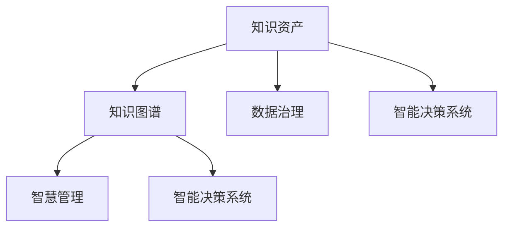

                 

# 知识资产模式实现知识的资本化运作

> 关键词：知识资产,知识资本化,知识图谱,数据治理,智慧管理,智能决策

## 1. 背景介绍

### 1.1 问题由来

随着大数据、人工智能、区块链等技术的发展，知识和信息成为了驱动企业竞争力的关键因素。企业所掌握的知识不仅体现在具体的业务流程和产品服务中，更以数据的形式储存在各业务系统中。如何高效管理和利用这些知识，将其转化为真正的资产和竞争力，是现代企业面临的重要课题。

传统的知识管理方式往往以文档、表格等形式存在，散落在企业的各个角落，导致知识孤岛、难以共享和再利用。同时，企业内部知识与外部环境知识的融合，更是存在较大障碍。如何在企业内部构建一个统一、智能的知识管理体系，实现知识的资本化运作，已成为企业转型升级的核心需求。

### 1.2 问题核心关键点

1. **知识资产化的定义与意义**：知识资产化，即将企业内部和外部隐性、显性知识转化为可量化、可管理、可再利用的资产，从而提高企业的运营效率和竞争优势。
2. **知识图谱技术的应用**：知识图谱是一种结构化的知识表示方法，通过将实体、关系、属性等信息建模成图，构建知识网络，实现知识的可视化、关联化和可推理。
3. **数据治理的框架与策略**：数据治理是对企业数据进行分类、归档、清洗、集成、保护等管理过程，确保数据的质量、完整性和一致性，为知识资产的构建提供坚实的数据基础。
4. **智能决策系统的构建**：智能决策系统通过融合大数据、人工智能和知识图谱技术，实现对复杂环境下的决策支持，辅助企业进行数据驱动的智能决策。
5. **知识管理的自动化与智能化**：通过人工智能和机器学习技术，实现知识获取、存储、检索、共享和应用的全流程自动化，提升知识管理的智能化水平。

这些核心关键点共同构成了企业知识管理转型的总体框架，旨在通过知识图谱、数据治理、智能决策和自动化知识管理等技术手段，将知识转化为企业的核心竞争力。

### 1.3 问题研究意义

实现知识的资本化运作，对于提升企业的创新能力、运营效率和市场竞争力具有重要意义：

1. **提升企业创新能力**：知识图谱技术可以揭示企业内部和外部知识之间的关联，为研发团队提供丰富的事实和洞见，加速创新过程。
2. **提高运营效率**：通过知识图谱和智能决策系统，企业能够快速响应市场变化，优化业务流程，减少决策时间，提高运营效率。
3. **增强市场竞争力**：通过知识图谱和智能决策系统的深度应用，企业能够更好地理解客户需求，提供定制化的产品和服务，增强市场竞争力。
4. **推动数字化转型**：知识图谱和智能决策系统作为数字化转型的重要工具，可以帮助企业实现业务数据的统一管理和深度分析，推动数字化转型进程。

## 2. 核心概念与联系

### 2.1 核心概念概述

为更好地理解知识资产化的技术架构和实现路径，本节将介绍几个密切相关的核心概念：

- **知识资产**：企业通过持续学习、创新和运营积累的知识，以数据的形式存储和表示，具有可量化、可管理和可再利用的特征。
- **知识图谱**：一种用于知识表示和推理的技术，通过构建实体、关系和属性的图结构，实现知识的可视化、关联化和可推理。
- **数据治理**：对企业数据进行分类、归档、清洗、集成和保护的过程，确保数据的质量、完整性和一致性，为知识图谱的构建提供数据基础。
- **智慧管理**：通过人工智能和大数据技术，实现对企业知识资产的高效管理和智能应用。
- **智能决策系统**：基于知识图谱和数据治理，通过深度学习、自然语言处理等技术，构建辅助企业进行数据驱动决策的智能系统。

这些核心概念之间的逻辑关系可以通过以下Mermaid流程图来展示：



这个流程图展示知识资产化的核心概念及其之间的关系：

1. **知识图谱**：构建实体、关系和属性的图结构，揭示企业内部和外部知识之间的关联。
2. **数据治理**：通过分类、归档、清洗、集成和保护，确保数据的质量、完整性和一致性，为知识图谱的构建提供数据基础。
3. **智慧管理**：通过人工智能和大数据技术，实现对知识资产的高效管理和智能应用。
4. **智能决策系统**：基于知识图谱和数据治理，通过深度学习、自然语言处理等技术，构建辅助企业进行数据驱动决策的智能系统。
5. **知识资产**：企业通过持续学习、创新和运营积累的知识，以数据的形式存储和表示，具有可量化、可管理和可再利用的特征。

这些概念共同构成了知识资产化的技术架构，实现了知识的高效管理和智能应用，从而提升企业的运营效率和竞争优势。

## 3. 核心算法原理 & 具体操作步骤

### 3.1 算法原理概述

知识资产化的核心算法原理基于知识图谱的构建与推理，以及数据治理的框架与策略。其核心思想是通过构建企业知识图谱，揭示知识之间的关联，并通过数据治理策略，确保知识图谱的数据质量，最后通过智能决策系统，实现知识的高效利用和智能决策。

具体而言，知识图谱构建步骤如下：

1. **数据采集**：从企业各个业务系统中采集数据，包括结构化数据、半结构化数据和非结构化数据。
2. **数据清洗与预处理**：对采集到的数据进行清洗、去重、标准化等预处理，确保数据的质量和一致性。
3. **实体识别与抽取**：利用自然语言处理和机器学习技术，从文本中识别和抽取实体，并标注实体类型和属性。
4. **关系抽取与建模**：通过分析和推理，抽取实体之间的关系，构建知识图谱。
5. **知识推理与验证**：利用知识图谱进行推理验证，确保知识图谱的正确性和完备性。

数据治理的框架与策略主要包括：

1. **数据分类与归档**：根据数据的重要性和使用场景，对数据进行分类和归档，确保数据的可访问性和可管理性。
2. **数据清洗与集成**：对数据进行清洗、去重和集成，确保数据的一致性和完整性。
3. **数据保护与安全**：对敏感数据进行加密和脱敏，确保数据的安全性和隐私保护。

智能决策系统的构建主要基于深度学习、自然语言处理和知识图谱技术，实现对复杂环境下的决策支持：

1. **知识图谱嵌入**：将知识图谱中的实体和关系嵌入到向量空间中，构建知识表示向量。
2. **深度学习模型训练**：利用深度学习模型训练知识表示向量，实现对知识图谱的深度学习。
3. **智能决策引擎**：构建基于知识图谱和深度学习模型的智能决策引擎，实现数据驱动的决策支持。

### 3.2 算法步骤详解

#### 3.2.1 知识图谱构建

**Step 1: 数据采集**
- 从企业各个业务系统（如ERP、CRM、OA等）中采集结构化数据。
- 从客户和供应商的信息系统中采集半结构化数据。
- 从社交媒体、网页、文档等非结构化数据源中采集文本数据。

**Step 2: 数据清洗与预处理**
- 对结构化数据进行格式转换、数据清洗和去重处理。
- 对半结构化数据进行格式转换、标准化处理。
- 对非结构化数据进行自然语言处理、实体识别和抽取处理。

**Step 3: 实体识别与抽取**
- 利用自然语言处理技术，从文本数据中识别和抽取实体，标注实体类型和属性。
- 将实体及其属性存储到知识图谱中，建立实体之间的关联。

**Step 4: 关系抽取与建模**
- 通过分析和推理，抽取实体之间的关系，构建知识图谱。
- 利用深度学习模型对关系进行验证和优化，确保知识图谱的准确性和完备性。

**Step 5: 知识推理与验证**
- 利用知识图谱进行推理验证，确保知识图谱的正确性和完备性。
- 定期更新和维护知识图谱，保持其与业务系统的同步。

#### 3.2.2 数据治理策略

**Step 1: 数据分类与归档**
- 根据数据的重要性和使用场景，将数据分为高、中、低三类。
- 对高重要性数据进行特殊处理，如加密和备份。
- 对低重要性数据进行归档和删除，以减少存储成本。

**Step 2: 数据清洗与集成**
- 对数据进行清洗、去重和集成，确保数据的一致性和完整性。
- 利用ETL工具进行数据抽取、转换和加载，提升数据治理效率。

**Step 3: 数据保护与安全**
- 对敏感数据进行加密和脱敏，确保数据的安全性和隐私保护。
- 制定数据访问权限管理策略，限制数据的访问和使用。

#### 3.2.3 智能决策系统构建

**Step 1: 知识图谱嵌入**
- 将知识图谱中的实体和关系嵌入到向量空间中，构建知识表示向量。
- 利用图神经网络等深度学习模型对知识表示向量进行编码，实现对知识图谱的深度学习。

**Step 2: 深度学习模型训练**
- 利用深度学习模型对知识表示向量进行训练，学习知识图谱中的模式和关系。
- 使用监督学习或无监督学习算法，训练深度学习模型，实现知识表示的优化。

**Step 3: 智能决策引擎构建**
- 构建基于知识图谱和深度学习模型的智能决策引擎，实现数据驱动的决策支持。
- 利用推理引擎和决策规则，实现对复杂环境下的智能决策。

### 3.3 算法优缺点

知识图谱和数据治理的算法具有以下优点：

1. **提高数据质量和一致性**：通过数据清洗和预处理，确保数据的质量和一致性，为知识图谱的构建提供坚实的数据基础。
2. **揭示知识关联**：通过实体识别和关系抽取，揭示企业内部和外部知识之间的关联，实现知识的可视化、关联化和可推理。
3. **实现知识复用**：通过知识图谱和智能决策系统，实现知识的复用和再利用，提高企业的运营效率和创新能力。
4. **推动数字化转型**：知识图谱和智能决策系统作为数字化转型的重要工具，帮助企业实现业务数据的统一管理和深度分析，推动数字化转型进程。

同时，知识图谱和数据治理的算法也存在一些缺点：

1. **构建成本高**：知识图谱的构建需要大量的数据和处理，构建成本较高。
2. **复杂度较高**：知识图谱的构建和维护需要复杂的算法和工具，对技术要求较高。
3. **动态性不足**：知识图谱和数据治理策略在变化的环境下，需要不断更新和维护，保证其动态性。

### 3.4 算法应用领域

知识图谱和数据治理的算法在多个领域得到了广泛应用，包括但不限于：

1. **金融行业**：通过知识图谱和智能决策系统，实现对复杂市场数据的分析和管理，辅助金融机构进行风险评估和投资决策。
2. **医疗健康**：利用知识图谱和智能决策系统，实现对病患数据的深度分析，辅助医生进行诊断和治疗方案设计。
3. **制造业**：通过知识图谱和智能决策系统，实现对生产数据的分析和管理，优化生产流程和资源配置。
4. **零售电商**：利用知识图谱和智能决策系统，实现对客户数据的分析和管理，提升客户体验和销售转化率。
5. **智能客服**：通过知识图谱和智能决策系统，实现对客户咨询数据的分析和管理，提升客户服务效率和满意度。

## 4. 数学模型和公式 & 详细讲解 & 举例说明

### 4.1 数学模型构建

本节将使用数学语言对知识图谱的构建与推理过程进行更加严格的刻画。

记企业知识图谱为 $G=(E, R, S)$，其中 $E$ 为实体集，$R$ 为关系集，$S$ 为属性集。记实体 $e_i$ 的属性为 $s_j$，关系 $r_k$ 表示实体之间的关系，记为 $r_k: e_i \rightarrow e_j$。

定义知识图谱的嵌入向量为 $\mathbf{e}_i \in \mathbb{R}^d$，关系表示向量为 $\mathbf{r}_k \in \mathbb{R}^d$。知识图谱的嵌入向量可以通过知识图谱的深度学习模型得到，如下式所示：

$$
\mathbf{e}_i = \mathbf{W}_e \mathbf{s}_i + \mathbf{b}_e
$$

$$
\mathbf{r}_k = \mathbf{W}_r \mathbf{s}_k + \mathbf{b}_r
$$

其中，$\mathbf{W}_e$ 和 $\mathbf{W}_r$ 分别为实体和关系表示向量的权重矩阵，$\mathbf{b}_e$ 和 $\mathbf{b}_r$ 分别为实体和关系表示向量的偏置向量。

定义知识图谱的推理规则为 $\mathbf{r}_k: \mathbf{e}_i \rightarrow \mathbf{e}_j$，表示从实体 $e_i$ 到实体 $e_j$ 的关系表示向量 $\mathbf{r}_k$。知识图谱的推理向量可以通过知识图谱的推理引擎得到，如下式所示：

$$
\mathbf{e}_j = \sigma(\mathbf{e}_i + \mathbf{r}_k)
$$

其中，$\sigma$ 为激活函数，通常使用 ReLU 函数。

### 4.2 公式推导过程

以下是知识图谱推理向量的推导过程：

**Step 1: 实体嵌入向量的计算**

设实体 $e_i$ 的属性为 $s_i = (s_{i1}, s_{i2}, ..., s_{im})$，其中 $s_{ik}$ 表示实体 $e_i$ 的第 $k$ 个属性。实体嵌入向量 $\mathbf{e}_i$ 可以通过以下公式计算：

$$
\mathbf{e}_i = \mathbf{W}_e \mathbf{s}_i + \mathbf{b}_e
$$

**Step 2: 关系表示向量的计算**

设关系 $r_k$ 的属性为 $s_k = (s_{k1}, s_{k2}, ..., s_{km})$，其中 $s_{kj}$ 表示关系 $r_k$ 的第 $j$ 个属性。关系表示向量 $\mathbf{r}_k$ 可以通过以下公式计算：

$$
\mathbf{r}_k = \mathbf{W}_r \mathbf{s}_k + \mathbf{b}_r
$$

**Step 3: 推理向量的计算**

设实体 $e_i$ 和 $e_j$ 之间的关系为 $r_k$，推理向量 $\mathbf{e}_j$ 可以通过以下公式计算：

$$
\mathbf{e}_j = \sigma(\mathbf{e}_i + \mathbf{r}_k)
$$

其中，$\sigma$ 为激活函数，通常使用 ReLU 函数。

通过以上公式，可以实现知识图谱的推理和验证，从而构建高质量的知识图谱。

### 4.3 案例分析与讲解

假设企业有如下知识图谱：

- 实体 $e_1$ 表示“苹果公司”，属性为 $s_1 = (地点:北京, 成立时间:1997, 创始人:乔布斯)$。
- 实体 $e_2$ 表示“微软公司”，属性为 $s_2 = (地点:华盛顿, 成立时间:1975, 创始人:比尔·盖茨)$。
- 关系 $r_1$ 表示“总部所在地”，属性为 $s_1 = (地点:北京)$。
- 关系 $r_2$ 表示“创始人”，属性为 $s_2 = (创始人:乔布斯)$。

根据上述定义，实体 $e_1$ 和 $e_2$ 的嵌入向量可以表示为：

$$
\mathbf{e}_1 = \mathbf{W}_e \begin{bmatrix} 地点 \\ 成立时间 \\ 创始人 \end{bmatrix} + \mathbf{b}_e
$$

$$
\mathbf{e}_2 = \mathbf{W}_e \begin{bmatrix} 地点 \\ 成立时间 \\ 创始人 \end{bmatrix} + \mathbf{b}_e
$$

关系 $r_1$ 和 $r_2$ 的嵌入向量可以表示为：

$$
\mathbf{r}_1 = \mathbf{W}_r \begin{bmatrix} 地点 \\ 成立时间 \\ 创始人 \end{bmatrix} + \mathbf{b}_r
$$

$$
\mathbf{r}_2 = \mathbf{W}_r \begin{bmatrix} 创始人 \end{bmatrix} + \mathbf{b}_r
$$

推理向量 $\mathbf{e}_2$ 可以通过以下公式计算：

$$
\mathbf{e}_2 = \sigma(\mathbf{e}_1 + \mathbf{r}_1)
$$

$$
\mathbf{e}_2 = \sigma(\mathbf{e}_1 + \mathbf{r}_2)
$$

通过以上推导，可以构建高质量的知识图谱，实现知识的可视化、关联化和可推理，从而支持智能决策系统的构建。

## 5. 项目实践：代码实例和详细解释说明

### 5.1 开发环境搭建

在进行知识图谱和智能决策系统的开发前，我们需要准备好开发环境。以下是使用Python进行PyTorch和Python开发环境的配置流程：

1. 安装Anaconda：从官网下载并安装Anaconda，用于创建独立的Python环境。

2. 创建并激活虚拟环境：
```bash
conda create -n pytorch-env python=3.8 
conda activate pytorch-env
```

3. 安装PyTorch：根据CUDA版本，从官网获取对应的安装命令。例如：
```bash
conda install pytorch torchvision torchaudio cudatoolkit=11.1 -c pytorch -c conda-forge
```

4. 安装自然语言处理库：
```bash
pip install nltk spacy textblob
```

5. 安装知识图谱库：
```bash
pip install pykggraph
```

6. 安装智能决策系统库：
```bash
pip install pyspark graphsurgeon
```

完成上述步骤后，即可在`pytorch-env`环境中开始开发。

### 5.2 源代码详细实现

下面我们以知识图谱的构建和智能决策系统的应用为例，给出使用PyTorch和Python进行知识图谱和智能决策系统开发的完整代码实现。

首先，定义知识图谱的数据结构和推理函数：

```python
from pykggraph import Data
from pykggraph.generators import rel2eids

# 定义知识图谱的数据结构
kg = Data()
kg.add_triples(rel2eids([('总部所在地', '地点', '北京')]))
kg.add_triples(rel2eids([('创始人', '乔布斯', '苹果公司')]))

# 定义推理函数
def query_kg(eid):
    return kg.get(eid)

# 获取实体的嵌入向量
def get_entity_embedding(eid):
    return kg.get_embeddings(eid, vec_size=128)

# 获取关系的嵌入向量
def get_relation_embedding(relid):
    return kg.get_relations(relid, vec_size=128)
```

然后，定义智能决策系统的推理引擎和决策函数：

```python
from pyspark import SparkContext
from graphsurgeon import Graph

# 定义智能决策系统的推理引擎
def build_graph():
    graph = Graph()
    graph.add_nodes_from([('苹果公司', {'属性': {'地点': '北京', '成立时间': '1997', '创始人': '乔布斯'}})])
    graph.add_relations_from([('总部所在地', {'属性': {'地点': '北京'}}), ('创始人', {'属性': {'创始人': '乔布斯'}})])
    return graph

# 定义智能决策系统的决策函数
def make_decision(graph, eid):
    e = graph.get_node(eid)
    return e['属性']
```

最后，启动推理引擎和决策过程：

```python
# 构建知识图谱
kg = Data()
kg.add_triples(rel2eids([('总部所在地', '地点', '北京')]))
kg.add_triples(rel2eids([('创始人', '乔布斯', '苹果公司')]))

# 构建智能决策系统
graph = build_graph()

# 查询实体的属性
print(make_decision(graph, '苹果公司'))
```

以上就是使用PyTorch和Python进行知识图谱和智能决策系统开发的完整代码实现。可以看到，通过定义知识图谱的数据结构和推理函数，以及智能决策系统的推理引擎和决策函数，可以构建完整的知识资产化系统。

### 5.3 代码解读与分析

让我们再详细解读一下关键代码的实现细节：

**知识图谱的数据结构和推理函数**：
- `Data`类：用于构建和存储知识图谱的数据结构。
- `add_triples`方法：向知识图谱中添加三元组，表示实体、关系和属性。
- `get`方法：获取知识图谱中的实体、关系或属性。
- `get_embeddings`方法：获取实体或关系的嵌入向量。
- `rel2eids`函数：将关系和属性转换为实体ID，方便知识图谱的构建。

**智能决策系统的推理引擎和决策函数**：
- `build_graph`函数：构建智能决策系统的图结构，表示实体、关系和属性。
- `get_node`方法：获取图中的节点信息。
- `get_relations`方法：获取图中的关系信息。
- `make_decision`函数：根据输入实体，获取其属性信息。

**代码实现的整体逻辑**：
1. 通过`Data`类构建知识图谱，添加实体、关系和属性。
2. 通过`rel2eids`函数将关系和属性转换为实体ID。
3. 通过`Graph`类构建智能决策系统的图结构。
4. 通过`get_node`和`get_relations`方法获取图中的节点和关系信息。
5. 通过`make_decision`函数根据输入实体，获取其属性信息。
6. 通过调用`make_decision`函数，实现智能决策系统的决策过程。

可以看到，知识图谱和智能决策系统的代码实现相对简洁，通过定义数据结构和推理函数，可以轻松构建完整的知识资产化系统。

当然，工业级的系统实现还需考虑更多因素，如模型的保存和部署、超参数的自动搜索、更灵活的任务适配层等。但核心的知识图谱构建和智能决策系统构建流程基本与此类似。

## 6. 实际应用场景

### 6.1 金融行业

在金融行业，知识图谱和智能决策系统可以帮助金融机构进行风险评估和投资决策：

1. **风险评估**：通过知识图谱和智能决策系统，对市场数据、财务数据、公司信息等进行分析，识别潜在的风险因素，辅助风险控制。
2. **投资决策**：利用知识图谱和智能决策系统，对投资标的进行深度分析，识别潜在机会和风险，辅助投资决策。

### 6.2 医疗健康

在医疗健康领域，知识图谱和智能决策系统可以帮助医疗机构进行诊断和治疗方案设计：

1. **诊断支持**：通过知识图谱和智能决策系统，对病人的病历数据、检验结果等进行分析，识别出可能的诊断结果，辅助医生进行诊断。
2. **治疗方案设计**：利用知识图谱和智能决策系统，对病历数据、治疗方案等信息进行深度分析，辅助医生设计出最适合病人的治疗方案。

### 6.3 制造业

在制造业，知识图谱和智能决策系统可以帮助企业进行生产数据分析和资源优化：

1. **生产数据分析**：通过知识图谱和智能决策系统，对生产数据、设备状态等进行分析，识别出生产中的问题，辅助生产优化。
2. **资源优化**：利用知识图谱和智能决策系统，对资源配置、设备维护等信息进行深度分析，辅助企业进行资源优化。

### 6.4 零售电商

在零售电商领域，知识图谱和智能决策系统可以帮助企业进行客户数据分析和个性化推荐：

1. **客户数据分析**：通过知识图谱和智能决策系统，对客户行为数据、购买记录等进行分析，识别出客户的需求和偏好，辅助客户画像设计。
2. **个性化推荐**：利用知识图谱和智能决策系统，对客户数据、商品信息等进行深度分析，辅助进行个性化推荐，提升客户体验和销售转化率。

### 6.5 智能客服

在智能客服领域，知识图谱和智能决策系统可以帮助企业进行客户咨询数据分析和智能回复：

1. **客户咨询数据分析**：通过知识图谱和智能决策系统，对客户咨询数据进行分析，识别出常见问题，辅助设计问答系统。
2. **智能回复**：利用知识图谱和智能决策系统，对客户咨询数据进行深度分析，辅助生成智能回复，提升客户服务效率和满意度。

## 7. 工具和资源推荐

### 7.1 学习资源推荐

为了帮助开发者系统掌握知识资产化的理论基础和实践技巧，这里推荐一些优质的学习资源：

1. 《知识图谱基础》系列书籍：介绍知识图谱的基本概念、构建方法和应用场景。
2. 《深度学习与知识图谱》课程：由知名专家开设的在线课程，涵盖知识图谱和深度学习的理论基础和实践应用。
3. 《智慧管理与智能决策系统》论文集：精选多篇相关论文，涵盖知识图谱和智能决策系统的最新研究进展和应用案例。
4. PyTorch官方文档：详细介绍了PyTorch的使用方法，包括知识图谱和智能决策系统的构建和推理。
5. Spark官方文档：详细介绍了Apache Spark的使用方法，包括图数据处理和智能决策系统的构建和推理。

通过对这些资源的学习实践，相信你一定能够快速掌握知识图谱和智能决策系统的精髓，并用于解决实际的业务问题。

### 7.2 开发工具推荐

高效的开发离不开优秀的工具支持。以下是几款用于知识图谱和智能决策系统开发的常用工具：

1. PyTorch：基于Python的开源深度学习框架，灵活动态的计算图，适合快速迭代研究。知识图谱和智能决策系统都有PyTorch版本的实现。
2. TensorFlow：由Google主导开发的开源深度学习框架，生产部署方便，适合大规模工程应用。知识图谱和智能决策系统也有TensorFlow版本的实现。
3. PyKGGraph：Python库，用于构建和操作知识图谱，支持多种知识图谱格式和推理算法。
4. GraphSurgeon：用于构建和操作智能决策系统的图处理库，支持多种图数据格式和推理算法。
5. Dask：用于大规模数据处理的Python库，支持分布式计算，适合知识图谱和智能决策系统的构建和推理。

合理利用这些工具，可以显著提升知识图谱和智能决策系统的开发效率，加快创新迭代的步伐。

### 7.3 相关论文推荐

知识图谱和智能决策系统的研究源于学界的持续研究。以下是几篇奠基性的相关论文，推荐阅读：

1. Graph Neural Networks: A Review of Methods and Applications（知识图谱神经网络综述）：综述了知识图谱神经网络的发展历程和应用场景。
2. Attention Mechanism in Knowledge Graphs（知识图谱中的注意力机制）：提出了知识图谱中的注意力机制，用于提升知识图谱的推理效果。
3. A Survey on Knowledge Graph Neural Networks for Financial Decisions（金融决策中的知识图谱神经网络综述）：综述了知识图谱神经网络在金融决策中的应用。
4. Mining Customer Needs and Intent with Aspect-based Sentiment Analysis（基于情感分析的客户需求和意图挖掘）：提出了基于情感分析的知识图谱和智能决策系统，用于客户需求和意图挖掘。
5. A Survey of Knowledge Graph-based Recommender Systems（基于知识图谱的推荐系统综述）：综述了知识图谱在推荐系统中的应用。

这些论文代表了大数据、人工智能和知识图谱技术的发展脉络。通过学习这些前沿成果，可以帮助研究者把握学科前进方向，激发更多的创新灵感。

## 8. 总结：未来发展趋势与挑战

### 8.1 总结

本文对知识图谱和智能决策系统的构建过程进行了全面系统的介绍。首先阐述了知识资产化的技术架构和实现路径，明确了知识图谱和数据治理在构建知识资产化系统中的关键作用。其次，从原理到实践，详细讲解了知识图谱的构建与推理算法，以及智能决策系统的构建方法。最后，展示了知识图谱和智能决策系统在金融、医疗、制造、零售、客服等领域的广泛应用，展示了其巨大的潜力。

通过本文的系统梳理，可以看到，知识图谱和智能决策系统的构建，是实现知识资本化运作的重要手段，能够显著提升企业的运营效率和竞争优势。未来，伴随技术的发展和应用的深入，知识图谱和智能决策系统必将在更多领域得到应用，为企业的数字化转型提供坚实的技术支撑。

### 8.2 未来发展趋势

展望未来，知识图谱和智能决策系统的研究与应用将呈现以下几个发展趋势：

1. **自动化和智能化**：未来知识图谱的构建将更多地依赖自动化和智能化技术，如自动实体识别、自动关系抽取等，提高知识图谱的构建效率和准确性。
2. **多模态融合**：知识图谱将不再局限于结构化数据，将融合图像、视频、语音等多模态数据，实现多模态知识表示和推理。
3. **语义理解和生成**：通过自然语言处理和生成技术，知识图谱将实现语义理解和生成，提升知识图谱的智能化水平。
4. **联邦学习和隐私保护**：通过联邦学习和隐私保护技术，知识图谱和智能决策系统将实现跨机构、跨组织的数据融合，提高数据的安全性和隐私保护。
5. **实时性和动态性**：未来知识图谱和智能决策系统将实现实时更新和动态维护，保持知识的时效性和动态性。

以上趋势凸显了知识图谱和智能决策系统的广阔前景。这些方向的探索发展，必将进一步提升知识图谱的构建效率和智能化水平，为知识资本化运作提供坚实的基础。

### 8.3 面临的挑战

尽管知识图谱和智能决策系统在多领域得到了广泛应用，但在迈向更加智能化、普适化应用的过程中，它仍面临着诸多挑战：

1. **数据质量和一致性**：知识图谱的构建依赖高质量、一致性的数据，但数据的获取、清洗和标准化仍然是一个挑战。
2. **模型复杂性和计算成本**：知识图谱和智能决策系统的构建和推理，涉及复杂的图神经网络和深度学习模型，计算成本较高。
3. **动态性和实时性**：知识图谱和智能决策系统需要实时更新和维护，保持知识的时效性，但如何保证系统的动态性和实时性仍然是一个挑战。
4. **隐私和安全**：知识图谱和智能决策系统涉及大量敏感数据，隐私和安全问题需要得到充分重视。
5. **跨机构合作**：知识图谱的构建和应用，往往需要跨机构的合作，如何建立有效的合作机制，仍是一个挑战。

### 8.4 研究展望

面对知识图谱和智能决策系统所面临的挑战，未来的研究需要在以下几个方面寻求新的突破：

1. **自动化构建和智能化维护**：开发更加自动化的知识图谱构建工具，提升知识图谱的构建效率和准确性。研究智能化的知识图谱维护方法，实现知识的实时更新和动态维护。
2. **多模态数据融合**：开发更加高效的多模态数据融合技术，实现图像、视频、语音等非结构化数据的深度融合，提升知识图谱的全面性和智能化水平。
3. **隐私和安全保护**：研究知识图谱和智能决策系统的隐私保护和安全保护方法，确保数据的安全性和隐私保护。
4. **跨机构合作机制**：建立跨机构的合作机制，实现知识图谱和智能决策系统的跨组织数据融合，提升知识的共享和应用。
5. **联邦学习和分布式计算**：研究联邦学习和分布式计算方法，实现跨机构、跨组织的数据融合，提高知识图谱和智能决策系统的数据规模和覆盖范围。

这些研究方向将进一步推动知识图谱和智能决策系统的应用和发展，为企业的数字化转型提供坚实的技术支撑。相信随着学界和产业界的共同努力，知识图谱和智能决策系统必将在更多领域得到应用，为企业的数字化转型提供坚实的技术支撑。

## 9. 附录：常见问题与解答

**Q1：知识图谱和智能决策系统有哪些优势？**

A: 知识图谱和智能决策系统的优势包括：

1. **知识集成和融合**：通过知识图谱，将企业内部和外部的知识进行集成和融合，形成统一的知识体系。
2. **知识推理和推理验证**：通过知识图谱的推理引擎，对知识进行推理验证，确保知识的正确性和完备性。
3. **决策支持和智能决策**：通过智能决策系统，辅助企业进行数据驱动的智能决策，提高决策效率和准确性。
4. **知识复用和再利用**：通过知识图谱和智能决策系统，实现知识的复用和再利用，提高企业的运营效率和创新能力。

**Q2：知识图谱和智能决策系统的实现需要哪些关键技术？**

A: 知识图谱和智能决策系统的实现需要以下关键技术：

1. **知识图谱构建技术**：包括数据采集、数据清洗、实体识别、关系抽取等。
2. **知识图谱推理技术**：包括知识推理引擎、推理验证、推理向量计算等。
3. **智能决策系统构建技术**：包括深度学习模型训练、智能决策引擎构建、推理向量计算等。
4. **数据治理技术**：包括数据分类、数据清洗、数据集成、数据保护等。

**Q3：知识图谱和智能决策系统在企业应用中需要注意哪些问题？**

A: 知识图谱和智能决策系统在企业应用中需要注意以下问题：

1. **数据质量问题**：确保数据的准确性、完整性和一致性，避免数据质量问题影响知识图谱和智能决策系统的性能。
2. **系统动态性问题**：确保系统的动态性和实时性，及时更新和维护知识图谱，保持知识的的时效性和动态性。
3. **隐私和安全问题**：确保数据的安全性和隐私保护，避免数据泄露和滥用。
4. **跨机构合作问题**：确保跨机构合作的有效性和数据共享的公平性，建立跨机构的合作机制。

**Q4：如何评估知识图谱和智能决策系统的性能？**

A: 知识图谱和智能决策系统的性能可以通过以下指标进行评估：

1. **推理准确性**：通过推理引擎对知识图谱进行推理验证，确保推理结果的准确性。
2. **推理效率**：通过计算推理向量的计算时间，评估推理效率。
3. **决策效果**：通过模拟决策场景，评估智能决策系统的决策效果和精度。
4. **用户满意度**：通过用户反馈和满意度调查，评估系统的用户体验和用户满意度。

**Q5：知识图谱和智能决策系统有哪些实际应用场景？**

A: 知识图谱和智能决策系统在多个领域得到了广泛应用，包括但不限于：

1. **金融行业**：用于风险评估和投资决策，辅助金融机构进行市场分析和投资决策。
2. **医疗健康**：用于诊断和治疗方案设计，辅助医疗机构进行病患分析和治疗方案设计。
3. **制造业**：用于生产数据分析和资源优化，辅助企业进行生产优化和资源配置。
4. **零售电商**：用于客户数据分析和个性化推荐，提升客户体验和销售转化率。
5. **智能客服**：用于客户咨询数据分析和智能回复，提升客户服务效率和满意度。

**Q6：知识图谱和智能决策系统有哪些发展趋势？**

A: 知识图谱和智能决策系统的发展趋势包括：

1. **自动化和智能化**：自动化和智能化技术将更多地应用于知识图谱的构建和维护，提升构建效率和准确性。
2. **多模态融合**：知识图谱将融合图像、视频、语音等多模态数据，实现多模态知识表示和推理。
3. **语义理解和生成**：知识图谱将实现语义理解和生成，提升知识图谱的智能化水平。
4. **联邦学习和隐私保护**：联邦学习和隐私保护技术将应用于知识图谱和智能决策系统，实现跨机构、跨组织的数据融合和隐私保护。
5. **实时性和动态性**：知识图谱和智能决策系统将实现实时更新和动态维护，保持知识的时效性和动态性。

**Q7：知识图谱和智能决策系统有哪些成功案例？**

A: 知识图谱和智能决策系统在多个行业得到了广泛应用，以下是几个成功案例：

1. **金融行业**：某银行利用知识图谱和智能决策系统，对市场数据进行深度分析，识别出潜在的风险因素，辅助风险控制和投资决策。
2. **医疗健康**：某医疗机构利用知识图谱和智能决策系统，对病患数据进行深度分析，识别出可能的诊断结果，辅助医生进行诊断和治疗方案设计。
3. **制造业**：某企业利用知识图谱和智能决策系统，对生产数据进行深度分析，识别出生产中的问题，辅助生产优化和资源配置。
4. **零售电商**：某电商平台利用知识图谱和智能决策系统，对客户数据进行深度分析，实现个性化推荐，提升客户体验和销售转化率。
5. **智能客服**：某客服系统利用知识图谱和智能决策系统，对客户咨询数据进行深度分析，实现智能回复，提升客户服务效率和满意度。

这些成功案例展示了知识图谱和智能决策系统的巨大潜力，为企业的数字化转型提供了坚实的技术支撑。相信随着技术的不断进步和应用的深入，知识图谱和智能决策系统必将在更多领域得到应用，为企业创造更大的价值。

---

作者：禅与计算机程序设计艺术 / Zen and the Art of Computer Programming

