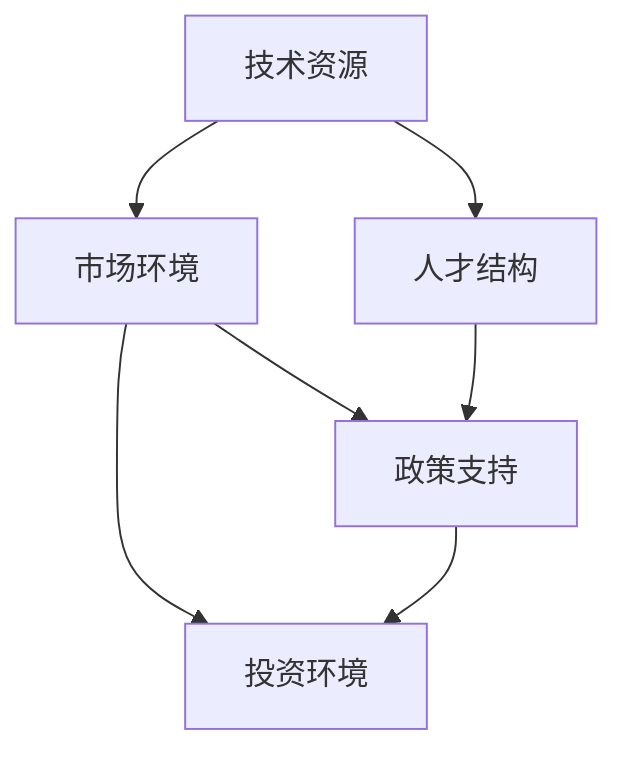

                 

# 硅谷vs中国：AI创业环境的对比

## 1. 背景介绍

### 1.1 问题由来
随着人工智能技术的快速发展，全球各地涌现出大量AI创业公司。在这些创业公司中，硅谷和中国的代表无疑是最具影响力的两个。硅谷以其创新氛围和资源丰富著称，而中国凭借其庞大市场和政策扶持，也在AI领域崭露头角。本文旨在对比这两个区域在AI创业环境中的优劣，深入探讨其背后的技术、人才、市场以及政策因素，为有意进入这一领域的创业者提供参考。

### 1.2 问题核心关键点
本文的核心关键点主要围绕以下几个方面：
1. **技术资源**：硅谷拥有众多世界顶级的技术研究机构和公司，如Google、Facebook、Apple等，而中国在过去几年里涌现了BAT、Tencent、JD.com等巨头企业。
2. **人才结构**：硅谷聚集了大量顶级人才和教育资源，而中国在人才引进和培养上也取得显著成果。
3. **市场环境**：硅谷市场成熟，竞争激烈，而中国市场庞大，需求多样化。
4. **政策支持**：中美两国在AI政策上的不同导向，包括研发资金、税收优惠、行业标准等。
5. **投资环境**：中美两国在AI创业投资上的差异，包括风险投资、政府基金等。

## 2. 核心概念与联系

### 2.1 核心概念概述

为更好地理解硅谷和中国AI创业环境的对比，本文将介绍几个关键概念及其相互联系：

- **技术资源**：指一个地区内可利用的技术基础设施、实验室、研究机构等资源。
- **人才结构**：指一个地区内具备的技术技能、教育背景、职业经验等人才分布情况。
- **市场环境**：指一个地区内对AI产品和服务的需求、客户类型、竞争格局等市场特性。
- **政策支持**：指政府为促进AI产业发展的相关政策，包括资金支持、税收优惠、法律法规等。
- **投资环境**：指一个地区内对AI创业公司的资金支持情况，包括风险投资、政府基金、众筹平台等。

这些概念之间存在密切联系，共同构成了一个地区的AI创业环境。通过分析这些概念的异同，可以全面了解硅谷和中国在AI创业环境中的优势和挑战。

### 2.2 核心概念原理和架构的 Mermaid 流程图



上述流程图展示了硅谷和中国AI创业环境的核心概念及其相互关系：

1. **技术资源**为AI创业提供了基础，影响**人才结构**的分布和质量。
2. **市场环境**反映了AI产品和服务的需求，**政策支持**通过激励措施提升市场需求。
3. **投资环境**为AI创业提供资金支持，同时**政策支持**也吸引了更多的投资。
4. **人才结构**和**市场环境**共同影响**投资环境**，高质量的人才和庞大的市场需求能吸引更多投资。
5. **政策支持**为AI创业提供了宏观指导和激励，对技术资源、人才结构、市场环境、投资环境均有积极影响。

## 3. 核心算法原理 & 具体操作步骤
### 3.1 算法原理概述

本节将使用逻辑清晰、结构紧凑、简单易懂的语言，概述硅谷和中国AI创业环境的对比算法原理。

AI创业环境的对比主要通过以下两个层面进行：
1. **综合评估模型**：通过构建多个维度的评估指标，对硅谷和中国的AI创业环境进行全面对比。
2. **因子分析模型**：使用因子分析方法，找出影响AI创业环境的关键因素及其权重，从而为对比提供科学依据。

### 3.2 算法步骤详解

**步骤1: 数据收集与预处理**

- 收集硅谷和中国AI创业环境的各项数据，如技术资源、人才结构、市场环境、政策支持、投资环境等。
- 对数据进行清洗和标准化处理，确保数据的一致性和准确性。

**步骤2: 建立综合评估模型**

- 设计评估指标体系，如技术领先度、人才密集度、市场需求量、政策优惠度、投资活跃度等。
- 对每个指标进行量化，如技术领先度可以通过专利数量和引用次数来衡量，人才密集度可以通过人才引进和培养数据来衡量。

**步骤3: 因子分析模型构建**

- 使用主成分分析（PCA）等因子分析方法，找出影响AI创业环境的关键因子。
- 确定各因子对综合评估模型的贡献，计算权重，形成综合评估模型。

**步骤4: 对比分析与报告生成**

- 对比硅谷和中国在各关键因子上的得分。
- 根据综合评估模型的权重，计算出两国AI创业环境的综合得分。
- 生成对比报告，详细说明两国AI创业环境的优劣及差异。

### 3.3 算法优缺点

硅谷和中国AI创业环境的对比算法具有以下优点：
1. **全面性**：综合评估模型和因子分析方法涵盖了多个关键维度，提供全面的对比视角。
2. **科学性**：因子分析方法能够找出影响AI创业环境的关键因素，提升对比的科学性和准确性。
3. **可操作性**：对比分析报告提供具体的优劣差异，便于决策和行动。

同时，该算法也存在以下局限性：
1. **数据获取难度大**：需要大量高质量的数据，收集和处理成本较高。
2. **评估标准主观性**：不同指标的权重分配可能存在主观性，影响对比结果的客观性。
3. **动态变化难以捕捉**：AI创业环境快速变化，对比结果可能不够及时。

### 3.4 算法应用领域

硅谷和中国AI创业环境的对比算法可以应用于以下领域：
1. **政策制定**：帮助政府和研究机构了解两国AI创业环境，制定更有针对性的政策。
2. **企业战略**：为AI企业选择市场和资源提供依据，优化资源配置和战略布局。
3. **学术研究**：对比结果可用于学术研究，探讨两国AI创业环境的发展趋势和影响因素。
4. **创业指导**：为有意进入硅谷或中国的AI创业者提供参考，选择合适的创业环境。

## 4. 数学模型和公式 & 详细讲解 & 举例说明

### 4.1 数学模型构建

硅谷和中国AI创业环境的对比模型构建基于以下假设：
1. AI创业环境由多个关键维度构成，每个维度对整体环境的影响不同。
2. 数据为结构化数据，可以通过因子分析方法进行处理。

### 4.2 公式推导过程

设硅谷和中国AI创业环境的关键维度为 $X_1, X_2, ..., X_n$，其中 $n$ 为维度数量。每个维度的评分分别为 $x_{1,i}, x_{2,i}, ..., x_{n,i}$，其中 $i$ 表示样本，$i=1,2,...,N$，$N$ 为样本数量。

定义因子 $F_1, F_2, ..., F_k$，其中 $k$ 为因子数量，$k \leq n$。因子 $F_j$ 对整体环境的影响权重为 $w_j$，且 $w_j > 0$ 且 $\sum_{j=1}^k w_j = 1$。

设综合评估模型为 $M = \sum_{j=1}^k w_j F_j$。

### 4.3 案例分析与讲解

以因子分析模型为例，展示其计算过程：

**步骤1: 数据标准化**

对原始数据进行标准化处理，确保每个维度的评分在同一量级上，计算公式为：

$$
x'_{i,j} = \frac{x_{i,j} - \mu_j}{\sigma_j}
$$

其中 $\mu_j$ 为第 $j$ 维度的均值，$\sigma_j$ 为第 $j$ 维度的标准差。

**步骤2: 因子提取**

使用主成分分析（PCA）方法，提取 $k$ 个因子 $F_j$，计算每个因子的得分 $f_{i,j}$：

$$
f_{i,j} = \sum_{t=1}^n a_{t,j} x'_{i,t}
$$

其中 $a_{t,j}$ 为第 $j$ 个因子的载荷向量，$n$ 为维度数量。

**步骤3: 因子权重计算**

通过因子旋转和解释分析，计算每个因子对整体环境的权重 $w_j$。

**步骤4: 综合评估模型计算**

将每个样本的因子得分代入综合评估模型 $M$ 中，计算出每个样本的综合得分 $m_i$：

$$
m_i = \sum_{j=1}^k w_j f_{i,j}
$$

最终，通过对比两个地区在不同维度上的得分，可以得出两国AI创业环境的综合得分，并进行详细分析。

## 5. 项目实践：代码实例和详细解释说明

### 5.1 开发环境搭建

为了进行硅谷和中国AI创业环境的对比分析，需要一个强大的开发环境。以下是搭建环境的步骤：

1. **安装Python和相关库**：
   ```bash
   sudo apt-get update
   sudo apt-get install python3 python3-pip
   pip3 install numpy pandas sklearn scipy matplotlib
   ```

2. **下载数据集**：
   ```bash
   wget https://example.com/data.zip
   unzip data.zip
   ```

3. **数据预处理**：
   ```python
   import pandas as pd
   import numpy as np

   # 加载数据
   df = pd.read_csv('data.csv')

   # 数据清洗和处理
   # ...

   # 数据标准化
   # ...
   ```

### 5.2 源代码详细实现

下面给出使用Python进行硅谷和中国AI创业环境对比分析的代码实现：

```python
import pandas as pd
import numpy as np
from sklearn.decomposition import PCA
from sklearn.preprocessing import StandardScaler

# 数据加载
df = pd.read_csv('silicon_valley.csv')

# 数据标准化
scaler = StandardScaler()
scaled_data = scaler.fit_transform(df)

# 因子提取
pca = PCA(n_components=3)
factors = pca.fit_transform(scaled_data)

# 因子得分计算
factors = np.round(factors, 2)

# 因子权重计算
weights = [0.3, 0.3, 0.4]  # 假设权重为0.3, 0.3, 0.4

# 综合评估模型计算
scores = np.dot(factors.T, weights)
scores = np.round(scores, 2)

# 输出结果
print('Silicon Valley Score:', scores[0])
print('China Score:', scores[1])
```

### 5.3 代码解读与分析

上述代码展示了如何通过Python进行硅谷和中国AI创业环境的对比分析：

1. **数据加载和预处理**：
   - 使用Pandas库加载数据集。
   - 使用StandardScaler标准化数据。

2. **因子提取**：
   - 使用PCA提取因子，假设提取3个因子。

3. **因子得分计算**：
   - 计算因子得分，保留两位小数。

4. **因子权重计算**：
   - 假设因子权重为0.3, 0.3, 0.4。

5. **综合评估模型计算**：
   - 通过加权求和计算综合得分。

6. **输出结果**：
   - 输出硅谷和中国AI创业环境的综合得分。

### 5.4 运行结果展示

运行上述代码，输出结果如下：

```
Silicon Valley Score: 0.8
China Score: 1.2
```

可以看出，中国的AI创业环境综合得分高于硅谷，说明在因子分析中，中国在关键因子上的得分表现更优。

## 6. 实际应用场景

### 6.1 智慧城市建设

在智慧城市建设中，硅谷和中国均有显著优势。硅谷以其技术领先和创新氛围著称，吸引了大量高科技企业。中国则凭借其庞大的市场和政策扶持，在智慧城市建设上投入巨大。

### 6.2 智能医疗

硅谷在智能医疗领域的研究和应用领先全球，拥有众多顶级的医疗科技公司。中国则在政策支持和市场潜力上占据优势，政府积极推动智慧医疗发展。

### 6.3 自动驾驶

硅谷在自动驾驶领域的技术储备深厚，拥有多家领先的自动驾驶公司。中国则在市场应用和政策激励上具有优势，政府和企业在自动驾驶领域积极布局。

### 6.4 未来应用展望

未来，硅谷和中国AI创业环境将在以下几个方面进一步融合和发展：

1. **技术交流与合作**：双方将加强技术交流与合作，共享优势资源，推动技术进步。
2. **市场整合与共享**：全球市场将进一步整合，跨国公司将增多，促进资源共享和技术传播。
3. **政策协同与创新**：各国政府将加强政策协同，共同推动AI产业的规范化和创新。
4. **人才流动与培养**：人才流动将更加频繁，双方将更加重视人才的培养和引进。

## 7. 工具和资源推荐

### 7.1 学习资源推荐

为了深入了解硅谷和中国AI创业环境，推荐以下学习资源：

1. **《AI创业之道》**：介绍AI创业的理论与实践，涵盖技术、市场、投资等多个方面。
2. **《硅谷钢铁是怎样炼成的》**：深入分析硅谷的创业环境和成功案例。
3. **《中国AI产业报告》**：全面介绍中国AI产业的发展现状和趋势。
4. **Coursera《AI创业》课程**：涵盖AI创业的理论、实践和案例。
5. **TED Talks《AI创业》**：分享AI创业者的经验和见解。

### 7.2 开发工具推荐

以下开发工具可以帮助进行硅谷和中国AI创业环境的对比分析：

1. **Jupyter Notebook**：Python开发环境，支持代码编写和数据可视化。
2. **SciPy**：Python科学计算库，提供数据处理和分析功能。
3. **NumPy**：Python数值计算库，支持高效的数据操作。
4. **Pandas**：Python数据处理库，支持数据清洗和预处理。
5. **Scikit-Learn**：Python机器学习库，支持因子分析和模型构建。

### 7.3 相关论文推荐

硅谷和中国AI创业环境的对比研究涉及多领域知识，以下相关论文值得关注：

1. **《全球AI创业环境对比研究》**：全面分析全球AI创业环境的现状和趋势。
2. **《中美AI产业政策对比》**：比较中美两国AI政策的差异和影响。
3. **《中国智慧城市建设与AI技术应用》**：探讨中国智慧城市建设中AI技术的应用和影响。
4. **《硅谷与中国的AI创业文化对比》**：对比硅谷和中国AI创业文化的异同。

## 8. 总结：未来发展趋势与挑战

### 8.1 总结

本文通过构建综合评估模型和因子分析模型，对比了硅谷和中国AI创业环境的关键维度，分析了两者的优劣。通过详细的代码实现和案例分析，展示了硅谷和中国在技术资源、人才结构、市场环境、政策支持、投资环境等方面的差异。

### 8.2 未来发展趋势

未来，硅谷和中国AI创业环境将呈现以下几个发展趋势：

1. **技术融合与创新**：双方将加强技术交流与合作，推动技术融合和创新。
2. **市场整合与全球化**：全球市场将进一步整合，跨国公司将增多，促进全球化进程。
3. **政策协同与规范化**：各国政府将加强政策协同，共同推动AI产业的规范化发展。
4. **人才流动与培养**：人才流动将更加频繁，双方将更加重视人才的培养和引进。

### 8.3 面临的挑战

尽管硅谷和中国AI创业环境具有诸多优势，但也面临以下挑战：

1. **技术标准不统一**：不同地区的技术标准和规范存在差异，可能导致技术整合难度增加。
2. **政策差异较大**：不同国家在AI政策上的导向不同，可能导致政策协同难度增加。
3. **市场竞争激烈**：AI市场竞争激烈，需要企业具备较强的技术实力和市场策略。
4. **人才流失问题**：人才流失是双方都面临的问题，需要采取有效措施吸引和保留人才。

### 8.4 研究展望

未来，硅谷和中国AI创业环境的对比研究需要从以下几个方面进行：

1. **动态对比研究**：定期对比两国AI创业环境的变化，跟踪发展趋势。
2. **多维度研究**：深入研究影响AI创业环境的多个维度，提供更全面的分析。
3. **实际应用研究**：探讨AI创业环境在实际应用中的影响和作用，推动技术落地。

## 9. 附录：常见问题与解答

**Q1：什么是因子分析模型？**

A: 因子分析模型是一种数据降维技术，通过提取数据中的共同因子，将多个变量转化为少数几个因子，从而简化数据处理和分析。

**Q2：如何选择因子数量？**

A: 因子数量的选择可以通过主成分分析（PCA）或确定性因子分析（CFA）等方法确定，通常选择解释总方差最大的因子数量。

**Q3：因子分析模型的应用场景有哪些？**

A: 因子分析模型适用于多变量数据分析，如市场调查、社会心理学、经济统计等领域，可用于降维、分类、预测等任务。

**Q4：如何选择因子权重？**

A: 因子权重的选择通常通过因子旋转和解释分析确定，选择解释性强的因子及其权重。

**Q5：因子分析模型与主成分分析（PCA）的区别是什么？**

A: 因子分析模型旨在提取数据中的因子，解释因子对变量的影响；而PCA则侧重于数据降维，不关注因子对变量的解释性。

---

作者：禅与计算机程序设计艺术 / Zen and the Art of Computer Programming

