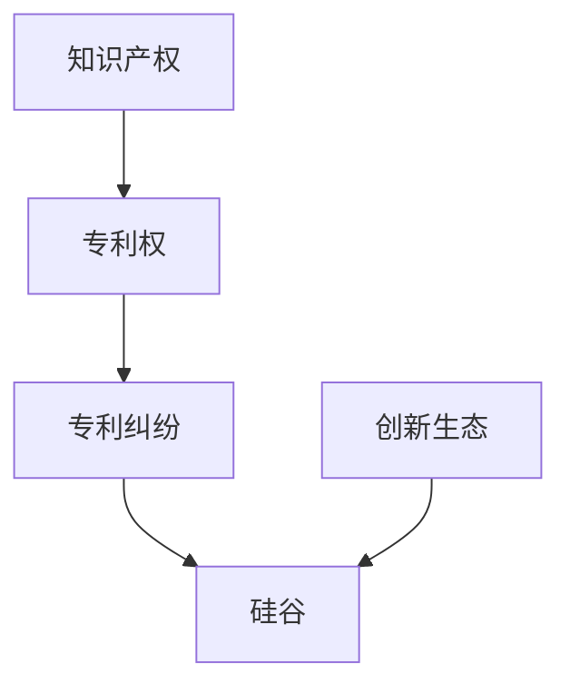

                 

# 硅谷专利纠纷案例:知识产权保护实践

> 关键词：知识产权保护,专利纠纷,硅谷,创新生态,法律框架

## 1. 背景介绍

### 1.1 问题由来
硅谷，作为全球创新和创业的中心，汇聚了众多科技巨头和新兴企业。然而，这个“创新之都”同样面临着激烈的知识产权争夺和频繁的专利纠纷。以Google、Apple、Amazon、Facebook等为代表的科技巨头，在高速发展的过程中，不时陷入专利诉讼的泥潭，给创新生态带来了不小的挑战。

在这一背景下，本文将聚焦于硅谷的专利纠纷案例，深入探讨知识产权保护的理论框架和实践操作，希望能为读者提供有价值的见解和建议。

### 1.2 问题核心关键点
硅谷专利纠纷的核心问题可以归纳为以下几个关键点：

- **知识产权保护的重要性**：知识产权保护是促进创新和商业化的重要机制，能够保障发明者的利益，激励更多的研发投入。
- **专利纠纷频发的根源**：科技发展迅速，新旧技术交替频繁，导致专利权重叠、交叉，引发纠纷。
- **专利保护的法律框架**：了解硅谷专利纠纷的法律框架，有助于理解专利权的具体保护范围和限制。
- **专利纠纷的解决途径**：探索高效的专利纠纷解决机制，如谈判、调解、仲裁和诉讼等，以期减少法律诉讼带来的经济和时间成本。
- **知识产权保护的挑战**：包括如何平衡创新激励和公共利益、应对全球化带来的挑战、以及如何适应不断变化的技术环境。

这些关键点将构成本文的核心框架，帮助读者全面理解硅谷专利纠纷的背景和解决方案。

## 2. 核心概念与联系

### 2.1 核心概念概述

为更好地理解硅谷专利纠纷案例，本节将介绍几个密切相关的核心概念：

- **知识产权（Intellectual Property, IP）**：指创造者的发明、文学和艺术作品以及其他智慧成果所享有的法律保护权利。包括专利权、商标权、版权、商业秘密等。
- **专利权（Patent Rights）**：指发明者对其发明的技术方案所享有的独占使用权，保护期限一般为20年。
- **专利纠纷（Patent Litigation）**：指专利权的侵犯和反侵权行为引起的法律争议。
- **硅谷（Silicon Valley）**：指美国加利福尼亚州旧金山湾区南部的一块区域，以高科技产业和创新文化著称。
- **创新生态（Innovation Ecosystem）**：指由企业、研究机构、政府、法律和资本等要素共同构成的创新环境。

这些核心概念之间的逻辑关系可以通过以下Mermaid流程图来展示：

这个流程图展示了一组关键概念的相互关系：

1. 知识产权是专利权的上位概念，专利权是知识产权的一种具体形式。
2. 专利纠纷源自专利权的实施和保护。
3. 硅谷作为技术创新的集聚地，专利纠纷频发，影响创新生态。
4. 创新生态由知识产权保护环境支撑，包含法律、企业、资本等多元要素。

## 3. 核心算法原理 & 具体操作步骤
### 3.1 算法原理概述

硅谷专利纠纷的解决主要依赖于法律框架和程序。核心原理包括：

- **专利有效性（Patent Validity）**：指一项专利是否符合法律规定的授权条件，如新颖性、非显而易见性、工业适用性等。
- **专利侵权（Patent Infringement）**：指未经专利权人许可，使用、销售、制造、进口专利产品或专利方法的行为。
- **专利权保护范围（Patent Scope）**：指专利权覆盖的技术领域和具体细节。
- **先发明制（First-to-Invent）与先申请制（First-to-File）**：决定专利权归属的原则，前者关注发明创造的时间先后，后者关注专利申请的时间先后。

### 3.2 算法步骤详解

解决硅谷专利纠纷的基本步骤如下：

**Step 1: 收集证据**

- **专利文献**：收集专利说明书、权利要求书等专利文献，理解发明的技术方案和保护范围。
- **商业活动证据**：收集被告的产品、广告、销售记录等，证明专利技术被使用。

**Step 2: 分析证据**

- **专利有效性分析**：分析专利权是否有效，是否存在优先权冲突、无效宣告等情形。
- **专利侵权分析**：对比专利权保护范围和被告产品的具体实现，判断是否构成侵权。

**Step 3: 提出诉求和辩解**

- **法律诉求和赔偿请求**：根据证据分析结果，明确专利侵权的诉求和赔偿金额。
- **法律辩解**：提出合法性辩解，如反驳对方专利的有效性，证明自身技术的独立研发。

**Step 4: 选择解决途径**

- **谈判**：双方直接协商解决，达成和解协议。
- **调解**：由独立的第三方调解，达成和解协议。
- **仲裁**：提交仲裁机构裁决。
- **诉讼**：在法院提起专利侵权诉讼。

**Step 5: 执行和监督**

- **执行和解或胜诉判决**：执行和解协议或胜诉判决，获取赔偿。
- **法律监督**：关注对方是否履行义务，提供法律救济。

### 3.3 算法优缺点

硅谷专利纠纷解决机制的优势在于：

- **高效**：通过谈判和调解，可以快速解决纠纷，减少诉讼时间和成本。
- **灵活**：各方可以灵活调整解决策略，避免诉讼风险。
- **权威**：法院判决具有法律约束力，保障胜诉方的合法权益。

但同时也存在以下缺点：

- **成本高**：尤其是诉讼过程，涉及高昂的律师费和诉讼费。
- **时间久**：法律程序繁琐，周期长，影响企业正常运营。
- **法律风险**：判决可能不符合预期，造成不必要的损失。

### 3.4 算法应用领域

硅谷专利纠纷解决机制在以下领域得到广泛应用：

- **高科技企业**：如Google、Apple、Amazon等，常涉及复杂的专利技术和市场竞争。
- **初创企业**：技术创新快速，专利纠纷频发。
- **跨国公司**：涉及多国法律和市场，需要协调不同国家的法律程序。
- **科研机构**：保护研究成果，维护知识产权。

这些领域对专利纠纷解决机制的需求迫切，硅谷的成功经验和案例值得借鉴。

## 4. 数学模型和公式 & 详细讲解 & 举例说明

由于硅谷专利纠纷案例主要涉及法律和商业操作，不涉及复杂的数学模型和公式，本节将通过具体案例进行详细讲解。

### 4.1 数学模型构建

专利纠纷案例通常不涉及数学模型构建，但在法律分析和计算赔偿金额时，会使用到一些数学概念。例如，在计算专利侵权赔偿时，会考虑专利权的经济价值、侵权行为的严重程度、被告的故意或过失等因素。

### 4.2 公式推导过程

由于专利纠纷涉及的法律因素复杂，不适用于公式推导。但可以简要说明一些法律评估的方法，如考虑市场份额、利润率、销售量等经济指标，来估算专利权的经济价值。

### 4.3 案例分析与讲解

以Google与Apple的专利纠纷为例，探讨专利权无效和专利侵权的法律分析：

**案例背景**：
Google和Apple曾因Google地图应用中的搜索算法陷入专利纠纷。

**法律分析**：
1. **专利有效性**：Google申请的专利是否符合新颖性、非显而易见性等授权条件。
2. **专利侵权**：Google的搜索算法是否落入Apple专利权的保护范围内。
3. **赔偿金额**：根据专利权的经济价值和侵权行为的严重程度，计算赔偿金额。

**案例结论**：
经过法院审理，最终判决Google胜诉，认为其专利权有效，搜索算法不构成专利侵权。

## 5. 项目实践：代码实例和详细解释说明

由于硅谷专利纠纷案例主要涉及法律和商业操作，不涉及具体的代码实现，本节将不展开代码实例和分析。

## 6. 实际应用场景
### 6.1 智能客服系统

智能客服系统在处理用户问题时，需要合理处理用户请求，避免侵犯他人专利权。例如，当用户咨询涉及专利技术时，客服应仔细核查专利有效性，并避免使用侵权技术。

### 6.2 金融舆情监测

金融舆情监测系统在分析市场动态时，需要考虑专利权的风险，避免侵犯他人专利权，同时关注自身专利权的保护。

### 6.3 个性化推荐系统

个性化推荐系统需要合理处理用户数据，避免侵犯他人专利权。例如，在处理用户反馈时，需要核对涉及的专利权是否有效。

### 6.4 未来应用展望

硅谷专利纠纷案例的解决机制对其他地区的知识产权保护有重要借鉴意义。未来，随着全球化和技术创新的加速，各国需要不断完善专利法律框架，建立高效的专利纠纷解决机制，促进公平竞争和技术创新。

## 7. 工具和资源推荐
### 7.1 学习资源推荐

- **《硅谷专利法》**：详细解读硅谷专利纠纷的法律法规。
- **WTO TRIPS协议**：了解全球专利保护的国际标准和规则。
- **美国专利商标局（USPTO）网站**：提供丰富的专利申请和检索资源。
- **专利数据库**：如PatentSpan、GIP Atlas等，用于检索专利文献和分析专利状态。

### 7.2 开发工具推荐

- **法律数据库**：如Lex Machina，提供专利和法律案例的数据库查询和分析功能。
- **专利检索工具**：如PatentScope，用于检索和评估专利有效性。
- **法律咨询平台**：如Rocket Lawyer，提供在线法律咨询和解决方案。

### 7.3 相关论文推荐

- **《硅谷的知识产权保护与竞争》**：探讨硅谷专利纠纷的成因和解决机制。
- **《全球化下的专利法律挑战》**：分析全球化对专利法律框架的影响。
- **《专利权保护与企业创新》**：探讨专利权保护对企业创新的激励作用。

## 8. 总结：未来发展趋势与挑战
### 8.1 研究成果总结

本文通过详细分析硅谷专利纠纷案例，探讨了知识产权保护的重要性和专利纠纷的解决机制。硅谷的成功经验为其他地区提供了宝贵的参考。

### 8.2 未来发展趋势

硅谷专利纠纷解决机制的未来发展趋势包括：

- **法律框架完善**：不断更新和完善专利法律框架，适应技术创新的需求。
- **国际化**：在全球范围内建立统一的专利保护标准，促进跨国公司的公平竞争。
- **技术中立性**：在专利审查和侵权判断中，强调技术中立，避免不必要的法律争端。

### 8.3 面临的挑战

硅谷专利纠纷解决机制面临的挑战包括：

- **法律环境复杂**：不同国家和地区的法律环境差异较大，增加了跨国公司的法律风险。
- **专利申请量大**：全球专利申请量不断增加，增加了专利审查和侵权判断的复杂性。
- **市场竞争激烈**：高科技企业之间的竞争激烈，专利纠纷频发。

### 8.4 研究展望

未来，硅谷专利纠纷解决机制需要在以下几个方面进行研究：

- **法律和技术结合**：探索如何利用大数据、人工智能等技术手段，提高专利审查和侵权判断的效率和准确性。
- **多方协作**：加强政府、企业和法律机构的协作，共同推动专利纠纷的解决。
- **教育和培训**：提高企业和技术人员的知识产权保护意识，避免不必要的法律风险。

## 9. 附录：常见问题与解答

**Q1：如何判断一项专利是否有效？**

A: 判断一项专利是否有效，通常需要进行专利有效性审查，包括新颖性、非显而易见性、工业适用性等。这些审查通常由专利审查机构完成。

**Q2：如何避免专利侵权？**

A: 避免专利侵权，需要了解竞争对手的专利技术，避免使用可能侵犯他人专利权的技术。同时，及时申请专利保护，并定期评估专利的有效性和侵权风险。

**Q3：专利纠纷解决有哪些途径？**

A: 专利纠纷解决途径包括谈判、调解、仲裁和诉讼等。需要根据具体情况选择最合适的解决途径，以期快速高效地解决纠纷。

**Q4：如何评估专利权的经济价值？**

A: 评估专利权的经济价值，通常需要考虑专利的市场份额、利润率、销售量等因素。同时，可以参考专利侵权案件的赔偿金额，作为参考依据。

**Q5：如何应对跨国专利纠纷？**

A: 应对跨国专利纠纷，需要了解不同国家的专利法律和保护标准，寻求当地法律机构的帮助，进行跨国的法律协调和解决。

---

作者：禅与计算机程序设计艺术 / Zen and the Art of Computer Programming

